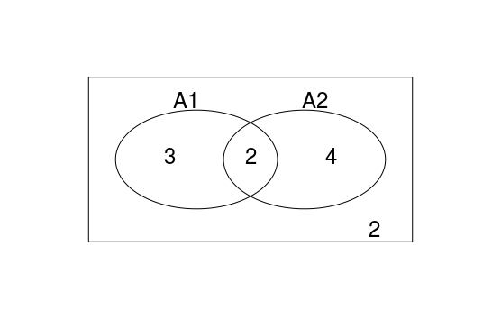
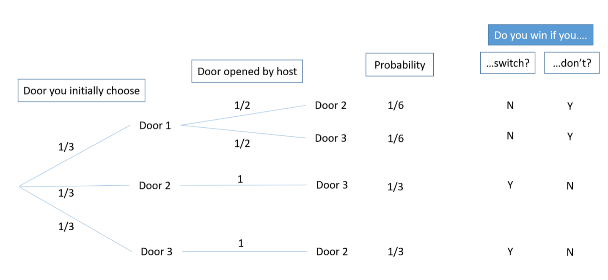

\mainmatter

# (PART) 概率論 Probability {-}


# 概率論入門：定義與公理 {#intro}

> Statistics - A subject which most statisticians find difficult but which many physicians are experts on.
> ~ Stephen S. Senn

```{block2, note-thankElizabeth, type='rmdnote'}
The Probability lectures were orgainised and taught by Professor [Elizabeth Williamson](https://www.lshtm.ac.uk/aboutus/people/williamson.elizabeth).
```


## 三個概率公理：

1. 對於任意事件 $A$，它發生的概率 $P(A)$ 滿足這樣的不等式： $0 \leqslant P(A) \leqslant 1$
2. $P(\Omega)=1$ , $\Omega$ 是全樣本空間 (total sample space)
2. 對於互斥（相互獨立）的事件 $A_1, A_2, \dots, A_n$ 有如下的等式關係： $P(A_1\cup A_2 \cup \cdots \cup A_n)=P(A_1)+P(A_2)+\cdots+P(A_n)$


你是不是覺得上面三條公理都是**廢話**。
不用擔心，我也是這麼覺得的。因爲所有人都認同的道理，才能成爲公理 (axiom)，因爲它們是不需要證明的自然而然形成的人人都接受的觀念。`(axiom: a saying that is widely accepted on its own merits; its truth is assumed to be self-evident)`

然而，正是這樣顯而易見的道理，確是拿來建築理論的基石，千萬不能小看了他們。例如，我們看下面這個看似也應該成爲公理的公式，你能證明嗎：

$P(A_1\cup A_2) = P(A_1) + P(A_2) - P(A_1 \cap A_2)$

```{r vennDiagram, eval=FALSE, message=FALSE, warning=FALSE, include=FALSE, cache=TRUE}
## 生成 Venn Diagram 的 R 代碼
g <- cbind(
  A1 = c(rep(0, 4), rep(1, 5)),
  A2 = c(rep(1, 6), rep(0, 5)))
d <- vennCounts(g)
vennDiagram(d)
```

```{r probability00, cache=TRUE,echo=FALSE, fig.asp=.7, fig.width=6, fig.align='center', out.width='90%'}

```


**證明：**

先考慮 $A_1 \cup A_2$ 是什麼（拆分成三個互斥事件）

$A_1 \cup A_2 = (A_1\cap \bar{A_2})\cup(\bar{A_1}\cap A_2)\cup(A_1\cap A_2)$

運用上面的公理~~2~~ 3

$\therefore P(A_1 \cup A_2) = P(A_1\cap \bar{A_2}) + P(\bar{A_1}\cap A_2) + P(A_1\cap A_2) \;\;\;\;\;\;(1)$

再考慮 $A_1=(A_1\cap A_2)\cup(A_1\cap\bar{A_2})$ 繼續拆分成兩個互斥事件

$\therefore P(A_1)=P(A_1\cap A_2)+P(A_1\cap\bar{A_2})$ 整理一下：

$P(A_1\cap\bar{A_2})=P(A_1)-P(A_1\cap A_2)$

同理可得: $P(\bar{A_1}\cap A_2)=P(A_2)-P(A_1\cap A_2)$

代入上面第(1)式可得：

$$
\begin{aligned}
P(A_1 \cup A_2) &= P(A_1)-P(A_1\cap A_2)\\
                &\;\;+ P(A_2)-P(A_1\cap A_2)\\
                &\;\;+P(A_1\cap A_2)\\
                &=P(A_1) + P(A_2) - P(A_1 \cap A_2)
\end{aligned}
$$


## 條件概率 Conditional probability {#conditonalProb}

- $P(A|S)=\frac{P(A\cap S)}{P(S)}$
- $P(A\cap S) = P(A|S)P(S)$

## 獨立 (independence) 的定義

- 兩個事件定義爲互爲獨立時 ($A$ and $B$ are said to be independent **if and only if**)
$$P(A\cap B)=P(A)P(B)$$
- 因爲從條件概率的概念我們已知<br> $P(A\cap B) = P(A|B)P(B)$ <br>所以$P(A|B)=P(A)$ 即：事件 $B$ 無法提供事件 $A$ 的任何有效訊息 (**$A, B$ 互相獨立**)

## 賭博問題
終於來到本次話題的"重點"了。

```{r probability01, cache=TRUE, echo=FALSE, fig.asp=.7, fig.width=6, fig.align='center', out.width='90%'}
knitr::include_graphics("img/Selection_071.png")
```


假設你在一個電視遊戲節目。有上圖一樣的三扇門。其中一扇門後面有一輛保時捷，另兩扇門後面則是[(味道奇特的)山羊](https://winterwang.github.io/post/black-meal/)。遊戲規則是主持人會讓你先選擇其中一扇門（先不打開你選的這扇門）。主持人隨後打開另外兩扇門中的一扇沒有保時捷的門。主持人問你，你要堅持選擇之前選中的那扇門，還是要改變主意換一扇門去猜是否可以猜中保時捷。
請問，堅持選擇之前選中的門猜中保時捷的概率高，還是主持人打開一扇門以後改變主意猜中保時捷的概率更高呢？


## 賭博問題的答案


**答案是：必須改變主意才能提高中獎概率。**


上述情況下，最簡單的是用概率樹 (probability tree) 來做決定：

```{r probability02, cache=TRUE, echo=FALSE, fig.asp=.7, fig.width=6, fig.align='center', out.width='90%'}

```


解說一下：

- 假定保時捷在1號門後，你第一次選擇了1號門，那麼此時主持人可以任意打開2號或者三號門（因爲他們後面都沒有保時捷）。
- 假定保時捷在1號門後，你第一次選了2號門，那麼此時主持人只能打開3號門（因爲一號門後是保時捷，按照遊戲規則主持人不能打開）。
- 假定保時捷在1號門後，你第一次選了3號門，那麼此時主持人只能打開2號門（因爲一號門後是保時捷，按照遊戲規則主持人不能打開）。

所以按照圖中給出的計算概率樹的過程可以得到:

$$P[change]=\frac{1}{3}+\frac{1}{3}=\frac{2}{3}\\
P[not\; change]=\frac{1}{6}+\frac{1}{6}=\frac{1}{3}$$

你是否選擇了改變主意了呢？


# Bayes 貝葉斯理論的概念 {#Bayes-Definition}

許多時候，我們需要將概率中的條件相互對調。
例如：
在已知該人羣中有20%的人有吸菸習慣($P(S)$)，吸菸的人有9%的概率有哮喘($P(A|S)$)，不吸菸的人有7%的概率有哮喘($P(A|\bar{S})$)的前提下，有個人前來門診，發現是哮喘患者，那麼這個人有多大的概率是一個菸民？也就是要求 $P(S|A)$

這裏先引入貝葉斯的概念：

我們可以將 $P(A\cap S)$ 寫成：
$$P(A\cap S)=P(A|S)P(S)\\or\\
P(A\cap S)=P(S|A)P(A)$$
這兩個等式是完全等價的。我們將他們連起來：

$$P(S|A)P(A)=P(A|S)P(S)\\
\Rightarrow P(S|A)=\frac{P(A|S)P(S)}{P(A)}$$

是不是看起來又像是寫了一堆**廢話**？
沒錯，你看出來是一堆廢話的時候，證明你也同意這背後的簡單邏輯。

再繼續，我們可以利用另外一個**廢話**：

$$
\because S+\bar{S}=1\\ 
\therefore P(A)=P(A\cap S)+P(A\cap\bar{S})
$$

用上面的公式替換掉 

$$
P(A\cap S)+P(A\cap\bar{S}） \\
\therefore P(A)=P(A|S)P(S)+P(A|\bar{S})P(\bar{S})
$$

可以得到**貝葉斯理論公式**：

$$P(S|A)=\frac{P(A|S)P(S)}{P(A|S)P(S)+P(A|\bar{S})P(\bar{S})}$$

回到上面說到的哮喘人中有多少比例吸菸的問題。可以繼續使用概率樹來方便的計算：

```{r probability03, cache=TRUE, echo=FALSE, fig.asp=.7, fig.width=6, fig.align='center', out.width='90%'}
knitr::include_graphics("img/Selection_073.png")
```


\begin{align}
P(S|A) &= \frac{P(A|S)P(S)}{P(A|S)P(S)+P(A|\bar{S})P(\bar{S})} \\
        &= \frac{0.09\times0.2}{0.09\times0.2+0.07\times0.8} \\
        &= 0.24
\end{align}

所以我們的結論就是，在已知該人羣中有20%的人有吸菸習慣($P(S)$)，吸菸的人有9%的概率有哮喘($P(A|S)$)，不吸菸的人有7%的概率有哮喘($P(A|\bar{S})$)的前提下，有個人前來門診，發現是哮喘患者，那麼這個人有24% 的概率是一個菸民($P(S|A)$)。


# 期望 Expectation (或均值 or mean) 和 方差 Variance


期望（或均值）是用來描述一組數據中心位置的指標（另一個是中位數 Median）。
對於離散型隨機變量 $X$ (discrete random variables)，它的期望被定義爲：

$$E(X)=\sum_x xP(X=x)$$

所以就是將所有 $X$ 可能取到的值乘以相應的概率後求和。這個期望（或均值）常常用希臘字母 $\mu$ 來標記。

方差 Variance 是衡量一組數據變化幅度(dispersion/variability)的指標之一。 方差的定義是：

$$Var(X)=E((X-\mu)^2)\\\text{Where, }\mu=E(x)$$

實際上我們更加常用的是它的另外一個公式：

$$Var(X)=E(X^2)-E(X)^2$$

**證明 上面兩個方差公式相等**

$$
\begin{align}
Var(x)  &= E((X-\mu)^2) \\
        &= E(X^2-2X\mu+\mu^2)\\
        &= E(X^2) - 2\mu E(X) + \mu^2\\
        &= E(X^2) - 2\mu^2 + \mu^2 \\
        &= E(X^2) - \mu^2 \\
        &= E(X^2) - E(X)^2
\end{align}
$$

## 方差的性質：

1. $Var(X+b)=Var(X)$
2. $Var(aX)=a^2Var(X)$
3. $Var(aX+b)=a^2Var(X)$


# 伯努利分佈 Bernoulli distribution {#bernoulli}

伯努利分佈，說的就是一個簡單的二分變量 (1, 0)，它取1時的概率如果是 $\pi$。那麼我們可以計算這個分佈的期望值:

$$
\begin{align}
E(X) &=\sum_x xP(X=x) \\
     &=1\times\pi + 0\times(1-\pi)\\
     &=\pi
\end{align}
$$

由於 $x=x^2$，因爲 $x=0,1$, 所以 $E[X^2]=E[X]$，那麼方差爲：

$$
\begin{align}
Var(X) &=E[X^2]-E[X]^2 \\
       &=E[X]-E[X]^2 \\
       &=\pi - \pi^2 \\
       &=\pi(1-\pi)
\end{align}
$$

**證明，$X,Y$ 爲互爲獨立的隨機離散變量時，<br>a) $E(XY)=E(X)E(Y)$ ; <br>b) $Var(X+Y)=Var(X)+Var(Y)$**

- a) **證明**

$$
\begin{align}
E(XY) &= \sum_x\sum_y xyP(X=x, Y=y) \\
\because &\; X,Y are\;independent\;to\;each\;other \\
\therefore &= \sum_x\sum_y xyP(X=x)P(Y=y)\\
      &=\sum_x xP(X=x)\sum_y yP(Y=y)\\
      &=E(X)E(Y)
\end{align}
$$


- b) **證明**
根據方差的定義：

$$
\begin{align}
Var(X+Y) &= E((X+Y)^2)-E(X+Y)^2 \\
         & \; Expand \\
         &=E(X^2+2XY+Y^2)-(E(X)+E(Y))^2\\
         &=E(X^2)+E(Y^2)+2E(XY)\\
         &\;\;\; - E(X)^2-E(Y)^2-2E(X)E(Y)\\
         &\; We\;just\;showed\; E(XY)=E(X)E(Y)\\
         &=E(X^2)-E(X)^2+E(Y^2)-E(Y)^2 \\
         &=Var(X)+Var(Y)
\end{align}
$$


# 二項分佈的概念 Binomial distribution {#binomial}

二項分佈在醫學研究中至關重要，一組二項分佈的數據，指的通常是 $n$ 次相互獨立的[成功率爲 $\pi$ 的伯努利實驗](https://winterwang.github.io/post/probability2-4/) ($n$ independent Bernoulli trials) 中成功的次數。

當 $X$ 服從二項分佈，記爲 $X \sim binomial(n, \pi)$ 或$X \sim bin(n, \pi)$。它的(第 $x$ 次實驗的)概率被定義爲：

$$
\begin{align}
P(X=x) &= ^nC_x\pi^x(1-\pi)^{n-x} \\
       &= \binom{n}{x}\pi^x(1-\pi)^{n-x} \\
       & for\;\; x = 0,1,2,\dots,n
\end{align}
$$

## 二項分佈的期望和方差

- 期望 $E(X)$
    - 若 $X \sim bin(n,\pi)$，那麼 $X$ 就是這一系列獨立伯努利實驗中成功的次數。
    - 用 $X_i, i =1,\dots, n$ 標記每個相互獨立的伯努利實驗。
    - 那麼我們可以知道 $X=\sum_{i=1}^nX_i$。

$$
      \begin{align} E(X) &= E(\sum_{i=1}^nX_i)\\
                         &= E(X_1+X_2+\cdots+X_n) \\
                         &= E(X_1)+E(X_2)+\cdots+E(X_n)\\
                         &= \sum_{i=1}^nE(X_i)\\
                         &= \sum_{i=1}^n\pi \\
                         &= n\pi
      \end{align}
$$

- 方差 $Var(X)$

$$
\begin{align}
Var(X) &= Var(\sum_{i=1}^nX_i) \\
        &= Var(X_i+X_2+\cdots+X_n) \\
        &= Var(X_i)+Var(X_2)+\cdots+Var(X_n) \\
        &= \sum_{i=1}^nVar(X_i) \\
        &= n\pi(1-\pi) \\
\end{align}
$$

## 超幾何分佈 hypergeometric distribution {#hyperdist}

假設我們從總人數爲 $N$ 的人羣中，採集一個樣本 $n$。假如已知在總體人羣中($N$)有 $M$ 人患有某種疾病。請問採集的樣本 $X=n$ 中患有這種疾病的人，服從怎樣的分佈？

- 從人羣($N$)中取出樣本($n$)，有 $^NC_n$ 種方法。
- 從患病人羣($M$)中取出患有該病的人($x$)有 $^MC_x$ 種方法。
- 樣本中不患病的人($n-x$)被採樣的方法有 $^{N-M}C_{n-x}$ 種。
- 採集一次 $n$ 人作爲樣本的概率都一樣。因此：

$$P(X=x)=\frac{\binom{M}{x}\binom{N-M}{n-x}}{\binom{N}{n}}$$


## 樂透中獎概率問題：

- 從數字 $1\sim59$ 中選取 $6$ 個任意號碼
- 開獎時從 $59$ 個號碼球中隨機抽取 $6$ 個
- 如果六個號碼全部猜中(不分順序)，你可以成爲百萬富翁。請問一次猜中全部 $6$ 個號碼的概率是多少？

從 $59$ 個號碼中隨機取出任意 $6$ 個號碼的方法有 $^{59}C_6$ 種。
$$^{59}C_6=\frac{59!}{6!(59-6)!}=45,057,474$$

每次選取六個號碼做爲一組的可能性相同，所以，你買了一組樂透號碼，能中獎的概率就是 $1/45,057,474 = 0.00000002219$。你還會再去買彩票麼？

### 如果我只想中其中的 $3$ 個號碼，概率有多大？

用超幾何分佈的概率公式：

$$
\begin{align}
P(X=3) &= \frac{^6C_3\times ^{53}C_3}{^{59}C_6} \\
       &= 0.010
\end{align}
$$


你有 $1\%$ 的可能中獎。換句話說，如果中三個以上的數字算中獎的話，你買的彩票中獎的概率低於 $1\%$。是不是覺得下次送錢給博彩公司的時候還不如跟我一起喝一杯咖啡划算？


# 泊松分佈 Poisson Distribution {#poisson}

- 當一個事件，在一段時間 ($T$) 中可能發生的次數是 $\lambda$ 。那麼我們可以認爲，經過時間 $T$，該事件發生的期望次數是 $E(X)=\lambda T$。
- 利用微分思想，將這段時間 $T$ 等分成 $n$ 個時間段，當 $n\rightarrow\infty$ 直到每個微小的時間段內最多發生一次該事件。

那麼

- 每個微小的時間段，可以視爲是一個伯努利實驗（有事件發生或者沒有）
- 那麼這整段時間 $T$ 內發生的事件可以視爲是一個二項分佈實驗。

令 $X=$ 一次事件發生時所經過的所有時間段。

- $X \sim Bin(n, \pi)$，其中 $n\rightarrow\infty$，$n$ 爲時間段。
- 在每個分割好的時間段內，事件發生的概率都是：$\pi=\frac{\lambda T}{n}$
- 期望 $\mu=\lambda T \Rightarrow \pi=\mu/n$
- 所以 $X$ 的概率方程就是：

$$
\begin{align}
P(X=x) &= \binom{n}{x}\pi^x(1-\pi)^{n-x} \\
       &= \binom{n}{x}(\frac{\mu}{n})^x(1-\frac{\mu}{n})^{n-x} \\
       &= \frac{n!}{x!(n-x)!}(\frac{\mu}{n})^x(1-\frac{\mu}{n})^{n-x} \\
       &=\frac{n!}{n^x(n-x)!}\frac{\mu^x}{x!}(1-\frac{\mu}{n})^{n-x}\\
\text{when}\; n\rightarrow\infty   &\; x \ll n\\
\frac{n!}{n^x(n-x)!} &=\frac{n(n-1)\dots(n-x+1)}{n^x} \rightarrow 1\\
(1-\frac{\mu}{n})^{n-x} &\approx  (1-\frac{\mu}{n})^n \rightarrow e^{-\mu}\\
\text{the probability function } & \text{ of a Poisson distribution}   \\
P(X=x) &\rightarrow \frac{\mu^x}{x!}e^{-\mu}
\end{align}
$$


當數據服從泊松分佈時，記爲 $X\sim Poisson(\mu=\lambda T)\;\; or\;\; X\sim Poi(\mu)$

**證明泊松分佈的參數特徵：**

1. $E(X)=\mu$

$$
\begin{align}
E(X)  &=  \sum_{x=0}^\infty xP(X=x) \\
      &=  \sum_{x=0}^\infty x\frac{\mu^x}{x!}e^{-\mu} \\
      &= 0+ \sum_{x=1}^\infty x\frac{\mu^x}{x!}e^{-\mu} \\
      &=  \sum_{x=1}^\infty \frac{\mu^x}{(x-1)!}e^{-\mu} \\
      &=  \mu\sum_{x=1}^\infty \frac{\mu^{x-1}}{(x-1)!}e^{-\mu} \\
replace\; &x\; with\; all\; i=x-1 \\
      &=  \mu\sum_{i=0}^\infty \frac{\mu^{i}}{i!}e^{-\mu} \\
notice\; that\; &the\; right\; side \sum_{i=0}^\infty \frac{\mu^{i}}{i!}e^{-\mu}=1 is \\
the\;sum\;of\;all\;&probability\;of\;a\;Poisson\;distribution\\
      &= \mu
\end{align}
$$

2. $Var(x)=\mu$
爲了找到 $Var(X)$，我們用公式 $Var(X)=E(X^2)-E(X)^2$

我們需要找到 $E(X^2)$

$$
\begin{align}
E(X^2) &= \sum_{x=0}^\infty x^2\frac{\mu^x}{x!}e^{-\mu} \\
       &= \mu \sum_{x=1}^\infty x\frac{\mu^{x-1}}{(x-1)!}e^{-\mu} \\
replace\; &x\; with\; all\; i=x-1 \\
       &= \mu \sum_{i=0}^\infty (i+1)\frac{\mu^{i}}{i!}e^{-\mu} \\
       &= \mu(\sum_{i=0}^\infty i\frac{\mu^i}{i!}e^{-\mu} + \sum_{i=0}^\infty \frac{\mu^i}{i!}e^{-\mu}) \\
       &= \mu(E(X)+1) \\
       &= \mu^2+\mu \\
Var(X) &= E(X^2) - E(X)^2 \\
       &= \mu^2 + \mu -\mu^2 \\
       &= \mu
\end{align}
$$


# 正態分佈

## 概率密度曲線 probability density function， PDF
- 一個隨機連續型變量 $X$ 它的性質由一個對應的**概率密度方程 (probability density function, PDF)** 決定。

- 在給定的範圍區間內，如 $a\sim b, (a < b)$，它的概率滿足:

$$P(a\leqslant X \leqslant b) = \int_a^bf(x)dx$$

- 這個相關的方程，在 $a\sim b$ 區間內的積分，就是這個連續變量在這個區間內取值的概率。

```{r PDF-standard, fig.asp=.7, fig.width=6, fig.cap='Probability Density Function of a Standard Normal Distribution', fig.align='center', out.width='90%', cache=TRUE}
# R codes for drawing a standard normal distribution by using ggplot2
p <- ggplot(data.frame(x=c(-3,3)), aes(x=x)) +
  stat_function(fun = dnorm)
p + annotate("text", x=2, y=0.3, parse=TRUE, label="frac(1, sqrt(2*pi)) * e ^(-z^2/2)") +
  theme(plot.subtitle = element_text(vjust = 1),
        plot.caption = element_text(vjust = 1),
        axis.text.x = element_text(size = 12),
        axis.text.y = element_text(size = 12),
        plot.title = element_text(size = 10, face = "bold", hjust = 0.5),
        panel.background = element_rect(fill = "ivory")) +
  labs(title = "Probability density functions \n for standard normal distribution",
       x = NULL, y = NULL) +
  stat_function(fun = dnorm,
                xlim = c(-1.3,0.4),
                geom = "area",fill="#00688B", alpha= 0.2)
```

注意：整個方程的曲線下面積等於 $1$：
$$\int_{-\infty}^\infty f(x)dx=1$$


- 期望 $E(X)=\int_{-\infty}^\infty xf(x)dx$
- 方差 $Var(X)=\int_{-\infty}^\infty (x-\mu)^2f(x)dx$


## 正態分佈

如果一組數據服從正態分佈，我們通常用它的期望（或者叫平均值）$\mu$，和它的方差 $\sigma^2$，來描述這組數據。記爲：

$$X \sim N(\mu, \sigma^2)$$

- 它的概率密度方程可以表述爲：

$$f(x)=\frac{1}{\sqrt{2\pi\sigma^2}}exp(-\frac{(x-\mu)^2}{2\sigma^2})$$

- $E(x) =\mu$
- $Var(x)=\sigma^2$

## 標準正態分佈 {#standardNormal}
標準正態分佈的期望（或者均值）爲 $0$，方差爲 $1$

- 記爲：$Z \sim N(0,1)$
- 它的概率密度方程表述爲：

$$\frac{1}{\sqrt{2\pi}}exp(-\frac{z^2}{2})$$

- 它的累積分佈方程 (cumulative distribution function， CDF)，是將概率密度方程 (PDF) 積分以後獲得的方程。通常我們記爲 $\Phi(z)$

再看一下標準正態分佈的概率密度方程曲線：

```{r PDF-standard2, echo=FALSE, fig.asp=.7, fig.width=6, fig.cap='Probability Density function of a Standard Normal Distribution', fig.align='center', out.width='90%', cache=TRUE}
# R codes for drawing a standard normal distribution by using ggplot2
p <- ggplot(data.frame(x=c(-3,3)), aes(x=x)) +
  stat_function(fun = dnorm)
p + annotate("text", x=2, y=0.3, parse=TRUE, label="frac(1, sqrt(2*pi)) * e ^(-z^2/2)") +
  annotate("text", x=2.6, y=0.08, parse=TRUE, label=" Phi(1.96) == 0.975 ") +
  annotate("text", x=-2.8, y=0.08, parse=TRUE, label=" Phi(-1.96) == 0.025 ") +
  theme(plot.subtitle = element_text(vjust = 1),
        plot.caption = element_text(vjust = 1),
        axis.text.x = element_text(size = 12),
        axis.text.y = element_text(size = 12),
        plot.title = element_text(size = 10, face = "bold", hjust = 0.5),
        panel.background = element_rect(fill = "ivory")) +
  labs(title = "Probability density function \n for standard normal distribution",
       x = NULL, y = NULL) +
  stat_function(fun = dnorm,
                xlim = c(-3.5,-1.96),
                geom = "area",fill="#00688B", alpha= 0.2) +
  stat_function(fun = dnorm,
                xlim = c(1.96, 3.5),
                geom = "area",fill="#00688B", alpha= 0.2)
```

- 95% 的曲線下面積在標準差 standard deviation $-1.96\sim1.96$ 之間的區域。
- 而且，$\phi(-x)=1-\phi(x)$
- 任何一個正態分佈都可以通過下面的公式，標準化成爲標準正態分佈：

$$Z=\frac{X-\mu}{\sigma}$$


# 中心極限定理  the Central Limit Theorem {#CLT}

最近明顯可以感覺到課程的步驟開始加速。看我的課表：

```{r probability04, cache=TRUE,  echo=FALSE, fig.asp=.7, fig.width=6, fig.align='center', out.width='90%'}
knitr::include_graphics("img/IMG_0522.png")
```

手機畫面太小了。早上都是9點半開始，下午基本都是到5點。週一更慘，到7點。週二-週五中午都被統計中心的講座佔據。簡直是非人的生活。

這周概率論基礎結束。中心極限定理講完以後我們正式進入了 Inference 統計推斷的課程。我們花了一天時間講什麼是樣本估計 (Estimation)，什麼是參數精確度 (Precision)，什麼是自由度 (degree of freedom)，怎樣進行不偏的估計 (unbiased inference)。然後還有似然方程 (likelihood function)。

今天的更新還是簡單的把概率論掃尾一下。感受一下中心極限定理的偉大。

## 協方差 Covariance {#covariance}

[之前我們定義過](https://winterwang.github.io/post/probability2-4/)，兩個獨立連續隨機變量 $X,Y$ 之和的方差 Variance ：

$$Var(X+Y)=Var(X)+Var(Y)$$

然而如果他們並不相互獨立的話：


$$
\begin{aligned}
Var(X+Y) &= E[((X+Y)-E(X+Y))^2] \\
         &= E[(X+Y)-(E(X)+E(Y))^2] \\
         &= E[(X-E(X)) - (Y-E(Y))^2] \\
         &= E[(X-E(X))^2+(Y-E(Y))^2 \\
         & \;\;\; +2(X-E(X))(Y-E(Y))] \\
         &= Var(X)+Var(Y)+2E[(X-E(X))(Y-E(Y))]
\end{aligned}
$$

可以發現在兩者和的方差公式展開之後多了一部分 $E[(X-E(X))(Y-E(Y))]$。 這個多出來的一部分就說明了二者 $(X, Y)$ 之間的關係。它被定義爲協方差 (Covariance):
$$Cov(X,Y) = E[(X-E(X))(Y-E(Y))]$$

所以：

$$Var(X+Y)=Var(X)+Var(Y)+2Cov(X,Y)$$


<u>要記住，協方差只能用於評價$X,Y$之間的線性關係 (Linear Association)。</u>


以下是協方差 (Covariance) 的一些特殊性質：

1. $\text{Cov}(X,X)=\text{Var}(X)$
2. $\text{Cov}(X,Y)=\text{Cov}(Y,X)$
3. $\text{Cov}(aX,bY)=ab\:\text{Cov}(X,Y)$
4. $$\text{Cov}(aR+bS,cX+dY)=ac\:\text{Cov}(R,X)+ad\:\text{Cov}(R,Y)\\
\;\;\;\;\;\;\;\;\;\;\;\;\;\;\;\;\;\;\;\;\;\;\;\;\;\;\;\;\;\;\;\;\;\;\;\;\;+bc\:\text{Cov}(S,X)+bd\:\text{Cov}(S,Y)$$
5. $$\text{Cov}(aX+bY,cX+dY)=ac\:\text{Var}(X)+ad\:\text{Var}(Y)\\
\;\;\;\;\;\;\;\;\;\;\;\;\;\;\;\;\;\;\;\;\;\;\;\;\;\;\;\;\;\;\;\;\;\;\;\;\;+(ad+bc)\text{Cov}(X,Y)$$
6. $\text{Cov}(X+Y,X-Y)=\text{Var}(X)-\text{Var}(Y)$
7. If $X, Y$ are independent. $\text{Cov}(X,Y)=0$ <span class="diff_alert">But not vise-versa !</span>

## 相關 Correlation {#correlation}

- 協方差雖然$Cov(X,Y)$ 的大小很大程度上會被他們各自的單位和波動大小左右。
- 我們將協方差標準化(除以各自的標準差 s.d.) (standardization) 之後，就可以得到相關係數 Corr ($-1\sim1$):
$$Corr(X,Y)=\frac{Cov(X,Y)}{SD(X)SD(Y)}=\frac{Cov(X,Y)}{\sqrt{Var(X)Var(Y)}}$$

## 中心極限定理 the Central Limit Theorem

**如果從人羣中多次選出樣本量爲 $n$ 的樣本，並計算樣本均值, $\bar{X}_n$。那麼這個樣本均值 $\bar{X}_n$ 的分佈，會隨着樣本量增加 $n\rightarrow\infty$，而接近正態分佈。**


偉大的中心極限定理告訴我們：

**當樣本量足夠大時，樣本均值 $\bar{X}_n$ 的分佈爲正態分佈，這個特性與樣本來自的人羣的分佈 $X_i$ 無關。**

**再說一遍：**

如果對象是獨立同分佈 i.i.d (identically and independently distributed)。那麼它的總體期望和方差分別是: $E(X)=\mu;\;Var(X)=\sigma^2$。
根據中心極限定理，可以得到：

- 當樣本量增加，樣本均值的分佈服從正態分佈：
$$\bar{X}_n\sim N(\mu, \frac{\sigma^2}{n})$$
- 也可以寫作，當樣本量增加：
$$\sum_{i=1}^nX_i \sim N(n\mu,n\sigma^2)$$
- 有了這個定理，我們可以拋開樣本空間($X$)的分佈，也不用假定它服從正態分佈。
- 但是樣本的均值，卻總是服從正態分佈的。簡直是太完美了！！！！！！


## 二項分佈的正態分佈近似 {#binomial-normal-approx}

- 假設我們有大量($n\rightarrow\infty$)的二項分佈實驗 $X\sim Bin(n, \pi)$
- 根據[二項分佈的概率公式](https://winterwang.github.io/post/probability3/)，計算將會變得很繁瑣複雜。
- 解決辦法：應用中心極限定理。
- [中心極限定理](https://winterwang.github.io/post/probability3/)告訴我們，當樣本量足夠大時:
$$X\sim N(n\pi, n\pi(1-\pi))$$

- 問題在於，多大的 $n$ 才能算大樣本呢？
    - 當且僅當 (only and if only) $n>20$ AND $n\pi>5$ AND $n(1-\pi)>5$

## 泊松分佈的正態分佈近似

- 假設時間 $t$ 內某事件的發生次數服從泊松分佈 $X\sim Po(\mu)$。
- 考慮將這段時間 $t$ 等分成 $n$ 個時間段。那麼第 $i$ 時間段內事件發生次數依舊服從泊松分佈 $X_i\sim Po(\frac{\mu}{n})$。且 $E(X_i)=\mu/n, Var(X_i)=\mu/n$。
- 那麼原先的 $X$ 可以被視爲是將這無數的小時間段的 $X_i$ 相加。應用中心極限定理：
$$X=\sum_{i=1}^nX_i\sim N(\frac{n\mu}{n}, \frac{n\mu}{n})$$

- 需要注意的是，這段時間 ($t$) 內發生的事件次數 ($\lambda$) : $\lambda t =\mu>10$ ，這樣的正態分佈模擬才能成立。


## 正態分佈模擬的校正：continuity corrections {#continuity-correction}

- 如果我們使用正態分佈來模擬離散變量的分佈，常常需要用到正態分佈模擬的矯正。
- 例如：我們如果用正態分佈模擬來計算 $P(X=15)$，那麼實際上我們應該計算的是 $P(14.5<X<15.5)$。


### 例題
1. 已知 $X\sim Bin(100,0.5)$，求 $P(X>60)$

 **解**

$$
\begin{aligned}
\because X&\sim Bin(100, 0.5) \\ \therefore E(X) &=n\pi=50 \\
Var(X) &= n\pi(1-\pi) =25=5^2\\
P(X>60)  &= 1-P(X\leqslant60) \\
         &= 1-P(Z\leqslant\frac{60.5-50}{\sqrt{25}}) \\
         &= 1-P(Z\leqslant2.1) \\
         &= 1-\Phi(2.1) \\
         &= 1-0.982 = 0.018
\end{aligned}
$$


```{r probability05, cache=TRUE}
# 快來看實際用傻瓜算法計算獲得的概率：
1-pbinom(60, size=100, prob=0.5)
```
```{r probability06, cache=TRUE}
# 快來看用中心極限定理模擬正態分佈獲得的概率：
1-pnorm((60.5-50)/sqrt(25))
```


```{r  bin-normal-approx, echo=FALSE, message=FALSE, fig.asp=.7, fig.width=6, fig.cap='Probability of 60 successes out of 100 Binomial trials, probability of success = 0.75', fig.align='center', out.width='90%', cache=TRUE}
require(ggplot2)
require(grid)
require(ggfortify)

x1  <- 30:70
df <- data.frame(x = x1, y = dbinom(x1, 100, 0.5))

plot1 <- ggplot(df, aes(x = x, y = y)) + geom_bar(stat = "identity", fill = "grey") +
  scale_y_continuous(expand = c(0.01, 0)) + xlab("x") + ylab("Density") +
  labs(title = "dbinom(x, 100, 0.5)") + theme_bw(16, "serif") +
  theme(plot.title = element_text(size = rel(1.2), vjust = 1.5))+
  stat_function(fun = dnorm, colour = "red", args = list(mean = 50,sd = 5))+
  stat_function(fun = dnorm,args = list(mean = 50,sd = 5),
                xlim = c(60.5, 70),
                geom = "area",fill="red", alpha= 0.2)
print(plot1)
#ggdistribution(dnorm, seq(30, 70, 0.1), mean = 50, sd = 5) +scale_y_continuous(expand = #c(0.01, 0)) + xlab("x") + ylab("Density") +
#  labs(title = "dnorm(x, 100, 0.5)") + theme_bw(16, "serif") +
#  theme(plot.title = element_text(size = rel(1.2), vjust = 1.5))
```


2. 已知 $X\sim Bin(48, 0.75)$, 求 $P(30<X<39)$

**解**

$$
\begin{aligned}
\because B &\; \sim Bin(48, 0.75) \\
\therefore E(X) &\; =n\pi=36 \\
           Var(X) &\; =n\pi(1-\pi)=9=3^2 \\
P(30<X<39) &\; = P(31\leqslant X\leqslant 38)\\
     &\; = P(30.5\leqslant Y \leqslant 38.5) \\
     Y\;is\;the&\;normal\;approximation \\
     &\;= P(Y<38.5) - P(Y<30.5) \\
     &\;= P(Z\leqslant\frac{38.5-36}{3})-
          P(Z\leqslant\frac{30.5-36}{3}) \\
     &\;= P(Z\leqslant0.833) - P(Z\leqslant-1.833) \\
     &\;= \Phi(0.833)-\Phi(-1.833) \\
     &\;= 0.798-0.033 = 0.764
\end{aligned}
$$


```{r probability07, cache=TRUE}
# 快來看實際用傻瓜算法計算獲得的概率：
pbinom(38, size=48, prob=0.75)-pbinom(30, size=48, prob=0.75)
```
```{r probability08, cache=TRUE}
# 快來看用中心極限定理模擬正態分佈獲得的概率：
pnorm((38.5-36)/sqrt(9)) - pnorm((30.5-36)/sqrt(9))
```


```{r bin-normal-approx2,echo=FALSE, message=FALSE, fig.asp=.7, fig.width=6, fig.cap='Probability of 30-39 successes out of 48 Binomial trials, probability of success = 0.75', fig.align='center', out.width='90%', cache=TRUE}

x1  <- 25:45
df <- data.frame(x = x1, y = dbinom(x1, 48, 0.75))

plot1 <- ggplot(df, aes(x = x, y = y)) + geom_bar(stat = "identity", fill = "grey") +
  scale_y_continuous(expand = c(0.01, 0)) + xlab("x") + ylab("Density") +
  labs(title = "dbinom(x, 48, 0.75)") + theme_bw(16, "serif") +
  theme(plot.title = element_text(size = rel(1.2), vjust = 1.5))+
  stat_function(fun = dnorm, colour = "red", args = list(mean = 36,sd = 3))+
  stat_function(fun = dnorm,args = list(mean = 36,sd = 3),
                xlim = c(30.5, 38.5),
                geom = "area",fill="red", alpha= 0.2)
print(plot1)
```

從上面兩個例題也能看出，$n$ 越小，正態分佈模擬的誤差就越大。


3. 已知 $X \sim Poisson(30)$ 求 $P(X\leqslant20)$。

**解**

 $$
 \because E(X)=\mu=30, \;Var(X)=\mu=30=(\sqrt{30})^2 \\
 \begin{aligned}
 Pr(X\leqslant20) &= P(Z\leqslant\frac{20.5-30}{\sqrt{30}}) \\
                  &= P(Z\leqslant-1.734) \\
                  &= \Phi(-1.734) \\
                  &= 0.0414
 \end{aligned}
 $$


```{r probability09, cache=TRUE}
# 快來看實際用傻瓜算法計算獲得的概率：
ppois(20, lambda=30)
```
```{r probability10, cache=TRUE}
# 快來看用中心極限定理模擬正態分佈獲得的概率：
pnorm((20.5-30)/sqrt(30))
```
這兩個其實有些小差距。不過看下圖，其模擬還是很到位的。只是正態分佈的面積明顯確實比泊松分佈的小柱子面積要大一些。


```{r  bin-poi-approx, echo=FALSE, message=FALSE, fig.asp=.7, fig.width=6, fig.cap='Probability of less than 20 events happen when the expectation is 30', fig.align='center', out.width='90%', cache=TRUE}
x1  <- 10:55
df <- data.frame(x = x1, y = dpois(x1, lambda=30))

plot1 <- ggplot(df, aes(x = x, y = y)) + geom_bar(stat = "identity", fill = "grey") +
  scale_y_continuous(expand = c(0.01, 0)) + xlab("x") + ylab("Density") +
  labs(title = "dpois(x, lambda=30)") + theme_bw(16, "serif") +
  theme(plot.title = element_text(size = rel(1.2), vjust = 1.5))+
  stat_function(fun = dnorm, colour = "red", args = list(mean = 30,sd = sqrt(30)))+
  stat_function(fun = dnorm,args = list(mean = 30,sd = sqrt(30)),
                xlim = c(15,20.5),
                geom = "area",fill="red", alpha= 0.2)
print(plot1)
```

4. 已知 $X_1, X_2 \stackrel{i.i.d}{\sim} Poi(30)$ 求 $P(X_1+X_2\leqslant40)$。

**解**

$$
\begin{aligned}
E(X_1+X_2) &\;= E(X_1)+E(X_2) = 30+30 = 60\\
Var(X_1+X_2) &\;= Var(X_1)+Var(X_2) = 30+30 \\
             &\;= (\sqrt{60})^2 \\
P(X_1+X_2\leqslant 40) &\;= P(Z \leqslant \frac{40.5-60}{\sqrt{60}}) \\
           &\;= P(Z\leqslant-2.517) \\
           &\;= \Phi(-2.517) \\
           &\;= 0.006
\end{aligned}
$$


```{r probability11, cache=TRUE}
# 快來看實際用傻瓜算法計算獲得的概率：
ppois(40, lambda=60)
```
```{r probability12, cache=TRUE}
# 快來看用中心極限定理模擬正態分佈獲得的概率：
pnorm((40.5-60)/sqrt(60))
```


```{r  bin-poi-approx2, echo=FALSE, message=FALSE, fig.asp=.7, fig.width=6, fig.cap='Probability of 2 identically and independently observed results of less or equal to 40 events happen in total when the expectation of each observation is 30', fig.align='center', out.width='90%', cache=TRUE}

x1  <- 30:90
df <- data.frame(x = x1, y = dpois(x1, lambda=60))

plot1 <- ggplot(df, aes(x = x, y = y)) + geom_bar(stat = "identity", fill = "grey") +
  scale_y_continuous(expand = c(0.01, 0)) + xlab("x") + ylab("Density") +
  labs(title = "dpois(x, lambda=60)") + theme_bw(16, "serif") +
  theme(plot.title = element_text(size = rel(1.2), vjust = 1.5))+
  stat_function(fun = dnorm, colour = "red", args = list(mean = 60,sd = sqrt(60)))+
  stat_function(fun = dnorm,args = list(mean = 60,sd = sqrt(60)),
                xlim = c(30,40.5),
                geom = "area",fill="red", alpha= 0.2)
print(plot1)
```
又一次，正態分佈的面積比泊松分佈的小柱子面積要大一些。

## 兩個連續隨機變量

- 假定 $X_1, X_2$ 是兩個連續隨機變量：
$$
E(X_1)=\mu_1, Var(X_1)=\sigma_1^2 \\
  E(X_2)=\mu_2, Var(X_2)=\sigma_2^2 \\
  Corr(X_1, X_2)=\rho \Rightarrow Cov(X_1, X_2)=\rho\sigma_1\sigma_2=\sigma_{12}
$$

- 利用矩陣的標記法，可以將 $X_1, X_2$ 標記爲 $\textbf{X}=(X_1, X_2)^T$, 即：

$$
\textbf{X}=\left(
\begin{array}{c}
X_1\\
X_2\\
\end{array}
\right)
$$

- 上面的所有內容都可以標記爲：
$$
E(\textbf{X})=\mathbf{\mu}=\left(
\begin{array}{c}
\mu_1\\
\mu_2\\
\end{array}
\right)\\
Covariance \;matrix: \\
Var(\textbf{X})=\mathbf{\Sigma}=\left(
\begin{array}{c}
\sigma_1^2 & \sigma_{12}\\
\sigma_{12} & \sigma_1^2\\
\end{array}
\right)
$$


## 兩個連續隨機變量 例子：

假如要看收縮期血壓 ($SBP$) 和舒張期血壓 ($DBP$) 之間的關係：

下列爲已知條件：

- $SBP$ 的均值爲 $130$， 標準差爲 $15$;
- $DBP$ 的均值爲 $90$, 標準差爲 $10$;
- $SBP$ 和 $DBP$ 之間的相關係數爲 $0.75$。

那麼， 我們可以把這些信息用下面的方法來標記：

$$
E(\textbf{X})=\mathbf{\mu}=\left(
\begin{array}{c}
130\\
90\\
\end{array}
\right)\\
Var(\textbf{X})=\mathbf{\Sigma}=\left(
\begin{array}{c}
225 & 112.5\\
112.5 & 225\\
\end{array}
\right)
$$

## 條件分佈和邊緣分佈的概念

- 如果 $\textbf{X}=(X_1, X_2)^T$ 的兩個變量都服從正態分佈；
- 那麼這兩個變量的邊緣分佈 (marginal distribution) 也服從正態分佈:
 $$X_1\sim N(\mu_1,\sigma_1^2), X_2\sim N(\mu, \sigma_2^2)$$

- 同樣的，$X_1$ 的給出 $X_2$ 的條件分佈 (condition distribution) 也服從正態分佈：
 $$E(X_1|X_2)=\mu_1+\frac{\rho\sigma_1}{\sigma_2}(X_2-\mu_2) \\
 Var(X_1|X_2)=\sigma_1^2(1-\rho^2)$$
- 反之亦然。

## 條件分佈和邊緣分佈的例子

上面的概念過於抽象，用血壓的例子：

收縮期血壓和舒張期血壓各自服從正態分佈。那麼可以用上面的概念來寫出已知舒張期血壓時，收縮期血壓的分佈。

- 條件期望:
$$E(\text{SBP|DBP})=130+\frac{0.75\times15}{10}(\text{DBP}-90)$$

- 實際如果來了一個病人，他說他只記得自己測的舒張期血壓是95：<br>
他的收縮期血壓的期望值就可以用上面的式子計算：
$$E(\text{SBP|DBP}=95)=136$$

- 條件方差爲：
$$Var(\text{SBP|DBP})=15^2(1-0.75^2)=98.4\approx9.92^2<15^2$$

- 所以當我們知道了這個人的一部分信息以後，推測他的另一個相關連的變量變得更加準確(**方差變小**)了。

### 例題

有 (閒) 人記錄了 $1494$ 名兒童在 $2, 4, 6$ 歲時的腿長度。已知在記錄的這三個年齡時的平均腿長度分別爲 $85 \text{ cm}, 103 { cm}, 114 { cm}$。協方差矩陣如下:

$$
\left(
\begin{array}{c}
22.2 & 11.8 & 13.7\\
11.8 & 26.3 & 21.5\\
13.7 & 21.5 & 29.0
\end{array}
\right)
$$

假定，這三個年齡記錄的這些兒童的腿長度數據（聯合分佈, joint distribution）服從三個變量正態分佈。

1. 求 $2$ 歲時這些兒童的腿長度的邊緣分佈 (marginal distribution)

**解**

$$X_{\text{age}=2} \sim N(85, \sigma_{\text{age}=2}^2=22.2)$$


2. 求他們 $6$ 歲時腿長度的 $2$ 歲時的條件分佈。(Find the distribution of leg length age 6 conditional on leg length at age 2.)

**解**

$6$ 歲時和 $2$ 歲時腿長的相關係數 (correlation, $\rho_{6,2}$) 爲：

$$
\begin{aligned}
\rho_{6,2} &= \frac{Cov_{6,2}}{\sqrt{Var(\text{length}_6)}\sqrt{Var(\text{length}_2)}}\\
&= \frac{13.7}{\sqrt{22.2}\sqrt{29}}=0.54
\end{aligned}
$$

條件分佈套用上面提到的公式：

$$
\begin{aligned}
E({\text{length}_6 | \text{length}_2}) &= \mu_6+\frac{\rho_{6,2}\sigma_6}{\sigma_2}(\text{length}_2-\mu_2) \\
&= 114+\frac{0.54\times\sqrt{29.0}}{\sqrt{22.2}}(\text{length}_2-85)\\
Var(\text{length}_6 | \text{length}_2) &= \sigma_6^2(1-\rho_{6,2}^2) \\
                         &= 29.0\times(1-0.54^2) =20.5
\end{aligned}
$$
