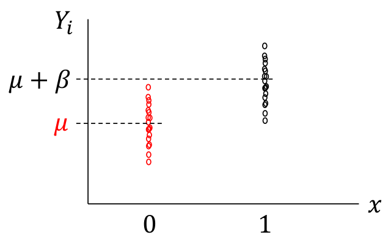

# (PART) 統計推斷 Inference {-}

# 統計推斷的概念 {#inference-basic}

> If people do not believe that mathematics is simple, it is only because they do not realize how complicated life is.
> ~ [John von Neumann](https://zh.wikipedia.org/wiki/%E7%BA%A6%E7%BF%B0%C2%B7%E5%86%AF%C2%B7%E8%AF%BA%E4%BC%8A%E6%9B%BC)

```{block2, note-thankDan, type='rmdnote'}
The Inference lectures were orgainised and taught by Professor [Daniel Altmann](https://www.lshtm.ac.uk/aboutus/people/altmann.daniel), Professor [John Gregson](https://www.lshtm.ac.uk/aboutus/people/gregson.john), and Dr. Katy Morgan.
```


## 人羣與樣本 (population and sample)

討論樣本時，需考慮下面幾個問題：

1. 樣本是否具有代表性？
2. 人羣被準確定義了嗎？
3. 我們感興趣的“人羣”是否可以是無限大 (多) 的？
4. 我們研究的樣本，是僅僅用來觀察，亦或是計劃對之進行某種干預呢？
5. 我們從所有可能的人羣中抽樣了嗎？


## 樣本和統計量 (sample and statistic)

通常我們在進行實驗或觀察時只是獲得了樣本的數據。而希望從樣本數據去推斷 (inference) 總體 (或人羣) 的一些特徵。我們也許只是想用樣本的平均值來估計整體人羣的某個特徵的平均值。不管是何種估計和推斷，都是基於對樣本數據的計算，從樣本中獲得想要推斷總體的**統計量 (statistics)**。我們用已知樣本去推斷未知總體的過程就叫做**估計 (estimate)**。這個想要被推斷的總體或人羣的值，被叫做**參數 (parameter)**，常常使用希臘字母來標記。用來估計總體或人羣的，從樣本數據計算得來的統計量，叫做**估計量 (estimator)**。

所有的統計量，都有**樣本分佈 (sampling distributions，意爲重複無限次取樣後獲得的無限次統計量的分佈)**。推斷的過程歸納如下：

1. 從總體或人羣中抽樣 (樣本量 $n$)
2. 計算這個樣本的合適統計量，從而用於估計它在整體或人羣中的值。
3. 我們還需要決定計算獲得的統計量的樣本分佈 (假定會抽樣無數次) 。
4. 一旦可以精確地確認樣本分佈，我們就可以定量地計算出使用步驟2中獲得的統計量估計總體或人羣的參數時的準確度。

## 估計 Estimation

從樣本的均值，推斷總體或人羣的均值是一種估計。我們的目的是，從已知樣本中計算一個儘可能接近那個未知的總體或人羣參數的值。一個估計量有兩個與生俱來的性質 (properties)：1) 偏倚 (bias); 2) 精確度 (precision)。這兩個性質都可以從樣本分佈和估計量獲得。

1. 偏倚： 偏倚簡單說就是樣本分佈的均值，也就是我們從樣本中計算獲得的估計量，和我們想要拿它來估計的總體或人羣的參數之間的差距。(The bias is the difference between the mean of the sampling distribution -- the expected or average value of the estimator -- and the population parameter being estimated.) 一個小的偏倚，確保了我們從樣本中計算獲得的估計值 (假設我們抽樣無數次，計算無數個樣本估計值) **均勻地**分佈在總體或人羣參數的左右兩邊。偏倚本身並不是太大的問題，但是假如樣本量增加，偏倚依然存在 (估計量不一致, inconsistent) ，那常常意味着是抽樣過程出現了問題。例如：<br>用簡單隨機抽樣法獲得的樣本均值，就是總體或人羣均值的無偏估計 (unbiased estimator)。如果抽樣時由於某些主觀客觀的原因導致較小的樣本很少被抽樣 (抽樣過程出了問題，脫離了簡單隨機抽樣原則) ，那麼此時得到的樣本均值就會是一個過高的估計值 (upward biased estimator)。

2. 精確度：估計值的精確度可以通過樣本分佈的方差或標準差來評價 (簡單說是樣本分佈的方差越低，波動越小，精確度越高) 。樣本分佈的標準差被定義爲估計值的標準誤。假如估計量是樣本均值，那麼樣本分佈的標準差 (估計量的標準誤) 和樣本數據之間有如下的關係：

$$\text{true standard error of the mean}  = \frac{\text{true standard deviation}}{\sqrt{\text{sample size}}}$$


在一些簡單的情況下，通常估計值的選用不言自明 (例如均值，或者百分比) 。但是在複雜的情況下，我們可能可以有多個不同類型的估計量可以選擇，他們也常常各有利弊，需要我們做出取捨。

## 信賴區間  confidence intervals

從樣本中計算估計量獲得的一個估計值，只是一個**點估計 (point estimate)**。對比之下，信賴區間就是一個對這個點估計的精確度的體現。信賴區間越窄，說明我們對於總體或人羣的參數的可能取值的範圍估計越精確。

信賴區間通常是成對成對的出現的，即有上限和下限。這樣的一對從樣本數據中計算得來的統計量，同樣也是有樣本分佈的。**每次我們重新從總體或人羣中抽樣，計算獲得的信賴區間都不同，這些信賴區間就組成了信賴區間的樣本分佈。總體和人羣的參數落在這些信賴區間範圍內的概率，就是我們常說的信賴區間的水平 ($95\%$) 。** 常用的這個概率值就是 $95\%, 90\%, 99\%$。

當從樣本數據計算獲得的估計量的信賴區間很寬，說明了這個收集來的數據提供了很少的參數信息，導致估計變得很不精確。


~~看到這裏的都是好漢一條啊！ 我不知道你暈了麼有，反正我是已經暈了。。。~~


# 估計和精確度 Estimation and Precision {#Estimation-and-precision}

## 估計量和他們的樣本分佈 {#CI-for-sample-mean}

例子： 最大呼氣量 (Forced Expoiratory Volume in one second, FEV1) 用於測量一個人的肺功能，它的測量值是連續的。我們從前來門診的人中隨機抽取 $n$ 人作爲樣本，用這個樣本的 FEV1 平均值來估計這個診所的患者的平均肺功能。

**模型假設：** 在這個例子中，我們的假設有如下：每個隨機抽取的 FEV1 測量值都是從同一個總體 (人羣) 中抽取，每一個觀察值 $Y_i$ 都互相獨立互不影響。我們用縮寫 iid 表示這些隨機抽取的樣本是服從獨立同分佈 (independent and identically distributed)。另外，總體的分佈也假定爲正態分佈，且總體均值爲 $\mu$，總體方差爲 $\sigma^2$。那麼這個模型可以簡單的被寫成：

$$Y_i \stackrel{i.i.d}{\sim} N(\mu, \sigma^2), i=1,2,\dots,n$$

**總體均值 $\mu$ 的估計量：** 顯然算術平均值: $\bar{Y}=\frac{1}{n}\sum_{i=1}^ny_i$ 是我們用於估計總體均值的估計量。

**估計量的樣本分佈：**
$$\bar{Y}\stackrel{i.i.d}{\sim}N(\mu, \frac{\sigma^2}{n})$$

 **證明**

$$
\begin{aligned}
E(\bar{Y}) &= E(\frac{1}{n}\sum Y_i) \\
           &= \frac{1}{n}E(\sum Y_i) \\
           &= \frac{1}{n}\sum E(Y_i) \\
           &= \frac{1}{n}n\mu = \mu \\
Var(\bar{Y}) &= Var(\frac{1}{n}\sum Y_i) \\
\because Y_i \;\text{are} &\; \text{independent}   \\
            &= \frac{1}{n^2}\sum Var(Y_i) \\
            &= \frac{1}{n^2} n Var(Y_i) \\
            &= \frac{\sigma^2}{n}
\end{aligned}
$$

**證明當 $Z=\frac{\bar{Y}-\mu}{\sqrt{Var(\bar{Y})}}$ 時， $Z\sim N(0,1)$:**

由式子可知， $Z$ 只是由一組服從正態分佈的數據 $\bar{Y}$ 線性轉換 (linear transformation) 而來，所以 $Z$ 本身也服從正態分佈

$$
\begin{aligned}
E(Z) &= \frac{1}{\sqrt{Var(\bar{Y})}}E[\bar{Y}-\mu] \\
     &= \frac{1}{\sqrt{Var(\bar{Y})}}[\mu-\mu] = 0 \\
Var(Z) &= \frac{1}{Var(\bar{Y})}Var[\bar{Y}-\mu] \\
       &= \frac{1}{Var(\bar{Y})}Var(\bar{Y}) =1 \\
\therefore Z \;&\sim N(0,1)
\end{aligned}
$$

**均值 $\mu$ 的信賴區間：** 上節說道，

> 信賴區間通常是成對成對的出現的，即有上限和下限。這樣的一對從樣本數據中計算得來的統計量，同樣也是有樣本分佈的。**每次我們重新從總體或人羣中抽樣，計算獲得的信賴區間都不同，這些信賴區間就組成了信賴區間的樣本分佈。總體和人羣的參數落在這些信賴區間範圍內的概率，就是我們常說的信賴區間的水平($95\%$) 。** 常用的這個概率值就是 $95\%, 90\%, 99\%$。

假定我們用 $95\%$ 作爲信賴區間的水平。那麼下面我們嘗試推導一下信賴區間的計算公式。從長遠來說 (也就是假設我們從總體中抽樣無數次，每次都進行信賴區間的計算，也獲得無數個信賴區間) ，這些信賴區間中有 $95\%$ 是包含了總體的真實均值 (但是卻是未知) 的，而且這些信賴區間由於是從一個服從正態分佈的數據而來，它們也服從正態分佈 (對真實均值左右對稱) 。所以我們有理由相信，可以找到一個數值 $c$：

$$Prob(\bar{Y} > \mu+c) = 0.025 \\
  Prob(\bar{Y} < \mu-c) = 0.025$$


因此，我們可以定義 $95\%$ 信賴區間的上限和下限分別是：

$$L=\bar{Y}-c \Rightarrow Prob(L>\mu)=0.025 \\
  U=\bar{Y}+c \Rightarrow Prob(U<\mu)=0.025$$


接下來就是推倒 (故意的) $c$ 的過程啦：

$$
\begin{aligned}
Prob(\bar{Y}>\mu+c)=Prob(\bar{Y}-\mu>c) \;&= 0.025 \\
\Rightarrow Prob(\frac{\bar{Y}-\mu}{\sqrt{Var(\bar{Y})}} > \frac{c}{\sqrt{Var(\bar{Y})}}) \;&= 0.025 \\
\Rightarrow Prob(Z>\frac{c}{\sqrt{Var(\bar{Y})}}) \;&= 0.025 \\
we\;have\;proved\; Z\sim N(0,1) \\
we\;also\;know\; Prob(Z>1.96) \;&= 0.025 \\
so\;let\; \frac{c}{\sqrt{Var(\bar{Y})}} =1.96 \\
\Rightarrow c=1.96\sqrt{Var(\bar{Y})} \\
the\;95\%\;confidence\;interval \;of\; &the\;population\;mean\;is\\
\mu = \bar{Y}\pm1.96\sqrt{Var(\bar{Y})}=\bar{Y}\pm & 1.96\frac{\sigma}{\sqrt{n}}
\end{aligned}
$$

其中，$\sqrt{Var(\bar{Y})}$ 就是我們熟知的估計量 $\bar{Y}$ 的標準誤。


## 估計量的特質

考慮以下的問題：

1. 什麼因素決定了一個估計量 (estimator) 的好壞，是否實用？
2. 如果有其他的可選擇估計量，該如何取捨呢？
3. 當情況複雜的時候，我們該如何尋找合適的估計量？

### 偏倚 {#bias}

假設 $T$ 是我們估計總體參數 $\theta$ 的一個估計量。一般來說我們希望估計量的樣本分佈可以在 `“正確的位置”` 左右均勻分佈。換句話說我們希望：

$$E(T)=\theta$$

如果實現了這個條件，我們說這樣的估計量是無偏的 (`unbiased`)。然而，天下哪有這等好事，我們叫真實值和估計量之間的差距爲偏倚：

$$bias(T) = E(T)-\theta$$

其實偏倚完全等於零並不是最重要，許多常見的估計量都是有偏倚的。重要的是，這個偏倚會隨着樣本量的增加而逐漸趨近於零。所以我們就可以認爲這樣的估計量是漸進無偏的 (asymptotically unbiased)：

$$T\;is\;an\;\textbf{unbiased}\;estimator\;for\;\theta\;if\;\\E(T)=\theta\\
T\;is\;an\;\textbf{asymptotically unbiased}\;estimator\;for\;\theta\;if\;\\lim_{n\rightarrow\infty}E(T)=\theta$$

### 估計量的效能 Efficiency

通常，我們希望一個估計量 (estimator) 的偏倚要小，同時，它的樣本分佈也希望能儘可能的不要波動太大。換句話說，我們還希望估計量的方差越小越好。

如果說，兩個估計量有相同的偏倚，均可以選擇來推斷總體，我們說，其中樣本分佈的方差小的那個 (波動幅度小) 的那個估計量是相對更好的。因爲樣本分佈方差越小，說明可以**更加精確的**估計總體參數。這兩個估計量的方差之比：$Var(S)/Var(T)$ 被叫做這兩個估計量的**相對效能 (relative efficiency)**。所以我們用估計量去推斷總體時，需要選用效能最高，精確度最好的估計量 **(the minimum variance unbiased estimator/an efficient estimator)**。

### 均值和中位數的相對效能

在一個服從 $N(\mu,\sigma^2)$ 正態分佈的數據中，中位數和均值是一樣的，也都同時等於總體均值參數 $\mu$。而且，樣本均數 $\bar{Y}$ 和樣本中位數 $\dot{Y}$ 都是對總體均值的無偏估計量。那麼應該選用中位數還是平均值呢？

之前證明過當 $Y_i \sim N(\mu,\sigma^2)$ 時， $Var(\bar{Y})=\sigma^2/n$。然而，當 $n$ 較大的時候，可以證明的是：

$$Var(\dot{Y})=\frac{\pi}{2}\frac{\sigma^2}{n}\approx1.571\frac{\sigma^2}{n}$$

因此，這兩個估計量的相對效能就是：

$$\frac{Var(\dot{Y})}{Var(\bar{Y})}\approx1.571$$

所以總體是正態分佈時，平均值就是較中位數更適合用來估計總體的估計量。


### 均方差 mean square error (MSE)

兩個估計量的偏倚不同時，可以比較他們和總體參數之間的差距，這被叫做均方差, Mean Square Error (MSE)。

$$MSE(T)=E[(T-\theta)^2]$$

這裏用一個數學技巧，將式子中的估計量和總體參數之間的差，分成兩個部分：一是估計量本身的方差 ($T-E(T)$)，一是估計量的偏倚 ($E(T)-\theta$)。

$$
\begin{aligned}
MSE(T) &= E[(T-\theta)^2] \\
       &= E\{[T-E(T)+E(T)-\theta]^2\} \\
       &= E\{[T-E(T)]^2+[E(T)-\theta]^2 \\
       & \;\;\;\;\; \;\;+2[T-E(T)][E(T)-\theta]\} \\
       &= E\{[T-E(T)]^2\}+E\{[E(T)-\theta]^2\} + 0\\
       &= Var(T) + [bias(T)^2]
\end{aligned}
$$

## 總體方差的估計，自由度 {#samplevarbias}

如果 $Y_i \sim (\mu, \sigma^2)$，並不需要默認或者假定它服從正態分佈或者任何分佈。那麼它的方差我們會用：

$$V_{\mu}=\frac{1}{n}\sum_{i=1}^n(Y_i-\mu)^2$$

**證明 $V_{\mu}$ 是 $\sigma^2$ 的無偏估計：**

$$
\begin{aligned}
V_{\mu} &= \frac{1}{n}\sum_{i=1}^n(Y_i-\mu)^2 \\
 we\;need\;to\;prove &E(V_{\mu}) = \sigma^2 \\
\Rightarrow E(V_{\mu}) &= \frac{1}{n}\sum_{i=1}^nE(Y_i-\mu)^2 \\
        &= \frac{1}{n}\sum_{i=1}^nVar(Y_i) \\
        &= \frac{1}{n}\sum_{i=1}^n\sigma^2 \\
        &= \sigma^2
\end{aligned}
$$

然而通常情況下，我們並不知道總體的均值 $\mu$。因此，只好用樣本的均值 $\bar{Y}$ 來估計 $\mu$。所以上面的方程就變成了：

$$V_{\mu}=\frac{1}{n}\sum_{i=1}^n(Y_i-\bar{Y})^2$$

你如果仔細觀察認真思考，就會發現，上面這個式子是`有問題的`。這個大問題就在於，$Y_i-\bar{Y}$ 中我們忽略掉了樣本均值 $\bar{Y}$ 和總體均值 $\mu$ 之間的差 ($\bar{Y}-\mu$)。因此上面的計算式來估計總體方差時，很顯然是會低估平均平方差，從而低估了總體方差。

這裏需要引入**自由度 (degree of freedom)** 在參數估計中的概念。

字面上可以理解爲：自由度是估計過程中使用了多少互相獨立的信息。所以在上面第一個公式中：$V_{\mu}=\frac{1}{n}\sum_{i=1}^n(Y_i-\mu)^2$。所有的 $n$ 個觀察值互相獨立，不僅如此，他們還對總體均值獨立。然而在第二個我們用 $\bar{Y}$ 取代了 $\mu$ 的公式中，樣本均數則與觀察值不互相獨立。因爲**樣本均數必然總是落在觀察值的中間**。然而總體均數並不一定就會落在觀察值中間。總體均數，和觀察值之間是自由，獨立的。因此，當我們觀察到 $n-1$ 個觀察值時，剩下的最後一個觀察值，決定了樣本均值的大小。所以說，樣本均值的自由度，是 $n-1$。

所以，加入了自由度的討論，我們可以相信，用樣本估計總體的方差時，使用下面的公式將會是總體方差的無偏估計：

$$V_{n-1}=\frac{1}{n-1}\sum_{i=1}^n(Y_i-\bar{Y})=\frac{n}{n-1}V_n$$


**證明**

利用上面也用到過的證明方法 -- 把樣本和總體均值之間的差分成兩部分：

$$
\begin{aligned}
V_{\mu} &= \frac{1}{n}\sum_{i=1}^n(Y_i-\mu)^2 \\
        &= \frac{1}{n}\sum_{i=1}^n[(Y_i-\bar{Y})+(\bar{Y}-\mu)]^2 \\
        &= \frac{1}{n}\sum_{i=1}^n[(Y_i-\bar{Y})^2+(\bar{Y}-\mu)^2\\
        &\;\;\;\;\;\;\;\;\;\;\;\;+2(Y_i-\bar{Y})(\bar{Y}-\mu)]\\
        &=\frac{1}{n}\sum_{i=1}^n(Y_i-\bar{Y})^2+\frac{1}{n}\sum_{i=1}^n(\bar{Y}-\mu)^2\\
        &\;\;\;\;\;\;\;\;\;\;\;\;+\frac{2}{n}(\bar{Y}-\mu)\sum_{i=1}^n(Y_i-\bar{Y}) \\
        &= V_n+(\bar{Y}-\mu)^2 \\ &\;\;\;\;\;\;\;\;\;\;\;\;(\text{note that}\;\sum_{i=1}^n(Y_i-\bar{Y})=0) \\
\Rightarrow  V_n &= V_{\mu}-(\bar{Y}-\mu)^2  \\
\therefore E(V_n)&= E(V_{\mu}) - E[(\bar{Y}-\mu)^2] \\
                 &= Var(Y)-Var(\bar{Y}) \\
                 &= \sigma^2-\frac{\sigma^2}{n} \\
                 &= \sigma^2(\frac{n-1}{n})
\end{aligned}
$$

因此，我們看見 $V_n$ 正如上面討論的那樣，是低估了總體方差的。雖然當 $n\rightarrow\infty$ 時無限接近 $\sigma^2$ 但是依然是低估了的。所以，我們可以對之進行修正：

$$
\begin{aligned}
E[\frac{n}{n-1}V_n]     &= \frac{n}{n-1}E[V_n] =\sigma^2 \\
\Rightarrow E[V_{n-1}]  &= \sigma^2
\end{aligned}
$$

## 樣本方差的樣本分佈  {#samplevar}

 $S^2$ 常用來標記樣本方差，取代上面我們用到的 $V_{n-1}$：

 $$S^2=\frac{1}{n-1}\sum_{i=1}^n(Y_i-\bar{Y})^2$$

而且上面也證明了，$E(S^2)=\sigma^2$ 是總體方差的無偏估計。然而，要注意的是，樣本標準差 $\sqrt{S^2}$ 卻不是總體標準差 $\sigma$ 的無偏估計(因爲並不是線性變換，而是開了根號) 。

 **證明樣本標準差 $S$ 不是總體標準差 $\sigma$ 的無偏估計**

$$
\begin{aligned}
Var(S)               &=E(S^2)-[E(S)]^2 \\
\Rightarrow [E(S)]^2 &=E(S^2)-Var(S) \\
\because E(S^2)      &=\sigma^2 \\
\therefore   [E(S)]^2 &=\sigma^2-Var(S) \\
             E(S)     &=\sqrt{\sigma^2-Var(S)} \\
\end{aligned}$$

**可見樣本標準差是低估了總體標準差的。**

另外可以被證明的是：

$$\frac{n-1}{\sigma^2}S^2\sim \mathcal{X}_{n-1}^2\\
Var(S^2)=\frac{2\sigma^4}{n-1}$$

$\mathcal{X}^2_m$： 自由度爲 $m$ 的卡方分佈 (Section \@ref(chi-square-distribution))。是在圖形上向右歪曲的分佈。當自由度增加時，會越來越接近正態分佈。


# 卡方分佈 Chi-square distribution {#chi-square-distribution}

## 卡方分佈的期望和方差的證明


當 $X\sim N(0,1)$ 時， $X^2\sim \mathcal{X}_1^2$

如果 $X_1, \dots, X_n\stackrel{i.i.d}{\sim} N(0,1)$，
那麼 $\sum_{i=1}^nX_i^2\sim\mathcal{X}_n^2$

其中： $\mathcal{X}_n^2$ 表示自由度爲 $n$ 的卡方分佈。

且 $X_m^2+X_n^2=\mathcal{X}_{m+n}^2$

## 卡方分佈的期望

$$E(X_1^2)=Var(X)+[E(X)]^2=1+0=1$$

$$\Rightarrow E(X_n^2)=n$$


## 卡方分佈的方差

$$
\begin{aligned}
Var(X_1^2) &= E(X_1^{2^2}) - E(X_1^2)^2 \\
           &= E(X_1^4)-1
\end{aligned}
$$

### 下面來求 $E(X_1^4)$

$$
\begin{aligned}
\because E(X_1) &= \int_{-\infty}^{+\infty} xf(x)dx \\
\therefore E(X_1^4) &= \int_{-\infty}^{+\infty} x^4f(x)dx
\end{aligned}$$

已知： $f(x)=\frac{1}{\sqrt{2\pi}}e^{(-\frac{x^2}{2})}$ 代入上式：

$$
\begin{aligned}
E(X_1^4) &= \int_{-\infty}^{+\infty} x^4f(x)dx \\
         &= \int_{-\infty}^{+\infty} x^4\frac{1}{\sqrt{2\pi}}e^{(-\frac{x^2}{2})}dx\\
         &=\frac{1}{\sqrt{2\pi}}\int_{-\infty}^{+\infty}x^4e^{(-\frac{x^2}{2})}dx\\
         &=\frac{-1}{\sqrt{2\pi}}\int_{-\infty}^{+\infty}x^3(-x)e^{(-\frac{x^2}{2})}dx
\end{aligned}
$$

令 $u=x^3, v=e^{(-\frac{x^2}{2})},t=-\frac{x^2}{2}$
可以推導：

$$
\begin{aligned}
\frac{dv}{dx} &= \frac{dv}{dt}\frac{dt}{dx} \\
              &= e^t(-\frac{1}{2}\times2x) \\
              &= (-x)e^{(-\frac{x^2}{2})} \\
\Rightarrow dv &= (-x)e^{(-\frac{x^2}{2})}dx
\end{aligned}
$$

再代入上面的式子：


$$
\begin{aligned}
E(X_1^4) &= \frac{-1}{\sqrt{2\pi}}\int_{-\infty}^{+\infty}u\:dv \\
integrate\; &by\; parts:\\
E(X_1^4) &= \frac{-1}{\sqrt{2\pi}}\{[u\:v] \rvert_{-\infty}^{+\infty}-\int_{-\infty}^{+\infty}v\:du\} \\
&= \frac{-1}{\sqrt{2\pi}}\{[x^3e^{(-\frac{x^2}{2})}]\rvert_{-\infty}^{+\infty} -\int_{-\infty}^{+\infty}v\:du\} \\
&=\frac{-1}{\sqrt{2\pi}}\{0-0-\int_{-\infty}^{+\infty}e^{(-\frac{x^2}{2})}dx^3\} \\
&=\frac{-1}{\sqrt{2\pi}}[-3\int_{-\infty}^{+\infty}x^2e^{(-\frac{x^2}{2})}dx] \\
&=\frac{-3}{\sqrt{2\pi}}[\int_{-\infty}^{+\infty}x(-x)e^{(-\frac{x^2}{2})}dx] \\
\end{aligned}
$$

再來一次分部積分：

令 $a=x,b=e^{(-\frac{x^2}{2})},d\:b = (-x)e^{(-\frac{x^2}{2})}dx$

$$
\begin{aligned}
E(X_1^4) &= \frac{-3}{\sqrt{2\pi}}\{[a\:b] \rvert_{-\infty}^{+\infty} - \int_{-\infty}^{+\infty}b\:da\} \\
&=\frac{-3}{\sqrt{2\pi}}\{[xe^{(-\frac{x^2}{2})}]\rvert_{-\infty}^{+\infty} -\int_{-\infty}^{+\infty}b\:da\} \\
&=\frac{-3}{\sqrt{2\pi}}\{0-0-\int_{-\infty}^{+\infty}e^{(-\frac{x^2}{2})}dx\} \\
&=\frac{-3}{\sqrt{2\pi}}[-\int_{-\infty}^{+\infty}e^{(-\frac{x^2}{2})}dx] \\
&=\frac{3}{\sqrt{2\pi}}\int_{-\infty}^{+\infty}e^{(-\frac{x^2}{2})}dx
\end{aligned}
$$

下面令 $I=\int_{-\infty}^{+\infty}e^{(-\frac{x^2}{2})}dx\\
\Rightarrow I^2=\int_{-\infty}^{+\infty}\int_{-\infty}^{+\infty}e^{(-\frac{x^2+y^2}{2})}dxdy$

接下來需要用到 [座標轉換](https://www.youtube.com/watch?v=r0fv9V9GHdo)的知識，將 $x,y$ 表示的笛卡爾座標，轉換爲用角度 $\theta$ 和半徑 $r$ 表示的形式。之後的證明可以在[油管](https://www.youtube.com/watch?v=fWOGfzC3IeY)上看到，但是我還是繼續證明下去。


直角座標系 (cartesian coordinators) 和
極座標系 (polar coordinators) 之間轉換的關係如下：


$$
\begin{aligned}
x&=r\:cos\theta\\
y&=r\:sin\theta\\
r^2&=x^2+y^2\\
\end{aligned}
$$

座標轉換以後可以繼續求 $E(X_1^4)$。 在那之前我們先求 $I^2$。
注意轉換座標系統以後，$\theta\in[0,2\pi], r\in[0,+\infty]$

$$
\begin{aligned}
I^2 &= \int_{-\infty}^{+\infty}\int_{-\infty}^{+\infty}e^{(-\frac{x^2+y^2}{2})}dxdy \\
&= \int_{0}^{+\infty}\int_{0}^{2\pi}e^{(-\frac{r^2}{2})}rd\theta dr \\
\end{aligned}
$$

由於先從中間的 $\int_{0}^{2\pi}e^{(-\frac{r^2}{2})}rd\theta$ 開始積分，$\theta$ 以外都可以視爲常數，那麼這個 $[0,2\pi]$ 上的積分就的等於 $2\pi e^{(-\frac{r^2}{2})}r$。

因此上面的式子又變爲：


$$
\begin{aligned}
I^2 &=  2\pi\int_{0}^{+\infty}e^{(-\frac{r^2}{2})}r\:dr \\
\because \frac{d(e^{\frac{-r^2}{2}})}{dr} &= -e^{(-\frac{r^2}{2})}r \\
\therefore I^2 &= 2\pi(-e^{\frac{-r^2}{2}})\rvert_0^{+\infty} \\
               &= 0-(2\pi\times(-1)) \\
               &= 2\pi\\
\Rightarrow I  &= \sqrt{2\pi}
\end{aligned}
$$

所以，


$$
\begin{aligned}
E(X_1^4) &= \frac{3}{\sqrt{2\pi}}\int_{-\infty}^{+\infty}e^{(-\frac{x^2}{2})}dx \\
&= \frac{3}{\sqrt{2\pi}}\times I \\
&= 3 \\
\Rightarrow Var(X_1^2) &= E(X_1^4) - 1 \\
                       &= 3-1 =2
\end{aligned}
$$

## 把上面的推導擴展

$$
\text{Suppose } \mathcal{X}^2_1, \cdots \mathcal{X}^2_k \stackrel{i.i.d}{\sim} \mathcal{X}^2_1 \\
\Rightarrow \sum_{i=1}^k \mathcal{X}^2_i \sim \mathcal{X}^2_k \\
\Rightarrow \text{E}(\sum_{i=1}^n\mathcal{X}^2_i)=\sum_{i-1}^n\text{E}(\mathcal{X}^2_i)=n\times1=n\\
\text{Var}(\sum_{i=1}^n\mathcal{X}^2_i)=\sum_{i=1}^n\text{Var}(\mathcal{X}^2_i) = n\times2=2n
$$


結論：$X_1, \dots, X_n\stackrel{i.i.d}{\sim} N(0,1)$ 時，$\sum_{i=1}^nX_i^2\sim\mathcal{X}_n^2$ 服從卡方分佈，其期望 $E(X_n^2)=n$，方差 $Var(X_n^2)=2n$。
根據**中心極限定理**(Section \@ref(CLT))

$$n\rightarrow \infty, X_n^2\sim N(n, 2n)$$


# 似然 Likelihood {#likelihood-definition}

## 概率 vs. 推斷 Probability vs. Inference
在概率論的環境下，我們常常被告知的前提是：某某事件發生的概率是多少。例如： 一枚硬幣正面朝上的概率是 $0.5\; Prob(coin\;landing\;heads)=0.5$。然後在這個前提下，我們又繼續去計算複雜的事件發生的概率(例如，10次投擲硬幣以後4次正面朝上的概率是多少？) 。

$$
\binom{10}{4}\times(0.5^4)\times(0.5^{10-4}) = 0.205
$$

```{r inference00, cache=TRUE}
dbinom(4, 10, 0.5)

# or you can calculate by hand:
factorial(10)*(0.5^10)/(factorial(4)*(factorial(6)))
```

在統計推斷的理論中，我們考慮實際的情況，這樣的實際情況就是，我們通過觀察獲得數據，然而我們並不知道某事件發生的概率到底是多少(神如果存在話，只有神知道) 。故這個 $Prob(coin\;landing\;heads)$ 的概率大小對於“人類”來說是未知的。我們可能觀察到投擲了10次硬幣，其中有4次是正面朝上的。那麼我們從這一次觀察實驗中，需要計算的是能夠符合觀察結果的“最佳”概率估計 (best estimate)。在這種情況下，**似然法 (likelihood)** 就是我們進行參數估計的最佳手段。

## 似然和極大似然估計 Likelihood and maximum likelihood estimators

此處用二項分佈的例子來理解似然法的概念：假設我們觀察到10個對象中有4個患~~中二~~病，我們假定這個患病的概率爲 $\pi$。於是我們就有了下面的模型：

**模型：** 我們假定患病與否是一個服從**二項分佈的隨機變量**，$X\sim Bin(10,\pi)$。同時也默認每個人之間是否患病是相互獨立的。

**數據：** 觀察到的數據是，10人中有4人患病。於是 $x=4$。

現在按照觀察到的數據，參數 $\pi$ 變成了未知數：

$$Prob(X=4|\pi)=\binom{10}{4}\pi^4(1-\pi)^{10-4}$$

此時我們會很自然的考慮，當 $\pi$ 是未知數的時候，**它取值爲多大的時候才能讓這個事件(即：10人中4人患病) 發生的概率最大？** 所以我們可以將不同的數值代入 $\pi$ 來計算該事件在不同概率的情況下發生的可能性到底是多少：

```{r inference01, echo=FALSE, eval=FALSE, cache=TRUE}
dt <- read.csv("/home/ccwang/Documents/full-website-content/static/files/pi.csv", header = T)
kable(dt, "html",align = "c",caption = "The probability of observing X=4") %>%
  kable_styling(bootstrap_options = c("striped", "bordered"))
```

<table class="table table-striped table-bordered" style="margin-left: auto; margin-right: auto;">
<caption>Table 12.1: The probability of observing $X=4$</caption>
 <thead><tr>
<th style="text-align:center;"> $\pi$ </th>
   <th style="text-align:center;"> 事件 $X=4$ 發生的概率 </th>
  </tr></thead>
<tbody>
<tr>
<td style="text-align:center;"> 0.0 </td>
   <td style="text-align:center;"> 0.000 </td>
  </tr>
<tr>
<td style="text-align:center;"> 0.2 </td>
   <td style="text-align:center;"> 0.088 </td>
  </tr>
<tr>
<td style="text-align:center;"> **0.4** </td>
   <td style="text-align:center;"> **0.251** </td>
  </tr>
<tr>
<td style="text-align:center;"> 0.5 </td>
   <td style="text-align:center;"> 0.205 </td>
  </tr>
<tr>
<td style="text-align:center;"> 0.6 </td>
   <td style="text-align:center;"> 0.111 </td>
  </tr>
<tr>
<td style="text-align:center;"> 0.8 </td>
   <td style="text-align:center;"> 0.006 </td>
  </tr>
<tr>
<td style="text-align:center;"> 1.0 </td>
   <td style="text-align:center;"> 0.000 </td>
  </tr>
</tbody>
</table>

很顯然，如果 $\pi=0.4$ 時，我們觀察到的事件發生的概率要比 $\pi$ 取其它值時更大。於是小總結一下目前爲止的步驟如下：

- 觀察到實驗數據(10人中4個患病) ；
- 假定這數據服從二項分佈的概率模型，計算不同($\pi$ 的取值不同的) 情況下，該事件按照假定模型發生的概率；
- 通過比較，我們選擇了能夠讓觀察事件發生概率最高的參數取值 ($\pi=0.4$)。

至此，我們可以知道，似然方程，是一個關於未知參數 $\pi$ 的函數，我們目前位置做的就是找到這個函數的最大值 (maximised)，和使之成爲最大值時的 $\pi$ ：

$$L(\pi|X=4)=\binom{10}{4}\pi^4(1-\pi)^{10-4}$$

我們可以畫出這個似然方程的形狀， $\pi\in[0,1]$

```{r binomial-likelihood, fig.asp=.7, fig.width=6,  fig.cap='Binomial Likelihood', fig.align='center', out.width='90%', cache=TRUE}
x <- seq(0,1,by=0.001)
y <- (factorial(10)/(factorial(4)*(factorial(6))))*(x^4)*((1-x)^6)
plot(x, y, type = "l", ylim = c(0,0.3), ylab = "L(\U03C0)", xlab = "\U03C0")
#title("Figure 1. Binomial Likelihood")
abline(h=0.251, lty=2)
abline(v=0.4, lty=2)
```

從圖形上我們也能確認，$\pi=0.4$ 時能夠讓這個似然方程取得最大值。


## 似然方程的一般化定義

對於一個概率模型，如果其參數爲 $\theta$，那麼在給定觀察數據 $\underline{x}$ 時，該參數的似然方程被定義爲：

$L(\theta|\underline{x})=P(\underline{x}|\theta)$

注意：

1. $P(\underline{x}|\theta)$ 可以是概率(離散分佈) 方程，也可以是概率密度(連續型變量) 方程。對於此方程，$\theta$ 是給定的，然後再計算某些事件發生的概率。
2. $L(\theta|\underline{x})$ 是一個關於參數 $\theta$ 的方程，此時，$\underline{x}$ 是固定不變的(觀察值) 。我們希望通過這個方程求出能夠使觀察到的事件發生概率最大的參數值。
3. 似然方程**不是**一個概率密度方程。

另一個例子：

有一組觀察數據是離散型隨機變量 $X$，它符合概率方程 $f(x|\theta)$。下表羅列了當 $\theta$ 分別取值 $1,2,3$ 時的概率方程的值，試求每個觀察值 $X = 0,1,2,3,4$ 的最大似然參數估計：


```{r inference02, cache=TRUE, echo=FALSE, eval=FALSE}
dt <- read.csv("/home/ccwang/Documents/full-website-content/static/files/likelihoodtable1.csv", header = T)
#names(dt) <- c(" ", "0.05", "0.1", "0.2", "0.5")
#dt[,1] <- c(" ", 0.05, 0.01)
kable(dt, "html",align = "c",caption = "Exercise 1") %>%
#   column_spec(1:5, bold = T, border_right = T)  %>%
  kable_styling(bootstrap_options = c("striped", "bordered"))# %>%
#  add_header_above(c("\u03b1" = 1, "\u03b2" = 4))
```
<table class="table table-striped table-bordered" style="margin-left: auto; margin-right: auto;">
<caption>Exercise 12.3</caption>
 <thead><tr>
<th style="text-align:center;"> $x$ </th>
   <th style="text-align:center;"> $f(x|1)$ </th>
   <th style="text-align:center;"> $f(x|2)$ </th>
   <th style="text-align:center;"> $f(x|3)$ </th>
  </tr></thead>
<tbody>
<tr>
<td style="text-align:center;"> 0 </td>
   <td style="text-align:center;"> 1/3 </td>
   <td style="text-align:center;"> 1/4 </td>
   <td style="text-align:center;"> 0 </td>
  </tr>
<tr>
<td style="text-align:center;"> 1 </td>
   <td style="text-align:center;"> 1/3 </td>
   <td style="text-align:center;"> 1/4 </td>
   <td style="text-align:center;"> 0 </td>
  </tr>
<tr>
<td style="text-align:center;"> 2 </td>
   <td style="text-align:center;"> 0 </td>
   <td style="text-align:center;"> 1/4 </td>
   <td style="text-align:center;"> 1/6 </td>
  </tr>
<tr>
<td style="text-align:center;"> 3 </td>
   <td style="text-align:center;"> 1/6 </td>
   <td style="text-align:center;"> 1/4 </td>
   <td style="text-align:center;"> 1/2 </td>
  </tr>
<tr>
<td style="text-align:center;"> 4 </td>
   <td style="text-align:center;"> 1/6 </td>
   <td style="text-align:center;"> 0 </td>
   <td style="text-align:center;"> 1/3 </td>
  </tr>
</tbody>
</table>


```{r inference03, cache=TRUE, echo=FALSE, eval=FALSE}
library(knitr)
library(kableExtra)
dt <- read.csv("/home/ccwang/Documents/full-website-content/static/files/likelihoodtable2.csv", header = T)
#names(dt) <- c(" ", "0.05", "0.1", "0.2", "0.5")
#dt[,1] <- c(" ", 0.05, 0.01)
kable(dt, "html",align = "c",caption = "Exercise 1") %>%
#   column_spec(1:5, bold = T, border_right = T)  %>%
  kable_styling(bootstrap_options = c("striped", "bordered"))# %>%
#  add_header_above(c("\u03b1" = 1, "\u03b2" = 4))
```

<table class="table table-striped table-bordered" style="margin-left: auto; margin-right: auto;">
<caption>Exercise 12.3 answer</caption>
 <thead><tr>
<th style="text-align:center;"> $x$ </th>
   <th style="text-align:center;"> $f(x|1)$ </th>
   <th style="text-align:center;"> $f(x|2)$ </th>
   <th style="text-align:center;"> $f(x|3)$ </th>
   <th style="text-align:center;"> $\theta$ </th>
  </tr></thead>
<tbody>
<tr>
<td style="text-align:center;"> 0 </td>
   <td style="text-align:center;"> 1/3 </td>
   <td style="text-align:center;"> 1/4 </td>
   <td style="text-align:center;"> 0 </td>
   <td style="text-align:center;"> **1** </td>
  </tr>
<tr>
<td style="text-align:center;"> 1 </td>
   <td style="text-align:center;"> 1/3 </td>
   <td style="text-align:center;"> 1/4 </td>
   <td style="text-align:center;"> 0 </td>
   <td style="text-align:center;"> **1** </td>
  </tr>
<tr>
<td style="text-align:center;"> 2 </td>
   <td style="text-align:center;"> 0 </td>
   <td style="text-align:center;"> 1/4 </td>
   <td style="text-align:center;"> 1/6 </td>
   <td style="text-align:center;"> **2** </td>
  </tr>
<tr>
<td style="text-align:center;"> 3 </td>
   <td style="text-align:center;"> 1/6 </td>
   <td style="text-align:center;"> 1/4 </td>
   <td style="text-align:center;"> 1/2 </td>
   <td style="text-align:center;"> **3** </td>
  </tr>
<tr>
<td style="text-align:center;"> 4 </td>
   <td style="text-align:center;"> 1/6 </td>
   <td style="text-align:center;"> 0 </td>
   <td style="text-align:center;"> 1/3 </td>
   <td style="text-align:center;"> **3** </td>
  </tr>
</tbody>
</table>

## 對數似然方程 log-likelihood

似然方程的最大值，可通過求 $L(\theta|data)$ 的最大值獲得，也可以通過求該方程的對數方程 $\ell(\theta|data)$ 的最大值獲得。傳統上，我們估計最大方程的最大值的時候，會給參數戴一頂“帽子”(因爲這是觀察獲得的數據告訴我們的參數) ： $\hat{\theta}$。並且我們發現對數似然方程比一般的似然方程更加容易微分，因此求似然方程的最大值就變成了求對數似然方程的最大值：

$$\frac{d\ell}{d\theta}=\ell^\prime(\theta)=0\\
AND\\
\frac{d^2\ell}{d\theta^2}<0$$

要注意的是，微分不一定總是能幫助我們求得似然方程的最大值。如果說參數本身的定義域是有界限的話，微分就行不通了：

```{r likelihood-limited, fig.asp=.7, fig.width=6, fig.cap='Likelihood function with a limited domain', fig.align='center', out.width='90%', cache=TRUE}
x <- seq(0,3,by=0.001)
y <- (x-1)^2-5
plot(x, y, type = "l", ylim = c(-5,0-1), ylab = "L(\U03B8)", xlab = "\U03B8")
#title("Figure 2. Likelihood function with \n a limited domain")
abline(v=3, lty=2)
```

**證明：當 $L(\theta|data)$ 取最大值時，該方程的對數方程 $\ell(\theta|data)$ 也是最大值：**

如果似然方程是連續可導，只有一個最大值，且可以二次求導，假設 $\hat{\theta}$ 使該方程取最大值，那麼：

$$\frac{dL}{d\theta}=0, \frac{d^2L}{d\theta^2}<0 \Rightarrow \theta=\hat{\theta}$$

令 $\ell=\text{log}L$ 那麼 $\frac{d\ell}{dL}=\ell^\prime=\frac{1}{L}$：

$$\frac{d\ell}{d\theta}=\frac{d\ell}{dL}\cdot\frac{dL}{d\theta}=\frac{1}{L}\cdot\frac{dL}{d\theta}$$

當 $\ell(\theta|data)$ 取最大值時：

$$\frac{d\ell}{d\theta}=0\Leftrightarrow\frac{1}{L}\cdot\frac{dL}{d\theta}=0\\
\because \frac{1}{L}\neq0 \\
\therefore \frac{dL}{d\theta}=0\\
\Leftrightarrow \theta=\hat{\theta}$$

$$
\begin{aligned}
\frac{d^2\ell}{d\theta^2} &= \frac{d}{d\theta}(\frac{d\ell}{dL}\cdot\frac{dL}{d\theta})\\
 &= \frac{d\ell}{dL}\cdot\frac{d^2L}{d\theta^2} + \frac{dL}{d\theta}\cdot\frac{d}{d\theta}(\frac{d\ell}{dL})
\end{aligned}
$$

當 $\theta=\hat{\theta}$ 時，$\frac{dL}{d\theta}=0$ 且 $\frac{d^2L}{d\theta^2}<0 \Rightarrow \frac{d^2\ell}{d\theta^2}<0$

所以，求獲得 $\ell(\theta|data)$ 最大值的 $\theta$ 即可令 $L(\theta|data)$ 獲得最大值。

## 極大似然估計 (maximum likelihood estimator, MLE) 的性質：

1. 漸進無偏 Asymptotically unbiased: <br> $n\rightarrow \infty \Rightarrow E(\hat{\Theta}) \rightarrow \theta$
2. 漸進最高效能 Asymptotically efficient: <br> $n\rightarrow \infty \Rightarrow Var(\hat{\Theta})$ 是所有參數中方差最小的估計
3. 漸進正態分佈 Asymptotically normal: <br> $n\rightarrow \infty \Rightarrow \hat{\Theta} \sim N(\theta, Var(\hat{\Theta}))$
4. 變形後依然保持不變 Transformation invariant: <br> $\hat{\Theta}$ 是 $\theta$ 的MLE時 $\Rightarrow g(\hat{\Theta})$ 是 $g(\theta)$ 的 MLE
5. 信息足夠充分 Sufficient：<br> $\hat{\Theta}$ 包含了觀察數據中所有的能夠用於估計參數的信息
6. 始終不變 consistent: <br> $n\rightarrow\infty\Rightarrow\hat{\Theta}\rightarrow\theta$ 或者可以寫成：$\varepsilon>0, lim_{n\rightarrow\infty}P(|\hat{\Theta}-\theta|>\varepsilon)=0$

## 率的似然估計 Likelihood for a rate {#likelihood-poi}

如果在一項研究中，參與者有各自不同的追蹤隨訪時間(長度) ，那麼我們應該把事件(疾病) 的發病率用率的形式(多少事件每單位人年, e.g. per person year of observation) 。如果這個發病率的參數用 $\lambda$ 來表示，所有參與對象的隨訪時間之和爲 $p$ 人年。那麼這段時間內的期望事件(疾病發病) 次數爲：$\mu=\lambda p$。假設事件(疾病發病) 發生是相互獨立的，可以使用泊松分佈來模擬期望事件(疾病發病) 次數 $D$：

$$D\sim Poi(\mu)$$

假設我們觀察到了 $D=d$ 個事件，我們獲得這個觀察值的概率應該用以下的模型：

$$Prob(D=d)=e^{-\mu}\frac{\mu^d}{d!}=e^{-\lambda p}\frac{\lambda^dp^d}{d!}$$

因此，$\lambda$ 的似然方程是：

$$L(\lambda|observed \;data)=e^{-\lambda p}\frac{\lambda^dp^d}{d!}$$

所以，$\lambda$ 的對數似然方程是：

$$
\begin{aligned}
\ell(\lambda|observed\;data) &= \text{log}(e^{-\lambda p}\frac{\lambda^dp^d}{d!}) \\
  &= -\lambda p+d\:\text{log}(\lambda)+d\:\text{log}(p)-\text{log}(d!) \\
\end{aligned}
$$

解 $\ell^\prime(\lambda|data)=0$:

$$
\begin{aligned}
\ell^\prime(\lambda|data) &= -p+\frac{d}{\lambda}=0\\
\Rightarrow \hat{\lambda} &= \frac{d}{p} \\
\end{aligned}
$$

**注意：**
在對數似然方程中，不包含參數的部分，對與似然方程的形狀不產生任何影響，我們在微分對數似然方程的時候，這部分也都自動消失。所以不包含參數的部分，與我們如何獲得極大似然估計是無關的。因此，我們常常在寫對數似然方程的時候就把其中沒有參數的部分直接忽略了。例如上面泊松分佈的似然方程中，$d\:\text{log}(p)-\text{log}(d!)$ 不包含參數 $\lambda$ 可以直接不寫出來。


## 有 $n$ 個獨立觀察時的似然方程和對數似然方程
當有多個獨立觀察時，總體的似然方程等於各個觀察值的似然方程之**乘積**。如果 $X_1,\dots,X_n\stackrel{i.i.d}{\sim}f(\cdot|\theta)$

$$L(\theta|x_1,\cdots,x_n)=f(x_1,\cdots,x_n|\theta)=\prod_{i=1}^nf(x_i|\theta)\\
\Rightarrow \ell(\theta|x_1,\cdots,x_n)=\sum_{i=1}^n\text{log}(f(x_i|\theta))$$


# 對數似然比 Log-likelihood ratio {#llr}

對數似然比的想法來自於將對數似然方程圖形的 $y$ 軸重新調節 (rescale) 使之最大值爲零。這可以通過計算該分佈方程的**對數似然比 (log-likelihood ratio)** 來獲得：

$$llr(\theta)=\ell(\theta|data)-\ell(\hat{\theta}|data)$$

由於 $\ell(\theta)$ 的最大值在 $\hat{\theta}$ 時， 所以，$llr(\theta)$ 就是個當 $\theta=\hat{\theta}$ 時取最大值，且最大值爲零的方程。很容易理解我們叫這個方程爲對數似然比，因爲這個方程就是將似然比 $LR(\theta)=\frac{L(\theta)}{L(\hat{\theta})}$ 取對數而已。

[之前](https://winterwang.github.io/post/likelihood/)我們也確證了，不包含我們感興趣的參數的方程部分可以忽略掉。還是用上一節 10人中4人患病的例子：

$$L(\pi|X=4)=\binom{10}{4}\pi^4(1-\pi)^{10-4}\\
\Rightarrow \ell(\pi)=\text{log}[\pi^4(1-\pi)^{10-4}]\\
\Rightarrow llr(\pi)=\ell(\pi)-\ell(\hat{\pi})=\text{log}\frac{\pi^4(1-\pi)^{10-4}}{0.4^4(1-0.4)^{10-4}}$$

其實由上也可以看出 $llr(\theta)$ 只是將對應的似然方程的 $y$ 軸重新調節了一下而已。形狀是沒有改變的：

```{r binomial-logornot, fig.asp=.7, fig.width=6,fig.cap='Binomial likelihood ratio and log-likelihood ratio', fig.align='center', out.width='90%', cache=TRUE}

par(mfrow=c(1,2))
x <- seq(0,1,by=0.001)
y <- (x^4)*((1-x)^6)/(0.4^4*0.6^6)
z <- log((x^4)*((1-x)^6))-log(0.4^4*0.6^6)
plot(x, y, type = "l", ylim = c(0,1.1),yaxt="n",
     frame.plot = FALSE, ylab = "LR(\U03C0)", xlab = "\U03C0")
axis(2, at=seq(0,1, 0.2), las=2)
title(main = "Binomial likelihood ratio")
abline(h=1.0, lty=2)
segments(x0=0.4, y0=0, x1=0.4, y1=1, lty = 2)
plot(x, z, type = "l", ylim = c(-10, 1), yaxt="n", frame.plot = FALSE,
     ylab = "llr(\U03C0)", xlab = "\U03C0" )
axis(2, at=seq(-10, 0, 2), las=2)
title(main = "Binomial log-likelihood ratio")
abline(h=0, lty=2)
segments(x0=0.4, y0=-10, x1=0.4, y1=0, lty = 2)
```

## 正態分佈數據的極大似然和對數似然比

假設單個樣本 $y$ 是來自一組服從正態分佈數據的觀察值：$Y\sim N(\mu, \tau^2)$

那麼有：

$$
\begin{aligned}
f(y|\mu) &= \frac{1}{\sqrt{2\pi\tau^2}}e^{(-\frac{1}{2}(\frac{y-\mu}{\tau})^2)} \\
\Rightarrow L(\mu|y) &=\frac{1}{\sqrt{2\pi\tau^2}}e^{(-\frac{1}{2}(\frac{y-\mu}{\tau})^2)} \\
\Rightarrow \ell(\mu)&=\text{log}(\frac{1}{\sqrt{2\pi\tau^2}})-\frac{1}{2}(\frac{y-\mu}{\tau})^2\\
omitting&\;terms\;not\;in\;\mu \\
&= -\frac{1}{2}(\frac{y-\mu}{\tau})^2 \\
\Rightarrow \ell^\prime(\mu) &= 2\cdot[-\frac{1}{2}(\frac{y-\mu}{\tau})\cdot\frac{-1}{\tau}] \\
&=\frac{y-\mu}{\tau^2} \\
let \; \ell^\prime(\mu) &= 0 \\
\Rightarrow \frac{y-\mu}{\tau^2} &= 0 \Rightarrow \hat{\mu} = y\\
\because \ell^{\prime\prime}(\mu) &=  \frac{-1}{\tau^2} < 0 \\
\therefore \hat{\mu} &= y \Rightarrow \ell(\hat{\mu}=y)_{max}=0 \\
llr(\mu)&=\ell(\mu)-\ell(\hat{\mu})=\ell(\mu)\\
&=-\frac{1}{2}(\frac{y-\mu}{\tau})^2
\end{aligned}
$$

## $n$ 個獨立正態分佈樣本的對數似然比 {#llr-chi1}

假設一組觀察值來自正態分佈 $X_1,\cdots,X_n\stackrel{i.i.d}{\sim}N(\mu,\sigma^2)$，先假設 $\sigma^2$ 已知。將觀察數據 $x_1,\cdots, x_n$ 標記爲 $\underline{x}$。 那麼：

$$
\begin{aligned}
L(\mu|\underline{x}) &=\prod_{i=1}^nf(x_i|\mu)\\
\Rightarrow \ell(\mu|\underline{x}) &=\sum_{i=1}^n\text{log}f(x_i|\mu)\\
&=\sum_{i=1}^n[-\frac{1}{2}(\frac{x_i-\mu}{\sigma})^2]\\
&=-\frac{1}{2\sigma^2}\sum_{i=1}^n(x_i-\mu)^2\\
&=-\frac{1}{2\sigma^2}[\sum_{i=1}^n(x_i-\bar{x})^2+\sum_{i=1}^n(\bar{x}-\mu)^2]\\
omitting&\;terms\;not\;in\;\mu \\
&=-\frac{1}{2\sigma^2}\sum_{i=1}^n(\bar{x}-\mu)^2\\
&=-\frac{n}{2\sigma^2}(\bar{x}-\mu)^2 \\
&=-\frac{1}{2}(\frac{\bar{x}-\mu}{\sigma/\sqrt{n}})^2\\
\because \ell(\hat{\mu}) &= 0 \\
\therefore llr(\mu) &= \ell(\mu)-\ell(\hat{\mu}) = \ell(\mu)
\end{aligned}
$$

## $n$ 個獨立正態分佈樣本的對數似然比的分佈 {#llr-chi}

假設我們用 $\mu_0$ 表示總體均數這一參數的值。要注意的是，每當樣本被重新取樣，似然，對數似然方程，對數似然比都隨着觀察值而變 (即有自己的分佈)。

考慮一個服從正態分佈的單樣本 $Y$: $Y\sim N(\mu_0,\tau^2)$。那麼它的對數似然比：

$$llr(\mu_0|Y)=\ell(\mu_0)-\ell(\hat{\mu})=-\frac{1}{2}(\frac{Y-\mu_0}{\tau})^2$$

根據**卡方分佈** (Section \@ref(chi-square-distribution)) 的定義：

$$\because \frac{Y-\mu_0}{\tau}\sim N(0,1)\\
\Rightarrow (\frac{Y-\mu_0}{\tau})^2 \sim \mathcal{X}_1^2\\
\therefore -2llr(\mu_0|Y) \sim \mathcal{X}_1^2$$

所以，如果有一組服從正態分佈的觀察值：$X_1,\cdots,X_n\stackrel{i.i.d}{\sim}N(\mu_0,\sigma^2)$，且 $\sigma^2$ 已知的話：

$$-2llr(\mu_0|\bar{X})\sim \mathcal{X}_1^2$$

根據**中心極限定理** (Section \@ref(CLT))，可以將上面的結論一般化：

```{theorem inference04, cache=TRUE}
如果 $X_1,\cdots,X_n\stackrel{i.i.d}{\sim}f(x|\theta)$。 那麼當重複多次從參數爲 $\theta_0$ 的總體中取樣時，那麼統計量 $-2llr(\theta_0)$ 會漸進於自由度爲 $1$ 的卡方分佈： $$-2llr(\theta_0)=-2\{\ell(\theta_0)-\ell(\hat{\theta})\}\xrightarrow[n\rightarrow\infty]{}\;\sim \mathcal{X}_1^2$$
```


## 似然比信賴區間

如果樣本量 $n$ 足夠大 (通常應該大於 $30$)，根據上面的定理：

$$-2llr(\theta_0)=-2\{\ell(\theta_0)-\ell(\hat{\theta})\}\sim \mathcal{X}_1^2$$

所以：

$$Prob(-2llr(\theta_0)\leqslant \mathcal{X}_{1,0.95}^2=3.84) = 0.95\\
\Rightarrow Prob(llr(\theta_0)\geqslant-3.84/2=-1.92) = 0.95$$

故似然比的 $95\%$ 信賴區間就是能夠滿足 $llr(\theta)=-1.92$ 的兩個 $\theta$ 值。

### 以二項分佈數據爲例  {#binomial-ex}
繼續用本文開頭的例子：

$$llr(\pi)=\ell(\pi)-\ell(\hat{\pi})=\text{log}\frac{\pi^4(1-\pi)^{10-4}}{0.4^4(1-0.4)^{10-4}}$$

如果令 $llr(\pi)=-1.92$ 在代數上可能較難獲得答案。然而從圖形上，如果我們在 $y=-1.92$ 畫一條橫線，和該似然比方程曲線相交的兩個點就是我們想要求的信賴區間的上限和下限：

```{r bin-llr-95,fig.height=5, fig.width=8, warning=FALSE, message=FALSE, fig.cap='Log-likelihood ratio for binomial example, with 95% confidence intervals shown', fig.align='center', out.width='90%', cache=TRUE}
x <- seq(0,1,by=0.001)
z <- log((x^4)*((1-x)^6))-log(0.4^4*0.6^6)
plot(x, z, type = "l", ylim = c(-10, 1), yaxt="n", frame.plot = FALSE,
     ylab = "llr(\U03C0)", xlab = "\U03C0" )
axis(2, at=seq(-10, 0, 2), las=2)
abline(h=0, lty=2)
abline(h=-1.92, lty=2)
segments(x0=0.15, y0=-12, x1=0.15, y1=-1.92, lty = 2)
segments(x0=0.7, y0=-12, x1=0.7, y1=-1.92, lty = 2)
axis(1, at=c(0.15,0.7))
text(0.9, -1, "-1.92")
arrows(0.8, -1.92, 0.8, 0, lty = 1, length = 0.08)
arrows( 0.8, 0, 0.8, -1.92, lty = 1, length = 0.08)
```

從上圖中可以讀出，$95\%$ 對數似然比信賴區間就是 $(0.15, 0.7)$


### 以正態分佈數據爲例 {#normal-ex}

本文前半部分證明過，
$X_1,\cdots,X_n\stackrel{i.i.d}{\sim}N(\mu,\sigma^2)$，先假設 $\sigma^2$ 已知。將觀察數據 $x_1,\cdots, x_n$ 標記爲 $\underline{x}$。 那麼：

$$llr(\mu|\underline{x}) = \ell(\mu|\underline{x})-\ell(\hat{\mu}) = \ell(\mu|\underline{x}) \\
=-\frac{1}{2}(\frac{\bar{x}-\mu}{\sigma/\sqrt{n}})^2$$

很顯然，這是一個關於 $\mu$ 的二次方程，且最大值在 MLE $\hat{\mu}=\bar{x}$ 時取值 $0$。所以可以通過對數似然比法求出均值的 $95\%$ 信賴區間公式：

$$-2\times[-\frac{1}{2}(\frac{\bar{x}-\mu}{\sigma/\sqrt{n}})^2]=3.84\\
\Rightarrow L=\bar{x}-\sqrt{3.84}\frac{\sigma}{\sqrt{n}} \\
U=\bar{x}+\sqrt{3.84}\frac{\sigma}{\sqrt{n}} \\
note: \;\sqrt{3.84}=1.96$$

注意到這和我們之前求的正態分佈均值的信賴區間公式 (Section \@ref(CI-for-sample-mean)) 完全一致。

## 練習題

### Q1

a) 假設十個對象中有三人死亡，用二項分佈模型來模擬這個例子，求這個例子中參數 $\pi$ 的似然方程和圖形 (likelihood) ?

**解**

$$\begin{aligned}
 L(\pi|3) &= \binom{10}{3}\pi^3(1-\pi)^{10-3} \\
 omitting\;&terms\;not\;in\;\pi \\
 \Rightarrow \ell(\pi|3) &= \text{log}[\pi^3(1-\pi)^7] \\
 &= 3\text{log}\pi+7\text{log}(1-\pi)\\
 \Rightarrow \ell^\prime(\pi|3)&= \frac{3}{\pi}-\frac{7}{1-\pi} \\
 let \; \ell^\prime& =0\\
 &\frac{3}{\pi}-\frac{7}{1-\pi} = 0 \\
 &\frac{3-10\pi}{\pi(1-\pi)} = 0 \\
 \Rightarrow MLE &= \hat\pi = 0.3
\end{aligned}$$


```{r bin3-10,fig.width=6, echo=FALSE, message=FALSE, fig.cap='Binomial likelihood function 3 out of 10 subjects', fig.align='center', out.width='90%', cache=TRUE}
pi <- seq(0, 1, by=0.01)

L <- (pi^3)*((1-pi)^7)
plot(pi, L, type = "l", ylim = c(0, 0.0025),yaxt="n", col="darkblue",
     frame.plot = FALSE, ylab = "", xlab = "\U03C0")
grid(NA, 5, lwd = 1)
abline(v=0.3, lty=2)
axis(1, at=0.3, las=0)
axis(2, at=seq(0,0.0025,0.0005), las=2)
#title(main = "Binomial likelihood function\n 3 out of 10 subjects")
```


b) 計算似然比，並作圖，注意方程圖形未變，$y$ 軸的變化；取對數似然比，並作圖

```{r bin3-10-ratio,fig.width=6,  message=FALSE, warning=FALSE, message=FALSE, fig.cap='Binomial likelihood ratio function 3 out of 10 subjects', fig.align='center', out.width='90%', cache=TRUE}
LR <- L/max(L) ; head(LR)
plot(pi, LR, type = "l", ylim = c(0, 1),yaxt="n", col="darkblue",
     frame.plot = FALSE, ylab = "", xlab = "\U03C0")
grid(NA, 5, lwd = 1)
axis(2, at=seq(0,1,0.2), las=2)
title(main = "Binomial likelihood ratio function\n 3 out of 10 subjects")
```

```{r bin3-10-logratio,fig.width=6,  message=FALSE, warning=FALSE, message=FALSE, fig.cap='Binomial log-likelihood ratio function 3 out of 10 subjects', fig.align='center', out.width='90%', cache=TRUE}
logLR <- log(L/max(L))
plot(pi, logLR, type = "l", ylim = c(-4, 0),yaxt="n", col="darkblue",
     frame.plot = FALSE, ylab = "", xlab = "\U03C0")
grid(NA, 5, lwd = 1)
axis(2, at=seq(-4,0,1), las=2)
#title(main = "Binomial log-likelihood ratio function\n 3 out of 10 subjects")
abline(h=-1.92, lty=1, col="red")
axis(4, at=-1.92, las=0)
```

### Q2

a) 與上面用同樣的模型，但是觀察人數變爲 $100$ 人 患病人數爲 $30$ 人，試作對數似然比方程之圖形，與上圖對比：

```{r bin3-10-30-100-logllr,fig.asp=.7, fig.width=6,  echo=FALSE, warning=FALSE, message=FALSE, fig.cap='Binomial log-likelihood ratio function 3 out of 10 and 30 out of 100 subjects', fig.align='center', out.width='90%', cache=TRUE}
par(mai = c(1.2, 0.5, 1, 0.7))
logLR_30 <- log((pi^30)*((1-pi)^70)/max((pi^30)*((1-pi)^70)))
plot(pi, logLR, type = "l", ylim = c(-4, 0),yaxt="n", col="darkblue",
     frame.plot = FALSE, ylab = "", xlab = "\U03C0")
lines(pi, logLR_30, col="darkred")
grid(NA, 5, lwd = 1)
axis(2, at=seq(-4,0,1), las=2)
#title(main = "Binomial log-likelihood ratio function\n 3 out of 10 and 30 out of 100 subjects")
abline(h=-1.92, lty=1, col="darkred")
axis(4, at=-1.92, las=0)
legend(x=0.1, y= -5.8 ,xpd = TRUE,  legend=c("logLR","LogLR_30"), bty = "n",
       col=c("black","darkred"), lty=c(1,1), horiz = TRUE) #the legend is below the graph
```

可以看出，兩組數據的 MLE 都是一致的， $\hat\pi=0.3$，但是對數似然比方程圖形在 樣本量爲 $n=100$ 時比 $n=10$ 時窄很多，由此產生的似然比信賴區間也就窄很多(精確很多) 。所以對數似然比方程的曲率(二階導數) ，反映了觀察獲得數據提供的對總體參數 $\pi$ 推斷過程中的信息量。而且當樣本量較大時，對數似然比方程也更加接近左右對稱的二次方程曲線。


### Q3

在一個實施了160人年的追蹤調查中，觀察到8個死亡案例。使用泊松分佈模型，繪製對數似然比方程圖形，從圖形上目視推測極大似然比的 $95\%$ 信賴區間。

**解**

$$\begin{aligned}
 d = 8, \;p &= 160\; person\cdot year \\
  \Rightarrow D\sim Poi(\mu &=\lambda p) \\
 L(\lambda|data) &= Prob(D=d=8) \\
   &=  e^{-\mu}\frac{\mu^d}{d!} \\
   &=   e^{-\lambda p}\frac{\lambda^d p^d}{d!} \\
  omitting&\;terms\;not\;in\;\lambda \\
   &= e^{-\lambda p}\lambda^d \\
\Rightarrow \ell(\lambda|data)&= \text{log}(e^{-\lambda p}\lambda^d) \\
     &= d\cdot \text{log}(\lambda)-\lambda p \\
     & = 8\times \text{log}(\lambda) - 160\times\lambda
\end{aligned}$$


```{r Poi-llr-8-160,fig.width=6,  echo=FALSE, warning=FALSE, message=FALSE, fig.cap='Poisson log-likelihood ratio function\n 8 events in 160 person-years', fig.align='center', out.width='90%', cache=TRUE}
lambda <- seq(0.01, 0.10, by=0.001)
LogLR <- 8*log(lambda)-lambda*160-max(8*log(lambda)-lambda*160)
plot(lambda, LogLR, type = "l", ylim = c(-4, 0),yaxt="n", col="darkblue",
     frame.plot = FALSE, ylab = "", xlab = "\U03C0")
grid(NA, 5, lwd = 1)
axis(2, at=seq(-4,0,1), las=2)
#title(main = "Poisson log-likelihood ratio function\n 8 events in 160 person-years")
abline(h=-1.92, lty=1, col="darkred")
axis(4, at=-1.92, las=0)
```

```{r infertable, echo=FALSE, cache=TRUE}
kable(data.frame(lambda, LogLR), "html") %>%
  kable_styling("striped", full_width = F, position = "center") %>%
  row_spec(c(13,14,84,85), bold = T, color = "white", background = "#D7261E")
```

所以從列表數據結合圖形， 可以找到信賴區間的下限在 0.022~0.023 之間， 上限在 0.093～0.094 之間。


# 二次方程近似法求對數似然比  approximate log-likelihood ratios {#quadratic-llr}

爲什麼要用二次方程近似對數似然比方程？

1. 上節也看到，我們會碰上難以用代數學計算獲得對數似然比信賴區間的情況 (Section \@ref(binomial-ex): binomial example)。
2. 我們同時知道，對數似然比方程會隨着樣本量增加而越來越漸進於二次方程，且左右對稱。
3. 所以，我們考慮當樣本量足夠大時，用二次方程來近似對數似然比方程從而獲得參數估計的信賴區間。


## 正態近似法求對數似然 Normal approximation to the log-likelihood {#quadratic-llr2}

根據前一節 (Section \@ref(normal-ex))，如果樣本均數的分佈符合正態分佈：$\bar{X}\sim N(\mu, \sigma^2/n)$。那麼樣本均數的對數似然比爲：

$$llr(\mu|\bar{X})=\ell(\mu|\bar{X})=-\frac{1}{2}(\frac{\bar{x}-\mu}{\sigma/\sqrt{n}})^2$$

其中， $\bar{x}$ 是正態分佈總體均數 $\mu$ 的極大似然估計 (maximum likelihood estimator, MLE)。如果已知總體的方差參數，那麼 $\sigma/\sqrt{n}$ 是 $\bar{x}$ 的標準誤 (standard error)。

因此，假設 $\theta$ 是我們想尋找的總體參數。有些人提議可以使用下面的關於 $\theta$ 的二次方程來做近似：

$$f(\theta|data)=-\frac{1}{2}(\frac{\theta-M}{S})^2$$

上述方程具有一個正態二次對數似然 (比) 的形式，而且該方程的極大似然估計(MLE)， $M$ 的標準誤爲 $S$。如果我們正確地選用 $M$ 和 $S$，那我們就可以用這樣的方程來近似求真實觀察數據的似然 $\ell(\theta|data)$。

通過近似正態對數似然比，$M$ 應當選用使方程取最大值時，參數 $\theta$ 的極大似然估計 $M=\hat{\Theta}$。

但是在選用標準誤 $S$ 上必須滿足下列條件：

1. $S$ 是極大似然估計 $\hat{\Theta}$ 的標準誤。
2. 被選擇的 $S$ 必須儘可能的使該二次方程形成一個十分接近真實的對數似然比方程。特別是在最大值的部分必須與之無限接近或者一致。所以二者在 MLE 的位置應當有相同的曲率(二階導數) 。

由於，一個方程的曲率是該方程的二階導數(斜線斜率變化的速度) 。所以對數似然比方程在 MLE 取最大值時的曲率(二階導數) 爲：

$$\left.\frac{d^2}{d\theta^2}\ell(\theta)\right\vert_{\theta=\hat{\theta}}=\ell^{\prime\prime}(\hat{\theta})=-\frac{1}{S^2}\\
\Rightarrow S^2=\left.-\frac{1}{\ell^{\prime\prime}(\theta)}\right\vert_{\theta=\hat{\theta}}
$$

在正態分佈的例子下，$M=\bar{x}, S=\sigma/\sqrt{n}$。對數似然比方程最大值時的曲率(二階導數) 恰好就爲標準誤的平方的負倒數：

$\ell^{\prime\prime}(\theta)=-\frac{1}{SE^2}$ $\Rightarrow$ 被叫做 **Fisher information**。

稍微總結一下：

1. 任意的對數似然比方程 $llr(\theta)$ 都可以考慮用一個二次方程來近似：
    $$f(\theta|data)=-\frac{1}{2}(\frac{\theta-M}{S})^2$$
2. 其中<br>
    $\begin{aligned}
    &M=\hat\theta\\
    &S^2=\left.-\frac{1}{\ell^{\prime\prime}(\theta)}\right\vert_{\theta=\hat{\theta}}\\
    &when \\
     & n\rightarrow\infty \Rightarrow
     \begin{cases}
     S^2\rightarrow Var(\hat\theta) \\
     S\rightarrow SE(\hat\theta)
     \end{cases}
    \end{aligned}$


### 近似法估算對數似然比的信賴區間

一旦我們決定了使用正態近似法來模擬對數似然比方程，對數似然比的信賴區間算法就回到了前一節中我們算過的方法，也就是：

$$-2f(\theta)<\mathcal{X}_{1,(1-\alpha)}^2$$

故信賴區間爲： $m\pm\sqrt{\mathcal{X}_{1,(1-\alpha)}^2}S$。求$95\%$ 水平的信賴區間時，$\mathcal{X}_{1,0.95}^2=3.84$，所以就又看到了熟悉的 $M\pm1.96S$。

### 以泊松分佈爲例

一個被追蹤的樣本，經過了 $p$ 人年的觀察，記錄到了 $d$ 個我們要研究的事件：

$$D\sim Poi(\mu), where \mu=\lambda p$$

Step 1. 找極大似然估計 (MLE)，之前介紹似然方程時推導過的泊松分佈的似然方程 (Section \@ref(likelihood-poi))：

$$\begin{aligned}
P(D=d|\lambda) &= \frac{e^{-\mu}\cdot\mu^d}{d!} \\
 &=\frac{e^{-\lambda p}\cdot\lambda^d p^d}{d!} \\
omitting&\;terms\;not\;in\;\mu \\
&\Rightarrow \ell(\lambda) = d\text{log}\lambda - \lambda p \\
&\Rightarrow \ell^\prime(\lambda) = \frac{d}{\lambda} -p \\
&\Rightarrow \hat\lambda=\frac{d}{p} = \textbf{M}
\end{aligned}$$

Step 2. 求似然方程的二階導數，確認 MLE 是使方程獲得最大值的點，然後確定 $S^2$：

$$\begin{aligned}
& \ell^\prime(\lambda) = \frac{d}{\lambda} -p \\
& \Rightarrow \ell^{\prime\prime}(\lambda) = -\frac{d}{\lambda^2}<0 \Rightarrow \textbf{MLE is maximum} \\
& S^2 = \left.-\frac{1}{\ell^{\prime\prime}(\lambda)}\right\vert_{\lambda=\hat{\lambda}=d/p} = -\frac{1}{-d/\hat\lambda^2} = -\frac{1}{-d/(d/p)^2} \\
&\Rightarrow S^2 = \frac{d}{p^2} \\
\end{aligned}$$

Step 3. 把前兩部求得的 $MLE$ 和 $S^2$ 代入近似的二次方程：

$$\begin{aligned}
& \hat\lambda=\frac{d}{p}=M,\; S^2 = \frac{d}{p^2}  \\
& using\;approximate\;quadratic\;llr \\
& q(\lambda) = -\frac{1}{2}(\frac{\lambda-M}{S})^2\\
&\Rightarrow q(\lambda) = -\frac{1}{2}(\frac{\lambda-\frac{d}{p}}{\frac{\sqrt{d}}{p}})^2\\
& let \; q(\lambda)=-1.92\\
&\Rightarrow -\frac{1}{2}(\frac{\lambda-\frac{d}{p}}{\frac{\sqrt{d}}{p}})^2=-1.92\\
&(\frac{\lambda-\frac{d}{p}}{\frac{\sqrt{d}}{p}})^2=3.84\\
&\frac{\lambda-\frac{d}{p}}{\frac{\sqrt{d}}{p}} = \pm1.96\\
&\Rightarrow 95\%CI \;for \;\lambda = \frac{d}{p}\pm1.96\frac{\sqrt{d}}{p}
\end{aligned}$$

結論就是： 發病(死亡) 率 $\lambda$ 的 $95\%$ 信賴區間爲： $M\pm1.96S$。所以我們不需要每次都代入對數似然比方程，只要算出 $MLE = M$ 和 $S$ 之後代入這個公式就可以用二次方程近似法算出信賴區間。

### 以二項分佈爲例 {#quadratic-binomial-approx}

$$K\sim Bin(n,\pi)$$

Step 1. 找極大似然估計 (MLE)：

$$
\begin{aligned}
& Prob(K=k) = \pi^k(1-\pi)\binom{n}{k}\\
&\Rightarrow L(\pi|k) = \pi^k(1-\pi)\binom{n}{k}\\
&omitting\;terms\;not\;in\;\pi \\
&\Rightarrow \ell(\pi) = k\:\text{log}\pi+(n-k)\text{log}(1-\pi) \\
&\ell^\prime(\pi) = \frac{k}{\pi}-\frac{n-k}{1-\pi} \\
& let\;\ell^\prime(\hat\pi) =0 \\
&\Rightarrow \frac{k}{\hat\pi}-\frac{n-k}{1-\hat\pi}=0\\
&\Rightarrow \frac{\hat\pi}{1-\hat\pi}=\frac{k}{n-k}\\
&\Rightarrow \frac{\hat\pi}{1-\hat\pi}=\frac{k/n}{1-k/n}\\
&\Rightarrow \hat\pi=\frac{k}{n} = p = \textbf{M}
\end{aligned}
$$

Step 2. 將對數似然方程的二次微分 (二階導數)，確認在 MLE 爲極大值，並確認 $S^2$：

$$
\begin{aligned}
&\ell^\prime(\pi) = \frac{k}{\pi}-\frac{n-k}{1-\pi} \\
&\ell^{\prime\prime}(\pi)=\frac{-k}{\pi^2}-\frac{n-k}{(1-\pi)^2} <0 \\
&\therefore at\;\textbf{MLE}\;\ell(\pi)\;has\;maximum \\
S^2&=\left.-\frac{1}{\ell^{\prime\prime}(\pi)}\right\vert_{\pi=\hat\pi=k/n=p}\\
&=\frac{1}{\frac{k}{\hat\pi^2}+\frac{n-k}{(1-\hat\pi)^2}}\\
&=\frac{\hat\pi^2(1-\hat\pi)^2}{k(1-\hat\pi)^2+(n-k)\hat\pi^2}\\
&=\frac{P^2(1-P)^2}{np(1-p)^2+(n-np)p^2}\\
&=\frac{p(1-p)}{n(1-p)+np}\\
&=\frac{p(1-p)}{n}\\
&\Rightarrow S=\sqrt{\frac{p(1-p)}{n}}
\end{aligned}
$$

Step 3. 將求得的 MLE 和 $S^2$ 代入近似信賴區間：

$$
95\% CI \;for \; \pi:\\
M\pm1.96S=p\pm1.96\sqrt{\frac{p(1-p)}{n}}\\
$$


## 參數转换 parameter transformations {#para-trans}

如果將參數 $\theta$ 通過某種數學方程轉化成 $g(\theta)$，那麼我們可以認爲，轉化後的方程的 MLE 爲 $g(\hat\theta)$，其中 $\hat\theta$ 是參數 $\theta$ 的 MLE。

類似地，如果 $\theta_1 \sim \theta_2$ 是參數 $\theta$ 的似然比信賴區間，那麼 $g(\theta_1)\sim g(\theta_2)$ 就是 $g(\theta)$ 的似然比信賴區間。

以下爲轉換參數以後獲取信賴區間的步驟：

1. 將參數通過某些數學方程(通常是取對數) 轉化，使新的對數似然比方程更加接近二次方程的對稱圖形。<br> Transform parameter so that $llr$ is closer to a quadratic shape.
2. 用本節學到的二次方程近似法，求得轉化後的參數的似然比信賴區間。 <br> Use our quadratic approximation on the transformed parameter to calculate our likelihood ratio confidence intervals.
3. 將第2步計算獲得的似然比信賴區間再通過轉化參數時的逆函數轉換回去，以獲得原參數的似然比信賴區間。<br> Transform the confidence intervals back, or to any scale we wish – they remain valid.

### 以泊松分佈爲例 {#Possion-log-transform}

當我們用泊松分佈模擬事件在某段時間內發生率 $\lambda$ 時，注意到這個事件發生率必須滿足 $\lambda>0$。當事件發生次數較低時，會讓似然方程的圖形被擠壓在低值附近。如果嘗試用對數轉換 $\lambda \rightarrow \text{log}(\lambda)$ 此時 $\text{log}(\lambda)$ 就不再被限制與 $>0$。下面我們嘗試尋找對數轉換過後的 $M$ 和 $S$。

令 $\beta=\text{log}(\lambda), \Rightarrow e^\beta=\lambda$ 從本文上半部分中我們已知 $\hat\lambda=\frac{d}{p}$。

- 對數轉換以後的 $M$ 是什麼? <br>根據定義，$MLE(\beta)=MLE[\text{log}(\lambda)]=\text{log}(\hat\lambda)$
  $\Rightarrow M=\hat\beta=\text{log}(\frac{d}{p})$
- 對數轉換以後的 $S$ 是什麼? <br> 泊松分佈的對數似然方程是：$\ell(\lambda|d)=d \text{log}(\lambda) - \lambda p$ 用 $\beta$ 替換掉 $\lambda$

    $\begin{aligned}
    &  \ell(\beta|d)=d \beta - pe^\beta\\
    & \Rightarrow \ell^\prime(\beta)=d-pe^\beta \Rightarrow \ell^{\prime\prime}(\beta)=-pe^\beta \\
    & S^2 = \left.-\frac{1}{\ell^{\prime\prime}(\beta)}\right\vert_{\beta=\hat{\beta}} = \left.\frac{1}{pe^\beta}\right\vert_{\beta=\hat{\beta}} = \frac{1}{pe^{\text{log}(d/p)}}\\
    &\Rightarrow S^2=\frac{1}{d} \therefore S=\frac{1}{\sqrt{d}}    \end{aligned}$
- 轉換後的近似二次方程：<br>
    $\begin{aligned}
    & q(\beta) = -\frac{1}{2}(\frac{\beta-M}{S})^2 = -\frac{1}{2}(\frac{\beta-\text{log}(\frac{d}{p})}{\frac{1}{\sqrt{d}}})^2
    \end{aligned}$

-  $\beta$ 的 $95\%$ 信賴區間 $=\text{log}(\frac{d}{p})\pm1.96\frac{1}{\sqrt{d}}$

- $\lambda$ 的 $95\%$ 信賴區間 $=exp(\text{log}(\frac{d}{p})\pm1.96\frac{1}{\sqrt{d}})$

### 以二項分佈爲例

在研究對象 $n$ 人中觀察到 $k$ 個人患有某種~~中二~~疾病。

令 $\beta=\text{log}(\pi) \Rightarrow \pi=e^\beta$ 從上文的推倒也已知 $\hat\pi=\frac{k}{n}=p$

$\begin{aligned}
&\Rightarrow \ell(\beta)=k\text{log}\pi+(n-k)\text{log}(1-\pi)=k\beta+(n-k)\text{log}(1-e^\beta) \\
&\Rightarrow \ell^{\prime}(\beta)=k-\frac{(n-k)(e^\beta)}{1-e^\beta} \\
&\Rightarrow \ell^{\prime\prime}(\beta)=-(n-k)\frac{e^\beta(1-e^\beta)+e^{2\beta}}{(1-e^\beta)^2} \\
& \ell^{\prime\prime}(\beta)= -(n-k)\frac{e^\beta}{(1-e^\beta)^2}\\
&\Rightarrow S^2 = \left.-\frac{1}{\ell^{\prime\prime}(\beta)}\right\vert_{\beta=\hat{\beta}} = \frac{(1-e^{\hat\beta})^2}{(n-k)e^{\hat\beta}} \\
&\because \hat\beta=\text{log}(\hat\pi) \\
&\therefore e^{\hat\beta} = \frac{k}{n}\\
&\Rightarrow S^2=\frac{(1-\frac{k}{n})^2}{(n-k)\frac{k}{n}}=\frac{n-k}{nk}=\frac{1}{k}-\frac{1}{n}\\
& \Rightarrow S=\sqrt{\frac{1}{k}-\frac{1}{n}}\\
\end{aligned}$


## 練習題

### Q1

a) 在$n=100$人中觀察到有$k=40$人患病，假設每個人只有患病，不患病兩個狀態，用二項分佈來模擬這個數據，$\pi$ 爲患病的概率。下面是 $\pi \in [0.2,0.6]$ 區間的對數似然比方程曲線。

```{r bin-llr-40-100, warning=FALSE, cache=TRUE, fig.asp=.7, fig.width=6, fig.cap='Binomial log-likelihood ratio between 0.2-0.6', fig.align='center', out.width='90%', cache=TRUE}
pi <- seq(0.2, 0.6, by=0.01)
L <- (pi^40)*((1-pi)^60)
Lmax <- rep(max(L), 41)
LR <- L/Lmax
logLR <- log(LR)

plot(pi, logLR, type = "l", ylim = c(-11, 0),yaxt="n",
     frame.plot = FALSE, ylab = "logLR(\U03C0)", xlab = "\U03C0")
grid(NA, 5, lwd = 2) # add some horizontal grid on the background
axis(2, at=seq(-12,0,2), las=2)
#title(main = "Figure 1. Binomial log-likelihood ratio")
```

b) 用一個二次方程來模擬上面的對數似然比曲線：$f(\pi)=-\frac{(\pi-M)^2}{2S^2}$，其中 $M=\hat\pi=\frac{k}{n}=0.4$，$S^2=\frac{p(1-p)}{n}=0.0024$

```{r qua-apprx-bin, warning=FALSE, cache=TRUE, fig.asp=.7, fig.width=6, fig.cap='Quadratic approximation\n of binomial log-likelihood ratio 40 out of 100 subjects', fig.align='center', out.width='90%'}
par(mai = c(1.2, 0.5, 1, 0.7))
quad <- -(pi-0.4)^2/(2*0.0024)
plot(pi, quad, type = "l", ylim = c(-4, 0),yaxt="n", col="red",
     frame.plot = FALSE, ylab = "", xlab = "\U03C0")
lines(pi, logLR, col="black")
grid(NA, 4, lwd = 1) # add some horizontal grid on the background
axis(2, at=seq(-4,0,1), las=2)
#title(main = "Figure 2. Quadratic approximation\n of binomial log-likelihood ratio \n 40 out of 100 subjects")
abline(h=-1.92, lty=1, col="red")
axis(4, at=-1.92, las=2)
legend(x=0.27, y= -5.5 ,xpd = TRUE,  legend=c("logLR","Quadratic"), bty = "n",
       col=c("black","red"), lty=c(1,1), horiz = TRUE) #the legend is below the graph
```

### Q2

依舊使用二項分佈數據來模擬，觀察不同的事件數量和樣本量對近似計算的影響。

1. 類比上面的問題，用同樣的 $\hat\pi=0.4$，但是 $n=10, k=4$ 時的圖形：

```{r qua-apprx-bin4-10, fig.asp=.7, fig.width=6, fig.cap='Quadratic approximation of binomial log-likelihood ratio 4 out of 10 subjects', fig.align='center', out.width='90%', warning=FALSE, cache=TRUE}
par(mai = c(1.2, 0.5, 1, 0.7))
pi <- seq(0.0, 0.85, by=0.01)
L <- (pi^4)*((1-pi)^6)
logLR <- log(L/max(L))

quad <- -(pi-0.4)^2/(2*0.4*0.6/10)
plot(pi, quad, type = "l", ylim = c(-5, 0),yaxt="n", col="red",
     frame.plot = FALSE, ylab = "", xlab = "\U03C0")
lines(pi, logLR, col="black")
grid(NA, 4, lwd = 1)
axis(2, at=seq(-5,0,1), las=2)
#title(main = "Figure 3. Quadratic approximation\n of binomial log-likelihood ratio\n 4 out of 10 subjects")
abline(h=-1.92, lty=1, col="red")
axis(4, at=-1.92, las=2)

legend(x=0.17, y= -6.5 ,xpd = TRUE,  legend=c("logLR","Quadratic"), bty = "n",
       col=c("black","red"), lty=c(1,1), horiz = TRUE) #the legend is below the graph
```

2. $\hat\pi=0.4, n=1000, k=400$


```{r qua-apprx-bin400-1000, fig.asp=.7, fig.width=6, fig.cap='Quadratic approximation of binomial log-likelihood ratio 400 out of 1000 subjects', fig.align='center', out.width='90%', warning=FALSE, cache=TRUE, echo=FALSE}
par(mai = c(1.2, 0.5, 1, 0.7))
pi <- seq(0.35, 0.45, by=0.001)
L <- (pi^400)*((1-pi)^600)
logLR <- log(L/max(L))

quad <- -(pi-0.4)^2/(2*0.4*0.6/1000)
plot(pi, quad, type = "l", ylim = c(-4, 0),yaxt="n", col="red",
     frame.plot = FALSE, ylab = "", xlab = "\U03C0")
lines(pi, logLR, col="black")
grid(NA, 4, lwd = 1)
axis(2, at=seq(-4,0,1), las=2)
#title(main = "Figure 4. Quadratic approximation\n of binomial log-likelihood ratio\n 400 out of 1000 subjects")
abline(h=-1.92, lty=1, col="red")
axis(4, at=-1.92, las=2)

legend(x=0.37, y= -5.5 ,xpd = TRUE,  legend=c("logLR","Quadratic"), bty = "n",
       col=c("black","red"), lty=c(1,1), horiz = TRUE) #the legend is below the graph

```

3. $\hat\pi=0.01, n=100, k=1$

注意此圖中紅線提示的近似二次曲線，信賴區間的下限已經低於0，是無法接受的近似。

```{r qua-apprx-bin1-1000, fig.asp=.7, fig.width=6, fig.cap='Quadratic approximation of binomial log-likelihood ratio 1 out of 100 subjects', fig.align='center', out.width='90%', warning=FALSE, cache=TRUE, echo=FALSE}
par(mai = c(1.2, 0.5, 1, 0.7))
pi <- seq(0.0003, 0.04, by=0.000001)
L <- (pi^1)*((1-pi)^99)
logLR <- log(L/max(L))

quad <- -(pi-0.01)^2/(2*0.01*0.99/100)

plot(pi, quad, type = "l", ylim = c(-4, 0),yaxt="n", col="red",
     frame.plot = FALSE, ylab = "", xlab = "\U03C0")
lines(pi, logLR, col="black")
grid(NA, 4, lwd = 1)
axis(2, at=seq(-4,0,1), las=2)
#title(main = "Figure 5. Quadratic approximation\n of binomial log-likelihood ratio\n 1 out of 100 subjects")
abline(h=-1.92, lty=1, col="red")
axis(4, at=-1.92, las=2)

legend(x=0.007, y= -5.5 ,xpd = TRUE,  legend=c("logLR","Quadratic"), bty = "n",
       col=c("black","red"), lty=c(1,1), horiz = TRUE) #the legend is below the graph
```


4. $\hat\pi=0.01, n=1000, k=10$

```{r qua-apprx-bin10-1000, fig.asp=.7, fig.width=6, fig.cap='Quadratic approximation of binomial log-likelihood ratio 10 out of 1000 subjects', fig.align='center', out.width='90%', warning=FALSE, cache=TRUE, echo=FALSE}
par(mai = c(1.2, 0.5, 1, 0.7))
pi <- seq(0.0005, 0.02, by=0.000001)
L <- (pi^10)*((1-pi)^990)
logLR <- log(L/max(L))

quad <- -(pi-0.01)^2/(2*0.01*0.99/1000)

plot(pi, quad, type = "l", ylim = c(-4, 0),yaxt="n", col="red",
     frame.plot = FALSE, ylab = "", xlab = "\U03C0")
lines(pi, logLR, col="black")
grid(NA, 4, lwd = 1)
axis(2, at=seq(-4,0,1), las=2)
#title(main = "Figure 6. Quadratic approximation\n of binomial log-likelihood ratio\n 10 out of 1000 subjects")
abline(h=-1.92, lty=1, col="red")
axis(4, at=-1.92, las=2)

legend(x=0.004, y= -5.5 ,xpd = TRUE,  legend=c("logLR","Quadratic"), bty = "n",
       col=c("black","red"), lty=c(1,1), horiz = TRUE) #the legend is below the graph
```

5. $\hat\pi=0.01, n=10000, k=100$

```{r qua-apprx-bin100-1000, fig.asp=.7, fig.width=6, fig.cap='Quadratic approximation of binomial log-likelihood ratio 100 out of 10000 subjects', fig.align='center', out.width='90%', warning=FALSE, cache=TRUE, echo=FALSE}
par(mai = c(1.2, 0.5, 1, 0.7))
pi <- seq(0.007, 0.013, by=0.000001)
L <- (pi^100)*((1-pi)^9900)
logLR <- log(L/max(L))

quad <- -(pi-0.01)^2/(2*0.01*0.99/10000)

plot(pi, quad, type = "l", ylim = c(-4, 0),yaxt="n", col="red",
     frame.plot = FALSE, ylab = "", xlab = "\U03C0")
lines(pi, logLR, col="black")
grid(NA, 4, lwd = 1)
axis(2, at=seq(-4,0,1), las=2)
#title(main = "Figure 7. Quadratic approximation\n of binomial log-likelihood ratio\n 100 out of 10000 subjects")
abline(h=-1.92, lty=1, col="red")
axis(4, at=-1.92, las=2)

legend(x=0.0084, y= -5.5 ,xpd = TRUE,  legend=c("logLR","Quadratic"), bty = "n",
       col=c("black","red"), lty=c(1,1), horiz = TRUE) #the legend is below the graph
```


6. $\hat\pi=0.99, n=100, k=99$


注意此圖中紅線提示的近似二次曲線，信賴區間的上限已經大於1，和上面的 Figure 5. 一樣也是無法接受的近似。

```{r qua-apprx-bin99-100, fig.asp=.7, fig.width=6, fig.cap='Quadratic approximation of binomial log-likelihood ratio 99 out of 100 subjects', fig.align='center', out.width='90%', warning=FALSE, cache=TRUE, echo=FALSE}
par(mai = c(1.2, 0.5, 1, 0.7))
pi <- seq(0.96, 1.0, by=0.0001)
L <- (pi^99)*((1-pi)^1)
logLR <- log(L/max(L))

quad <- -(pi-0.99)^2/(2*0.01*0.99/100)

plot(pi, quad, type = "l", ylim = c(-4, 0),yaxt="n", col="red",
     frame.plot = FALSE, ylab = "", xlab = "\U03C0")
lines(pi, logLR, col="black")
grid(NA, 4, lwd = 1)
axis(2, at=seq(-4,0,1), las=2)
#title(main = "Figure 8. Quadratic approximation\n of binomial log-likelihood ratio\n 99 out of 100 subjects")
abline(h=-1.92, lty=1, col="red")
axis(4, at=-1.92, las=2)

legend(x=0.968, y= -5.5 ,xpd = TRUE,  legend=c("logLR","Quadratic"), bty = "n",
       col=c("black","red"), lty=c(1,1), horiz = TRUE) #the legend is below the graph
```


總結： 二次方程近似時，在二項分佈的情況下，隨着 $n, k$ 增加，近似越理想。


# 假設檢驗的構建 Construction of a hypothesis test {#hypothesis-test}


## 什麼是假設檢驗 Hypothesis testing {#null-and-alter}

一般來說，我們的**假設**(或者叫**假說**) 是對與我們實驗觀察數據來自的總體(或人羣) 的**概率分佈**的描述。在參數檢驗的背景下，就是要檢驗描述這個總體(或人羣) 的**概率分佈**的參數 (parameters)。最典型的情況是，我們提出兩個互補的假設，一個叫作**零假設**(或者叫**原假設**) ，null hypothesis ($H_0$)；另一個是與之對應的(互補的) 替代假設，althernative hypothesis ($H_1/H_A$)。

例如，若 $X$ 是一個服從二項分佈的隨機離散變量 $X\sim Bin(5, \theta)$。可以考慮如下的零假設和替代假設：$H_0: \theta=\frac{1}{2}; H_1: \theta=\frac{2}{3}$。

當建立了零假設和替代假設以後，假設檢驗就是要建立如下的規則以確定：

1. 從樣本中計算所得的參數估計值爲多少時，拒絕零假設。(接受替代假設爲“真”)
2. 從樣本中計算所得的參數估計值爲多少時，零假設不被拒絕。(接受零假設爲“真”)

注意：(這一段很繞)

上面的例子是零假設和替代假設均爲簡單假設的情況，實際操作中常常會設計更加複雜的(不對稱的) 假設：即簡單的 $H_0$，複雜的 $H_1$。如此一來當零假設 $H_0$ 不被拒絕時，我們並不一定就接受之。因爲無證據證明 $H_1$ 不等於有證據證明 $H_0$。**(Absence of evidence is not evidence of absence).** 換句話說，無證據讓我們拒絕 $H_0$ 本身並不成爲支持 $H_0$ 爲“真”的證據。因爲在實際操作中，當我們設定的簡單的零假設沒有被拒絕，可能還存在其他符合樣本數據的零假設；相反地，當樣本數據的計算結果拒絕了零假設，我們只能接受替代假設。所以，反對零假設的證據，同時就是支持替代假設的證據。

在樣本空間 sample space 中，決定了零假設 $H_0$ 會被拒絕的子集 subset，被命名爲拒絕域 rejection region 或者 判別區域 critical region，用 $\mathfrak{R}$ 來標記。

## 錯誤概率和效能方程 error probabilities and the power function

這一部分也可以參考本書臨牀試驗樣本量計算 (Section \@ref(sample-size)) 部分。

```{r inference05,echo=FALSE, eval=FALSE, cache=TRUE}
dt <- read.csv("/home/ccwang/Documents/full-website-content/static/files/type12errorInfer.csv", header = T)
kable(dt, "html",align = "c",caption = "Definition of Type I and Type II error") %>%
  kable_styling(bootstrap_options = c("striped", "bordered"))  %>%
  collapse_rows(columns = c(1)) %>%
  add_header_above(c(" " = 2, "SAMPLE" = 2))
```


<table class="table table-striped table-bordered" style="margin-left: auto; margin-right: auto;">
<caption> 表 15.1 : Definition of Type I and Type II error</caption>
 <thead>
<tr>
<th style="border-bottom:hidden" colspan="2"></th>
<th style="text-align:center; border-bottom:hidden; padding-bottom:0; padding-left:3px;padding-right:3px;" colspan="2"><div style="border-bottom: 1px solid #ddd; padding-bottom: 5px;">SAMPLE</div></th>
</tr>
<tr>
<th style="text-align:center;">  </th>
   <th style="text-align:center;">  </th>
   <th style="text-align:center;"> $\underline{x} \notin \mathfrak{R}$ Accept $H_0$ </th>
   <th style="text-align:center;"> $\underline{x} \in \mathfrak{R}$ Reject $H_0$ </th>
  </tr>
</thead>
<tbody>
<tr>
<td style="text-align:center;vertical-align: middle !important;" rowspan="2"> TRUTH </td>
   <td style="text-align:center;"> $H_0$ is true </td>
   <td style="text-align:center;"> $\checkmark$ </td>
   <td style="text-align:center;"> $\alpha$ <br> Type I error </td>
  </tr>
<tr>
<td style="text-align:center;"> $H_1$ is true </td>
   <td style="text-align:center;"> $\beta$ <br> Type II error </td>
   <td style="text-align:center;"> $\checkmark$ </td>
  </tr>
</tbody>
</table>


假如一個假設檢驗是關於總體參數 $\theta$ 的：

$$H_0: \theta=\theta_0 \text{ v.s. } H_1: \theta=\theta_1 $$

這個檢驗的效能被定義爲當替代假設爲“真”時，拒絕零假設的概率(該檢驗方法能夠檢驗出有真實差別的能力) ：

$$\text{Power}=\text{Prob}(\underline{x}\in\mathfrak{R}|H_1\text{ is true}) = 1-\text{Prob}(\text{Type II error})$$

觀察數據只有兩種可能：落在拒絕域內，或者落在拒絕域之外。第二類錯誤我們常常使用 $\beta$ 來表示，所以 $\text{Power}=1-\beta$。

檢驗的顯著性水平用 $\alpha$ 來表示。$\alpha$ 的直觀意義就是，檢驗結果錯誤的拒絕了零假設 $H_0$，接受了替代假設 $H_1$，即假陽性的概率。

$$\text{Prob}(\underline{x}\in \mathfrak{R} |H_0 \text{ is true})=\text{Prob(Type I error)}$$

### 以二項分佈爲例

用本文開頭的例子： $X\sim Bin(5,\theta)$。和我們建立的零假設和替代假設：$H_0: \theta=\frac{1}{2}; H_1: \theta=\frac{2}{3}$：

考慮兩種檢驗方法：

1. A 方法：當且僅當5次觀察都爲“成功”時才拒絕 $H_0 (\text{i.e.}\; X=5)$。所以此時判別區域 $\mathfrak{R}$ 爲 $5$。檢驗效能 $\text{Power}=1-\beta$ 爲：$Prob(X=5|H_1 \text{ is true})=(\frac{2}{3})^5=0.1317$。顯著性水平 $\alpha$ 爲 $Prob(X=5|H_0 \text{ is true})=(\frac{1}{2})^5=0.03125$。
2. B 方法：當觀察到3,4,5次“成功”時，拒絕 $H_0 (\text{i.e.} X=3,4,5)$。此時判別區域  $\mathfrak{R}$ 爲 $3,4,5$。檢驗效能 $Power$ 爲：$Prob(X=3,4,\text{ or }5|H_1 \text{ is ture})=\sum_{i=3}^5(\frac{2}{3})^i(\frac{1}{3})^{5-i}\approx0.7901$；顯著性水平 $\alpha$ 爲：$Prob(X=3,4,5|H_0 \text{ is true})=\sum_{i=3}^5(\frac{1}{2})^i(\frac{1}{2})^{5-i}=0.5$

```{r inference06, cache=TRUE}
# the power in test B
dbinom(3,5,2/3)+dbinom(4,5,2/3)+dbinom(5,5,2/3)
# the size in test B
dbinom(3,5,0.5)+dbinom(4,5,0.5)+dbinom(5,5,0.5)
```


比較上面兩種檢驗方法，可以看到，用B方法時，我們有更高的概率獲得假陽性結果(犯第一類錯誤，錯誤地拒絕 $H_0$，接受 $H_1$)，但是也有更高的檢驗效能 $1-\beta$(真陽性更高) 。這個例子就說明了，試圖提高檢驗效能的同時，會提高犯第一類錯誤的概率。實際操作中我們常常將第一類錯誤的概率固定，例如 $\alpha=0.05$，然後儘可能選擇檢驗效能最高的檢驗方法。

## 如何選擇要檢驗的統計量 {#Neyman-Pearson}

在上面的二項分佈的實驗中，“成功的次數” 是我們感興趣的要檢驗的統計量。但也可能是第一次出現 “成功” 之前的實驗次數，或者，任何與假設相關的統計量。相似的，如果觀察不是離散變量而是連續的，可以拿來檢驗的指標就有很多，如均值，中位數，衆數，幾何平均值等。

幸運地是，當明確了零假設和替代假設後，我們可以利用 [Neyman-Pearson lemma](https://en.wikipedia.org/wiki/Neyman%E2%80%93Pearson_lemma) 似然比公式^[區分與之前討論的對數似然比 (Section \@ref(llr))，之前討論的對數似然比指的是**所有的似然和極大似然**之間的比，此處的似然比只是純粹在探討兩個假設之間的似然比，**與極大似然無關**。]:

來決定使用哪個統計量做檢驗**最有效**：

$$\text{Neyman-Pearson lemma}=\frac{L_{H_0}}{L_{H_1}}$$

這公式很直觀，因爲當觀察數據更加支持 $H_1$ 時 ($L_{H_1}$ 更大)，$H_0$ 的可能性相對更小，就更應該被拒絕。而且，由於似然比越小，他的對數就越小，實際計算時我們常使用對數似然比：$\ell_{H_0}-\ell_{H_1}$。

問題來了，那到底要多小才算小？這個進入拒絕域的閾值由兩個指標來決定：

1. 被檢驗統計量的樣本分佈 (the sampling distribution of the test statistic)
2. 第一類錯誤概率 $\alpha$ (the required value of $\alpha$)

### 以已知方差的正態分佈爲例

假如已知 $X_1, \cdots, X_n \stackrel{i.i.d}{\sim} N(\mu, \sigma^2)$  而且方差 $\sigma^2$ 也是已知的。如果令 $H_0: \mu=5\; ;H_1: \mu=10$  可以通過如下的方法找到我們需要的最佳檢驗統計量 <u>best statistic</u> 根據之前的推導 (Section \@ref(llr)) 可知正態分佈的似然方程如下：

$$\ell(\mu|\underline{x}) =-\frac{1}{2\sigma^2}\sum_{i=1}^n(x_i-\mu)^2$$

所以已知 $\sigma^2$ 時，我們的零假設和替代假設之間的對數似然比 $\ell_{H_0}-\ell_{H_1}$ 爲:

$$\ell_{H_0}-\ell_{H_1}=-\frac{1}{2\sigma^2}(\sum_{i=1}^n(x_i-5)^2-\sum_{i=1}^n(x_i-10)^2)$$

然而，我們只需要考慮隨着數據變化的部分，所以忽略掉不變的部分^[Rememer that $\ell_{H_0}-\ell_{H_1}$ is a random variable: the data varies **each time** we sample, with consequently varying relative support for the hypotheses, and so we are only interested in that part of  $\ell_{H_0}-\ell_{H_1}$ which depends on the results, the data, which vary with each sample (i.e. which contains the random part); the constant part provides no information on the relative support the data give to the hypotheses, so we ignore it.]：


$$
\begin{aligned}
\ell_{H_0}-\ell_{H_1} & = -(\sum_{i=1}^n(x_i-5)^2-\sum_{i=i}^n(x_i-10)^2)\\
                & = 75n - 2\times(10-5)\sum_{i=1}^nx_i \\
\end{aligned}
$$

所以只要樣本和 (sum of sample) $\sum_{i=1}^nx_i$ <u>(最佳統計量 best statistic)</u> 足夠大，零假設就會被拒絕。而且注意到最佳統計量可以乘以任何常數用作新的最佳統計量。爲了方便我們就用樣本均數 $\frac{1}{n}\sum_{i=1}^nx_i$ 作此處的最佳統計量。所以此時，我們的最佳檢驗就是當樣本均值足夠大，超過某個閾值時，我們拒絕零假設。而且，樣本均值的樣本分佈是可以知道的，這樣就便於我們繼續計算下一步：拒絕域 (判別區域) 。


## 複合假設 composite hypotheses

目前爲止我們討論的假設檢驗限制太多，實際操作時，我們多考慮類似如下的假設：

1.  $H_0: \theta=\theta_0 \;\text{v.s.}\; H_1: \theta>\theta_0$ [**單側**的替代假設]
2.  $H_0: \theta=\theta_0 \;\text{v.s.}\; H_1: \theta\neq\theta_0$ [**雙側**的替代假設]

所以我們面臨的問題是簡單假設中用於判定的最佳統計量，是始終如一地適用？我們一一來看：

### 單側替代假設

本章目前爲止的推導中我們發現，樣本均值越大，零假設和替代假設的對數似然比 $\ell_{H_0}-\ell_{H_1}$ 越小。所以我們在樣本均值較大時，拒絕零假設，那麼就可以把原來使用的簡單替代假設 $H_1: \mu=10$ 擴展爲，任意大於 $5$ 的 $\mu$ ，即 $\mu>5$ 。因爲大於 $5$ 的任何均值，都提供了更小的對數似然比，都會讓我們拒絕零假設。所以在正態分佈時，單側替代假設的最佳檢驗統計量還是**樣本均值**。

### 雙側替代假設

雙側替代假設的情況下，我們無法繼續使用樣本均值作爲最佳統計量。因爲當我們想檢驗：$H_0: \mu=5 \;\text{v.s.}\; H_1: \mu<5$ 時，必須獲得足夠小的樣本均值才能讓我們拒絕零假設。此處暫且先按下不表。

## 爲反對零假設 $H_0$ 的證據定量

重新再考慮複合假設：$H_0: \theta=\theta_0\;\text{v.s.}\;H_1: \theta>\theta_0$ 假如存在一個總是可用的最佳檢驗統計量，用 $T$ 來標記 (或 $T(x)$)， 這個統計量足夠大時，我們拒絕 $H_0$。 別忘了我們還要給事先固定好的顯著性水平 $\alpha$ 定義與之相關的判別區域：

$$\text{Prob}(\underline{x}\in\mathfrak{R}|H_0)=\alpha$$

如果我們知道 $T$ 的樣本分佈，我們就可以使用一個閾值 $c$ 來定義這個判別區域：

$$Prob(T\geqslant c|H_0)=\alpha$$

更加正式的，我們定義判別區域 $\mathfrak{R}$ 爲：

$$\{\underline{x}:\text{Prob}(T(x)\geqslant c|H_0)=\alpha\}$$

換句話說，當統計量 $T>c$ 時，我們拒絕 $H_0$ 。如果先不考慮拒絕或不拒絕的二元判定，我們可以用一個連續型測量值來量化反對零假設 $H_0$ 的證據。再考慮從觀察數據中獲得的 $T$ ，即數據告訴我們的 $t$ 。所以，當 $t$ 值越大，說明觀察值相對零假設 $H_0$ 越往極端的方向走。因此我們可以用 $T$ 的樣本分佈來計算觀察值大大於等於這個閾值(極端值) 時的概率：

$$p=\text{Prob}(T\geqslant t|H_0)$$

這個概率公式被稱爲是單側 $p$ 值 **(one-side p-value)**。單側 $p$ 值越小，統計量 $T$ 的樣本空間就有越小比例(越強) 的證據支持零假設 $H_0$。

我們把這以思想用到假設檢驗中時，就可以認爲：

$$p<\alpha \Leftrightarrow t>c$$

所以用我們一貫的設定 $\alpha=0.05$，所以如果計算獲得 $p<0.05$ 我們就認爲獲得了足夠強的拒絕零假設 $H_0$ 的證據。

### 回到正態分佈的均值比較問題上來(單側替代假設) {#normal-mean-compare}

繼續考慮 $X_1,\cdots,X_n\stackrel{i.i.d}{\sim} N(\mu, \sigma^2)$，假設 $\sigma^2=10$，我們要檢驗的是 $H_0: \mu=5 \;\text{v.s}.\; H_1: \mu>5$

1.  確定最佳檢驗統計量：已經證明過，單側替代假設的最佳檢驗統計量是**樣本均值 $\bar{x}$**。
2.  確定該統計量的樣本分佈：已知樣本均數的樣本分佈是 $\bar{X}\sim N(\mu,\sigma^2/n)$ 。<br>$\Rightarrow Z=\frac{\bar{X}-\mu}{\sigma/\sqrt{n}} \sim N(0,1)$，所以在 $H_0$ 條件下，$\Rightarrow Z=\frac{\bar{X}-5}{\sqrt{10}/\sqrt{n}} \sim N(0,1)$
3.  所以當一個檢驗的顯著性水平設定爲 $\alpha=0.05$ 時，我們用判別區域 $\mathfrak{R}$，使統計量據落在該判別區域內的概率爲 $0.05$：<br> $\text{Prob}(\bar{X}\geqslant c|H_0) = 0.05$ <br> 已知在標準正態分佈時，$\text{Prob}(Z\geqslant1.64)=0.05=\text{Prob}(\frac{\bar{X}-5}{\sqrt{10}/\sqrt{n}}\geqslant1.64)$
4.  假設樣本量是 $10$，那麼數據的判別區域 $\mathfrak{R}$ 就是 $\bar{X}\geqslant6.64$。
5.  假設觀察數據告訴我們，$\bar{X}=7.76$ 。那麼這一組觀察數據計算得到的統計量落在了判別區域內，就提供了足夠的證據拒絕接受 $H_0$。
6.  我們可以給這個觀察數據計算相應的單側 $p$ 值：<br> $p=\text{Prob}(\bar{X}\geqslant7.76|H_0)=\text{Prob}(Z+5\geqslant7.76)\\=\text{Prob}(Z\geqslant2.76)=0.003$ <br> 所以，觀察數據告訴我們，在 $H_0$ 的前提下，觀察值出現的概率是 $0.3\%$ 。即，在無數次**重複**取樣實驗中，僅有 $0.3\%$ 的結果可以給出支持 $H_0$ 的證據。因此我們拒絕 $H_0$ 接受 $H_1$。


## 雙側替代假設情況下，雙側 $p$ 值的定量方法


```{r assymmetric, echo=FALSE, fig.asp=.7, fig.width=5, fig.cap='Deliberately use an assymmetrical distribution to highlight the issues', fig.align='center', out.width='90%', cache=TRUE, cache=TRUE}
x <- rchisq(1000000, 5)
q100 <- quantile(x, 1)
q95 <- quantile(x, .95)
q05 <- quantile(x, 0.05)
q00 <- quantile(x,0)
dens <- density(x)
plot(dens, xlim=c(0,20), frame.plot = FALSE, main=" ", yaxs="i",
     ylim=c(0,0.18), xlab="")
x1 <- max(which(dens$x <= q05))
x2 <- min(which(dens$x > q00))
x3 <- min(which(dens$x >= q95))
x4 <- max(which(dens$x <  q100))
with(dens, polygon(x=c(x[c(x1,x1:x2,x2)]), y= c(0, y[x1:x2], 0), col="gray"))
with(dens, polygon(x=c(x[c(x3,x3:x4,x4)]), y= c(0, y[x3:x4], 0), col="gray"))

axis(1, at=c(1.17,3,11.17), labels = c(expression(t[obs]), expression(paste("E(T|",theta,")", sep = "")), expression(t^"'")))
```

此處故意使用一個左右不對稱的概率密度分佈來解釋。

現在的替代假設是雙側的：

$$H_0: \theta=\theta_0 \;\text{v.s.}\; H_1:  \theta\neq\theta_0$$

正常來說，雙側的假設檢驗應該分成兩個單側檢驗。即：

1. $H_1: \theta>\theta_0$;
2. $H_1: \theta<\theta_0$.

每個單側檢驗都有自己的最佳檢驗統計量。令 $T$ 是 1. 的最佳檢驗統計量，該統計量的樣本分佈如上圖 \@ref(fig:assymmetric) 所示(左右不對稱) 。假如觀察數據給出的統計量爲 $t_{\text{obs}}$，那麼在概率上反對零假設的情況可以有兩種：

1. $T\geqslant t_{\text{obs}}$ 其中， $\text{Prob}(T\geqslant t_{\text{obs}}|H_0)=\tilde p$;
2. $T\leqslant t^\prime$ 其中，$t^\prime$ 滿足： $\text{Prob}(T\leqslant t^\prime|H_0) =\tilde p$。(圖\@ref(fig:assymmetric))

所以概率密度分佈兩側的距離可以不對稱，但是只要左右兩側概率密度分佈的面積($=\tilde p$)相同，那麼就可以直接認爲，雙側 $p$ 值是兩側面積之和 ($p=2\times \tilde p$)，且觀察數據提供的統計量落在這兩個面積內的話，都足以提供證據拒絕零假設 $H_0$。


注意：

- 被選中的 $t^\prime$ 值大小不大可能滿足：$|t^\prime - E(T|\theta_0)|=|t_{obs}-E(T|\theta_0)|$。因爲那只有在完全左右對稱的分佈中才會出現。但是，此處我們關心的是面積左右兩邊的尾部要相等即可，所以我們只需要知道右半邊，較大的那個 $t_{obs}$ 就完全足夠了。

回到上面的均值比較問題 (Section \@ref(normal-mean-compare))。現在我們要進行雙側假設檢驗，即： $H_0: \mu=5 \text{ v.s. } H_1: \mu\neq5$，最佳統計量依然還是樣本均數 $\bar{X}$。數據告訴我們說 $\bar{X}=7.76$，因此雙側 $p$ 值就是將已求得的單側 $\tilde p$ 值乘以 $2$： $\text{two-sided } p=2\tilde p= 0.006$

當然，實際操作中我們很少進行這樣繁瑣的論證，多數情況下就直接報告雙側 $p$ 值。


## 假設檢驗構建之總結 {#test-summary}

按照如下的步驟一一構建我們的假設檢驗過程：

1. 先建立**零假設，和替代假設** (Section \@ref(null-and-alter))；
2. 定義**最佳檢驗統計量** (用 Neyman-Pearson lemma) (Section \@ref(Neyman-Pearson))；
3. 取得零假設條件下，最佳統計量的樣本分佈(通常都較爲困難，有時候我們會傾向於使用“不太理想”，但是計算較爲簡便的過程。) ；
4. 定義**拒絕域(判別區域) ** (常用 $\alpha=0.05$) ；
5. 計算**觀察數據**的檢驗統計量；
6. 如果觀察數據的檢驗統計量落在了提前定義好的拒絕域內，那麼我們的檢驗結論就是：觀察數據**拒絕了零假設支持替代假設**。然而在實際操作時，如果發現數據的檢驗統計量不在拒絕域內，我們僅僅只能下結論說：觀察數據**無法拒絕零假設**(**而不是接受零假設！**) ；
7. 報告計算得到的反對零假設的定量 $p$ 值。

作爲統計學家，我們的任務是評價數據提供的證據，而不是簡單的去接受或者拒絕一個假設。

## 練習題

### Q1

某種藥物有兩種使用方法：可以口服，也可以注射。兩種方法都被認爲可以使血漿中藥物濃度在24小時候達到相似的平均水平，$3 \mu \text{g/L}$。已知口服該藥物後，濃度的方差爲 $1$，而如果是注射的話方差只有 $1/4$。因此設計了一個口服臨牀實驗，觀察到24小時後血漿中藥物濃度數據爲：2.54, 0.93, 2.75, 4.51, 3.71, 1.62, 3.01, 4.13, 2.08, 3.33。假設這組觀察數據獨立同分佈 $\stackrel{i.i.d}{\sim} N(3, \sigma^2)$

1. 證明以下的假設的最佳檢驗統計量是 $\sum_{i=1}^{10}(x_i-3)^2$：
    $$H_0: \sigma^2=1/4 \text{ v.s. } H_1: \sigma^2=1$$

**解**

根據 Neyman-Pearson lemma (Section \@ref(Neyman-Pearson)) 來判斷最佳檢驗統計量：

下面用 $\sigma^2_0, \sigma^2_1$ 分別標記零假設和替代假設時的方差。

$$
\begin{aligned}
L(\sigma^2|\underline{x},\mu=3) &= \prod_{i=1}^n\frac{1}{\sqrt{2\pi\sigma^2}}\text{exp}(-\frac{1}{2}(\frac{x_i-3}{\sigma})^2) \\
\Rightarrow \ell(\sigma^2) &=-\frac{1}{2}\sum_{i=1}^n\text{log}\sigma^2-\frac{1}{2\sigma^2}\sum_{i=1}^n(x_i-3)^2 \\
  &= -\frac{n}{2}\text{log}\sigma^2-\frac{1}{2\sigma^2}\sum_{i=1}^n(x_i-3)^2 \\
\Rightarrow \ell(\sigma_0^2)-\ell(\sigma_1^2)&= \frac{n}{2}\text{log}\sigma_1^2+\frac{1}{2\sigma_1^2}\sum_{i=1}^n(x_i-3)^2\\
&\;\;\;\;\;\;-\frac{n}{2}\text{log}\sigma_0^2-\frac{1}{2\sigma_0^2}\sum_{i=1}^n(x_i-3)^2\\
&=\frac{n}{2}(\text{log}\sigma_1^2-\text{log}\sigma_0^2)+\frac{1}{2}(\frac{1}{\sigma_1^2}-\frac{1}{\sigma_0^2})\sum_{i=1}^n(x_i-3)^2\\
&=\frac{n}{2}\text{log}\frac{\sigma_1^2}{\sigma_0^2}+\frac{1}{2}(\frac{1}{\sigma_1^2}-\frac{1}{\sigma_0^2})\sum_{i=1}^n(x_i-3)^2
\end{aligned}
$$

觀察上面的式子就會發現，當實驗重複後唯一會發生變化的就是後面的 $\sum_{i=1}^n(x_i-3)^2$。
由於，$\sigma_0^2=1/4, \; \sigma_1^2=1$，所以 $(\frac{1}{\sigma_1^2}-\frac{1}{\sigma_0^2})<0$。那麼當 $\sum_{i=1}^n(x_i-3)^2$ 越大，$\ell(\sigma_0^2)-\ell(\sigma_1^2)$ 就越小。因此，這就是我們尋找的最佳檢驗統計量。

2. 證明上面的檢驗統計量總是可以作爲最佳檢驗統計量，用於檢驗單側替代假設：$H_1: \sigma^2>1/4$。

上面的替代假設中 $\sigma_1^2=1$，如果將替代假設改成 $\sigma_1^2>1/4$，那麼 $(\frac{1}{\sigma_1^2}-\frac{1}{\sigma_0^2})<0$ 依然成立。所以，$\sum_{i=1}^n(x_i-3)^2$，或者這部分乘以任何一個不變的常數依然是替代假設爲 $H_1: \sigma^2>1/4$ 時的最佳檢驗統計量。

3. 在 $H_0$ 條件下，樣本分佈 $\sum_{i=1}^{10}(x_i-3)^2$ 是怎樣的分佈？利用這個分佈來定義顯著性水平爲 $\alpha=0.05$ 時的拒絕域。

在$H_0$ 條件下，有：
$$X_1,\cdots,X_n\stackrel{i.i.d}{\sim}N(3,1/4)\\
\Rightarrow \frac{X_i-3}{\sqrt{1/4}}\sim N(0,1)\\
\Rightarrow (\frac{X_i-3}{\sqrt{1/4}})^2 \sim \mathcal{X}_1^2\\
\Rightarrow \sum_{i=1}^{10}(\frac{X_i-3}{\sqrt{1/4}})^2 \sim \mathcal{X}_{10}^2\\
\Rightarrow 4\sum_{i=1}^{10}(X_i-3)^2\sim \mathcal{X}_{10}^2\\
\text{Let } T=\sum_{i=1}^{10}(X_i-3)^2\\
\Rightarrow 4T \sim \mathcal{X}_{10}^2$$

拒絕域被定義爲檢驗統計量取大於等於某個臨界值時概率爲 $0.05$，即 $\text{Prob}(T\geqslant t)=0.05$

$$\text{Prob}(4T\geqslant \mathcal{X}^2_{10,0.95})=0.05\\
\Rightarrow \text{Prob}(T\geqslant 1/4\mathcal{X}^2_{10,0.95})=0.05$$

所以，此處當顯著性水平定爲 $\alpha=0.05$ 時，拒絕域就是要大於自由度爲 $10$ 的卡方分佈的 $95\%$ 分位點。

4. 在 $H_0$ 條件下，該檢驗統計量的正態分佈模擬是怎樣的？

根據**中心極限定理**(Section \@ref(CLT)) 和 **卡方分佈的性質** (Section \@ref(chi-square-distribution))

$$n\rightarrow \infty, X_n^2\sim N(n, 2n)$$

所以近似地，

$$\mathcal{X}_{10}^2\sim N(\text{E}(\mathcal{X}_{10}^2)=10,\text{Var}(\mathcal{X}_{10}^2)=20)\\
\Rightarrow 4T\sim \text{approx} N(10,20)\\
\Rightarrow \frac{4T-10}{\sqrt{20}} \stackrel{\cdot}{\sim} N(0,1)$$


5. 用上面的正態分佈模擬，和觀察嘗試對單側替代假設作統計檢驗並依據所得結果作出結論：$$H_0: \sigma^2=1/4 \text{ v.s. } H_1: \sigma^2>1/4$$

用上面的正態分佈近似法，我們可以計算拒絕域：

$$\text{Prob}(\frac{4T-10}{\sqrt{20}}\geqslant Z_{0.95})=0.05$$

已知標準正態分佈的 $95\%$ 分位點取值 $1.64$，所以拒絕域：

$$\frac{4T-10}{\sqrt{20}}\geqslant 1.64\\
\Rightarrow T\geqslant1/4(10+1.64\sqrt{20})=1/4\times17.33$$

由觀察數據可得：$T=11.5$ ，所以觀察數據的檢驗統計量落在了拒絕域內。我們的結論是：觀察數據提供了極強的證據證明在顯著性水平爲 $5\%$ 時，口服該藥物24小時後的血漿藥物濃度的方差大於 $1/4$。


# 假設檢驗的近似方法 {#approximation-hypo-test}

本章教你怎麼徒手搞似然比檢驗 (likelihood ratio test)，Wald 檢驗 (Wald test)，和 Score 檢驗 (Score test)。

## 近似和精確檢驗 approximate and exact tests

前一章描述了如何用對數似然比尋找最佳檢驗統計量 (Section \@ref(Neyman-Pearson))。一旦找到並確定了最佳檢驗統計量，接下去還需要確定這個最佳檢驗統計量的樣本分佈，用定好的顯著性水平($\alpha=0.05$)確定拒絕域，再使用觀察數據計算數據本身的統計量，然後對反對零假設的證據定量(計算 $p$ 值) 。前一章用的例子均來自於正態分佈，所以我們都能夠不太複雜地獲得樣本均值，樣本方差等較容易取得樣本分佈的檢驗統計量。正如我們在前一章最後部分 (Section \@ref(test-summary)) 總結的那樣，**大多數情況下我們沒有那麼幸運**。最佳檢驗統計量的樣本分佈會很難確定。所以另一個進行假設檢驗的途徑就是近似檢驗法 (approximate tests)。

## 精確檢驗法之 -- 似然比檢驗法 Likelihood ratio test {#LRT}

記得我們之前說到，簡單假設 $H_0: \theta=\theta_0\text{ v.s. } H_1: \theta=\theta_1$ 的檢驗的最佳檢驗統計量可以使用 Neyman-Pearson lemma (尼曼皮爾森輔助定理) (Section \@ref(Neyman-Pearson)) 來確定：

$$\ell_{H_0}-\ell_{H_1} = \ell(\theta_0)-\ell(\theta_1)$$

如果假設變成了複合型假設：$H_0: \theta\in\omega_0 \text{ v.s. } H_1: \theta\in\omega_1$。此時，$\omega_0, \omega_1$ 分別指兩種假設條件下我們關心的總體參數的可能取值範圍。那麼可以把上面的定理擴展成，在 $\omega_0, \omega_1$ 兩個取值範圍內，零假設和對立假設在給出的觀察數據條件下的極大似然之比：

$$\text{log}\frac{\text{max}_{H_0}[L(\theta|data)]}{\text{max}_{H_1}[L(\theta|data)]}=\text{max}_{H_0}[\ell(\theta|data)]-\text{max}_{H_1}[\ell(\theta|data)]\\
=\text{max}_{\theta\in\omega_0}[\ell(\theta|data)]-\text{max}_{\theta\in\omega_1}[\ell(\theta|data)]$$

典型的假設檢驗情況下，我們面對的是簡單的零假設和複合型的替代假設：

$$H_0: \theta=\theta_0 \text{ v.s. } H_1: \theta\neq\theta_0$$

所以在這個情況下，套用擴展以後的 Neyman-Pearson lemma：

$$\text{max}_{H_0}[\ell(\theta)]-\text{max}_{H_1}[\ell(\theta)]=\ell(\theta_0) - \ell(\hat\theta)=llr(\theta_0)$$

之前討論對數似然比 (Section \@ref(llr-chi)) 時我們已知：

$$\text{Under }H_0: \theta=\theta_0\Rightarrow -2llr(\theta_0)\stackrel{\cdot}{\sim}\mathcal{X}_1^2$$

於是利用自由度爲 $1$ 的卡方檢驗的特徵我們就可以爲反對零假設的證據定量，計算關鍵的拒絕域。如果說顯著性水平爲 $\alpha$ 那麼，我們拒絕零假設 $H_0:\theta=\theta_0$ 的拒絕域是：

$$-2llr(\theta_0)>\mathcal{X}^2_{1,1-\alpha}$$

當使用 $\alpha=0.05$ 時，這個關鍵的拒絕域就是：$-2llr(\theta_0)>3.84$。

這就是傳說中的 (對數) 似然比檢驗，(log-)Likelihood ratio test (LRT)。

LRT 的優點：

1. 簡單；
2. $p$ 值不會被參數尺度 (parameter scale) 左右，也就是說如果我們對參數進行了數學轉換 (Section \@ref(para-trans)) 也不會影響似然比檢驗計算得到的 $p$ 值大小。

LRT 的缺點：

1. 非正態分佈的數據時，LRT 只能算是漸進有效 (asymptotic valid)，即樣本量要足夠大時結果才能令人滿意；
2. 無法總是保證這是最佳檢驗統計量；
3. 需要計算兩次對數似然 (MLE 和 零假設時)。

## 練習題
假設有在觀察對象 $n=100$ 人中發生了 $k=40$ 個事件。假定數據服從二項分佈，已知人羣中每個人發生該事件的概率爲 $\pi_0=0.5$。嘗試計算似然比檢驗統計量：$-2llr(\pi_0)$，並進行顯著性水平爲 $\alpha=0.05$ 的假設檢驗：$H_0: \pi=\pi_0 \text{ v.s. }H_1: \pi\neq\pi_0$

**解**

$$
\begin{aligned}
&\because f(k=40|\pi) = \binom{100}{40}\pi^{40}(1-\pi)^{100-40} \\
&\text{Ignoring terms}  \text{ not with }  \pi \\
&\therefore \ell(\pi|k=40) = 40\text{log}\pi+60\text{log}(1-\pi) \\
&\Rightarrow \ell^\prime(\pi|k=40) = \frac{40}{\pi}-\frac{60}{1-\pi} \\
&\text{Let }   \ell^\prime(\pi|k=40) = 0 \\
&\Rightarrow   \frac{40}{\pi}-\frac{60}{1-\pi} =0 \\
&\Rightarrow  \text{ MLE } \hat\pi=0.4 \\
&\Rightarrow llr(\pi_0)=\ell(\pi_0)-\ell(\hat\pi) \\
&\;\;\;\;\;\;\;\;\;=40\text{log}0.5+60\text{log}(1-0.5)-40\text{log}0.4-60\text{log}(1-0.4)\\
&\;\;\;\;\;\;\;\;\;=-2.013\\
&\Rightarrow -2llr=4.026 > \text{Pr}(\mathcal{X}^2_{1,0.95})=3.84
\end{aligned}
$$

所以當顯著性水平爲 $\alpha=0.05$ 時，數據提供了足夠拒絕零假設的證據。該事件在此人羣中發生的概率要低於人羣的 $0.5$。

## 近似檢驗法之 -- Wald 檢驗 {#Wald}

和 LRT 一樣， Wald 檢驗也適用於檢驗 $H_0: \theta=\theta_0 \text{ v.s. } H_1: \theta\neq\theta_0$。但是本方法其實是使用對數似然比方程的近似二次方程 (Section \@ref(quadratic-llr))。相比之下，LRT 使用的是精確的對數似然比，只對檢驗統計量 $-2llr$ 進行了自由度爲 $1$ 的卡方分佈 $\mathcal{X}_1^2$ 近似。本節介紹的 Wald 檢驗過程中使用了兩次近似，一次是計算對數似然比時使用了二次方程，一次則是和 LRT 一樣對檢驗統計量進行 $\mathcal{X}_1^2$ 近似。

根據之前的對數似然比近似結論 (Section \@ref(quadratic-llr2)) ：

$$llr(\theta)\approx-\frac{1}{2}(\frac{M-\theta}{S})^2\text{ asymptotically}$$

其中，$M$ 是 $\text{MLE }\hat\theta$，$S=\sqrt{\left.-\frac{1}{\ell^{\prime\prime}(\theta)}\right\vert_{\theta=\hat{\theta}}}$

而且前一節我們也看到，

$$
\text{Under }H_0: \theta=\theta_0\Rightarrow -2llr(\theta_0) \stackrel{\cdot}{\sim}\mathcal{X}_1^2\\
\Rightarrow -2\times-\frac{1}{2}(\frac{M-\theta_0}{S})^2 \stackrel{\cdot}{\sim}\mathcal{X}_1^2 \\
\Rightarrow (\frac{M-\theta_0}{S}) \stackrel{\cdot}{\sim} N(0,1)\\
\text{Let } W=(\frac{M-\theta_0}{S})
$$

$W$ 就是我們在 Wald 檢驗中用到的檢驗統計量。接下來就可以計算給定顯著水平 $\alpha$ 時的拒絕域，給 $p$ 值定量：

當 $W>N(0,1)_{1-\alpha/2}$ 或 $W<N(0,1)_{\alpha/2}$時，拒絕 $H_0: \theta=\theta_0$；

或者，當 $W^2>\mathcal{X}^2_{1,1-\alpha}$ 時，拒絕 $H_0: \theta=\theta_0$。

這就是我們心心念念的 Wald 檢驗。

```{r llr-wald, echo=FALSE, fig.asp=.7, fig.width=4, fig.cap='Likelihood ratio and Wald tests: solid (green) line is log-likelihood ratio, dashed (red) is quadratic approximation', fig.align='center', out.width='90%', cache=TRUE}
knitr::include_graphics("img/Selection_083.png")
```
上圖 \@ref(fig:llr-wald) 解釋了 LRT 和 Wald 檢驗的不同之處。紅色虛線是二次方程，用於近似似然比方程(綠色實線) 。二者在 $\text{MLE}=\hat\theta$ 時同時取極大值。Wald 檢驗的是，數據提供的 $\hat\theta$ 和我們想要比較的零假設 $\theta_0$ 之間的橫軸差距。在檢驗量 $W$ 中我們還把這個差除以觀察數據均值的標準差(數據的標準誤) 。 如果數據本身波動大，$W$ 的分母(標準誤) 較大，那麼即使 $\hat\theta - \theta_0$ 保持不變，統計量變小，反對零假設的證據也就越小。反觀，LRT 檢驗的檢驗統計量就是上圖 \@ref(fig:llr-wald) 顯示的縱軸差 $\ell(\theta_0)-\ell(\hat\theta)$ 的大小。二者之間的關係被直觀的顯示在圖中。

Wald 檢驗優點：

1. 比 LRT 略簡單；
2. 不必再計算零假設時的對數似然，只需要 $MLE$ 和它的標準誤。

Wald 檢驗缺點：

1. 兩次近似(LRT只用了一次近似) ；
2. 無法總是保證這是最佳檢驗統計量；
3. 參數如果被數學轉換 (Section \@ref(para-trans))，$p$ 值會跟着變化。


### 再以二項分佈爲例

在 $n$ 個實驗對象中觀察到 $k$ 個事件，使用參數爲 $\pi$ 的二項分佈模型來模擬。使用 Wald 檢驗法對下列假設做出統計檢驗： $H_0: \pi=\pi_0 \text{ v.s. } H1: \pi\neq\pi_0$。將參數 logit 轉換 (log-odds) 之後，對轉換後的新參數再做一次 Wald 檢驗。

**解**

根據之前的二次方程近似法推導 (Section \@ref(quadratic-binomial-approx))：

$$
\begin{aligned}
& M=\text{MLE}=\hat\pi=\frac{k}{n}=p\\
& S=se(\hat\pi)=\sqrt{\frac{p(1-p)}{n}}\\
& \Rightarrow \text{Under } H_0: \pi=\pi_0\\
& W=(\frac{p-\pi_0}{\sqrt{\frac{p(1-p)}{n}}})\stackrel{\cdot}{\sim} N(0,1)
\end{aligned}
$$

根據參數數學轉換的性質 (Section \@ref(para-trans))

$$
\begin{aligned}
&\text{New parameter } \beta=g(\pi)=\text{logit}(\pi)=\text{log}\frac{\pi}{1-\pi}\\
& \text{MLE}=\text{logit}(\hat\pi)=\text{log}\frac{\hat\pi}{1-\hat\pi} \\
& \text{Here we need to use delta-method to approximate standard error of } g(\pi)\\
& S=se[g(\hat\pi)]\approx g^\prime(\pi)\times se(\hat\pi) \\
& = \frac{1}{\hat\pi(1-\hat\pi)}\sqrt{\frac{p(1-p)}{n}}\\
& =\sqrt{\frac{1}{k}+\frac{1}{n-k}} \\
& \text{So the Wald test becomes}\\
& H_0: \beta=\beta_0\\
& \Rightarrow W=\frac{\text{log}(\frac{\hat\pi}{1-\hat\pi})-\text{log}(\frac{\pi_0}{1-\pi_0})}{\sqrt{\frac{1}{k}+\frac{1}{n-k}}}\stackrel{\cdot}{\sim} N(0,1)
\end{aligned}
$$

可見對參數進行了數學轉換之後，檢驗統計量的計算式發生了變化。因此 $p$ 值也會不同。

## 近似檢驗法之 -- Score 检验 {#Score}

注意到 Wald 檢驗使用的近似二次方程是在 MLE， 也就是極大似然比時的點 $\hat\theta$ 和對數似然比方程取相同的值和相同曲率 (二次導數)。
可以類比的是，Score 检验是基于另一種二次方程模擬，Score 檢驗的近似二次方程和對數似然比方程在零假設 ($\theta_0$) 時取相同的曲率。所以，Score 檢驗使用的近似方程在 $\theta_0$ 時和對數似然比方程在相同位置時的傾斜度 (一階導數)，和曲率 (坡度的變化程度，二階導數) 相同。所以令 $U$ 爲對數似然比方程在 $\theta_0$ 時的坡度，定義 $V$ 是對數似然比方程在 $\theta_0$ 時的曲率的負數：

$$
\begin{aligned}
& U=\ell^\prime(\theta)|_{\theta=\theta_0}=\ell^\prime(\theta_0)\\
& V=-E[\ell^{\prime\prime}(\theta)]|_{\theta=\theta_0}=-E[\ell^{\prime\prime}(\theta_0)]
\end{aligned}
$$

注：此處的 $V=-E[l^{\prime\prime}(\theta_0)]$ 又常常被叫做 Expected Fisher information。

記得在 Wald 檢驗中使用的近似方程：
$$llr(\theta)\approx-\frac{1}{2}(\frac{M-\theta}{S})^2\text{ asymptotically}$$

令 $q(\theta)=-\frac{1}{2}(\frac{M-\theta}{S})^2$
就有：

$$
\begin{aligned}
& q^\prime(\theta)                      =\frac{M-\theta}{S^2}\\
& \Rightarrow q^\prime(\theta_0)        =\frac{M-\theta_0}{S^2}\\
& q^{\prime\prime}(\theta)              =-\frac{1}{S^2}\\
& \Rightarrow q^{\prime\prime}(\theta_0)=E[l^{\prime\prime}(\theta_0)]\\
& \Rightarrow \frac{1}{S^2}             =-E[l^{\prime\prime}(\theta_0)]\\
& q^\prime(\theta_0)                    = \frac{M-\theta_0}{S^2} = -E[l^{\prime\prime}(\theta_0)](M-\theta_0)\\
&                                       = \ell^\prime(\theta_0)\\
& \Rightarrow     M-\theta_0  = -\frac{\ell^\prime(\theta_0)}{E[l^{\prime\prime}(\theta_0)]}\\
& \Rightarrow     M  =  -\frac{\ell^\prime(\theta_0)}{E[l^{\prime\prime}(\theta_0)]}+\theta_0\\
& q(\theta)=-\frac{1}{2}(\frac{M-\theta}{S})^2=\frac{E[l^{\prime\prime}(\theta_0)]}{2}(-\frac{\ell^\prime(\theta_0)}{E[l^{\prime\prime}(\theta_0)]}+\theta_0-\theta)^2\\
& q(\theta)=-\frac{V}{2}(\frac{U}{V}+\theta_0-\theta)^2\\
& \Rightarrow \text{ Under } H_0: \theta=\theta_0\\
& \Rightarrow q(\theta_0)=-\frac{V}{2}(\frac{U}{V})^2=-\frac{U^2}{2V}\\
& \Rightarrow -2q(\theta_0)=\frac{U^2}{V} \stackrel{\cdot}{\sim}\mathcal{X}_1^2\\
& \text{Or equivalently} \frac{U}{\sqrt{V}} \stackrel{\cdot}{\sim} N(0,1)
\end{aligned}
$$

這就是 Score 檢驗時使用的檢驗統計量。相應的拒絕域就可以被定義爲：
當 $\frac{U^2}{V}>\mathcal{X}_{1,1-\alpha}^2$ 時，拒絕 $H_0$

如下面的示意圖 \@ref(fig:score-test) 所示，Score 檢驗，比較的是 $\theta_0$ 時的校正後似然方程的坡度 (一階導數/二階導數)，和極大似然時的坡度 (一階導數=0) 的差別。如果這個值越大，說明零假設時的似然和極大似然 (觀察數據的信息) 的距離越遠，拒絕零假設的證據就越有力。


```{r score-test, echo=FALSE, fig.asp=.7, fig.width=4, fig.cap='Score test: solid (green) line is log-likelihood ratio, dashed (red) is quadratic approximation', fig.align='center', out.width='90%', cache=TRUE}
knitr::include_graphics("img/Selection_084.png")
```

Score 檢驗優點：

1. 比 LRT 簡單；
2. 不需要計算 MLE，只需要計算零假設時的對數似然比方程之坡度和曲率；
3. 在流行病學用到的檢驗方法中最常用，也最容易擴展 (Mantel-Haenszel test, log rank test, generalised linear models such as logistic, Poisson, Cox regressions)。

Score 檢驗缺點：

1. 和 Wald 檢驗一樣用到了兩次近似；
2. 無法總是保證這是最佳檢驗統計量；
3. 參數如果被數學轉換 (Section \@ref(para-trans))，$p$ 值會跟着變化。


### 再再以二項分佈爲例

$K\sim Bin(n, \pi)$ 假如已知人羣中事件發生的概率是 $\pi_0$。試推導此時的 Score 檢驗的檢驗統計量。

**解**

對二項分佈數據進行 Score 檢驗的時候我們需要計算 $U, V$，然後計算統計量 $\frac{U^2}{V}$ 和 $\mathcal{X}_1^2$ 比較即可。

$$
\begin{aligned}
& \text{Let } p=\frac{k}{n} \\
& \ell(\pi|k) = k\text{log}(\pi)+(n-k)\text{log}(1-\pi)\\
& \ell^\prime(\pi)=\frac{k}{\pi}-\frac{n-k}{1-\pi}=\frac{k-n\pi}{\pi(1-\pi)}\\
& = \frac{p-\pi}{\pi(1-\pi)/n}\\
& \Rightarrow U = \ell^\prime(\pi_0)=\frac{p-\pi_0}{\pi_0(1-\pi_0)/n}\\
& \ell^{\prime\prime}(\pi|K)=-\frac{K}{\pi^2}-\frac{n-K}{(1-\pi)^2}\\
& \Rightarrow -\ell^{\prime\prime}(\pi|K)=\frac{K}{\pi^2}+\frac{n-K}{(1-\pi)^2}\\
& \because E(K)=n\pi\\
& \therefore -E[\ell^{\prime\prime}(\pi|K)]=\frac{n\pi}{\pi^2}+\frac{n-n\pi}{(1-\pi)^2}\\
& =\frac{n}{\pi}+\frac{n}{1-\pi}=\frac{n}{\pi(1-\pi)}\\
& \text{ Under } H_0: \pi=\pi_0 \Rightarrow V=-E[\ell^{\prime\prime}(\pi_0)]=\frac{n}{\pi_0(1-\pi_0)}\\
& \Rightarrow \frac{U^2}{V}=\frac{(p-\pi_0)^2}{\pi_0(1-\pi_0)/n} \stackrel{\cdot}{\sim}\mathcal{X}_1^2\\
& \text{OR } \frac{U}{\sqrt{V}} = \frac{p-\pi_0}{\sqrt{\pi_0(1-\pi_0)/n}} \stackrel{\cdot}{\sim} N(0,1)
\end{aligned}
$$

## LRT, Wald, Score 檢驗三者的比較 {#LRTwaldScore-Compare}

1. LRT 比較的是對數似然方程在零假設 $H_0$ 和極大似然估計 (MLE) 時之間的縱軸差 (圖 \@ref(fig:llr-wald))；Wald 檢驗試圖直接比較 MLE 和 $H_0$ 的橫軸差 (二次方程近似法，並用標準誤校正) (圖 \@ref(fig:llr-wald))；Score 檢驗比較的是對數似然方程在 $H_0$ 時的切線斜率 (二次方程近似法，用曲率也就是二階導數校正) (圖 \@ref(fig:score-test))。三種檢驗比較的東西各不相同，但是這種差距大到進入拒絕域時，數據就會拒絕零假設。其中 Score 檢驗的計算過程最爲簡便，只需要計算 $H_0$ 時對數似然方程的一階和二階導數，而不用去計算 MLE，因此更多的被應用在流行病學數據計算中。

2. 如果對數似然方程本身就是左右對稱的 (正態分佈的情況下)，這三個檢驗方法計算的所有結果都是完全一致的。如果對數似然方程只是近似左右對稱，那麼三者的計算結果會十分接近。可以說，三種檢驗方法是漸進等價的。

3. 如果對觀測值進行了數學轉換，三者中只有 LRT 的計算結果保持不變。如果對參數的數學轉換使得對數似然方程更加接近左右對稱的二次方程，那麼 Wald 和 Score 檢驗的計算結果可以得到改善。

4. 如果說，MLE 和 零假設之間的差距很大，那麼 Wald 或者 Score 檢驗所使用的二次方程近似法的誤差會增加，此時傾向於使用 LRT 來進行精確檢驗。當然如果當樣本量較大，要檢驗的差距也很大，三種檢驗方案都能夠提供證據拒絕零假設 ($p$ 值都會很小)。

5. 如果三種檢驗方案給出的計算結果迥異，即使使用了數學轉換結果也沒有明顯改善的話，那麼最大的問題是樣本量太小。這時候還是老老實實用 LRT 吧。

6. 幾乎所有的參數檢驗都歸類與這章節介紹的三種檢驗方法。比如說 $Z$ 檢驗， $t$ 檢驗， $F$ 檢驗都是 LRT。在流行病學研究中最常用的還是 Score 檢驗。

我們的結論是，當條件允許的情況下，統計檢驗都推薦儘量使用精確檢驗 LRT。

## 練習題

### Q1

在對數似然比章節 (Section \@ref(llr-chi1))，我們曾經證明過，已知方差時：

$$
\begin{aligned}
& llr(\mu|\underline{x})=\ell(\mu|\underline{x})=-\frac{1}{2}(\frac{\bar{x}-\mu}{\sigma/\sqrt{n}})^2\\
& \Rightarrow -2llr(\mu|\underline{x})=-2\ell(\mu|\underline{x})=(\frac{\bar{x}-\mu}{\sigma/\sqrt{n}})^2
\end{aligned}
$$

當觀察數據 $X_1,\cdots,X_n\sim N(\mu,1^2)$ ，求 LRT, Wald, Score 三種檢驗方法對下列假設進行檢驗時的檢驗統計量：
$H_0: \mu=\mu_0 \text{ v.s. } H_1: \mu\neq\mu_0$

**解**

$$
\begin{aligned}
& \text{Model: } X_1, \cdots, X_n \stackrel{i.i.d}{\sim} N(\mu, 1)\\
& H_0: \mu=\mu_0 \text{ v.s. } H_1: \mu\neq\mu_0\\
& \text{Model } \Rightarrow \bar{X} \sim N(\mu, \frac{1}{n}) \\
& \text{If we observe } \bar{X} = \bar{x}\\
& \ell(\mu|\bar{x})=-\frac{1}{2}(\frac{\bar{x}-\mu}{1/\sqrt{n}})^2\\
& \textbf{For LRT, under } H_0: \mu=\mu_0 \Rightarrow -2llr(\mu_0) \stackrel{\cdot}{\sim}\mathcal{X}_1^2\\
& \Rightarrow \frac{\bar{x}-\mu}{1/\sqrt{n}} \sim N(0,1)\\
& \textbf{For Wald test, under } H_0: \mu=\mu_0 \Rightarrow \frac{M-\mu_0}{S}\sim N(0,1) \\
& \Rightarrow \frac{\bar{x}-\mu}{1/\sqrt{n}} \sim N(0,1)\\
& \textbf{For Score test, under } H_0: \mu=\mu_0 \Rightarrow U=\ell^\prime(\mu_0), V=-E[\ell^{\prime\prime}(\mu_0)]\\
& U=\ell^\prime(\mu_0)=(\frac{\bar{x}-\mu_0}{1/\sqrt{n}})\sqrt{n}=\frac{\bar{x}-\mu_0}{1/n}\\
& \ell^{\prime\prime}(\mu_0)=-\frac{1}{1/n}=-n \Rightarrow V=-E[n]=n\\
& \frac{U^2}{V}=(\frac{\bar{x}-\mu_0}{1/n})^2/n=(\frac{\bar{x}-\mu_0}{1/\sqrt{n}})^2\\
& \Rightarrow \frac{U^2}{V} \sim \mathcal{X}_1^2 \Rightarrow \frac{U}{\sqrt{V}}=\frac{\bar{x}-\mu_0}{1/\sqrt{n}} \sim N(0,1)
\end{aligned}
$$

**本題證明了，當數據服從正態分佈時，三種檢驗方法使用的檢驗統計量，是完全一致的。**

### Q2

根據醫生的觀察，某種癌症患者的生存時間服從平均值爲 $1/\beta_0$ 的指數分佈 (exponentially distributed)。有一種新藥物可以改善平均生存時間 (仍然服從指數分佈)。已知指數分佈的密度方程是：$f(x|\beta)=\beta \text{exp} (-\beta x), \text{ where } \beta, x>0$。

1. 證明指數分佈的均值是 $1/\beta$

**解**

$$
\begin{aligned}
& X\sim f(x|\beta), x>0 \Rightarrow E(X)=\int_0^\infty x\cdot f(x)\text{d} x = \int_0^\infty x\cdot \beta \cdot e^{-\beta x} \text{d}x\\
& E(x)= - \int_0^\infty x\cdot \frac{\text{d}e^{-\beta x}}{\text{d}x} \cdot \text{d}x\\
& \text{We can now integrate by parts, using } \int_a^b u \frac{\text{d}v}{\text{d}x} \text{d}x = [uv]_a^b-\int_a^b v \frac{\text{d}u}{\text{d}x} \text{d}x \\
& E(X) = -[x\cdot e^{-\beta x}]_0^\infty + \int_0^\infty e^{-\beta x} \text{d} x \\
& \;\;\;\; = -0+\int_0^\infty e^{-\beta x} \text{d} x\\
& \;\;\;\; = \int_0^\infty\frac{\text{d}}{\text{d}x} \frac{e^{-\beta x}}{-\beta} \text{d} x\\
& \;\;\;\; = [\frac{e^{-\beta x}}{-\beta}]_0^\infty = \frac{1}{-\beta}[0-1]=\frac{1}{\beta}
\end{aligned}
$$

2. 請寫下本題設定條件下的數學模型，零假設和替代假設

**解：** 假設患者人數爲 $n$，他們的生存時間爲相互獨立的隨機變量： $X_1,\cdots,X_n$。那麼本例中的數學模型爲：$\text{Model: } X_1,\cdots,X_n\stackrel{i.i.d}{\sim}f(x|\beta)=\beta e^{-\beta x}$。我們可以提出如下的零假設和替代假設：$H_0: \beta=\beta_0 \text{ v.s. } H_1: \beta\neq\beta_0$。

3. 推導此模型參數 $\beta$ 的極大似然估計 (MLE)，試使用似然比檢驗法來推導進行假設檢驗時使用的檢驗統計量。

**解**

$$
\begin{aligned}
& L(\beta|\underline{x}) = \prod_{i=1}^n f(x_i|\beta)=\prod_{i=1}^n\beta e^{-\beta x_i} \\
& \ell(\beta)=\sum_{i=1}^n\text{log}(\beta e^{-\beta x_i})=\sum\text{log}\beta-\sum\beta x_i=n\text{log}\beta-\beta\sum x_i \\
& \;\;\;\; = n\text{log}\beta-\beta n \bar{x} \\
& \Rightarrow \ell^\prime(\beta)=\frac{n}{\beta}-n\bar{x}\text{ MLE solves } \ell^\prime(\beta)=0 \text{ when }\ell^{\prime\prime}(\beta) < 0 \\
& \ell^\prime(\beta)=0 \Rightarrow \hat\beta=\frac{1}{\bar{x}}, \text{ and } \ell^{\prime\prime}(\beta)=-n\frac{1}{\beta^2} < 0\\
& \Rightarrow \text{ LRT test statistic: Under } H_0: \beta=\beta_0 \Rightarrow -2llr(\beta_0) \sim \mathcal{X}_1^2\\
& llr(\beta_0)=\ell(\beta_0)-\ell(\hat\beta)=n\text{log}\beta_0-\beta_0n\bar{x}-n\text{log}\hat\beta+\hat\beta n \bar{x}\\
& \text{ Substituting with MLE } \hat\beta=\frac{1}{\bar{x}}\\
& \;\;\;\;\;\;\;\;\;\; = n\text{log}\beta_0-\beta_0n\bar{x}+n\text{log}\bar{x}+ n\\
& \;\;\;\;\;\;\;\;\;\; = n(\text{log}\beta_0\bar{x}-\beta_0\bar{x}+1) \textbf{ this is the statistic for LRT}
\end{aligned}
$$

4. 推導  Score 和 Wald 檢驗法時的檢驗統計量

**解**

$$
\begin{aligned}
& \textbf{Score test: under } H_0 \Rightarrow \frac{U^2}{V}\sim \mathcal{X}_1^2 \text{ where } U=\ell^\prime(\beta_0), V=-E[\ell^{\prime\prime}(\beta_0)]\\
& \Rightarrow U=\frac{n}{\beta_0}-n\bar{x}; V = -E[-n\frac{1}{\beta_0^2}] = n\frac{1}{\beta_0^2} \\
& \Rightarrow \frac{U^2}{V}=(\frac{n}{\beta_0}-n\bar{x})^2\cdot\frac{\beta_0^2}{n} = (\frac{(\frac{n}{\beta_0}-n\bar{x})\beta_0}{\sqrt{n}})^2\\
& \;\;\;\;\;\;\;\;\; = n(1-\bar{x}\beta_0)^2\\
& \textbf{This is the statistic for Score test}\\
& \textbf{Wald test: under } H_0: \beta=\beta_0 \Rightarrow W=(\frac{M-\beta_0}{S})^2 \sim \mathcal{X}_1^2, \\
& \text{ where } M=\hat\beta=\frac{1}{\bar{x}}, \text{ and } S^2=-\frac{1}{\ell^{\prime\prime}(\hat\beta)}\\
& \ell^{\prime\prime}(\beta)=-n\frac{1}{\beta^2}\Rightarrow \ell^{\prime\prime}(\hat\beta)=-n\bar{x}^2\Rightarrow S^2=\frac{1}{n\bar{x}^2}\\
& \Rightarrow W=(\frac{M-\beta_0}{S})^2=\frac{(\frac{1}{\bar{x}}-\beta_0)^2}{\frac{1}{n\bar{x}^2}}=n(1-\beta_0\bar{x})^2\\
& \textbf{This is the statistic for Wald test}
\end{aligned}
$$

注意到在這個特例中， Score 和 Wald 檢驗的統計量竟然不謀而合。

5. 觀察5名患者，獲得診斷後的生存數據 (年)： $0.5,1,1.25,1.5,0.75$。用上面推導的統計量對這個數據進行假設檢驗：$H_0: \beta=0.5 \text{ v.s. } \beta\neq0.5$，你如何下結論？

**解**

$$
\begin{aligned}
&\text{Data: } x_1,\cdots,x_n=0.5,1,1.25,1.5,0.75. \Rightarrow \bar{x}=1\\
&H_0: \beta=0.5 \text{ v.s. } \beta\neq0.5\\
&\textbf{LRT test: } \\
& llr(\beta_0) = n(\text{log}\beta_0\bar{x}-\beta_0\bar{x}+1) = 5\times(\text{log}0.5-0.5\times1+1) = -0.966\\
&\Rightarrow -2llr=1.93 < \text{Prob}(\mathcal{X}^2_{1,0.95}) = 3.84 \\
& \text{There is no evidence that } \beta\neq0.5.\\
&\textbf{Score test: } \\
& \frac{U^2}{V} = n(1-\bar{x}\beta_0)^2 = 5\times(1-1\times0.5)^2=1.25 < \text{Prob}(\mathcal{X}^2_{1,0.95}) = 3.84 \\
& \text{There is no evidence that } \beta\neq0.5.\\
&\textbf{Wald test: } \\
& W=n(1-\beta_0\bar{x})^2=5\times(1-0.5\times1)^2=1.25< \text{Prob}(\mathcal{X}^2_{1,0.95}) = 3.84 \\
& \text{There is no evidence that } \beta\neq0.5.\\
\end{aligned}
$$

### Q3

隨機變量 $X_1,\cdots,X_n$ 互相獨立且在區間 $[0,\alpha]$ 內服從相同的恆定概率分佈 (identical uniform distribution)。
試着畫出參數 $\alpha$ 的似然方程示意圖。不進行任何數學計算，試着想象一下如果對 $\alpha$ 進行某種假設檢驗會出現什麼問題嗎？

# 正態誤差模型  Normal error models {#normal-error-models}

正態誤差模型，其實沒有其名字那麼複雜，就是討論在正態分布條件下，**均值和方差都需要被估計** (都是未知狀態) 的模型。

本章還介紹

1. $F$ 分佈和 $t$ 分佈，試着闡述如何將 $t$ 分佈應用於兩個獨立樣本均值的比較；
2. $\chi^2$ 分佈在統計學中各種常用分佈中的中心位置。

## 服從正態分佈的隨機變量


$$
X_1,\cdots,X_n \stackrel{i.i.d}{\sim} N(\mu,\sigma^2) \Leftrightarrow \bar{X} \sim N(\mu, \frac{\sigma^2}{n})
$$

如果總體方差 $\sigma^2$ 已知 (理想狀態，現實中不太可能)：

$$
\begin{aligned}
& Z=\frac{\bar{X}-\mu}{\sigma/\sqrt{n}} \sim N(0,1) \\
& 95\% \text{CI for } \mu = \bar{X} \pm Z_{0.975}\frac{\sigma}{\sqrt{n}} \\
& \text{H}_0: \mu=\mu_0 \Rightarrow \frac{\bar{X}-\mu_0}{\sigma/\sqrt{n}} \sim N(0,1)
\end{aligned}
$$


如果總體方差 $\sigma^2$ 是未知的，腫麼辦？ (模型中出現了兩個參數 $\mu \;\&\; \sigma^2$)

$$
T=\frac{\bar{X}-\mu_0}{\hat\sigma/\sqrt{n}} \sim ?????????
$$

## $F$ 分佈和 $t$ 分佈的概念 {#Fandtdistr}

如果 $X\sim N(0,1)$，那麼 $X^2 \sim \chi^2_1$ (Section \@ref(chi-square-distribution))。類似地，如果 $X_1,\cdots,X_n \stackrel{i.i.d}{\sim} N(0,1)$ 那麼 $\sum_{i=1}^n X^2_i \sim \chi^2_k$。

$F$ 分佈和 $t$ 分佈是建立在 $\chi^2$ 分佈的基礎上的：

- $F$ 分佈： $Y_1, Y_2$ 是獨立的兩個隨機變量，且 $Y_1 \sim \chi^2_{k_1}; Y_2 \sim \chi^2_{k_2}$，那麼

$$
F=\frac{Y_1/k_1}{Y_2/k_2} \sim F_{k_1, k_2}
$$

- $t$ 分佈，是 $F$ 分佈的特殊情況 $(k_1=1)$：

$$
T\sim t_{k_2} \Rightarrow T^2 = \frac{Y_1/1}{Y_2/k_2} \sim F_{1,k_2}
$$

此時我們再來考慮正態分佈模型中有兩個參數 $\mu, \sigma^2$ 需要被估計的模型：

$$
Y_i \stackrel{i.i.d}{\sim} N(\mu,\sigma^2) \text{ where } i = 1, \cdots, n
$$

其實可以改寫爲

$$
\begin{aligned}
& Y_i = \mu + \varepsilon_i \\
& \text{Where } \varepsilon_i \stackrel{i.i.d}{\sim} N(0,\sigma^2)
\end{aligned}
$$

其中 $\varepsilon_i \stackrel{i.i.d}{\sim} N(0,\sigma^2)$ 就是正態誤差 normal (random) error。$Y_i = \mu + \varepsilon_i$ 就是正態誤差模型 normal error model。誤差的含義就是統計模型中的隨機誤差 (模型不能解釋的部分)。如果一個正態誤差模型像前面的式子這樣沒有其他變量，那麼所有的觀察值 $Y_i$，就是由總體均值 $\mu$ population mean，和隨機誤差 $\varepsilon$ random error 來說明 (就是這個式子 $Y_i = \mu + \varepsilon_i$)。

如果觀察值 $Y_i$ 的一部分除了可以用均值解釋，還可以由某個變量 $x$ 來說明 (叫做解釋變量 explanatory variable 詳見線性迴歸部分 Section \@ref(defLM))，即：

$$
\begin{aligned}
&Y_i | x \stackrel{i.i.d}{\sim} N(\mu+\beta x_i, \sigma^2)\\
& E(Y|x) = \mu+\beta x, \text{Var}(Y|x) = \sigma^2 \\
& \text{ or } Y_i|x = \mu + \beta x_i + \varepsilon_i ; \text{ where }  \varepsilon_i \stackrel{i.i.d}{\sim} N(0, \sigma^2)
\end{aligned}
$$

上面的模型會在後面講線性迴歸的部分深入探討，此處簡單用下面的圖形來輔助理解。圖 \@ref(fig:normal-error0) 中繪製的是 $Y_i|x = \mu + \beta x_i + \varepsilon_i ; \text{ where }  \varepsilon_i \stackrel{i.i.d}{\sim} N(0, \sigma^2)$ 的示意圖，用 $x_i$ 標記兩個組，其中 $x_i = 0$ 時爲組 A 的人的觀察值，$x_i=1$ 時爲組 B 的人的觀察值。兩組的平均值如 Y 軸顯示的那樣，組 A 是 $\mu$，組 B 是 $\mu+\beta$。所以，這裏可以看到，正態誤差模型是假定兩組具有相同的方差的 common variance，如圖 \@ref(fig:normal-error1)。如果解釋變量 (explanatory variable) 是一個連續型變量，則解釋爲在 X 軸上的任意一點對應的 Y 值的誤差都服從相同的方差，如圖 \@ref(fig:normal-error2)


```{r normal-error0, echo=FALSE, fig.asp=.7, fig.width=4, fig.cap='Normal error models with categorical explanatory variable', fig.align='center', out.width='90%', cache=TRUE}

```

```{r normal-error1, echo=FALSE, fig.asp=.7, fig.width=4, fig.cap='Normal error models shown with common error variance', fig.align='center', out.width='90%', cache=TRUE}
knitr::include_graphics("img/Selection_106.png")
```

```{r normal-error2, echo=FALSE, fig.asp=.7, fig.width=4, fig.cap='Normal error models shown with continuous variable and common error variance', fig.align='center', out.width='80%', cache=TRUE}
knitr::include_graphics("img/Selection_107.png")
```

## 兩個參數的模型

### 一組數據兩個參數

如果觀察數據 $\underline{x} = x_1, \cdots, x_n$ 是互相獨立的，該觀察數據的模型可以用一個包含兩個參數 $\theta,\phi$ 的概率方程 $f$ 來描述，那麼這個包含兩個參數的概率方程的似然和對數似然分別是：

$$
\begin{aligned}
L(\theta, \phi | \underline{x}) &=  \prod_{i=1}^nf(x_i | \theta, \phi) \\
\ell(\theta, \phi | \underline{x}) &= \sum_{i=1}^n\text{log}f(x_i | \theta, \phi)
\end{aligned}
$$

兩個參數的 $\text{MLE}$ 可以通過對對數似然方程進行兩次偏微分，然後解連立方程組：

$$
\left\{
\begin{array}{ll}
\frac{\partial\ell}{\partial\theta} = 0\\
\frac{\partial\ell}{\partial\phi} = 0 \\
\end{array}
\right.
$$

### 兩組數據各一個參數

如果是兩組獨立數據，各由一個參數描述他們各自的概率方程：


$$
X_1, \cdots, X_n \stackrel{i.i.d}\sim f(\theta_1) \\
Y_1, \cdots, Y_m \stackrel{i.i.d}\sim f(\theta_2)
$$

那麼以兩組數據爲聯合條件 (應該可以理解爲同時觀察到時的) 的聯合似然 (joint likelihood)：

We describe the likelihood as the joint likelihood, conditional on jointly observing both datasets:

$$
L(\theta_1, \theta_2|\underline{x},\underline{y}) = \prod_{i=1}^nf_1(x_{1i}|\theta_1) \times \prod_{i=1}^mf_2(y_{i}|\theta_2)
$$

所以，聯合之後的對數似然方程就是兩個對數似然方程之和：

$$
\ell(\theta_1,\theta_2|\underline{x},\underline{y}) = \sum_{i=1}^n\text{log} f(x_i|\theta_1) + \sum_{i=1}^m\text{log} f(y_i|\theta_2)
$$

你會發現，分成兩組數據兩個獨立的概率方程之後的聯合對數似然方程求 $\text{MLE}$ 時需要用偏微分。可是偏微分之後的結果，和兩組數據合二爲一，用含有兩個參數的概率方程，計算其 $\text{MLE}$ 的結果會**完全相同**。

## 正態分佈概率密度方程中總體均值和方差都未知 (單樣本 $t$ 檢驗 one sample $t$ test 的統計學推導)

此時的情況如同前面的把兩組數據合二爲一的情況，用正態分佈的概率方程，然後有兩個參數 $\mu, \sigma^2$。

$$
Y_1,\cdots,Y_n \stackrel{i.i.d}{\sim} N(\mu, \sigma^2) \\
\ell(\mu, \sigma^2 | \underline{y}) = -\frac{n}{2}\text{log}\sigma^2 - \frac{1}{2\sigma^2}\sum^n_{i=1} (x_i - \mu)^2
$$

$$
\begin{aligned}
& \mu: \frac{\partial \ell}{\partial \mu} = \frac{\sum^n_{i=1}(y_i-\mu)}{2\sigma^2} = 0 \Rightarrow \hat\mu = \bar{y}\\
& \sigma^2: \frac{\partial \ell}{\partial (\sigma^2)} = -\frac{n}{2\sigma^2} + \frac{1}{2(\sigma^2)^2}\sum^n_{i=1}(y_i-\mu)^2 \\
& \text{ Substituting } \mu=\hat\mu = \bar{y} \text{ and set equal to } 0\\
& \frac{n}{2\sigma^2} + \frac{1}{2(\sigma^2)^2}\sum^n_{i=1}(y_i-\bar{y})^2 = 0 \\
& \Rightarrow \hat\sigma^2 = \frac{1}{n}\sum^n_{i=1}(y_i - \bar{y})^2
\end{aligned}
$$

有沒有覺得這裏的方差的極大似然估計似曾相識 (Section \@ref(samplevarbias))。在早期的章節中，我們學到了分部法 (“把樣本和總體均值之間的差的平方和分成兩部分”)：

$$
\begin{aligned}
\sum^n_{i=1}(y_i-\mu)^2 & = \sum^n_{i=1}(y_i - \bar{y} + \bar{y} -\mu)^2  \\
                        & = \sum^n_{i=1}(y_i - \bar{y})^2 + \sum^n_{i=1}(\bar{y}-\mu)^2 \\
\Rightarrow \sum^n_{i=1}(y_i - \bar{y})^2 & = \sum^n_{i=1}(y_i-\mu)^2 - \sum^n_{i=1}(\bar{y}-\mu)^2
\end{aligned}
$$

當時分的是平方和，這裏再介紹一種把概率分部的方法 **partition the probabilities**。

We can "partition" the probability of observing the data, conditional on unknown $\mu$ and $\sigma^2$, into

1. the probability of observing the data conditional on the observed sample mean $\bar{y}$ and unknown $\sigma^2$ ;
2. the probability of observing the sample mean $\bar{y}$ conditional on the two unknown parameters.

$$
\begin{aligned}
& \text{Prob}(\underline{y} | \mu, \sigma^2) = \text{Prob}(\underline{y}|\bar{y}, \sigma^2) \times \text{Prob}(\bar{y}|\mu, \sigma^2) \\
&\Rightarrow \text{Prob}(\underline{y} | \bar{y}, \sigma^2) = \frac{\text{Prob}(\underline{y} | \mu, \sigma^2)}{\text{Prob}(\bar{y}|\mu, \sigma^2)}
\end{aligned}
$$

看到這裏你是否會想起概率論中討論的條件概率方程 (Section \@ref(conditonalProb))：

$$
f(x|Y=y) = \frac{f(x,y)}{f(y)}
$$

利用上述概率分佈的方法，我們可以進而推導方差 $\sigma^2$ 的 $\text{MLE}$：

$$
\begin{aligned}
f(\underline{y} | \bar{y}, \sigma^2) &= \frac{
\color{red}{f(\underline{y} | \mu, \sigma^2)}
}{f(\bar{y}|\mu, \sigma^2)} \\
  &=  \frac{
  \color{red}{(\frac{1}{\sqrt{2\pi\sigma^2}})^ne^{-\frac{1}{2\sigma^2}\sum^n_{i=1}(y_i - \mu)^2}}
  }{(\frac{1}{\sqrt{2\pi\sigma^2/n}})e^{-\frac{1}{2\sigma^2/n}(\bar{y}-\mu)^2}} \\
\Rightarrow \ell(\sigma^2| \underline{y}, \bar{y}) &=
\color{red}{-\frac{n}{2}\text{log}\sigma^2 - \frac{1}{2\sigma^2}\sum^n_{i=1}(y_i-\mu)^2} \\ & \;\;\;+\frac{1}{2}\text{log}\frac{\sigma^2}{n} + \frac{1}{2\sigma^2/n}(\bar{y}-\mu)^2 \\
&= -\frac{n-1}{2}\text{log}\sigma^2 - \frac{1}{2\sigma^2}(\sum^n_{i=1}(y_i-\mu)^2 - n(\bar{y}-\mu)^2) \\
 \text{Because }  &\sum^n_{i=1}(y_i - \bar{y})^2  = \sum^n_{i=1}(y_i-\mu)^2 - \sum^n_{i=1}(\bar{y}-\mu)^2 \\
 \Rightarrow \ell(\sigma^2| \underline{y}, \bar{y}) &= -\frac{n-1}{2}\text{log}\sigma^2 -\frac{1}{2\sigma^2}\sum^n_{i=1}(y_i - \bar{y})^2 \\
 \text{Note that the } &\text{above conditional log-likelihood is now free of } \mu \\
 \Rightarrow \ell^\prime(\sigma^2) &= -\frac{n-1}{2\sigma^2} + \frac{1}{2(\sigma^2)^2}\sum^n_{i=1}(y_i-\bar{y})^2 \\
 \text{Set equal } & \text{to zero and rearrange} \\
 \Rightarrow \hat\sigma^2 &= \frac{1}{n-1}\sum^n_{i=1}(y_i-\bar{y})^2\\
 \text{This is the } &\color{red}{\text{unbiased estimate of } \sigma^2}
\end{aligned}
$$


現在再重新考慮對數據 $Y_1, \cdots, Y_n \stackrel{i.i.d}{\sim} N(\mu, \sigma^2)$ 進行均值的假設檢驗：

$$
\text{H}_0: \mu = \mu_0 \text{ v.s H}_1: \mu > \mu_0
$$

當 $\sigma^2$ 是**已知的**，在零假設條件下的檢驗統計量是：

$$
\begin{aligned}
& \text{H}_0 \Rightarrow (\frac{\bar{Y}-\mu_0}{\sigma/\sqrt{n}}) \sim N(0,1) \\
& \text{Or equivalently, } \\
& (\frac{\bar{Y}-\mu_0}{\sigma/\sqrt{n}})^2 \sim \chi_1^2
\end{aligned}
(\#eq:infer8-1)
$$

當 $\sigma^2$ 是**未知的**，它需要通過樣本數據來估計時。我們就該使用前面從條件對數似然方程推導出的方差無偏估計：

$$
\hat\sigma^2 = S^2 = \frac{1}{n-1}\sum^n_{i=1}(y_i-\bar{y})^2
$$

但是，假如只把無偏估計的方差放到公式 \@ref(eq:infer8-1) 裏去，可以當作新的檢驗統計量嗎？有這麼簡單嗎？

$$
(\frac{\bar{Y}-\mu_0}{s/\sqrt{n}})^2
$$

當然沒有這麼簡單！這種方式僅僅考慮了樣本的方差估計，卻忽略了這個估計是有不確定性的 (uncertainty)，它並不是真實的 $\sigma^2$，只是個估計 (estimator)。我們需要找到一種方法把方差的不確定性也考慮進新的檢驗統計量裏去。利用章節 \@ref(samplevar) 的結論：

$$
\begin{equation}
\frac{n-1}{\sigma^2}S^2 \sim \chi^2_{n-1}\\
\Rightarrow \frac{S^2}{\sigma^2} = \frac{\chi^2_{n-1}}{n-1}
\end{equation}
(\#eq:infer8-2)
$$

把公式 \@ref(eq:infer8-1) 除以 \@ref(eq:infer8-2) 獲得：

$$
\frac{(\bar{Y}-\mu_0)^2}{S^2/n} \sim \frac{\chi^2_1/1}{\chi^2_{n-1}/n-1} = F_{1,n-1}
$$

這樣我們就同時考慮了方差估計本身，和它的不確定性了。這個新的統計量被定義爲 $T$：

$$
\begin{aligned}
& T=\frac{\bar{Y}-\mu_0}{S/\sqrt{n}} \\
& \text{Then under H}_0: T^2 \sim F_{1,n-1} \text{ or equivalently } T \sim \sqrt{F_{1,n-1}}=t_{n-1}
\end{aligned}
$$

這個特殊的 $F$ 分佈，就是我們之前定義過的，這裏用手紮紮實實地推導出來的檢驗統計量 $t$ 和 $t$ 分佈。利用這個方差未知時的分佈，均值的 $95\%$ 信賴區間的估計就是：

$$
95\% \text{ CI for } \mu: \bar{Y} \pm t_{n-1,0.975}\frac{S}{\sqrt{n}}
$$


## 比較兩組獨立數據的均值  two sample $t$ test with equal unknown $\sigma^2$

本節要來推導**方差齊時**的兩個獨立樣本的均值比較 two sample $t$ test。兩個獨立樣本用下面的數學符號標記：

$$
X_1, \cdots, X_n \stackrel{i.i.d}{\sim} N(\mu_1, \sigma^2); Y_1, \cdots, Y_m, \stackrel{i.i.d}{\sim} N(\mu_2, \sigma^2)
$$

要進行的假設檢驗是：

$$
\text{H}_0: \mu_1 = \mu_2 \text{ v.s. } \text{H}_1: \mu_1 > \mu_2
$$

此時，兩組獨立樣本的共同方差 $\hat\sigma^2$ 需要被估計，利用上面相同的推導過程，可以獲得合併後的共同方差的無偏估計：

$$
\begin{equation}
\hat\sigma^2 = S^2_p = \frac{\sum^n_{i=1}(X_i-\bar{X})^2 + \sum^m_{i=1}(Y_i-\bar{Y})^2}{n+m-2}\\
\end{equation}
(\#eq:infer8-3)
$$

因爲兩組數據互相獨立，所以有：

$$
\begin{aligned}
& \frac{1}{\sigma^2}\sum^n_{i=1}(X_i - \bar{X})^2 \sim \chi^2_{n-1} \\
& \frac{1}{\sigma^2}\sum^m_{i=1}(Y_i - \bar{Y})^2 \sim \chi^2_{m-1} \\
\Rightarrow &\frac{1}{\sigma^2}\{ \sum^n_{i=1}(X_i - \bar{X})^2 + \sum^m_{i=1}(Y_i - \bar{Y})^2 \} \sim \chi^2_{n+m-2}
\end{aligned}
$$

把公式 \@ref(eq:infer8-3) 代入此式可得：


$$
\begin{equation}
(n+m-2)\frac{S^2_p}{\sigma^2} \sim \chi^2_{n+m-2}
\end{equation}
(\#eq:infer8-4)
$$

由於 $\bar{X} \sim N(\mu_1, \frac{\sigma^2}{n}); \bar{Y} \sim N(\mu_2, \frac{\sigma^2}{m})$，所以在零假設條件下 $\text{H}_0: \mu_1=\mu_2\Rightarrow \bar{X}-\bar{Y} \sim N(0,\sigma^2(\frac{1}{n}+\frac{1}{m}))$。

$$
\begin{equation}
\Rightarrow \frac{\bar{X}-\bar{Y}}{\sqrt{\sigma^2(\frac{1}{n}+\frac{1}{m})}} \sim N(0,1) \\
\Leftrightarrow \frac{(\bar{X}-\bar{Y})^2}{\sigma^2(\frac{1}{n}+\frac{1}{m})} \sim \chi^2_1
\end{equation}
(\#eq:infer8-5)
$$

現在把公式 \@ref(eq:infer8-5) 除以 \@ref(eq:infer8-4) 可得：

$$
\begin{aligned}
&\frac{(\bar{X}-\bar{Y})^2}{\sigma^2(\frac{1}{n}+\frac{1}{m})} \times \frac{\sigma^2}{S^2_p(n+m-2)} = \frac{\chi^2_1/1}{\chi^2_{n+m-2}} \\
&\Rightarrow T^2 = \frac{(\bar{X}-\bar{Y})^2}{S^2_p(\frac{1}{n}+\frac{1}{m})} = \frac{\chi^2_1/1}{\chi^2_{n+m-2}/(n+m-2)} \sim F_{1,n+m-2} \\
&\Rightarrow T = \frac{\bar{X}-\bar{Y}}{S_p\sqrt{\frac{1}{n}+\frac{1}{m}}} \sim t_{n+m-2}
\end{aligned}
$$

這就是標準的兩個齊方差的獨立樣本均值比較的 $t$ 檢驗，two-sample $t$ test with pooled variance。這裏推導的兩個 $t$ 檢驗，是都是精確的**似然比檢驗 (likelihood ratio test)** (Section \@ref(LRT))。壯士請自己跟着似然比檢驗的方法推導一次。

## 各個統計分佈之間的關係

卡方分佈 $\chi^2$ 是統計學常用分佈中極爲重要的分佈，其他的許多分佈都與之相關。

$$
\{N(0,1)\}^2 = \chi^2_1 \\
\chi^2_k = \sum_{i-1}^k \chi^2_1 \\
F_{k,n} = \frac{\chi^2_k/k}{\chi^2_n/n}\\
t^2_n = F_{1,n} =\frac{\chi^2_1/1}{\chi^2_n/n}
$$


# 多個參數時的統計推斷 Inference with multiple parameters I {#inference-with-multiple-para}

前一章介紹單樣本和雙樣本 $t$ 檢驗時已經接觸到了 2 個未知參數情況下的檢驗統計量推導，本章把之前用到的方法擴展到 2 個以上參數的情況。帶你推導兩個以上參數的似然比檢驗 likelihood ratio test，Wald 檢驗，和 Score 檢驗推論。

## 多參數 multiple parameters - LRT

### 似然 likelihood

如果一個觀察數據 $\underline{x} = (x_1, \cdots, x_n)$ 相互獨立，可以用含有 $k$ 個參數 $\theta_1,\cdots,\theta_k$ 的數學模型 $f$ 來描述，那麼它的似然公式爲：

$$
L(\theta_1,\cdots,\theta_k | \underline{x}) = f(\underline{x} | \theta_1,\cdots,\theta_k) = \prod^n_{i=1}f(x_i|\theta_1,\cdots,\theta_k)
$$

它的對數似然公式爲：

$$
\ell(\theta_1,\cdots,\theta_k|\underline{x}) = \sum^n_{i=1}\text{log}f(x_1|\theta_1,\cdots,\theta_k)
$$

每個參數的 $\text{MLE}$ 通過解下面的 $k$ 個連立方程組獲得：

$$
\left\{
\begin{array}{c}
\frac{\partial \ell}{\partial \theta_1} = \ell^\prime(\theta_1) = 0 \\
\frac{\partial \ell}{\partial \theta_2} = \ell^\prime(\theta_k) = 0 \\
\vdots \\
\frac{\partial \ell}{\partial \theta_k} = \ell^\prime(\theta_k) = 0 \\
\end{array}
\right.
$$

- 這些連立方程有時被叫做 **score equations**；
- $\text{MLE}$ 的恆定性，不變性 invariance 在多個參數時同樣適用。

- 當參數只有一個 $\theta$ 時，其 $\text{MLE}$ 的方差是 $S^2=\left.-\frac{1}{\ell^{\prime\prime}(\theta)}\right\vert_{\theta=\hat{\theta}}$
- 當參數有多個時，$k$ 個 $\text{MLE}$ 的方差是一個 $k\times k$ 的對稱矩陣，其中二次微分矩陣 \@ref(eq:hessian-matrix) 的昵稱是**海森矩陣 Hessian matrix**：

$$
\begin{equation}
\underline{\ell^{\prime\prime}(\theta)} = \left(
\begin{array}{c}
\frac{\partial^2\ell}{\partial\theta^2_1} & \frac{\partial^2\ell}{\partial\theta_2\partial\theta_1} & \cdots & \frac{\partial^2\ell}{\partial\theta_k\partial\theta_1}  \\
\frac{\partial^2\ell}{\partial\theta_1\partial\theta_2} & \frac{\partial^2\ell}{\partial\theta^2_2} & \cdots & \frac{\partial^2\ell}{\partial\theta_k\partial\theta_2}  \\
\vdots & \vdots & \ddots & \vdots  \\
\frac{\partial^2\ell}{\partial\theta_1\partial\theta_k} & \frac{\partial^2\ell}{\partial\theta_2\partial\theta_k} & \cdots & \frac{\partial^2\ell}{\partial\theta^2_k}  \\
\end{array}
\right)
\end{equation}
(\#eq:hessian-matrix)
$$


$$
\Rightarrow \underline{\ell^{\prime\prime}(\theta)} |_{\color{red}{\theta=\hat\theta}} =  \left(
\begin{array}{c}
\frac{\partial^2\ell}{\partial\theta^2_1} & \frac{\partial^2\ell}{\partial\theta_2\partial\theta_1} & \cdots & \frac{\partial^2\ell}{\partial\theta_k\partial\theta_1}  \\
\frac{\partial^2\ell}{\partial\theta_1\partial\theta_2} & \frac{\partial^2\ell}{\partial\theta^2_2} & \cdots & \frac{\partial^2\ell}{\partial\theta_k\partial\theta_2}  \\
\vdots & \vdots & \ddots & \vdots  \\
\frac{\partial^2\ell}{\partial\theta_1\partial\theta_k} & \frac{\partial^2\ell}{\partial\theta_2\partial\theta_k} & \cdots & \frac{\partial^2\ell}{\partial\theta^2_k} \\
\end{array}
\right)_{\color{red}{\theta=\hat\theta}}
$$

$$
\Rightarrow \underline{\text{Var}(\hat\theta)} = - \left(
\begin{array}{c}
\frac{\partial^2\ell}{\partial\theta^2_1} & \frac{\partial^2\ell}{\partial\theta_2\partial\theta_1} & \cdots & \frac{\partial^2\ell}{\partial\theta_k\partial\theta_1}  \\
\frac{\partial^2\ell}{\partial\theta_1\partial\theta_2} & \frac{\partial^2\ell}{\partial\theta^2_2} & \cdots & \frac{\partial^2\ell}{\partial\theta_k\partial\theta_2}  \\
\vdots & \vdots & \ddots & \vdots  \\
\frac{\partial^2\ell}{\partial\theta_1\partial\theta_k} & \frac{\partial^2\ell}{\partial\theta_2\partial\theta_k} & \cdots & \frac{\partial^2\ell}{\partial\theta^2_k}  \\
\end{array}
\right)^{\color{red}{-1}}_{\color{red}{\theta=\hat\theta}}
$$

### 對數似然比檢驗

多個參數未知時的對數似然比檢驗可以被這樣拓展：

$$
\begin{aligned}
& \text{H}_0: \underline{\theta} = \underline{\theta_0} \\
& \Rightarrow -2llr(\underline{\theta_0}) = -2(\ell(\underline{\theta_0})- \ell(\hat{\underline{\theta}})) \stackrel{\cdot}{\sim} \chi^2_r \\
& \text{Where } r \text{ is the number of parameters restricted under H}_0
\end{aligned}
$$

## 多參數 Wald 檢驗 - Wald test

單個參數時的 Wald 檢驗的檢驗統計量：

$$
\begin{aligned}
& \text{H}_0: \theta=\theta_0 \Rightarrow W_\theta = (\frac{M-\theta_0}{S})^2 \stackrel{\cdot}{\sim} \chi^2_1 \\
& \text{Where } M=\hat\theta, S^2=\left.-\frac{1}{\ell^{\prime\prime}(\theta)}\right\vert_{\theta=\hat{\theta}} \\
& \Rightarrow W=(\hat\theta-\theta_0)^2(-\ell^{\prime\prime}(\hat\theta)) \stackrel{\cdot}{\sim} \chi^2_1
\end{aligned}
$$

如果是兩個參數 $\lambda, \psi$ 的 Wald 檢驗： $\text{H}_0: \lambda=\lambda_0, \psi=\psi_0 \text{ v.s. H}_1: \lambda \neq \lambda_0 \text{ or } \psi \neq \psi_0$。

- 我們可以先一個一個考慮參數：

$$
\begin{aligned}
& W_\lambda  = (\hat\lambda-\lambda_0)^2(-\ell^{\prime\prime}(\hat\lambda)) \stackrel{\cdot}{\sim} \chi^2_1 \\
& W_\psi     = (\hat\psi-\psi_0)^2(-\ell^{\prime\prime}(\hat\psi)) \stackrel{\cdot}{\sim} \chi^2_1 \\
& \Rightarrow W_\lambda + W_\psi \stackrel{\cdot}{\sim} \chi^2_2 \\
& \Rightarrow W = (\hat\lambda-\lambda_0)^2(-\ell^{\prime\prime}(\hat\lambda)) + (\hat\psi-\psi_0)^2(-\ell^{\prime\prime}(\hat\psi)) \stackrel{\cdot}{\sim} \chi^2_2
\end{aligned}
$$

- 也可以一開始就兩個參數一起考慮：

$$
\underline{\ell^\prime} = \left(
\begin{array}{c}
\frac{\partial\ell}{\partial\lambda}\\
\frac{\partial\ell}{\partial\psi}
\end{array}
\right)
\Rightarrow \underline{\ell^{\prime\prime}} = \left(
\begin{array}{c}
\frac{\partial^2\ell}{\partial\lambda^2} & \frac{\partial^2\ell}{\partial\lambda\partial\psi} \\
\frac{\partial^2\ell}{\partial\psi\partial\lambda} & \frac{\partial^2\ell}{\partial\psi^2}
\end{array}
\right)
$$

然後單參數時 $W$ 的分子 $(\theta_0-\hat\theta)^2$ 此時變爲：

$$
(\hat\lambda-\lambda_0)^2+(\hat\psi-\psi_0)^2 = (\hat\lambda-\lambda_0, \hat\psi-\psi_0)\left(
\begin{array}{c}
\hat\lambda-\lambda_0 \\
\hat\psi-\psi_0
\end{array}
\right)
$$

所以兩個參數時的 Wald 檢驗統計量爲：

$$
\begin{aligned}
W = & (\hat\lambda-\lambda_0, \hat\psi-\psi_0)(-\underline{\ell^{\prime\prime}}(\hat\lambda,\hat\psi))\left(
\begin{array}{c}
\hat\lambda-\lambda_0 \\
\hat\psi-\psi_0
\end{array}
\right) \\
= & - (\hat\lambda-\lambda_0, \hat\psi-\psi_0)\left(
\begin{array}{c}
\frac{\partial^2\ell}{\partial\lambda^2} & \frac{\partial^2\ell}{\partial\lambda\partial\psi} \\
\frac{\partial^2\ell}{\partial\psi\partial\lambda} & \frac{\partial^2\ell}{\partial\psi^2}
\end{array}
\right)_{\hat\lambda,\hat\psi}
\left(
\begin{array}{c}
\hat\lambda-\lambda_0 \\
\hat\psi-\psi_0
\end{array}
\right)\\
 & \text{ Because } \lambda \text{ and } \psi \text{ are independent,} \\
 & \text{ so their covariance } \frac{\partial^2\ell}{\partial\lambda\partial\psi} = \frac{\partial^2\ell}{\partial\psi\partial\lambda} = 0\\
 \Rightarrow  = & - (\hat\lambda-\lambda_0, \hat\psi-\psi_0)\left(
 \begin{array}{c}
 \ell^{\prime\prime}(\hat\lambda)  & 0 \\
 0 & \ell^{\prime\prime}(\hat\psi)
 \end{array}
 \right)
 \left(
 \begin{array}{c}
 \hat\lambda-\lambda_0 \\
 \hat\psi-\psi_0
 \end{array}
 \right)\\
 = &  - (\hat\lambda-\lambda_0, \hat\psi-\psi_0)\left(
 \begin{array}{c}
 \ell^{\prime\prime}(\hat\lambda)(\hat\lambda-\lambda_0) \\
 \ell^{\prime\prime}(\hat\psi)(\hat\psi-\psi_0)
 \end{array}
 \right) \\
= & (\hat\lambda-\lambda_0)^2(-\ell^{\prime\prime}(\hat\lambda)) + (\hat\psi-\psi_0)^2(-\ell^{\prime\prime}(\hat\psi)) \stackrel{\cdot}{\sim} \chi^2_2
\end{aligned}
$$

由此可見，兩個參數分開來考慮之後把統計量相加，和一開始就把兩個參數放在一起，利用矩陣計算後獲得的檢驗統計量完全相同。用矩陣的好處是可以把上面的推導過程直接擴展成 $k$ 個參數的形式，且標記簡便：

$$
W = -(\hat{\underline{\theta}} - \underline{\theta_0})^T\underline{\ell^{\prime\prime}(\hat\theta)}(\underline{\hat\theta} - \underline{\theta_0})  \stackrel{\cdot}{\sim} \chi^2_k
$$

## 多參數 Score 檢驗 - Score test

單個參數時的 Score 檢驗的檢驗統計量：

$$
 \text{H}_0: \theta=\theta_0 \text{ v.s. H}_1: \theta \neq \theta_0 \\
 \frac{U^2}{V} \stackrel{\cdot}{\sim} \chi^2_1 \\
 \text{Where } U=\ell^\prime(\theta_0), V=E[-\ell^{\prime\prime}(\theta_0)]
$$

類似 Wald 檢驗法的矩陣推導過程和標記法，$k$ 個參數的 Score 檢驗的統計量可以標記爲：

$$
\underline{U}^T\underline{V}^{-1}\underline{U} \stackrel{\cdot}{\sim} \chi^2_k \\
\text{Where } \underline{U} = \left.\frac{\partial\ell}{\partial\underline{\theta}} \right\vert_{\underline{\theta}=\underline{\theta_0}},
\underline{V} = E[-\underline{\ell^{\prime\prime}(\theta)}]_{\underline{\theta}=\underline{\theta_0}}
$$

所以如果是兩個參數 $\lambda, \psi$ 那麼檢驗 $\text{H}_0:\lambda = \lambda_0, \psi = \psi_0 \text{ v.s. H}_1: \lambda \neq \lambda_0 \text{ or } \psi\neq\psi_0$ 的 Score 檢驗統計量是：

$$
(\frac{\partial\ell}{\partial\lambda}, \frac{\partial\ell}{\partial\psi})_{\lambda_0, \psi_0}\left(
E\left[
-\left(
\begin{array}{c}
\frac{\partial^2\ell}{\partial\lambda^2} & \frac{\partial^2\ell}{\partial\lambda\partial\psi} \\
\frac{\partial^2\ell}{\partial\psi\partial\lambda} & \frac{\partial^2\ell}{\partial\psi^2}
\end{array}
\right)_{\lambda_0,\psi_0}
\right]
\right)^{-1}\left(
\begin{array}{c}
\frac{\partial\ell}{\partial\lambda}\\
\frac{\partial\ell}{\partial\psi}
\end{array}
\right)_{\lambda_0,\psi_0} \stackrel{\cdot}{\sim} \chi^2_2
$$

## 條件似然 conditional likelihood {#condilikeli}

現實的例子中，參數可能有非常多，但是我們可能只關心其中幾個。下章介紹的子集似然函數 (profile likelihood) 是可以在多種情況下應用的好方法。本節介紹的方法是**條件似然法**。簡單原理是，把模型中不能提供我們感興趣的參數的有效信息的那些參數 ("nuisance" parameters) 當作是固定的 (fixed)。由此可以定義一個新的概率模型 -- **條件概率模型 conditional probability model**。

我們用泊松模型來解釋如何建立這樣的模型。

兩個獨立的人羣追蹤樣本，在 $p_0, p_1$ 人年的隨訪中發生事件 A 的次數分別是 $k_0, k_1$。假設我們只關心兩組的事件 A 發生率的比 $\text{Rate ratio:} \theta=\frac{\lambda_1}{\lambda_0}$。

合併兩個人羣，發生事件 A 的總次數爲 $k=k_0+k_1$。只知道 $k$ 並不能讓我們推算兩個人羣中各發生了多少次事件 A，也無法用它來計算發生率的比 $\theta$，而這個 $k$ 就是條件概率模型中的條件。

$$
K_0 \sim Po(\mu_0); K_1 \sim Po(\mu_1) ; \text{ where } \mu_0 = \lambda_0 p_0 \mu_1 = \lambda_1 p_1\\
k=k_0 + k_1 \Rightarrow K_0+K_1 \sim Po(\mu_0 + \mu_1)
$$

$$
\begin{aligned}
  & \text{Prob}(k_0 \text{events in group 0} | k \text{ events in total}) \\
= & \frac{\text{Prob}(k_0 \text{ events in group }0 \text{ and } k-k_0 \text{ events in  group } 1)}
 {\text{Prob}(k \text{ events in total})} \\
\end{aligned}
(\#eq:infer9-1)
$$

由於兩個樣本是來自獨立的人羣，所以公式 \@ref(eq:infer9-1) 的分母，和分子分別是

$$
\begin{aligned}
\text{Prob}(k &\text{ events in total}) \\
 = & \frac{(\lambda_0 p_0 + \lambda_1 p_1)^k e^{-(\lambda_0 p_0 + \lambda_1 p_1)}}{k!} \\
\text{Prob}(k_0 &\text{ events in group }0 \text{ and } k-k_0 \text{ events in  group } 1) \\
 = & \frac{(\lambda_0 p_0)^{k_0}e^{-\lambda_0 p_0}}{k_0!}\times\frac{(\lambda_1 p_1)^{k-k_0}e^{-\lambda_1 p_1}}{(k-k_0)!}
\end{aligned}
$$

所以公式 \@ref(eq:infer9-1) 可以整理成：

$$
\begin{aligned}
& \frac{\frac{(\lambda_0 p_0)^{k_0}e^{-\lambda_0 p_0}}{k_0!}\times\frac{(\lambda_1 p_1)^{k-k_0}e^{-\lambda_1 p_1}}{(k-k_0)!}}
{\frac{(\lambda_0 p_0 + \lambda_1 p_1)^k e^{-(\lambda_0 p_0 + \lambda_1 p_1)}}{k!}} \\
= &  \frac{e^{-(\lambda_0 p_0 + \lambda_1 p_1)}(\lambda_0 p_0)^{k_0}(\lambda_1 p_1)^{k-k_0}\cdot k!}{e^{-(\lambda_0 p_0 + \lambda_1 p_1)}(\lambda_0p_0+\lambda_1p_1)^k\cdot k_0!\cdot (k-k_0)!}\\
= & (\frac{\lambda_0 p_0}{\lambda_0 p_0+\lambda_1 p_1})^{k_0}(\frac{\lambda_1 p_1}{\lambda_0 p_0+\lambda_1 p_1})^{k-k_0}\cdot\frac{k!}{k_0!(k-k_0)!} \\
= & (\pi)^{k_0}(1-\pi)^{k-k_0}\cdot\frac{k!}{k_0!(k-k_0)!} \\
\text{Where } & \pi = \frac{\lambda_0 p_0}{\lambda_0 p_0 + \lambda_1 p_1} = \frac{p_0}{p_0+(\lambda_1/\lambda_0)p_1} = \frac{p_0}{p_0+\theta p_1}\\
\Rightarrow &\text{ Given } K_0+K_1=K, K_0 \sim Bin(k, \pi=\frac{p_0}{p_0+\theta p_1})
\end{aligned}
$$

我們就把兩個泊松分佈的模型，變形成爲了一個條件二項分佈，而且只有一個未知參數 $\theta$。之後就可以用二項分佈的對數似然方程進行下一步的假設檢驗的構建：

$$
\begin{aligned}
               L(\pi) & = (\pi)^{k_0}(1-\pi)^{k-k_0}  \\
\Rightarrow \ell(\pi) & = k_0 \text{log}\pi + (k-k_0)\text{log} (1-\pi) \\
\text{Because }  \pi  & = \frac{p_0}{p_0+\theta p_1} \\
        \ell_c(\theta)  & = k_0 \text{log}(\frac{\pi}{1-\pi}) + k\text{log}(1-\pi) \\
                      & = k_0 \text{log}(\frac{p_0}{\theta p_1}) + k\text{log}(\frac{\theta p_1}{p_0 + \theta p_1}) \\
\text{Ignoring} & \text{ terms not involving } \theta \\
        \ell_c(\theta)& = k_1 \text{log}\theta - k\text{log}(p_0 + \theta p_1)
\end{aligned}
(\#eq:inference9-2)
$$

至此，推導發生率比 $\theta = \frac{\lambda_1}{\lambda_0}$ 的條件對數似然就完成了。Elegant and Bravo!

關於條件對數似然：

1. 推導出的條件對數似然是一個**真實**的以觀察數據爲條件的對數似然，可以用於假設檢驗；
2. 條件似然過程依賴於我們能否找到這樣一個“條件似然”，使得模型的對數似然**只取決於我們關心的參數**，我們幸運地找到了發生率比的對數似然方程，**但是至今沒有人找到發生率差 $\lambda_1-\lambda_0$ 的條件對數似然**；
3. 與此相對地是，下一章介紹的子集似然函數 (profile likelihood)，可以用於幾乎所有的多參數模型的假設檢驗之構建；
4. 但是，條件對數似然相當之重要，特別是它作爲 Cox proportional hazard model 模型的基本模型構架在生存分析 (survival analysis) 中的應用，以及在配對病例對照分析 (matched case-control study) 中用於條件邏輯迴歸 (conditional logistic regression) 的理論基礎 (將會在第二學期的碩士課程中介紹，敬請期待)。

## 練習

某項研究追蹤隨訪 50-69 歲男性的心臟病發病率。研究對象根據心臟病發病史的有無分成兩組。有心臟病史的對象被隨訪 512 人・年，觀察到 25 例新的心臟病發作病例；無心臟病史的對象被隨訪 4862 人・年，觀察到 52 例新的心臟病發作病例。

1. 如果需要檢驗的零假設是 $\text{H}_0:$ 有心臟病史的男性**發病率的對數**等於 $-3$，無心臟病史的男性發病率的對數等於 $-4.5$。請推導該實驗的**聯合**對數似然比檢驗，Wald 檢驗兩種檢驗法的檢驗統計量，並進行假設檢驗。

**解**

- 模型：

令隨機變量 $K_i$ 標記新發生的心臟病病例數，其中當 $i=0$ 時代表**無心臟病史組**；當 $i=1$ 時代表**有心臟病史組**。所以可以用下面的泊松模型來標記兩組的新發生心臟病病例數：

$$
K_i \sim \text{Poisson}(\mu_i); \mu_i = \lambda_i p_i\\
\text{Where } \lambda_i \text{ is the rate parameter in group } i, \\
p_i \text{ is the person-years at risk in group }i \\
$$

有無心臟病史組之間由於是相互獨立的，故兩組的對數似然相加之後就可得到合併後的對數似然。

- 數據：

$$
k_0 = 52, p_0 = 4862; k_1 = 25, p_1 = 512
$$


泊松模型的對數似然方程爲 (Section \@ref(likelihood-poi))：

$$
\ell(\lambda | \text{data}) = -\lambda p + k \text{log} \lambda
$$

令 $\psi = \text{log} \lambda$ 有：

$$
\ell(\psi) = k \psi - e^\psi p
$$

令 $\psi_0 = \text{log}\lambda_0; \psi_1 = \text{log}\lambda_1$，那麼本題中的假設檢驗可以寫成是：

$$\text{H}_0: {\psi_0}_0 = -4.5, {\psi_1}_0 = -3 \text{ v.s. H}_1: {\psi_0}_0 \neq -4.5 \text{ or } {\psi_1}_0 \neq -3$$

a. 對數似然比檢驗需要尋找的檢驗統計量是 $-2llr({\psi_0}_0,{\psi_1}_0)$，其中：

$$
llr({\psi_0}_0,{\psi_1}_0) = \ell({\psi_0}_0,{\psi_1}_0) - \ell(\hat\psi_0,\hat\psi_1)
$$

所以我們分別來計算 $\ell({\psi_0}_0,{\psi_1}_0)$ 和 $\ell(\hat\psi_0,\hat\psi_1)$：

$$
\begin{equation}
\ell(\psi_0, \psi_1) = k_0 \psi_0 - e^{\psi_0} p_0 + k_1 \psi_1 - e^{\psi_1} p_1
\end{equation}
(\#eq:infer9-prac-1)
$$

$$
\Rightarrow \frac{\partial\ell}{\partial\psi_0} = k_0 - e^{\psi_0}p_0 \\
\text{and} \\
\frac{\partial\ell}{\partial\psi_1} = k_1 - e^{\psi_1}p_1
$$

然後我們把這兩個偏微分式子等於零時的解作爲 $\psi_0, \psi_1$ 的 $\text{MLE}$：

$$
\begin{aligned}
\frac{\partial\ell}{\partial{\psi}_0} & = 0 \\
\Rightarrow          e^{{\hat\psi}_0} & = \frac{k_0}{p_0} \\
\Rightarrow             {\hat\psi}_0  & = \text{log}(\frac{k_0}{p_0}) \\
\text{And similarly }   {\hat\psi}_1  & = \text{log}(\frac{k_1}{p_1})
\end{aligned}
$$

所以，

$$
\begin{aligned}
\ell({\psi_0}_0,{\psi_1}_0) & = 52\times(-4.5) - e^{-4.5}\times4862+25\times(-3)-e^{-3}\times512 \\
                            & = -388.5029 \\
\ell(\hat\psi_0,\hat\psi_1) & = 52\times\text{log}\frac{52}{4862} - e^{\text{log}\frac{52}{4862}}\times4862 + 25\times\text{log}\frac{25}{512} - e^{\text{log}\frac{25}{512}}\times512 \\
                            & = 52\times\text{log}\frac{52}{4862} - 52 + 25\times\text{log}\frac{25}{512} - 25 \\
                            & = -388.4602 \\
\Rightarrow llr({\psi_0}_0,{\psi_1}_0)  & =   -388.5029 - (-388.4602) = - 0.0427 \\
\Rightarrow -2llr({\psi_0}_0,{\psi_1}_0)  & = 0.0854
\end{aligned}
$$

因爲在零假設條件下 $-2llr \stackrel{\cdot}{\sim} \chi^2_2$，本次檢驗的拒絕域是 $\mathfrak{R} > \chi^2_{2,0.95} = 5.99$，所以，檢驗的結果 $-2llr = 0.0854 < 5.99$，在顯著性水平爲 $5\%$ 時，沒有證據反對零假設。There is no evidence at the $5\%$ level against the null hypothesis.


b. Wald 檢驗時我們需要的檢驗統計量爲：

$$
W = (\hat\psi_0-{\psi_0}_0, \hat\psi_1-{\psi_1}_0)(-\underline{\ell^{\prime\prime}}(\hat\psi_0,\hat\psi_1))\left(
\begin{array}{c}
\hat\psi_0-{\psi_0}_0 \\
\hat\psi_1-{\psi_1}_0
\end{array}
\right)
$$

先處理中間那個看起來比較棘手的 $(-\underline{\ell^{\prime\prime}}(\hat\psi_0,\hat\psi_1))$：

$$
\begin{aligned}
\underline{\ell^\prime}(\psi_0, \psi_1) & = \left(
\begin{array}{c}
k_0 - e^{\psi_0}p_0 \\
k_1 - e^{\psi_1}p_1
\end{array}
\right) \\
\Rightarrow \underline{\ell^{\prime\prime}}(\psi_0,\psi_1) & = \left(
\begin{array}{c}
\frac{\partial^2\ell}{\partial\psi^2_0} & \frac{\partial^2\ell}{\partial\psi_1\partial\psi_0} \\
\frac{\partial^2\ell}{\partial\psi_0\partial\psi_1} & \frac{\partial^2\ell}{\partial\psi^2_1}
\end{array}
\right) = \left(
\begin{array}{c}
-e^{\psi_0}p_0  & 0\\
0  & -e^{\psi_1}p_1
\end{array}
\right) \\
\Rightarrow -\underline{\ell^{\prime\prime}}(\hat\psi_0,\hat\psi_1) & = \left(
\begin{array}{c}
-e^{\hat\psi_0}p_0  & 0\\
0  & -e^{\hat\psi_1}p_1
\end{array}
\right) \\
 & = \left(
\begin{array}{c}
-e^{\text{log}(\frac{52}{4862})}\times4862  & 0\\
0  & -e^{\text{log}(\frac{25}{512})}\times512
\end{array}
\right) \\
& = \left(
\begin{array}{c}
52  & 0\\
0  & 25
\end{array}
\right)
\end{aligned}
$$

又有 $\hat\psi_1-{\psi_1}_0 = \text{log}(\frac{25}{512})-(-3) = -0.0194$

和 $\hat\psi_0-{\psi_0}_0 = \text{log}(\frac{52}{4862})-(-4.5) = -0.0379$

所以

$$
\begin{aligned}
W & = (\hat\psi_0-{\psi_0}_0, \hat\psi_1-{\psi_1}_0)(-\underline{\ell^{\prime\prime}}(\hat\psi_0,\hat\psi_1))\left(
\begin{array}{c}
\hat\psi_0-{\psi_0}_0 \\
\hat\psi_1-{\psi_1}_0
\end{array}
\right) \\
  & = (-0.0379, -0.0194)\left(
  \begin{array}{c}
  52  & 0\\
  0  & 25
  \end{array}
  \right)\left(
  \begin{array}{c}
  -0.0379 \\
  -0.0194
  \end{array}
  \right) = 0.08439208
\end{aligned}
$$

Wald 檢驗的檢驗統計量也一樣服從 $\chi^2_2$，所以拒絕域同對數似然比檢驗法的$\mathfrak{R} > \chi^2_{2,0.95} = 5.99$，所以，檢驗的結果 $W = 0.08439208 < 5.99$，在顯著性水平爲 $5\%$ 時，沒有證據反對零假設。There is no evidence at the $5\%$ level against the null hypothesis.

2. 利用本節推導出的發生率比的**條件對數似然方程**，請嘗試進行對數似然比檢驗：心臟病發作率在無病史男性中和有病史男性中的比例爲 $0.2$。

本章推導的發生率的比值的條件對數似然方程爲：

$$
\ell_c(\theta)  = k_1 \text{log}\theta - k\text{log}(p_0 + \theta p_1) \\
\text{Where } \theta = \frac{\lambda_1}{\lambda_0}
$$

題目要求比較的是 $\frac{\lambda_0}{\lambda_1} = 0.2$，用本題中的 $\lambda_0$ 取代條件對數似然方程中的 $\lambda_1$ 則有：

$$
\ell_c{\theta} = k_0\text{log}\theta - k\text{log}(p_1 + \theta p_0) \\
\text{H}_0: \theta_0 = 0.2 \text{ v.s. H}_1: \theta_0 \neq 0.2
$$

對於條件對數似然比檢驗，需要的檢驗統計量是 $-2llr_c(\theta_0)$ 其中：

$$
llr_c(\theta_0) = \ell_c(\theta_0) - \ell_c(\hat\theta)
$$

先計算 $\ell_c(\hat\theta)$：

$$
\begin{aligned}
      \text{Let }\ell_c^\prime & = \frac{k_0}{\theta} - \frac{kp_0}{p_1+\theta p_0} = 0 \\
\Rightarrow \frac{k_0}{\theta} & = \frac{kp_0}{p_1+\theta p_0} \\
\Rightarrow \hat\theta         & = \frac{k_0p_1}{p_0k_1} = \frac{k_0/p_0}{k_1/p_1} \\
\Rightarrow \hat\theta         & = \frac{52\times512}{4862\times25} = 0.219037 \\
\Rightarrow \ell_c(\theta_0)   & = k_0\text{log}0.2 -  k\text{log}(p_1 + \theta p_0) \\
                               & = 52\times\text{log}0.2 - 77\times\text{log}(512 + 0.2\times4862) \\
                               & = -646.003 \\
          \ell_c{\hat\theta}   & = 52\times\text{log}0.219037 - 77\times\text{log}(512 + 0.219037\times4862)\\
                               & = -645.933 \\
\Rightarrow -2llr(\theta_0)    & = -2\times(-646.003-(-645.933)) = 0.14
\end{aligned}
$$

因爲在零假設條件下 $-2llr \stackrel{\cdot}{\sim} \chi^2_1$，本次檢驗的拒絕域是 $\mathfrak{R} > \chi^2_{1,0.95} = 3.84$，所以，檢驗的結果 $-2llr = 0.14 < 3.84$，在顯著性水平爲 $5\%$ 時，沒有證據反對零假設。There is no evidence at the $5\%$ level against the null hypothesis.


# 多個參數時的統計推斷 -- 子集似然函數 profile log-likelihoods {#profile-log-likelihood}

本章介紹的子集似然法是處理多個參數模型的主要方法。前章介紹的**條件似然法**也是相當出色的方法，但是許多情況下我們無法找到合適的“條件”來輔助我們擺脫那些模型中不需要的，**障礙 (或者叫噪音) 參數 nuisance parameters**。

我們還是沿用上一節的例子。

兩個獨立的人羣追蹤樣本，在 $p_0, p_1$ 人年的隨訪中發生事件 A 的次數分別是 $k_0, k_1$。我們只關心兩組的事件 A 發生率的比 $\text{Rate ratio:} \theta=\frac{\lambda_1}{\lambda_0}$。兩個人羣的聯合對數似然函數如下：

$$
\ell(\lambda_0, \lambda_1) = k_0\text{log}\lambda_0 - \lambda_0p0 + k_1\text{log}\lambda_1 - \lambda_1p1
$$

- Step 1. 先用 $\lambda_1 = \lambda_0\theta$ 取代掉上面式子中的 $\lambda_1$。

$$
\begin{aligned}
\Rightarrow \ell(\lambda_0, \theta) & = k\text{log}\lambda_0 + k_1\text{log}\theta - \lambda_0(P_0 + \theta p_1) \\
\text{Where } k & = k_0 + k_1
\end{aligned}
(\#eq:infer10-1)
$$

這一步先是消滅了一個障礙參數 $\lambda_1$，獲得了一個我們關心的參數 $\theta$，和 $\lambda_0$ 的對數似然方程。接下來，我們尋找用 $\theta$ 表示 $\lambda_0$ (用 $\hat\lambda_0(\theta)$ 標記) 的似然方程，使得只包含一個參數 $\theta$ 的對數似然方程可以在每個 $\lambda_0$ 時取得極大值。此時我們定義 $\theta$ 的子集對數似然方程 profile log-likelihood是：

$$
\ell_p(\theta) = \ell(\hat\lambda_0(\theta),\theta)
$$

- Step 2. 爲了求 $\hat\lambda_0(\theta)$，先視 $\theta$ 爲不變的，對上式 \@ref(eq:infer10-1) 求 $\lambda_0$ 的微分：

$$
\frac{\partial\ell(\lambda_0,\theta)}{\partial\lambda_0}=\frac{k}{\lambda_0} - (p_0+\theta p_1)
$$

把該微分方程等於0，推導出 $\hat\lambda_0=\frac{k}{p_0+\theta p_1}$ 就是 $\theta$ 在取值範圍內所有能使對數似然方程 \@ref(eq:infer10-1) 取極大值的對應 $\lambda_0$。

- Step 3. 將這個 $\theta$ 表示的 $\lambda_0\text{ MLE}$ 代替 $\lambda_0$ 代入對數似然方程 \@ref(eq:infer10-1) 中去：

$$
\begin{aligned}
\ell_p(\theta) &= k\text{log}\frac{k}{p_0 + \theta p_1} + k_1 \text{log}\theta - k \\
\text{Ignoring} &\text{ items not involving } \theta\\
\Rightarrow &= k_1\text{log}\theta - k\text{log}(p_0+\theta p_1)
\end{aligned}
$$

這個用子集似然法推導的關於參數 $\theta$ 的似然方程和前一章用條件似然法 (Section \@ref(condilikeli)) 推導的結果是完全一致的 \@ref(eq:inference9-2)。

## 子集似然法推導的過程總結

1. 多個參數中區分出我們感興趣的參數 $\psi$ 和其餘的障礙(噪音)參數 $\lambda$；
2. 爲了從對數似然方程中消除噪音參數，把它們一一通過微分求極值的辦法表達成用 $\psi$ 標記的表達式，用這些包含了 $\psi$ 的 $\text{MLE}$ 代替所有的噪音參數；
3. 整理最終獲得的只有感興趣的參數的對數似然方程，記得把不包含參數的部分忽略掉。

### 子集對數似然方程的分佈

$$
-2pllr(\psi) = -2\{ \ell_p(\psi) - \ell(\hat\psi)\} \stackrel{\cdot}{\sim} \chi^2_r
$$

其中自由度 $r$ 是想要檢驗的零假設中受限制的參數的個數。Degree of freedom $r$ is the number of parameters restricted under the null hypothesis. 所以，如果 $\psi$ 是一個維度 (dimension) 爲 $p$ 的向量，如果零假設是 $\text{H}_0: \psi = \psi_0$，那麼自由度就是 $p$。

### 假設檢驗過程舉例

兩個獨立的二項分佈樣本：$K_0 \sim \text{Bin}(n_0, \pi_0), K_1 \sim \text{Bin}(n_1, \pi_1)$。它們的聯合對數似然爲：

$$
\ell(\pi_0, \pi_1) = \ell(\pi_0) + \ell(\pi_1)
$$

如果要檢驗的零假設和替代假設分別是 $\text{H}_0: \pi_0 = \pi_1 \text{ v.s. H}_1: \pi_0 \neq \pi_1$。

如果令 $\theta=\frac{\pi_1}{\pi_0}$，那麼要檢驗的零假設和替代假設就變成了：

$$
\text{H}_0: \theta = 1 \text{ v.s. H}_1: \theta \neq 1 \\
\Rightarrow -2 pllr \stackrel{\cdot}{\sim} \chi^2_1
$$

而且在零假設條件下，$\text{H}_0: K_0+K_1 \sim \text{Bin}(n_0+n_1, \pi)$，那麼自己對數似然比檢驗的統計量是：

$$
\begin{aligned}
-2 pllr & = -2\{ \text{max}[\underset{\text{H}_0}{\ell(\pi_0,\theta\pi_0)}] -\text{max}[\underset{\text{H}_1}{\ell(\pi_0,\theta\pi_0)}] \} \\
\Rightarrow -2 pllr & =  -2\{ \text{max}[\underset{\text{H}_0}{\ell(\pi,\theta\pi)}] -\text{max}[\underset{\text{H}_1}{\ell(\pi_0,\pi_1)}] \} \\
\Rightarrow -2 pllr & = -2\{ \ell{(\hat\pi)} - \ell{(\hat\pi_0, \hat\pi_1)} \}
\end{aligned}
$$

## 子集對數似然比的近似

假如有兩個獨立樣本數據，參數分別只有一個 $\beta_0, \beta_1$，我們關心他們二者之間的差是否有意義 $\gamma = \beta_1-\beta_0$。如果 $\beta_0$ 的對數似然比檢驗統計量的相應的 Wald 檢驗統計量 (二次方程近似法 Section \@ref(Wald)) 可以用 $\hat\beta_0, S_0$ 定義，其中 $\beta_0$ 是 $\text{MLE}$，$S_0$ 是標準誤差。類似的，$\beta_1$ 的 Wald 檢驗統計量可以用 $\hat\beta_1, S_1$ 定義。那麼，我們關心的參數，$\gamma = \beta_1 - \beta_0$ 的 Wald 檢驗統計量可以用 $\hat\gamma = \hat\beta_1 - \hat\beta_1, S=\sqrt{S^2_1 + S^2_0}$ 定義：

$$
\begin{aligned}
pllr(\gamma) & = -\frac{1}{2}(\frac{\gamma-\hat\gamma}{\sqrt{S^2_1+S^2_0}})^2 \\
& = -\frac{1}{2}(\frac{(\beta_1-\beta_0)-(\hat\beta_1-\hat\beta_0)}{\sqrt{S^2_1+S^2_0}})^2
\end{aligned}
$$

### 子集對數似然比近似的一般化

如果我們關心的參數，和模型參數的關係可以用下面的表達式來表示：

$$
\gamma = W_0\beta_0 + W_1\beta_1 + \cdots \\
\text{ Where } W_i \text{ are arbitrary cosntants}
$$

如果，模型中的每個參數 $\beta_0, \beta_1, \cdots$ 的 $\text{MLE}$ 是 $\hat\beta_0, \hat\beta_1, \cdots$，標準誤是 $S=\sqrt{(W_0S_0)^2+(W_1S_2)^2+\cdots}$

### 事件發生率之比的 Wald 檢驗統計量

事件發生率 (Possion rate ratio) $\theta = \frac{\lambda_1}{\lambda_0}$

令 $\beta_1 = \text{log}\lambda_1, \beta_0 = \text{log}\lambda_0, \gamma = \text{log}\theta$。

所以有 $\gamma=\beta_1-\beta_0$。

由於

$$
\begin{aligned}
\hat\beta_0 & = \text{log}(\frac{k_0}{p_0}), \\
\hat\beta_1 & = \text{log}(\frac{k_1}{p_1}) \\
\end{aligned}
$$


因而

$$
\begin{aligned}
\hat\gamma & = \text{log}\frac{k_1}{p_1} - \text{log}\frac{k_0}{p_0} \\
           & = \text{log}\frac{k_1/p_1}{k_0/p_0}
\end{aligned}
$$

又由於 $S_0 = \frac{1}{\sqrt{k_0}}, S_1 = \frac{1}{\sqrt{k_1}}$ (Section \@ref(Possion-log-transform))。

所以 $S=\sqrt{\frac{1}{k_0}+\frac{1}{k_1}}$。

綜上，事件發生率之比的 Wald 檢驗統計量爲


$$
\begin{aligned}
pllr(\gamma) & = -\frac{1}{2}(\frac{\gamma - \hat\gamma}{\sqrt{\frac{1}{k_0}+\frac{1}{k_1}}})^2 \\
             & = -\frac{1}{2}(\frac{\text{log}\theta - \text{log}\frac{k_1/p_1}{k_0/p_0}}{\sqrt{\frac{1}{k_0}+\frac{1}{k_1}}})^2
\end{aligned}
$$

## 練習 Practical {#practical0}

$n$ 名肺癌 I 期患者的倖存時間 $X_1, X_2, \cdots, X_n$ 被認爲服從指數分佈 (參數 $\lambda_x$)，概率方程爲 $\lambda_x e^{-x\lambda_x},\text{ where } x > 0$。

1. 證明 $\lambda_x$ 的 $\text{MLE}$ 是 $\hat\lambda_x = \frac{1}{\bar{x}}$, 對數似然方程是 $$\ell(\lambda_x | \underline{x}) = n\text{log}\lambda_x - \lambda_x n \bar{x}$$

**解**

$$
\begin{aligned}
f(\underline{x}|\lambda_x) & = \lambda_x\cdot e^{-x\lambda_x} \\
F(\underline{x}|\lambda_x)  & = \prod_{i=1}^n\lambda_{x}\cdot e^{-x_i\lambda_{x}} \\
\Rightarrow L(\lambda_x | \underline{x}) & = \prod_{i=1}^n\lambda_xe^{-x_i\lambda_{x}} \\
\Rightarrow \ell(\lambda_x|\underline{x}) & = \sum_{i=1}^n(\text{log}\lambda_x + \text{log}e^{-x_i\lambda_{x}}) \\
                                        & = n\text{log}\lambda_x  + \sum_{i=1}^n(-x_i\lambda_{x}) \\
                                        & = n\text{log}\lambda_x - n\bar{x}\lambda_x \\
\Rightarrow \ell^\prime(\lambda_x) & = \frac{n}{\lambda_x} - n\bar{x}\lambda_x \\
\text{Let } \ell^\prime(\lambda_x) & = 0 \Rightarrow \text{ MLE of } \lambda_x \text{ is } \hat\lambda_x = \frac{1}{\bar{x}} \\
\because \ell^{\prime\prime} = -\frac{n}{\lambda^2_x} & < 0 \therefore \frac{1}{\bar{x}} \text{ is the MLE}
\end{aligned}
$$


2. 另一組獨立數據是樣本量爲 $n$ ，但是肺癌診斷爲 II 期的患者的倖存時間 $Y_1, \cdots, Y_n$。這組數據也被認爲服從參數爲 $\lambda_y$ 的指數分佈。用 $\theta=\frac{\lambda_x}{\lambda_y}$ 標記兩組患者倖存時間之比，用 $r=\frac{\bar{x}}{\bar{y}}$ 標記樣本的倖存時間均值之比。證明使兩個樣本數據的聯合對數似然取極大值的 $\hat\lambda_y(\theta) = \frac{2}{\bar{y}(\theta r+1)}$。

**解**

$$
\begin{aligned}
\ell(\lambda_x|\underline{x}) & = n\text{log}\lambda_x - n \bar{x} \lambda_x \\
\ell(\lambda_y|\underline{y}) & = n\text{log}\lambda_y - n \bar{y} \lambda_y \\
\Rightarrow \text{ Joint log-likelihood: } & \ell(\lambda_x, \lambda_y | \underline{x}, \underline{y}) = n\text{log}\lambda_x - n\bar{x}\lambda_x \\
& \;\;\;\;\;\;\;\;\;\;\;\;\;\;\;\;\;\;\;+  n\text{log} \lambda_y - n\bar{y}\lambda_y \\
\text{Subsitute } \lambda_x & =\theta\cdot\lambda_y \\
\Rightarrow \ell(\theta, \lambda_y) &= n\text{log}\theta\lambda_y - n\bar{x}\theta\lambda_y + n\text{log} \lambda_y - n\bar{y}\lambda_y \\
\ell(\theta, \lambda_y) & = n(\text{log}\theta + \text{log}\lambda_y - \bar{x}\theta\lambda_y + \text{log}\lambda_y - \bar{y}\lambda_y) \\
                        & = n[\text{log}\theta + 2\text{log}\lambda_y - \lambda_y(\bar{x}\theta + \bar{y})] \\
\Rightarrow \frac{\partial\ell(\theta, \lambda_y)}{\partial \lambda_y} & = n[\frac{2}{\lambda_y} - (\bar{x}\theta + \bar{y})] \\
\text{Let } \frac{\partial\ell(\theta, \lambda_y)}{\partial \lambda_y} & = 0 \text{ and because } r = \frac{\bar{x}}{\bar{y}} \\
\hat\lambda_y(\theta) & = \frac{2}{\bar{x}\theta + \bar{y}} = \frac{2}{\bar{y}(r\cdot\theta +1)}
\end{aligned}
$$

3. 證明參數 $\theta$ 的子集對數似然是 $\ell_p(\theta|r) = n\text{log}\theta - 2n \text{log}(\theta\cdot r + 1)$，且 $\text{MLE}$ 是 $\hat\theta = \frac{1}{r}$

**解**

$$
\begin{aligned}
\ell_p (\theta) & = n[\text{log}\theta + 2\cdot\text{log}\frac{2}{\bar{y}(r\cdot\theta +1)} - \text{log}\frac{2}{\bar{y}(r\cdot\theta +1)}(\bar{x}\theta+\bar{y})] \\
                & = n\{\text{log}\theta + 2\cdot\text{log}2 - 2\cdot\text{log}[\bar{y}(r\theta+1)] -2 \} \\
\text{Ignoring } & \text{ items not involving } \theta\\
                & = n[\text{log}\theta - 2\text{log}(r\theta+1)] \\
\Rightarrow \ell_p^{\prime}(\theta) & = n(\frac{1}{\theta} - \frac{2r}{r\theta+1}) \\
\text{Let } \ell_p^{\prime}(\theta) & = 0 \Rightarrow  n(\frac{1}{\theta} - \frac{2r}{r\theta+1}) = 0 , \hat\theta=\frac{1}{r}\\
\because  \ell_p^{\prime\prime}(\theta) & = -\frac{1}{\theta^2} - \frac{2r^2}{(r\theta^2+1)^2} < 0 \\
\therefore \hat\theta & =\frac{1}{r} \text{ is the MLE}
\end{aligned}
$$


4. 根據 $\text{MLE}$ 的恆定性，可以直接推導出 $\theta$ 的 $\text{MLE}$ 嗎?

**解**

$$
\because \hat\lambda_x = \frac{1}{x} , \hat\lambda_y = \frac{1}{y} \\
\therefore \theta = \frac{\lambda_x}{\lambda_y} \Rightarrow \hat\theta = \frac{\hat\lambda_x}{\hat\lambda_y} = \frac{1}{r}
$$


5. 證明檢驗下列假設 $\text{H}_0: \theta_0 = 1 \text{ v.s. H}_1: \theta_0 \neq 1$ 的子集對數似然比檢驗統計量是 $2n\text{log}\frac{(r+1)^2}{4r}$，並進行 $n=16, r=2$ 的假設檢驗。

**解**

$$
\begin{aligned}
\text{Under H}_0 & \Rightarrow \text{ test statistic is } \\
-2llr(\theta_0)  & = -2[\ell(\theta_0) - \ell(\hat\theta)] \stackrel{\cdot}{\sim} \chi^2_1 \\
\Rightarrow \ell_p(\theta_0) & = n\text{log}1 - 2n \text{log}(r+1) = -2n\text{log}(r+1) \\
          \ell_p(\hat\theta) & = n\text{log}\frac{1}{r} - 2n\text{log}(2) \\
                             & = -n\text{log}r-2n\text{log}2 = -n\text{log}4r\\
\Rightarrow \ell_p(\theta_0) - \ell_p(\hat\theta) & = -2n\text{log}(r+1) + n\text{log}4r = n\text{log}\frac{4r}{(r+1)^2} \\
\Rightarrow -2llr(\theta_0)  & = -2n\text{log}\frac{4r}{(r+1)^2} = 2n\text{log}\frac{(r+1)^2}{4r} \\
\text{ When } n=16, r=2 -2llr(\theta_0) & = 2\times16\times\text{log}(\frac{2+1}{4\times2})^2 = 3.769 < \chi^2_{1,0.95} = 3.84\\
\text{ We do not reject }&\text{ the null hypothesis at the } 5% \text{ level.}
\end{aligned}
$$

此時如果精確計算可以獲得 $p=0.052$，從檢驗統計量的計算值我們也能看出距離拒絕零假設的拒絕域十分接近。此時可以認爲是一個臨界的 $p$ 值。所以數據提供了臨界 $p=0.052$ 的證據證明肺癌 II 期患者的倖存時間平均要少於 I 期患者。

## 總結 {#summary}

推斷是十分具有挑戰性的一個章節，我們在此做個簡單的複習和總結，用一些常見的問題來結束本章。

### 快速複習

對於收集到的**樣本數據 data**，我們需要提出一個所謂的“科學問題 scientific question”。

爲了回答這個“科學問題”，我們會設想，並提出一個合適的 **統計學模型 statistical model**，確認提出的統計學模型中的**參數 parameters**。通過樣本數據的信息對參數進行**估計 estimation**，或者進行**假設檢驗 hypothesis tests**。

統計學模型具有自己的概率分佈，通過相應的參數，和模型的分佈可以解釋觀察數據的分佈，並且利用這些信息進行我們需要的推斷。同時，我們還需要利用觀察數據對我們提出的模型是否擬合數據做出合適的**診斷**。

估計和假設檢驗，是以**似然方程**爲基礎的。通常我們會利用便於計算的對數似然(比)，進行假設檢驗。

獲得似然方程以後，我們可以用對數似然比，進一步進行推斷：

1. 確認最佳估計 $MLE$，和它的方差 (標準誤)；
2. 計算參數的點估計量，和信賴區間；
3. 爲感興趣的參數實施假設檢驗。

### 試爲下面的醫學研究問題提出合適的統計學模型

1. 在一所醫院收集了 80 名患者的血壓和體重的數據，醫生想要分析血壓 (bp) 跟體重 (weight) 之間是否有相關性。

答： 用簡單線性迴歸模型。(r.v. = random variable)

$$
Y \text{ r.v. for bp } Y_j | \text{weight}_j \stackrel{i}{\sim} N(\alpha + \beta \text{weight}, \sigma^2), j = 1,2,\cdots,80; \text{H}_0: \beta=0
$$

2. 爲了調查某市青光眼的患病率 (prevalence)，從一般人羣中隨機抽取了 100 人進行眼部檢查。

答：用二項分佈模型。

$$
K \text{ r.v. for number of people found with glaucoma } \\
K \sim \text{Bin}(100, \pi); \text{ Estimate } \pi \text{ with CI.}
$$


3. 另一個醫生拿到了 2. 的數據，打算分析這100人中青光眼的患病與否是否和血壓相關。

答：用邏輯迴歸模型。 $\text{logit}\pi = \text{log}\frac{\pi}{1-\pi}$

$$
K_i | bp_i \sim \text{Bin}(100, \pi_i), \text{logit}(\pi_i) = \alpha + \beta bp_i; \text{H}_0: \beta = 0
$$


4. 有好事者打算調查 25 名研究對象的血清膽固醇水平是否在實驗前後 (實驗時間3個月) 發生有意義的改變。

答：正態分佈模型，單樣本 $t$ 檢驗。

$$
D \text{ r.v. for cholesterol change; } D_j \stackrel{i.i.d}{\sim} N(\delta, \sigma^2), j= 1,\cdots,25; \text{H}_0: \delta = 0\\
\text{Where } D_j = \text{chol}_{j,3m} - \text{chol}_{j,entry}
$$

5. 前一題的好事者，打算進一步分析膽固醇水平的變化在某些進行特殊飲食的觀察對象中是否更加顯著。

答：簡單線性迴歸模型。

$$
D_j | \text{diet}_j \stackrel{i}{\sim} N(\alpha + \beta \text{diet}_j, \sigma^2), j=1,\cdots,25; \text{H}_0: \beta = 0
$$

6. 某降壓藥物已知能有效地降低高血壓患者的血壓。某項實驗將收集來的高血壓患者分成 6 個小組，每組給予的藥物劑量不同，最低 1 毫克每次，最高 6 毫克每次，每組相差 1 毫克劑量。研究者希望通過實驗確定該藥物的降壓效果是否在某個劑量時達到最大，如果沒有，是否降壓藥物的效果隨着劑量增加而增加。

$$
\begin{aligned}
& bp_j | \text{dose}_j \stackrel{\cdot}{\sim} N(\alpha + \beta\text{dose}_j + \gamma\text{dose}^2_j, \sigma^2), j=1,\cdots,n;\\
\text{1) test } & \text{ H}_0: \gamma=0; \text{ if do not reject, then do next test } \\
& bp_j | \text{dose}_j \stackrel{\cdot}{\sim} N(\alpha + \beta\text{dose}_j, \sigma^2)
\text{2) test } & \text{ H}_0: \beta=0
\end{aligned}
$$

### 醫生來找統計學家問問題

7. 一個**“臨牀醫生”**來找你問了這樣的一個常見的問題：當我們使用 $t$ 檢驗的時候，爲什麼前提假設是數據服從 **正態分佈**? 而不使用**服從 $t$ 分佈** 這樣的前提條件，因爲我們實施該檢驗的時候明明就在用 $t$ 分佈？

答：我們從未假定**觀察數據服從 $t$ 分佈**，我們假定的前提是檢驗統計量，也就是樣本均值和標準誤服從 $t$ 分佈。因爲我們不知道收集獲得的數據來自的人羣的方差是多少，需要使用樣本數據對方差也進行估計的時候，不得已而必須使用 $t$ 分佈來獲得估計的樣本均值的標準誤差，用於計算信賴區間和實施假設檢驗。

8. 還是那個有好奇心的**“臨牀醫生”**又來問一個弱智問題：當我們使用正態分佈近似法對一個服從二項分佈的比例的單樣本檢驗的時候，我們把計算的檢驗統計量拿去跟正態分佈的特徵值作比較。然而，不用正態分佈近似，直接對連續型變量實施單樣本 $t$ 檢驗的時候卻把計算的檢驗統計量拿去和 $t$ 分佈的特徵值作比較，這是爲什麼？

答：對連續型變量實施單樣本 $t$ 檢驗的時候，我們需要用樣本數據同時估計均值和標準誤。但是對於二項分佈的數據來說，它的樣本比例的標準誤是總體比例的一個方程，所以只要用樣本比例估計總體比例以後，總體的標準誤就已經可以知道，不必再作估計。所以，二項分佈的正態近似法就真的使用標準正態分佈的特徵值，但是連續型變量的總體標準誤同時被估計，它的不確定性也要考慮進來，只能使用 $t$ 分佈。


9. 某**“臨牀醫生”**假裝很熱心想學習統計跑來問問題：該醫生實施的臨牀試驗，比較病例和對照之間某指標是否不同。但是，病例組看上去的年齡似乎比對照組要高一些，該醫生記得自己統計課上聽老師說過混雜因素的知識。所以他跑回家自己實施了一下病例組和對照組之間年齡是否有差別的 $t$ 檢驗，結果顯示病例組對照組的年齡沒有顯著性差異。所以他認爲可以從線性模型中去掉年齡這一變量。但是身爲統計學家的你堅持必須要保留年齡在模型裏。所以醫生問你是否關心年齡有差別所以才堅持要調整年齡。你的回答是“對不起大哥，我對病例對照之間的年齡差是否有統計學意義完全沒有興趣。”醫生更加困惑了。$\text{variable}_i = \alpha + \beta\text{patient}_i + \gamma\text{age}_i + \varepsilon_i$

答：年齡是否會混雜了病人分組和指標之間的關係，**不是通過比較兩組來自的人羣的年齡是否有差別來判斷的**。如果**樣本的年齡有差別**，就很有可能會對你想要分析的關係造成混淆。因爲你進行的年齡均值是否有差異的 $t$ 檢驗，比較的並不是樣本年齡的差別，而是用樣本估計來自的人羣的年齡之間的比較。
