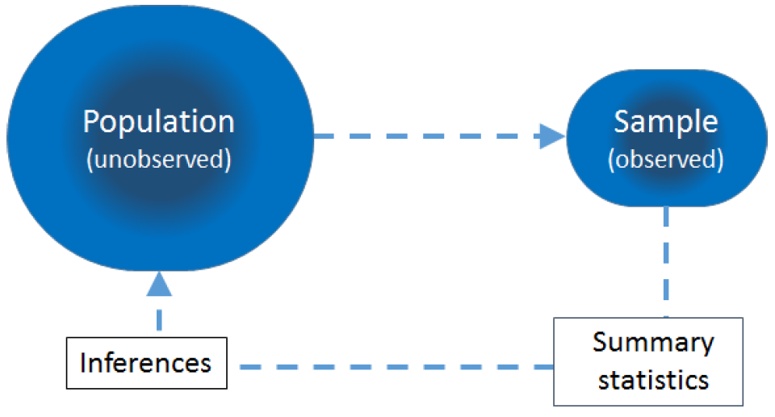
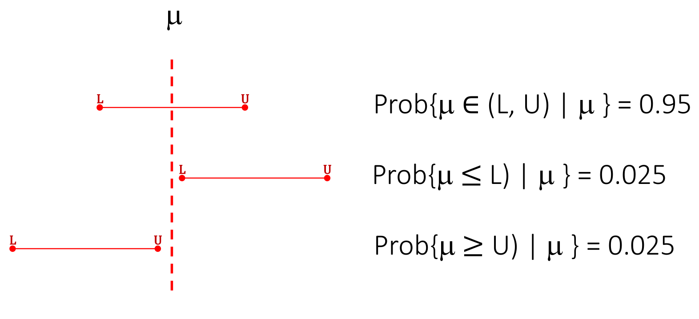
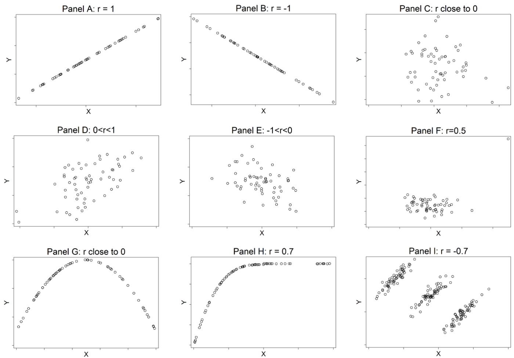
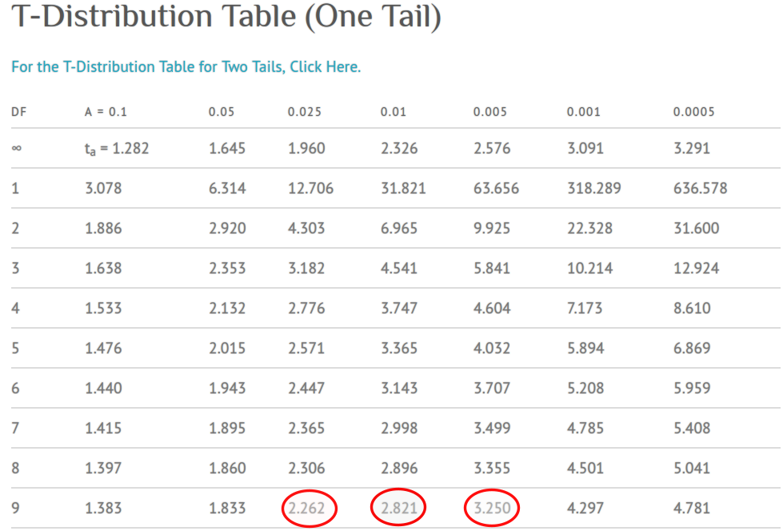

# (PART) 統計分析方法 Analytical Techniques {-}

# 探索數據和簡單描述

##  數據分析的流程


```{r echo=FALSE, fig.asp=.7, fig.width=4, fig.cap='Population, sample and statistical inference', fig.align='center', out.width='70%'}

```

統計推斷的目的，是通過從人群中取樣本，經過對樣本特徵的 (描述) 統計分析 (summary statistic)，去推斷人群的相應特徵。

所以，無論什麼數據，到手以後我們一定要做的第一件事情，就是對其進行總結和描述，其過程又要盡可能地簡單明了。

在絕大多數的科學研究中數據分析都很重要，然而現實是，它多數情況下只出現在研究的第三部分：

1. 研究設計
2. 實施研究，收集數據
3. **數據分析**
4. 結果報告

### 研究設計和實施

正確的統計推斷需要獲得具有代表性可以值得分析的數據，這必須建立在實驗研究設計良好，實施過程縝密的基礎上。設計糟糕，執行效率低下或者漏洞百出的實驗，給出的實驗數據必然是不可靠的，分析它也沒有意義。但是，不是說設計和實施階段就不需要統計學家的參與了。相反地，統計學家必須在研究實施過程中盡可能早的階段 (實驗設計) 參與進來。因為理解了實驗的目的，統計學家才能真正決定這個實驗要收集怎樣的數據，多大的樣本量，實施怎樣的分析方法。這些決定，注定了一項實驗研究的成敗。

### 數據分析

然而現實很殘酷，多數情況下實驗設計階段好像沒有統計學家什麼事，等到了數據分析階段，某些人才拍腦袋想讓統計學家來拯救他們收集的垃圾數據。通常都太晚了 (too late!)。

假設理想狀態下，我們收集到了想要分析的數據，可是接下來的工作流程的第一步，又常常被太多人忽略。許多 “科學家” 興奮地把數據輸入軟件，立刻就開始著手建立數學模型，進行假設檢驗，卻對數據的特徵一無所知！要知道，建立怎樣的模型，做怎樣的推斷，選用什麼樣的分析手段，都必須建立在你對數據內容完全熟悉的前提下，才能正確地實施。

數據分析第一步：**數據清理, data cleaning**。

這一步的目的很簡單，把收集來的粗糙的，充滿了缺失值和數據類型註解等等無法直接分析的數據，整理打扮成可以建模的數據庫。這個過程中，你可能需要對某些變量進行分類，可能兩三個實驗的結果需要被合併協調，可能在這個過程中你會發現數據錄入出現了一些錯誤導致數據庫裡有一些異常值，甚至是重複錄入。所以，各位小伙伴當你拿到一個數據準備分析的第一步，你必須要先了解你的數據。常用的手段包括簡單作圖，對感興趣的變量做概括分析 (summary your data!)。除此之外，由於沒有人能保證實驗中能收集到所有對象的完整數據，我們還需要分析缺失數據的特徵，思考他們為什麼會變成缺失數據。

## 數據類型

不同類型的數據，使用的初步描述手段各不相同。因此區分定性數據和定量數據，連續型數據，離散型數據，分類型數據顯得十分必要。

1. 連續型變量，continuous data  <br>連續型數據多來自實驗中對某些特徵的測量，例如身高，體重等，它們本質上是一組連續型的數據。現實生活中接觸到的許多數據也都是連續型的，例如：時間，距離，骨骼密度，藥物濃度等等。所謂連續型變量是由於它理論上可以取某段數值區間內的任何值。當然我們還會被測量尺度的精確度所局限。
2. 離散型變量，discrete data  <br>許多數據，是通過計數來收集的。離散型變量的本質上也是屬於數值型數據 (numeric)，特徵是這種數值型數據總是**取正整數**或者零。例如，醫院中發生感染的次數，一個家庭中兄弟姐妹的人數，術後患者存活天數等等。
3. 分類型變量，categorical data <br>分類型變量的數據，其每一個觀察值都歸類於一種類別 (或者屬性)。分類型數據和離散型數據最大的不同是，它從本質上說就不屬於數值型數據。例如，頭髮的顏色 (紅色，黃色，黑色)，職業類型 (裝修工人，教師，總統)。儘管分類型數據本質上不是數值，分析過程中我們常常會給它們賦予一定的數值以便於計算。
    1. 二分類型數據，binary：十分常見，例如，生存/死亡，有效/無效，成功/失敗；
    2. 名義型數據，nominal：數據本身沒有高低順序之分，例如，種族，血型等；
    3. 排序型數據，ordinal：每個分類是包函了順序含義的數據，例如，回答某些問卷問題時用的 “十分同意，同意，不同意，十分不同意”，某些癌症使用的分級診斷 “一級，二級，三級，終級”，對一些結果的評價時使用的 “優，良，中，差”。

其實，對於連續型變量我們還常常會將它們轉化成分類型變量，使用一些特定的或者事先定義好的閾值 (cutoff values) 把連續型數據分組，分級，分層等等。最常見的例子就是體重指數 (BMI)，它本身是一個連續型的變量，但是又可以根據定義好的閾值把它分類成低體重 ($< 18.5 \; kg/m^2$)，正常體重 ($18.5 - 24.9 \; kg/m^2$)，超重 ($25-29.9 \; kg/m^2$)，肥胖 ($\geqslant 30 \; kg/m^2$)。另一個例子是血紅蛋白 (haemoglobin, $g/l$)，它本身是一個連續型變量，但是我們利用它的閾值 (女性，$<120 \; g/l$；男性，$< 130 \; g/l$)，作為診斷是否患有貧血症的依據。

把連續型變量進行分類處理的代價是信息的丟失。如果一個人的體重指數是 $25$，他/她的數據被和體重指數為 $29.9$ 的人當作相同數值來對待是否合理是我們需要考慮的問題。而且許多情況下閾值的定義並不能達成共識，即使達成共識的閾值又是十分人為且恣意的，它可能導致一些相關關係被“強化”，或者反過來被“弱化”。所以，如果要對連續型數值進行分組，現在的要求是，在實驗設計階段就必須明確分組的閾值之定義，而不能在看到數據以後進行人為地劃分。**更加不推薦的是直接使用四分位或者五分位來對數據分組。**

##  如何總結並展示數據

光觀察原始數據很難真正明白數據的分佈特徵和形式，所以使用表格，或者用散點圖，柱狀圖等形式來描述數據就成為了常用的手段。前一節所描述的數據類型，決定了一組數據該如何被描述。

###  離散型分類型數據的描述 - 頻數分佈表 frequency table

下面的表格就是使用頻數分佈表來描述 `cars` 這個數據包中不同車速 (mph) 的分佈。汽車車速本身應該是一個連續型變量，但是這是1920年的數據當時的記錄只精確到整數，因此人為地造成了一組離散型變量的情況。下面的第二個表格使用的是繪圖瑞士軍刀包 `ggplot2` 裡自帶的鑽石數據。其中 `cut` 是對於鑽石切割水平的評價，所以是一個帶有排序性質的分組型變量。

```{r, message=FALSE}
data("cars")
epiDisplay::tab1(cars$speed, graph = FALSE)
library(ggplot2); data("diamonds")
epiDisplay::tab1(diamonds$cut, graph = FALSE)
```
離散型變量和分類型變量的描述還可以使用柱狀圖的形式來展示如下：

```{r car-speed, echo=FALSE, fig.asp=.7, fig.width=4, fig.cap='Bar chart displaying the speed of cars', fig.align='center', out.width='80%'}
library(ggthemes)
ggplot(cars, aes(x=speed)) + geom_bar() +
   theme_stata()+labs(x = "Speed (mph)", y = "Frequency")
```

```{r diamonds-cut, echo=FALSE, fig.asp=.7, fig.width=4, fig.cap='Bar chart displaying distribution of evaluation of diamonds cut', fig.align='center', out.width='80%'}
ggplot(diamonds, aes(x=cut)) + geom_bar() +
   theme_stata()+labs(x = "Quality of the cut", y = "Frequency")
```

上面這兩圖的 y 軸都用的是頻率，當然還可以使用百分比。不同組間分類型變量的分佈比較的話更常使用百分比作為 y 軸。如下面的表格及百分比條形圖所示。

```{r message=FALSE}

library(Epi)

diamonds$clarity2g <- "Good"
diamonds$clarity2g[(diamonds$clarity=="I1")|
                    (diamonds$clarity=="SI2")|
                     (diamonds$clarity=="SI1")|
                     (diamonds$clarity=="VS2")] <- "Poor"
tab <- stat.table(index=list(Cut=cut,Clarity=clarity2g),
                   contents=list(count(),percent(cut)), data=diamonds, margins=T)
print(tab, digits = 2)

```

```{r diamonds-cut-clarity, echo=FALSE, fig.asp=.7, fig.width=7, fig.cap='Bar chart displaying distribution of evaluation of diamonds cut by clarity', fig.align='center', out.width='80%'}
library(plyr)
library(ggsci)
T1 <-  table(diamonds$clarity2g, diamonds$cut)
Prop1 <-  T1/rowSums(T1)
Prop1 <- as.data.frame(Prop1)
names(Prop1) <- c("Clarity", "Cut",  "Percent")
ggplot(Prop1, aes(x=Clarity, y=Percent, fill=Cut)) + geom_bar(stat = "identity", width = 0.5)+ theme_bw() +
  coord_flip() + scale_fill_jama() +
  theme(legend.position = "bottom", legend.direction = "horizontal",
         panel.grid.major = element_blank(),
    panel.grid.minor = element_blank(),
    panel.border = element_blank(),
    panel.background = element_blank(),
    axis.line = element_line(colour = "black"))
```

### 連續型變量

連續型變量如果做頻數分佈表一般提供的信息量就較小。常用來描述連續型變量的手段是柱狀圖，histogram，和箱形圖，boxplot。柱狀圖應該不必過多解釋。箱形圖，展示的是連續型變量的中位數，四分位，範圍值，以及異常值。一個典型的箱形圖，中間的方形區域包括了該數據的四分位距，interquartile range (即中間 50% 的數據, IQR)。

```{r diamond-carat-box, echo=FALSE, fig.asp=.7, fig.width=6, fig.cap='Boxplot of the diamond carat data', fig.align='center', out.width='80%'}
boxplot(diamonds$carat[diamonds$carat < 2.1])
```


R作出的箱形圖如 \@ref(fig:diamond-carat-box) 所示，箱子以上的橫線，意為最高值為75%分位值加上1.5倍的IQR；箱子以下橫線，意為最低值為25%分位值減去1.5倍的IQR。其他的觀察值如果不在這個上下限範圍之內的，會用黑點標記出來。這些值被認為是異常值 (outliers)。

## 數據總結方案：位置，分散，偏度，和峰度

### 位置

描述一組連續型變量的位置，location，此處的位置指的是數據分佈的**中心**位置，常用的數值是眾數 (mode)，中位數 (median)，均值 (mean)。
    - 眾數 mode，的定義是，一組數據中出現最多次的數值大小；
    - 中位數 median，的定義是，一組數據中從小到大/或者從大到小排序後50%位置的數值大小，如果觀察值有偶數個，中位數的定義是中間兩個數值的平均值大小；
    - 算術平均值 arithmetic mean 的**大小受異常值影響較大**，通常簡略為均值，其定義可以用下面的表達式：$$\bar{X}=\frac{1}{n}\sum_{i=1}^n X_i$$
    - 幾何平均值 geometrix mean，常用在正偏態分佈數據 (positively skewed data)，其定義為： $$\sqrt[n]{\prod_{i=1}^n X_i}=exp[\frac{1}{n}\sum_{i=1}^n log_e(X_i)]$$
    - 調和平均值 harmonic mean，是所有觀察值的倒數和的倒數，定義為：$$\frac{1}{\frac{1}{n}\sum_{i=1}^n\frac{1}{X_i}}$$


### 分散

數據的分散程度，dispersion，也就是數據的波動大小 variation。同樣均值的數據，他們的分散可能差別很大：

```{r diff-dispersion, echo=FALSE, fig.align='center', fig.cap='Distributions with similar central location but different dispersion', fig.height=8, fig.width=6, out.width='80%'}
par(mfrow=c(2,1))
set.seed(1234)
a <- rnorm(10000,50, 5)
b <- rnorm(10000, 50, 10)
hist(a, xlim=c(0,100), breaks = 25,  col='lightblue',
     xlab = "Mean=50, SD=5", freq = TRUE, main = "")

hist(b, xlim=c(0,100), breaks = 30,  col='lightblue',
     xlab = "Mean=50, SD=10", freq = TRUE, main = "")
```

分散程度的描述方法花樣不少，我們這裡先考慮範圍 (range)，四分位差 (interquartile range)，方差 (variance)，標準差 (standard deviation)。

#### 範圍 range

- 定義：最大值和最小值的差。

- 缺點：受樣本量大小，以及異常值影響較大。

- 在表格，論文中需要同時報告最大值和最小值。

#### 四分位差 interquartile range (IQR)

- 定義：四分位差是包含了數據中間 50% 數值的範圍。即，75%分位數-25%分位數的差值。

- 當觀察值數量為奇數個時，計算方法為：去掉中位數，計算大於中位數和小於兩個部分數值的中位數，求其差，例如：$5,10,12,14,16,19,22$ 這組數字，25%分位數為10，75%分位數為19，所以IQR等於9。

- 當觀察值數量為偶數個時，計算方法為：計算較小的50%數值的中位數，和較大50%數值的中位數，求其差，例如：$5,10,12,14,16,19,22,38$ 這組數字，上下兩半部分的中位數分別是 $Q_L=\frac{10+12}{2}=11;\;Q_U=\frac{19+22}{2}=20.5$，所以，其IQR等於9.5.

- 在表格，論文中需要同時報告25%，75%分位數兩個數值，例：[11,20.5]。

#### 方差和標準差 variance and standard deviation

- 先定義每一個觀察值和均值之間的差為 $D_i = X_i - \bar{X}$。

- 根據定義，$\frac{1}{n}\sum_{i=1}^n D_i=0$。

- 樣本方差 Variance 被定義為 $\frac{1}{n-1}\sum_{i=1}^n D_i^2$。

- 樣本方差的平方根，被定義為標準差 standard deviation，$\text{SD}=\sqrt{\frac{1}{n-1}\sum_{i=1}^n D_i^2}$

- 更常見的表達式為：

$$
\begin{aligned}
\text{Var} &= \frac{1}{n-1}\sum_{i=1}^n (X_i-\bar{X})^2 \\
           &= \frac{1}{n-1}[(\sum_{i=1}^nX_i^2)-n\bar{X}^2]
\end{aligned}
$$

此處分母為 $n-1$ 而不是 $n$ 的原因，需要參考推斷部分的解釋 (Section \@ref(samplevarbias))。

- 方差標準差受異常值影響較大。例如，下面的數據：

$$
5, 9, 12, 14, 14, 15, 16, 19, 22\;\;\; \text{Var}=25.5\\
5, 9, 12, 14, 14, 15, 16, 19, 58\;\; \text{Var}=241.5
$$

### 偏度 skewness

使用柱狀圖來描述數據時，如果柱狀圖左右基本對稱 (中位數和均值基本一致)，偏度為零，正態分佈數據都是左右對稱的。如果柱狀圖右側的尾巴較長，偏度為正；如果左側的尾巴較長，偏度為負。偏度計算公式為：

$$
\frac{\frac{1}{n}\sum_{i=1}^n D_i^3}{(\frac{1}{n}\sum_{i=1}^n D_i^2)^{\frac{3}{2}}}
$$

```{r skewness, echo=FALSE, fig.align='center', fig.cap='Relationship between skew and measures of location', fig.height=10, fig.width=7, out.width='80%'}
set.seed(1234)
par(mfrow=c(3,1))
# normal distribution
 N <- 10000
a <- rnorm(N, 0, 1)
hist(a, breaks = 30,
     xlim=c(min(a), max(a)), probability = T,
   col='lightblue', xlab='Skew = 0 \n mean=median', ylab=' ', axes=F,
   main='Normal \n symmetric',cex.lab=1.5)

# positively skewed

x <- rbeta(N,2,80)
 hist(x, breaks = 30,
 xlim=c(min(x),max(x)), probability=T,
   col='lightblue', xlab='Skew > 0 \n Mean > median', ylab=' ', axes=F,
   main='Positively Skewed \n assymmetric',cex.lab=1.5)

# negatively skewed

x <- rbeta(N,80,2)
hist(x, breaks = 30,
     xlim=c(min(x),max(x)), probability=T,
     col='lightblue', xlab='Skew < 0 \n Mean < median', ylab=' ', axes=F,
     main='Negatively Skewed \n assymmetric',cex.lab=1.5)

```


### 峯度 kurtosis

峯度是描述數據分佈的最後一個指標。峯度衡量的是一組數據分佈的尾部的厚度。一個正態分佈數據，大約 5% 的數據分佈在左右兩邊的尾部 (2.5% 低於 $\mu-2\sigma$，2.5% 高於 $\mu +2\sigma$)。峯度測量的是一組數據尾部數據的分佈和正態分佈兩側尾部數據之間的差距。

峯度的計算公式爲：
$$
\frac{\frac{1}{n}\sum_{i=1}^nD_i^4}{(\frac{1}{n}\sum_{i=1}^nD_i^2)^2}
$$
一個正態分佈數據，峯度值爲 3。當左右兩段的數值佔比低於正態分佈預期時，峯度值小於 3。反之，峯度大於 3。尾部較厚 (峯度較大) 的典型分佈之一是 $t$ 分佈 (圖 \@ref(fig:kurtosis))


```{r kurtosis, echo=FALSE, fig.align='center', fig.cap='t distributions with 5 and 10 degrees of freedom compared with a standard normal distribution', fig.height=4, fig.width=6, out.width='80%'}
set.seed(1234)
#hist(x, breaks = 30, probability = T)
curve(dt(x, 10), xlim = c(-5,5), frame=F, type = "l", lty=2, lwd = 2, xlab = "", ylab = "Density")
curve(dt(x, 5), xlim = c(-5,5), add = T, col="red", type = "l", lty=3, lwd=2)
curve(dnorm(x), xlim = c(-5,5), add = T, col="blue")
legend("topright", legend=c("Normal", "t with 10 df", "t with 5 df"), col=c("blue", "black", "red"), lty = c(1, 2, 3), lwd = c(1, 2, 2) ,bty="n")
```

# 信賴區間 confidence intervals

## 定義

信賴區間的定義，曾經在統計推斷中介紹過 (Section \@ref(CI-for-sample-mean))。信賴區間 (CI)，提供了一種對參數估計精確度的度量。CI，也是一種統計量，有自己的樣本分佈，它總是成對成對地出現的。L，表示下限，U，表示上限。顯著性水平 (confidence level) 下的下限和上限之間的間距大小，是由信賴區間本身的樣本分佈決定的。

一般地，對於一個總體參數 $\mu$，它的 $100(1-\alpha)\%\text{CI}$  信賴區間的含義爲：

$$
\begin{equation}
\text{Prob}\{\mu\in (\text{L}, \text{U}) | \mu\} = (1-\alpha)
\end{equation}
(\#eq:confi)
$$

所以，一個總體參數 $\mu$，的 $95\%\text{CI}$ 信賴區間爲：

$$
\begin{equation}
\text{Prob}\{ \mu \in (\text{L, U}) | \mu\} =0.95
\end{equation}
(\#eq:confinv)
$$

用公式 \@ref(eq:confinv) 來解釋就是，區間 $\text{(L, U)}$ 內包含了總體參數 $\mu$ 的概率爲 $95\%$。本文以下部分從公式中省略 $|\mu$ 部分。但是必須要記住，概率論環境下的信賴區間 (或者其他統計學參數估計) 都是總體參數的條件概率。在概率論語境下，信賴區間一般是左右對稱的。所以 $100(1-\alpha)\%\text{CI}$ 的含義可以解讀爲：

$$
\begin{equation}
\text{Prob} \{ \mu \leqslant \text{L} \} = \text{Prob} \{ \mu \geqslant \text{U} \} = \frac{\alpha}{2}
\end{equation}
(\#eq:confinvmean)
$$


```{r CIdefin, echo=FALSE, fig.asp=.7, fig.width=4, fig.align='center', out.width='80%', fig.cap="General definition of a CI for a 95% CI"}

```


## 利用總體參數的樣本分佈求信賴區間

總體參數的樣本分佈是求其信賴區間的關鍵。假設 $\hat\mu$ 是總體參數 $\mu$ 的估計量。且已知存在兩個單調遞增函數 $A(\mu), B(\mu)$ 來描述該總體參數 $\mu$ ：


$$
\begin{equation}
\text{Prob} \{ \hat\mu \leqslant A(\mu) \} = \text{Prob} \{ \hat\mu \geqslant B(\mu) \} = \frac{\alpha}{2}
\end{equation}
(\#eq:AT4)
$$


所以，


$$
\begin{equation}
\text{Prob} \{ A^{-1} (\hat\mu) \leqslant \mu \} = \text{Prob} \{ B^{-1}(\hat\mu) \geqslant \mu \} = \frac{\alpha}{2}
\end{equation}
(\#eq:AT5)
$$


因此，$A^{-1}(\hat\mu), B^{-1}(\hat\mu)$  就是我們想要找的公式 \@ref(eq:confinvmean) 參數的估計信賴區間的下限 $\text{L}$，和上限  $\text{U}$。所以，關鍵的任務就在於，每一次尋找計算參數樣本分佈的方程 $A, B$ 。

## 情況1：已知方差的正態分佈數據均值的信賴區間

從已知**正態分佈且方差**爲 $\sigma^2$ 的人羣中抽取樣本量爲 $n$ 的相互獨立觀察數據 $Y_i (i=1,2,\cdots,n)$。該樣本均值的估計量 $\hat\mu=\bar{Y}$，也服從方差已知的 $(\frac{\sigma^2}{n})$ 正態分佈：


$$
\begin{equation}
\bar{Y}\sim N(\mu, \frac{\sigma^2}{n}) \Leftrightarrow Z=\frac{\bar{Y}-\mu}{\sqrt{\frac{\sigma^2}{n}}} \sim N(0,1)
\end{equation}
(\#eq:AT6)
$$


所以利用標準正態分佈，往公式 \@ref(eq:confinvmean) 儘可能靠：$\text{Prob}\{ Z \leqslant z_{\alpha/2}\} = \text{Prob}\{ Z \geqslant z_{1-\alpha/2}\} = \frac{\alpha}{2}$ 。

把式子 \@ref(eq:AT6) 代入以後：


$$
\begin{equation}
\text{Prob}\{ \bar{Y} \leqslant \mu+z_{\alpha/2}\frac{\alpha}{\sqrt{n}} \} = \text{Prob}\{ \bar{Y} \geqslant \mu+z_{1-\alpha/2}\frac{\alpha}{\sqrt{n}} \} = \frac{\alpha}{2}
\end{equation}
(\#eq:AT7)
$$


至此，我們找到了描述總體均值的單調函數：


$$
\begin{aligned}
A(\mu) &= \mu + z_{\alpha/2}\frac{\sigma}{\sqrt{n}} \\
B(\mu) &= \mu + z_{1-\alpha/2}\frac{\sigma}{\sqrt{n}}
\end{aligned}
$$


由於標準正態分佈左右對稱，所以 $z_{\alpha/2}=-z_{1-\alpha/2}$ ，因而，$A(\mu) = \mu - z_{1-\alpha/2}\frac{\sigma}{n}$。

此時，求信賴區間上限和下限的方法應該已經一目瞭然：


$$
\begin{equation}
\text{U} =A^{-1}(\bar{Y})=\bar{Y} + z_{1-\alpha/2}\frac{\sigma}{\sqrt{n}} \\
\text{L} = B^{-1}(\bar{Y})=\bar{Y} - z_{1-\alpha/2}\frac{\sigma}{\sqrt{n}}
\end{equation}
(\#eq:AT2-8)
$$


我們也常將它簡寫成爲：$\text{CI} = \bar{Y} \pm z_{1-\alpha/2}\frac{\sigma}{\sqrt{n}}$。

它的意義是：


$$
\begin{equation}
\text{Prob} \{ \bar{Y} - z_{1-\alpha/2}\frac{\sigma}{\sqrt{n}} < \mu < \bar{Y} + z_{1-\alpha/2}\frac{\sigma}{\sqrt{n}} \} = 1-\alpha
\end{equation}
(\#eq:AT2-9)
$$


所以區間 $(\bar{Y} - z_{1-\alpha/2}\frac{\sigma}{\sqrt{n}}, \bar{Y} + z_{1-\alpha/2}\frac{\sigma}{\sqrt{n}})$ 包含了總體參數均值 $(\mu)$ 的概率是 $1-\alpha$。我們把這個區間叫做總體均值 $\mu$ 的 $100(1-\alpha)\%$ 信賴區間。常說的 $95\%$ 信賴區間我們使用的 $z_{0.975} = 1.96$。其他置信水平的 $z$ 值舉例如下：


$$
\begin{array}{lr}
z_{0.90} = 1.28 &  \text{for } 80\% \text{ level} \\
z_{0.95} = 1.645 &  \text{for } 90\% \text{ level} \\
z_{0.995} = 2.58 &  \text{for } 99\% \text{ level} \\
z_{0.9995} = 3.29 &  \text{for } 99.9\% \text{ level} \\
\end{array}
$$


所以，根據上面羅列的不同置信水平下 $z$ 值的大小，我們不難判斷 $\text{CI} = \bar{Y} - z_{1-\alpha/2}\frac{\sigma}{\sqrt{n}}$ 範圍隨着標準差增大而變寬 (不精確)，隨着樣本量增加而變窄 (精確)。

這裏補充另一個容易混淆的概念，參數估計的信賴區間公式 $\text{CI} = \bar{Y} \pm z_{1-\alpha/2}\frac{\sigma}{\sqrt{n}}$ ，和參考值範圍 (reference range) 是不同的概念。後者的公式爲 $\bar{Y}\pm z_{1-\alpha/2} \sigma$。參考值範圍的意義是， $95\%$ 的樣本數據包含在這個區間內。信賴區間，給出的是這個樣本對總體均值的估計的**精確度**。

## 信賴區間的意義 {#CImean}

當 $\alpha = 0.05$ 時，我們說$(\bar{Y} - z_{1-\alpha/2}\frac{\sigma}{\sqrt{n}}, \bar{Y} + z_{1-\alpha/2}\frac{\sigma}{\sqrt{n}})$ 包含了總體參數均值 $(\mu)$ 的概率是 $95\%$。但是要記住，千萬不能說：總體參數 $\mu$ 有 $95\%$ 的概率落在這個信賴區間內。因爲**總體參數不是隨機變量**，它不會隨我們的樣本變化而變化，它是恆定不變的。我們每一次實驗，每一次採樣，獲得的樣本數據，計算出一個新的信賴區間，這樣的區間都是在估計這個未知位置的總體參數。所以，**從長遠來說，相同的實驗，重複20次，其中19次計算獲得的信賴區間，會包含真實的總體參數。**

## 情況2：未知方差，但是已知服從正態分佈數據均值的信賴區間 {#AT2-5}

多數情況下，總體的方差我們無從知曉。它也必須通過實驗數據來估計 $\hat\sigma^2$。那麼，下面的公式計算的統計量 $T$ 服從自由度爲 $n-1$ 的 $t$ 分佈：

$$
T=\frac{\bar{Y}-\mu}{\sqrt{\hat\sigma^2/n}} \sim t_{n-1}
$$

用跟前面類似的辦法，用統計量 $T$ 取代 $Z$，我們可以求未知方差時正態分佈數據均值的信賴區間 (類比 \@ref(eq:AT2-8))：


$$
\begin{aligned}
&\text{U} = \bar{Y} + t_{n-1, 1-\alpha/2}\frac{\sigma}{\sqrt{n}} \\
&\text{L} = \bar{Y} - z_{n-1, 1-\alpha/2}\frac{\sigma}{\sqrt{n}} \\
&\text{Or, equivalently :} \\
&\text{CI } = \bar{Y} \pm t_{n-1, 1-\alpha/2}\frac{\sigma}{\sqrt{n}}
\end{aligned}
(\#eq:AT2-10)
$$

## 情況3：服從正態分佈的隨機變量方差的信賴區間 {#varCI}

用 $Y_i (i=1,2,\cdots,n)$ 標記樣本量爲 $n$ 的獨立觀察數據。已知該數據來自的人羣服從正態分佈，但是方差未知。那麼從統計推斷第二章 (Section \@ref(samplevar)) 推導過的內容，我們知道：

$$
\begin{aligned}
&\text{Sample variance is defined as: } \\
&\hat\sigma^2 = \frac{\sum_{i=1}^n(Y_i-\bar{Y})^2}{n-1} \\
&\text{and } \\
&\frac{(n-1)\hat\sigma^2}{\sigma^2} \sim \chi^2_{n-1} \\
&\text{It follows that we want } \\
&\text{Prob}\{ \hat\sigma^2 \leqslant \frac{\sigma^2}{n-1}\chi^2_{n-1, \alpha/2} \} = \text{Prob}\{ \hat\sigma^2 \geqslant \frac{\sigma^2}{n-1}\chi^2_{n-1, 1-\alpha/2} \} = \frac{\alpha}{2} \\
& \Rightarrow \text{U} = \frac{(n-1)\hat\sigma^2}{\chi^2_{n-1, \alpha/2}} \; \text{L} = \frac{(n-1)\hat\sigma^2}{\chi^2_{n-1, 1-\alpha/2}} \\
\end{aligned}
$$


## 當樣本量足夠大時

根據中心極限定理，當樣本量足夠大時，**樣本均數**服從正態分佈，即使**樣本數據**並不服從正態分佈。這就意味着，樣本足夠大，章節 \@ref(CImean) 中用到的均值信賴區間公式，也可適用於樣本數據不服從正態分佈的情況下。我們常使用這個定理，和章節 \@ref(CImean) 中的公式去計算許多總體均數以外的參數的 $95\%$ 信賴區間，通過正態分佈近似法計算獲得的信賴區間，被叫做近似信賴區間。

## 情況4：求人羣百分比的信賴區間

### 一般原則

用 $R$ 表示 $n$ 次實驗中成功的次數。如果滿足實驗相互獨立的條件，那麼 $R\sim \text{Binomial}(n,\pi)$。那麼樣本比例 $P=\frac{R}{n}$ 是人羣比例 $\pi$ 的無偏估計。如果想要求 $\pi$ 的 $95\%$ 信賴區間 $(\pi_L, \pi_U)$，我們可能自然而讓想到用成功次數 $R$ 來計算。然而，由於 $R$ 本身是離散型變量 (只能取大於等於零的整數)，恰好加起來概率等於 $95\%$ 的 $\pi$ 的區間是幾乎不可能計算的。我們處理比例的信賴區間的問題時，要計算的兩個下限值和上限值要滿足的條件：

1. 尋找最小的 $\pi_L$ 滿足 $\text{Prob}(\pi_L>\pi) \leqslant 0.025$
2. 尋找最大的 $\pi_U$ 滿足 $\text{Prob}(\pi_U<\pi) \leqslant 0.025$

有兩種方案可供選擇：

1. 利用樣本分佈服從二項分佈 $R \sim \text{Binomial}(n, \pi)$ 的原則來“精確”計算；
2. 正態近似法計算。

第一種方法被叫做精確法，並不是因爲它能夠精確計算恰好概率和等於 $95\%$ 的所有的 $\pi$，而是因爲它利用的是樣本分佈的二項分佈屬性進行計算。然而隨着樣本量的增加，兩種方法計算的信賴區間結果越來越接近概率和 $95\%$。

### 二項分佈的“精確法”計算信賴區間 {#exactprop}

例：樣本量 $n=20$, 成功次數 $r=5$ 時，你可以用查水錶的辦法，也可以利用 R 進行精確計算


```{r}
binom.test(5, 20, conf.level = 0.95)
```

下面兩個圖分別展示了當 $\pi$ 等於精確法計算的下限和上限時的概率分佈。可以看出 $\pi=0.0866$ 時，$\text{Prob}\{R \geqslant 5\} \leqslant 0.025$。同時，當 $\pi = 0.4910$ 時， $\text{Prob}\{ R\leqslant 5 \} \leqslant 0.025$

```{r ATfig2-1, echo=FALSE, fig.asp=.7, fig.width=7, fig.cap='Sampling distribution of number of successes out of 20 (R) conditional on the probability of success being 0.0866', fig.align='center', out.width='70%'}
source("graphbinom.R")
graph.binom(20, 0.0866)
```


```{r ATfig2-2, echo=FALSE, fig.asp=.7, fig.width=7, fig.cap='Sampling distribution of number of successes out of 20 (R) conditional on the probability of success being 0.4910', fig.align='center', out.width='70%'}
source("graphbinom.R")
graph.binom(20, 0.4910)
```

### 二項分佈的近似法計算信賴區間

當 $n$ 較大時，百分比 $P$ 分佈 可以用正態分佈來近似：

$$
P\sim N(\pi, \sigma^2) \text{ where } \sigma^2 = \frac{\pi(1-\pi)}{n}
$$

總體均值用樣本百分比 $p$ 替代，方差用樣本方差 $\hat\sigma^2 = \frac{p(1-p)}{n}$，因此，當樣本量較大時二項分佈的近似正態分佈特徵可以描述爲：

$$
P \sim N(p, \hat\sigma^2) \text{ where } \hat\sigma^2 = \frac{p(1-p)}{n}
$$

接下去對與百分比的信賴區間的計算就可以套用章節 \@ref(CImean) 中用到的均值信賴區間公式：

$$
\begin{aligned}
& P\pm z_{1-\alpha/2}\sqrt{\frac{P(1-P)}{n}}  \\
& \text{ where } z_{1-\alpha/2} = 1.96 \text{ for } 95\% \text{CI}
\end{aligned}
(\#eq:AT2-16)
$$

正態近似法的好處是簡單，但是代價就是樣本量小時不準確。

例如：

1. $n=10, r=4, p=0.4$ 時
    - 精確法 $95\%$ 信賴區間：`r binom.test(4,10, 0.4)$conf.int[1:2]`
    - 正態近似法 $95\%$ 信賴區間：$0.4\pm1.96\sqrt{\frac{0.4\times0.6}{10}} =$ `r 0.4-1.96*sqrt((0.4*0.6)/10)`, `r 0.4+1.96*sqrt((0.4*0.6)/10)`

2. $n=50, r=20, p=0.4$ 時
    - 精確法 $95\%$ 信賴區間：`r binom.test(20, 50, 0.4)$conf.int[1:2]`
    - 正態近似法 $95\%$ 信賴區間： $0.4\pm1.96\sqrt{\frac{0.4\times0.6}{50}} =$ `r 0.4-1.96*sqrt((0.4*0.6)/50)`, `r 0.4+1.96*sqrt((0.4*0.6)/50)`

2. $n=1000, r=400, p=0.4$ 時
    - 精確法 $95\%$ 信賴區間：`r binom.test(400, 1000, 0.4)$conf.int[1:2]`
    - 正態近似法 $95\%$ 信賴區間： $0.4\pm1.96\sqrt{\frac{0.4\times0.6}{1000}} =$ `r 0.4-1.96*sqrt((0.4*0.6)/1000)`, `r 0.4+1.96*sqrt((0.4*0.6)/1000)`

可以明顯看到隨着樣本量增加，信賴區間本身的範圍在不斷變小 (精確)。且正態近似法計算的信賴區間也越來越接近“精確法”。“Statistical Methods in Medical Research” [@Armitage2008] 書中建議，滿足 $n\pi \geqslant 10 \text{ or } n(1-\pi) \geqslant 10$ 時，正態近似法可以給出較爲滿意的百分比的信賴區間估計。

## 率的信賴區間 {#CIrate}

### 利用泊松分佈精確計算

假設在一段時間 $t$ 內某事件發生的次數記爲 $Y$。如果每個相同事件的發生相互獨立那麼 $Y \sim \text{Poisson}(\mu t)$。樣本率 $R=\frac{Y}{t}$，是人羣事件發生概率 $\mu$ 的無偏估計。

$$
\text{The probability that } Y=y \text{ is given by } \frac{(\mu t)^y e^{-\mu t}}{y!} \text{ for } y= 0,1,2,\cdots,\infty
$$

與前一節百分比的精確計算信賴區間相類似 (Section \@ref(exactprop))，我們可以使用泊松分佈的性質進行計算：


1. 尋找最小的 $\mu_L$ 滿足 $\text{Prob}(\mu_L>\mu) \leqslant 0.025$
2. 尋找最大的 $\mu_U$ 滿足 $\text{Prob}(\mu_U<\mu) \leqslant 0.025$

例：某核電站附近的村莊從1968年起的10年內，發生了 6 人死於白血病。平均死亡率爲 0.6/年。計算死亡率的95%信賴區間。

可以利用 R 的精確計算發病率的代碼 `poission.test` 來獲得精確法率的信賴區間：

```{r}
poisson.test(6, 10)
```

### 利用正態近似法計算

當樣本量較大時，發生事件次數 $Y$ 近似服從正態分佈，其均值和方差均等於 $\mu t$ (參考 Section \@ref(poisson) 推導)：

$$
Y \sim N(\mu t, \sigma^2) \text{ where } \sigma^2=\mu t
$$

所以事件發生率 $\mu$ 的信賴區間公式爲 $\frac{Y\pm 1.96\sqrt{Y}}{t}$。

# 假設檢驗

## 拋硬幣的例子

對數據進行假設檢驗是統計分析最重要的部分。一般進行實驗或者調查時我們會先設定一個零假設。假如實驗或者調查中獲得的一系列數據可以認爲是相互獨立且隨機地從人羣中抽取的樣本，那麼根據零假設爲真的條件，樣本數據提供的參數估計和零假設條件下的參數應該是差距不大 (一致) 的。因爲概率論環境下，我們用樣本數據來作假設檢驗，如果樣本提供的數值比起零假設條件下的參數大很多或者小很多，我們就有理由，有證據拒絕零假設。

下面用投硬幣作爲例子說明。硬幣如果是公平的，那麼拋硬幣後正反面出現的概率應該一樣，都是 $50\%$ (零假設：$p=0.5$)。假如有一枚硬幣，拋了 $10$ 次只有一次是反面朝上的，我們可能就會懷疑，這枚資本主義硬幣一定是被做了手腳 (變得不再公平了)，這就是通過實驗質疑和挑戰零假設的思想。如此粗糙的想法卻是統計學假設檢驗的理論起源。只是在統計學裏面，需要制定一些規則來規定，實驗數據跟零假設 (設想) 差異達到多大時 (檢驗)，認爲證據足夠達到相信零假設“非真” (挑戰權威)。

檢驗的過程，就是計算我們朝思暮想的 $p$ 值。$p$ 值的定義是，當零假設爲真時，我們**觀察到的實驗結果以及比這個結果更加極端 (雙側) 的情況**在所有可能的情況中出現的概率。繼續使用拋硬幣的例子來說的話，跟 “$10$ 次拋硬幣出現一次反面朝上” 一樣極端或者更加極端的事件有：

- "一次反面朝上"，
- “零次反面朝上”，
- “九次反面朝上 (或者說一次正面朝上)”，
- “十次反面朝上 (或者說零次正面朝上)”。

相反地，沒有觀察事件 “$10$ 次拋硬幣出現一次反面朝上” 那麼極端的事件就包括了：

- “兩次反面朝上”，
- “三次反面朝上”，
- “四次反面朝上”，
- “五次反面朝上”，
- “六次反面朝上”，
- “七次反面朝上”，
- “八次反面朝上”。

檢驗的過程我們會定義一個被檢驗的統計量，一般就是我們感興趣的參數的估計 (estimator of a parameter of interest)。在上面拋硬幣的例子中，這個檢驗統計量就是 “硬幣反面朝上的次數”。觀察到的反面朝上次數除以拋硬幣次數 ($10$ 次) 就是獲得硬幣反面朝上的概率 (參數) 的估計。用 $R$ 表示十次拋硬幣中觀察到反面朝上的次數，那麼此時 $R$ 就是一個服從二項分佈的隨機變量，其服從的二項分佈成功 (反面朝上事件發生) 的概率 (參數) 是$\pi$。所以某一次實驗中 (拋十次硬幣算一次實驗)，$R=r$，那麼這次試驗的參數估計的 $p$ 值被定義爲：

$$
\begin{equation}
\text{Prob}\{ R \text{ as or more extreme than } r | \pi=0.5 \}
\end{equation}
(\#eq:AT3-1)
$$

零假設：反面朝上出現的概率是 $\pi=0.5$；替代假設： $\pi\neq 0.5$。當零假設爲真時，$R\sim \text{Bin}(10, 0.5)$，它的零假設分佈如下圖 \@ref(fig:ATfig3-1)：

```{r ATfig3-1, echo=FALSE, fig.asp=.7, fig.width=7, fig.cap='Binomial distribution n=10, \U03C0 = 0.5', fig.align='center', out.width='80%'}
 x <- (dbinom(0:10, size = 10, prob = 0.5))
  barplot(x, yaxt="n",
          col = "lightblue",
          ylim = c(0, 0.3),
          names.arg = 0:10, ylab = "Probability", xlab = "R (Number of tails)",
          main = 'Binomial Distribution (10,0.5)')
  axis(2, at=seq(0, 0.3, 0.1), las=2)
```

本節拋硬幣的例子我們觀察到十次拋硬幣只有一次反面朝上，$r=1$。其發生的概率等於上面列舉的四種與之同等極端或者更加極端的情況發生概率之和：

$$
\begin{aligned}
&\text{Prob} \{R=0|\pi=0.5\} + \text{Prob} \{R=1|\pi=0.5\} + \text{Prob} \{R=9|\pi=0.5\} + \text{Prob} \{R=10|\pi=0.5\} \\
& = (\binom{10}{0} + \binom{10}{1} + \binom{10}{9} + \binom{10}{10})\times(0.5)^{10} = 0.021
\end{aligned}
$$

### 單側和雙側檢驗

在上面的例子中其實我們已經用到了雙側檢驗的概念。例如，我們把 “九次反面朝上” 事件發生的概率當作和 “一次反面朝上” 事件發生的概率具有同等 “極端”概率事件，但是其實在圖 \@ref(fig:ATfig3-1) 中也能看出兩種事件發生的方向是在概率分佈的左右兩側，這就是典型的雙側檢驗思想。一個“單側”檢驗則不考慮另一個方向發生的極端事件。

還是用本節的例子，如果要計算單側檢驗 $p$ 值：

$$
\begin{aligned}
&\text{Prob}\{R\leqslant r| \pi=0.5\}\\
&\text{In the example } r=1 \\
&\Rightarrow \text{Prob}\{R=0 | \pi = 0.5\} + \text{Prob}\{ R=1 | \pi = 0.5 \} = 0.011
\end{aligned}
$$

此時零假設爲 $\pi=0.5$，替代假設爲 $\pi < 0.5$。

大多數時候，單側檢驗的 $p$ 值十分接近雙側檢驗 $p$ 值的一半。但是實施單側假設檢驗的前提是，我們有絕對的把握事件不會發生另一個方向上，但是這種情況少之又少，所以基本上你能看到的絕大多數假設檢驗計算的 $p$ 值都是雙側檢驗 $p$ 值。

### $p$ 值的意義

假設檢驗被認爲是作決策的一種手段。你會看到一些人使用 $0.05$ 作閾值來作爲拒絕 ($<0.05$) 或接受 ($>0.05$) 零假設的依據。許多醫學實驗，醫學研究的結果確實是用來作決策的依據。例如某個臨牀試驗用隨機雙盲對照實驗法比較新藥物和已有藥物對某種疾病的治療效果差異，通過實驗結果來決定是否向市場和患者推廣新的治療藥物，此時 $p$ 值的大小就是作決斷的重大依據。然而還有另外的很多實驗/研究並非爲了作什麼直接的決策，可能只是爲了更多的瞭解疾病發生的原因和機制。例如可能乳腺癌多發在女性少發在男性人羣，這顯然是十分顯著的差異，但是這種結果不能讓我們決策說要不要改變一個人的性別，而只是提供了疾病發生發展過程的機理上的證據。因此，許多研究者主張**把 $p$ 值大小當作是反對零假設證據的強弱指標**。但是此處要指出的是，並非**所有統計學家都認同 $p$ 值大小真的可以度量證據的強弱水平**。

所以，建議在寫論文，作報告時，儘量避免說：“本次實驗研究結果具有顯著的統計學意義，there was evidence that the result was statistically significant”。建議使用的語言類似這樣：“在顯著性水平爲 5% 時，本研究結果達到了統計學意義，statistically significant at the 5% level”；或者 “在顯著性水平爲 5% 時，我們的研究提供了足夠的證據證明零假設是不正確的，there was evidence that at the 5% level, that the hypothesis being tested was incorrect”。

如果一個實驗結果 $p$ 值大於 0.05，可以被解讀爲：實驗結果不能提供足夠的證據證明零假設是錯誤的，there was no (or insufficient) evidence against the null hypothesis。另外還有一些人會使用一些詞語來描述 $p$ 值大小：如果 $p=0.0001$，可能會被解讀爲實驗提供了“強有力的證據”，反對零假設；如果 $p=0.06; p=0.04$，會被人解讀爲是具有“臨界統計學意義，borderline statistically significant”，或者試驗結果提供了“一些證據，some evidence” 反對零假設。

### $p$ 值和信賴區間的關係

總體參數 $\mu$ 如果真的被我們計算的估計值的 $95\%$ 信賴區間所包含，那麼 $p > 0.05$。如果參數 $\mu$ 不被計算的 $95\%$ 信賴區間所包含，那麼 $p < 0.05$。

## 二項分佈的精確假設檢驗

若 $n$ 次實驗中成功次數爲 $R$，那麼樣本百分比 (估計，estimator) $P=\frac{R}{n}$ 是它的人羣比例 $\pi$ (參數，parameter) 的無偏估計。欲檢驗的零假設 $\pi=\pi_0$，替代假設 $\pi\neq\pi_0$，且某一次觀察結果爲 $R=r$，我們要計算的 $p$ 值就是在零假設條件下，所有情況中 $R=r$ 或者與之同等極端甚至更加極端的事件所佔的比例。

- 如果 $r<n\pi_0$，單側 $p$ 值等於

$$
\begin{aligned}
p & = \text{Prob}\{ r\text{ or fewer successes out of n | \pi=\pi_0} \} \\
  & = P_0 + P_1 + P_2 + \cdots + P_r \\
\text{Where } & P_x = \binom{n}{x} \pi_0^x (1-\pi_0)^{n-x}
\end{aligned}
$$

- 如果 $r>n\pi_0$，單側 $p$ 值等於

$$
\begin{aligned}
p & = \text{Prob}\{ r\text{ or more successes out of n | \pi=\pi_0} \} \\
  & = P_r + P_{r+1} + P_{r+2} + \cdots + P_{n} \\
\text{Where } & P_x = \binom{n}{x} \pi_0^x (1-\pi_0)^{n-x}
\end{aligned}
$$

一般情況下兩個單側 $p$ 值很接近，所以雙側 $p$ 值就可以計算其中一個然後乘以 $2$。你也可以計算兩側的單側 $p$ 值然後相加。

## 當樣本量較大

如果樣本量 $n$ 比較大，那麼計算上面的精確法是十分繁瑣的 (計算器也會累。。。)。可以考慮利用中心極限定理用正態近似法進行假設檢驗。此時需要做的就是把近似後的正態分佈標準化，然後和標準正態分佈做比較獲得 $p$ 值即可：

$$
\begin{equation}
Z=\frac{R-E(R)}{\sqrt{\text{Var}(R)}} = \frac{R-E(R)}{\text{SE}(R)}
\end{equation}
(\#eq:binapprox)
$$

在目前爲止人類所知道的範圍內，上面公式的 $Z$ 值隨着實驗樣本量 $n$ 的增加而無限接近標準正態分佈 $N(0,1)$。

## 二項分佈的正態近似法假設檢驗

二項分佈的特徵值：

$$
E(R) = n\pi_0; \text{ and Var}(R) = n\pi_0(1-\pi_0)
$$

套用公式 \@ref(eq:binapprox)，計算 $Z$ 值如下：

$$
\begin{aligned}
Z & = \frac{R-E(R)}{\sqrt{\text{Var}(R)}} \\
  & = \frac{R-n\pi_0}{\sqrt{n\pi_0(1-\pi_0)}} \\
  & = \frac{P-\pi_0}{\sqrt{\frac{\pi_0(1-\pi_0)}{n}}} \\
\text{Where } & P=\frac{R}{n}
\end{aligned}
$$

利用實驗數據的 $p=r/n$，以及零假設時的 $\pi_0$，就可以計算上面的觀察 $Z$ 值，之後查閱標準正態分佈的概率表格就可以獲得單側 $p$ 值，別忘了乘以 $2$。

### 連續性校正 continuity correction

在使用正態分佈近似法進行二項分佈數據的假設檢驗時，我們其實是在使用一個連續型分佈近似一個離散型分佈，誤差通常會比較大。我們會使用矯正後的正態近似法計算 $Z$ 值：

$$
Z=\frac{|R-n\pi_0|-\frac{1}{2}}{\sqrt{n\pi_0(1-\pi_0)}}  \text{ or } Z=\frac{|P-\pi_0|-\frac{1}{2n}}{\sqrt{\frac{\pi_0(1-\pi_0)}{n}}}
$$

“Statistical Methods in Medical Research” [@Armitage2008] 書中建議，滿足 $n\pi \geqslant 10 \text{ or } n(1-\pi) \geqslant 10$ 時近似法計算的 $p$ 值可以給出較爲滿意的結果。另外，當 $n>100$ 則建議不再進行連續性校正，即把校正部分的 $-\frac{1}{2}$ 或者 $-\frac{1}{2n}$ 去掉。

## 情況1：對均值進行假設檢驗 (方差已知) {#AT3-5}

假設從已知方差 $(\sigma^2)$ 的人羣中隨機抽取樣本進行血糖值測量 $(Y_n)$，該樣本測量的人羣的平均血糖值爲 $\mu=\bar{Y}$，假設我們要比較該人羣的血糖值和某個理想血糖值 $\mu_0$，進行假設檢驗：

$$\text{H}_0: \mu=\mu_0 \text{ v.s. H}_1: \mu\neq\mu_0$$

根據中心極限定理，當 $n$ 足夠大，樣本均值 $\bar{Y}$ 的分佈接近正態分佈，且均值 $\mu$，方差 $\frac{\sigma^2}{n}$。所以可以計算 $Z$ 值：

$$
Z = \frac{\bar{Y}-E(\bar{Y})}{\sqrt{\text{Var}\bar{Y}}} = \frac{\bar{Y}-\mu_0}{\sqrt{\sigma^2/n}}
$$

進而計算其 $p$ 值：

$$
\begin{aligned}
p &= \text{Prob}(\bar{Y}\leqslant\bar{y}|\mu=\mu_0) \\
  &= \text{Prob}(Z<\frac{\bar{y}-\mu_0}{\sqrt{\sigma^2/n}}) \\
  &= \Phi(\frac{\bar{y}-\mu_0}{\sqrt{\sigma^2/n}}) \\
\text{Where } & \Phi \text{ is the distribution function for a } N(0,1) \text{distribution}
\end{aligned}
$$

所以計算了上面的單側 $p$ 值以後別忘了乘以 $2$ 以獲得雙側 $p$ 值：

$$
\text{Two-sided } p \text{ value } = 2\times[1-\Phi(\frac{\bar{y}-\mu_0}{\sqrt{\sigma^2/n}})]
$$

## 情況2：對均值進行假設檢驗 (方差未知) the one-sample t-test {#OneSampleT}

如果方差未知，我們仍要比較一個樣本均值和一個數值的話，零假設和替代假設依然不變：

$$\text{H}_0: \mu=\mu_0 \text{ v.s. H}_1: \mu\neq\mu_0$$

但是此時計算的統計量的分母，總體方差的地方使用了樣本方差 $\frac{\hat\sigma^2}{n}$ 替代時，該統計量不再服從標準正態分佈，而服從自由度爲 $n-1$ 的 $t$ 分佈。$t$ 分佈看上去和標準正態分佈很像，但是其分佈的雙側尾部“較厚”，峯度大於 3：

$$
T = \frac{\bar{Y}-\mu_0}{\sqrt{\hat\sigma^2/n}} \sim t_{n-1}
$$


```{r tdistrifig, echo=FALSE, fig.align='center', fig.cap='Student t distributions with 1, 4 and infinity degrees of freedom compared with a standard normal distribution', fig.height=4, fig.width=6, out.width='80%'}
set.seed(1234)
#hist(x, breaks = 30, probability = T)
curve(dt(x, 1), xlim = c(-5,5), ylim = c(0, 0.4),
      frame=F, type = "l", lty=2, lwd = 2, xlab = "", ylab = "Density")
curve(dt(x, 4), xlim = c(-5,5), add = T, col="red", type = "l", lty=3, lwd=2)
curve(dnorm(x), xlim = c(-5,5), add = T, col="blue")
legend("topright", legend=c("Infinity", "t with 1 df", "t with 4 df"), col=c("blue", "black", "red"), lty = c(1, 2, 3), lwd = c(1, 2, 2) ,bty="n")
```


## 情況3：對配對實驗數據的均值差進行假設檢驗 the paired t-test

配對 t 檢驗可以用於實驗前後數據的比較，或者是某兩個對象兩兩配對時的均值比較。這樣的實驗數據我們就可以去配對數據的差值，然後利用單樣本 t 檢驗比較這個配對數據的差是否等於零。


# 相關 association

## 背景介紹

兩個變量如果相關 (associated)，那麼它們二者中的一個的分佈是依賴另一個的分佈的 the distribution of one is dependent on the value taken by the other and vice-versa。統計學中如何描述兩個變量之間的相關關係取決於兩個變量的性質 (連續型還是分類型，continuous or categorical variables)。本章討論不同情形下兩個變量相關關係及統計學上的假設檢驗方法。

兩個變量之間的關係除了可以用相關來描述，還可以利用迴歸的手段來分析。但是迴歸分析，和本章討論的相關性分析的本質區別在於，相關分析着重討論兩個變量的聯合分佈 (joint distribution)，而迴歸分析則是要探索一個變量在另一個變量的條件下的條件分佈 (conditional distribution)。因此，相關分析從某種意義上來說是對稱的 (X 與 Y 的相關性等同於 Y 與 X 的相關性)，迴歸分析則不然 (Y 對 X 的迴歸不等同與 X 對 Y 的迴歸)。

另外一個要點是，**相關分析絕不討論因果關係。**

## 兩個連續型變量的相關分析

### 相關係數的定義

在概率論 (Section \@ref(correlation)) 中也已經介紹過相關係數 $\rho$ 的定義：

$$
\begin{equation}
\rho=\frac{E[(X-E(X))(Y-E(Y))]}{\sqrt{E(X-E(X))^2E(Y-E(Y))^2}} = \frac{\text{Cov}(X,Y)}{\sqrt{V(X)V(Y)}}
\end{equation}
(\#eq:AT4-1)
$$

用 $\textbf{x}=\{x_1, x_2, \cdots, x_n \}$ 和 $\textbf{y}=\{ y_1, y_2, \cdots, y_n \}$ 表示對 $n$ 個隨機研究對象測量的兩個變量。那麼這兩個變量的相關關係 $r$ 的計算式爲：

$$
\begin{equation}
r = \frac{\sum(x_i-\bar{x})(y_i-\bar{y})}{\sqrt{\sum(x_i-\bar{x})^2\sum(y_i-\bar{y})^2}} = \frac{S_{xy}}{S_xS_y}
\end{equation}
(\#eq:AT4-2)
$$

$S_{xy}$ 代表樣本數據的協方差 (Section \@ref(covariance))，$S_x$ 是變量 $X$ 的樣本標準差 (有時會記爲 $\hat\rho_x$)，$S_y$ 是變量 $Y$ 的樣本標準差。$r$ 被命名爲相關係數 $\rho$ 的 Pearson 积矩估計 (Pearson Product-Moment estimator)。


### 相關係數的性質

```{r rho-char, echo=FALSE, fig.asp=.7, fig.width=10, fig.cap='Examples of Peason correlation coefficients', fig.align='center', out.width='100%'}

```

上圖 \@ref(fig:rho-char) 描述了9種不同設定時的相關係數 $r$。$r$ 的主要性質可以總結爲：

1. $r$ 的取值範圍是 $-1\sim1\text{, i.e. } -1\leqslant r \leqslant 1$；
2. $r>0$ 時，二者呈正相關， $r<0$ 時，二者呈負相關；
3. 當且僅當兩個變量的散點圖呈現圖 \@ref(fig:rho-char) 中 A，B 顯示的直線時才有 $|r|=1$，然而直線的坡度卻與相關係數無關；
4. 如果兩個變量之間沒有**直線的 linear**相關關係，那麼相關係數 $r$ 會接近於零；
5. 求 X 和 Y 的相關係數，等同於求 Y 和 X 的相關係數 (**與迴歸不同**)；
6. 相關係數 $r$ 沒有單位，並且位置不會發生改變 (location invariant)，如果兩個變量乘以或者除以，加上或者減去任意常數，不會改變相關係數的大小 (**與迴歸不同**)。

圖 \@ref(fig:rho-char) 中 F 顯示的相關關係可以看出，$r$ 受異常值的影響很大，如果將右上角的異常值從數據中去除掉的話，該圖中的相關係數會變小到幾乎爲零。G 和 H 則表示非線性相關時，Pearson 相關係數不適用。I 則告訴我們如果不熟悉數據本身的分佈的話，如果只看總體的相關是多麼的危險 (總體爲負相關，但是在不同的分層數據中卻是呈正相關的)。

### 對相關係數是否爲零進行假設檢驗

在線性迴歸 (Section \@ref(t-r2-F)) 中會討論和證明 Pearson 相關係數和統計量 $t$ 之間的關係，該公式也被用於檢驗相關係數是否爲零：

$$
\begin{equation}
T=r\sqrt{\frac{n-2}{1-r^2}} \sim t_{n-2}
\end{equation}
(\#eq:AT4-3)
$$


### 相關係數的 $95\%$ 信賴區間


如果要計算相關係數 $r$ 的信賴區間，我們需要知道兩個變量 $X,Y$ 之間的聯合分佈 (joint distribution)。$X,Y$ 如果服從二元正態分佈，可以利用 Fisher's Z-transformation 計算相關係數的信賴區間。圖 \@ref(fig:binormal) 完美展示了兩個服從二元正態分佈的三維立體概率密度分布圖。可以用鼠標拖動下面那個三維圖，就能理解什麼叫做二元正態分佈。就是無論是在 X 軸看 Y，還是在 Y 軸看 X，每一個切面都呈現正態分佈。因此二元正態分佈的概率密度方程繪製出來是成爲一個完美的鍾罩形狀。很美吧！

$$
X|Y \sim N(\mu_x, \sigma_x^2) \text{ AND } Y|X \sim N(\mu_y, \sigma_y^2)
$$

```{r binormal, echo=FALSE,cache=TRUE, fig.asp=.7, fig.width=8, fig.cap='Bivariate normal distribution of X and Y', fig.align='center', out.width='100%'}

library(mvtnorm) #多変量正規分布パッケージ
library(scatterplot3d) #三次元描画パッケージ

sigma.zero <- matrix(c(1,0,0,1), ncol=2) #分散共分散行列（無相関）
x1 <- seq(-3, 3, length=50)  # 変量x1の定義域 -3≦x1≦3
x2 <- seq(-3, 3, length=50)  # 変量x2の定義域 -3≦x1≦3

f.zero <- function(x1,x2) {
  dmvnorm(matrix(c(x1,x2), ncol=2),
          mean=c(0,0), sigma=sigma.zero) }
# 分散共分散行列 sigma.zero の密度関数
z <- outer(x1, x2, f.zero)
# x1とx2の定義域の外積に対する密度関数f.zeroの値域
z[is.na(z)] <- 1  # z に関する条件
op <- par(bg = "white")  #グラフィクスの環境設定
persp(x1, x2, z, theta = -30, phi = 15, expand = 0.8, col = "lightblue", xlab = "X",
      ylab = "Y", zlab = "Probability Density")
```


```{r binormal-inter, fig.asp=.7, fig.width=8, fig.cap='interactive way to see bivariate normal distribution of X and Y', cache=TRUE, fig.align='center', out.width='100%', webgl=TRUE}
library(rgl)
x10000 <- rmvnorm(n=10000, mean=c(0,0), sigma=sigma.zero)#乱数10000個
plot3d(x10000[,1], x10000[,2],col = "lightblue", xlab = "X",
       ylab = "Y", zlab = "Probability Density",
       dmvnorm(x10000, mean=c(0,0), sigma=sigma.zero), type="s", size=1, lit=TRUE, main = "",sub="Interactive way to see bivariate normal distribution of X and Y")
```


如果 $\rho\neq0$，相關係數的樣本分佈雖然不是正態分佈，但是只要 $X,Y$ 服從上面的圖形顯示的二元正態分佈，就可以利用Fisher's Z-transformation 公式計算統計量 $Z_r$：

$$
\begin{equation}
Z_r = \frac{1}{2}\text{log}_e(\frac{1+r}{1-r}) = \text{tanh}^{-1} (r)
\end{equation}
(\#eq:AT4-4)
$$

$Z_r$，近似服從正態分佈：

$$
\begin{equation}
Z_r \sim N(\frac{1}{2}\text{log}_e(\frac{1+\rho}{1-\rho}), \frac{1}{n-3})
\end{equation}
(\#eq:AT4-5)
$$

利用這個性質，我們可以計算 $Z_\rho$ 的信賴區間，然後再通過逆運算轉換之後獲得 $\rho$ 的信賴區間：

$$
\begin{equation}
\rho = \frac{exp(2Z_\rho)-1}{exp(2Z_\rho)+1} = \text{tanh}(Z_\rho)
\end{equation}
(\#eq:AT4-6)
$$


### 比較兩個相關係數是否相等

假設需要比較兩個相關係數，可以繼續使用 Fisher's Z-transformation 計算相關係數之差的統計量，**它服從標準正態分佈** $N(0,1)$。很少會碰到比較兩個相關係數，但是偶爾碰到的實例有這樣的：要比較男性和女性之間，食鹽攝入量和血壓的相關關係是否相同。

$$
\text{Test statistics} = \frac{Z_{r_2}-Z_{r_1}}{\sqrt{\frac{1}{n_2-3}+\frac{1}{n_1-3}}} \sim N(0,1)
$$

在實際應用中，其實相關係數的比較意義並不是很大。更常見的是使用迴歸分析的手段比較兩個人羣 (男性女性) 中血壓和食鹽攝入量的迴歸係數 (即，性別對實驗和血壓的關係是否產生了交互作用，interaction)。


### 相關係數那些事兒

醫學文獻中你會碰見非常多的人使用相關係數，但是相信我，許多人都用錯了。其實比起相關係數，能提供更多信息的手段是進行迴歸分析。下面羅列一些常見的錯誤使用相關係數的例子：


```{r rho-restrict, echo=FALSE, fig.asp=.7, fig.width=8, fig.cap='Effect of data restrictions on the Pearson correlation coefficient', fig.align='center', out.width='80%'}
knitr::include_graphics("img/Selection_102.png")
```

1. 圖 \@ref(fig:rho-restrict) 展示了同樣的一組數據，如果只是斷章取義，其相關係數可能發生極大的變化。所以，想用相關係數作合理的統計推斷，必須保證數據的完整性，否則就有玩弄數據之嫌。然而，如果你用的是線性迴歸的方法，受數據限制 (data restriction) 的影響就幾乎可以忽略不計。


```{r regre-to-mean, echo=FALSE, fig.asp=.7, fig.width=8, fig.cap='Effect of regression to the mean', fig.align='center', out.width='80%'}
knitr::include_graphics("img/Selection_103.png")
```

2. 均數迴歸現象，regression to the mean phenomenon，是指在進行重複測量時，前次測量中獲得的極高或極低分數會在後期測量時傾向於向平均值偏移，即隨着時間的推移，高分者成績下降，低分者成績升高的一種自然迴歸效應。所以在一些臨牀實驗中宣稱自己發現的測量值的變化和基線值之間的相關關係 (correlation between initial measurement and a change in that measurement)，其實是一種自然現象而不是真的存在什麼相關關係，如圖 \@ref(fig:regre-to-mean)。要避免這樣的低級失誤，可以計算測量值的變化 ($X_2-X_1$) 和前後兩次測量值的均值 ($(X_2+X_1)/2$) 之間的相關關係。

3. 有些科學家聲稱自己用迴歸係數來衡量兩個變量之間的一致性 (assess agreement between variables)，這當然是完全錯誤的。兩個變量之間高度相關，和他們高度一致是完全不同的概念 (單位，測量方法，可能都不一樣怎麼可能一致呢)。你完全可以將同一個變量乘以2以後和它原來的值作相關分析，就會發現二者相關係數等於 1，但是二者數值上相差兩倍。


一般來說，迴歸模型 (regression models) 顯得比 Pearson 相關係數更加實用，能提供更多的信息用於推斷 (甚至是用一個值的變化預測另一個變量的大小)，也能避免上面舉例的錯誤使用。

### 在 R 裏面計算相關係數

```{r age-hei, echo=FALSE, fig.asp=.7, fig.width=6, fig.cap='Association between age and height in children aged 6-36 months', fig.align='center', out.width='80%'}
library(haven)
growgam1 <- read_dta("backupfiles/growgam1.dta")
ggplot(growgam1, aes(x=age, y=len)) + geom_point(shape=21) + theme_bw() + theme(plot.subtitle = element_text(vjust = 1),
    panel.border=element_blank(), axis.line=element_line(),
    plot.caption = element_text(vjust = 1),
    axis.title = element_text(size = 13),
    axis.text = element_text(size = 12, face = "bold"),
    axis.text.x = element_text(size = 12),
    axis.text.y = element_text(size = 12,
        angle = 0)) +
  labs(x = "Age (months)", y = "Length of child (cm) ") +
  ylim(c(60,100))
```

在 R 裏面用 `cor()` 可以簡單的獲得兩個變量之間的相關係數，`cor.test()` 可以用於獲得相關係數的信賴區間和是否爲零的假設檢驗結果：

```{r}
cor(growgam1$age, growgam1$len)
cor.test(growgam1$age, growgam1$len)
```

## 二元變量之間的相關性 association between pairs of binary variables

兩個二元變量之間的相關性常用比值比 Odds Ratio (OR) 來衡量。跟連續型變量的 Pearson 相關係數一樣，二元變量之間的比值比也是一種對稱的特徵值。所以，X 對於 Y 的 OR，和 Y 對於 X 的 OR 是一樣的。令 $\pi_{ij}$ 表示 $X=i, Y=j$ 時的概率。


```{r binary-assoc, echo=FALSE, eval=FALSE}
library(knitr)
library(kableExtra)
dt <- read.csv("backupfiles/binary-assoc.csv", header = T)
names(dt) <- c("", "Y = 0", "Y = 1", "Total")
kable(dt, "html",  align = "c",caption = "Population parameters in a 2 by 2 contingency table") %>%
  kable_styling(bootstrap_options = c("striped", "bordered"))
```

<table class="table table-striped table-bordered" style="margin-left: auto; margin-right: auto;">
<caption>表23.1： Population parameters in a $2\times2$ contingency table</caption>
 <thead><tr>
<th style="text-align:center;"> </th>
   <th style="text-align:center;"> $Y = 0$ </th>
   <th style="text-align:center;"> $Y = 1$ </th>
   <th style="text-align:center;"> Total </th>
  </tr></thead>
<tbody>
<tr>
<td style="text-align:center;"> $X = 0$ </td>
   <td style="text-align:center;"> $\pi_{00}$ </td>
   <td style="text-align:center;"> $\pi_{01}$ </td>
   <td style="text-align:center;"> $\pi_{0\cdot}$ </td>
  </tr>
<tr>
<td style="text-align:center;"> $X = 1$ </td>
   <td style="text-align:center;"> $\pi_{10}$ </td>
   <td style="text-align:center;"> $\pi_{11}$ </td>
   <td style="text-align:center;"> $\pi_{1\cdot}$ </td>
  </tr>
<tr>
<td style="text-align:center;"> Total </td>
   <td style="text-align:center;"> $\pi_{\cdot 0}$ </td>
   <td style="text-align:center;"> $\pi_{\cdot 1}$ </td>
   <td style="text-align:center;"> 1 </td>
  </tr>
</tbody>
</table>

利用表格可以看出，求 Y 對 X 的 OR 計算式爲 (horizontal)：

$$
\Psi = \frac{\pi_{00}/\pi_{01}}{\pi_{10}/\pi_{11}} = \frac{\pi_{00}\times\pi_{11}}{\pi_{10}\times\pi_{01}}
$$

求 X 對 Y 的 OR 計算式爲 (vertical)：

$$
\Psi = \frac{\pi_{00}/\pi_{10}}{\pi_{01}/\pi_{11}} = \frac{\pi_{00}\times\pi_{11}}{\pi_{10}\times\pi_{01}}
$$

可見兩個計算 OR (parameter) 值關係的計算式是完全等價的。


<table class="table table-striped table-bordered" style="margin-left: auto; margin-right: auto;">
<caption>表23.2： Observed data in a $2\times2$ contingency table</caption>
 <thead><tr>
<th style="text-align:center;"> </th>
   <th style="text-align:center;"> $Y = 0$ </th>
   <th style="text-align:center;"> $Y = 1$ </th>
   <th style="text-align:center;"> Total </th>
  </tr></thead>
<tbody>
<tr>
<td style="text-align:center;"> $X = 0$ </td>
   <td style="text-align:center;"> $O_{00}$ </td>
   <td style="text-align:center;"> $O_{01}$ </td>
   <td style="text-align:center;"> $O_{0\cdot}$ </td>
  </tr>
<tr>
<td style="text-align:center;"> $X = 1$ </td>
   <td style="text-align:center;"> $O_{10}$ </td>
   <td style="text-align:center;"> $O_{11}$ </td>
   <td style="text-align:center;"> $O_{1\cdot}$ </td>
  </tr>
<tr>
<td style="text-align:center;"> Total </td>
   <td style="text-align:center;"> $O_{\cdot 0}$ </td>
   <td style="text-align:center;"> $O_{\cdot 1}$ </td>
   <td style="text-align:center;"> 1 </td>
  </tr>
</tbody>
</table>


所以用觀察數據 (Observed data, all "O"s in the table) 替代掉 OR 計算式中的 $\pi$ 可得觀察數據的 OR 估計值 (estimator) 的計算公式：

$$
\begin{equation}
\hat\Psi = \frac{\hat\pi_{00}\times\hat\pi_{11}}{\hat\pi_{10}\times\hat\pi_{01}} = \frac{O_{00}\times O_{11}}{O_{10}\times O_{01}}
\end{equation}
(\#eq:AT4-8)
$$

### OR 的信賴區間

由於 OR 是乘法計算的結果，我們習慣上使用對數轉換 OR 以後 $(\text{log}(\hat\Psi))$ 計算完對稱的 95% 信賴區間，然後再通過對數的反函數獲得 OR 的 95% 信賴區間。

樣本量足夠大時， $\text{log}(\hat\Psi)$ 的分佈是正態分佈，標準誤 (standard error) 是：

$$
\begin{equation}
\sqrt{\frac{1}{N\pi_{00}}+\frac{1}{N\pi_{01}}+\frac{1}{N\pi_{10}}+\frac{1}{N\pi_{11}}}
\end{equation}
(\#eq:ORse)
$$

其中 $N\pi_{ij}$ 表示的是 $2\times2$ 表格中四個觀察數據的觀察樣本量 (sample size in the contingency table)。

所以一個 OR 的信賴區間的計算流程如下：

1. 計算 OR 值 $\hat\Psi$ (用公式 \@ref(eq:AT4-8))；
2. 取對數 $\text{log}\Psi$；
3. 求 $\text{SE}(\text{log}\Psi)$  (用公式 \@ref(eq:ORse))；
4. 計算 $\text{log}\Psi$ 的 $95\%$ 信賴區間：$\text{log}\Psi \pm 1.96\text{SE}(\text{log}\Psi)$；
5. 求獲得的 $\text{log}\Psi$ 的 $95\%$ 信賴區間的下限上限的對數的反函數 (自然底數的指數函數) 作爲 OR $\hat\Psi$ 值的信賴區間。

### 比值比的假設檢驗

比值比 OR 假設檢驗時的零假設爲，二者不相關，比值比 $\Psi=1$。所以：$\text{H}_0: \Psi = 1 \text{ or log}_e(\Psi) = 0$。

這個零假設可以用計算信賴區間時的性質進行：

$$
z=\frac{\text{log}(\hat\Psi)}{SE(\text{log}_e(\Psi))} \sim N(0,1)
$$

另外更加常用的檢驗 OR 值是否等於 1 的檢驗方法有下面兩種：

1. 樣本量大時：$\chi^2$ 的擬合優度檢驗 goodness of fit test；
2. 小樣本時：Fisher 的精確檢驗法 Fisher's exact test。

### 兩個百分比的卡方檢驗 {#chisquaretest}

檢驗統計量如下：

$$
\begin{aligned}
\chi^2 &= \sum_i\sum_i(\frac{(O_{ij}-E_{ij})^2}{E_{ij}})  \\
\text{Where } &E_{ij} = \frac{O_{i\cdot}\times O_{\cdot j}}{O_{\cdot\cdot}}
\end{aligned}
(\#eq:AT4-9)
$$

計算獲得了卡方值之後和自由度爲 1 的卡方分佈相比較獲得雙側 $p$ 值。

**優化版本** 用連續性校正法：

$$
\begin{aligned}
\chi^2 &= \sum_i\sum_i(\frac{(|O_{ij}-E_{ij}| - 0.5)^2}{E_{ij}})  \\
\text{Where } &E_{ij} = \frac{O_{i\cdot}\times O_{\cdot j}}{O_{\cdot\cdot}}
\end{aligned}
(\#eq:AT4-10)
$$

### 確切檢驗法 Fisher's "exact" test

如果 $2\times2$ 表格中的四個數字的 **期待值** 均大於 5，那麼用上面的卡方檢驗沒有問題，如果期待值都很小，就建議要使用精確檢驗法。
確切檢驗法的思想理論是超幾何分佈 (Section \@ref(hyperdist))，在四個表格邊緣合計固定不變的條件下，利用下面公式 \@ref(eq:AT4-Fisher) 直接計算表內四個格子數據的**各種組合**的概率，然後計算單側或者雙側累計概率，與顯著性水平 $\alpha$ 比較。

$$
\begin{aligned}
P_{O_{00}} & = \text{Prob}(O_{00},O_{01},O_{10},O_{11}|O_{0\cdot},O_{1\cdot},O_{\cdot0},O_{\cdot1}) \\
    & = \frac{O_{0\cdot}!O_{1\cdot}!O_{\cdot0}!O_{\cdot1}!}{O_{\cdot\cdot}!O_{00}!O_{01}!O_{10}!O_{11}!}
\end{aligned}
(\#eq:AT4-Fisher)
$$

在 R 裏可以用 `fisher.test` 對四格表內容進行確切檢驗。

```{r}
x3 <- matrix(c(7,5,3,8), ncol = 2, byrow = TRUE)
addmargins(x3)
fisher.test(x3)
```

## 多分類 (無排序) 的情況 $M\times N$ 表格

卡方檢驗可以推廣到兩個多分類變量之間的相關分析。

$$
\begin{aligned}
& \chi^2 = \sum_i\sum_j(\frac{(O_{ij}-E_{ij})^2}{E_{ij}}) \\
& \text{Where } E_{ij} = \frac{O_{i\cdot}O_{\cdot j}}{O_{\cdot\cdot}} \\
& \text{Under H}_0: \chi^2 \sim \chi^2_{(m-1)\times(n-1)}
\end{aligned}
$$


<table class="table table-striped table-bordered" style="margin-left: auto; margin-right: auto;">
<caption>表23.3： Observed data in a $M\times N$ contingency table</caption>
 <thead><tr>
<th style="text-align:center;"> </th>
   <th style="text-align:center;"> $Y = 1$ </th>
   <th style="text-align:center;"> $Y = 2$ </th>
   <th style="text-align:center;"> $\cdots$ </th>
   <th style="text-align:center;"> $Y = n$ </th>
   <th style="text-align:center;"> Total </th>
  </tr></thead>
<tbody>
<tr>
<td style="text-align:center;"> $X = 1$ </td>
   <td style="text-align:center;"> $O_{11}$ </td>
   <td style="text-align:center;"> $O_{12}$ </td>
   <td style="text-align:center;"> $\cdots$ </td>
   <td style="text-align:center;"> $O_{1n}$ </td>
   <td style="text-align:center;"> $O_{1\cdot}$ </td>
  </tr>
<tr>
<td style="text-align:center;"> $X = 2$ </td>
   <td style="text-align:center;"> $O_{21}$ </td>
   <td style="text-align:center;"> $O_{22}$ </td>
   <td style="text-align:center;"> $\cdots$ </td>
   <td style="text-align:center;"> $O_{2n}$ </td>
   <td style="text-align:center;"> $O_{2\cdot}$ </td>
  </tr>
<tr>
<td style="text-align:center;"> $\cdots$ </td>
   <td style="text-align:center;"> $\cdots$ </td>
   <td style="text-align:center;"> $\cdots$ </td>
   <td style="text-align:center;"> $\cdots$ </td>
   <td style="text-align:center;"> $\cdots$ </td>
   <td style="text-align:center;"> $\cdots$ </td>
  </tr>
<tr>
<td style="text-align:center;"> $X = m$ </td>
   <td style="text-align:center;"> $O_{m1}$ </td>
   <td style="text-align:center;"> $O_{m2}$ </td>
   <td style="text-align:center;"> $\cdots$ </td>
   <td style="text-align:center;"> $O_{mn}$ </td>
   <td style="text-align:center;"> $O_{m\cdot}$ </td>
  </tr>
<tr>
<td style="text-align:center;"> Total </td>
   <td style="text-align:center;"> $O_{\cdot 1}$ </td>
   <td style="text-align:center;"> $O_{\cdot 2}$ </td>
   <td style="text-align:center;"> $\cdots$ </td>
   <td style="text-align:center;"> $O_{\cdot n}$ </td>
   <td style="text-align:center;"> $O_{\cdot\cdot}$ </td>
  </tr>
</tbody>
</table>


# 比較 Comparisons

- 本章暫且只討論**兩組之間**的比較 (均值，方差，百分比)；
- 本章也只討論兩種類型的變量，**連續型和二分類型變量**；
- 本章會介紹點估計 (point estimation)，信賴區間計算 (confidence intervals)，假設檢驗 (hypothesis testing)。

## 比較兩個均值 comparing two population means

### 當方差已知，且數據服從正態分佈 Z-test

令 $Y_{1i} (i=1,2,\cdots, n_1); Y_{2i} (i=1,2,\cdots, n_2)$ 表示兩個獨立且隨機的變量，他們來自兩個人羣 (1 和 2)，且各自的人羣均值爲 $\mu_k$，方差爲 $\sigma_k^2$：

$$
E(Y_{ki})=\mu_k \text{ and Var}(Y_{ki}) = \sigma_k^2 \text{ for } k=1,2 \text{ and } i= 1,2,\cdots,n_k
$$

用樣本均值 $\bar{Y}_k$ 作爲總體均值 $\mu_k$ 的估計：

$$
\bar{Y}_k \sim N(\mu_k, \frac{\sigma_k^2}{n_k}) \text{ for } k=1,2
$$


如果兩個樣本的觀察值互相獨立，我們知道均值差 $\bar{Y}_2 - \bar{Y}_1$，也服從下面描述的正態分佈：

$$
\begin{equation}
\bar{Y}_2-\bar{Y}_1  \sim N(\mu_2-\mu_1, \frac{\sigma^2_2}{n_2}+\frac{\sigma^2_1}{n_1})
\end{equation}
(\#eq:AT5-1)
$$

根據這個性質，可以計算均值差的統計量 $Z$：

$$
\begin{equation}
Z=\frac{\bar{Y}_2-\bar{Y}_1}{\sqrt{(\sigma_2^2/n_2)+(\sigma_1^2)/n_1}} \sim N(\frac{\mu_2-\mu_1}{\sqrt{(\sigma_2^2/n_2)+(\sigma_1^2)/n_1}},1)
\end{equation}
(\#eq:AT5-2)
$$

所以 $\bar{Y}_2-\bar{Y}_1$ 的樣本分佈 \@ref(eq:AT5-2)，就可以應用於爲 $\mu_2-\mu_1$ 計算顯著性水平爲 $\alpha$ 的 $100(1-\alpha)\%$ 信賴區間，或者進行假設檢驗。

用信賴區間章節 (Section \@ref(CImean)) 學到的方法，均值差的信賴區間的下限 $L$，和上限 $U$，分別是：

$$
\begin{aligned}
L & = (\bar{Y}_2 - \bar{Y}_1) + z_{\alpha/2}\sqrt{\frac{\sigma_2^2}{n_2}+\frac{\sigma_1^2}{n_1}}\\
U & = (\bar{Y}_2 - \bar{Y}_1) + z_{1-\alpha/2}\sqrt{\frac{\sigma_2^2}{n_2}+\frac{\sigma_1^2}{n_1}}
\end{aligned}
$$

由於標準正態分佈左右對稱 $z_{\alpha/2}=-z_{1-\alpha/2}$，所以$100(1-\alpha)\%$ 信賴區間爲：

$$
\begin{equation}
(\bar{Y}_2 - \bar{Y}_1) \pm z_{1-\alpha/2}\sqrt{\frac{\sigma_2^2}{n_2}+\frac{\sigma_1^2}{n_1}}
\end{equation}
(\#eq:AT5-3)
$$

進行均值差的假設檢驗時，零假設是均值差等於零 $\text{H}_0: \mu_2-\mu_1 = 0$；替代假設是均值差不等於零 $\text{H}_1: \mu_2-\mu_1\neq0$。

在零假設條件下 $\mu_2-\mu_1 = 0$，公式 \@ref(eq:AT5-2) 計算的均值差的檢驗統計量 $Z$ 服從標準正態分佈 $Z\sim N(0,1)$。根據章節  \@ref(AT3-5) 同理知雙側 $p$ 值的計算式爲：


$$
\begin{equation}
2[1-\Phi(\frac{|\bar{y}_2-\bar{y}_1|}{\sqrt{(\sigma_2^2/n_2)+(\sigma_1^2/n_1)}})]
\end{equation}
(\#eq:AT5-4)
$$


此時，我們進行的假設檢驗，計算的信賴區間用到的前提有：

1. 兩組的觀察數據 $Y_{ki}$ 均服從正態分佈；
2. 所有的觀察對象互相獨立；
3. 兩組數據來自的人羣的方差已知。

違反這些前提的話：
1. 如果不滿足前提 1，對統計結果影響不會很大，只要觀察樣本較大，均值或者均值差本身的樣本分佈也就服從了正態分佈 (中心極限定理)；
2. 如果不滿足前提 2，則不應該採用此方法，觀察對象本身如果有一定的結構構成或者不滿足相互獨立，本方法不適用；
3. 前提 3，大多數現實例子中都不太可能滿足，因爲總體/人羣的方差多數情況下都是未知的，所以，下一小節討論方差未知的情況，逐漸放寬我們的統計分析前提條件。

### 當方差未知，但是方差可以被認爲相等，且數據服從正態分佈 two sample $t$ test

如果兩組數據來自的人羣可以被認爲方差是齊的 $\sigma_1^2=\sigma_2^2=\sigma^2$，公式 \@ref(eq:AT5-1) 可以變爲：

$$
\bar{Y}_2-\bar{Y}_1 \sim N(\mu_2-\mu_1, \sigma^2(\frac{1}{n_2}+\frac{1}{n_1}))
$$

但是這個分佈中的方差是未知的，所以除了均值和均值差，這個共同的方差也變成了需要用樣本方差 $\hat{\sigma}^2$ 來作估計。此時，兩個樣本的方差的無偏估計爲，**加權方差**：

$$
\begin{equation}
\hat\sigma^2 = \frac{(n_1-1)\hat\sigma^2_1+(n_2-1)\hat\sigma^2_2}{n_1+n_2-2}
\end{equation}
(\#eq:AT5-5)
$$

因爲 $\frac{(n_1-1)\hat\sigma^2_1}{\sigma^2} \sim \chi^2_{n_1-1}; \frac{(n_2-1)\hat\sigma^2_2}{\sigma^2} \sim \chi^2_{n_2-1}$，所以兩樣本的加權方差 $\hat\sigma^2$ 服從自由度爲 $n_1+n_2-2$ 的卡方分佈：

$$
\frac{(n_1+n_2-2)\hat\sigma^2_1}{\sigma^2} \sim \chi^2_{n_1+n_2-2}
$$

所以，此時的檢驗統計量 $T$，服從自由度爲 $n_1+n_2-2$ 的 $t$ 分佈：

$$
T=\frac{(\bar{Y}_2-\bar{Y}_1) - (\mu_2-\mu_1)}{\hat\sigma\sqrt{(1/n_2)+(1/n_1)}} \sim t_{n_1+n_2-2}
$$

接下來就可以利用這個統計量進行假設檢驗，求均值差的 $100(1-\alpha)\%$ 信賴區間，類比章節 \@ref(AT2-5)：

$$
(\bar{Y}_2-\bar{Y}_1) \pm t_{n_1+n_2-2, 1-\alpha/2}\hat\sigma\sqrt{(1/n_2)+(1/n_1)}
$$

### 練習

下表展示的是，隨機將11名嬰兒分配到實驗組和對照組，記錄嬰兒能夠獨立行走的月齡。試用表格總結的數據進行能獨立行走的月齡的均值是否在實驗組和對照組之間有差異的假設檢驗，並求月齡均差的 $95\%$ 信賴區間。

```{r  echo=FALSE, eval=FALSE}
library(knitr)
library(kableExtra)
dt <- read.csv("backupfiles/walkingAT.csv", header = T)
names(dt) <- c("", "表 22.1： Active exercise group (i=1)", "Eight week control group (i=2)")
kable(dt, "html",  align = "c",caption = "Children's ages at time of first walking alone by randomisation group") %>%
  kable_styling(bootstrap_options = c("striped", "bordered")) %>%
  add_header_above(c("", "Age in months for walking alone" = 2))
```

<table class="table table-striped table-bordered" style="margin-left: auto; margin-right: auto;">
<caption>表 24.1: Children's ages at time of first walking alone by randomisation group</caption>
 <thead>
<tr>
<th style="border-bottom:hidden" colspan="1"></th>
<th style="text-align:center; border-bottom:hidden; padding-bottom:0; padding-left:3px;padding-right:3px;" colspan="2"><div style="border-bottom: 1px solid #ddd; padding-bottom: 5px;">Age in months for walking alone</div></th>
</tr>
<tr>
<th style="text-align:center;">  </th>
   <th style="text-align:center;"> Active exercise group (i=1) </th>
   <th style="text-align:center;"> Eight week control group (i=2) </th>
  </tr>
</thead>
<tbody>
<tr>
<td style="text-align:center;">  </td>
   <td style="text-align:center;"> 9.00, 9.50, 9.75, 10.00, 13.00, 9.50 </td>
   <td style="text-align:center;"> 13.25, 11.50, 12.00, 13.50, 11.50 </td>
  </tr>
<tr>
<td style="text-align:center;"> $n_i$ </td>
   <td style="text-align:center;"> 6 </td>
   <td style="text-align:center;"> 5 </td>
  </tr>
<tr>
<td style="text-align:center;"> $\bar{Y}_i$ </td>
   <td style="text-align:center;"> 10.125 </td>
   <td style="text-align:center;"> 12.350 </td>
  </tr>
<tr>
<td style="text-align:center;"> $\hat\sigma_i$ </td>
   <td style="text-align:center;"> 1.447 </td>
   <td style="text-align:center;"> 0.962 </td>
  </tr>
</tbody>
</table>

**解**

假設 $\text{H}_0: \mu_2-\mu_1 = 0 \text{ v.s } \text{H}_1: \mu_2-\mu_1 \neq 0$

假如，實驗組對照組的月齡方差可以認爲是方差相同的，那麼他們的加權方差則可以計算爲：

$$
\hat\sigma^2 = \frac{(6-1)\times(1.447)^2+(5-1)\times(0.962)^2}{6+5-2} = \frac{14.172}{9} = 1.575
$$

零假設條件下，則檢驗統計量 $T$ 服從自由度爲 $9$ 的 $t$ 分佈，本例的數據給出的檢驗統計量大小爲：

$$
T=\frac{12.350-10.125}{\sqrt{1.575\times(1/5+1/6)}} = \frac{2.225}{0.76} = 2.928
$$

通過查閱[統計數據表格](http://www.statisticshowto.com/tables/t-distribution-table/)：


```{r t-distr, echo=FALSE, fig.asp=.7, fig.width=4, fig.cap='T-Distribution table (0ne-Tail)', fig.align='center', out.width='80%'}

```

圖 \@ref(fig:t-distr) 中顯示統計量 $t=2.928$ 的單側 $p$ 值介於 $0.01\sim0.005$ 之間，所以此例的雙側 $0.01 < p < 0.02$。

均值差 $\mu_2-\mu_1$ 的 $95\%$ 信賴區間爲：

$$
\begin{aligned}
(\bar{Y}_2-\bar{Y}_1) &\pm t_{9, 0.975}\hat\sigma\sqrt{(1/n_2)+(1/n_1)} \\
= 2.225 &\pm 2.262 \times 0.76 = (0.51, 3.94)
\end{aligned}
$$

上面的手計算過程，如果你像我一樣運氣好可能在考場上碰到，實際生活中我們肯定是使用 R 進行計算拉。下面用了兩種不同的代碼，但是結果和目的都是一樣的： `t.test()` 時指定 `var.equal = TRUE`或者用簡單線性迴歸的代碼 `lm()`。

```{r echo=FALSE}
dt <- read.csv("backupfiles/walking.csv", header = T)
age1 <- dt$Active.Exercise.Group..n.6.
age2 <- dt$Eight.Week.Control.Group..n.5.
Group <- c(rep("exercise", 6), rep("control", 6))
Walk <- data.frame(c(age1,age2), Group)
names(Walk)[1] <- "Age"
## Reordering Group
Walk$Group <- factor(Walk$Group,levels=c("exercise", "control"))
Walk <- Walk[-12,]
```

```{r}
t.test(Walk$Age ~ Walk$Group, var.equal = TRUE)
summary(lm(Age ~ Group, data = Walk))
```

### 當方差未知，但是方差**不可以**被認爲相等，且數據服從正態分佈

下一節會討論如何比較方差是否齊的手段，用於本節分析方法在實際應用時的參考。

當兩組連續型正態分佈的數據不能被認爲方差相同時，有幾種方法可以採用。一是將數據通過數學轉換 (log-transformed, etc.)，人爲的把方差的差異縮小以後，使用前一節的齊方差時的均值比較法 (two-sample $t$ test)。另一種方法是，既然方差不齊，那就用各自的觀察數據來估計其方差 $(\hat\sigma_1^2, \hat\sigma_2^2)$。只要各自的樣本量較大 $n_1, n_2$，兩組數據均值差 $|\bar{y}_2-\bar{y}_1|$ 除以其合併後的標準誤 $\sqrt{\frac{\hat\sigma_1^2}{n_1}+\frac{\hat\sigma_2^2}{n_2}}$。利用公式 \@ref(eq:AT5-3) 和 \@ref(eq:AT5-4)，**把已知的兩組數據各自的方差用樣本方差取代**之後即可用於計算信賴區間，實施假設檢驗求 $p$ 值。

但是，當兩組觀察數據的樣本量不大時 $(< 30)$，根據 [Welch–Satterthwaite](https://en.wikipedia.org/wiki/Welch%E2%80%93Satterthwaite_equation) 建議的，估計均值差除以估計標準誤服從一個自由度爲 $n^*$ 的 $t$ 分佈。值得注意的是，這個自由度並非正整數：

$$
n^*=\frac{(\frac{\hat\sigma_1^2}{n_1}+\frac{\hat\sigma_2^2}{n_2})^2}{[\frac{(\hat\sigma_1^2/n_1)^2}{n_1-1}] + [\frac{(\hat\sigma_2^2/n_2)^2}{n_2-1}]}
$$

在 R 裏可以指定 `var.equal = TRUE` 進行 $t$ 檢驗：

```{r}
t.test(Walk$Age ~ Walk$Group, var.equal = FALSE)
```

值得注意的是在 R 裏面，$t$ 檢驗是默認組間方差不齊的，如果你沒有指定 `var.equal = TRUE`，R 就會默認進行上面的方差不齊的 $t$ 檢驗。

## 兩個人羣的方差比較

### 方差比值檢驗 variance ratio test {#Ftest}

前一節介紹的樣本均值比較中一個重要的前提是方差齊不齊的問題，所以本節我們就來討論如何比較兩個人羣的方差是否相同，進而爲均值比較時是選用方差齊的檢驗方法 (two sample $t$ test) 還是方差不齊的方法 (Welch Two Sample $t$ test) 提供有價值的參考信息。

比較方差是否相同，最簡單的是利用 $F$ 檢驗，也就是標題的方差比值檢驗 variance ratio test。和大多數檢驗方法一樣，多數情況下進行的也是雙側檢驗，零假設是方差齊，替代假設是方差不齊。

同前例，我們用 $Y_{1i} (i=1,2,\cdots, n_1), Y_{2i} (i=1,2,\cdots,n_2)$ 標記兩組從兩個不同人羣中隨機觀察的獨立樣本數據。兩個數據服從正態分佈。檢驗統計量是兩個方差之比 $F=\frac{\hat\sigma_1^2}{\hat\sigma_2^2}$。這個比值距離零假設條件下的 1 越遠，證明兩個方差不相同的證據越強。

此時需要有 $F$ 分佈的知識，具體的推導和證明需要參考統計推斷部分 (Section \@ref(Fandtdistr))，此處直接使用其結論。如果兩個獨立變量，各自服從相應自由度的卡方分佈，那麼他們各自除以自由度後的商，服從 $F$ 分佈。正式的數學定義描述如下：

$$
\begin{aligned}
& \text{If } A\sim \chi_a^2 \text{ and } B \sim \chi_b^2 \text{ independently} \\
& \text{then } F = \frac{A/a}{B/b} \sim F_{a,b}
\end{aligned}
$$

在應用方差比值檢驗時，零假設條件下 (方差相等)，兩方差自由度分別是 $n_1-1, n_2-1$，故 $F=\frac{\hat\sigma_1^2}{\hat\sigma_2^2} \sim F_{n_1-1, n_2-1}$，即服從自由度爲 $n_1-1, n_2-1$ 的 $F$ 分佈。所以需要比較計算所得的統計量 $F$ 值的大小和相應自由度的 $F$ 分佈。

比較方差大小時，習慣上先計算兩樣本的方差，然後把較大的那個當作分子除以較小的那個，由此計算的檢驗統計量就會總是大於 $1$。此時我們查閱統計表格獲得的 $p$ 值是單側的，你可以將之乘以 $2$，或者計算另一半 $p$ 值相加即可。$F$ 檢驗高度依賴**數據服從正態分佈**這一前提。在 R 裏面 `var.test()` 是進行 $F$ 檢驗的代碼，另外包 `car` 裏還有 `leveneTest()` 是一種更加穩健的比較方差的方法，適用於數據不服從正態分佈時：

```{r message=FALSE}
var.test(Walk$Age~Walk$Group)
library(car)
leveneTest(Age ~ Group, data = Walk, center = median)
```

### 信賴區間

類比章節 \@ref(varCI)，可以容易地推導出方差比值 $\frac{\sigma_1^2}{\sigma_2^2}$ 的 $95\%$ 信賴區間公式爲：

$$
\begin{equation}
(\frac{F}{F_{n_1-1,n_2-1, 0.975}} , \frac{F}{F_{n_1-1,n_2-1,0.025}})
\end{equation}
(\#eq:AT5-6)
$$

上面的式子會需要計算檢驗統計量 $F$ 值左側的 $p$ 值，一般的檢驗統計表個不提供。但是利用 $F$ 分佈的性質如果 $F\sim F_{a,b}$ 那麼 $\frac{1}{F} \sim F_{b,a}$ ，所以下面的公式在查閱表格時更加實用：

$$
(\frac{F}{F_{n_1-1,n_2-1, 0.975}} , F\times F_{n_2-1,n_1-1,0.975})
$$


## 比較兩個百分比

### 兩個百分比差是否爲零的推斷 Risk difference {#proportiontest}

令 $R_1, R_2$ 爲兩種不同實驗的成功次數，每種實驗進行的次數分別是 $n_1, n_2$。類似地，令 $P_1, P_2$ 表示兩種實驗的觀察勝率。所以 $R_1, R_2$ 服從二項分佈：$R_k \sim \text{Bin}(n_k, \pi_k) \text{ for } k=1,2$。所以有：

$$
\begin{aligned}
& E(P_k) = \pi_k \text{ and Var}(P_k) = \frac{\pi_k(1-\pi_k)}{n_k}  \\
& \text{For } k = 1,2 \text{ and } P_1, P_2 \text{ independent }
\end{aligned}
$$

當 $n_k$ 足夠大，每個百分比都可以根據中心極限定理用下面的正態分佈來近似：


$$
P_k \sim N(\pi_k, \frac{\pi_k(1-\pi_k)}{n_k}) \text{ for } k= 1,2
$$

由於兩樣本是獨立的，所以百分比差也是服從下面的正態分佈的：

$$
\begin{equation}
P_2-P_1 \sim N(\pi_2-\pi_1, \frac{\pi_1(1-\pi_1)}{n_1}+\frac{\pi_2(1-\pi_2)}{n_2})
\end{equation}
(\#eq:AT5-7)
$$

所以，作大樣本的百分比比較時，百分比差 $\pi_2-\pi_1$ 的 $100(1-\alpha)\%$ 信賴區間公式爲：

$$
(P_2-P_1) \pm z_{1-\alpha/2}\sqrt{\frac{P_1(1-P_1)}{n_1}+\frac{P_2(1-P_2)}{n_2}}
$$

進行的百分比差的假設檢驗爲： $\text{H}_0: \pi_2-\pi_1 = 0 \text{ v.s. H}_1: \pi_2-\pi_1 \neq 0$
檢驗統計量 $Z$ 爲：

$$
\begin{aligned}
& Z=\frac{P_2-P_1}{\sqrt{P(1-P)(\frac{1}{n_2}+\frac{1}{n_1})}} \sim N(0,1) \\
& \text{Where } P=\frac{R_1+R_2}{n_1+n_2} \text{ is the marginal probability of success} \\
& p\text{-value} = 2\times(1-\Phi\{ \frac{|P_2-P_1|}{\sqrt{P(1-P)(\frac{1}{n_2}+\frac{1}{n_1})}} \})
\end{aligned}
$$

### 兩個百分比商是否爲 1 的推斷 relative risk/risk ratio

兩個百分比商，在流行病學中通常使用相對危險度 (relative risk) 或者危險度比 (risk ratio) 來表示。從樣本數據中獲得的相對危險度比的估計爲 $RR=\frac{P_2}{P_1}$。樣本量大時，百分比近似服從正態分佈，所以百分比差也近似服從正態分佈，然而百分比商則不然。此時用到數據的轉換，將百分比商求對數以後 $\text{log}\frac{P_2}{P_1}$ ，得到近似正態分佈的對數樣本分佈進而進行假設檢驗，計算信賴區間。

下一章會着重介紹數據的轉換 (transformation)，本章暫且先用其結論，當 $Y_k=\text{log}(P_k)$ ，其方差爲 $\text{Var}(Y_k) = \frac{1-\pi_k}{n_k\pi_k}$，所以此方差的估計量爲 $\frac{1-P_k}{R_k}$。

由此可得 $\text{log}\frac{\pi_2}{\pi_1}$ 的 $95\%$ 信賴區間公式爲：

$$
\text{log} \frac{P_2}{P_1} \pm 1.96\times\sqrt{\frac{1-P_1}{R_1}+\frac{1-P_2}{R_2}}
$$

如果把上面式子計算的 $\text{log}\frac{\pi_2}{\pi_1}$ 的 $95\%$ 信賴區間標記爲 $(L,U)$，那麼相對危險度 $\frac{\pi_2}{\pi_1}$ 的 $95\%$ 信賴區間爲 $(exp(L), exp(U))$。

# 前提和數據轉換 Assumptions and transformations


幾乎所有的統計分析手法都有自己的前提條件，所以重要的問題來了：

1. 在多大的程度上分析結果引導的結論會依賴於這些前提？
2. 有沒有方法檢驗，至少檢查數據是否滿足前提條件？
3. 如果數據無法滿足相應的前提條件，該怎麼辦？

目前爲止，分析方法中接觸到的簡單統計檢驗法中典型的前提舉例如下：

1. 單樣本 $t$ 檢驗 (Section \@ref(OneSampleT)) 需要的前提條件是**所有的觀察數據**
    - 相互獨立 independent；
    - 服從正態分佈 normally distributed。
2. 事件發生率的信賴區間計算 (Section \@ref(CIrate)) 需要的前提條件是
    - 事件發生的件數服從泊松分佈 Poisson distributed。
3. 兩個百分比的卡方檢驗 (Section \@ref(chisquaretest) and Section \@ref(proportiontest)) 需要的前提條件是
    - 兩組數據中成功次數的數據服從二項分佈 Binomial distributed。

當觀察數據可能不滿足上述前提條件時，一個最爲常用的手段是對原始數據進行數學轉換 (transformation)。然而，數學轉換會對推斷的結果意義產生影響：

1. 數學轉換以後的數據可能更加滿足前提條件，不好的數學轉換則可能使轉換後的數據更加偏離前提條件；
2. 數學轉換以後，**改變了統計結果的現實意義**，change the ease of interpretation of the results。

比方說，一組採樣獲得的血壓數據，你發現把原始數據開根號之後的結果可以符合正態分佈的前提，但是此種轉換最大的缺點是，轉換後的數據使用 two sample $t$ test 時比較的不再是均值差，而是開根號之後的差。這就導致了無法良好的解釋這樣的差異在實際生活中有什麼意義 (臨牀上的意義)，換句話說，醫生和患者是無法理解什麼是**根號血壓差**的 $\sqrt{\text{mmHg}}$。

## 穩健性

其實應用統計學方法時真實數據多多少少會偏離一些前提條件，在某些前提條件不能滿足的情況下，分析結果是否穩健 (robustness) 有如下不太精確但是廣泛被接受的定義：

> A statistical procedure is robust if it performs well when the needed assumptions are not violated
> "too badly", or if the procedure performs well for a large family of probabilty distributions.
>
>  --- van Belle _et al._ (p253) [@van2004biostatistics]

那麼什麼情況下可以說一個統計方法是表現良好的呢，performing well？

我們說一個**統計方法表現良好**，是指該方法用於定義是否有意義的臨界值，或者叫名義顯著性水平 (**nominal** signficance level)，和實際上計算的檢驗統計量在所有的可能中達到或超過該臨界值的概率 (**actual** probability the test statistic exceeds the cut-off)。用 $t$ 檢驗舉例如下：

$$
\text{Prob}(|T| > t_{df,0.975} | \text{H}_0 \text{true}) = 0.05
$$

類似地，我們說一個**信賴區間的計算方法表現良好**，是指該方法計算獲得的 $95\%$ 信賴區間包含真實參數值的概率真的可以無限接近 $95\%$：

$$
\text{Prob}(\mu \in (L, U) | \mu) = 0.95
$$

一些常見方法的穩健性列舉：

1. 樣本量小且分佈偏度越大時，依賴正態分佈前提的信賴區間計算和其他的檢驗手段就變得不再可靠；
2. 兩個方差比較時使用的 $F$ 檢驗 (Section \@ref(Ftest)) 常常由於數據不服從正態分佈缺乏穩健性，即使樣本量較大也不能改善；
3. 根據中心極限定理，樣本量足夠大時，單樣本 $t$ 檢驗 (Section \@ref(OneSampleT)) 具有良好的穩健性。
4. 一般地，基於均值的檢驗方法都相對其他統計量較爲穩健。

## 正態性

大多數情況下，正如我們在這個部分最開頭的章節提到的，拿到數據以後先用圖形手段探索，並熟悉該數據。從圖形來判斷一組數據是否接近正態分佈或者偏離正態分佈。常用的探索連續型變量是否服從正態分佈的圖形方法是：

1. 箱形圖，box and whisker plot，如圖 \@ref(fig:diamond-carat-box)；
2. 柱狀圖，histogram，如圖 \@ref(fig:normal-hist)；
3. 正態分佈圖，normal plots，如圖 \@ref(fig:normal-qq)。


```{r normal-hist, fig.asp=.7, fig.width=6, fig.cap='Appearance of histogram with normal curve', fig.align='center', out.width='100%'}
set.seed(1234)
Normal <- rnorm(2500, mean = 120, sd = 8)
h <- hist(Normal,breaks = 20, col = "lightblue", xlab = "some value" ,
          ylim = c(0,300))
xfit<-seq(min(Normal),max(Normal),length=40)
yfit<-dnorm(xfit,mean=mean(Normal),sd=sd(Normal))
yfit <- yfit*diff(h$mids[1:2])*length(Normal)
lines(xfit, yfit, col="blue", lwd=2)
```


```{r normal-qq, fig.asp=.7, fig.width=6, fig.cap='Appearance of normal plot for a normally distributed variable', fig.align='center', out.width='100%'}
qqnorm(Normal,frame=F); qqline(Normal)
```

### 正態分佈圖 normal plot {#normalplot}

其實光看柱狀圖和箱形圖，有時候很難判斷數據正態性與否，當數據和正態分佈有些微妙的不同時可能就沒辦法從柱狀圖覺察出來。此時需要借用正態分布圖的威力。正態分布圖的原理就是，把原始數據 (Y軸) 和理論上服從正態分佈的期待數據 (X軸) 從小到大排序一一對應以後繪製散點圖。所以理論上，如果原始數據服從正態分佈，那麼正態分佈中第10百分位的點，我們期望和原始數據中第10百分位的點十分接近，那麼繪成的散點圖應該接近於完美的貼在 $y=x$ 這條直線上。如果正態分布圖的點越偏離 $y=x$ 的直線，覺說明原始數據越偏離正態分佈。

下面的系列圖\@ref(fig:Outliers-hist-normal)，\@ref(fig:skewpos-hist-normal)，\@ref(fig:skewneg-hist-normal)，\@ref(fig:skewneg-hist-normal)展示了各種非正態分佈時會出現的柱狀圖，和正態分布圖的特徵：

```{r Outliers-hist-normal, echo=FALSE, fig.align='center', fig.cap='Appearance of histogram and normal plot for a variable with outlying values', fig.height=8, fig.width=6, out.width='80%'}
par(mfrow=c(2,1))
a <- rep(150,10)
Normal <- rnorm(200, mean = 120, sd = 8)
Outlier <- c(Normal,a)
h <- hist(Outlier,breaks = 20, col = "lightblue", xlab = "some value")
xfit<-seq(min(Outlier),max(Outlier),length=40)
yfit<-dnorm(xfit,mean=mean(Outlier),sd=sd(Outlier))
yfit <- yfit*diff(h$mids[1:2])*length(Outlier)
lines(xfit, yfit, col="blue", lwd=2)
qqnorm(Outlier,frame=F, pch=20); qqline(Outlier)
```


```{r skewpos-hist-normal, echo=FALSE, fig.align='center', fig.cap='Appearance of histogram and normal plot for a variable exhibiting right-skewness', fig.height=8, fig.width=6, out.width='80%'}
par(mfrow=c(2,1))
x <- rbeta(200,0.5,200)
h <- hist(x, breaks = 30,
 xlim=c(min(x),max(x)), probability=F,
   col='lightblue', ylab="Frequence", xlab="Y",
   main='Positively Skewed \n assymmetric',cex.lab=1.5)
xfit<-seq(min(x),max(x),length=40)
yfit<-dnorm(xfit,mean=mean(x),sd=sd(x))
yfit <- yfit*diff(h$mids[1:2])*length(x)
lines(xfit, yfit, col="blue", lwd=2)
qqnorm(x,frame=F, ylim=c(-0.006,0.019), pch=20); qqline(x)
```


```{r skewneg-hist-normal, echo=FALSE, fig.align='center', fig.cap='Appearance of histogram and normal plot for a variable exhibiting left-skewness', fig.height=8, fig.width=6, out.width='80%'}
par(mfrow=c(2,1))
x <- rbeta(200,200,0.5)
h <- hist(x, breaks = 30,
 xlim=c(min(x),max(x)), probability=F,
   col='lightblue', ylab="Frequence", xlab="Y",
   main='Negatively Skewed \n assymmetric',cex.lab=1.5)
xfit<-seq(min(x),max(x),length=40)
yfit<-dnorm(xfit,mean=mean(x),sd=sd(x))
yfit <- yfit*diff(h$mids[1:2])*length(x)
lines(xfit, yfit, col="blue", lwd=2)
qqnorm(x,frame=F, ylim=c(0.975,1.01), pch=20); qqline(x)
```


```{r heavytail-hist-normal, echo=FALSE, fig.align='center', fig.cap='Appearance of histogram and normal plot for a heavy tailed variable', fig.height=8, fig.width=6, out.width='80%'}
par(mfrow=c(2,1))
set.seed(123)
x <- rcauchy(100, location = 40)
h <- hist(x, breaks = 30,
 xlim=c(30,max(x)), probability=F,
   col='lightblue', ylab="Frequence", xlab="Y",
   main='Heavy tailed variable',cex.lab=1.5)
xfit<-seq(min(x),max(x),length=40)
yfit<-dnorm(xfit,mean=mean(x),sd=sd(x))
yfit <- yfit*diff(h$mids[1:2])*length(x)
lines(xfit, yfit, col="blue", lwd=2)
qqnorm(x,frame=F, pch=20, ylim = c(25,55), main="Dots cross the line 3 times!!!"); qqline(x)
```

如果對數據是否服從正態分佈實在沒有信心，統計學家也很少使用那些檢驗是否服從正態分佈的所謂檢驗方法 ([Sharpiro-Wilk test](https://en.wikipedia.org/wiki/Shapiro%E2%80%93Wilk_test) 或者 [Kolmogorov-Smirnov test](https://en.wikipedia.org/wiki/Kolmogorov%E2%80%93Smirnov_test))，而是傾向用直接改用穩健統計學分析法 (Robust Statistical Methods)。


## 總結連續型變量不服從正態分佈時的處理方案

- 根據中心極限定理，樣本量足夠大時，即使原始樣本數據不服從正態分佈，仍然可以用一般的參數估計技巧來分析類似均值這樣較爲穩健的參數。
- 用非參數檢驗法，會在穩健統計學方法中介紹，但是這些方法的缺點很明顯，例如無法進行精確的參數估計，且容易失去較大的統計學檢驗力 (loss of power)，增加一類錯誤概率 (錯誤的拒絕掉可能存在有意義差異的檢驗)。更重要的是，沒有一種非參數檢驗法是可以和多重線性迴歸等較爲複雜，高級的技巧等價的。
- 用一些穩健統計學方法 (bootstrap，"sandwich" estimators of variance)，可行但是對電腦的計算需求較高。
- 數據轉換法。但是沒有人能保證一定能找到合適的數學轉換法來滿足前提條件 (下節討論)。

## 數學冪轉換 power transformations

數據轉換家族：

$$
\cdots,x^{-2},x^{-1},x^{-\frac{1}{2}},\text{log}(x),x^{\frac{1}{2}},x^1,x^2,\cdots
$$

上面舉例的數學冪轉換方法，都是常見的手段用於降低原始數據的偏度 (skewness)，相反地，冪轉換卻不一定能夠改變數據的峯度 (kurtosis)。下面的方程，(非常的羅嗦的方程 sorry)，用於實施類似 `ladder` 在 Stata 中的效果，即對數據進行各種轉換，然後輸出每種冪轉換後的數據是否爲正態分佈的檢驗結果 (使用 `shapiro.test()`)：


```{r}
Ladder.x <- function(x){
    data <- data.frame(x^3,x^2,x,sqrt(x),log(x),1/sqrt(x),1/x,1/(x^2),1/(x^3))
    names(data) <- c("cubic","square","identity","square root","log","1/(square root)",
                     "inverse","1/square","1/cubic")
   # options(scipen=5)
    test1 <- shapiro.test(data$cubic)
    test2 <- shapiro.test(data$square)
    test3 <- shapiro.test(data$identity)
    test4 <- shapiro.test(data$`square root`)
    test5 <- shapiro.test(data$log)
    test6 <- shapiro.test(data$`1/(square root)`)
    test7 <- shapiro.test(data$inverse)
    test8 <- shapiro.test(data$`1/square`)
    test9 <- shapiro.test(data$`1/cubic`)
    W.statistic <- c(test1$statistic,
                     test2$statistic,
                     test3$statistic,
                     test4$statistic,
                     test5$statistic,
                     test6$statistic,
                     test7$statistic,
                     test8$statistic,
                     test9$statistic)
    p.value <- c(test1$p.value,
                 test2$p.value,
                 test3$p.value,
                 test4$p.value,
                 test5$p.value,
                 test6$p.value,
                 test7$p.value,
                 test8$p.value,
                 test9$p.value)
    Hmisc::format.pval(p.value ,digits=5, eps = 0.00001, scientific = FALSE)
    Transformation <- c("cubic","square","identity","square root","log","1/(square root)",
                        "inverse","1/square","1/cubic")
    Formula <- c("x^3","x^2","x","sqrt(x)","log(x)","1/sqrt(x)","1/x","1/(x^2)","1/(x^3)")
    (results <- data.frame(Transformation, Formula, W.statistic, p.value))
  }
```


```{r}
Normal <- rnorm(2500, mean = 120, sd = 8)
Ladder.x(Normal)
```

### 對數轉換 logarithmic Transformation

在衆多冪轉換中，對數轉換是最常用的，因爲對數轉換之後，再通過逆運算轉換回原單位數據的方法，被發現是相較於其他冪轉換較爲容易解釋和應用在臨牀醫學中。假如現在在分析男女之間收縮期血壓的均值差別。下面是對數轉換前後的檢驗方法步驟，試作一個對比：

轉換前：

- 計算收縮期血壓在男性女性中各自的均值 $\bar{Y}_j, j=1,2$；
- 計算男女間均值差 $D=\bar{Y}_2 - \bar{Y}_1$；
- 所以均值差就被解釋爲男女減血壓的平均差距 (difference of mmHg)；
- 例如，均值差爲 10 mmHg，就可以被解讀爲女性血壓平均值比男性低 10 mmHg。

對數轉換後：

- 計算觀察值的對數值 $t_{ij} = \text{log}_e(y_{ij})$；
- 計算男女對數收縮期血壓的算數平均值 $\bar{T}_j, j=1,2$；
- 計算對數血壓均值差 $D=\bar{T}_2-\bar{T}_1$；
- 由於 $exp(\bar{T}_j) = G_j$ 是男女收縮期血壓的幾何平均值，所以 $exp(D)=exp(\text{log}_eG_2 - \text{log}_eG_1) = \frac{G_2}{G_1}$，就可以解釋爲男女收縮期血壓的幾何平均值之比；
- 例如，$D=-0.05$，那麼男女收縮期血壓的幾何平均值之比爲 $exp(-0.05)=0.951$，就可以被解讀爲女性收縮期血壓平均比男性低 $4.9\%$。

### 逆轉換信賴區間 back-transformation of CIs

當使用轉換後數據計算信賴區間以後，需要再把數據逆轉換回原始數據的單位才能順利被解讀。但是逆轉換回去以後的信賴區間就不再左右對稱了 (no way)。

### 對數正態分佈 log-normal distribution

一個隨機變量的對數轉換如果服從正態分佈，我們說這個數據服從對數正態分佈。

### 百分比的轉換

百分比被侷限在 $[0,1]$ 的範圍內，所以爲了打破這個取值範圍的限制，百分比常用的數學轉換有：

1. 把百分比 $\pi$ 轉換成 Odds $\frac{\pi}{1-\pi}$。如此 Odds 的取值範圍就可以變成 $[0, \infty)$；
2. Odds $\frac{\pi}{1-\pi}$ 又常被轉換成 log-odds  $\text{log}(\frac{\pi}{1-\pi})$。這樣的轉換方程 $f(\pi)=\text{log}(\frac{\pi}{1-\pi})$ 又被命名爲邏輯轉換 (logit transformation)；
3. 百分比的商 (危險度比，risk ratio) $\pi_1/\pi_2$ 可以轉換成 $\text{log}(\pi_1/\pi_2)$；
4. 比值比 (odds ratio) $\frac{\pi_1(1-\pi_2)}{\pi_2(1-\pi_1)}$ 可以轉換成對數比值比 (log odds ratio) $\text{log}[\frac{\pi_1(1-\pi_2)}{\pi_2(1-\pi_1)}] = \text{log}[\pi_1(1-\pi_1)] - \text{log}[\pi_2(1-\pi_2)]$。


<table class="table table-striped table-bordered" style="margin-left: auto; margin-right: auto;">
<caption>表25.1： Common Transformation and their range</caption>
 <thead><tr>
<th style="text-align:center;"> Transformation</th>
   <th style="text-align:center;"> Formula </th>
   <th style="text-align:center;"> Range </th>
   </tr></thead>
<tbody>
<tr>
<td style="text-align:center;"> Odds </td>
   <td style="text-align:center;"> $\frac{\pi}{1-\pi}$ </td>
   <td style="text-align:center;"> $[0,\infty)$ </td>
  </tr>
<tr>
<td style="text-align:center;"> Log Odds </td>
   <td style="text-align:center;"> $\text{log}(\frac{\pi}{1-\pi})$ </td>
   <td style="text-align:center;"> $(-\infty,+\infty)$ </td>
  </tr>
<tr>
<td style="text-align:center;"> Risk Ratio </td>
   <td style="text-align:center;"> $\frac{\pi_1}{\pi_2}$ </td>
   <td style="text-align:center;"> $[0,\infty)$ </td>
  </tr>
<tr>
<td style="text-align:center;"> Log Risk Ratio </td>
   <td style="text-align:center;"> $\text{log}(\frac{\pi_1}{\pi_2})$ </td>
   <td style="text-align:center;"> $(-\infty,+\infty)$ </td>
  </tr>
<tr>
<td style="text-align:center;"> Odds Ratio </td>
   <td style="text-align:center;"> $\frac{\pi_1(1-\pi_2)}{\pi_2(1-\pi_1)}$ </td>
   <td style="text-align:center;"> $[0,\infty)$  </td>
  </tr>
<tr>
<td style="text-align:center;"> Log Odds Ratio  </td>
  <td style="text-align:center;"> $\text{log}[\frac{\pi_1(1-\pi_2)}{\pi_2(1-\pi_1)}]$ </td>
  <td style="text-align:center;"> $(-\infty,+\infty)$ </td>
  </tr>
</tbody>
</table>
