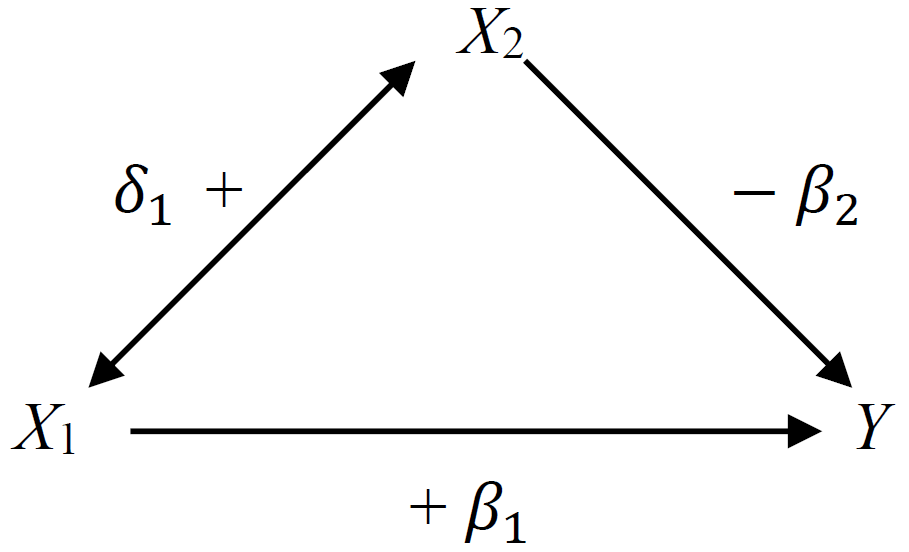
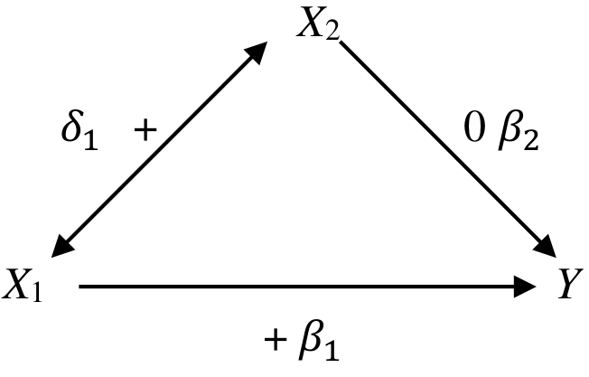
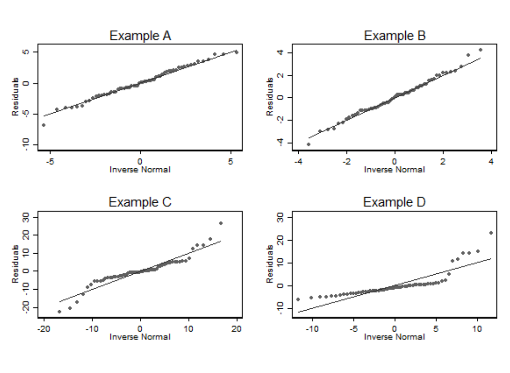

# (PART) 線性迴歸 Linear Regression {-}

# 簡單線性迴歸 Simple Linear Regression {#lm}


> Far better an approximate answer to the right question, which is often vague, than an exact answer to the wrong questions, which can always be made precise.
> ~ John Tukey


```{block2, note-thankJenny, type='rmdnote'}
The Linear Regression lectures were orgainised and taught by Professor [Jennifer Nicholas](https://www.lshtm.ac.uk/aboutus/people/nicholas.jennifer).
```

## 一些背景和術語

思考下面這些問題：


1. 脂肪攝入量增加，會導致體重增加嗎？
2. 兒童成年時的身高，可以用父母親的身高來預測嗎？
3. 如果其他條件都沒有變化，飲食習慣的改變，是否能影響血清膽固醇的水平？

上面的問題中，自變量 (預測變量)，和因變量 (反應量) 分別是什麼？

你可能還會碰到像下面這些稱呼，他們都是一個意思：

- 因變量  Dependent variable = 反應量 response variable = 結果變量 outcome variable;
- 自變量  independent variable = 預測變量 predictor variable = 解釋變量  explanatory variable = 共變量 covariate.


所有的非簡單統計模型 (non-trivial statistical models) 都包括以下三個部分：

1. 隨機變量 random variables：
    - 因變量永遠都是隨機變量；
    - 預測變量不一定是隨機變量；
    - 在相對簡單的模型中，我們討論的因變量和預測變量幾乎都來自於從人羣中抽取觀察樣本收集來的數據。

2. 人羣參數 population parameters：
    - 人羣參數，是我們希望通過收集樣本獲得的數據來估計 (estimate) 的參數。

3. 對不確定性的描述 representation of uncertainty：
    - 不確定性，意爲因變量的變動中，沒有被預測變量解釋的部分。


其他的術語問題：


- **單一因變量**的統計模型：**univariate model**;
- **多個因變量**的統計模型： **multivariate model**;
- **單一因變量**，含有**多個預測變量**的統計模型：**multivariable model**；
- 在線性迴歸中，單一因變量，單一預測變量的統計模型：**simple linear regression** (簡單線性迴歸)；
- 在線性迴歸中，單一因變量，多個預測變量的統計模型：**multiple linear regression** (多重線性迴歸)；

儘量避免將預測變量 (predictor variable) 寫作自變量 (independent variable)，因爲 "independent" 有自己的統計學含義 (獨立)。然而我們在線性迴歸中使用的預測變量，不一定都**互相獨立**，所以容易讓人混淆其意義。


## 簡單線性迴歸模型 simple linear regression model

即：**單一因變量，單一預測變量**的統計模型。


### 數據 A

下面的散點圖 \@ref(fig:age-wt) 展示的是一項橫斷面調查的結果，調查的是一些兒童的年齡 (月)，和他們的體重 (千克) 之間的關係。

```{r age-wt, echo=FALSE,cache=TRUE, fig.asp=.7, fig.width=4, fig.cap='Age and weight of children in a cross-sectional survey', fig.align='center', out.width='80%'}
library(haven)
library(ggplot2)
library(ggthemes)
growgam1 <- read_dta("backupfiles/growgam1.dta")

ggplot(growgam1, aes(x=age, y=wt)) + geom_point(shape=20) +
  scale_x_continuous(breaks=seq(0, 38, 4),limits = c(0,36.5))+
  scale_y_continuous(breaks = seq(0, 20, 5),limits = c(0,20.5)) +
   theme_stata() +labs(x = "Age (Months)", y = "Weight (kg)")
```


### 數據 B

表 \@ref(tab:walk) 羅列的是11名兒童能夠自己獨立行走時的年齡。這些兒童在剛出生時被隨機分配到兩個組中 (積極鍛鍊走路，和對照組)。如果你熟悉均數比較，這樣的數據可以通過簡單 $t$ 檢驗來分析其均值的不同。但是實際上後面你會看到簡單 $t$ 檢驗和簡單線性迴歸是同一回事。


```{r walk, echo=FALSE, cache=TRUE}
library(knitr)
library(kableExtra)
dt <- read.csv("backupfiles/walking.csv", header = T)
dt$Eight.Week.Control.Group..n.5.[6] <- " -- "
kable(dt, "html",  col.names = c("Active Exercise (n=6)","Eight Week Control (n=5)"), align = "c",caption = "Childen's ages at time of first walking aline by randomisation group") %>%
  kable_styling(bootstrap_options = c("striped", "bordered")) %>%
#  collapse_rows(columns = c(1)) %>%
  add_header_above(c("Age in months for walking alone" = 2))
```

## 區分因變量和預測變量

在簡單兩樣本 $t$ 檢驗中，我們不區分那兩個要比較的數據 $(X, Y)$。所以 $X$ 和 $Y$ 的關係，同分析 $Y$ 和 $X$ 的關係是一樣的。表 \@ref(tab:walk) 的例子中，視“直立行走的年齡”這一變量爲因變量十分直觀且自然。圖 \@ref(fig:age-wt) 的例子中我們顯然可以關心是否可以用兒童的年齡來推測他/她的體重。所以年齡被視爲預測變量 $(X)$，體重被視爲因變量或者叫結果變量 $(Y)$。

### 均值 (期待值) 公式 {#meanfunction}

圖 \@ref(fig:age-wt) 的例子中，當我們決定考察體重變化 $(Y)$ 和年齡的關係 $(X)$ 後，我們需要提出一個模型，來描述二者之間的關係。這個模型中，最重要的信息，是均值，或者叫期待值：

$$
E(Y|X=x), \text{ the expected value of } Y \text{ when } X \text{ takes the value } x
$$

在簡單線性迴歸模型中，我們認爲這個均值方程是線性關係：

$$
E(Y|X=x) = \alpha +\beta x
$$

所以這個線性關係中，有兩個參數 (parameters) 是我們關心的 $\alpha, \beta$。

- $\alpha$ 是截距 intecept。意爲當 $X$ 取 $0$時， $Y$ 的期待值大小；
- $\beta$ 是方程的斜率 slope。意爲當 $X$ 上升一個單位時，$Y$ 上升的期待值大小。

需要強調的是，這樣的線性模型，是我們提出，用來模擬真實數據時使用的。~~你如果作死~~當然還可以提出更加複雜的模型。如下面圖 \@ref(fig:age-wt-lm) 顯示的是線性迴歸直線， 而圖 \@ref(fig:age-wt-loess) 顯示的是較爲複雜的迴歸曲線。曲線方程可能更加擬合我們收集到的數據，然而這樣的連續的斜率變化很可能僅僅只解釋了這個樣本量數據，而不能解釋在人羣中年齡和體重的關係。


```{r age-wt-lm, echo=FALSE, cache=TRUE, fig.asp=.7, fig.width=4, fig.cap='Linear mean function for age and weight of children in a cross-sectional survey', fig.align='center', out.width='80%'}
library(haven)
library(ggplot2)
library(ggthemes)
growgam1 <- read_dta("backupfiles/growgam1.dta")

ggplot(growgam1, aes(x=age, y=wt)) + geom_point(shape=20, colour="grey40") +
  stat_smooth(method = lm, size = 0.3) +
  scale_x_continuous(breaks=seq(0, 38, 4),limits = c(0,36.5))+
  scale_y_continuous(breaks = seq(0, 20, 5),limits = c(0,20.5)) +
   theme_stata() +labs(x = "Age (Months)", y = "Weight (kg)")
```


```{r age-wt-loess, echo=FALSE,cache=TRUE, fig.asp=.7, fig.width=4, fig.cap='Non-linear mean function for age and weight of children in a cross-sectional survey', fig.align='center', out.width='80%'}
library(haven)
library(ggplot2)
library(ggthemes)
growgam1 <- read_dta("backupfiles/growgam1.dta")

ggplot(growgam1, aes(x=age, y=wt)) + geom_point(shape=20, colour="grey40") +
  stat_smooth(method = loess, se=T, size = 0.3) +
  scale_x_continuous(breaks=seq(0, 38, 4),limits = c(0,36.5))+
  scale_y_continuous(breaks = seq(0, 20, 5),limits = c(0,20.5)) +
   theme_stata() +labs(x = "Age (Months)", y = "Weight (kg)")
```

### 條件分佈和方差 the conditional distribution and the variance function

如果要完全明確一個統計模型，另一個重要的點在於，提出的模型能否準確描述因變量在預測變量的條件下的分佈 (conditional distribution) it is necessary to describe the distribution of the dependent variable conditional on the predictor variable。使用簡單線性迴歸模型有幾個前提假設：

1. 因變量對預測變量的條件分佈的方差是保持不變的 the variance of the dependent variable (conditional on the predictor variable) is constant。
2. 該條件分佈是一個正態分佈。

有時候，這些假設條件並不能得到滿足。上面的散點圖 \@ref(fig:age-wt)看上去還算符合這兩個假設前提：在每一個年齡階段，體重的分佈沒有發生歪斜 (skew)，分散分佈 (方差) 也相對穩定。但是圖 \@ref(fig:diamond) 中的價格-克拉數據很明顯無法滿足上面的前提假設。在線性迴歸模型中，我們使用 $\sigma^2$ 表示殘差的方差 (residual variance)。

```{r diamond, echo=FALSE,cache=TRUE, fig.asp=.7, fig.width=4, fig.cap='Relationship between diamond carat and price', fig.align='center', out.width='80%'}
library(ggplot2)
library(ggthemes)
ggplot(data=diamonds, aes(x=carat, y=price)) + geom_point(shape=20)+
  theme_stata()
```

### 定義簡單線性迴歸模型 {#defLM}

用來描述一個隨機變量 $(Y)$ 和另一個變量 $(X)$ 之間關係的簡單線性迴歸模型，被定義爲：

$$
(Y|X=x) \sim N(\alpha+\beta x, \sigma^2)
$$

上面這個模型，同時還描述了我們對數據的分佈的假設。同樣的模型，你可能更多得看到被寫成如下的方式：

$$
y=\alpha+\beta x+ \varepsilon \text{, where } \varepsilon\sim N(0,\sigma^2)
$$

假如，我們有一組樣本量爲 $n$ 的數據 $\underline{x}$。我們就可以把通過上面的迴歸模型實現的 $Y_i$ 和它對應的 $X_i (i=1,\cdots, n)$。描述爲如下的形式：

$$
\begin{equation}
  (Y_i|X_i=x_i) \sim \text{NID}(\alpha+\beta x, \sigma^2) \text{ where } i=1,\cdots,n
\end{equation}
  (\#eq:NID)
$$

此處的 $\text{NID}$ 意爲獨立且服從正態分佈 **(normally and independently distributed)**。這裏默認的一個重要前提是所有的觀察值 $X_i$ 是相互獨立互不影響的。例如上面圖 \@ref(fig:age-wt) 所示兒童的年齡和體重數據，就必須假設這些兒童都來自**沒有血緣關係的獨立家庭**。如果這以數據中的兒童，有些是兄弟姐妹的話，觀察數據互相獨立的前提就無法得到滿足。不滿足相互獨立前提的數據，其分析方法會在 "Analysis of hierarchical and other dependent data (Term 2)" 中詳盡介紹。

公式 \@ref(eq:NID) 常被記爲：

$$
\begin{equation}
(Y_i|X_i=x_i) = \alpha + \beta x_i + \varepsilon_i, \text{ where } \varepsilon_i\sim \text{NID}(0,\sigma^2)
\end{equation}
 (\#eq:NID1)
$$

或者爲了簡潔表述寫成：

$$
\begin{equation}
y_i = \alpha + \beta x_i + \varepsilon_i, \text{ where } \varepsilon_i\sim \text{NID}(0,\sigma^2)
\end{equation}
 (\#eq:NID2)
$$

### 殘差 residuals

公式 \@ref(eq:NID1) 和 \@ref(eq:NID2) 其實已經包含了殘差的表達式：

$$
\varepsilon_i = y_i - (\alpha + \beta x_i)
$$

所以 $\varepsilon_i$ 的意義是第 $i$ 個觀察對象的隨機(偶然)誤差 (random error)，或者叫真實殘差 (true residual)。其實就是從線性迴歸模型計算獲得的映射值 $\alpha+\beta x_i$，和實際觀察值 $y_i$ 之間的差距。而且從其公式可見，殘差本身也是由人羣的參數 $(\alpha, \beta)$ 決定的。殘差也被定義爲迴歸模型的偏差值。當我們用樣本數據獲得的參數估計 $(\hat\alpha, \hat\beta)$ 來取代掉參數 $(\alpha, \beta)$ 時，這時的模型變成了估計模型，殘差也成了估計殘差或者叫觀察模型和觀察殘差。須和真實殘差加以區分。

## 參數的估計 estimation of parameters

簡單線性迴歸模型中有三個人羣參數 $(\alpha, \beta, \sigma^2)$。統計分析的目標，就是使用樣本數據 $Y_i, X_i, (i=1, \cdots, n)$ 來對總體參數做出推斷 (inference)。在線性迴歸中主要使用**普通最小二乘法 (ordinary least squares, OLS)** 作爲推斷的工具。在統計學中，我們習慣給希臘字母戴上“帽子”，作爲該參數的估計值，例如 $\hat\alpha, \hat\beta$ 是參數 $\alpha, \beta$ 的估計值。通過線性迴歸模型，給第 $i$ 個觀察值擬合的預測值，被叫做因變量的估計期望值 (estimated expectation)。用下面的式子來表示:


$$
\hat{y}_i=\hat\alpha+\hat\beta x_i
$$

此時，第 $i$ 名對象的觀察殘差 (observed or fitted or estimated residuals) 用下面的式子來表示：

$$
\hat{\varepsilon}_i = y_i-\hat{y}_i=y_i-(\hat\alpha+\hat\beta x_i)
$$

### 普通最小二乘法估計 $\alpha, \beta$ {#MLEalphabeta}

普通最小二乘法估計的 $\alpha, \beta$ 會最小化擬合迴歸直線的偏差 minimize the sum of squared deviations from the fitted regression line。其正式的定義爲：OLS估計值，指的是能夠使**殘差平方和 (residual sum of squares, $SS_{RES}$)**取最小值的 $\hat\alpha, \hat\beta$。

$$
\begin{equation}
SS_{RES} = \sum_{i=1}^n \hat{\varepsilon}^2_i = \sum_{i=1}^n (y_i-\hat\alpha-\hat\beta x_i)^2
\end{equation}
(\#eq:ssres)
$$

可以證明的是，OLS的 $\alpha, \beta$ 估計值的計算公式爲：

$$
\begin{equation}
\hat\alpha=\bar{y}-\hat\beta\bar{x}
(\#eq:hatalpha)
\end{equation}
$$

$$
\begin{equation}
\hat\beta=\frac{\sum_{i=1}^n(x_i-\bar{x})(y_i-\bar{y})}{\sum_{i=1}^n(x_i-\bar{x})^2}
(\#eq:hatbeta)
\end{equation}
$$

其中 $\bar{y}=\frac{\sum_{i=1}^ny_i}{n}, \bar{x}=\frac{\sum_{i=1}^nx_i}{n}$

**證明**

求能最小化 $SS_{RES}$ 的 $\alpha$， 我們需要把公式 \@ref(eq:ssres) 對 $\hat\alpha$ 求導，然後將求導之後的式子等於 $0$ 之後求根即可：

$$
\begin{aligned}
& \frac{\text{d}SS_{RES}}{\text{d}\hat\alpha} =\sum_{i=1}^n -2(y_i-\hat\alpha-\hat\beta x_i) = 0\\
& \text{Since } \sum_{i=1}^n(y_i) = n\bar{y}; \sum_{i=1}^n (x_i) =n\bar{x} \\
& \Rightarrow -n\bar{y}+n\hat\alpha+n\hat\beta\bar{x} = 0 \\
& \Rightarrow \hat\alpha = \bar{y}-\hat\beta\bar{x}
\end{aligned}
$$

求能最小化 $SS_{RES}$ 的 $\beta$，求導之前我們先把公式 \@ref(eq:ssres) 中含有 $\hat\alpha$ 的部分替換掉：

$$
\begin{equation}
\begin{split}
SS_{RES} &= \sum_{i=1}^n\hat\varepsilon_i^2=\sum_{i=1}^n(y_i-(\bar{y}-\hat\beta\bar{x})-\hat\beta x_i)^2\\
         &= \sum_{i=1}^n((y_i-\bar{y})-\hat\beta(x_i-\bar{x}))^2 \\
\end{split}
(\#eq:ssres-rearrange)
\end{equation}
$$

接下來對上式 \@ref(eq:ssres-rearrange) 求導之後，用相同辦法求根：

$$
\begin{aligned}
&\frac{\mathrm{d} SS_{RES}}{\mathrm{d} \hat\beta} = \sum_{i=1}^n -2(x_i-\bar{x})(y_i-\bar{y}) + 2\hat\beta(x_i-\bar{x})^2 = 0\\
& \Rightarrow \hat\beta\sum_{i=1}^n(x_i-\bar{x})^2 = \sum_{i=1}^n (x_i-\bar{x})(y_i-\bar{y}) \\
& \hat\beta=\frac{\sum_{i=1}^n(x_i-\bar{x})(y_i-\bar{y})}{\sum_{i=1}^n(x_i-\bar{x})^2}
\end{aligned}
$$

這兩個式子 \@ref(eq:hatalpha) \@ref(eq:hatbeta) 同時也是參數 $\alpha, \beta$ 的極大似然估計 (MLE)。

## 殘差方差的估計 Estimation of the residual variance $(\sigma^2)$ {#ResidualVar}

殘差方差等於殘差平方和除以樣本量。所以我們會把殘差方差的估計用下面的式子表示：

$$
\begin{equation}
\hat\sigma^2=\sum_{i=1}^n \frac{\hat\varepsilon^2}{n} = \sum_{i=1}^n \frac{(y_i-\hat\alpha-\hat\beta x_i)^2}{n}
\end{equation}
(\#eq:sigma2wrong)
$$

這的確是 $\sigma^2$ 的極大似然估計 (MLE)。然而我們知道，公式 \@ref(eq:sigma2wrong) 並不是殘差方差的無偏估計。類似與樣本方差低估了總體方差 (Section \@ref(samplevarbias))，那樣，這裏殘差方差的觀察值也是低估了總體殘差方差的。所以，殘差方差的無偏估計需要用下面的式子來校正：

$$
\begin{equation}
\hat\sigma^2=\sum_{i=1}^n \frac{\hat\varepsilon^2}{n-2} = \sum_{i=1}^n \frac{(y_i-\hat\alpha-\hat\beta x_i)^2}{n-2}
\end{equation}
(\#eq:sigma2right)
$$

公式 \@ref(eq:sigma2right) 被叫做殘差均方 (Residual Mean Squares, RMS)，常常被標記爲 $\text{MS}_{RES}$。分母的 $n-2$，表示進行殘差方差估計時用掉了兩個信息量 $\alpha, \beta$ (自由度減少了 2)，

## R 演示  例 1： 圖 \@ref(fig:age-wt) 數據 {#growgam}


```{r LM00, cache=TRUE}
library(haven)
growgam1 <- read_dta("backupfiles/growgam1.dta")

slm <- lm(wt~age, data=growgam1)

summary(slm) # basic default output of the summary
print(anova(slm), digits = 8) # show the sum of squares for the fitted model and residuals
```
也可以用 `stargazer` 包輸出很酷的表格報告：

```{r LM01, cache=TRUE, results='asis', message=FALSE}
library(stargazer)
stargazer(slm, type = "html")
```
其實結果都一樣。我們這裏詳細來看 $\alpha, \beta, \sigma^2$：

$\hat\alpha = 6.84$：當年齡爲 $0$ 時，體重爲 $6.84 kg$。本數據 \@ref(fig:age-wt) 中並沒有 $0$ 歲的兒童，所以這裏的截距的解釋需要非常小心是否合理。

$\hat\beta = 0.165$：這數據中兒童的體重估計隨着年齡升高 $1$ 個月增長 $0.165 kg$。所以使用這兩個估計值我們就可以來估計任意年齡時兒童的體重。圖 \@ref(fig:age-wt-lm) 就是擬合數據以後的簡單線性迴歸曲線。

$\hat\sigma^2 = 1.62, \hat\sigma=1.27$  就是默認輸出中最下面的 `Residual standard error: 1.274` 和 ANOVA 表格中 Residuals 的 `Mean Sq=1.62184` 部分。含義是，沿着擬合的直線，在每一個給定的年齡上兒童體重的分佈的標準差是 $1.27 kg$。

## R 演示 例 2： 表\@ref(tab:walk) 數據 {#binarylms}

如果在 `Stata` 聽說你還需要自己生成啞變量 (dummy variables) (應該是計算時，在想要變成啞變量的變量名前面加上 `i.`)。在 [R](https://www.r-project.org/) 裏面，分類變量被設置成因子 "factor" 時，你就完全可以忽略生成啞變量的過程。下圖 \@ref(fig:age-walk) 顯示了兩組兒童直立行走時的年齡。

```{r age-walk, echo=FALSE, cache=TRUE, fig.asp=.7, fig.width=4, fig.cap='Age at walking by group', fig.align='center', out.width='80%', warning=FALSE,cache=TRUE}
library(ggplot2)
library(ggthemes)
dt <- read.csv("backupfiles/walking.csv", header = T)
age1 <- dt$Active.Exercise.Group..n.6.
age2 <- dt$Eight.Week.Control.Group..n.5.
Group <- c(rep("exercise", 6), rep("control", 6))
Walk <- data.frame(c(age1,age2), Group)
names(Walk)[1] <- "Age"
## Reordering Group
Walk$Group <- factor(Walk$Group,levels=c("exercise", "control"))

ggplot(Walk, aes(x=Group, y=Age)) + geom_point() +
  scale_y_continuous(breaks = seq(9, 14, 1),limits = c(9,14)) +
   theme_stata() +labs(x = "Randomised groups", y = "Age (Months)")
```

擬合簡單線性迴歸也是小菜一碟：

```{r LM03, cache=TRUE}
wk_age <- lm(Age ~ Group, data=Walk)

summary(wk_age)
anova(wk_age)
```

這裏的 $\hat\alpha=10.125$，意爲參照組 (此處，"exercise" 被默認設定爲參照組，而 "control" 被默認拿來和參照組相比較) 的兒童也就是，積極練習走路的小朋友這組能夠獨立行走的平均年齡是 $10.125$ 個月。

$\hat\beta=2.225$，意爲和參照組 (積極練習組) 相比，對照組兒童能夠自己行走的年齡平均要晚 $2.225$ 個月。所以對照組兒童能夠直立行走的平均年齡就是 $10.125+2.225=12.35$ 個月。

上述結果，你如果拿來和下面的兩樣本 $t$ 檢驗的結果相比就知道，是完全一致的。其中統計量 $t^2=2.9285^2=F_{1,9}=8.58$。
```{r LM02, cache=TRUE}
t.test(Age~Group, data=Walk, var.equal=TRUE)
```

## 練習 {#exeChol}

使用的數據內容爲：兩次調查同一樣本，99 名健康男性的血清膽固醇水平，間隔一年。


```{r LM04, cache=TRUE, message=FALSE, warning=FALSE, fig.align='center', out.width='80%'}
# 數據讀入
Chol <- read_dta("backupfiles/chol.dta")
summary(Chol)

# Alternative Descriptive Statistics using psych package
describe(Chol)

# 兩次膽固醇水平的直方圖 Distribution of the two measures
par(mfrow=c(1,2))
hist(Chol$chol1)
hist(Chol$chol2)

# 對兩次膽固醇水平作散點圖
ggplot(Chol, aes(x=chol1, y=chol2)) + geom_point(shape=20) +
  scale_x_continuous(breaks=seq(150, 400, 50),limits = c(150, 355))+
  scale_y_continuous(breaks=seq(150, 400, 50),limits = c(150, 355)) +
   theme_stata() +labs(x = "Cholesterol at visit 1 (mg/100ml)", y = "Cholesterol at visit 2 (mg/100ml)")
```

### 兩次測量的膽固醇水平分別用 $C_1, C_2$ 來標記的話，考慮這樣的簡單線性迴歸模型：$C_2=\alpha+\beta C_2 + \varepsilon$。我們進行這樣迴歸的前提假設有哪些？

- 每個觀察對象互相獨立。
- 前後兩次測量的膽固醇水平呈線性相關。
- 殘差值，在每一個給定的 $C_1$ 值處呈現正態分佈，且方差不變。

從散點圖來看這些假設應該都能得到滿足。

```{r LM05, cache=TRUE}
# 計算兩次膽固醇水平的 均值，方差，以及二者的協方差
mean(Chol$chol1); mean(Chol$chol2)
var(Chol$chol1); var(Chol$chol2)
cov(Chol$chol1, Chol$chol2)
```

### 計算普通最小二乘法 (OLS) 下，截距和斜率的估計值 $\hat\alpha, \hat\beta$

$$
\begin{aligned}
\hat\beta &= \frac{\sum_{i=1}^n(x_i-\bar{x})(y_i-\bar{y})}{\sum_{i=1}^n(x_i-\bar{x})^2}\\
&=\frac{\text{Cov}(C_1,C_2)}{\text{Var}(C_1)}\\
&=\frac{1661.061}{961.224}=0.578
\end{aligned}
$$

```{r LM06, cache=TRUE}
cov(Chol$chol1, Chol$chol2)/var(Chol$chol1)
```

$$\hat\alpha=\bar{y}-\hat\beta\bar{x}=263.54-0.578\times264.59=110.425$$

```{r LM07, cache=TRUE}
mean(Chol$chol2)-mean(Chol$chol1)*cov(Chol$chol1, Chol$chol2)/var(Chol$chol1)
```
### 和迴歸模型計算的結果作比較，解釋這些估計值的含義

```{r LM08, cache=TRUE}
summary(lm(chol2~chol1, data=Chol))
```

- 截距的估計值是 110.4 mg/100ml: 意爲這組樣本，第一次採集數據時，膽固醇水平的平均值是 110.4。
- 斜率的估計值是 0.58：意爲第一次採集的膽固醇水平每高 1 mg/100ml，那麼第二次採集的膽固醇相應提高的值的期待量爲 0.58.

### 加上計算的估計值直線 (即迴歸直線)

```{r LM09, cache=TRUE, warning=FALSE}
ggplot(Chol, aes(x=chol1, y=chol2)) + geom_point(shape=20, colour="grey40") +
  stat_smooth(method = lm, se=FALSE, size=0.5) +
   scale_x_continuous(breaks=seq(150, 400, 50),limits = c(150, 355))+
  scale_y_continuous(breaks=seq(150, 400, 50),limits = c(150, 355)) +
   theme_stata() +labs(x = "Cholesterol at visit 1 (mg/100ml)", y = "Cholesterol at visit 2 (mg/100ml)")
```

可以注意到，第一次訪問時膽固醇水平高的人，第二次被測量時膽固醇值高於平均值，但是卻沒有第一次高出平均值的部分多。
相似的，第一次膽固醇水平低的人，第二次膽固醇水平低於平均值，但是卻沒有第一次低於平均值的部分多。這一現象被叫做 “向均數迴歸-regression to the mean”


### 下面的代碼用於模型的假設診斷 {#diagnosis}
```{r LM10, cache=TRUE}
M <- lm(chol2~chol1, data=Chol)
par(mfrow = c(2, 2))  # Split the plotting panel into a 2 x 2 grid
plot(M)
```


好心人在 [github](https://gist.github.com/atyre2/ff4e1ec24e42adda8dbd43cda99d6282) 上共享了 `Check_assumption.R` 的代碼，可以使用 ggplot2 來獲取高逼格的模型診斷圖：

```{r LM11, cache=TRUE, message=FALSE}
source("checkassumptions.R")
check_assumptions(M)
```


# 最小二乘估計的性質和推斷 Ordinary Least Squares Estimators and Inference


前一章介紹了簡單線性迴歸模型中對總體參數 $\alpha, \beta, \sigma^2$ 的估計公式，分別是 \@ref(eq:hatalpha) \@ref(eq:hatbeta) \@ref(eq:sigma2right)。本章繼續介紹他們的統計學性質。下面的標記和統計量也會被用到：

1. $\bar{y}=\frac{\sum_{i=1}^n y_i}{n}$，因變量 $y$ 的樣本均值；
2. $\bar{x}=\frac{\sum_{i=1}^n x_i}{n}$，預測變量 $x$ 的樣本均值；
3. $SS_{yy}=\sum_{i=1}^n(y_i-\bar{y})^2$，因變量 $y$ 的校正平方和；
4. $SS_{xx}=\sum_{i=1}^n(x_i-\bar{x})^2$，預測變量 $x$ 的校正平方和；
5. $SD_y^2=\frac{\sum_{i=1}(y_i-\bar{y})^2}{n-1}=\frac{SS_{yy}}{n-1}$，因變量 $y$ 的樣本方差；
6. $SD_x^2=\frac{\sum_{i=1}(x_i-\bar{x})^2}{n-1}=\frac{SS_{xx}}{n-1}$，預測變量 $x$ 的樣本方差；
7. $S_{xy}=\sum_{i=1}^n(x_i-\bar{x})(y_i-\bar{y})$，$x,y$ 的交叉乘積；
8. $CV_{xy}=\frac{\sum_{i=1}^n(x_i-\bar{x})(y_i-\bar{y})}{n-1}=\frac{S_{xy}}{n-1}$，樣本協方差；
9. $r_{xy}=\frac{CV_{xy}}{SD_xSD_y}$，$x,y$ 的樣本相關係數；
10. $SS_{RES}=\sum_{i=1}^n\hat\varepsilon^2=\sum_{i=1}^n(y_i-\hat\alpha-\hat\beta x_i)^2$，殘差的估計平方和。

## OLS 估計量的性質

1. 樣本估計的迴歸直線必定穿過數據的中心 $(\bar{x},\bar{y})$。

**證明**

由於樣本估計的截距和斜率公式  \@ref(eq:hatalpha) \@ref(eq:hatbeta) 可知：

$$
\begin{aligned}
\hat\alpha &= \bar{y} - \hat\beta\bar{x} \\
 \hat y_i  &= \hat\alpha + \hat\beta x_i \\
 \Rightarrow \hat y_i &= \bar{y}+\hat\beta(x_i-\bar{x})
\end{aligned}
(\#eq:lmcenter)
$$

所以，當 $\hat x_i=\bar{x}$ 時 $\hat y_i=\bar{y}$。即迴歸直線必然穿過中心點。

2. 如果擬合模型是正確無誤的， $\hat\alpha,\hat\beta,\hat\sigma^2$ 分別是各自的無偏估計。
3. $\hat\alpha, \hat\beta$ 是極大似然估計， $\hat\sigma^2$ 不是MLE。
4. $\hat\alpha, \hat\beta$ 是 $\alpha, \beta$ 最有效的估計量。

## $\hat\beta$ 的性質

$$
\begin{equation}
\hat\beta=\frac{S_{xy}}{SS_{xx}}=\frac{CV_{xy}}{SD_x^2}
\end{equation}
(\#eq:hatbetaalt)
$$

### $Y$ 對 $X$ 迴歸， 和 $X$ 對 $Y$ 迴歸 {#randbeta}

如果我們使用 $\hat\beta_{y|x}$ 表示預測變量 $x$，因變量 $y$ 的簡單線性迴歸係數，那麼我們就有：

$$
\begin{equation}
\hat\beta_{y|x} = \frac{CV_{xy}}{SD_x^2}  \text{ and } \hat\beta_{x|y} = \frac{CV_{xy}}{SD_y^2} \\
\text{Hence, } \hat\beta_{y|x}\hat\beta_{x|y} = r^2_{xy}
\end{equation}
(\#eq:r2)
$$

公式 \@ref(eq:r2) 也證明了：如果兩個變量相關係數爲 $1$ (100% 相關)， $Y$ 對 $X$ 迴歸的迴歸係數，是 $X$ 對 $Y$ 迴歸的迴歸係數的倒數。

### 例 1： 還是圖 \@ref(fig:age-wt) 數據

```{r LM12, cache=TRUE}
library(haven)
growgam1 <- read_dta("backupfiles/growgam1.dta")

# regress wt on age
summary(lm(wt~age, data=growgam1))
print(anova(lm(wt~age, data=growgam1)), digits = 8)
# regress age on wt
summary(lm(age~wt, data=growgam1))
print(anova(lm(age~wt, data=growgam1)), digits = 8)
```

可以看到二者的輸出結果中統計檢驗量一樣，但是一個是將體重針對年齡迴歸，另一個則是反過來，所以迴歸係數和截距都不同。迴歸方程的含義也就發生了變化。如果把兩條迴歸曲線同時作圖可以更加直觀：


```{r age-wt-lm1, echo=FALSE, fig.asp=.7, fig.width=4, fig.cap='Simple linear regression model line relating weight to age', fig.align='center', out.width='80%',cache=TRUE}
growgam1 <- read_dta("backupfiles/growgam1.dta")

ggplot(growgam1, aes(x=age, y=wt)) + geom_point(shape=20, colour="grey40") +
  stat_smooth(method = lm) +
  scale_x_continuous(breaks=seq(0, 38, 4),limits = c(0,36.5))+
  scale_y_continuous(breaks = seq(0, 20, 5),limits = c(0,20.5)) +
   theme_stata() +labs(x = "Age (Months)", y = "Weight (kg)")
```

```{r wt-age-lm, warning=FALSE, echo=FALSE, fig.asp=.7, fig.width=4, fig.cap='Simple linear regression model line relating age to weight', fig.align='center', out.width='80%', cache=TRUE}

ggplot(growgam1, aes(x=wt, y=age)) + geom_point(shape=20, colour="grey40") +
  stat_smooth(method = lm) +
  scale_y_continuous(breaks=seq(0, 38, 4),limits = c(0,36.5))+
  scale_x_continuous(breaks = seq(0, 20, 5),limits = c(0,20.5)) +
   theme_stata() +labs(y = "Age (Months)", x = "Weight (kg)")+
coord_flip()
```

## 截距和迴歸係數的方差，協方差

假如簡單線性迴歸模型是正確的，那麼截距 $\hat\alpha$ 和迴歸係數 $\hat\beta$ 的方差分別是：

$$
\begin{equation}
V(\hat\alpha) = \sigma^2(\frac{1}{n}+\frac{\bar{x}^2}{SS_{xx}}) = \frac{\sigma^2}{(n-1)} (1-\frac{1}{n}+\frac{\bar{x}^2}{SD_x^2})
\end{equation}
(\#eq:varhatalpha)
$$


$$
\begin{equation}
V(\hat\beta) = \frac{\sigma^2}{SS_{xx}}=\frac{\sigma^2}{(n-1)SD_x^2}
\end{equation}
(\#eq:varhatbeta)
$$

從公式 \@ref(eq:varhatalpha) 和 \@ref(eq:varhatbeta) 也可以看出，兩個估計量的方差隨着殘差方差的增加而增加 (估計不精確)，隨着樣本量的增加而減少 (估計更精確)。截距 $\hat\alpha$ 的方差會隨着樣本均值的增加而增加。

通常來說，截距和迴歸係數二者之間並非相互獨立。他們的協方差爲：

$$
\begin{equation}
Cov(\hat\alpha,\hat\beta) = -\frac{\sigma^2\bar{x}}{SS_{xx}}
\end{equation}
(\#eq:covaralphabeta)
$$

上面的公式 \@ref(eq:varhatalpha) \@ref(eq:varhatbeta) \@ref(eq:covaralphabeta) 都包含了真實的殘差方差 $\sigma^2$。這個量對於我們“人類”來說是未知的。

### 中心化 centring {#centring}

簡單線性迴歸模型常用的一個技巧是將預測變量中心化。即，求預測變量的均值，然後將每個觀測值減去均值之後再用這個新的預測變量擬合簡單線性迴歸模型。這樣做其實完全不影響回顧係數，卻會影響截距的大小。此時新的迴歸直線的截距，就等於因變量 (體重) 的均值。

用圖 \@ref(fig:age-wt) 數據來解釋：

```{r LM13, cache=TRUE}
# mean value of age
mean(growgam1$age)
growgam1$age_cen <- growgam1$age-mean(growgam1$age)
# regress wt on age
print(summary(lm(wt~age, data=growgam1)), digit=5)
print(summary(lm(wt~age_cen, data=growgam1)), digit=5)
```

很明顯，結果顯示中心化不會改變迴歸係數，也不會改變它的方差。但是“新”的截距，其實就等於因變量 (體重) 的均值。而且很多數據都集中在這個均值附近，因而，截距的方差比沒有中心化的迴歸方程要小。

## $\alpha, \beta$ 的推斷

$\hat\alpha, \hat\beta$ 都可以被改寫成關於因變量 $Y$ 的方程，因此同時也是隨機誤差的方程式：

$$
\begin{aligned}
\hat\beta &= \sum_{i=1}^n[\frac{(x_i-\bar{x})}{SS_{xx}}(y_i-\bar{y})] \\
\text{Substituting } &(y_i-\bar{y}) = \beta(x_i-\bar{x})+(\varepsilon_i-\bar{\varepsilon}) \\
          &= \beta + \sum_{i=1}^n[\frac{x_i-\bar{x}}{SS_{xx}}(\varepsilon_i-\bar{\varepsilon})]
\end{aligned}
$$

又因爲，$\varepsilon_i \sim NID(0,\sigma^2)$，估計量 $\hat\alpha, \hat\beta$ 均爲 $\varepsilon_i$ 的線性轉換，所以他們也都是服從正態分佈的。

### 對迴歸係數進行假設檢驗

對於迴歸係數 $\beta$，我們可以使用 Wald statistic (Section \@ref(Wald)) 進行零假設爲 $\text{H}_0: \beta=0$ 的假設檢驗。此時，替代假設爲 $\text{H}_1: \beta\neq0$。最佳檢驗統計量爲：

$$
\begin{equation}
t = \frac{\hat\beta-0}{SE(\hat\beta)} \\
\end{equation}
(\#eq:betattest)
$$

根據公式 \@ref(eq:varhatbeta) $SE(\hat\beta) = \sqrt{V(\hat\beta)} = \frac{\hat\sigma}{\sqrt{SS_{xx}}}$。用 $\hat\sigma^2$ 替換掉公式 \@ref(eq:varhatbeta) 中的 $\sigma^2$，意味着迴歸係數的檢驗統計量 $t$ 服從自由度爲 $n-2$ 的 $t$ 分佈。之後就可以根據 $t$ 分佈的性質求相應的 $p$ 值了，對相關係數是否爲 $0$ 進行檢驗。之所以我們可以在這裏使用 Wald 檢驗，是因爲前提條件：隨機誤差服從正態分佈，於是 $\beta$ 的對數似然比也是左右對稱的，當對數似然比的圖形左右對稱時，就可以使用二次方程來近似 (Wald 檢驗的實質)。

### 迴歸係數，截距的信賴區間

估計量 $\beta$ 的 $95\%$ 信賴區間的計算公式如下：

$$
\begin{equation}
\hat\beta \pm t_{n-2,0.975}SE(\hat\beta)
\end{equation}
(\#eq:CIbeta)
$$

其中，$t_{n-2, 0.975}$ 表示自由度爲 $n-2$ 的 $t$ 分佈的 $97.5\%$ 位點的值。繼續使用之前的實例，圖 \@ref(fig:age-wt) 中的數據。體重對年齡進行簡單線性迴歸之後，年齡的估計回顧係數 $\hat\beta=0.165, SE(\hat\beta)=0.0111$, 此例中 $n=190$，所以 $t_{188, 0.975}=1.973$。所以迴歸係數的 $95\%$ 信賴區間可以如此計算：$0.165\pm1.973\times0.0111=(0.143, 0.187)$。

類似的，估計截距 $\hat\alpha$ 的 $95\%$ 信賴區間的計算式便是： $\hat\alpha \pm t_{n-2, 0.975}SE(\hat\alpha)$。同樣的例子裏，$\hat\alpha=6.838, SE(\hat\beta) = 0.210, t_{188, 0.975}=1.973$。所以截距的 $95\%$ 信賴區間的計算方法就是： $6.838\pm1.973\times0.210=(6.42, 7.25)$

跟下面 R 計算的完全一樣：

```{r LM14, cache=TRUE}
confint(lm(wt~age, data=growgam1))
```

### 預測值的信賴區間 (置信帶) - 測量迴歸曲線本身的不確定性

這裏所謂的“預測值”其實並沒有拿來預測什麼新的數值，而是說我們希望通過線性迴歸找到因變量真實值的存在區間 (信賴區間)。所以這個預測值的真實含義其實應該是在預測變量取 $X=x$ 時，因變量的期待值，$E(Y|X=x)$。

這個預測值的方差公式如下：

$$
\begin{equation}
V(\hat y_{x}) = \sigma^2[\frac{1}{n}+\frac{(x_i-\bar{x})^2}{SS_{xx}}]
\end{equation}
(\#eq:predictvar)
$$

於是可以計算它的 $95\%$ 信賴區間公式是：

$$
\begin{equation}
\hat y_x \pm t_{n-2, 0.975} \hat\sigma \sqrt{[\frac{1}{n}+\frac{(x-\bar{x})^2}{SS_{xx}}]}
\end{equation}
(\#eq:predictCI)
$$

其實在之前的圖 (圖 \@ref(fig:age-wt-lm)) 我們也已經展示過這個信賴區間的範圍。


### 預測帶 Reference range - 包含了 95% 觀察值的區間

此處的 $95\%$ 預測帶，其實是包含了 $95\%$ 觀察數據的區間。所以預測帶要比置信帶更寬。它的方差計算公式爲：

$$
\begin{equation}
V(\hat y_x)+\sigma^2 = \sigma^2[1+\frac{1}{n}+\frac{(x-\bar{x})^2}{SS_{xx}}]
\end{equation}
(\#eq:refrangevar)
$$

區間計算公式爲：

$$
\begin{equation}
\hat{y}_x \pm t_{n-2, 0.975} \sqrt{1+\frac{1}{n}+\frac{(x-\bar{x})^2}{SS_{xx}}}
\end{equation}
(\#eq:refrangeCI)
$$


將置信帶和預測帶同時展現則如下圖：

```{r age-wt-lm-pred, fig.asp=.7, fig.width=4, fig.cap='Simple linear regression for age and weight of children in a cross-sectional survey with 95% CI of predicted values and 95% reference range', warning=FALSE, fig.align='center', out.width='80%',cache=TRUE}

growgam1 <- read_dta("backupfiles/growgam1.dta")


Model <- lm(wt~age, data=growgam1)
temp_var <- predict(Model, interval="prediction")

new_df <- cbind(growgam1, temp_var)


ggplot(new_df, aes(x=age, y=wt)) + geom_point(shape=20, colour="grey40") +
  stat_smooth(method = lm, se=TRUE, size = 0.3) +
  geom_line(aes(y=lwr), color = "red", linetype = "dashed")+
    geom_line(aes(y=upr), color = "red", linetype = "dashed")+
  scale_x_continuous(breaks=seq(0, 38, 4),limits = c(0,36.5))+
  scale_y_continuous(breaks = seq(0, 20, 5),limits = c(0,20.5)) +
   theme_stata() +labs(x = "Age (Months)", y = "Weight (kg)")
```


## 線性迴歸模型和 Pearson 相關係數 {#rsquare}

前面也推導過線性迴歸係數和 Pearson 相關係數之間的關係 (Section \@ref(randbeta))，這裏詳細再展開討論它們之間關係的另外兩個重要結論。

### $r^2$ 可以理解爲因變量平方和被模型解釋的比例

Pearson 相關係數，因變量的平方和，模型的殘差平方和之間有如下的關係：

$$
\begin{equation}
r^2 = \frac{SS_{yy}-SS_{RES}}{SS_{yy}} = 1-\frac{SS_{RES}}{SS_{yy}}
\end{equation}
(\#eq:rSSyySSres)
$$

**證明**

$$
\frac{SS_{RES}}{SS_{yy}} = \frac{\sum_{i=1}^n(y_i-\hat\alpha-\hat\beta x_i)^2}{\sum_{i=1}^n(y_i-\bar{y})^2}
$$

因爲 \@ref(eq:hatalpha) : $\hat\alpha=\bar{y}-\hat{\beta}\bar{x}$

$$
\begin{aligned}
\frac{SS_{RES}}{SS_{yy}} &= \frac{\sum_{i=1}^n[(y_i-\bar{y})-\hat\beta(x_i-\bar{x})]^2}{\sum_{i=1}^n(y_i-\bar{y})^2} \\
                  &=\frac{\sum_{i=1}^n(y_i-\bar{y})^2}{\sum_{i=1}^n(y_i-\bar{y})^2}-\frac{2\hat\beta\sum_{i=1}^n(x_i-\bar{x})(y_i-\bar{y})}{\sum_{i=1}^n(y_i-\bar{y})^2}+\frac{\hat\beta^2\sum_{i=1}^n(x_i-\bar{x})^2}{\sum_{i=1}^n(y_i-\bar{y})^2}\\
                  &=1-\frac{2\hat\beta S_{xy}}{SS_{yy}} + \frac{\hat\beta^2SS_{xx}}{SS_{yy}}
\end{aligned}
$$

又因爲 $\hat\beta=\frac{\sum_{i=1}^n(x_i-\bar{x})(y_i-\bar{y})}{\sum_{i=1}^n(x_i-\bar{x})^2}=\frac{S_{xy}}{SS_{xx}}, r^2=\frac{S_{xy}^2}{SS_{xx}SS_{yy}}$。

$$
\begin{aligned}
\frac{SS_{RES}}{SS_{yy}} &= 1-\frac{2S_{xy}^2}{SS_{yy}SS_{xx}}+\frac{S_{xy}^2}{SS_{xx}SS_{yy}}\\
&=1-2r^2+r^2\\
&=1-r^2\\
\Rightarrow r^2&=1-\frac{SS_{RES}}{SS_{yy}}
\end{aligned}
$$

因此，這裏就引出了非常重要的一個結論，**Pearson 相關係數的平方 $r^2$ 的統計學含義是，因變量的平方和 $SS_{yy}$ 中，模型的預測變量能夠解釋的部分 $1-SS_{RES}$ 的百分比。** 統計學結果的報告中，爲了和一般相關係數的意義區分，會用大寫的 $R^2$ 來表示這個模型解釋了因變量的百分比。(Section \@ref(Rsquare))

## Pearson 相關係數和模型迴歸係數的檢驗統計量 $t$ 之間的關係 {#t-r2-F}

$$
\begin{equation}
t=r\sqrt{\frac{n-2}{1-r^2}}
\end{equation}
(\#eq:t-r2)
$$

**證明**

由於前面推導的 $r^2$ 公式 \@ref(eq:rSSyySSres)，而且 $r^2=\frac{S_{xy}^2}{SS_{xx}SS_{yy}}$：

$$
\begin{aligned}
\frac{r^2}{1-r^2} & = \frac{\frac{S_{xy}^2}{SS_{xx}SS_{yy}}}{\frac{SS_{RES}}{SS_{yy}}} \\
                  & = \frac{S_{xy}^2}{SS_{xx}SS_{RES}} \\
                  & = \frac{S_{xy}^2}{SS_{xx}(n-2)\hat\sigma^2}
\end{aligned}
$$

由於公式 \@ref(eq:varhatbeta)，所以 $\hat\sigma^2=V(\hat\beta)SS_{xx}$

$$
\begin{aligned}
\frac{r^2}{1-r^2} & = \frac{S_{xy}^2}{SS^2_{xx}(n-2)V(\hat\beta)} \\
                  & = \frac{\hat\beta^2}{(n-2)V(\hat\beta)} \\
\Rightarrow t=r\sqrt{\frac{n-2}{1-r^2}}
\end{aligned}
$$

這個結論也被用於相關係數的假設檢驗。而且也正如 Section \@ref(randbeta) 證明過的那樣，在簡單線性迴歸裏因變量和預測變量的位置對調以後，對於回顧係數是否爲零的檢驗統計量不受影響。

## 練習

數據同前一章練習部分數據相同 \@ref(exeChol)：

```{r LM15, cache=TRUE, message=FALSE,cache=TRUE, warning=FALSE, fig.align='center', out.width='80%'}
# 數據讀入
Chol <- read_dta("backupfiles/chol.dta")
Model <- lm(chol2~chol1, data=Chol)
print(summary(Model), digit=6)
print(anova(Model), digit=6)

# 計算截距和迴歸係數的 P 值 HAND CALCULATIONS twosided p-value in R can be obtained by pt(t, df) function

## p value for intercept:

110.42466/20.01133 #=5.518107

2*pt(5.518107, 97, lower.tail = FALSE)

## p value for beta:

0.57868/0.07476 #= 7.740503

2*pt(7.740503, 97, lower.tail = FALSE)

# add fitted regression lines 95% CIs and reference range
temp_var <- predict(Model, interval="prediction")

new_df <- cbind(Chol, temp_var)

ggplot(new_df, aes(x=chol1, y=chol2)) + geom_point(shape=20, colour="grey40") +
  stat_smooth(method = lm, se=TRUE, size=0.5)  +
  geom_line(aes(y=lwr), color = "red", linetype = "dashed")+
    geom_line(aes(y=upr), color = "red", linetype = "dashed")+
   scale_x_continuous(breaks=seq(150, 400, 50),limits = c(150, 355))+
  scale_y_continuous(breaks=seq(150, 400, 50),limits = c(150, 355)) +
   theme_stata() +labs(x = "Cholesterol at visit 1 (mg/100ml)", y = "Cholesterol at visit 2 (mg/100ml)")
```

圖中可見，95% 置信帶變化顯著，距離均值越遠的地方，置信帶越寬。然而預測帶基本是平行的沒有變化。因爲預測帶的涵義是，95%的觀察數據都在這個區間範圍內。


# 方差分析 Introduction to Analysis of Variance {#ANOVA}


## 背景

當我們用統計模型模擬真實數據的時候，我們常常會被問到這樣的問題：“兩個模型哪個能更好的擬合這個數據？”

本章我們先考慮簡單的情況，兩個模型互相比較時，其中一個稍微簡單些的模型使用的預測變量，同時也是另一個較複雜的模型的預測變量 (nested models)。所以，複雜模型的預測變量較多，而其中一個或者幾個預測變量又構成了新的較爲簡單的模型。這兩個模型之間的比較，就需要用到方差分析 Analysis of Variance (ANOVA)。

此處方差分析的原則是：如果複雜模型能夠更好的擬合真實實驗數據，那我們會認爲簡單模型無法解釋的大量殘差平方和，有效地被複雜模型解釋了。所以，這一原則下，可以推理，複雜模型計算獲得的殘差平方和，會顯著地小於簡單模型計算獲得的殘差平方和。ANOVA 就提供了這個殘差平方和變化的定量比較方法。

## 簡單線性迴歸模型的方差分析

其實從線性迴歸的第一章節開始，我們都在使用方差分析的思想。圖 \@ref(fig:age-wt) 數據的迴歸模型中，我們其實比較了以下兩個模型：

1. 零假設模型：null model, 即認爲年齡和體重之間沒有任何關係 (水平直線)；
2. 替代模型： alternative model, 認爲年齡和體重之間有一定的線性關係 (擬合後的直線)。


```{r age-wt-lm-anova,cache=TRUE, echo=FALSE, fig.asp=.7, fig.width=4, fig.cap='NULL (red) and Alternative models (blue) for the data', fig.align='center', out.width='80%'}
library(haven)
library(ggplot2)
library(ggthemes)
growgam1 <- read_dta("backupfiles/growgam1.dta")

ggplot(growgam1, aes(x=age, y=wt)) + geom_point(shape=20, colour="grey40") +
  stat_smooth(method = lm, se=FALSE, size = 0.3) +
     geom_hline(yintercept = 10, colour = "red", size=0.3) +
  scale_x_continuous(breaks=seq(0, 38, 4),limits = c(0,36.5))+
  scale_y_continuous(breaks = seq(0, 20, 5),limits = c(0,20.5)) +
   theme_stata() +labs(x = "Age (Months)", y = "Weight (kg)")
```

### 兩個模型的參數估計

無論是零假設模型，還是替代假設模型，都需要通過最小化殘差來獲得其參數估計：

$$
SS_{RES} = \sum_{i=1}^n \hat\varepsilon^2= \sum_{i=1}^n(y_i-\hat y_i)^2
$$

替代假設模型，在線性迴歸第一部分 (Section \@ref(meanfunction)) 已經提到過，均值方程是 $E(Y|X=x) = \alpha+\beta x$，且這個方程的參數 $\alpha, \beta$ 以及殘差方差 $\sigma^2$ 的估計值計算公式也已經推導完成 \@ref(eq:hatalpha) \@ref(eq:hatbeta) \@ref(eq:sigma2right)。

零假設模型，它的均值方程是 $E(Y|X=x)=\alpha$。所以需要將它的殘差最小化：

$$
SS_{RES} = \sum_{i=1}^n(y_i-\hat\alpha)^2
$$

由於 \@ref(eq:hatalpha) ：$\hat\alpha=\bar{y}-\hat\beta$，所以 $\hat\alpha = \bar{y}$。

所以對於零假設模型來說：

$$
SS_{RES} = \sum_{i=1}^n(y_i-\bar{y})^2 =SS_{yy}
$$

因此，沒有預測變量的零假設模型，它的殘差平方和，就等於因變量的平方和。

### 分割零假設模型的殘差平方和

ANOVA，方差分析的原則，其實就是將較簡單模型 (零假設模型) 的殘差平方和 $(SS_{RES_{NULL}})$，分割成下面兩個部分：

1. 替代假設的複雜模型能夠說明的模型平方和  $(SS_{REG})$；
2. 替代假設的複雜模型的殘差平方和 $(SS_{RES_{ALT}})$。

用數學表達式表示爲：

$$
\begin{equation}
\sum_{i=1}^n(y_i-\bar{y})^2 = \sum_{i=1}^n(\hat{y}-\bar{y})^2 + \sum_{i=1}^n(y_i-\hat{y}_i)^2 \\
SS_{RES_{NULL}}(SS_{yy}) = SS_{REG} + SS_{RES_{ALT}}
\end{equation}
(\#eq:SSres-partition)
$$


**證明**

$$
\begin{aligned}
\sum_{i=1}^n(y_i-\bar{y})^2 &= \sum_{i=1}^n[(\hat{y}-\bar{y})+(y_i-\hat{y})]^2\\
                            &= \sum_{i=1}^n(\hat{y}-\bar{y})^2+\sum_{i=1}^n(y_i-\hat{y})^2+2\sum_{i=1}^n(\hat{y}_i-\bar{y})(y_i-\hat{y}) \\
                            &= SS_{REG} + SS_{RES_{ALT}} + 2\sum_{i=1}^n(\hat{y}_i-\bar{y})(y_i-\hat{y})
\end{aligned}
$$

接下來就是要證明 $\sum_{i=1}^n(\hat{y}_i-\bar{y})(y_i-\hat{y})=0$

因爲公式 \@ref(eq:lmcenter) $\hat{y}_i=\bar{y}+\hat{\beta}(x_i-\bar{x})$ 所以公式變形如下：

$$
\begin{aligned}
\sum_{i=1}^n(\hat{y}_i-\bar{y})(y_i-\hat{y}) &=  \sum_{i=1}^n(\bar{y}+\hat\beta(x_i-\bar{x})-\bar{y})(y_i-\bar{y}-\hat\beta(x_i-\bar{x})) \\
&= \sum_{i=1}^n\hat\beta(x_i-\bar{x})[y_i-\bar{y}-\hat\beta(x_i-\bar{x})] \\
&= \hat\beta\sum_{i=1}^n(x_i-\bar{x})(y_i-\bar{y}) - \hat\beta^2\sum_{i=1}^n(x_i-\bar{x}) \\
&= \frac{S_{xy}}{S_{xx}}S_{xy} - (\frac{S_{xy}}{S_{xx}})^2SS_{xx}\\
&= 0 \\
\Rightarrow  SS_{RES_{NULL}}(SS_{yy}) &= SS_{REG} + SS_{RES_{ALT}}
\end{aligned}
$$

### $R^2$ -- 我的名字叫**決定係數** coefficient of determination {#Rsquare}

在公式 \@ref(eq:SSres-partition) 中，因變量的平方和被分割成了兩個部分：$SS_{REG}$ 迴歸模型能說明的部分，和 $SS_{RES_{ALT}}$ 迴歸模型的殘差平方和。所以，我們定義迴歸模型能說明的部分，佔因變量平方和的百分比 $\frac{SS_{REG}}{SS_{yy}}$，爲決定係數 $R^2$。

這個決定係數之前 (Section \@ref(rsquare)) 也出現過：

$$
\begin{equation}
R^2 = \frac{SS_{REG}}{SS_{yy}} = \frac{\sum_{i=1}^n(\hat{y}_i-\bar{y})^2}{\sum_{i=1}^n(y_i-\bar{y})^2} = 1-\frac{\sum_{i=1}^n(y_i-\hat{y}_i)^2}{\sum_{i=1}^n(y_i-\bar{y})^2}
\end{equation}
(\#eq:R-square)
$$

再一次回到數據 (\@ref(fig:age-wt)) 的線性迴歸來看：

```{r LM16, cache=TRUE}
growgam1 <- read_dta("backupfiles/growgam1.dta")
Model <- lm(wt~age, data=growgam1)
print(summary(Model), digit=6)
```

R 輸出的結果中最下面的部分 `Multiple R-squared:  0.5408`。我們就可以用“人話”來解釋其意義：假定年齡和體重成直線關係，那麼年齡解釋了這組數據中兒童體重變化 (平方和) 的 54%。

### 方差分析表格 the ANOVA table

一般情況下一個簡單線性迴歸，通過 ANOVA 對因變量平方和的分割，會被彙總成下面這樣的表格：

```{r anova, echo=FALSE, eval=FALSE, cache=TRUE}
library(knitr)
library(kableExtra)
dt <- read.csv("backupfiles/anova.csv", header = T)
kable(dt, "html", align = "c",caption = "Analysis of Variance table for a simple liear regression model") %>%
  kable_styling(bootstrap_options = c("striped", "bordered"))
```

<table class="table table-striped table-bordered" style="margin-left: auto; margin-right: auto;">
<caption>表 28.1: Analysis of Variance table for a simple liear regression model</caption>
 <thead><tr>
<th style="text-align:center;"> Source of <br>Variation </th>
   <th style="text-align:center;"> Sum of <br>Squares </th>
   <th style="text-align:center;"> Degrees of <br>Freedom </th>
   <th style="text-align:center;"> Mean Sum of <br>Squares </th>
  </tr></thead>
<tbody>
<tr>
<td style="text-align:center;"> Regression (model) </td>
   <td style="text-align:center;"> $SS_{reg}$ </td>
   <td style="text-align:center;"> $1$ </td>
   <td style="text-align:center;"> $MS_{reg} = \frac{SS_{reg}}{1}$ </td>
  </tr>
<tr>
<td style="text-align:center;"> Residual </td>
   <td style="text-align:center;"> $SS_{res}$ </td>
   <td style="text-align:center;"> $n-2$ </td>
   <td style="text-align:center;"> $MS_{res} = \frac{SS_{res}}{(n-2)}$ </td>
  </tr>
<tr>
<td style="text-align:center;"> Total </td>
   <td style="text-align:center;"> $SS_{yy}$ </td>
   <td style="text-align:center;"> $n-1$ </td>
   <td style="text-align:center;"> $\frac{SS_{yy}}{(n-1)}$ </td>
  </tr>
</tbody>
</table>


表格中最右邊一列是平均平方和 (mean sum of squares)。它的定義是將平方和除以各自的自由度。其中殘差的平均平方和 $MS_{RES}=\frac{SS_{RES}}{(n-2)}$ 是替代模型下殘差方差的無偏估計。總體平均平方和 (total mean sum of squares)，則是零假設模型時的殘差方差估計。在 R 裏面也已經演示過多次 `anova(model)` 是調取方差分析表格的代碼：

```{r LM17, cache=TRUE}
Model <- lm(wt~age, data=growgam1)
print(anova(Model), digit=8)
```

注意到 R 省略掉第三行總體平方和的部分，不過其實也不太需要。檢驗統計量 F 的計算也很簡單，就是359.06320/1.62184=221.39。

### 用 ANOVA 進行假設檢驗

在 ANOVA 中使用的檢驗手段是 $F$ 檢驗。這裏用 $F$ 檢驗來比較**模型解釋的因變量平方和部分** $(SS_{REG})$ 和**這個模型不能解釋的殘差平方和部分** $SS_{RES}$ 經過自由度校正以後比值的大小。

此時我們需要知道零假設和替代假設 $\text{H}_0: \beta=0 \text{ v.s. H}_1: \beta\neq0$ 時，$SS_{REG}, SS_{RES}$ 的分佈。

1. 零假設和替代假設時，$SS_{RES}$ 均服從自由度爲 $n-2$ 的卡方分佈：

$$
\begin{equation}
\text{Because } SS_{RES} = \sum_{i=1}^n \varepsilon \sim N(0, \sigma^2)\\
\frac{SS_{RES}}{\sigma^2} \sim \chi^2_{n-2}
\end{equation}
(\#eq:distributionSSres)
$$

2. 零假設時， $SS_{REG}$ 服從自由度爲 $1$ 的卡方分佈，且與 $SS_{RES}$ 相互獨立：

$$
\begin{equation}
\frac{SS_{REG}}{\sigma^2} \sim \chi^2_1
\end{equation}
(\#eq:distributionSSreg)
$$

3. 替代假設時，$SS_{REG}$ 服從一個非中心化的卡方檢驗，且與 $SS_{RES}$ 相互獨立：

$$
\begin{equation}
SS_{REG} = \beta^2 SS_{xx} + U \text{ where }\frac{U}{\sigma^2} \sim \chi_1^2
\end{equation}
(\#eq:distributionSSregh1)
$$

### 簡單線性迴歸時的 $F$ 檢驗 {#lm-Ftest}

如果兩個隨機變量各自服從相應自由度的卡方分佈，他們的每個元素的比值服從 $F$ 分佈：

$$
A\sim \chi_a^2 \text{ and } B\sim \chi_b^2\\
\Rightarrow \frac{A/a}{B/b} \sim F_{a,b}
$$

因此，目前爲止的推導過程我們也可以看到，在零假設條件下，$MS_{REG}$ 和 $MS_{RES}$ 的比值會服從 $F$ 分佈，自由度爲 $(1, n-2)$：

$$
\begin{equation}
F=\frac{SS_{REG}/1}{SS_{RES}/(n-2)} = \frac{MS_{REG}}{MS_{RES}} \sim F_{1,n-2}
\end{equation}
(\#eq:Fdistri)
$$

在替代假設條件下 $(\text{H}_1: \beta\neq0)$，$SS_{REG}$ 的期望值是 $\sigma^2+\beta^2SS_{xx}$，所以替代假設條件下的 $F$ 檢驗量總是會大於零假設時的 $F$。因此你可以看到，這是一個雙側檢驗 ($\text{H}_0: \beta=0 \text{ v.s. H}_1: \beta\neq0$)，但是由於替代假設的 $F$ 總是較大，所以只需要 $F$ 的右半部分的概率密度積分 (單側 $p$ 值)。

### 簡單線性迴歸時 $F$ 檢驗和 $t$ 檢驗的一致性 {#F-t-same}

**證明**

$$
\begin{aligned}
&F=\frac{SS_{REG}/1}{SS_{RES}/(n-2)} = \frac{SS_{REG}}{(SS_{yy}-SS_{REG})/(n-2)} \\
&\text{Since } r^2 = \frac{SS_{REG}}{SS_{yy}} \\
&F=(n-2)\frac{SS_{yy}r^2}{SS_{yy}-SS_{yy}r^2}=(n-2)(\frac{r^2}{1-r^2})=t^2
\end{aligned}
$$

最後一步用到 (Section \@ref(t-r2-F)) 證明過的，迴歸係數檢驗統計量 $t$，和 Pearson 相關係數 $r$ 之間的關係。

## 分類變量用作預測變量時的 ANOVA

方差分析的應用是如此的廣泛，你可以在多重迴歸中使用，也可以在模型中有分類變量時使用，甚至是同時有連續性變量和分類變量的迴歸模型中得到應用。

之前也遇到過二分類變量的簡單線性迴歸模型，當時我們的做法是使用一個啞變量來表示一個二分類變量。同樣的方法也可以用到多組分類變量上來，然後繼續使用線性迴歸。

### 一個二分類預測變量

在前面的例子 (Section \@ref(binarylms)) 中也已經展示過，可以通過線性迴歸來分析一個二分類變量 (實驗組對照組)，和一個連續型變量 (能直立行走時的兒童年齡)兩個變量之間的關係。而且其結果同兩樣本 $t$ 檢驗的結果完全一致。

繼續回到之前用過的這個兒童行走數據 (表 \@ref(tab:walk))：


```{r LM18, cache=TRUE, echo=FALSE}
print(summary(wk_age), digits = 5)
print(anova(wk_age), digits = 5)
```

之前分析這個數據的時候也說明過了，這裏的迴歸係數 $2.225$ 的含義是兩組之間均值的差異。而且注意看，這個迴歸係數是否爲零的檢驗統計量$(t-test)$獲得的 $p$ 值和 ANOVA 的檢驗結果 $(F-test)$ 也是一致的。正驗證了我們前面證明的結果。(Section \@ref(F-t-same))

### 一個模型，兩種表述

上面這個例子中，一個二分類的預測變量和一個因變量之間的關係，實際上可以用兩種數學模型來表達：

1. 令 $y_i, x_i$ 分別是第 $i$ 名觀察對象的因變量 (“直立行走的年齡”)，和預測變量 (“實驗組或者對照組”) $(i=1,\cdots,n)$。那麼**迴歸模型**可以寫作：

$$
\begin{equation}
y_i = \alpha+\beta x_i + \varepsilon_i, \text{ where } \varepsilon_i \sim NID(0, \sigma^2)
\end{equation}
(\#eq:regremodel)
$$

其中，

- $x_i=0$ 時，表示第 $i$ 名觀察對象在實驗組；
- $x_i=1$ 時，表示第 $i$ 名觀察對象在對照組。

在這樣的迴歸模型標記下，零假設和替代假設分別是 $\text{H}_0: \beta=0 \text{ v.s. H}_1: \beta\neq0$

2. 另一種模型的表達方式，被叫做 ANOVA 表達方式。是如此描述上面的關係的：令 $y_{ki}$ 表示第 $i$ 名觀察對象，他在第 $k$ 組 $(i=1,\cdots, n_k; k=1,2)$，此時的模型被寫作：

$$
\begin{equation}
y_{ki} = \mu_k + \varepsilon_{ki}, \text{ where } \varepsilon_{ki} \sim NID(0, \sigma^2)
\end{equation}
(\#eq:anovamodel)
$$

此時，$\mu_k$ 表示第 $k$ 組因變量的均值。零假設和替代假設分別是 $\text{H}_0: \mu_k=\mu \text{ v.s. H}_1: \mu_k\neq\mu$。這裏的 $\mu$ 表示，每個組的平均值等於一個共同的均值 $\mu$。

### 分組變量的平方和

對於預測變量只有一個分組變量的模型，擬合後的數值就是兩組的因變量均值 $(\bar{y}_k)$。在零假設條件下，兩組均值相等，均等於總體均值 $\bar{y}$。這就導致了，殘差平方和，模型平方和在分組變量的 ANOVA 分析時要使用與連續型變量不同的術語。

- 殘差平方和表示爲：

$$
\begin{equation}
SS_{RES} = \sum_{k=1}^k\sum_{i=1}^{n_k} (y_{ki}-\bar{y}_k)^2
\end{equation}
(\#eq:withingroupSS)
$$

其實這就是**組內平方和** (within group sum of squares)。

- 模型平方和表示爲：

$$
\begin{equation}
SS_{REG} = \sum_{k=1}^k\sum_{i=1}^{n_k}(\bar{y}_k-\bar{y})^2=\sum_{k=1}^kn_k(\bar{y}_k-\bar{y})^2
\end{equation}
(\#eq:betweengroupSS)
$$

其實這就是**組間平方和** (between group sum of squares)

```{r LM19, cache=TRUE}
Mdl0 <- aov(Age ~ Group, data = Walk) # fit a one-way ANOVA
print(summary(Mdl0), digits = 6)
```

其實這跟之前的 `anova(Model)` 給出的結果完全一致。

```{r LM20, cache=TRUE}
bartlett.test(Age ~ Group, data=Walk)
```

FYI. 上面的代碼 `bartlett.test()` 利用的是另外一個叫做 Bartlett 檢驗法的方差比較公式。(在 STATA 的 `oneway` 命令中也會默認給出 Bartlett 檢驗的方差是否一致的檢驗結果)

### 簡單模型的分組變量大於兩組的情況

公式 \@ref(eq:anovamodel), \@ref(eq:withingroupSS), 和 \@ref(eq:betweengroupSS) 在兩組以上分組變量作預測變量時也是適用的。但是當組數爲 $K$ 時，組內平方和 (殘差平方和 $SS_{RES}$) 的自由度需要修改成 $n-K$ (這是因爲模型中使用了 $K$ 個參數)。此時方差分析 ANOVA 的彙總表格就變爲了下面這樣：

```{r 1way-anova, echo=FALSE, eval=FALSE, cache=TRUE}
library(knitr)
library(kableExtra)
dt <- read.csv("backupfiles/anova2.csv", header = T)
kable(dt, "html", align = "c",caption = "One-way ANOVA table") %>%
  kable_styling(bootstrap_options = c("striped", "bordered"))
```

<table class="table table-striped table-bordered" style="margin-left: auto; margin-right: auto;">
<caption>表 28.2: One-way ANOVA table</caption>
 <thead><tr>
<th style="text-align:center;"> Source of <br> variation </th>
   <th style="text-align:center;"> Sum of <br> Squares </th>
   <th style="text-align:center;"> Degrees of <br> Freedom </th>
   <th style="text-align:center;"> Mean Sum of <br> Squares </th>
  </tr></thead>
<tbody>
<tr>
<td style="text-align:center;"> Between groups </td>
   <td style="text-align:center;"> $SS_{between}$ </td>
   <td style="text-align:center;"> $K-1$ </td>
   <td style="text-align:center;"> $\frac{SS_{between}}{(K-1)}$ </td>
  </tr>
<tr>
<td style="text-align:center;"> Within groups </td>
   <td style="text-align:center;"> $SS_{within}$ </td>
   <td style="text-align:center;"> $n-K$ </td>
   <td style="text-align:center;"> $\frac{SS_{within}}{(n-K)}$ </td>
  </tr>
<tr>
<td style="text-align:center;"> Total </td>
   <td style="text-align:center;"> $SS_{yy}$ </td>
   <td style="text-align:center;"> $n-1$ </td>
   <td style="text-align:center;"> $\frac{SS_{yy}}{(n-1)}$ </td>
  </tr>
</tbody>
</table>

此時，檢驗統計量 $F$ 的計算公式爲：

$$
\begin{equation}
F=\frac{SS_{between}/(K-1)}{SS_{within}/(n-K)} \sim F_{(K-1),(n-K)}
\end{equation}
(\#eq:F1way-anova)
$$

在解釋兩組以上分組變量的分析結果時，要注意的是如果 $p$ 值很小，檢驗結果告訴我們的是，各組中因變量的均值**不全相等**，而**不是全部都不相等**。其實就是，即使做了這個檢驗，我們也不知道到底那兩組之間是有差異的。如果此時我們發現結果提示均值不全相等，通常我們還會再作進一步的分析，使用類似成對比較法等等 (以後再繼續詳述)。不過提前要記住，如果使用成對比較法時 (pair-wise comparisons)，**多重比較的問題 (multiple comparisons)**會凸顯出來，主要的結果是增加統計檢驗的假陽性 (false-positive) 概率，此時再繼續使用 $p<0.05$ 作爲統計學意義的標準則是不妥當的。


# 多元模型分析 Multivariable Models

簡單線性迴歸描述的是一個連續型的因變量 $(y)$，和一個單一的預測變量 $(x)$ 之間的關係。我們考慮把這個模型擴展成包含多個預測變量，單一因變量的模型。例如，我們可以考慮建立一個模型使用生活習慣 (包括“年齡，性別，運動，飲食習慣等”) 來預測收縮期血壓。此時多重迴歸的思想就可以幫我們理解一些我們**更加關心的因子**，與因變量之間的關係，同時控制或者叫調整了其他的**混雜因子** (control or adjust confounders)。有時候這樣的模型也可以直接應用到生活中去，比如上面的例子，我們可以通過瞭解一個人的生活習慣，用建立好的模型來估計這個人的收縮期血壓。

建立模型之前，必須明確研究的目的是什麼。例如我們關心一個**新發現的因子**可能與高血壓有關係，那麼模型中我們放進去調整的其他因子 (如年齡，性別，運動) 等和因變量 (血壓) 之間的關係就變得不那麼重要。

多重線性迴歸，或者叫多元模型分析 (multiple linear regression or multivariable linear regression) 是研究一個連續型因變量和多個預測變量之間關係的重要模型。本章還會着重討論**混雜 (confounding)**的概念。

## 兩個預測變量的線性迴歸模型

### 數學標記法和解釋

這裏假設我們研究一個因變量 $Y$，和兩個預測變量 $(X_1,X_2)$ 的模型。那麼此時兩個預測變量的線性迴歸模型可以記爲：

$$
\begin{equation}
y_i = \alpha + \beta_1 x_{1i} + \beta_2 x_{2i} + \varepsilon_i, \text{ where } \varepsilon_i \sim \text {NID}(0, \sigma^2)
\end{equation}
(\#eq:2varmultilm)
$$

其中，

  - $y_i$ 是第 $i$ 名研究對象的因變量數據 (例如體重)；
  - $x_{1i}$ 是第 $i$ 名研究對象的第一個預測變量數據 (例如年齡)， $X_1$；
  - $x_{2i}$ 是第 $i$ 名研究對象的第二個預測變量數據 (例如身高)， $X_1$；
  - $\alpha$ 的涵義是，當兩個預測變量均爲 $0$ 時，因變量的期望值；
  - $\beta_1$ 的涵義是，當 $X_2$ 不變時，$X_1$ 每升高一個單位，因變量的期望值；
  - $\beta_2$ 的涵義是，當 $X_1$ 不變時，$X_2$ 每升高一個單位，因變量的期望值。

$\beta_1, \beta_2$ 叫做偏迴歸係數 (partial regression coefficient)。它們測量的是兩個預測變量中，當一個被控制 (保持不變) 時，另一個對因變量的影響。

這個模型也可以用矩陣的形式來表示：

$$
\begin{equation}
\textbf{Y} = \textbf{X}\beta+\varepsilon, \text{ where } \varepsilon \sim N(0, \textbf{I}\sigma^2) \\
\left(
\begin{array}{c}
y_1\\
y_2\\
\vdots\\
y_n
\end{array}
\right) = \left(
\begin{array}{c}
1&  x_{11} & x_{21}  \\
1&  x_{12} & x_{22} \\
\vdots &   \vdots& \vdots \\
1&   x_{1n}& x_{2n} \\
\end{array}
\right)\left(
\begin{array}{c}
\alpha \\
\beta_1\\
\beta_2
\end{array}
\right)+\left(
\begin{array}{c}
\varepsilon_1\\
\varepsilon_2\\
\vdots\\
\varepsilon_n\\
\end{array}
\right)
\end{equation}
(\#eq:matrixlm)
$$

此時上面的表達式中，$\textbf{X}$ 是一個矩陣，$\textbf{Y, \beta, \varepsilon}$ 均為向量。殘差被認為服從多變量正態分佈 **(Multivariate normal distribution)** ，這個多變量正態分佈的協方差矩陣為 $\sigma^2$ 和單位矩陣 $\textbf{I}$ 的乘積來描述。這等價於假設殘差是獨立同分佈且方差 $\sigma^2$ 不變。

### 最小平方和估計 Least Squares Estimation

跟簡單線性回歸相似地，我們需要通過對殘差平方和最小化，來獲得此時多重線性回歸的各項參數估計：

$$
\begin{equation}
SS_{RES} = \sum_{i=1}^n \hat\varepsilon_{i}^2 = \sum_{i=1}^n(y_i-\hat{y})^2=\sum_{i=1}^n(y_i-\hat\alpha-\hat\beta_1x_{1i}-\hat\beta_2x_{2i})^2
\end{equation}
(\#eq:se)
$$

求能讓這個殘差平方和取最小值的參數估計 $\hat\alpha,\hat\beta_1,\hat\beta_2$ 我們會在下一章用矩陣標記法來解釋。此處要強調的是，這些估計量都是無偏估計量，且可以被證明的是殘差方差可以用下面的式子來定義：

$$
\begin{equation}
\hat\sigma^2=\sum_{i=1}^n\frac{\hat\varepsilon_i^2}{(n-3)}=\frac{\sum_{i=1}^n(y_i-\hat\alpha-\hat\beta_1x_{1i}-\hat\beta_2x_{2i})^2}{(n-3)}
\end{equation}
(\#eq:multivar)
$$


## 線性回歸模型中使用分組變量

之前我們已展示過，分組變量可以使用啞變量來表示。分組變量多於兩組時，可用多個啞變量來同時表示。現在假設變量 $X$ 有三個分組分別用 $1,2,3$ 來表示。那麼用啞變量來描述含有這個分組變量的數學方法可以標記為：


$$
\begin{equation}
y_i  = \alpha+\beta_1u_{1i}+\beta_2u_{2i}+\varepsilon_i, \text{ where } \varepsilon_i \sim \text{NID} (0,\sigma^2)
\end{equation}
(\#eq:dummy3)
$$

其中


$$
\begin{aligned}
u_{1i}=\left\{
 \begin{array}{ll}
 1 \text{ if } x_i=2 \\
 0 \text{ if } x_i\neq2 \\
 \end{array}
\right. ;
u_{2i}=\left\{
 \begin{array}{ll}
 1 \text{ if } x_i=3 \\
 0 \text{ if } x_i\neq3 \\
 \end{array}
\right.
\end{aligned}
$$

其實如果你願意，你也可以把公式 \@ref(eq:dummy3) 寫成下面這樣：


$$
\begin{aligned}
\begin{array}{ll}
y_i = \alpha + \varepsilon_i   & \text{if }  x_i=1 \\
y_i = \alpha +\beta_1+ \varepsilon_i   & \text{if }  x_i=2 \\
y_i = \alpha +\beta_2+ \varepsilon_i   & \text{if }  x_i=3 \\
\end{array}
\end{aligned}
$$
所以，

- $\alpha$ 是 $X=1$ 時因變量的期待值；
- $\alpha+\beta_1$ 是 $X=2$ 時因變量的期待值，所以 $\beta_1$ 是分組變量 $X$ 前兩組之間因變量的期待值的差；
- $\alpha+\beta_2$ 是 $X=3$ 時因變量的期待值，所以 $\beta_2$ 是分組變量 $X$ 前兩組之間因變量的期待值的差。

此時的 $X=1$ 這個組通常被當作是分組變量中的基準組，也就是參照組 (reference group)。實際情況下你可能可以改變這個參照組為其他組的任意一個。


##  協方差分析模型 the Analysis of Covariance (ANCOVA)  Model


協方差分析模型用來分析一個連續型的因變量 $Y$ ，與一個連續型的預測變量 $(X_1)$和一個二分類的預測變量 $(X_2= 1,2)$，模型被標記為：


$$
\begin{equation}
y_i=\alpha+\beta_1x_{1i}+\beta_2u_{2i}+\varepsilon_i, \text{ where } \varepsilon_i \sim \text{NID}(0,\sigma^2)
\end{equation}
(\#eq:ancova)
$$
其中，

- $y_{i}$ 為第 $i$ 名研究對象的因變量數據 (連續型)；
- $x_{1i}$ 為第 $i$ 名研究對象的第一個預測變量 (也是連續型)；
- $u_i =\left\{ \begin{array}{ll} 1 \text{ if } x_{2i}=2 \\ 0 \text{ if } x_{2i}=1 \\ \end{array}\right.$

此模型中用到的參數有：

- $\alpha$ 是截距，意為當 $X_1=0$ 且 $X_2=1 \; (u=0)$ 時的因變量期待值；
- $\beta_1$ 是當 $X_2$ 保持不變時，$X_1$ 每升高一個單位時，因變量 $Y$ 的期待值；
- $\beta_2$ 是當 $X_1$ 保持不變時，分組變量 $X_2$ 的兩組之間因變量 $Y$ 的期待值差異大小。

所以理解了上面的解釋之後，就可以將表達式 \@ref(eq:ancova) 描述為：


$$
\begin{array}{ll}
y_i=\alpha+\beta_1x_{1i}+\varepsilon_i & \text{ if } x_{2i}=1 \\
y_i=\alpha+\beta_2+\beta_1x_{1i}+\varepsilon_i & \text{ if } x_{2i} = 2
\end{array}
$$

所以，在一個二維圖形中繪製這兩條回歸直線，你會發現他們之間是**平行的**。因為他們之間相差的只有截距，決定直線斜率的回歸係數，都是 $\beta_1$。再用之前用過的數據，兒童的體重和年齡，如果此時考慮了性別因素的話，多重線性回歸的輸出結果和圖形分別應該是：

```{r LM21, cache=TRUE}
growgam1 <- read_dta("backupfiles/growgam1.dta")
growgam1$sex <- as.factor(growgam1$sex)

Model1 <- lm(wt ~ age + sex, data=growgam1)
print(summary(Model1), digits = 5)
print(anova(Model1), digits = 5)
```


```{r age-wt-mlm, echo=FALSE,cache=TRUE, fig.asp=.7, fig.width=4, fig.cap='Data and fitted values from a regression model relating age and gender to data from a cross-sectional survey. For male children data points shown as circles and fitted values linked by a solid line. For female children data points shown as triangles and fitted values linked by a dashed line.', fig.align='center', out.width='80%'}
ggplot(growgam1, aes(x=age, y=wt, shape=sex, colour=sex)) + geom_point(size=2, alpha=2/3) +
  scale_x_continuous(breaks = seq(0,42,6), limits = c(0,36)) +
  scale_y_continuous(breaks = seq(0,30,5), limits = c(0,20)) +
  labs(x = "Age (months)", y= "Weight (kg)") + theme_bw() +
  geom_abline(intercept = Model1$coefficients[1],
              slope = Model1$coefficients[2], colour = "#BC3C29FF") +
  geom_abline(intercept = Model1$coefficients[1]+Model1$coefficients[3],
              slope = Model1$coefficients[2], colour = "#0072B5FF", linetype=2) +
  scale_color_nejm() + theme(legend.position = "none")

```


## 偏回歸係數的變化

在增加不同的預測變量進入線性回歸模型中時，原先在方程中的預測變量的偏回歸係數發生了怎樣的變化？

我們先從最簡單的開始入手。先只考慮一個簡單先行回歸模型的情況。當我們新加入一個預測變量，模型發生了什麼變化？


$$
\begin{aligned}
& \text{Model 1: } y_i = \alpha^*+\beta_1^*x_{1i}+\varepsilon^*_i \\
& \text{Model 2: } y_i = \alpha + \beta_1x_{1i} + \beta_2 x_{2i}+\varepsilon_i
\end{aligned}
$$
$\beta_1, \beta_1^*$ 表示的其實是完全不同的含義。$\beta_1^*$ 被稱為粗回歸係數 (crude coefficient)，或者叫做調整前回歸係數，$\beta_1$ 被稱為調整後回歸係數 (adjusted coefficient)。二者之間的差異，其實是可以通過對這兩個變量進行簡單線性回歸來度量的：


$$
\text{Model 3: } x_{2i} = \gamma+\delta_1x_{1i}+\omega_i
$$
將 Model 2 中的 $x_{2i}$ 用 Model 3 來替換掉：
$$
\begin{aligned}
\text{Model 2: }y_i  &= \alpha + \beta_1 x_{1i} + \beta_2(\gamma + \delta_1x_{1i}+\omega_i) +\varepsilon_i \\
       &= \alpha + \beta_2\gamma+(\beta_1+\beta_2\delta_1)x_{1i}+\beta_2\omega_i + \varepsilon_i
\end{aligned}
$$
比較 Model 1 和變形過後的 Model 2 中 $x_{1i}$ 的係數就不難發現：


$$
\beta_1^* = \beta_1 + \beta_2\delta_1
$$
由此可見，調整前後 $x_{1i}$ 的回歸係數的變化 $\beta_1^*, \beta_1$ 之間的差異，取決於兩個部分的大小：

- $\beta_2$ 的大小和它的符號；
- $X_1, X_2$ 這兩個預測變量之間有多大關聯，用 Model 3 的 $\delta_1$ 來度量。

所以，當調整後的 $\beta_1 > 0$ 時，要分三種情況來討論


### 情況1： $\beta_1 > \beta_1^*$

此時，$\beta_2\delta_1<0$ 所以，二者之間一正一負。如下圖所示：

```{r LM22, cache=TRUE, echo=FALSE, fig.asp=.7, fig.width=4, fig.align='center', out.width='50%'}

```
按圖所示，當 $X_2$ 保持不變，$X_1$ 與因變量 $Y$ 正相關 ($\beta_1>0$)。但是，兩個預測變量之間 $X_1, X_2$ 也呈正相關關係 $\delta_1 >0$。而同時，$X_2$ 的升高會導致因變量 $Y$ 的下降 ($\beta_2 <0 $)。這種情況就意味著，如果，我們不調整 $X_2$ (使之保持不變)，那麼 $X_1$ 每升高一個單位，$Y$ 的變化會**低於**調整 $X_2$ 時，$X_1$ 的變化所引起的 $Y$ 的變化。如果這時候 $\beta_2,\delta_1$ 較大，那麼對於 $X_1$ 來說，調整 $X_2$ 前後，回歸係數的變化較大，如果大到一定程度，甚至調整前後的回歸係數的方向 (正負) 都會發生變化。

### 情況2：$\beta_1<\beta_1^*$

本情況下，$\beta_2\delta_1>0$ 是正的。所以二者要麼同時爲正，要麼同時爲負。如下圖所示：

```{r LM23, cache=TRUE, echo=FALSE, fig.asp=.7, fig.width=4, fig.align='center', out.width='50%'}
knitr::include_graphics("img/lr4confounding2.png")
```


當 $X_2$ 保持不變時， $X_1$ 同 $Y$ 呈正關係。但是，$X_1$ 的升高也會引起 $X_2$ 的升高，同時通過 $X_2$ 和 $Y$ 之間的正關係升高 $Y$。所以假設在模型裏我們不對 $X_2$ 進行控制 (controld or adjust)，那麼 $X_1$ 和 $Y$ 之間的關係就被誇大了。

所以，當 $X_1\rightarrow X_2\rightarrow Y$ 的這條通路大大超過 $X_1\rightarrow Y$ 的話，調整後的迴歸係數 $\beta_1$ 就會變得很小。

### 情況3： $\beta_1 = \beta_1^*$

這種情況只有當 $\beta_2\delta_1=0$ 時才會出現。所以，二者至少有一個是 $0$。 如下圖所示：

```{r LM24, cache=TRUE, echo=FALSE, fig.asp=.7, fig.width=4, fig.align='center', out.width='50%'}

```


$X_1$ 與 $Y$ 呈正關係，$X_1$ 與 $X_2$ 呈正關係。但是 $X_2$ 與 $Y$ 無關聯。所以此時無論模型是否調整了 $X_2$ 都不會影響 $X_1$ 和 $Y$ 之間關係的計算。

## 混雜 confounding {#confounding}

流行病學家最喜歡的詞彙恐怕要屬混雜 (confounding) 了 (interaction, 交互作用也要算一個 (Section \@ref(interaction)，(笑))。他們常用混雜來解釋爲什麼調整其他因子前後迴歸係數發生了變化。當有其他因子 (測量了或者甚至是未知的) 對我們關心的預測變量和因變量之間的關係產生了影響 (加強或是減弱) 時，就叫做發生了混雜。

對於一個預測變量是否夠格被叫做混雜因子，它必須滿足下面的條件：

-   與關心的預測變量相關 (i.e. $\delta_1 \neq 0$)；
-   與因變量相關 (當關心的預測變量不變時，$\beta_2\neq0$ )；
-   不在預測變量和因變量的因果關係 (如果有的話) 中作媒介。Not be on the causal pathway between the predictor of interest and the dependent variable.

有時，判斷一個因子是否對我們關心的預測變量和因變量之間的關係構成了混雜並不容易，也不直觀。所以，有太多太多的情況下，我們無法準確地 100% 地確定我們關心的關係是否被別的因子混雜。所以，莫要用 “混雜” 一詞簡單糊弄人。

### 作為媒介 mediation effect

多數情況下，我們也無法從數據判斷一個變量是否在我們關心的預測變量和因變量之間關係的通路上。此時要做的是離開你的電腦，去學習他們之間的生物學知識，看是否真的有關係。

但是有些例子就很簡單啦。比如說，服用降血壓藥物可以預防發生中風。那麼此時血壓的降低，就處在了這二者因果關係的通路上。因爲藥物通過降低了血壓，從而預防了中風的發生。這一關係中，我們不能說血壓是混雜因子，它是一個媒介 (mediator)。但是多數的橫斷面研究 (cross-sectional study) 中我們無法是很難下結論的。

### 兩個預測變量之間的關係

如果另一個變量不是媒介，且它和我們關心的預測變量，因變量之間如果都有相關關係，那它的確有可能成為混雜因子。但是僅僅通過統計學模型來考察混雜是絕對不夠的。例如樣本量較小的數據中，我們可能無法檢驗出一個變量對模型的混雜影響是不是有統計學意義的，但是這不能提供證據否認它不是混雜因子。同樣的，更多的混雜因子是我們沒有測量沒有觀察到收集到的未知因素。**所以，任何數據都無法提供完全去除混雜因子影響的模型。**


### RCT臨床實驗是個特例

因為隨機對照臨床實驗，在設計階段就已經把治療組對照組之間的差異最小化了，理想的隨機對照實驗，其治療組和對照組之間理論上除了治療藥物的差別之外完全相同。當然這是理想狀況，且所有的臨床實驗都必須向這個方向努力設計和實施。偶然出現的治療組和對照組在某些特徵上的不平衡，不能被認為是混雜因子。只能說這樣的臨床實驗是不理想的，提供的證據水平也就較弱。

# 多元模型分析：矩陣標記與其意義


在線性回歸目前為止介紹的內容中，我們最多只談到了預測變量為兩個的情況。本章，我們要把這些概念推廣到三個或者三個以上預測變量的情況。同時，多重線性回歸時採用的假設檢驗也會被談及。其實最常見的就是 $F$ 檢驗。而且我們也見識過了，當預測變量只有一個的時候，$F$ 檢驗和 $t$ 檢驗是等價的。

重要的概念我們都已經介紹完畢。前一章的多重回歸模型中也強調了，我們之所以希望把多個預測變量放進模型，最大的目的就是想了解這些預測變量之間的相互關係，當他們得到調整 (adjustment) 之後，彼此之間的關係是怎樣的。這樣的關係我們稱之為條件關係 (conditional relationships)。當我們使用條件關係的稱呼時，需要同時指明我們說的是哪個變量，在那個變量不變的條件下，與因變量的關係是如何如何。

本章節最後的部分將會著重關注共線性 (collinearity) 的問題。


## 線性回歸模型的矩陣/非矩陣標記法

### 模型標記：

假如，因變量用 $Y$ 表示，預測變量有 $p$ 個之多 $(X_1,\cdots, X_p)$。該模型的非矩陣標記法如下：
$$
\begin{equation}
y_i  = \alpha + \beta_1 x_{1i}+ \beta_2 x_{2i} + \cdots +  \beta_p x_{pi} + \varepsilon_i \text{ with } \varepsilon_i \sim \text{NID}(0, \sigma^2)
\end{equation}
(\#eq:nonmatrixlm)
$$
其中，

- $y_i =$ 第 $i$ 名觀察對象的因變量數據；
- $x_{pi} =$ 第 $i$ 名觀察對象的第 $p$ 個預測變量的觀察數據。

上面的非矩陣標記法，等同於如下的矩陣標記法：
$$
\begin{equation}
\textbf{Y} = \textbf{X}\beta+\varepsilon, \text{ where } \varepsilon \sim N(0, \textbf{I}\sigma^2) \\
\left(
\begin{array}{c}
y_1\\
y_2\\
\vdots\\
y_n
\end{array}
\right) = \left(
\begin{array}{c}
1&  x_{11} & \cdots & x_{p1}  \\
1&  x_{12} & \cdots & x_{p2} \\
\vdots &   \vdots& \vdots & \vdots \\
1&   x_{1n}& \cdots &x_{pn} \\
\end{array}
\right)\left(
\begin{array}{c}
\alpha \\
\beta_1\\
\beta_2 \\
\vdots \\
\beta_p
\end{array}
\right)+\left(
\begin{array}{c}
\varepsilon_1\\
\varepsilon_2\\
\vdots\\
\varepsilon_n\\
\end{array}
\right)
\end{equation}
(\#eq:matrixlm2)
$$
此公式 \@ref(eq:matrixlm2) 中

- $\textbf{X}$ 是一個 $n\times(p+1)$ 的矩陣；
- $\textbf{Y}$ 和 $\varepsilon$ 分別是長度為 $n$ 的列向量；
- $\beta$ 是長度為 $p+1$ 的列向量，且第一個元素是 $\alpha$，偶爾被人誤寫成 $\beta_0$。

殘差被認為服從**多元正態分佈 (multivariate normal distribution)**，這個多元正態分佈的方差協方差矩陣等於 $\sigma^2$ 與單位矩陣相乘獲得的矩陣。這其實等價於認為殘差服從獨立正態且方差為 $\sigma^2$ 的分佈，

## 解讀參數

模型中的參數的涵義為：

- $\alpha$ 是截距，所有的預測變量都是零的時候，因變量 $Y$ 的期待值大小；
- $\beta_j$ 是預測變量 $X_j$ 升高一個單位，且其他變量保持不變的同時，因變量 $Y$ 的期待值的變化；
- $\beta_j$ 都是偏回歸係數，每個偏回歸係數，測量的都是該預測變量調整了其他預測變量之後對於因變量期待值的影響。

### 最小二乘估計

還是同之前一樣，我們對殘差的平方和最小化，來獲取我們關心的預測變量的回歸變量。

$$
\begin{aligned}
SS_{RES} & = \sum_{i=1}^n \hat\varepsilon_i^2 =  \sum_{i=1}^n(y_i-\hat{y})^2 \\
& = \sum_{i=1}^n (y_i-\hat\alpha-\hat\beta_1x_{1i}-\hat\beta_2x_{2i}-\cdots-\hat\beta_px_{pi})^2
\end{aligned}
(\#eq:lsemulti)
$$

下面用矩陣標記法計算 $\hat\beta$：

$$
\begin{aligned}
\text{Because } \mathbf{Y} & = \mathbf{X\hat\beta + \varepsilon} \\
\Rightarrow \mathbf{\varepsilon} & = \mathbf{Y - X\hat\beta}\\
\Rightarrow \mathbf{SS_{RES}} & = \varepsilon_1\times \varepsilon_1 + \varepsilon_2\times \varepsilon_2 + \cdots + \varepsilon_n\times \varepsilon_n \\
                     & = (\varepsilon_1, \varepsilon_2, \cdots, \varepsilon_n)\left(
                     \begin{array}{c}
                     \varepsilon_1\\
                     \varepsilon_2\\
                     \vdots\\
                     \varepsilon_n
                     \end{array}
                     \right) \\
                     & = \mathbf{\varepsilon^\prime} \mathbf{\varepsilon} \\
                     & = \mathbf{(Y-X\hat\beta)^\prime(Y-X\hat\beta)} \\
                     & = \mathbf{Y^\prime Y - X^\prime\hat\beta^\prime Y - Y^\prime X\hat\beta + X^\prime\hat\beta^\prime X \hat\beta} \\
\text{Because} &\text{ transpose of a scalar is a scalar:} \\
 \mathbf{Y^\prime X\hat\beta} & = \mathbf{(Y^\prime X\hat\beta)^\prime = X^\prime\hat\beta^\prime Y} \\
\Rightarrow  \mathbf{SS_{RES}} & = \mathbf{Y^\prime Y - 2X^\prime\hat\beta^\prime Y + X^\prime\hat\beta^\prime X \hat\beta}\\
\Rightarrow \mathbf{\frac{\partial SS_{RES}}{\partial \hat\beta}} & = \mathbf{-2X^\prime Y + 2 X^\prime X \hat\beta} = 0 \\
\Rightarrow \mathbf{\hat\beta} & = \mathbf{(X^\prime X)^{-1}X^\prime Y}
\end{aligned}
(\#eq:lm5-4)
$$

公式 \@ref(eq:lm5-4) 是參數矩陣 $\mathbf{\beta}$ 的無偏估計，且服從方差協方差矩陣爲 $\mathbf{(X^\prime X)^{-1}\sigma^2}$ 的多元正態分佈：

$$
\begin{equation}
\mathbf{\hat\beta} \sim  N(\mathbf{\beta, (X^\prime X)^{-1}\sigma^2})
\end{equation}
(\#eq:lm5-5)
$$

另外可以被證明的是，多元線性迴歸模型的殘差方差的估計量計算公式爲：

$$
\begin{aligned}
\hat\sigma^2 & = \sum^n_{i=1}\frac{\hat\varepsilon^2_i}{[n-(p+1)]} \\
             & = \sum^n_{i=1}\frac{\sum_{i=1}^n (y_i-\hat\alpha-\hat\beta_1x_{1i}-\hat\beta_2x_{2i}-\cdots-\hat\beta_px_{pi})^2}{[n-(p+1)]} \\
\text{Where } & p \text{ is the number of predictors}
\end{aligned}
(\#eq:lm5-6)
$$

### 因變量的期待值 $\mathbf{\hat Y}$

因變量的期待值矩陣 $\mathbf{\hat Y}$ 根據公式 \@ref(eq:lm5-4) 推導：

$$
\begin{aligned}
\mathbf{\hat Y} & = \mathbf{X\hat\beta} \\
                & = \mathbf{X(X^\prime X)^{-1}X^\prime Y}= \mathbf{PY} \\
\text{Where } \mathbf{P} &= \mathbf{X(X^\prime X)^{-1}X^\prime}
\end{aligned}
(\#eq:lm5-7)
$$

這裏的 $n\times n$ 的正方形矩陣 $\mathbf{P}$ 在多元線性迴歸中是一個極爲重要的矩陣。

- 它常被叫做“帽子/映射 (hat/projection)”矩陣，因爲它把觀察值 $\mathbf{Y}$ 和觀察值的擬合值一一映射；
- 帽子矩陣的第 $i$ 個對角元素，是第 $i$ 名觀察值的影響值 (leverage)，會用在下章節的模型診斷中；
- 擬合值矩陣的方差協方差矩陣被定義爲：

$$
\begin{equation}
\text{Var}(\mathbf{\hat Y}) = \mathbf{P}\sigma^2
\end{equation}
(\#eq:lm5-8)
$$

### 殘差

殘差的觀察值 $\mathbf{\hat\varepsilon}$ 被定義爲觀察值和擬合值的差。根據前節 \@ref(eq:lm5-8) 推導：

$$
\begin{equation}
\mathbf{\hat\varepsilon} = \mathbf{Y - \hat Y} = \mathbf{Y - PY} = \mathbf{(I - P)Y}
\end{equation}
(\#eq:lm5-9)
$$

這個觀察殘差的方差被定義爲：

$$
\begin{equation}
\text{Var}(\mathbf{\hat\varepsilon}) = \mathbf{(I - P)}\sigma^2
\end{equation}
(\#eq:lm5-10)
$$

- 一般地，$\mathbf{P}$ 不是一個對角矩陣，意思是觀察殘差之間無法保證是獨立的；
- $\mathbf{P}$ 的對角元素也不全都相等，意思是觀察殘差的方差無法保證是恆定不變的。

## 方差分析一般化和 $F$ 檢驗

### 多元線性迴歸時的決定係數和殘差方差

和簡單線性迴歸一樣，因變量的校正平方和可以被分割成兩部分：迴歸模型能夠解釋的平方和；模型無法解釋的殘差平方和。類比方差分析章節 (Section \@ref(ANOVA)) 的公式 \@ref(eq:SSres-partition)：

$$
\begin{aligned}
\sum_{i=1}^n(y_i-\bar{y})^2 & = \sum_{i=1}^n(\hat{y}_i - \bar{y})^2 + \sum_{i=1}^n(y_i - \hat{y}_i)^2 \\
SS_{yy}  & = SS_{REG} + SS_{RES}
\end{aligned}
(\#eq:lm5-11)
$$

和簡單線性迴歸也一樣，多元線性迴歸時的模型決定係數 (coefficient of determination) 的定義爲：


$$
\begin{aligned}
R^2 & = \frac{SS_{yy}-SS_{RES}}{SS_{yy}} = 1- \frac{SS_{RES}}{SS_{yy}} \\
    & = 1 - \frac{\sum_{i=1}^n(y_i-\hat{y}_i)^2}{\sum_{i=1}^n(y_i - \bar{y})^2}
\end{aligned}
(\#eq:lm5-12)
$$

這裏的 $R^2$ 也一樣可以被解釋爲模型能夠解釋的因變量變動部分的百分比 (proportion of the variability in the dependent variable explained by the model)。值得注意的是，當模型中預測變量不減少，每加入一個新的預測變量，決定係數也會增加，相反殘差平方和卻絕不會增加。

### 方差分析表格

下表和簡單線性迴歸的方差分析表格很類似，也可以用來作假設檢驗 (迴歸方程的顯著性檢驗 Global $F-\text{test}$，和偏 $F$ 檢驗 Partial $F-\text{test}$)。

<table class="table table-striped table-bordered" style="margin-left: auto; margin-right: auto;">
<caption>表 30.1: Analysis of Variance table for a liear regression model with $p$ predictor variables</caption>
 <thead><tr>
<th style="text-align:center;"> Source of <br>Variation </th>
   <th style="text-align:center;"> Sum of <br>Squares </th>
   <th style="text-align:center;"> Degrees of <br>Freedom </th>
   <th style="text-align:center;"> Mean Sum of <br>Squares </th>
  </tr></thead>
<tbody>
<tr>
<td style="text-align:center;"> Regression (model) </td>
   <td style="text-align:center;"> $SS_{REG}$ </td>
   <td style="text-align:center;"> $p$ </td>
   <td style="text-align:center;"> $MS_{REG} = \frac{SS_{REG}}{p}$ </td>
  </tr>
<tr>
<td style="text-align:center;"> Residual </td>
   <td style="text-align:center;"> $SS_{RES}$ </td>
   <td style="text-align:center;"> $n-(p+1)$ </td>
   <td style="text-align:center;"> $MS_{RES} = \frac{SS_{RES}}{[n-(p+1)]}$ </td>
  </tr>
<tr>
<td style="text-align:center;"> Total </td>
   <td style="text-align:center;"> $SS_{yy}$ </td>
   <td style="text-align:center;"> $n-1$ </td>
   <td style="text-align:center;"> $\frac{SS_{yy}}{(n-1)}$ </td>
  </tr>
</tbody>
</table>


### 迴歸方程的顯著性檢驗 {#globalsig}

整個方程的顯著性檢驗，檢驗的是所有的迴歸係數都等於零的零假設，其對應的替代假設則是：“迴歸係數**不全爲零**”。就是至少有一個不等於零。

在零假設條件下，檢驗統計量的計算公式爲：

$$
\begin{equation}
F = \frac{MS_{REG}}{MS_{RES}} \sim F_{p, [n-(p+1)]}
\end{equation}
(\#eq:lm5-13)
$$

在零假設條件下，$F$ 的期望值接近 $1$，而替代假設條件下的 $F$ 總是會大於此，所以和 $F$ 分佈比較特徵值時只需要比較單側的 (右側的) 值，即可獲得雙側 $p$ 值。

在 R 裏面，迴歸方程的結果的最底下會出現統計量 $F$ 的大小，但是 $MS_{REG}, MS_{RES}$ 要用 `anova()` 代碼獲得：

```{r LM25, cache=TRUE}
growgam1 <- read_dta("backupfiles/growgam1.dta")
growgam1$sex <- as.factor(growgam1$sex)

Model1 <- lm(wt ~ age + len, data=growgam1)
print(summary(Model1), digits = 5)
print(anova(Model1), digits = 5)
```

可以看到 `summary()` 輸出結果的最後一行是關於迴歸方程整體的 $F$ 檢驗結果 `F-statistic: 270.84 on 2 and 187 DF,  p-value: < 2.22e-16`，從 `anova()` 結果中可以獲得 $MS_{REG} = \frac{359.0632 + 134.5153}{2} = 246.7892$。$F_{2,187} = \frac{246.7892}{0.9111833} = 270.84$。這個檢驗結果證明了，兩個預測變量 “體重” 和 “身長” 至少有一個的迴歸係數不等於零。

### $\text{partial }F$ 檢驗 {#partialF}

如果我們建立兩個模型，一個稍微複雜一些 $(B)$，比起略簡單的模型 $(A)$，增加了 $k$ 個預測變量。兩個模型放在一起的方差分析表格可以歸納成：


<table class="table table-striped table-bordered" style="margin-left: auto; margin-right: auto;">
<caption>表 30.2: Analysis of Variance table comparing the fit of a model $(B)$ with $p$ predictor variables with that of one (model $A$) with $p-k$ predictor variables</caption>
 <thead><tr>
<th style="text-align:center;"> Source of <br>Variation </th>
   <th style="text-align:center;"> Sum of <br>Squares </th>
   <th style="text-align:center;"> Degrees of <br>Freedom </th>
   <th style="text-align:center;"> Mean Sum of <br>Squares </th>
  </tr></thead>
<tbody>
<tr>
<td style="text-align:center;"> Explained by <br> model $A$</td>
   <td style="text-align:center;"> $SS_{REG_A}$ </td>
   <td style="text-align:center;"> $p-k$ </td>
   <td style="text-align:center;"> $MS_{REG_A} = \frac{SS_{REG_A}}{p-k}$ </td>
  </tr>
<tr>
<td style="text-align:center;"> Extra Explained <br> by model $B$</td>
   <td style="text-align:center;"> $SS_{REG_B}-SS_{REG_A}$ </td>
   <td style="text-align:center;"> $k$ </td>
   <td style="text-align:center;"> $\frac{SS_{REG_B}-SS_{REG_A}}{k}$ </td>
  </tr>
<tr>
<td style="text-align:center;"> Residual from <br> model $B$ </td>
   <td style="text-align:center;"> $SS_{RES_B}$ </td>
   <td style="text-align:center;"> $n-(p+1)$ </td>
   <td style="text-align:center;"> $MS_{RES_B} = \frac{SS_{RES_B}}{[n-(p+1)]}$ </td>
  </tr>
<tr>
<td style="text-align:center;"> Total </td>
   <td style="text-align:center;"> $SS_{yy}$ </td>
   <td style="text-align:center;"> $n-1$ </td>
   <td style="text-align:center;"> $\frac{SS_{yy}}{(n-1)}$ </td>
  </tr>
</tbody>
</table>

那麼偏 $F$ 檢驗的零假設就是：$B$ 模型中包含，$A$ 模型中不包含的 $k$ 個預測變量的迴歸係數都等於零。

$$
\begin{equation}
F=\frac{(SS_{REG-B}-SS_{REG-A})/k}{MS_{RES-B}} \sim F_{k, [n-(p+1)]}
\end{equation}
(\#eq:lm5-14)
$$

在 R 裏建立兩個模型：


```{r LM26, cache=TRUE}
Model1 <- lm(wt ~ len, data=growgam1)
print(summary(Model1), digits = 5)
print(anova(Model1), digits = 5)

Model2 <- lm(wt ~ len + age + sex, data = growgam1)
print(summary(Model2), digits = 5)
print(anova(Model2), digits = 5)
```

根據公式 \@ref(eq:lm5-14)，$F=\frac{0.4116944+1.7330862}{2\times0.9067645} = 1.18$。$p$ 值可以在 R 裏面這樣計算：

```{r LM27, cache=TRUE}
1 - pf(df1 = 2,df2 = 186,q = (0.4116944+1.7330862)/(2*0.9067645))
```

更方便的是直接用 `anova()` 進行偏 $F$ 檢驗：


```{r LM28, cache=TRUE}
print(anova(Model1, Model2), digits = 5)
```

## 添加新變量對迴歸模型的影響

當你決定給建立的模型 $\mathbf{A}$ 增加新的預測變量時，輸出的結果**改變**的有：

1. 模型 $\mathbf{A}$ 原先的預測變量的**偏迴歸係數**會改變；
2. 模型 $\mathbf{A}$ 原先的預測變量的**偏迴歸係數的方差**會改變；
3. 模型 $\mathbf{A}$ 原先的預測變量的**偏迴歸係數的檢驗結果**會改變；
4. 模型 $\mathbf{A}$ 原先的 **擬合值 (predicted values/fitted values)**會改變；
5. 決定係數 $R^2$ 會改變。

### 偏迴歸係數方差的改變

偏迴歸係數矩陣 $\mathbf{\hat\beta}$ 的方差 $\mathbf{(X^\prime X)^{-1}\sigma^2}$ \@ref(eq:lm5-5)，取決於

1. 殘差方差 (residual variance) $\sigma^2$；
2. 樣本量大小 (sample size) $n$；
3. 預測變量之間的協方差 (covariance between the predictor variable in question and the others)。

在簡單線性迴歸中，預測變量的變化性 (variability，用方差或標準差衡量) 越大，迴歸係數的估計就越精確。類似地，多元線性迴歸中，預測變量之間的協方差之所以重要，因爲它決定了**其他預測變量保持不變時**，該預測變量的變化性。如果某兩個預測變量之間高度相關 (high covariance)，那麼當一個預測變量保持不變時，另一個的變化性就很小。

所以當給一個模型加入新的預測變量時，可能觀察的現象是原先模型中已有的預測變量的偏迴歸係數的方差**可能升高，也可能降低**。

- 如果新加入的變量能解釋很大比例的殘差方差，那麼其他原有變量的偏迴歸係數會降低 (變精確)；
- 如果新加入的變量和原模型中的某個變量高度相關，那麼加入新變量後，原模型中與之高度相關的預測變量的方差會升高 (不精確)，這個現象會在共線性 (collinearity) 中繼續討論。

### 偏迴歸係數檢驗結果的改變

加入新預測變量時，原有的偏迴歸係數的檢驗結果發生的改變可以歸類成兩種情況：

1. 估計的偏迴歸係數本身發生了改變；
2. 偏迴歸係數的方差改變，導致了檢驗結果發生變化。


### 擬合值的改變

很明顯，當模型中加入新的變量，觀察對象的擬合值會發生改變，但是通常這樣的影響要遠遠小於對偏迴歸係數估計 (和其方差) 的影響。


### 決定係數的改變

模型中增加新的預測變量，那麼模型的決定係數不會減少，只會增加。

### 共線性 collinearity

當預測變量 $X_1$ 和另一個預測變量 $X_2$ 之間呈高度線性關係時被定義爲共線性現象。如果這兩個變量的關係是**完全線性 (exact linear)**，那麼多元迴歸其實是無法進行的，因爲這兩個變量中的一個隨着另一個改變，無法像我們設想的那樣把其中一個變量保持不變，從而估計另一個變量的迴歸係數。用矩陣表示多元預測變量時 $\mathbf{X}$ 是**[奇異矩陣 singular matrix](https://www.youtube.com/watch?v=UqyN7-tRS00)**，$\mathbf{(X^\prime X)^{-1}}$ 是不存在的。

完全線性的最佳例子是我們在對分類變量使用啞變量的情況下。每個啞變量之間都是完全線性的關係，因而我們只能用 $0,1$ 來編碼啞變量，當某個啞變量存在時，其餘的啞變量取 $0$ 從模型中消失。否則模型將無法擬合。

如果某兩個變量之間高度相關，那麼他們的預測變量矩陣接近 **奇異矩陣**，把這兩個變量同時作爲預測變量放入模型中會引起共線性現象，表現出來的形式有：

1. 偏迴歸係數的方差變得很大；
2. 偏迴歸係數本身的絕對值變得異常大；
3. 某些已知的重要預測變量的偏迴歸係數變得過小且不再有意義；
4. 雖然會有 1-3 描述的異常現象出現，但是擬合值的變化卻可能微不足道。

所以擬合多元線性迴歸模型時，**極爲重要的一點是要避免共線性**。如果有些變量高度相關，必須考慮改變他們放入模型的形式：

1. 收縮期血壓，舒張期血壓兩個變量是高度相關的，不能一起放入模型中。如果需要同時考慮兩個變量，可以用其中一個，另一個預測變量用二者之差；
2. 身高，體重常常是高度相關的，儘量不要一起放入模型中，可以使用他們的結合形式體質指數 (BMI, $\text{kg/m}^2$)；
3. 當使用二次方程進行模型擬合的時候，用 $(x_i - \bar{x})^2$ 取代 $x_i^2$。

## 實戰演習

### 血清維生素 C 濃度的預測變量

數據來自與某個橫斷面研究，其目的是找出與血清維生素 C 濃度相關的預測變量。

數據中個變量含義如下表所示。


```{r 04-Linear-Regression-1, echo=FALSE, eval=FALSE}
library(knitr)
library(kableExtra)
dt <- read.csv("backupfiles/vitC.csv", header = T)
kable(dt, "html",  col.names = c("Variable name","content"), align = "l",caption = "Data set of serum vitamin C level explained") %>%
  kable_styling(bootstrap_options = c("striped", "bordered"))
```

<table class="table table-striped table-bordered" style="margin-left: auto; margin-right: auto;">
<caption>表 30.3: Data set of serum vitamin C level explained</caption>
 <thead><tr>
<th style="text-align:left;"> Variable name </th>
   <th style="text-align:left;"> content </th>
  </tr></thead>
<tbody>
<tr>
<td style="text-align:left;"> `serial` </td>
   <td style="text-align:left;"> Patient identifier </td>
  </tr>
<tr>
<td style="text-align:left;"> `age` </td>
   <td style="text-align:left;"> Age of subjects in years </td>
  </tr>
<tr>
<td style="text-align:left;"> `height` </td>
   <td style="text-align:left;"> Height in metres </td>
  </tr>
<tr>
<td style="text-align:left;"> `cigs` </td>
   <td style="text-align:left;"> Smoking status (0=non-smoker; 1=smoker) </td>
  </tr>
<tr>
<td style="text-align:left;"> `weight` </td>
   <td style="text-align:left;"> Weight in kg </td>
  </tr>
<tr>
<td style="text-align:left;"> `sex` </td>
   <td style="text-align:left;"> Gender (0=men; 1=women) </td>
  </tr>
<tr>
<td style="text-align:left;"> `seruvitc` </td>
   <td style="text-align:left;"> Serum Vitamin C level ($\mu\text{mol/L}$) </td>
  </tr>
<tr>
<td style="text-align:left;"> `ctakers` </td>
   <td style="text-align:left;"> Vitamin C supplements taken (1=yes, 0=no) </td>
  </tr>
</tbody>
</table>

1. 在 R 裏讀入數據，並對數據內容總結，對維生素C濃度和其他連續性變量作散點圖，對分類變量如性別，吸菸狀況，和維生素C補充劑服用與否之間的維生素 C 濃度作初步的分析表格。

```{r LM29, cache=TRUE, message=FALSE}
library(haven)
vitC <- read_dta("backupfiles/vitC.dta")

##########################################
# Recoding the categorical variables     #
##########################################

vitC$sex[vitC$sex == 0] <- "Men"
vitC$sex[vitC$sex == 1] <- "Women"
vitC$sex <- as.factor(vitC$sex)
vitC$cigs[vitC$cigs == 0] <- "Non-smoker"
vitC$cigs[vitC$cigs == 1] <- "Smoker"
vitC$cigs <- as.factor(vitC$cigs)
vitC$ctakers[vitC$ctakers == 0] <- "No"
vitC$ctakers[vitC$ctakers == 1] <- "Yes"
vitC$ctakers <- as.factor(vitC$ctakers)

############################################
# End of recoding the categorical variables#
############################################

summary(vitC) #Basic summary without any package
head(vitC) #See the first 6 observations
library(psych) #some detailed summary function from this package
describe(vitC)
library(epiDisplay) #some STATA-like simple summary function
summ(vitC)
vitC$serial[which(is.na(vitC$height))]
vitC$serial[which(is.na(vitC$weight))]
```

從初步的熟悉數據結構和歸納結果可以看出，身高體重兩個數據有出現缺損值 (編號 24 的患者)。

```{r LM30, cache=TRUE}
summ(vitC$seruvitc, by=vitC$sex, graph = FALSE) # From package "epiDisplay"
summ(vitC$seruvitc, by=vitC$cigs, graph = FALSE)
summ(vitC$seruvitc, by=vitC$ctakers, graph = FALSE)

# You can also get similar detailed descriptive statistics by groups from package "psych"
describeBy(vitC$seruvitc, group = vitC$sex)
describeBy(vitC$seruvitc, group = vitC$cigs)
describeBy(vitC$seruvitc, group = vitC$ctakers)
```

所以，血清維生素水平在女性，非吸菸者，和服用補充劑(廢話) 的人中較高。


```{r practicalfig1, fig.width=7, fig.height=6.5, fig.cap='Scatter plots between serum ascorbate and age/weight/height', fig.align='center', out.width='80%',cache=TRUE}
par(mfrow=c(2,2))
plot(vitC$age, vitC$seruvitc, pch = 20, xlab = "age on study entry", ylab = "Serum ascorbate")
plot(vitC$weight, vitC$seruvitc, pch = 20, xlab = "Clothed weight", ylab = "Serum ascorbate")
plot(vitC$height, vitC$seruvitc, pch = 20, xlab = "Height", ylab = "Serum ascorbate")
```

散點圖似乎沒有證據提示血清維生素 C 濃度和連續型變量，年齡，身高，體重之間有什麼相關性。

2. 建立維生素 C 和其他預測變量的簡單線性迴歸模型，你有什麼結論？

```{r LM300, cache=TRUE}
summary(lm(seruvitc ~ age, data = vitC))
confint(lm(seruvitc ~ age, data = vitC))
```

血清維生素 C 濃度隨着年齡增加遞減，但是迴歸係數不具有統計學意義 ($p=0.32$)。年齡每增加 1 歲，血清維生素平均下降 $0.864 \:\mu\text{mol/L， 95% CI:} (-2.57, 0.840)$，


```{r LM31, cache=TRUE}
summary(lm(seruvitc ~ height, data = vitC))
confint(lm(seruvitc ~ height, data = vitC))
```

血清維生素 C 濃度隨着身高增加遞減，但是迴歸係數不具有統計學意義 ($p=0.134$)。身高每增加 1cm，血清維生素平均下降 $0.378 \:\mu\text{mol/L， 95% CI:} (-0.874, 0.118)$，


```{r LM32, cache=TRUE}
summary(lm(seruvitc ~ cigs, data = vitC))
confint(lm(seruvitc ~ cigs, data = vitC))
```

血清維生素 C 濃度與在吸菸人羣中較低，與不吸菸人羣相比，吸菸人羣的血清維生素 C 濃度平均低 $14.8 \:\mu\text{mol/L， 95% CI:} (0.394, 29.2)$，這個濃度差具有臨界統計學意義 $(p=0.044)$。

```{r LM33, cache=TRUE}
summary(lm(seruvitc ~ weight, data = vitC))
confint(lm(seruvitc ~ weight, data = vitC))
```

維生素濃度和體重關係幾乎可以忽略 $(p=0.96)$。

```{r LM34, cache=TRUE}
summary(lm(seruvitc ~ sex, data = vitC))
confint(lm(seruvitc ~ sex, data = vitC))
```

血清維生素 C 濃度與在女性中較高，與男性相比，女性的血清維生素 C 濃度平均高 $13.6 \:\mu\text{mol/L， 95% CI:} (4.12, 23.2)$，這個濃度差具有顯著統計學意義 $(p=0.005)$。

```{r LM35, cache=TRUE}
summary(lm(seruvitc ~ ctakers, data = vitC))
confint(lm(seruvitc ~ ctakers, data = vitC))
```

血清維生素 C 濃度與在服用補充劑的人中較高，與不服用補充劑的人相比，服用者的血清維生素 C 濃度平均高 $22.1 \:\mu\text{mol/L， 95% CI:} (10.7, 33.4)$，這個濃度差具有顯著統計學意義 $(p=0.00021)$。


3. 擬合一個多元線性迴歸模型，因變量爲血清維生素 C 濃度，預測變量使用 性別，吸菸狀態，和 是否服用維生素補充劑。解釋輸出結果的數字的含義。跟這些預測變量單獨和血清維生素 C 濃度建立的簡單線性迴歸模型作比較。說明哪些結果發生了改變，爲什麼。

```{r LM36, cache=TRUE}
summary(lm(seruvitc ~ sex + cigs + ctakers, data = vitC))
print(anova(lm(seruvitc ~ sex + cigs + ctakers, data = vitC)), digits = 5)
confint(lm(seruvitc ~ sex + cigs + ctakers, data = vitC))
```

從這個多元線性迴歸的輸出報告來看，血清維生素 C 濃度

- 在吸菸者中較低 $-11.6 \:\mu\text{mol/L， 95% CI:} (-24.8, +1.67), p = 0.086$；
- 在女性中較高 $+10.7 \:\mu\text{mol/L， 95% CI:} (1.69, 19.6), p = 0.020$；
- 在服用維生素補充劑的人中較高 $+20.3 \:\mu\text{mol/L， 95% CI:} (9.29, 31.2), p = 0.0004$。

故，本次數據告訴我們，服用維生素補充劑是最強的預測變量。在多元線性迴歸模型的結果中可以看到：

- 性別之間維生素 C 濃度差變小了 ($+13.6 \rightarrow +10.7$) <br> 這是因爲女性中有較多人服用維生素補充劑。即便如此，性別差在多元線性迴歸模型中仍然是有意義的。

```{r LM37, cache=TRUE}
a <- Epi::stat.table(list("Vitamin C taker"=ctakers, "Gender" = sex), list(count(),percent(ctakers)), data = vitC, margins = TRUE)
print(a, digits = c(percent = 2))
```

- 吸菸與非吸菸者之間的維生素 C 濃度差也變小了 ($-14.8 \rightarrow -11.6$)，因爲儘管吸菸與非吸菸者的維生素補充劑服用比例差不不大，但是吸菸者中大部分是男性。(詳見下表) <br> 吸菸者和非吸菸者之間維生素 C 濃度差經過多元線性迴歸調整後變得不再有統計學意義 $(p=0.086)$。


```{r LM38, cache=TRUE}
a <- Epi::stat.table(list("Vitamin C taker"=ctakers, "Smoker" = cigs), list(count(),percent(ctakers)), data = vitC, margins = TRUE)
print(a, digits = c(percent = 2))
a <- Epi::stat.table(list("Gender" = sex, "Smoker" = cigs), list(count(),percent(sex)), data = vitC, margins = TRUE)
print(a, digits = c(percent = 2))
```

4. 在前一個模型中加入年齡，身高，體重作爲新的預測變量。先解釋新的模型中報告的個數值的意義，利用方差分析表格比較兩個模型的差別 (先手計算，再用 R 計算確認你的答案)。

由於身高體重有缺損值(serial=24)，所以要比較預測變量增加前後的模型，需要先把之前的模型中 serial=24 的觀察對象刪除掉才公平。

```{r LM39, cache=TRUE}
Model1 <- lm(seruvitc ~ sex + cigs + ctakers, data = vitC[-24,])
summary(Model1);anova(Model1)

Model2 <- lm(seruvitc ~ sex + cigs + ctakers + age + weight + height, data = vitC[-24,])
summary(Model2);anova(Model2)
```

利用偏 $F$ 檢驗的公式

$$
F=\frac{(205.2889295+132.9899543+0.6280691)/3}{38079.42/84} = 0.2492713
$$


```{r LM40, cache=TRUE}
anova(Model1, Model2)
```

所以檢驗統計量對應的 $p=0.86$ 告訴我們沒有證明據證明調整了性別，吸菸狀況，服用補充劑與否之後，增加的年齡，體重，身高作爲預測變量和觀察對象的血清維生素 C 濃度有關係。模型 2 比模型 1 不能解釋更多的模型殘差 (不比模型 1 更加擬合數據)。

### 紅細胞容積與血紅蛋白


<table class="table table-striped table-bordered" style="margin-left: auto; margin-right: auto;">
<caption>表 30.4: Data set of haemoglobin and PCV explained</caption>
 <thead><tr>
<th style="text-align:left;"> Variable name </th>
   <th style="text-align:left;"> content </th>
  </tr></thead>
<tbody>
<tr>
<td style="text-align:left;"> `hb` </td>
   <td style="text-align:left;"> Haemoglobin (gm/dl) </td>
  </tr>
<tr>
<td style="text-align:left;"> `pcv` </td>
   <td style="text-align:left;"> Pack cell volume % </td>
  </tr>
<tr>
<td style="text-align:left;"> `age` </td>
   <td style="text-align:left;"> Age (years) </td>
  </tr>
<tr>
</tbody>
</table>

5. 把數據導入 R，並且建立因變量爲血紅蛋白，預測變量爲 PCV 和 年齡的多元線性迴歸模型

```{r LM41, cache=TRUE, message=FALSE}
library(haven)
haem <- read_dta("backupfiles/haem.dta")
psych::describe(haem)
Model3 <- lm(hb ~ pcv + age, data = haem)
summary(Model3)
haem$e_hat <- Model3$residuals
haem$y_hat <- Model3$fitted.values
print(haem)
```
6. 利用 R 的矩陣計算重現迴歸模型的計算結果

- 計算因變量和兩個預測變量各自的和
```{r LM42, cache=TRUE}
sumy <- sum(haem$hb)
sumx1 <- sum(haem$pcv)
sumx2 <- sum(haem$age)
```

- 計算因變量和兩個預測變量各自的平方和
```{r LM43, cache=TRUE}
sumy2 <- sum((haem$hb)^2)
sumx1y <- sum(haem$hb*haem$pcv)
sumx2y <- sum(haem$hb*haem$age)
sumx12 <- sum((haem$pcv)^2)
sumx22 <- sum((haem$age)^2)
sumx1x2 <- sum(haem$pcv*haem$age)
```

- 生成一個數值爲 1 的變量，名爲 `one`
```{r 04-Linear-Regression-2}
one <- rep(1,12)
```

- 用 `matrix()` 命令生成矩陣
```{r LM44, cache=TRUE}
Rownames <- NULL
for(i in 1:12) {
  a <- paste("row", i, sep = "")
  Rownames <- c(Rownames,a); rm(a)
  }

Y <- matrix(haem$hb ,dimnames = list(Rownames, "hb"))
Y

X <- matrix(c(one, haem$pcv, haem$age), nrow = 12, dimnames = list(Rownames, c("one", "pcv", "age")))
X
```

- 用公式 \@ref(eq:lm5-4) 計算估計 $\mathbf{\hat\beta}$ 矩陣
```{r LM45, cache=TRUE}
XX <- t(X) %*% X # these are the sum of squares of each variable and the sum of the cross products of the pairs of variables
XX
(data.frame(sumx1,sumx12,sumx2,sumx22, sumx1x2))
XY <- t(X) %*% Y # this is the cross-product matrix of predictors against outcome
XY
(data.frame(sumy, sumx1y, sumx2y))
betahat <- solve( t(X) %*% X ) %*% t(X) %*% Y
betahat
###or equivalently you can use
betahat <- solve( crossprod(X) ) %*% crossprod( X, Y )
betahat
```
可以看到 `betahat` 的結果和多元迴歸模型輸出的迴歸係數估計是一致的。

- 計算擬合值

```{r 04-Linear-Regression-3 }
Fitted <- X%*%betahat
Fitted
```

- 估計迴歸係數的方差協方差矩陣

```{r LM46, cache=TRUE}
e_hat <- Y-Fitted # residuals
e_hat
SSres <- t(e_hat) %*% e_hat # residual sum of squares
SSres
Sigma2 <- SSres %*% (1/(12-(2+1))) # residual variance
Sigma2

# multiply the inverse of the cross-product matrix for the predictors
# by the residual variance to get the variance-covariance matrix of
# the coefficients
V <- solve( crossprod(X) ) * as.numeric(Sigma2)
V
# the square root of the diagonal terms in the above matrix are the standard errors shown in the regression output
sqrt(diag(V))
```


# 線性迴歸的模型診斷

和其他的統計學模型一樣，線性迴歸也有自己的前提條件，而且從模型結果作出的各種推斷都依賴這些前提條件的成立。所以，我們需要有一些統計學的手段來檢查線性迴歸模型中這些前提是否得到滿足。然而理想總是很豐滿，現實通常又太骨感。你不大可能找到一組真實的數據能夠 100% 完美的滿足所需要的前提條件。當然不是說不能滿足模型的前提條件，我們就無法進行統計推斷了。而且我們也有不少結果穩健 (robust) 的統計學手段，讓我們可以不必考慮太多前提條件。檢查數據，瞭解數據內容，理解數據本身的結構永遠都是有助於數據分析的。

還要記得一點就是，根據中心極限定理，(即使有一些前提假設不能成立) 大型數據分析結果的穩健性/可靠性，要高於小型數據的分析。

## 線性迴歸模型的前提條件

1. 因變量和各個預測變量之間的關係都是線性 linear relationship 的；
2. 因變量之間相互獨立；
3. 真實 **true** 殘差的方差是恆定不變的 constant。這裏的含義是在真實迴歸直線上下散佈的因變量的點，在任意一個預測變量值的位置的方差 (分散) 要保持恆定不變。這個特性被描述成方差齊性 homoscedasticity (殘差方差的一致性 homogeneity of the residual variance)，與之相對的定義是異方差性 heteroscedasticity (殘差方差的不同質性，heterogeneity of the residual variance)。
4. 真實殘差服從正態分佈。(儘管你發現統計忍者包裏丟入隨便什麼數據都能給你個線性迴歸的報告來，但是，如果你真想用其結果做統計推斷，p CI 的話，這條前提必須滿足。)

本章着重討論第 1，3，4 前提條件的診斷法。因爲觀測數據之間是否獨立性 (第 2 條) 並不是你光盯着數據看就能知道的。你要去問給你數據的 (沒良心的) 人。

## 用圖形來視覺診斷

```{r fig6-1, echo=FALSE, fig.asp=.7, fig.width=7, fig.cap='Illustration the usefullness of scatter plots of the dependent variable against the predictor variable in simple linear regression', fig.align='center', out.width='80%', cache=TRUE}
knitr::include_graphics("img/Selection_109.png")
```

圖 \@ref(fig:fig6-1) 中展示了四種實例。把預測變量和因變量做散點圖，這常常是甄別出異方差性 (Example C)，非線性 (Example A)，異常值 (Example D) 的最好方法。其中右上角的 Example B 是良好的迴歸模型的散點圖應該有的樣子。

建議進行視覺判斷的時候把擬合曲線去掉再作一次，看看有迴歸直線和沒有迴歸直線前後的散點圖差別，更容易看出數據的分佈特徵。但是光看散點圖作判斷的方法，在多元線性迴歸模型中只能看看能否找到一些異常值，對輔助判斷方差齊性和線性關係就沒有太大的用處。殘差點圖就更加實用。

## 殘差圖

如果線性迴歸模型的前提條件能夠得到滿足，那麼擬合模型後的殘差，一定會服從正態分佈且方差均勻一致。所以另一個診斷異方差性的辦法可以通過作觀察殘差和擬合值之間的散點圖來輔助判斷。下圖 \@ref(fig:fig6-2) 是各個簡單線性迴歸擬合後的**殘差和擬合值**之間的散點圖。可以看出左下角的 Example C 的異方差性展現得更加明顯了。同樣此圖也能幫助判斷線性關係，如左上角的 Example A 所示，如果預測變量和因變量之間不是線性關係，那麼殘差就不可能均勻的分佈在 $0$ 的兩側。

```{r fig6-2, echo=FALSE, fig.asp=.7, fig.width=7, fig.cap='Plots of residuals agianst fitted values for the examples in the previous figure', fig.align='center', out.width='80%'}
knitr::include_graphics("img/Selection_111.png")
```

對於一個簡單線性迴歸模型來說，擬合值僅僅只是預測變量的一個線性數學轉換，所以上面圖中的殘差和擬合值的散點圖，其實等價於殘差和預測變量的散點圖。所以圖 \@ref(fig:fig6-1) 和圖 \@ref(fig:fig6-2) 兩圖展現的信息量此時是一樣的。

但是，多元線性迴歸時，殘差和擬合值的散點圖會比殘差和預測變量散點圖更適合判斷異方差性，和線性關係的假設。

## 殘差正態圖 normal plot of residuals

正態圖在分析技巧的章節也有介紹 (Section \@ref(normalplot))。這是最佳的判斷數據是否服從正態分佈的視覺圖。所以用它來繪製線性迴歸擬合後的殘差，是個很好的辦法。可惜的是殘差正態圖無法用於判斷異方差性，和線性關係兩個假設。

```{r fig6-3, echo=FALSE, fig.asp=.7, fig.width=7, fig.cap='Normal plots of residuals for the examples in the previous figure', fig.align='center', out.width='80%', cache=TRUE}

```

有時後觀察殘差 (observed residuals) 可能不能滿足齊方差性質而真實殘差 (true residuals) 反而滿足。所以一些統計學家建議把計算的殘差標準化 (standardised residuals) 以後再作正態圖。

### 模型診斷實例

前面建立過的兒童體重和年齡，身長之間的多元迴歸模型的診斷 (Section \@ref(globalsig)) 見下圖。所有四個圖都沒有證據證明非線性關係和異方差性。看不見顯著的異常值。正態圖看出殘差有那麼一點點不太正態分佈，但是不嚴重到讓人懷疑模型給出的推斷是否受到重大影響。

```{r fig6-4, echo=FALSE, fig.width=7, fig.height=6.5, fig.cap="Residual plots for the linear regression relating a child's weight to their age and length", fig.align='center', out.width='100%', cache=TRUE}

growgam1 <- read_dta("backupfiles/growgam1.dta")
growgam1$sex <- as.factor(growgam1$sex)

Model1 <- lm(wt ~ age + len, data=growgam1)
Res <- resid(Model1)
Fitted <- fitted(Model1)
par(mfrow=c(2,2))
plot(growgam1$age, Res, main = "Residuals vs Age",
     xlab = "Age (month)", ylab = "Residual (kg)")
plot(growgam1$len, Res, main = "Residuals vs Length",
     xlab = "Length (cm)", ylab = "Residual (kg)")
plot(Fitted, Res, main = "Residuals vs Fitted Values",
     xlab = "Fitted values", ylab = "Residual (kg)")
plot(Model1, 2)
```

## 前提條件的統計學檢驗

### 二次方程迴歸法檢驗非線性

二次方程迴歸法是一種多元迴歸模型，它包含了兩個預測變量，一個是另一個的平方。數學模型可以標記成爲：


$$
\begin{aligned}
y_i & = \alpha + \beta_1 x_i + \beta_2 x_i^2 + \varepsilon_i \\
\text{Where } & \varepsilon_i \sim \text{NID}(0, \sigma^2)
\end{aligned}
(\#eq:lm6-1)
$$

儘管你看到了二次方程在這裏，但是這仍然是一個線性迴歸模型。但是二次方程的迴歸模型描述的是 $Y, X$ 兩個變量之間的非線性關係。如果你把方程 $\hat{y}_i = \hat\alpha + \hat\beta_1x_i + \hat\beta_2x^2_i$ 對 $x_i$ 求微分，你會得到 $\hat\beta_1+2\hat\beta_2 x_i$。這是二次方程的曲率方程。所以如果結果中報告 $\hat\beta_2$ 是有統計學意義的，就等於是有證據證明這兩個變量之間的關係不是線性的。

```{r LM47, cache=TRUE}
growgam1$age2 <- (growgam1$age)^2
Model2 <- lm(wt ~ len + age + age2, data=growgam1)
print(summary(Model1), digits = 5)
print(summary(Model2), digits = 5)
```

正如上面的二次方程模型輸出結果所示，年齡和體重之間，當調整了身高以後，有證據 (但是較弱) 證明不呈現線性關係 $(p=0.037)$。

### 非線性關係模型

二次方程的迴歸模型的應用在非線性模型中的應用其實有許許多多的缺陷。例如二次方程迴歸只能默認有一個極致點。也就是在二次方程模型中，預測變量和因變量的關係要麼是先下降後升高，要麼是先升高再下降。不光如此，二次方程迴歸還默認二者之間的關係在極致點是左右對稱的。這無論如何在現實中都很難有成這樣關係的兩個變量。所以，假如你使用二次方程模型迴歸之後發現非線性的證據是有意義的，那麼更好的辦法是接下來擬合一個更加符合實際情況的非線性模型-多項式曲線迴歸模型。

二次方程回顧模型是多項式曲線迴歸模型的最簡單形式，其次是三次方程模型 (其實就是在公式 \@ref(eq:lm6-1) 裏面加一個 $+\beta_3 x_i^3$)。另一種更加靈活的模型是擬合一個精確的分段式多項式模型，即允許在不同範圍 (被描述爲 “結點 knots”) 的預測變量 $X$ 內擬合不同的模型。其中一種叫做 **限制性立方曲線模型** restricted cubic spline model ([點這裏看我用了這種方法的論文](http://wangcc.me/publication/hpylorimeta/))：

1. 默認第一個節點之前和最後一個節點以後爲直線模型；
2. 其餘節點之間默認用三次方迴歸模型擬合數據；
3. 在節點處的兩個方程之間用平滑的曲線連接 (強制兩個方程的一階二階導數相等即可 constraining the first and second derivatives of adjacent functions to agree when they meet at the knot point)

## 異常值，槓桿值，和庫克距離

觀測值中的異常值很顯然對模型的擬合會有較大的影響。如果某個觀測值對應的擬合值是異常值的話，那麼這樣的值被認爲槓桿值很大。庫克距離 (Cook's Distance) 是另一種用來衡量異常值的手段。

### 異常值和標準化殘差 {#standardres}

異常值指的是那些通過模型擬合過後，觀測值和擬合值差異很大的那些觀察對象。這些值需要被甄別出來因爲它們

1. 可能是數據錄入階段造成的人爲失誤，或者是有什麼別的原因導致的系統性異常需要讓輸入數據的人員進行進一步的調查；
2. 異常值可能較大的影響迴歸係數的方差估計，造成不精確甚至錯誤的結果；
3. 異常值也會影響迴歸係數本身的估計。

觀測值和擬合值之間的差，被命名爲觀測殘差 (observed residuals)。線性迴歸模型的前提之一是 **真實殘差** 獨立且方差維持恆定不變。但是**觀測殘差卻無可能做到獨立且方差恆定不變**。

之所以說觀測殘差不是獨立的，可以這樣來理解：假如擬合某個線性迴歸模型，預測變量是二分類的，且其中一個分類只有兩個觀測值，那麼擬合的直線會通過這兩個觀測值的中心點 (均值)，那麼這兩個觀測值的觀測殘差就恰好分佈在迴歸直線的兩側 (相加之和爲零，呈完美負相關)，它們是**相關的**！！！

觀測殘差的方差不可能恆定的理由，可以這樣來理解：同樣假如擬合某個預測變量是二分類的線性迴歸模型，其中一個分類只有一個觀測值，那麼迴歸直線在這個觀測值處的殘差方差是零。

標準化殘差 (standardized residuals) $(r_i)$，被定義爲每個觀測值的殘差和模型估計的殘差標準誤相除獲得的數據。所以符合前提條件的線性模型擬合後，計算的標準化殘差會服從標準正態分佈。從標準正態分佈的知識你也應該知道，**$95\%$ 的觀測值的標準化殘差必須分佈在數值 $-2, 2$ 範圍內**。另外一種標準化殘差的方法叫做**內學生化殘差 (studentised residual)**。內學生化殘差是把觀測值的殘差除以每一個觀測值各自的估計標準誤。在 R 裏面可以通過 `rstandard()` 命令計算迴歸模型每個觀測值的內學生化殘差。**內學生化殘差也是服從標準正態分佈的**。

### 槓桿值 Leverage

如果一個觀測值的擬合值十分極端，那麼該觀測值本身可能對迴歸模型的參數估計影響很大。這個影響程度大小用槓桿值衡量。簡單線性迴歸時，每個觀測值的槓桿值計算公式爲：

$$
\begin{aligned}
l_i = \frac{1}{n} + \frac{x_i-\bar{x}}{SS_{xx}}
\end{aligned}
(\#eq:lm6-4)
$$


槓桿值的範圍是 $\frac{1}{n}, 1$ 之間。槓杆值方程提示這是一個單調函數，它是評價預測變量本身到該變量均值之間距離的指標。槓桿值越大，該觀測值就有越大的可能性對模型擬合造成影響。如果槓桿值大到等於 $1$，那麼槓桿效應造成的影響極大，觀測值和擬合值就完全一致。意味着在這個觀測值附近，只有它自己，沒有其他觀測值。

(2018-05-14 嘗試過去試題 2014 Paper 2-Q2 時發現槓杆值的問題，在此繼續增加關於多元現行回歸中槓杆值的性質。)


多元線性迴歸時的槓桿值計算公式和 \@ref(eq:lm5-7) 中的帽子矩陣 $\mathbf{P}$ 有關：


$$
\begin{aligned}
 & l_i = \mathbf{P}_{ii} \text{ The } i\text{ th diagonal element of } \\
 & \mathbf{X(X^\prime X)^{-1}X^\prime}
\end{aligned}
(\#eq:lm6-5)
$$


In multiple regression, leverage measures "distance" from the centre of the joint distribution of the predecitor variables, but with distance scaled by the directional degree of dispersion. Notice that the point with largest leverage would not have particularly high leverage in either simple linear regression models including only one of the two (or more) predictor variables. Further this point would not be readily identified in plots of each of the predictor variables against the dependent variable. The value of measures such as the leverage is greatest in complex multiple regression models where it can be difficult to identify points with an atypical (非典型) combination of predictor variables using more simple graphical techniques. 

### 庫克距離 Cook's Distance

當通過計算觀測值的槓桿值之後，發現具有較大槓桿值的那些觀測點，應該被視爲對模型的穩定性有**“潛在威脅”**。此時就輪到庫克距離的登場。庫克距離可以用來衡量一個觀測值對模型的影響大小 (比較把觀測值移除出模型前後的模型變化)。

對於一個有 $p$ 個預測變量的迴歸模型來說，如果殘差方差的估計值爲 $\hat\sigma^2$，那麼第 $i$ 個觀測值的庫克距離的計算過程就是把該觀測值移除，重新擬合相同的模型，計算獲得該點做的新的擬合值 $\hat y_{j(i)}$：

$$
\begin{aligned}
D_i = \frac{\sum^n_{j=1}(\hat y_{j(i)} - \hat y_j)^2}{(p+1)\hat\sigma^2}
\end{aligned}
(\#eq:lm6-6)
$$

可以被證明的是，庫克距離其實是結合標準化殘差值 $(r_i)$，和槓桿值 $(l_i)$ 的一個綜合量：

$$
\begin{aligned}
D_i & = \frac{\sum^n_{j=1}(\hat y_{j(i)} - \hat y_j)^2}{(p+1)\hat\sigma^2} \\
    & = \frac{r^2_il_i}{(p+1)(1-l_i)}
\end{aligned}
(\#eq:lm6-7)
$$


所以從庫克距離和標準化殘差，以及槓桿值之間的關係公式 \@ref(eq:lm6-7) 也可以看出，當槓桿值大同時標準化殘差值的絕對值也大的觀測值，庫克距離就會很大。用線性迴歸時，把每個觀測值得庫克距離和擬合值作散點圖，或者把槓桿值和標準化殘差作散點圖是常用的判斷異常值的手段。

## 在統計忍者包裏面對模型診斷作圖

擬合好了一個線性迴歸模型以後，`plot(Modelname)` 即可看到四個診斷圖 (Section \@ref(diagnosis))。


# 交互作用 Interactions {#interaction}

線性迴歸部分目前爲止我們討論過如何用多元迴歸模型來控制 (或調整) 特定的預測變量 $(X)$ 之外的變量。多元迴歸的目的之一是爲了估計預測變量和因變量之間的迴歸係數的同時，保持其他 (想要被調整的) 變量不變。如此一來，其實等於是假定了無論其餘的調整變量取值如何，$X,Y$ 之間的迴歸係數**總是相同** (繪製的迴歸線是一組平行線)。本章討論的交互作用，就是探討其中某個變量**改變了 $X,Y$ 之間的關係 (modification effect)** 的情況。放寬了之前強制所有直線都平行的限制，探討兩個變量之間的線性關係是否因爲某個變量而發生了質的改變。這樣的關係，在流行病學中被定義爲 **交互作用 interaction**。

本站會探討如何利用線性迴歸模型分析交互作用，如何理解並解釋統計忍者包輸出的報告結果的意義。具體涉及的例子爲：兩個連續型變量，兩個分類型變量，以及一個連續型，一個分類型變量之間的關係的交互作用。


## 兩個預測變量之間的線性模型交互作用

### 交互作用線性模型的一般表達式

假如準備擬合的模型是一個因變量 $Y$，兩個預測變量 $X_1, X_2$。同時模型考慮根據 $X_2$ 的值，$X_1, Y$ 之間關係的迴歸係數可以不相等 (直線的斜率不同，即會出現兩條相交的迴歸直線)。這樣的模型其實只要在原有的兩個預測變量的迴歸線性模型中增加一個新的預測變量，新的預測變量是 $X_1, X_2$ 的乘積即可。很簡單，不是麼？

$$
\begin{aligned}
y_i  & = \alpha + \beta_1 x_{1i} + \beta_2 x_{2i} + \beta_3 x_{3i} + \varepsilon_i \\
\text{Where, } & \varepsilon_i \sim \text{NID}(0,\sigma^2) \\
y_i  & = \text{value of the dependent variable} \\
x_{1i} & = \text{value of the first predictor variable} \\
x_{2i} & = \text{value of the second predictor variable} \\
x_{3i} & = x_{1i} \times x_{2i} \\
\end{aligned}
(\#eq:lm7-1)
$$

爲什麼增加一個 $X_1\times X_2$ 就能夠分析交互作用呢 (不同直線的斜率)？ 要理解其中的奧妙，我們可以這樣來理解：當像普通的線性迴歸模型那樣調整了 $X_2$ 之後，也就是當 $X_2$ 固定不變時 $(X_2=k)$，迴歸方程 \@ref(eq:lm7-1)，就變成了：

$$
\begin{equation}
y_i  = (\alpha + \beta_2 k) + (\beta_1 + \beta_3 k)x_{1i} + \varepsilon_i
\end{equation}
(\#eq:lm7-2)
$$

此時的 $X_1$ 的斜率從 $\beta_1$ 變成了 $(\beta_1 + \beta_3 k)$，截距從 $\alpha$ 變成了 $(\alpha + \beta_2 k)$。


### 連續型變量和二分類變量之間的交互作用 {#interaction-cont-bin}

一個連續型變臉一個二分類變量的交互作用迴歸方程十分容易理解 (利用啞變量建立模型)：

$$
\begin{array}{ll}
y_i  = \alpha + \beta_1 x_1i + \varepsilon_i  &   \text{ when } X_2 = 0 \\
y_i  = (\alpha + \beta_2) + (\beta_1+\beta_3)x_{1i} + \varepsilon_i & \text{ when } X_2 =1
\end{array}
(\#eq:lm7-4)
$$

所以，$X_2$ 取零 或者 取 $1$ 代表了不同的分組，上面的迴歸方程就可以擬合 $Y, X_1$ 在 $X_2$ 的兩組中不同截距，不同斜率的兩條直線。其中各個參數估計，用人話來解釋就是：

1. $\alpha$ 是當 $X_2 = 0$ 時的**截距**；
2. $\alpha + \beta_2$ 是當 $X_2 = 1$ 時的截距，所以 $\beta_2$ 就是二分類預測變量 $X_2$ 的兩組之間**截距的差**；
3. $\beta_1$ 是當 $X_2 = 0$ 時的**斜率**；
4. $(\beta_1+\beta_3)$ 是當 $X_2 = 1$ 時的截距，所以 $\beta_3$ 就是二分類預測變量 $X_2$ 的兩組之間**斜率的差**。


### 兩個二分類變量之間的交互作用

當兩個預測變量都是二分類變量時，可以用兩個啞變量來編碼各自的分組，擬合下面的迴歸模型：

$$
\begin{array}{lll}
y_i = \alpha + \varepsilon_i   &  \text{ when } X_1 = 0 \& X_2 = 0  & \mu_{00} \\
y_i = \alpha + \beta_1 + \varepsilon_i & \text{ when } X_1 = 1 \& X_2 =0  & \mu_{10} \\
y_i = \alpha + \beta_2 + \varepsilon_i & \text{ when } X_1 = 0 \& X_2 =1  & \mu_{01} \\
y_i = \alpha + \beta_1 + \beta_2+ \beta_3 + \varepsilon_i & \text{ when } X_1 = 1 \& X_2 = 1 & \mu_{11}
\end{array}
(\#eq:lm7-5)
$$

如果用 $\mu_{ij}$ 表示 $X_1 = i, X_2 = j$ 時的總體均值 (population mean)，那麼模型 \@ref(eq:lm7-5) 各個參數估計及其意義爲：


1. $\alpha$ 是當 $X_1 = 0, \& X_2 = 0$ 時 $Y$ 的均值估計 $(\mu_{00})$；
2. $\alpha+\beta_1$ 是當 $X_1 = 1 \& X_2 = 0$ 時 $Y$ 的均值估計 $\mu_{10}$，所以 $\beta_1$ 是 $X_2 = 0$ 時 $X_1$ 的兩組之間 $Y$ 的均值差，$\mu_{10}-\mu_{00}$；
3. $\alpha+\beta_2$ 是當 $X_1 = 0 \& X_2 = 1$ 時 $Y$ 的均值估計 $\mu_{01}$，所以 $\beta_2$ 是 $X_1 = 0$ 時 $X_2$ 的兩組之間 $Y$ 的均值差，$\mu_{01}-\mu_{00}$；
4. $\alpha + \beta_1 + \beta_2 + \beta_3$ 是當 $X_1 = 1 \& X_2 = 1$ 時的均值估計 $\mu_{11}$，所以 $\beta_3$ 是 $X_1 = 1$ 時，$X_2$ 的兩組之間 $Y$ 的均值差 $\mu_{11}-\mu_{10}$ **減去** $X_2 = 0$ 時，$X_1$ 的兩組之間的均值差 $\mu_{01}-\mu_{00}$：$(\mu_{11}-\mu_{10}) - (\mu_{01}-\mu_{00})$。


當 $X_1$ 是連續型變量時，交互作用項的迴歸係數 $\beta_3$ 的幾何意義是兩個迴歸直線斜率的差。但是本例中，兩個預測變量都是二分類變量的情況下，$\beta_3$ 的實際意義就變成了，被 $X_2$ 定義的兩組 $X_1$ 之間因變量差的差，$(\mu_{11}-\mu_{10}) - (\mu_{01}-\mu_{00})$。


### 兩個連續變量之間的交互作用


前面 (Section \@ref(interaction-cont-bin)) 已經討論過，一個是連續型變量 $X_1$，另一個是分類變量時 $X_2$，線性迴歸的交互作用項迴歸係數的含義是因變量 $Y$ 和連續性變量 $X_1$ 在不同的 $X_2$ 組中的迴歸係數之差(斜率之差)。但是，當兩個預測變量 $X_1, X_2$ 都是連續型變量時，交互作用項的迴歸係數該如何解釋呢？直觀的說，此時的交互作用項迴歸係數應該被理解爲：**預測變量 $X_2$ 每增加一個單位時，$Y, X_1$ 之間關係的迴歸方程的斜率變化**。爲了更好地解釋這個概念，我們沿用前面兒童年齡和身長預測其身高的模型 (Section \@ref(globalsig))，加入年齡和身高的交互作用項結果如下：


```{r LM48, cache=TRUE}
growgam1 <- read_dta("backupfiles/growgam1.dta")
growgam1$sex <- as.factor(growgam1$sex)

Model1 <- lm(wt ~ age + len + age*len, data=growgam1)
# or equivalently use lm(wt ~  age*len, data=growgam1)

summary(Model1)
confint(Model1)
```

這裏的模型中，兒童的身長和年齡相乘的部分構成了一個交互作用項。我們用這個擬合的迴歸方程寫出當兒童年齡爲 12 個月時，身長預測體重的方程：

$$
\begin{aligned}
E(\text{weight|age}=12) & = (-4.5196 - 0.2849\times12) \\
                        & \;\;\;\;\;\;\;\;+ (0.1878 + 0.0034\times12)\times\text{Length} \\
                        & = -7.9384 + 0.2286\times \text{Length}
\end{aligned}
$$

類似地，年齡 13 個月時， 預測體重的方程是：

$$
\begin{aligned}
E(\text{weight|age}=13) & = (-4.5196 - 0.2849\times13) \\
                        & \;\;\;\;\;\;\;\;+ (0.1878 + 0.0034\times13)\times\text{Length} \\
                        & = -8.2233 + 0.2320\times \text{Length}
\end{aligned}
$$

年齡 13 個月時， 預測體重的方程是：

$$
\begin{aligned}
E(\text{weight|age}=14) & = (-4.5196 - 0.2849\times14) \\
                        & \;\;\;\;\;\;\;\;+ (0.1878 + 0.0034\times14)\times\text{Length} \\
                        & = -8.5082 + 0.2354\times \text{Length}
\end{aligned}
$$

所以你會看到每個給定的兒童年齡時的方程身長預測體重的方程都是線性方程，截距和斜率都在變化。兒童的年齡每增加 $1$ 個月，身長和體重的相關係數增加 $0.0034 \text{kg/cm}$。除了迴歸係數，其餘的數字都是不能用正常的數據來理解的 (沒有兒童身長 或者 體重會等於零)。如果非要解釋，那麼需要把數據全部中心化 (Section \@ref(centring))。


```{r LM49, cache=TRUE}
epiDisplay::summ(growgam1$age, graph=FALSE); epiDisplay::summ(growgam1$len, graph=FALSE)
growgam1$age_c <- growgam1$age-mean(growgam1$age)
growgam1$len_c <- growgam1$len-mean(growgam1$len)

Model2 <- lm(wt ~ age_c + len_c + age_c*len_c, data=growgam1)
# or equivalently use lm(wt ~  age_c*len_c, data=growgam1)
summary(Model2)
confint(Model2)
```

你會解釋上面中心化數據以後擬合的迴歸方程的結果，和各個參數估計的意義嗎？
