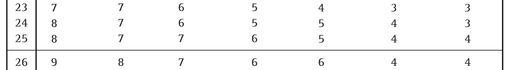

# (PART) 穩健統計方法 Robust Statistic Methods {-}

# 穩健統計方法入門

# 基於秩次的非參數檢驗

基於秩次的統計學方法不像其他參數檢驗那樣需要太多的假設和前提 (比如服從正態分佈或者其它假設)。這類方法其實放棄了數據的部分信息 -- 那就是數據之間值的差距。通過給數據排序列，我們僅僅知道數據的排序。所以我們可以下結論說 $A$ 大於 $B$，或者 $B$ 大於 $C$ (因此 $A$ 也大於 $C$)，但是他們之間數值的差距被忽略掉了 (所以我們不能比較 $A-B$ 和 $B-C$ 的大小)。

所以，基於秩次的統計學方法完全只依賴數據的大小**排序**，觀察獲得數據的真實大小被忽視了。

## 符號檢驗 the Sign test

我們以下列一組空腹血糖測量值的數據爲例：

```{r echo=FALSE}
library(knitr)
library(kableExtra)
dt <- read.csv("/home/ccwang/Documents/LSHTMlearningnote/backupfiles/FBG.csv", header = F)
kable(dt, "html", col.names = c("","",""), align = "c",caption = "Fasting Glucose Level (mmol/L)") %>%
  kable_styling(bootstrap_options = c("striped", "bordered")) %>%
#  collapse_rows(columns = c(1)) %>%
  add_header_above(c("n=24 Diabetics" = 3))
```
我們如果想要對這組數據的中位數做出假設檢驗，$H_0: \theta = 10; \text{ v.s. } H_1: \theta\neq10$。

該選擇哪種檢驗方法來回答這個假設檢驗提出的問題：中位數是否等於 $10$?

符號檢驗 (the _sign test_)，可以用來輔助我們對數據的中位數 (median $\theta$) 作出推斷 (inference)。雖然往下看你會發現嚴格說來這並不算是基於秩次的檢驗方法。使用符號檢驗時我們需要的唯一假設：數據來自連續分佈 (continuous distribution)。

這種類型的檢驗方法常用的假設檢驗如下：

$$
H_0: \theta=\theta_0 \\
H_1: \theta\neq\theta_0
$$

其中，$\theta_0$ 就是我們想要檢驗的中位數的大小，在上面的例子中，$\theta_0=10$。

此時我們用到的檢驗統計量，$X$ 的定義是：樣本數據中比 $\theta_0$ 大的數據個數，和比 $\theta_0$ 小的數據個數，兩個個數中較小的那一個。因爲在零假設的條件下，如果觀察數據的中位數等於 $\theta_0$ 的話，數據中比 $\theta_0$ 大或者小的數據個數應該是相等的。可以用一個二項分佈，概率爲 $0.5$ 的模型來模擬：

$$X\sim Bin(n, 0.5)$$

在本例中，觀察數據有 13 個小於 $\theta_0=10$，有 11 個大於 $\theta_0=10$。因此 $X=11, n=24$。假如 $\pi$ 是一個觀察數據大於 $\theta_0$ 的概率的話，在零假設的條件下，$H_0: \pi=0.5$。檢驗這個假設的雙側概率的計算公式爲：

$$2\times P(X\leqslant x|\pi=0.5)$$

在本例中， $X=11$。如果（像在考試的時候沒有電腦輔助）要用查表的方式判斷 $p$ 值大小。可以先[下載](http://onlinelibrary.wiley.com/doi/10.1002/9780470776124.app1/pdf) 一份統計數據的表格。下載好了找到 "Statistical Table 7.1 Critical one- and two-tailed values of x for a Sign test" 在第185頁：(下面只是截圖)


```{r echo=FALSE, fig.asp=.7, fig.width=4, fig.align='center', out.width='80%'}
knitr::include_graphics("img/Selection_088.png")
```
$$\cdots\cdots\cdots$$

```{r echo=FALSE, fig.asp=.7, fig.width=4, fig.cap='Critical Values for a Sign test', fig.align='center', out.width='80%'}

```

找到 $n=24$ 這一行，發現顯著性水平是 $20\%$ 的拒絕域都要小於 $8$， 所以本例的 $p>20\%$。

如果你很幸運沒有在考場上，那麼可以找出自己的電腦下載好 [R](https://www.r-project.org/) 之後執行下面的命令：

```{r}
2*pbinom(11,24, 0.5)
```
或者可以使用命令 `binom.test` 來做一個二項分佈的概率檢驗：

```{r}
options(scipen = 1, digits = 8) # just to show the p values are exactly the same
binom.test(11,24,0.5)
```

或者你也可以使用 [`BSDA`](https://alanarnholt.github.io/BSDA/) 中的 `SIGN.test` 命令來進行一場轟轟烈烈的符號檢驗：

```{r}
options(scipen = 1, digits = 8)
# input the data
dt <- c(10.3,9.5,12.2,15.1,10.8,19.0,16.1, 8.1, 8.8, 6.7,12.5, 4.2,15.3, 7.2, 9.3, 8.6, 5.3,6.7 ,5.2,13.3, 7.5, 4.9,19.5,11.1)
BSDA::SIGN.test(dt, md=10, alternative="two.sided", conf.level=0.95)
```

“據說”如果你用 [`Stata`](https://www.stata.com/) 的話還會給你一個絢麗的表格：

```{r echo=FALSE, fig.asp=.7, fig.width=4, fig.cap='The Stata output of a Sign Test', fig.align='center', out.width='80%'}
knitr::include_graphics("img/Selection_090.png")
```

總而言之無論你用的是哪個方法，查 (水) 表法或是統計武俠包，結果都是一樣的：數據無法提供足夠的證據拒絕零假設，即無證據證明中位數不等於10。

需要注意的是，如果觀察數據中有的值恰好等於 $\theta_0$ 那麼這些觀察數據就會被剔除之後再進行檢驗，相應的樣本量 ($n$) 也就變小了。如果觀察數據樣本兩足夠大，我們可以使用二項分佈的正態分佈近似 (Section \@ref(binomial-normal-approx)) 法計算。近似法計算時記得要進行校正 (Section \@ref(continuity-correction))：

$$
z=\frac{\frac{x}{n}-\pi}{\sqrt{\pi(1-\pi)/n}}=\frac{\frac{x}{n}-0.5}{\sqrt{0.5(1-0.5)/n}}=\frac{2x}{\sqrt{n}}-\sqrt{n}\\
\text{With the continuity correction, this becomes: }\\
z=\lvert\frac{2x}{\sqrt{n}}-\sqrt{n}\rvert-\frac{1}{\sqrt{n}}
$$

在本例中：

$$z=\lvert\frac{2\times11}{\sqrt{24}}-\sqrt{24}\rvert-\frac{1}{\sqrt{24}}=0.204$$

標準正態分佈的 $z$ 爲 $0.204$ 時的雙側 $p$ 值爲：

```{r}
(1-pnorm(0.204))*2
```

和前面的直接計算法的結果還算是十分接近滴。


### 符號檢驗的特點

符號檢驗十分的穩健 (Robust)，因爲我們除了數據連續性的假設之外沒有其他任何假設。但是穩健檢驗是有代價的。因爲進行符號檢驗的同時意味着我們要放棄一個個數據本身能提供的信息。結果導致這類檢驗敏感度較低，檢驗效能 (Power) 較差，以及獲得的信賴區間也就很寬 (不精確)。

## Wilcoxon 符號秩和檢驗，the Wilcoxon signed-rank test

Wilcoxon 符號秩和檢驗也可以用來檢驗一組數據的中位數是否和某個已知數字相等。進行本方法時除了像符號檢驗那樣要假設數據是連續的以外，還要假設數據的分佈是左右對稱的。因此，由於假定了左右對稱的前提，中位數也就等於均數，所以它也可以被用於檢驗均數是否等於某個已知的值。

Wilcoxon 符號秩和檢驗的前提可以被認爲是介於符號檢驗和單一樣本 $t$ 檢驗 (還假設數據來自於正態分佈) 之間的一種檢驗。

當一組隨機觀察數據 $x_1,\cdots,x_n$ 來自於對稱的連續分佈數據。如果它的中位數是 $\theta$，在零假設：$H_0: \theta=\theta_0$ 的條件下：

1. 將全部觀察數據一一和 $\theta_0$ 相減，那麼每一個 $d_i=x_i-\theta_0, i=1,2,\cdots,n$ 的正負符號概率是相等的；
2. 任何一個和 $\theta_0$ 相減之後的差 $\lvert d_i \lvert$ ，取正負符號的概率是相等的。

這裏我們使用另一個例子來說明 Wilcoxon 檢驗法。下列數據爲，12名女性從平躺姿勢改成直立時心跳次數的變化 (次/分)。

`-2, -5, 12, 4, 16, 17, 8, 3, 20, 25, 1, 9`

下面來使用 Wilcoxon 符號秩和檢驗法來檢驗中位數 $\theta=15$。

首先，先計算每個數據和 $15$ 之間的差值：

```{r}
data <- c(-2, -5, 12, 4, 16, 17, 8, 3, 20, 25, 1, 9)
newdata <- data-15
newdata
```

下一步，計算這些差值的絕對值：

```{r}
abs_newdata <- abs(newdata)
abs_newdata
Dt <- data.frame(data, newdata, abs_newdata)
Dt <- Dt[order(newdata), ] # sort the data by newdata
Dt
```

之後，給絕對值排序：

```{r}
Dt$ranks <- rank(Dt$abs_newdata)
Dt
```

接下來，給小於 $15$ 的數據的排序加上負號：

```{r}
Dt$signed_ranks <- ifelse(Dt$newdata < 0, Dt$ranks*(-1), Dt$ranks)
Dt <- Dt[order(Dt$ranks),]
Dt
```

對正的負的 `signed_ranks` 分別求和，絕對值較小的那個就是 Wilcoxon 檢驗的統計量。本例中：$S^+=$ `r sum(Dt$signed_ranks[Dt$signed_ranks>0])`，$S^-=$ `r sum(Dt$signed_ranks[Dt$signed_ranks<0])`，所以本例中的檢驗統計量等於 $14$。如果要繼續查表的話，可以找到 $0.05<p<0.1$：


```{r echo=FALSE, fig.asp=.7, fig.width=4, fig.align='center', out.width='80%'}
knitr::include_graphics("img/Selection_091.png")
```
$$\cdots\cdots\cdots$$

```{r echo=FALSE, fig.asp=.7, fig.width=4, fig.cap='Critical Values for a Wilcoxon Signed-Ranks test', fig.align='center', out.width='80%'}
knitr::include_graphics("img/Selection_092.png")
```
精確的 Wilcoxon 符號秩和檢驗可以通過下列代碼在 [R](https://www.r-project.org/) 裏完成：

```{r}
wilcox.test(Dt$data, mu=15, paired = FALSE)
```

如果數據中有觀察值和我們希望比較的數值完全相等的話，和符號檢驗類似的，這些觀察值需要被剔除之後再進行上面的個步驟檢驗。記得還要將樣本量減去相應個數再去查表尋找 $p$ 值。

另外，下面的代碼可以計算正態分佈近似的 Wilcoxon 秩和檢驗，結果十分接近：

```{r}
wilcox.test(Dt$data, mu=15, paired = FALSE, exact = FALSE, correct = FALSE)
```

值得注意的是，精確計算時，我們需要剔除那些和比較數值完全一致的觀察值。然而在正態分佈近似法的 Wilcoxon 檢驗中，這些數值並不會被剔除，而是保留下來，並且用於對方差進行調整。Wilcoxon 秩和檢驗可以在我們能夠假設數據左右對稱分佈，且明顯不服從正態分佈時使用 (即概率密度分布圖左右兩端的尾部較厚的時候)。如果數據左右完全對稱，本檢驗方法不太推薦採用。

## Wilcoxon-Mann-Whitney (WMW) 檢驗

本方法用於比較兩組獨立樣本的分佈是否只是**左右位移 (或者叫平移)**。此檢驗需要的假設前提爲：兩組獨立樣本來自連續型分佈，且僅僅只存在整體的**左右位移 (或者叫平移)** (location shift)。

例如說，兩組數據各自的累積概率方程分別是 $F(\cdot), G(\cdot)$ 時，由上面的假設可知：

$$G(y)=F(y-\Delta), \text{ where } -\infty<\Delta<\infty$$

上面式子中的 $\Delta$ 就是所謂的 **"左右位移 (或者叫平移)"**。因此本檢驗的零假設和替代假設爲：

$$H_0: \Delta=0\\
  H_1: \Delta\neq0$$

在零假設的條件下，我們可以認爲兩個樣本來自相同的人羣分佈。假如，$F, G$ 都是正態分佈，且同方差。那麼 $\Delta$ 就等於兩個分佈的均值差。在這種情況下就可以使用兩樣本 $t$ 檢驗。所以說，WMW 檢驗其實就是把假設前提放寬了的 (免去了正態分佈假設) 兩樣本 $t$ 檢驗。

如果兩個獨立樣本分別有樣本量 $n, m, \text{ and } n<m$：$X_1,\cdots,X_n$ 和 $Y_1, \cdots, Y_m$。在零假設的條件下，將這兩個樣本合併之後的大樣本 ($m+n$ 個樣本量) ：$X_1,\cdots,X_n,Y_1, \cdots, Y_m$ 可以視爲來自同一分佈。那麼在合併後的樣本中，我們給每一個元素賦予它們的合併後數據中的排序 ($\text{Rank}_i: i= 1,2,\cdots,n, n+1, \cdots, n+m$)。那麼我們感興趣的 Wilcoxon 秩和統計量 (Wilcoxon rank sum statistic) $W_1$ 是樣本量較小的那些數字在合併後數據中的排序之和。

$$W_1=\sum_{i=1}^n R_i$$

對於大小相同的數據，排序取他們的排序的平均值。

之後再計算 ：

$$U_1=W_1+\frac{n(n+1)}{2}$$

最後拿來判斷的檢驗統計量是 $U_1$ 和 $n\times m -U_1$ 兩者中較小的數字。(注：如果我們一開始計算樣本量較多的部分的秩和 $W_2=\sum_{i=1}^m R_i$ 時，將計算的 $U_2=W_2-\frac{m(m+1)}{2}$，跟 $n\times m - U_2$ 中較小的數字作爲檢驗統計量的話，我們會在數學上獲得完全一樣的檢驗統計量。)

其實兩個統計量 $W, U$ 均可以用來作相同的統計推斷，當然各自的 $p$ 值表格不同。但是 $U$ 有另外一種統計學含義：$U$ 是 $X_i>Y_j$， 也就是所有的 $(X_i, Y_j)$ 配對中 $X_i$ 較大的對的個數。

這裏使用下面的例子來解釋如何操作 WMW 檢驗：
採集16名甲亢兒童的血清甲狀腺素濃度值列表如下，

```{r echo=FALSE}
library(knitr)
library(kableExtra)
dt <- read.csv("/home/ccwang/Documents/LSHTMlearningnote/backupfiles/thyroid.csv", header = T)
kable(dt, "html", align = "c",caption = "Serum thyroxine levels") %>%
  kable_styling(bootstrap_options = c("striped", "bordered")) %>%
#  collapse_rows(columns = c(1)) %>%
  add_header_above(c("n=16 hypothyroid children" = 2))
```

這裏我們需要比較輕微症狀組和嚴重症狀組的血清甲狀腺濃度的分佈是否只是左右位移，$H_0: \Delta=0$。

首先，我們要給兩組合併後的濃度排序：

```{r}
dt$rank <- rank(dt$thyr)
dt <- dt[order(dt$rank),]
dt
```

Wilcoxon 統計量 $W_1$ 是人數少的組的排序之數值和。本樣本中 7 人有嚴重症狀，9人有輕微或無症狀。所以 $W_1$ 就是嚴重症狀組的秩和：

$$W_1=1+2+3+4+11.5+14+16=51.5$$

再計算統計量 $U_1$：

$$U_1=W_1-\frac{n(n+1)}{2}=51.5-\frac{7\times(7+1)}{2}=23.5$$

所以 $n\times m-U_1=7\times9-23.5=39.5$，顯然這兩個數值中小的 $23.5$ 就是我們尋找的 WMW 統計量。繼續查水錶：

```{r echo=FALSE, fig.asp=.7, fig.width=4, fig.cap='Critical Values of U for a Wilcoxon-Mann-Whitney test', fig.align='center', out.width='80%'}
knitr::include_graphics("img/Selection_093.png")
```
可知 $n_1=7, n_2=9$ 時，統計量要低於 $15$ $p$ 值才會小於 $0.01$。所以數據給出的 $p>0.1$。

在 [R](https://www.r-project.org/) 裏面用下面的代碼進行 WHW 檢驗：
```{r warning=FALSE}
wilcox.test(dt$thyr~dt$group, correct=FALSE) # without continuity correction
wilcox.test(dt$thyr~dt$group) # with continuity correction i.e. normal appriximation
```

## 秩相關，Spearman's Rank Correlation Coefficient

Spearman 的秩相關 (通常用 $\rho$)，是一種基於數據排序的相關係數算法。和傳統的 Pearson 相關係數類比，是當數據無法被認定是線性相關時的另一種相關關係檢驗方法。所以秩相關不假定兩組數據之間是線性相關 (linear association)。秩相關只關心一個數據遞增時，另一個數據是否單調遞增。所以可以用於傾向性檢驗。

具體的操作是，在兩組數據中先各自排序，像所有的排序檢驗一樣遇到相同大小的數值將排序取均值。之後使用一般的求相關係數的方法。本法中只用到了數值在各自組中的排序，並沒有使用他們的真實大小。近似法的秩相關計算公式爲：

$$\hat\tau=\frac{\hat\rho}{\sqrt{(1-\hat\rho^2)/(n-2)}}$$

在零假設條件下 $H_0: \rho=0$，上面的近似法秩相關服從 $t_{n-2}$ 分佈。
下面用某血友病患者調查數據獲得的血液 $T_4, T_8$ 淋巴球計數 $(\times10^9/\ell)$ 來詳細解釋計算過程：

```{r echo=FALSE}
library(knitr)
library(kableExtra)
dt <- read.csv("/home/ccwang/Documents/LSHTMlearningnote/backupfiles/t4t8.csv", header = T)
kable(dt, "html", align = "c",caption = "Lymphocyte counts") %>%
  kable_styling(bootstrap_options = c("striped", "bordered")) %>%
#  collapse_rows(columns = c(1)) %>%
  add_header_above(c("n=28 haemophiliacs" = 2)) %>%
    scroll_box(width = "700px", height = "600px")
```


給這組數據繪製散點圖：

```{r echo=FALSE, fig.asp=.7, fig.width=5, fig.align='center',fig.cap='Scatter plot of T4 and T8 counts', out.width='80%'}
library(ggplot2)

ggplot(dt, aes(x=th4, y=th8)) + geom_point(shape=20) + #geom_rug(position = "jitter", size=0.2)+
 theme(plot.subtitle = element_text(vjust = 1),
    plot.caption = element_text(vjust = 1),
    axis.line = element_line(size = 0.5,
        linetype = "solid"), axis.title = element_text(size = 13,
        face = "bold"), axis.text = element_text(size = 12,
        face = "bold", colour = "gray0"),
    axis.text.x = element_text(size = 11),
    axis.text.y = element_text(size = 11),
    panel.background = element_rect(fill = "whitesmoke"))+
  scale_y_continuous(breaks=seq(0, 1.5, 0.5),limits = c(0,1.53))+
  scale_x_continuous(breaks = seq(0,2.5,0.5),limits = c(0,2.53))
```

可以看見圖中右上角的兩個點幾乎可以認爲是異常值 (outliers)。
分別給 `th4, th8` 求各自的排序：

```{r}
dt$rank4 <- rank(dt$th4)
dt$rank8 <- rank(dt$th8)
kable(dt, "html", align = "c",caption = "Lymphocyte counts") %>%
  kable_styling(bootstrap_options = c("striped", "bordered")) %>%
#  collapse_rows(columns = c(1)) %>%
  add_header_above(c("n=28 haemophiliacs with ranks" = 4)) %>%
    scroll_box(width = "700px", height = "600px")
```

接下來再給 `th4, th8` 的排序做散點圖：

```{r echo=FALSE, fig.asp=.7, fig.width=5, fig.align='center',fig.cap='Scatter plot of T4 and T8 ranks', out.width='80%'}
library(ggplot2)

ggplot(dt, aes(x=rank4, y=rank8)) + geom_point(shape=20) + #geom_rug(position = "jitter", size=0.2)+
 theme(plot.subtitle = element_text(vjust = 1),
    plot.caption = element_text(vjust = 1),
    axis.line = element_line(size = 0.5,
        linetype = "solid"), axis.title = element_text(size = 13,
        face = "bold"), axis.text = element_text(size = 12,
        face = "bold", colour = "gray0"),
    axis.text.x = element_text(size = 11),
    axis.text.y = element_text(size = 11),
    panel.background = element_rect(fill = "whitesmoke"))+
  labs(x = "rank of (th4)", y = "rank of (th8)")+
  scale_y_continuous(breaks=seq(0, 35, 5),limits = c(0,31))+
  scale_x_continuous(breaks = seq(0,35,5),limits = c(0,31))
```

此時也就沒有了異常值的存在。對二者的排序計算相關係數：

```{r}
cor.test(dt$rank4, dt$rank8)
cor.test(dt$th4, dt$th8)
```

秩相關的相關係數爲 $0.628$。而原始數據的相關係數爲 $0.719$。

## 基於秩次的非參數檢驗的優缺點

優點：

- 可以讓我們拋棄很多 (正態分佈等的) 前提假設，許多真實數據本身並不能滿足這些條件，這些情況下，基於秩次的非參數檢驗能提供更高的統計效能 (power)。

缺點：

- 如果數據本身能夠滿足如正態分佈之類的假設，那麼相比較與一般的參數檢驗，基於秩次的非參數檢驗法效能就偏低。
- 基於秩次的非參數檢驗較難推廣到更加複雜的情況。
- 這些檢驗法僅僅只能幫助我們進行假設檢驗。但是多數情況下，我們更加希望能使用觀察數據對總體進行點估計 (point estimates) 並且給出信賴區間 (CIs)。通常情況下，基於秩次的非參數檢驗法就很難給出這樣的估計。
