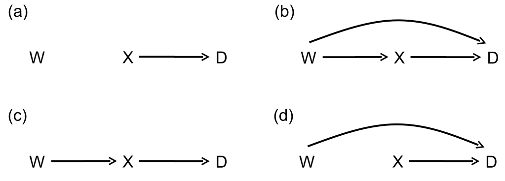

# (PART) 廣義線性迴歸模型 {-}

# 重要概念複習
> There are no routine statistical questions, only questionable statistical routines.
>
> --- Sir David Cox


## 概率論學派統計推斷要點複習

下面我們一起用二項分佈的概念 ($n$ 個對象中 $K$ 個“事件”)，來複習概率論學派的統計推斷要點。

1. 模型，the Model。一個統計模型，描述的不僅僅是我們研究的人羣的一些特徵，而且通常一個模型還可提供如何從人羣中收集該樣本的信息。<br> 用二項分佈的概念來解釋，人羣是衆多個體的集合，他們中的一部分佔比 $\pi$ 的人身上發生了某個事件。從這個人羣的集合中，我們隨機抽取 $n$ 個對象作爲**研究樣本**，該樣本中有 $K$ 個人身上發生了事件。此時，我們說 $K$ 服從人羣比例爲 $\pi$ 的二項分佈：$K \sim \text{Bin}(n,\pi)$。
2. 參數，parameters。模型中的參數反映了人羣的某些特徵。在實際應用中，從來沒有“人類”能知道人羣參數的真實值，渺小的我們從人羣中抽取樣本，用於推斷 “上帝才知道的” 這些代表了人羣特徵的參數。<br> 在二項分佈的情境下，有且只有一個人羣參數，人羣中事件的比例 $\pi$。
3. 參數估計量，parameter estimators。估計量是樣本的統計量，被用來估計未知的總體參數。估計量 estimator，是一個隨機變量，是我們計算估計值的一般形式。估計值 estimate，是每個樣本通過統計模型計算獲得的估計量的真實值，每採樣一次，計算獲得的估計值理論上會略有不同。<br> 二項分佈的上下文中，人羣事件比例 -- 這一參數 $\pi$ 的天然估計量是 $\hat\pi = \frac{K}{n}$，當一個樣本中發現 $K = k$，該樣本給出的估計值是 $\frac{k}{n}$。
4. 研究假設，hypotheses。研究假設是實驗前我們提出的要被檢驗的一些關於人羣某些特徵參數的 “陳述 statement”。可以是猜想參數等於某個特定值，或者多個參數大小相同。<br> 二項分佈的數據裏，只有一個人羣參數，$\pi$。可能提出的零假設和替代假設有很多，$\pi = 0.5 \text{ v.s. } \pi \neq 0.5$ 是其中之一的複合型假設。

## 似然

如果一個模型只有一個參數 $\theta$，樣本數據已知的話，該參數的似然爲：

$$\text{L}(\theta | \text{data}) = \text{Pr}(\text{data}|\theta)$$

其中，$\text{Pr}(\text{data}|\theta)$ 對於離散型變量，是概率方程 probability function；對於連續型變量，則是概率密度方程 probability density function (PDF)。

對數似然，就是上面的似然方程取自然底數的對數方程：

$$\ell(\theta | \text{data}) = \text{ln}\{ \text{L}(\theta | \text{data}) \}$$


## 極大似然估計

當數據收集完畢，從獲得的數據中計算獲得的能夠使似然方程/或對數似然方程取得極大值的 $\theta$ 的大小，被叫做極大似然估計 $\text{(MLE)}$，且通常數學標記會在參數上加一頂帽子： $\hat\theta$。收集不同的樣本，在相同的似然方程或對數似然方程下，極大似然估計不同。

1. 許多問題，我們獲得極大似然估計的方法是先定義好模型的似然方程，然後求該方程的一階導數之後計算使之等於零的參數值大小就是 $\text{MLE } \hat\theta$。此時，你還要記得再求一次二階導數，看是否小於零，以確保前一步計算獲得的值給出的似然方程是極大值。
2. 更多的時候我們用對數似然方程以簡化計算過程：

$$
\begin{aligned}
\left.\frac{\text{d}}{\text{d } \theta}\ell (\theta | \text{data})\right\vert_{\theta=\hat{\theta}}  &= \ell^\prime(\hat\theta) = 0 \\
\left.\frac{\text{d}^2}{\text{d } \theta^2}\ell (\theta | \text{data})\right\vert_{\theta=\hat{\theta}}  &= \ell^{\prime\prime}(\hat\theta) < 0
\end{aligned}
$$

3. 我們只關心似然方程的形狀，所以方程中不包含參數的部分可全部忽略掉。
4. $\text{MLE}$ 的一些關鍵性質：
    1. 漸進無偏 asymptotically unbiased：當 $n\rightarrow \infty$ 時，$E(\hat\theta) \rightarrow \theta$；
    2. 一致性 consistency：隨着樣本量的增加，$\hat\theta$ 收斂於 (converges) 總體參數 $\theta$；
    3. 漸進正態分佈 asymptotically normality：隨着樣本量增加，$\hat\theta$ 的樣本分佈收斂於 (converges) 正態分佈，方差爲  $$E[-\ell^{\prime\prime}(\theta)]^{-1}=[-\ell^{\prime\prime}(\hat\theta)]^{-1}$$
    4. 恆定性 invariance：如果 $\hat\theta$ 是 $\text{MLE}$，那麼 $\theta$ 被數學轉換以後 $g(\theta)$ 的方程的 $\text{MLE}$ 是 $g(\hat\theta)$
5. 似然理論可以直接拓展到多個參數的情況。一般地，如果一個模型有 $p$ 個參數 $\mathbf{\theta} = (\theta_1, \theta_2, \cdots, \theta_p)^T$，這些參數在給定數據的條件下的似然方程爲：$$\text{L}(\mathbf{\theta} | \text{data}) = \text{Pr}(\text{data} | \mathbf{\theta})$$ 其中，概率 (密度) 方程在多個參數時變成聯合 (joint) 概率 (密度) 方程。似然，也是各個參數的聯合似然方程。此時，參數向量 $\mathbf{\theta} = (\theta_1, \theta_2, \cdots, \theta_p)^T$ 的方差協方差矩陣的估計量爲：

$$
\hat{\text{Var}}(\mathbf{\hat\theta}) = - \left(
\begin{array}{c}
\frac{\partial^2\ell}{\partial\theta^2_1} & \frac{\partial^2\ell}{\partial\theta_2\partial\theta_1} & \cdots & \frac{\partial^2\ell}{\partial\theta_k\partial\theta_1}  \\
\frac{\partial^2\ell}{\partial\theta_1\partial\theta_2} & \frac{\partial^2\ell}{\partial\theta^2_2} & \cdots & \frac{\partial^2\ell}{\partial\theta_k\partial\theta_2}  \\
\vdots & \vdots & \ddots & \vdots  \\
\frac{\partial^2\ell}{\partial\theta_1\partial\theta_k} & \frac{\partial^2\ell}{\partial\theta_2\partial\theta_k} & \cdots & \frac{\partial^2\ell}{\partial\theta^2_k}  \\
\end{array}
\right)^{-1}_{\theta=\hat\theta}
$$

Tips: typing `vcov(Modelname)` command in R will display this estimated variance-covariance matrix for the parameter estimates.

回到二項分佈數據的例子：

$$
K \sim \text{Bin}(n, \pi)
$$

如果我們樣本的觀測數據是 $K=k$，對數似然方程一次微分等於零以後求得的參數 $\pi$ 的 $\text{MLE}$ 是 $\hat\pi = \frac{k}{n}$。所以參數 $\pi$ 的估計量是 $\frac{K}{n}$。$\hat\pi$ 的方差估計量是：

$$
\hat{\text{Var}} (\hat\pi) = \frac{\hat\pi(1-\hat\pi)}{n} \text{ for } \hat\pi = \frac{k}{n}
$$


## 關於假設檢驗的複習

極大似然估計可以有三大類檢驗方法：似然比檢驗法 likelihood ratio test；Wald 檢驗 Wald test；Score 檢驗 Score test。

- 似然比檢驗法 likelihood ratio test (LRT) (Section \@ref(LRT))：

$$
-2llr(\theta_0) = -2\{ \ell(\theta_0) - \ell(\hat\theta) \}
$$

零假設條件下 (Under $\text{H}_0$:)

$$
-2llr(\theta_0) \sim \chi_1^2
$$

這個對數似然比的統計量可以和自由度爲 1 的卡方分佈作比較，計算反對零假設的證據的強度大小。如果顯著性水平是 $\alpha$，那麼下面條件成立時，可以認爲反對零假設的證據強度大到足以拒絕零假設。

$$
-2llr(\theta_0) > \chi^2_{1, 1-\alpha}
$$

- Wald 檢驗 (Section \@ref(Wald)) 是一種利用二次方程近似法對似然比檢驗進行近似的手段。其檢驗統計量是

$$
\begin{aligned}
  (\frac{M-\theta_0}{S})^2 & \sim \chi^2_1 \\
 \text{Where } M  & = \hat\theta \\
              S^2 & = \frac{1}{-\ell^{\prime\prime}(\hat\theta)}
\end{aligned}
$$

- Score 檢驗 (Section \@ref(Score)) 是另一種利用二次方程近似法對似然比檢驗進行近似的手段。其檢驗統計量是

$$
\begin{aligned}
\frac{U^2}{V} & \sim \chi^2_1 \\
\text{Where } U  & = \ell^\prime(\theta_0) \\
             V & = -\ell^{\prime\prime}(\theta_0)
\end{aligned}
$$

如果對數似然方程本身就是一個二次方程 (數據服從完美正態分佈狀態，且總體方差已知時)，這三大類的檢驗法其實計算獲得完全一樣的 $p$ 值，提供完全一致的證據。多數情況下，三大類檢驗法的結果是近似的。關於三種檢驗法的比較可以參考過去總結的章節 (Section \@ref(LRTwaldScore-Compare))

### 子集似然函數

當統計模型中的部分參數是噪音參數 (nuisance parameters) 時，我們需要用到子集似然函數法 (Section \@ref(profile-log-likelihood)) 來去除噪音參數的影響,，只檢驗我們感興趣的那部分參數。

## 線性迴歸複習

### 簡單線性迴歸

假設對於 $n$ 名研究對象，我們測量個兩個觀測值 $(y_i, x_i)$，那麼用線性迴歸模型來表示這兩個測量值估計的參數之間的關係就是：

$$
\begin{aligned}
y_i &  = \alpha + \beta x_i + \varepsilon_i \\
\text{Where } & \varepsilon_i \sim \text{NID}(0,1)
\end{aligned}
$$

或者用另一個標記法：

$$
Y_i | x_i \sim N(\alpha + \beta x_i, \sigma^2)
$$

### 多元線性迴歸

如果預測變量有兩個或者兩個以上 $(x_i, \;\&\; z_i)$，那麼描述這兩個預測變量和因變量之間的多元線性迴歸模型可以寫作：

$$
y_i = \alpha + \beta x_i + \gamma z_i + \varepsilon_i
$$

此時， $\beta$ 的含義是，當保持 $z$ 不變時，$x$ 每增加一個單位，$y$ 的變化量。用這個模型，我們默認 $z$ 保持不變的同時無論取值爲多少， $x, y$ 之間的關係是不會變化的，我們用這個模型來調整 (adjust) $z$ 的混雜效應 (confounding effect) (Section \@ref(confounding))。

當然我們也可以考慮當 $z$ 取值不同時， $x, y$ 之間的關係發生改變，只要在上面的多元線性迴歸方程中加入一個交互作用項即可 (Section \@ref(interaction))。

$$
y_i = \alpha + \beta x_i + \gamma z_i + \delta x_i z_i + \varepsilon_i
$$

增加了交互作用項最大的變化是，$x_i$ 的迴歸係數 $\beta$ 的含義發生了改變：當且僅當 $z = 0$ 且保持不變時，$x$ 每增加一個單位，$y$ 的變化量。如果 $z = k \neq 0$ 且保持不變，那麼 $x$ 每增加一個單位，$y$ 的變化量則是 $\beta + k\delta$。

### 簡單線性迴歸的統計推斷

一個給定的樣本 $(y_i, x_i), i = 1, \cdots, n$ ，其對數似然方程是

$$
\ell(\alpha, \beta, \sigma^2 | \mathbf{y, x}) = -\frac{1}{2\sigma^2}\sum^n_{i=1}(y_i - \alpha - \beta x_i)^2
$$

分別對 $\alpha, \beta$ 求微分之後可以獲得他們各自的 $\text{MLE}$：

$$
\begin{aligned}
U(\alpha) & = \ell^\prime(\alpha) = \frac{1}{\sigma^2}\sum_{i=1}^n (y_i - \alpha - \beta x_i) \\
U(\beta)  & = \ell^{\prime}(\beta) = \frac{1}{\sigma^2}\sum_{i=1}^n x_i(y_i - \alpha - \beta x_i) \\
U(\hat\alpha) & = 0 \Rightarrow \hat\alpha = \bar{y} - \hat\beta\bar{x} \\
U(\hat\beta)  & = 0 \Rightarrow \hat\beta=\frac{\sum_{i=1}^n(x_i-\bar{x})(y_i-\bar{y})}{\sum_{i=1}^n(x_i-\bar{x})^2} = \frac{\sum x_iy_i - n\bar{x}\bar{y}}{\sum x_i^2 - n\bar{x}^2}
\end{aligned}
$$

注意到和線性迴歸章節中推導的過程不同 (Section \@ref(MLEalphabeta))，當時我們用的是最小二乘法，這裏我們用的是光明正大的極大似然法，同時也證明了最小二乘法獲得的 $\hat\alpha,\hat\beta$ 是他們各自的 $\text{MLE}$。

另外，殘差方差的 $\text{MLE}$ 也可以用上面的方法推導出來，同樣和之前的方法 (Section \@ref(ResidualVar)) 做個對比吧：

$$
\begin{aligned}
U(\sigma^2) & = \ell^\prime(\sigma^2) = -\frac{n}{2\sigma^2} + \frac{1}{2\sigma^4}\sum_{i=1}^n(y_i - \alpha - \beta x_i)^2 \\
U(\hat\sigma^2) & \Rightarrow \hat\sigma^2 = \frac{\sum_{i=1}^n(y_i - \hat\alpha - \hat\beta x_i)^2}{n}
\end{aligned}
$$

這個殘差方差的 $\text{MLE}$ 其實不是一個無偏估計，它只是一個漸進無偏的估計 (需要除以 $\frac{n-2}{n}$)，所以，當一個線性迴歸模型中有 $p$ 個參數時：

$$
\hat\sigma^2 = \frac{\sum_{i=1}^n(y_i - \hat\alpha - \hat\beta_1 x_{i1} - \hat\beta_2 x_{i2}\cdots)^2}{n - p}
$$

線性迴歸時殘差方差的檢驗統計量服從 $F$ 分佈 (Section \@ref(lm-Ftest))。

# 廣義線性迴歸入門

線性迴歸方法是十分強大的建模工具，可惜的是它只能適用與因變量爲連續型變量的情況。廣義線性迴歸模型 (或者叫一般化線性迴歸模型 generalised linear models, GLM) 是一大類將線性迴歸模型拓展到因變量可以使用二分類，計數，分組型變量的建模工具。

## 指數分佈家族

一個服從正態分佈的隨機變量 $Y$ 的概率密度方程 (probability density function, PDF) 可以寫作

$$
f(y) = \frac{1}{\sqrt{2\pi\sigma^2}}e^{-\frac{(y-\mu)^2}{2\sigma^2}}
$$

給 PDF 的左右兩邊同時取自然底數的對數，方程變形爲

$$
\begin{aligned}
\text{ln}\{f(y)\} & = -\frac{y^2}{2\sigma^2} + \frac{y\cdot\mu}{\sigma^2} - \frac{\mu^2}{2\sigma^2} -\frac{1}{2}\text{ln}(2\pi\sigma^2) \\
                & = \frac{y\cdot\mu - \frac{\mu^2}{2}}{\sigma^2} - [\frac{y^2}{2\sigma^2} + \frac{1}{2}\text{ln}(2\pi\sigma^2) ]
\end{aligned}
(\#eq:glm2-0)
$$

如果令

$$
\begin{aligned}
\theta & = \mu  \\
\psi   & = \sigma^2 \\
b(\theta) & = \frac{\mu^2}{2} \\
c(y, \theta) & = \frac{y^2}{2\sigma^2} + \frac{1}{2}\text{ln}(2\pi\sigma^2)
\end{aligned}
$$

那麼上面的式子 \@ref(eq:glm2-0) 可以被整理爲：

$$
\begin{equation}
\text{ln}\{f(y)\} = \frac{y\cdot\theta - b(\theta)}{\psi} - c(y, \theta)
\end{equation}
(\#eq:glm2-1)
$$

**此處有重要結論：** 凡是分佈的概率密度方程的對數方程能夠轉換整理成 \@ref(eq:glm2-1) 形式的分佈，都隸屬於指數分佈家族 (the Exponential Family of distributions)。

### 泊松分佈和二項分佈的指數分佈家族屬性

- 泊松分佈 Poisson Distribution

$$
\begin{aligned}
     f(y) & = \text{Pr}(Y = y) = \frac{\mu^y e^{-\mu}}{y!}, y = 0,1,2,\cdots \\
\text{ln}\{ f(y) \} & = y\cdot\text{ln}(\mu) - \mu - \text{ln}(y!) \\
\text{Let } &\color{red}{\boxed{\theta = \text{ln}(\mu), \psi = 1, b(\theta) = \mu, c(y,\psi) = \text{ln}(y!)}} \\
\Rightarrow \text{ln}\{f(y)\} & = \frac{y\cdot\theta - b(\theta)}{\psi} - c(y, \theta) \\
\end{aligned}
$$

所以，**泊松分佈屬於指數分佈家族成員**。

- 二項分佈 Binommial Distribution

$$
\begin{aligned}
f(y) & = \text{Pr}(Y = y) = \binom{n}{y}\pi^y(1-\pi)^{n-y}, y = 0,1,2,\cdots\\
\text{ln}\{ f(y) \} & = y\cdot \text{ln}(\pi) + (n - y)\text{ln}(1-\pi) + \text{ln}\{\binom{n}{y}\} \\
                    & = y\cdot \text{ln}(\frac{\pi}{1-\pi}) + n\text{ln}(1-\pi) +  \text{ln}\{\binom{n}{y}\} \\
\text{Let } &\color{red}{\boxed{\theta = \text{ln}(\frac{\pi}{1-\pi}), \psi = 1,}} \\
            &\color{red}{\boxed{b(\theta) = -n\text{ln}(1-\pi), c(y, \psi) = -\text{ln}\{\binom{n}{y}\}}}\\
\Rightarrow \text{ln}\{f(y)\} & = \frac{y\cdot\theta - b(\theta)}{\psi} - c(y, \theta) \\
\end{aligned}
$$

所以，**二項分佈也屬於指數分佈家族成員**。

指數分佈家族成員的數學表達式  \@ref(eq:glm2-1)  中，

- $\theta$ 被叫做標準 (或者叫自然) 參數 (**canonical or natural parameter**)，相關的函數被叫做標準鏈接函數 (canonical link function)，如上面所列舉的例子中：泊松分佈時用的對數函數 $\text{ln}(\mu)$，二項分佈時用的邏輯函數 (logit function) $\text{ln}(\frac{\pi}{1-\pi})$，鏈接函數可能還有別的選擇，(例如，二項分佈數據的另一種標準鏈接函數是概率函数 (probit function $\Phi^{-1}(P)$))，同時它對於條件推斷 conditional inference 至關重要，因爲它還提示我們應該用什麼樣的算法去估計我們苦苦尋找的人羣參數。
- $\phi$ 被命名爲**尺度參數 (scale or dispersion parameter)**，泊松分佈和二項分佈的尺度參數是 $1$。但是正態分佈的尺度參數是方差 $\sigma^2$，且常常是未知的，需要從樣本數據中估計。尺度參數是否需要從樣本中獲取其估計值，對於實際統計推斷或者假設檢驗的過程有重大影響。

廣義線性迴歸就是這個指數分佈家族數據共通的一種統計建模過程，所以，在這一“屋檐”下，它衍生出衆多種類的統計模型。

------------------

### Exercise. Exponential distribution

證明指數分佈本身也屬於指數分佈家族，定義其標準鏈接函數和標準參數。

**證明**

$$
\begin{aligned}
Y \sim \text{exp}(\lambda) & \rightarrow f(y) = \lambda \text{exp}(-y\lambda), y > 0\\
\Rightarrow \text{ln}\{ f(y) \} & = - y \lambda + \text{ln}(\lambda) \\
\text{Let } & \color{red}{\theta = -\lambda, b(\theta) = - \text{ln}(\lambda), \phi = 1, c(y, \phi) = 0} \\
\Rightarrow \text{ln}\{f(y)\} & = \frac{y\cdot\theta - b(\theta)}{\phi} - c(y, \theta) \\
\text{Because } E(Y) & = \frac{1}{\lambda}, \text{ the canonical link is } g(\lambda) = -\frac{1}{\lambda}\\
\end{aligned}
$$

------------------


## 廣義線性迴歸模型之定義 {#defineaGLM}

一個四肢健全的廣義線性模型包括三個部分：

1. 因變量分佈 (或者叫響應變量分佈，response distribution)：$Y_i, i = 1,\cdots,n$ 可以被認爲是互相獨立且服從指數家族分佈，設其期望值 (均值) $E(Y_i) = \mu_i$；
2. 線性預測方程 (linear predictor)：**預測變量及其各自的參數以線性迴歸形式進入模型**，其中第 $i$ 個觀測值的線性預測值爲：<br> $$\eta_i = \alpha + \beta_1 x_{i1} + \cdots + \beta_p x_{ip}$$
3. 鏈接函數 (link function)：鏈接函數連接的是線性預測方程 $\eta_i$ 和其期待值 (均值) 之間 $\mu_i$ 的關係。<br> $$g(\mu_i) = \eta_i$$


簡單線性迴歸模型本身當然也數據廣義線性迴歸模型：

1. 因變量分佈是正態分佈；
2. 線性預測值也是線性迴歸形式；
3. 鏈接函數是它因變量本身 (the **identity** function)。


## 注意

1. 廣義線性迴歸的線性預測方程部分的意義，需要澄清的是它指的是 **參數 parameter** 之間呈線性關係，預測變量本身可以有二次方，三次方，多次方，因爲這些多項式線性迴歸本身仍然是**線性的**如： $$\eta_i = \alpha + \beta_1 x_i + \beta_2 x_i^2 + \cdots + \beta_p x_i^p$$ <br> 然而，這樣的形式 $$\eta_i = \alpha (1- e^{\beta_1 x_{i1}})$$ <br> 就不能說是一個線性預測方程。
2. 除了有很少的特例。廣義線性迴歸擬合後的參數估計，推斷，模型評價和比較時使用的原理都一樣，不同的只有各自的分佈和鏈接函數。
3. 通常選用的鏈接方程，要能夠使線性預測方程的取值範圍達到所有實數 $-\infty,+\infty$。
4. “模型的似然函數 the log likelihood of the model”，只是我們偷懶縮短了原文 “在給定數據的前提下，當所有參數均爲 $\text{MLE}$ 時模型的對數似然函數 (the log likelihood function of the model for the given data evaluated at the MLE's of the parameters)”，就是對數似然函數的極大值的意思 (i.e. the maximum of the log likelihood function)。
5. 從本節開始往後的章節中 “模型，model”，“廣義線性模型，generalized linear model”，和 "GLM" 將被視爲同義詞。

## 如何在 R 裏擬合 "GLM"

這裏討論用極大似然法擬合 "GLM" 模型的方法。前面一章節的複習也是在告訴我們，利用極大似然法簡單說就是找到模型參數，使得似然函數能夠取到極大值。對於線性迴歸來說， $\text{MLE}$ 可以用一個封閉式函數來計算；但是廣義線性迴歸模型則必須使用[迭代法計算 (iterative methods)](https://www.youtube.com/watch?v=JZIeX3eVyf4)。

在 R 裏面擬合廣義線性模型的命令及其格式是：

```{r eval = FALSE}
glm(response variable ~ explanatory variables to form linear predictor, family=name of distribution(link=link function), data=dataset)
```

Tips: See `help(glm)` for other modeling options. See `help(family)` for other allowable link functions for each family.

下面的數據來自一個心理學臨牀實驗，比較的是和安慰劑組相比，注射嗎啡組，注射海洛因組對象的精神病檢測指數的前後變化。

```{r cache = TRUE}
Mental <- read.table("backupfiles/MENTAL.DAT", header =  FALSE, sep ="", col.names = c("treatment", "Before", "After"))
Mental$treatment[Mental$treatment == 1] <- "placebo"
Mental$treatment[Mental$treatment == 2] <- "morphine"
Mental$treatment[Mental$treatment == 3] <- "heroin"
Mental$treatment <- factor(Mental$treatment, levels = c("placebo", "morphine", "heroin"))
head(Mental)
```

我們來比較一下簡單線性迴歸的代碼輸出結果和廣義線性迴歸代碼輸出結果是否一致：

用 `lm` 命令，擬合因變量爲注射後精神病檢測指數，預測變量爲治療方式和注射錢精神病檢測指數，及兩者的交互作用項：

```{r}
Model1 <- lm(After ~ treatment*Before, data = Mental)
summary(Model1)
```

同樣的模型也可以用 `glm` 命令擬合：

```{r}
Model2 <- glm(After ~ treatment*Before, family = gaussian(link = "identity"), data = Mental)
summary(Model2)
```

可以看到，`glm` 命令的輸出結果略多，但是參數估計的部分是完全相同的。**但是如果你用的是坑爹的 STATA，那裏面的 `glm` 命令中的統計檢驗量和 $p$ 值用的則是正態分佈近似法。所以在 STATA 裏面簡單線性迴歸模型最好不要使用 `glm` 命令：**

```
 glm After i.treatt##c.Before, family(gaussian) link(identity)

Iteration 0:   log likelihood = -185.70711

Generalized linear models                         No. of obs      =         72
Optimization     : ML                             Residual df     =         66
                                                  Scale parameter =   11.10799
Deviance         =  733.1276068                   (1/df) Deviance =   11.10799
Pearson          =  733.1276068                   (1/df) Pearson  =   11.10799

Variance function: V(u) = 1                       [Gaussian]
Link function    : g(u) = u                       [Identity]

                                                  AIC             =   5.325197
Log likelihood   =  -185.707106                   BIC             =   450.8676

------------------------------------------------------------------------------
             |                 OIM
        After|      Coef.   Std. Err.      z    P>|z|     [95% Conf. Interval]
-------------+----------------------------------------------------------------
       treat |
          2  |  -1.211742   1.750342    -0.69   0.489    -4.642349    2.218865
          3  |  -1.461968   1.771855    -0.83   0.409    -4.934741    2.010805
             |
      Before |   .5939394   .1834682     3.24   0.001     .2343483    .9535305
             |
 treat#Before|
          2  |  -.0895258   .2483459    -0.36   0.718    -.5762749    .3972233
          3  |  -.3129855   .2503829    -1.25   0.211     -.803727    .1777561
             |
       _cons |    1.97803   1.294069     1.53   0.126    -.5582981    4.514359
------------------------------------------------------------------------------
```

回到 R 來， 當儲存了一個 `Model2` 向量在 R 裏之後，你可以用下面的各種命令獲取你想要的各種有用的信息。

```{r message=FALSE}
confint(Model2) # 95% CI for the coefficients
exp(coef(Model2)) # exponentiated coefficients
exp(confint(Model2)) # 95% CI for exponentiated coefficients
head(predict(Model2, type="response")) # predicted values
head(residuals(Model2, type="deviance")) # residuals
```

### `margins` 命令

一個在 STATA 裏面十分有用的用於**預測**的命令 `margins`，在 R 裏，下載了 `margins` 包以後就可以調用和 STATA 的 `margins` 類似的命令。

假如我們用擬合的模型預測當注射前精神病檢測值分別是 0，6，12 分時三組之間的注射後精神病檢測值差，可以這樣求：

```{r}
summary(margins(Model2, at = list(Before=c(0,6,12))))
```


對比 STATA 裏的結果：

```
 margins, dydx(trt) at(pre = (0 6 12))

Conditional marginal effects                    Number of obs     =         72
Model VCE    : OIM

Expression   : Predicted mean post, predict()
dy/dx w.r.t. : 2.trt 3.trt

1._at        : pre             =           0

2._at        : pre             =           6

3._at        : pre             =          12

------------------------------------------------------------------------------
             |            Delta-method
             |      dy/dx   Std. Err.      z    P>|z|     [95% Conf. Interval]
-------------+----------------------------------------------------------------
1.trt        |  (base outcome)
-------------+----------------------------------------------------------------
2.trt        |
         _at |
          1  |  -1.211742   1.750342    -0.69   0.489    -4.642349    2.218865
          2  |  -1.748897    .963025    -1.82   0.069    -3.636391    .1385977
          3  |  -2.286051   1.797717    -1.27   0.204    -5.809513     1.23741
-------------+----------------------------------------------------------------
3.trt        |
         _at |
          1  |  -1.461968   1.771855    -0.83   0.409    -4.934741    2.010805
          2  |  -3.339881   .9623512    -3.47   0.001    -5.226054   -1.453707
          3  |  -5.217794   1.796264    -2.90   0.004    -8.738406   -1.697181
------------------------------------------------------------------------------
Note: dy/dx for factor levels is the discrete change from the base level.
```

### `ggplot2::geom_smooth(method = "loess")` 命令

類似 STATA 作散點圖時的 `lowess` 命令，在 R 裏，你可以用 `ggplot2` 包裏自帶的 `geom_smooth(method = "loess")` 選項命令，給散點圖添加平滑曲線。把觀測數據中變量之間的關係視覺化，用於輔助判斷一個模型是否可以被擬合爲線性關係。全稱是 “locally weighted scatterplot smoothing”，縮寫成 "lowess/loess"。[LOWESS 的原理](https://en.wikipedia.org/wiki/Local_regression)簡略說是，通過把預測變量分成幾個部分，分別在各個小區間內擬合迴歸各自的迴歸曲線，如此便可以將**每個觀測值都以各自不同的加權值放入整個模型**中，然而正如我們在簡單線性模型中提到過的，這樣的曲線更加擬合觀測數據，而不能說明觀測值來自的人羣中，兩個變量之間的關係。此方法的靈活性在於，你可以選擇平滑的程度，該平滑程度用 `bandwith`(STATA) 或者 `span`(R) 表示，取值範圍是 $0 \sim 1$ 之間的任意值，越靠近 $1$，Lowess 曲線越接近簡單線性直線，越靠近 $0$，那麼每個觀測點本身的權重越大，擬合的 Lowess 曲線越接近觀測數據本身。下圖 \@ref(fig:loess-smoother1) 提示，選用的平滑程度 $= 0.8$ 時，精神病測量分數在 (安慰劑組中) 實驗前後的關係接近線性關係。當我們降低平滑程度，Lowess 曲線接近觀測數據本身，其實是太接近觀測數據本身，反而無法提供太多的信息。


```{r loess-smoother1, echo=TRUE, fig.width=7, fig.height=10, fig.cap="Lowess smoother, with bandwith/span set to 0.8, for the mental data", fig.align='center', out.width='100%', cache=TRUE}
ggplot(Mental, aes(Before, After)) + geom_point() +
  geom_smooth(method = "loess",  span = 0.8, se = FALSE) +
  facet_grid(treatment ~ .) + theme_bw()
```


```{r loess-smoother2, echo=TRUE, fig.width=7, fig.height=10, fig.cap="Lowess smoother, with bandwith/span set to 0.4, for the mental data", fig.align='center', out.width='100%', cache=TRUE, message=FALSE, warning=FALSE}
ggplot(Mental, aes(Before, After)) + geom_point() +
  geom_smooth(method = "loess",  span = 0.4, se = FALSE) +
  facet_grid(treatment ~ .) + theme_bw()
```

# 二項分佈數據的廣義線性迴歸模型 logistic regression model

二項分佈數據在醫學研究中很常見，例子有千千萬，下面這些只是作爲拋磚引玉：

1. 心臟搭橋手術和血管成形術兩組病人比較療效時，結果變量可以是：死亡 (是/否)；心肌梗死發作 (是/否)；
2. 機械心臟瓣膜手術結果：成功/失敗；
3. 用小鼠作不同劑量二硫化碳暴露下的毒理學實驗，結果變量是：小鼠死亡 (是/否)；
4. 隊列研究中追蹤對象中出現心肌梗死病例，結果變量是：心肌梗死發作 (是/否)。

## 分組/個人 (grouped / individual) 的二項分佈數據

下面的數據，來自某個毒理學實驗，不同劑量的二硫化碳暴露下小鼠的死亡數和總數的數據：

```{r cache=TRUE, echo=FALSE, cache=TRUE}
Insect <- read.table("backupfiles/INSECT.RAW", header =  FALSE, sep ="", col.names = c("dose", "n_deaths", "n_subjects"))
print(Insect)
```

很容易理解這是一個典型的分組二項分佈數據 (grouped binary data)。每組不同的劑量，第二列，第三列分別是死亡數和實驗總數。另外一種個人二項分佈數據 (individual binary data) 的形式是這樣的：

```{r echo=FALSE, cache=TRUE}
dose <- c(rep("49.06", 10), rep("." , 3))
death <- c(rep(1, 6), rep(0,4), rep(".", 3))
data.frame(dose, death)
```
個人二項分佈數據其實就是把每個觀察對象的事件發生與否的信息都呈現出來。通常個人二項分佈數據又被稱爲**伯努利數據**，分組型的二項分佈數據被稱爲**二項數據**。兩種表達形式，但是存儲的是一樣的數據。

## 二項分佈數據的廣義線性迴歸模型

而所有的 GLM 一樣，二項分佈的 GLM 包括三個部分：

1. 因變量的分佈 Distribution：因變量應相互獨立，且服從二項分佈 <br> $$\begin{aligned} Y_i &\sim \text{Bin}(n_i, \pi_i), i = 1, \cdots, n \\ E(Y_i) &= \mu_i = n_i\pi_i\end{aligned}$$
2. 線性預測方程 Linear predictor：第 $i$ 名觀測對象的預測變量的線性迴歸模型 <br> $$\eta_i = \alpha + \beta_1 x_{i1} + \cdots + \beta_p x_{ip}$$
3. 鏈接方程 Link function：鏈接方程連接的是 $\mu_i = n\pi_i$ 和線性預測方程。一個二項分佈因變量數據，可以有許多種鏈接方程：
    - $\mathbf{logit}:$ $$\text{logit}(\pi) = \text{ln}(\frac{\pi}{1-\pi})$$
    - $\mathbf{probit}:$ $$\text{probit}(\pi) = \Phi^{-1}(\pi)$$
    - $\mathbf{complementary\; log-log}:$ $$\text{cloglog}(\pi) = \text{ln}\{ - \text{ln}(1-\pi) \}$$
    - $\mathbf{log:}$ $$\text{log}(\pi) = \text{ln}(\pi)$$

## 注 {#logit-or-log}

1. 概率鏈接方程 $\text{probit}$，$\Phi$ 被定義爲標準正態分佈的累積概率方程 (Section \@ref(standardNormal))： $$\Phi(z) = \text{Pr}(Z \leqslant z), \text{ for } Z\sim N(0,1)$$
2. 二項分佈數據的標準參數 (canonical parameter) $\theta_i$ 的標準鏈接方程是 $\theta_i = \text{logit}(\pi_i)$。
3. $\text{logit, probit, complementary log-log}$ 三種鏈接方程都能達到把閾值僅限於 $0 \sim 1$ 之間的因變量概率映射到線性預測方程的全實數閾值 $(-\infty,+\infty)$ 的目的。但是最後一個 $\text{log}$ 鏈接方程只能映射全部的非零負實數 $(-\infty,0)$。
4. $\text{logit, probit}$ 鏈接方程都是以 $\pi= 0.5$ 爲對稱軸左右對稱的。但是 $\text{cloglog}$ 則沒有對稱的性質。
5. 鏈接方程 $\text{log}$ 具有可以直接被解讀爲對數危險度比 (log Risk Ratio) 的優點，所以也常常在應用中見到。對數鏈接方程還有其他的優點 (非塌陷性 non-collapsibility)，但是它的最大缺點是，有時候利用這個鏈接方程的模型無法收斂 (converge)。
6. $\text{logit}$ 鏈接方程是我們最常見的，也最直觀易於理解。利用這個鏈接方程擬合的模型的迴歸係數能夠直接被理解爲對數比值比 (log Odds Ratio)。
7. 如果是個人數據 (individual data)，那麼 $n_i = 1$，$i$ 是每一個觀測對象的編碼。那麼 $Y_i = 0\text{ or }1$，代表事件發生或沒發生/成功或者失敗。如果是分組數據 (grouped data)，$i$ 是每個組的編號，$n_i$ 指的是第 $i$ 組中觀測對象的人數，$Y_i$ 是第 $i$ 組的 $n$ 名對象中事件發生的次數/成功的次數。


------------------------

### Exercise. Link functions.

推導出鏈接參數分別是

1) $\text{log}$
2) $\text{logit}$
3) $\text{complementary log-log}$

時，用參數 $\alpha, \beta_1, \cdots, \beta_p$ 表達的參數 $\pi_i=?, E(Y_i)=\mu_i=?$

**解**

1) $\text{log}$
$$
\begin{aligned}
\text{ln}(\pi_i) & = \alpha + \beta_1 x_{i1} + \beta_2 x_{i2} + \cdots + \beta_p x_{ip} \\
\Rightarrow \pi_i & = e^{\alpha + \beta_1 x_{i1} + \beta_2 x_{i2} + \cdots + \beta_p x_{ip}} \\
            \mu_i & = n_i\pi_i = n_i e^{\alpha + \beta_1 x_{i1} + \beta_2 x_{i2} + \cdots + \beta_p x_{ip}}
\end{aligned}
$$


2) $\text{logit}$

$$
\begin{aligned}
\text{logit}(\pi_i) & = \text{ln}(\frac{\pi_i}{1-\pi_i})  \\
                    & = \alpha + \beta_1 x_{i1} + \beta_2 x_{i2} + \cdots + \beta_p x_{ip} \\
\Rightarrow \pi_i   & = \frac{e^{\alpha + \beta_1 x_{i1} + \beta_2 x_{i2} + \cdots + \beta_p x_{ip}}}{1+e^{\alpha + \beta_1 x_{i1} + \beta_2 x_{i2} + \cdots + \beta_p x_{ip}}} \\
              \mu_i & = \frac{n_i e^{\alpha + \beta_1 x_{i1} + \beta_2 x_{i2} + \cdots + \beta_p x_{ip}}}{1+e^{\alpha + \beta_1 x_{i1} + \beta_2 x_{i2} + \cdots + \beta_p x_{ip}}}
\end{aligned}
$$


3) $\text{complementary log-log}$

$$
\begin{aligned}
\text{cloglog}(\pi_i) & = \text{ln}\{ - \text{ln}(1-\pi) \} \\
                      & = \alpha + \beta_1 x_{i1} + \beta_2 x_{i2} + \cdots + \beta_p x_{ip} \\
\Rightarrow \pi_i     & = 1 - e^{-e^{\alpha + \beta_1 x_{i1} + \beta_2 x_{i2} + \cdots + \beta_p x_{ip}}} \\
            \mu_i     & = n_i\pi_i = n_i(1-e^{-e^{\alpha + \beta_1 x_{i1} + \beta_2 x_{i2} + \cdots + \beta_p x_{ip}}})
\end{aligned}
$$

----------------------------------

## 邏輯迴歸模型迴歸係數的實際意義

邏輯迴歸 (logistic regression) 的模型可以寫成是

$$
\text{logist}(\pi_i) = \text{ln}(\frac{\pi_i}{1-\pi_i}) = \alpha + \beta_1 x_{i1} + \beta_2 x_{i2} + \cdots + \beta_p x_{ip}
$$

假如觀察對象 $j$ 和 $i$ 兩人中，其餘的預測變量都相同，二者之間有且僅有最後一個預測變量相差一個單位：

$$
\begin{aligned}
\text{logit}(\pi_j) & = \text{ln}(\frac{\pi_j}{1-\pi_j}) = \alpha + \beta_1 x_{j1} + \beta_2 x_{j2} + \cdots + \beta_p x_{jp} \\
\text{logit}(\pi_i) & = \text{ln}(\frac{\pi_i}{1-\pi_i}) = \alpha + \beta_1 x_{i1} + \beta_2 x_{i2} + \cdots + \beta_p x_{ip} \\
\text{Because they are} & \text{ in the same model share the same parameters, and } \\
x_{jp} & = x_{ip} + 1\\
\Rightarrow \text{logit}(\pi_j) - \text{logit}(\pi_i) & = \beta_p (x_{jp} + 1 - x_{jp}) = \beta_p \\
\Rightarrow \beta_p & =  \text{ln}(\frac{\pi_j}{1-\pi_j})  -  \text{ln}(\frac{\pi_i}{1-\pi_i})  \\
                    & = \text{ln}(\frac{\frac{\pi_j}{1-\pi_j}}{\frac{\pi_i}{1-\pi_i}}) \\
                    & = \text{ln}(\text{Odds Ratio})
\end{aligned}
$$

所以迴歸係數 $\beta_p$ 可以被理解爲是 $j$ 與 $i$ 相比較時的對數比值比 log Odds Ratio。我們只要對迴歸係數求反函數，即可求得比值比。

## 邏輯迴歸實際案例 {#BSEinfection}

一組數據如下：

其中，牲畜來自兩大羣 (group)；每羣有五個組的牲畜被飼養五種不同濃度的飼料 (dfactor)；每組牲畜我們記錄了牲畜的總數 (cattle) 以及感染了瘋牛病的牲畜數量 (infect)：

```{r echo=FALSE, cache=TRUE}
group <- c(1,1,1,1,1,2,2,2,2,2)
dfactor <- c(1,2,3,4,5,1,2,3,4,5)
cattle <- c(11,10,12,11,12,10,10,12,11,10)
infect <- c(8,7,5,3,2,10,9,8,6,4)

Cattle <- data.frame(group, dfactor, cattle, infect)
print(Cattle)
```

### 分析目的

通過對本數據的分析，回答如下的問題：

1. 考慮了牲畜來自兩羣以後，不同的飼料 (dfactor) 是否和感染瘋牛病有關？
2. 兩羣牲畜之間，飼料和瘋牛病感染之間的關係是否不同？

### 模型 1 飼料 + 羣

$$
\begin{aligned}
\text{Assume } Y_i & \sim \text{Bin} (n_i, \pi_i) \\
\text{logit}(\pi_i) & = \alpha + \beta_1 x_{i1} + \beta_2 x_{i2}
\end{aligned}
$$

```{r message=FALSE}
Model1 <- glm(cbind(infect, cattle - infect) ~ factor(group) + dfactor, family = binomial(link = logit), data = Cattle)
summary(Model1)
epiDisplay::logistic.display(Model1)
```

於是，我們可以寫下這個邏輯迴歸的數學模型：

$$
\begin{aligned}
\text{logit}(\hat\pi_i) & = \text{ln}(\frac{\hat\pi_i}{1-\hat\pi_i})  = \hat\alpha + \hat\beta_1 x_{i1} + \hat\beta_2 x_{i2} \\
                        & = 2.1310 - 0.7874 \times \text{dfactor} + 1.3059 \times \text{group}
\end{aligned}
$$

**解讀這些參數估計的意義**

- 截距 $\hat\alpha = 2.1310$ 的含義是，當 $x_{1}, x_{2}$ 都等於零，i.e. 飼料濃度 0，在第一羣的那些牲畜感染瘋牛病的**對數比值 (log-odds)**；
- 斜率 $\hat\beta_1 = -0.7874$ 的含義是，當牲畜羣不變時，飼料濃度每增加一個單位，牲畜感染瘋牛病的**對數比值的估計變化量 (estimated increase in log odds of infection)**；
- 迴歸係數 $\hat\beta_2 = 1.3059$ 的含義是，當飼料濃度不變時，兩羣牲畜之間感染瘋牛病的**對數比值比 (log-Odds Ratio)**，所以第二羣牲畜比第一羣牲畜感染瘋牛病的比值比的估計量，以及 $95\%\text{CI}$ 的計算方法就是：<br>  $$\begin{aligned} \text{exp}(\hat\beta_2) & = \text{exp}(1.3059) = 3.69,\\ \text{ with 95% CI: } & \text{exp}(\hat\beta_2 \pm 1.96\times \text{Std.Error}_{\hat\beta_2}) \\  & = (1.48, 9.19) \end{aligned}$$

### 模型 2 增加交互作用項 飼料 $\times$ 羣

飼料濃度與瘋牛病感染之間的關係，是否因爲牲畜所在的 “羣” 不同而發生改變？

定義增加了飼料和羣交互作用項的邏輯迴歸模型：

$$
\text{logit}(\pi_i) = \alpha + \beta_1 x_{i1} + \beta_2 x_{i2} + \beta_3 x_{i1}\times x_{i2}
$$


```{r}
Model2 <- glm(cbind(infect, cattle - infect) ~ factor(group) + dfactor + factor(group)*dfactor, family = binomial(link = logit), data = Cattle)
summary(Model2)
epiDisplay::logistic.display(Model2)
```

從輸出的報告來看，增加了交互作用項以後，在第一羣牲畜中，飼料濃度每增加一個單位，感染瘋牛病的比值比 (OR) 是

$$
\text{exp}(-0.7051) = 0.49
$$

在第二羣牲畜中，飼料濃度每增加一個單位，感染瘋牛病的比值比 (OR) 變成了

$$
\text{exp}(-0.7051 - 0.2058) = 0.40
$$

通過對 $\hat\beta_3 = 0$ 的假設檢驗，就可以推斷飼料濃度和感染瘋牛病之間的關係是否因爲不同牲畜 “羣” 而不同。所以上面的報告中也已經有了交互作用項的檢驗結果 $p = 0.584$，所以，此處可以下的結論是：沒有足夠的證據證明交互作用存在。


# 模型比較和擬合優度

我們用數據擬合廣義線性模型有許多不同的目的和意義：

1. 估計某些因素的暴露和因變量之間的相關程度，同時調整其餘的混雜因素；
2. 確定能夠強有力的預測因變量變化的因子；
3. 用於預測未來的事件或者病人的預後等等。

但是一般情況下，我們拿到數據以後不可能立刻就能擬合一個完美無缺的模型。我們常常要擬合兩三個甚至許多個模型，探索模型和數據是否擬合，就成爲了比較哪個模型更優的硬指標。本章的目的是介紹 GLM 嵌套式模型之間的兩兩比較方法，其中一個模型的預測變量是另一個模型的預測變量的子集。

## 嵌套式模型的比較 nested models

假如我們用相同的數據擬合兩個 GLM，$\text{Model 1, Model 2}$。其中，當限制 $\text{Model 2}$ 中部分參數爲零之後會變成 $\text{Model 1}$時， 我們說 $\text{Model 1}$ 是 $\text{Model 2}$ 的嵌套模型。

---------------

- 例1：嵌套式模型 I
   <br> 模型 1 的線性預測方程爲 $$\eta_i = \alpha + \beta_1 x_{i1}$$
   <br> 模型 2 和模型 1 的因變量相同 (分佈相同)，使用相同的鏈接方程 (link function) 和尺度參數 (scale parameter, $\phi$)，但是它的線性預測方程爲 $$\eta_i = \alpha + \beta_1 x_{i1} + \beta_2 x_{i1} + \beta_3 x_{i3}$$
   <br> 此時我們說模型 1 是模型 2 的嵌套模型，因爲令 $\beta_2 = \beta_3 = 0$ 時，模型 2 就變成了 模型 1。
- 例2：嵌套式模型 II
   <br> 模型 1 的線性預測方程爲 (此處默認 $x_{i1}$ 是連續型預測變量) $$\eta_i = \alpha + \beta_1 x_{i1}$$
   <br> 模型 2 的線性預測方程如果是 $$\eta_i = \alpha + \beta_1 x_{i1} + \beta_2 x^2_{i1}$$
   <br> 此時我們依然認爲 模型 1 是模型 2 的嵌套模型， 因爲令 $\beta_2 = 0$ 時，模型 2 就變成了 模型 1。

------------------

關於嵌套式模型，更加一般性的定義是這樣的：**標記模型 2 的參數向量是 $\mathbf{(\psi, \lambda)}$，其中，當我們限制了參數向量的一部分例如 $\mathbf{\psi = 0}$，模型 2 就變成了 模型 1 的話，模型 1 就是嵌套於 模型 2 的**。所以比較嵌套模型之間的擬合度，我們可以比較較爲複雜的 模型 2 相較 模型 1 多出來的複雜的預測變量參數部分 $\mathbf{\psi}$ 是否是必要的。也就是說，比較嵌套模型哪個更優的情況下，零假設是 $\mathbf{\psi = 0}$。

這是典型的多變量的模型比較，需要用到子集似然比檢驗 \@ref(profile-log-likelihood)，log-likelihood ratio test：

$$
\begin{aligned}
-2pllr(\psi = 0) & = -2\{ \ell_p(\psi=0) - \ell_p(\hat\psi) \} \stackrel{\cdot}{\sim} \chi^2_{df}\\
\text{Where } \hat\psi & \text{ denotes the MLE of } \psi \text{ in Model 2} \\
\text{With } df & = \text{ the dimension of } \mathbf{\psi}
\end{aligned}
$$


$\ell_p(\psi=0)$，其實是 模型 1 的極大對數似然，記爲 $\ell_1$。$\ell_p(\hat\psi)$ 其實是 模型 2 的極大對數似然，記爲 $\ell_2$。所以這個似然比檢驗統計量就變成了：

$$
-2pllr(\psi = 0) = -2(\ell_1-\ell_2)
$$

這個統計量在零假設的條件下服從自由度爲兩個模型參數數量之差的卡方分佈。如果 $p$ 值小於提前定義好的顯著性水平，將會提示有足夠證據證明 模型 2 比 模型 1 更好地擬合數據。

## 嵌套式模型比較實例

回到之前用過的瘋牛病和牲畜羣的數據 \@ref(BSEinfection)。我們當時成功擬合了兩個 GLM 模型，模型 1 的預測變量只有 “飼料”，“羣”；模型 2 的預測變量在模型 1 的基礎上增加二者的交互作用項。賓且我們當時發現交互作用項部分並無實際統計學意義 $p = 0.584$。現在用對數似然比檢驗來進行類似的假設檢驗。

先用 `logLik(Model)` 的方式提取兩個模型各自的對數似然，然後計算對數似然比，再去和自由度爲 1 (因爲兩個模型只差了 1 個預測變量) 的卡方分佈做比較：

```{r message=FALSE}
Model1 <- glm(cbind(infect, cattle - infect) ~ factor(group) + dfactor, family = binomial(link = logit), data = Cattle)
Model2 <- glm(cbind(infect, cattle - infect) ~ factor(group) + dfactor + factor(group)*dfactor, family = binomial(link = logit), data = Cattle)
logLik(Model1)
logLik(Model2)
LLR <- -2*(logLik(Model1) - logLik(Model2))

1-pchisq(as.numeric(LLR), df=1) # p value for the LLR test
```

再和 `lmtest::lrtest` 的輸出結果作比較。

```{r message=FALSE}
lmtest::lrtest(Model1, Model2)
```

結果跟我們手計算的結果完全吻合。AWESOME !!!

## 飽和模型，模型的偏差，擬合優度

在簡單線性迴歸中，殘差平方和提供了模型擬合數據好壞的指標 -- 決定係數 $R^2$ (Section \@ref(Rsquare))，並且在 偏 F 檢驗 (Section \@ref(partialF)) 中得到模型比較的應用。

廣義線性迴歸模型中事情雖然沒有這麼簡單，但是思想可以借鑑。先介紹飽和模型 (saturated model) 的概念，再介紹其用於模型偏差 (deviance) 比較的方法。前文中介紹過的嵌套模型之間的對數似然比檢驗，也是測量兩個模型之間偏差大小的方法。

### 飽和模型 saturated model

飽和模型 saturated model，是指一個模型中所有可能放入的參數都被放進去的時候，模型達到飽和，自由度爲零。其實就是模型中參數的數量和觀測值個數相等的情況。飽和模型的情況下，所有的擬合值和對應的觀測值相等。所以，對於給定的數據庫，飽和模型提供了所有模型中最 “完美” 的擬合值，因爲擬合值和觀測值完全一致，所以飽和模型的對數似然，比其他所有你建立的模型的對數似然都要大。但是多數情況下，飽和模型並不是合理的模型，不能用來預測也無法拿來解釋數據，因爲它本身就是數據。

### 模型偏差 deviance {#deviance}

令 $L_c$ 是目前擬合模型的對數似然，$L_s$ 是數據的飽和模型的對數似然，所以兩個模型的對數似然比是 $\frac{L_c}{L_s}$。那麼尺度化的模型偏差 (scaled deviance) $S$ 被定義爲：

$$
S=-2\text{ln}(\frac{L_c}{L_s}) = -2(\ell_c - \ell_s)
$$

值得注意的是，非尺度化偏差 (unscaled deviance) 被定義爲 $\phi S$，其中的 $\phi$ 是尺度參數，由於泊松分佈和二項分佈的尺度參數都等於 1 ($\phi = 1$)，所以尺度化偏差和非尺度化偏差才會在數值上相等。

這裏定義的模型偏差大小，可以反應一個模型擬合數據的程度，偏差越大，該模型對數據的擬合越差。"Deviance can be interpreted as Badness of fit".

**但是，模型偏差只適用於分組型二項分佈數據。當數據是個人的二分類數據時 (inidividual binary data)，模型的偏差值變得不再適用，無法用來比較模型對數據的擬合程度。** 這是因爲當你的觀測值 (個人數據) 有很多時，擬合飽和模型所需要的參數個數會趨向於無窮大，這違背了子集對數似然比檢驗的條件。


## 個人數據擬合模型的優度檢驗 {#gof}

在 R 裏面，進行邏輯迴歸模型的擬合優度檢驗的自定義方程如下，參考[網站](http://data.princeton.edu/wws509/r/c3s8.html)：

```{r}
hosmer <- function(y, fv, groups=10, table=TRUE, type=2) {
 # A simple implementation of the Hosmer-Lemeshow test
   q <- quantile(fv, seq(0,1,1/groups), type=type)
   fv.g <- cut(fv, breaks=q, include.lowest=TRUE)
   obs <- xtabs( ~ fv.g + y)
   fit <- cbind( e.0 = tapply(1-fv, fv.g, sum), e.1 = tapply(fv, fv.g, sum))
   if(table) print(cbind(obs,fit))
   chi2 <- sum((obs-fit)^2/fit)
   pval <- pchisq(chi2, groups-2, lower.tail=FALSE)
   data.frame(test="Hosmer-Lemeshow",groups=groups,chi.sq=chi2,pvalue=pval)
 }
```

```{r lbw, cache=TRUE}
lbw <- read_dta("http://www.stata-press.com/data/r12/lbw.dta")
lbw$race <- factor(lbw$race)
lbw$smoke <- factor(lbw$smoke)
lbw$ht <- factor(lbw$ht)
Modelgof <- glm(low ~ age + lwt + race + smoke + ptl + ht + ui, data = lbw, family = binomial(link = logit))
hosmer(lbw$low, fitted(Modelgof))
hosmer(lbw$low, fitted(Modelgof), group=5)
```


# 計數型因變量 Poisson regression

計數型變量在醫學研究中也十分常見，下面是一些例子：

1. 某個呼吸科診所的患者中，每個人在過去一個月中哮喘發作的次數；
2. 癲癇患者在過去一年中癲癇發作次數；
3. 接受腦部 CT 掃描的患者中，每個人被診斷出顱內腫瘤個數。

## 泊松 GLM

一個計數型的隨機變量，只能取大於等於零的正整數，$0,1,\cdots$。泊松模型可以用於計數型數據的迴歸模型的構建：

$$
\begin{aligned}
Y &\sim \text{Po}(\mu) \\
\text{P} (Y = y) & = \frac{\mu^y e^{-\mu}}{y!}
\end{aligned}
$$

所以，一個泊松迴歸，默認的前提是因變量 $Y$ 服從一個以預測變量 $x_1, \cdots, x_p$ 爲條件的泊松分佈。其標準鏈接方程是 $\theta=\text{log}(\mu)$。

$$
\begin{aligned}
Y_i & \sim \text{Po}(\mu_i) \\
\text{log}(\mu_i) & = \alpha + \beta_1 x_{i1} + \cdots + \beta_p x_{ip}
\end{aligned}
$$

觀測對象 1，用模型中全部的預測變量 $\mathbf{x_1}=(x_{11},\cdots,x_{1p})$ 計算獲得的擬合值，和另一個觀測對象 0 的擬合值之比爲：

$$
\begin{aligned}
  & \frac{\text{exp}(\alpha + \beta_1 x_{11} + \cdots + \beta_p x_{1p})}{\text{exp}(\alpha + \beta_1 x_{01} + \cdots + \beta_p x_{0p})} \\
= & exp(\beta_1(x_{11}-x_{01}) + \cdots + \beta_p(x_{1p} - x_{0p}))
\end{aligned}
$$

其中，

- 線性預測方程 linear predictor 中的截距 $\alpha$ 的含義是，**當所有的預測變量均等於零 $\mathbf{x_1} = 0$** 時，**因變量 $Y$ 的均值之對數**。
- $\beta_1$ 的含義是，**其餘預測變量保持不變時，預測變量 $x_1$ 每增加一個單位時，因變量變化量的對數**。
- 迴歸係數的指數 (自然底數) 大小，可以被理解爲是**率比 (rate ratio)** (詳見下一章率的 GLM)。


## 泊松迴歸實例

下列數據來自 [UCLA 的統計學網站](https://stats.idre.ucla.edu/r/dae/poisson-regression/)。數據內容是某高中全部學生，獲獎的次數。預測變量包括，1) 獲獎種類 “一般 General”，“學術類 Academic”，“技能類 Vocational”；和所有學生期末數學考試分數。


```{r cache=TRUE}
p <- read.csv("https://stats.idre.ucla.edu/stat/data/poisson_sim.csv")
p <- within(p, {
  prog <- factor(prog, levels=1:3, labels=c("General", "Academic",
                                                     "Vocational"))
  id <- factor(id)
})
summary(p)
```

下面的代碼擬合因變量爲獲獎次數，預測變量爲獲獎種類 (分類) 和數學成績 (連續) 的泊松分佈，泊松分佈默認的鏈接方程就是 $\text{log}$，所以你可以像第一行那樣把鏈接方程部分省略。結果也是一樣的。

```{r}
m1 <- glm(num_awards ~ prog, family="poisson", data=p)
m2 <- glm(num_awards ~ prog, family=poisson(link = log), data=p)
summary(m1); summary(m2)
```

輸出結果的迴歸係數部分，

- 該學校學生獲得學術類獎項的平均次數和獲得一般獎項的平均次數的比值是 $\text{exp}(1.6094) = 4.999$，所以獲得的學術類獎平均次數要高於一般獎次數 $390\%$；
- 獲得技能類獎的平均次數和一般獎平均次數的比值是 $\text{exp}(0.1823) = 1.199$，也就是高出了 $19.9\%$；
- 該校學生獲得一般類獎的次數平均每人是 $\text{exp}(-1.6094) = 0.20$ 次；
- 該校學生獲得學術獎的次數平均每人是 $\text{exp}(-1.6094 + 1.6094) = 1$ 次；(一人一次夠流弊)
- 該校學生獲得技能類獎的次數平均每人是 $\text{exp}(-1.6094 + 0.182) = 0.24$ 次。


看來該校師生很重視學術。

當然也可以用下面定義的函數來幫助我們計算上面這些數值，及其信賴區間。

```{r }
glm.RR <- function(GLM.RESULT, digits = 2) {

    if (GLM.RESULT$family$family == "binomial") {
        LABEL <- "OR"
    } else if (GLM.RESULT$family$family == "poisson") {
        LABEL <- "RR"
    } else {
        stop("Not logistic or Poisson model")
    }

    COEF      <- stats::coef(GLM.RESULT)
    CONFINT   <- stats::confint(GLM.RESULT)
    TABLE     <- cbind(coef=COEF, CONFINT)
    TABLE.EXP <- round(exp(TABLE), digits)

    colnames(TABLE.EXP)[1] <- LABEL

    TABLE.EXP
}
```

```{r message=FALSE}
glm.RR(m1)
```

## 過度離散 overdispersion

泊松分佈的前提條件之一是，方差和均值相等。這是一個**非常強的假設**，很多計數型數據其實是無法滿足這個條件的。許多時候 (包括上面的例子也是) 方差要大於或者小於均值：

```{r }
epiDisplay::summ(p$num_awards[p$prog == "Academic"], graph = FALSE)
epiDisplay::summ(p$num_awards[p$prog == "General"], graph = FALSE)
epiDisplay::summ(p$num_awards[p$prog == "Vocational"], graph = FALSE)
```

試想一下，實際的數據中其實是經常出現這樣的違反泊松分佈前提的計數型數據的。例如某兩個觀測對象，如果他們二者的線性預測方程給出相等的結果 (他們各自的預測變量可以完全不同)，會被認爲服從相同均值，相同方差的泊松分佈，這顯然是不合理的。例如本章用到的學校學生獲獎的例子，有的學生成績好，那麼獲得學術類獎的平均次數 (及其方差) 自然和成績排在後面的學生不同，強制這樣的兩個學生服從相同均值，相同方差的泊松分佈顯然是不合情理的。手工好的學生，可能更傾向於獲得更多得技能類獎。實際情況下，還有許許多多其他的未知因素會影響學生獲獎的次數，例如家庭教育背景的不同，有些學生鋼琴獲獎多，因爲他每天都去練習彈鋼琴等等，這些都是沒有被收集到的數據。

真實情況應該是這樣的，當有其他的我們不知道的因素存在時，這些因素會導致某些人的均值高於其他人。如果對象 $i$ 的因變量 $Y_i$ 服從均值爲 $\mu_i$ 的泊松分佈，那麼對於所有的 $\mu_i$，其均值 (overall mean) 是 $\mu$，方差 (overall variance) 是 $\sigma^2$。這是一個典型的隨機效應模型 random effect model，我們會在後面的 hierarchical data analysis 再深入討論，但是這裏的重點是，每個觀測對象自己的均值 $\mu_i$，是我們在普通泊松迴歸中忽略掉的隨機共變量 (the effects of omitted covariates)。

所以樣本數據來自的人羣如果共同均值 (或者叫邊際效應均值，marginal mean) 爲 $\mu$：

$$
E(Y_i) = E(E(Y_i | \mu_i)) = E(\mu_i) = \mu
$$

和共同方差 (邊際效應方差) ，需要用到 [總體方差法則 (Law of total variance)](https://en.wikipedia.org/wiki/Law_of_total_variance) 概念：

$$
\begin{aligned}
\text{Var}(Y_i) & = E(\text{Var}(Y_i | \mu_i)) + \text{Var}(E(Y_i | \mu_i)) \\
                & = E(\mu_i) + \text{Var}(\mu_i) \\
                & = \mu + \sigma^2
\end{aligned}
$$

### 過度離散怎麼查？

R 輸出的結果中的 模型偏差 deviance，可以用來初步判斷整體模型的擬合優度。如果模型偏差除以殘差獲得的殘差偏差 (residual deviance) 足夠小，說明擬合的模型跟數據本身比較接近，也就是模型和數據擬合程度較好，反之則提示模型本身具有較高的過度離散 overdispersion。

```{r}
with(m1, cbind(res.deviance = deviance, df = df.residual,
  p = pchisq(deviance, df.residual, lower.tail=FALSE)))
```

Goodness of fit 檢驗結果 提示本模型**可能存在過度離散**，數據擬合度不理想。值得注意的是如果樣本很大時，模型偏差的檢驗統計量將不再服從卡方分佈，應用的時候一定要慎重。

### 負二項式分佈模型 negative binomial model

如果普通泊松迴歸模型擬合數據時，發現數據本身有過度離散的嫌疑，那麼建議使用負二項式分佈模型來重新擬合數據。負二項式分佈模型其實是泊松分佈的擴展版本，即考慮了個體的方差和均值的隨機效應 subject-specific random effect。如果設每個觀測對象的隨機效應部分爲 $a_i$，預測變量爲向量 $\mathbf{x_i} = (x_{i1}, \cdots, x_{ip})$，那麼因變量 $Y_i$ 服從均值爲 $\text{exp}(\beta^T\mathbf{x_i}+a_i)$ 泊松分佈。在負二項式分佈中，個體的隨機效應部分的自然底數的指數 $e^{a_i}$ 其實是服從均值爲 1， 方差爲 $\alpha$ 的[伽馬分佈 (gamma distribution)](https://cosx.org/2013/01/lda-math-gamma-function/)。$\alpha$ 越大，说明过度离散越明显。

接下來用相同的數據，使用負二項式分佈模型在 R 裏作模型的擬合，你就會看到差別：

R 裏擬合負二項式分佈模型的函數 `glm.nb` 在基本包 `MASS` 裏。

```{r message=FALSE , eval = TRUE}
m1 <- glm.nb(num_awards ~ prog, data = p)
m2 <- glm(num_awards ~ prog, family=poisson(link = log), data=p)
summary(m1)
summary(m2)
```

仔細比較普通泊松分佈迴歸和負二項式分佈迴歸的輸出結果，你會發現

1. 迴歸係數的計算是完全相同的 (由於我們只放了一個簡單的分類型變量作爲預測變量，一般來說泊松迴歸和負二項式分佈迴歸計算的迴歸係數會有些許不同)；
2. 另外一個變化是標準誤的估計量在負二項式分佈模型中明顯變大了，這就是我們放寬了前提條件，允許模型考慮個體的隨機效應的體現。如果泊松模型被數據本身的過度離散影響顯著，那麼泊松迴歸計算獲得的參數標準無是偏低的；
3. 負二項式分佈迴歸的結果最底下出現的 `Theta:  1.723` 部分，它的倒數是前面提到的歌廳效應部分 $a_i$ 服從的伽馬分佈的方差 $\alpha$。它是關鍵的離散程度參數 (dispersion parameter)。在 STATA 裏，如果用 `nbreg` 擬合負二項式分佈迴歸的模型，輸出的結果最底下會有 $\alpha$ 值的報告，注意它和 R 輸出的 `Theta` 結果互爲倒數。另外，STATA 的輸出結果還會對 $\alpha = 0$ 直接進行檢驗。在 R 裏面則需要給兩個模型分別進行擬合優度檢驗，多數情況下你會發現負二項式分佈迴歸的模型更加擬合數據：

```{r , eval = TRUE}
with(m1, cbind(res.deviance = deviance, df = df.residual,
  p = pchisq(deviance, df.residual, lower.tail=FALSE)))
with(m2, cbind(res.deviance = deviance, df = df.residual,
  p = pchisq(deviance, df.residual, lower.tail=FALSE)))
```

另一種獲取沒有被低估的迴歸係數的標準誤的方法來自穩健統計學手段。在 R 裏，擬合完普通泊松迴歸以後，用 `sandwich` 包裏的 `vcovHC()` 命令進行穩健的參數誤差估計 (具體說是夾心方差矩陣估計 sandwich estimator of variance)：


```{r , eval = TRUE}
m2 <- glm(num_awards ~ prog, family=poisson(link = log), data=p)
cov.m2 <- vcovHC(m2, type = "HC0")
std.err <- sqrt(diag(cov.m2))
robust.est <- cbind(Estimate= coef(m2), "Robust SE" = std.err,
"Pr(>|z|)" = 2 * pnorm(abs(coef(m2)/std.err), lower.tail=FALSE),
LL = coef(m1) - 1.96 * std.err,
UL = coef(m1) + 1.96 * std.err)
robust.est
```


# 率的廣義線性迴歸 Poisson GLM for rates

## 醫學中的率

前章介紹的事件發生次數，使用的是泊松迴歸。本章介紹同樣利用泊松迴歸，對事件發生率類型數據的泊松迴歸模型。常見的率的數據例如：

- 肺癌發病率
- 工廠職工的死亡率
- 術後後遺症的發生率

下列數據來自英國醫生調查 (British doctors study)，研究的是男性醫生中吸菸與否和冠心病死亡之間的關係。最後一列是每組觀測對象被追蹤的人年 (person-year)。

```{r echo=FALSE, cache = TRUE}
agegrp <- c("35-44","45-54","55-64","65-74","75+","35-44","45-54","55-64","65-74","75+")
smokes <- c(rep("Smoker",5), rep("Non-smoker",5))
deaths <- c(32,104,206,186,102,2,12,28,28,31)
pyrs <- c(52407, 43248, 28612, 12663, 5317, 18790, 10673, 5710, 2585, 1462)
BritishD <- data.frame(agegrp, smokes, deaths, pyrs)
print(BritishD)
```

這是一個已經被整理過的數據，我們沒有辦法從這樣的數據還原到每個觀察對象的個人水平數據。冠心病的粗死亡率 (crude death rate) 可以被計算如下表 (忽略年齡分組)，此時默認的前提是死亡事件在追蹤的過程中發生的概率不發生改變。


```{r PoissonRates, echo=FALSE, cache=TRUE}
dt <- read.csv("backupfiles/PoissonRates.csv", header = T)
names(dt) <- c("Group", "Person-years of follow-up", "CHD deaths", "Death Rate per 1000 person-years", "Rate Ratios")
kable(dt, "html",  align = "c", caption = "Death rates due to CHD in smokers and non-smokers, collapsed over age group") %>%
  kable_styling(bootstrap_options = c("striped", "bordered"))
```

## 泊松過程

設 $Y$ 是代表某段時間 $t$ 內**事件發生次數 (死亡)** 的隨機變量。如果可以假設：

- 每次事件的發生，是互相獨立的，即在沒有重疊的時間線上，每個事件的發生是隨機的。
- 在一個無限小的時間段 $\delta t$ 內，事件發生的概率是 $\lambda\times\delta t$，其中 $\delta t \rightarrow 0$。

那麼根據泊松分佈 (Section \@ref(poisson)) 的定義，在這個時間段內，隨機變量 $Y$ 事件發生次數服從泊松分佈：

$$
\begin{aligned}
Y & \sim \text{Po}(\mu) \\
\text{Where } \mu & = \lambda t, \text{ and } \lambda \text{ is the Rate}
\end{aligned}
$$

所以，從泊松過程可以看到，我們關心的參數是事件發生率 $\lambda$。

## 率的模型

既然關心的參數只是發生率，且我們已知泊松分佈是指數分佈的家族成員，可以用廣義線性模型的概念來建模。

1. 因變量分佈，distribution of dependent variable $$Y_i \sim \text{Po}(\mu_i), \text{ where } \mu_i = \lambda_i t_i$$
2. 線性預測方程，linear predictor $$\eta_i = \alpha + \beta_1 x_{i1} + \cdots + \beta_p x_{ip}$$
3. 標準鏈接方程，canonical link function $$\text{log}(\lambda_i) = \text{log}(\frac{\mu_i}{t_i})$$

所以，將率的模型整理一下，就變成了

$$
\begin{aligned}
\text{log}(\mu_i) - \text{log}(t_i) & = \alpha + \beta_1 x_{i1} + \cdots + \beta_p x_{ip} \\
\text{log}(\mu_i) & = \text{log}(t_i) + \alpha + \beta_1 x_{i1} + \cdots + \beta_p x_{ip}
\end{aligned}
$$

你可以看到，時間項的對數部分 $\text{log}(t_i)$ 其實是被移到線性預測方程的右邊跟參數放在一起的，只是**它的迴歸係數被強制爲 $1$**。這個時間項被叫做 **補償項 (offset)**。這樣我們就成功地擬合了用於求事件發生率的一個泊松迴歸模型。在 R 裏，你可以用 `glm()` 命令的 `offset = ` 選項功能，也可以把 `offset(log(Person-year))` 作爲線性預測方程的一部分把時間項取對數以後放進模型裏面。

## 率的 GLM

所以我們一起來把率的 GLM 正式定義一下，它包含三個部分：

1. 可被認爲互相獨立的因變量觀測值的分佈服從泊松分佈  $$Y_i \sim \text{Po}(\mu_i)$$ <br> 其中 $E(Y_i) = \mu_i = \lambda_i t_i$，$t_i$ 是第 $i$ 個觀察對象 (或者觀察組) 的追蹤人年 (person-time)。
2. 線性預測方程 $$\eta_i = \text{log}(t_i) + \alpha + \beta_1 x_{i1} + \cdots + \beta_p x_{ip}$$
3. 鏈接方程是均值的對數方程 $$\text{log}(\mu_i) = \eta_i$$

和分組型二項分佈數據相似，如果泊松 GLM 擬合的數據也是分組型數據，如本章開頭的英國醫生隊列數據。那麼模型偏差值 (deviance) 可以用來衡量模型擬合的好壞。在零假設條件下，模型偏差值服從自由度爲 $n-p$ 的卡方分佈 (這裏的 $n$ 是分組型數據中的“組的數量”，也就是飽和模型中參數的數量，$p$ 是擬合的線性預測方程中參數的數量)。

## 實戰演練

數據是本章開頭使用的英國醫生隊列

```{r echo=FALSE, cache=TRUE}
print(BritishD)
```

- 每組的死亡人數用 $y_i, i=1,\cdots,10$ 標記；
- 每組追蹤的人年用 $t_i$ 標記；
- $x_{i1} = 0$ 時對象是吸菸者，$x_{i1} = 1$ 時對象是非吸菸者；
- $x_{i2}, x_{i3}, x_{i4}, x_{i5}$ 作爲5個年齡組的啞變量。


分析目的是：

1. 調查吸菸與冠心病死亡率的關係 (不調整年齡)；
2. 調查吸菸與冠心病死亡率的年齡調整後關係；
3. 調查年齡是否對吸菸與冠心病死亡率的關係起到交互作用。

### 模型 1

第一個模型可以用下面的數學表達式：

$$
\text{log}(\mu_i)  = \text{log}(t_i) + \alpha + \beta_1 x_{i1}
$$

在 R 裏面用下面的代碼來擬合這個模型，仔細閱讀輸出的結果：

```{r}
# the following 2 models are equivalent
Model1 <- glm(deaths ~ smokes + offset(log(pyrs)), family = poisson(link = "log"), data = BritishD)
Model1 <- glm(deaths ~ smokes, offset = log(pyrs), family = poisson(link = "log"), data = BritishD)
summary(Model1)
```

輸出報告中的參數估計部分 `Estimate` 就是我們擬合模型中參數的估計 $\hat\alpha, \hat\beta_1$，他們各自的含義是：

- $\hat\alpha = -5.96$：非吸菸者的冠心病估計死亡率的對數 (the estimated log rate for non-smokers)；
- $\hat\beta_1 = 0.547$：非吸菸者和吸菸者兩組之間冠心病死亡率對數之差 (the estimated difference in log rate between non-smokers and smokers)。

注意看報告中間部分模型偏差部分的數字 `Residual deviance: 905.98  on 8  degrees of freedom`，如果對 模型 1 進行擬合優度檢驗：


```{r}
with(Model1, cbind(res.deviance = deviance, df = df.residual,
  p = pchisq(deviance, df.residual, lower.tail=FALSE)))
```

擬合優度檢驗結果提示，這個模型對數據的擬合非常差 (poor fit)。可能的原因是，模型 1 中忽略了“年齡”這一重要的因素，使得當僅僅使用 吸菸與否 的信息擬合的泊松迴歸模型的擬合值和觀察值之間的差異的波動非常大，大到很可能無法滿足泊松分佈的前提假設。

### 模型 2

第二個模型的線性預測方程可以寫作：

$$
\text{log}(\mu_i) = \text{ln}(t_i) + \alpha + \beta_1 x_{i1} + \beta_2 x_{i2} + \beta_3 x_{i3} + \beta_4 x_{i4} + \beta_5 x_{i5}
$$

在 R 裏面用下面的代碼來擬合這個模型，仔細閱讀輸出的結果：

```{r}
Model2 <- glm(deaths ~ smokes + agegrp + offset(log(pyrs)), family = poisson(link = "log"), data = BritishD)
summary(Model2)
```

此時可以計算吸菸者與非吸菸者相比時，年齡調整後冠心病死亡率的比爲：

$$
\begin{aligned}
e^{0.3545} & = 1.43 \text{ with } 95\% \text{ CI: } \\
(e^{0.3545 - 1.96\times0.1074}, & e^{0.3545 + 1.96\times0.1074}) = (1.16, 1.76)
\end{aligned}
$$

報告中還包含了對吸菸項迴歸係數的 Wald 檢驗結果 `smokesSmoker   0.3545     0.1074   3.302  0.00096 ***`，從這一結果來看，數據提供了強有力的證據證明了年齡調整以後，吸菸會引起冠心病死亡率的顯著升高。再利用模型擬合報告中模型偏差部分的數據 `Residual deviance: 905.98  on 8  degrees of freedom`，模型的擬合優度檢驗結果爲：

```{r}
with(Model2, cbind(res.deviance = deviance, df = df.residual,
  p = pchisq(deviance, df.residual, lower.tail=FALSE)))
```

結果依然提示，即使把年齡組放入這個泊松迴歸，模型對數據的擬合程度依然非常的不好。所以，到這裏，在即使調整了年齡之後模型擬合度依然不理想的情況下 (這是需要加交互作用項的證據)，我們需要在模型中加入年齡和吸菸的交互作用項 (結果是加入交互作用項的模型就變成了飽和模型)。


### 模型 3


```{r}
Model3 <- glm(deaths ~ smokes*agegrp + offset(log(pyrs)), family = poisson(link = "log"), data = BritishD)
summary(Model3)
```

此時你會看到模型的偏差已經幾乎接近於零，因爲這已經是一個飽和模型。


# 混雜的調整，交互作用，和模型的可壓縮性

臨牀醫學，流行病學研究的許多問題，需要我們通過數據來評估某些結果變量 (outcome) 和某些預測變量 (predictors/exposures) 之間的關係 (甚至是因果關係)。這些問題的最佳解決方法應該說是隨機臨牀試驗 (ramdomized clinical trial, RCT)。但是有更多的時候 (由於違反醫學倫理，或者現狀所困，甚至是知識有限) 我們無法設計 RCT 來解決這些問題，就只能藉助於觀察性研究 (observational study)。觀察性研究最大的侷限性在於無法像 RCT 那樣從實驗設計階段把混雜因素排除或者降到最低，所以觀察數據在分析的時候，混雜 (confounding) 是必須要加以考慮的一大要因。在簡單線性迴歸章節 (Section \@ref(confounding))，詳細討論過混雜因素的定義及條件：

> 對於一個預測變量是否夠格被叫做混雜因子，它必須滿足下面的條件：
>
> -   與關心的預測變量相關 (i.e. $\delta_1 \neq 0$)；
> -   與因變量相關 (當關心的預測變量不變時，$\beta_2\neq0$ )；
> -   不在預測變量和因變量的因果關係 (如果有的話) 中作媒介。Not be on the causal pathway between the predictor of interest and the dependent variable.


下面的統計數據來自一個比較手術和超聲碎石術對於腎結石治療結果的評價。已知大多數醫生都公認，腎結石的直徑小於 2 公分時治療成功的概率較高。

```{r Lithotripsy, echo=FALSE, eval = TRUE, cache=TRUE}
dt <- read.csv("backupfiles/Lithotripsy.csv", header = T)
names(dt) <- c("Group", "Surgery", "Lithotripsy", "Surgery", "Lithotripsy")
kable(dt, "html",  align = "c", caption = "Lithotripsy") %>%
  kable_styling(bootstrap_options = c("striped", "bordered"))%>%
  add_header_above(c(" " = 1, "< 2cm Diameter" = 2, ">= 2cm Diameter" = 2))
```

<table class="table table-striped table-bordered" style="margin-left: auto; margin-right: auto;">
<caption>表 49.1: Lithotripsy data</caption>
 <thead>
  <tr>
<th style="border-bottom:hidden" colspan="1"></th>
<th style="text-align:center; border-bottom:hidden; padding-bottom:0; padding-left:3px;padding-right:3px;" colspan="2"><div style="border-bottom: 1px solid #ddd; padding-bottom: 5px;> $<2$ cm Diameter</div></th>
<th style="text-align:center; border-bottom:hidden; padding-bottom:0; padding-left:3px;padding-right:3px;" colspan="2"><div style="border-bottom: 1px solid #ddd; padding-bottom: 5px;>  $\geqslant2$ cm Diameter</div></th>
</tr>
<tr>
   <th style="text-align:center;"> Group </th>
   <th style="text-align:center;"> Surgery </th>
   <th style="text-align:center;"> Lithotripsy </th>
   <th style="text-align:center;"> Surgery </th>
   <th style="text-align:center;"> Lithotripsy </th>
  </tr>
 </thead>
<tbody>
  <tr>
   <td style="text-align:center;"> Success </td>
   <td style="text-align:center;"> 81 </td>
   <td style="text-align:center;"> 234 </td>
   <td style="text-align:center;"> 192 </td>
   <td style="text-align:center;"> 55 </td>
  </tr>
  <tr>
   <td style="text-align:center;"> Failure </td>
   <td style="text-align:center;"> 6 </td>
   <td style="text-align:center;"> 36 </td>
   <td style="text-align:center;"> 71 </td>
   <td style="text-align:center;"> 25 </td>
  </tr>
  <tr>
   <td style="text-align:center;"> Total </td>
   <td style="text-align:center;"> 87 </td>
   <td style="text-align:center;"> 270 </td>
   <td style="text-align:center;"> 263 </td>
   <td style="text-align:center;"> 80 </td>
  </tr>
  <tr>
   <td style="text-align:center;"> Odds Ratios </td>
   <td style="text-align:center;"> 2.08 </td>
   <td style="text-align:center;">  </td>
   <td style="text-align:center;"> 1.23 </td>
   <td style="text-align:center;">  </td>
  </tr>
</tbody>
</table>

可以看到，在上面的分組表格中，左右兩邊的四個表分別統計了腎結石尺寸小於 2 cm 和大於 2 cm 時，手術摘除腎結石的成功/失敗次數，以及超聲碎石術的成功/失敗次數。這個表格告訴我們，無論腎結石的尺寸是大於還是小於 2 cm，手術的成功的比值比都大於超聲碎石術。但是如果我們沒有把數據按照腎結石尺寸區分時，數據就被壓縮 (collapsed) 成了下面表格總結的樣子：


```{r Lithotripsy-collapsed, echo=FALSE, eval = TRUE}
dt <- read.csv("backupfiles/Lithotripsy-col.csv", header = T)
#names(dt) <- c("Group", "Surgery", "Lithotripsy", "Surgery", "Lithotripsy")
kable(dt, "html",  align = "c", caption = "Lithotripsy collapsed") %>%
  kable_styling(bootstrap_options = c("striped", "bordered"))
 # add_header_above(c(" " = 1, "< 2cm Diameter" = 2, ">= 2cm Diameter" = 2))
```

<table class="table table-striped table-bordered" style="margin-left: auto; margin-right: auto;">
<caption>表 49.2: Lithotripsy data collapsed</caption>
 <thead>
  <tr>
   <th style="text-align:center;"> Outcome </th>
   <th style="text-align:center;"> Surgery </th>
   <th style="text-align:center;"> Lithotripsy </th>
  </tr>
 </thead>
<tbody>
  <tr>
   <td style="text-align:center;"> Success </td>
   <td style="text-align:center;"> 273 (78%) </td>
   <td style="text-align:center;"> 289 (83%) </td>
  </tr>
  <tr>
   <td style="text-align:center;"> Failure </td>
   <td style="text-align:center;"> 77 </td>
   <td style="text-align:center;"> 61 </td>
  </tr>
  <tr>
   <td style="text-align:center;"> Total </td>
   <td style="text-align:center;"> 350 </td>
   <td style="text-align:center;"> 350 </td>
  </tr>
  <tr>
   <td style="text-align:center;"> Odds ratio </td>
   <td style="text-align:center;"> 0.75 </td>
   <td style="text-align:center;">  </td>
  </tr>
</tbody>
</table>

當腎結石尺寸被忽略時，數據卻顯示超聲碎石術的成功比值比要高於手術，和之前的結果是矛盾的，你會信哪個？

不要慌，數據不會撒謊，撒謊的永遠是人類。我們來把手術次數，超聲碎石術次數，以及腎結石尺寸之間的關係再列個表格：


<table class="table table-striped table-bordered" style="margin-left: auto; margin-right: auto;">
<caption>表 49.3: Association between treatment and the size of the stone. </caption>
 <thead>
  <tr>
   <th style="text-align:center;"> Size of the Stone </th>
   <th style="text-align:center;"> Surgery </th>
   <th style="text-align:center;"> Lithotripsy </th>
  </tr>
 </thead>
<tbody>
  <tr>
   <td style="text-align:center;"> $< 2$  cm </td>
   <td style="text-align:center;"> 87 (33%) </td>
   <td style="text-align:center;"> 270 (77%) </td>
  </tr>
  <tr>
   <td style="text-align:center;"> $\geqslant 2$ cm </td>
   <td style="text-align:center;"> 263 </td>
   <td style="text-align:center;"> 80 </td>
  </tr>
  <tr>
   <td style="text-align:center;"> Total </td>
   <td style="text-align:center;"> 350 </td>
   <td style="text-align:center;"> 350 </td>
  </tr>
</tbody>
</table>

可見醫生也都不是傻子，明明腎結石尺寸很大還要用超聲碎石術的人很少，有 77% 的腎結石尺寸小的患者選擇了超聲碎石術。然後我們再列一個表格來看看**腎結石的尺寸大小和超聲碎石術**成功與否有沒有關係：

<table class="table table-striped table-bordered" style="margin-left: auto; margin-right: auto;">
<caption>表 49.4: Among the **lithotripsy patients** higher percentage of success was observed when stones were small. </caption>
 <thead>
  <tr>
   <th style="text-align:center;"> Outcome </th>
   <th style="text-align:center;"> $< 2$  cm </th>
   <th style="text-align:center;"> $\geqslant 2$ cm </th>
  </tr>
 </thead>
<tbody>
  <tr>
   <td style="text-align:center;"> Success </td>
   <td style="text-align:center;"> 234 (87%) </td>
   <td style="text-align:center;"> 55 (69%) </td>
  </tr>
  <tr>
   <td style="text-align:center;"> Failure </td>
   <td style="text-align:center;"> 36 </td>
   <td style="text-align:center;"> 25 </td>
  </tr>
  <tr>
   <td style="text-align:center;"> Total </td>
   <td style="text-align:center;"> 370 </td>
   <td style="text-align:center;"> 80 </td>
  </tr>
</tbody>
</table>

可見結石尺寸較大時，超聲碎石術的成功率 (69%)，明顯低於尺寸小的時候的成功率 (87%)。在選擇做外科手術的患者中，大多數人的結石尺寸大於 2 cm，成功率仍然達到了 73%。


<table class="table table-striped table-bordered" style="margin-left: auto; margin-right: auto;">
<caption>表 49.5: Among the **surgery patients** higher percentage of success in both stones compared with lithotripsy </caption>
 <thead>
  <tr>
   <th style="text-align:center;"> Outcome </th>
   <th style="text-align:center;"> $< 2$  cm </th>
   <th style="text-align:center;"> $\geqslant 2$ cm </th>
  </tr>
 </thead>
<tbody>
  <tr>
   <td style="text-align:center;"> Success </td>
   <td style="text-align:center;"> 81 (93%) </td>
   <td style="text-align:center;"> 192 (73%) </td>
  </tr>
  <tr>
   <td style="text-align:center;"> Failure </td>
   <td style="text-align:center;"> 6 </td>
   <td style="text-align:center;"> 71 </td>
  </tr>
  <tr>
   <td style="text-align:center;"> Total </td>
   <td style="text-align:center;"> 87 </td>
   <td style="text-align:center;"> 263 </td>
  </tr>
</tbody>
</table>

看到這裏，你是否也發現了，腎結石尺寸大小，同時和手術類型的選擇有關 (尺寸小的傾向於選擇超聲碎石術)，尺寸大小，同樣也和手術結果的成功與否，高度相關 (結石小的人成功率高)。所以，分析手術類型和結石手術的成功率的關係的時候，患者體內結石尺寸的大小，對這個關係是產生了混雜效應的。他們三者之間的關係，可以用下面的圖 \@ref(fig:confounding-kidney) 來理解：


```{r confounding-kidney, echo=FALSE, fig.asp=.7, fig.width=7, fig.cap='Confounding in kidney stones example', fig.align='center', out.width='90%', cache=TRUE}
knitr::include_graphics("img/Selection_113.png")
```

當數據被壓縮 (忽略了腎結石尺寸時)，比較兩種手術類型的成功率的時候，接受外科手術患者的尺寸大多數都較大的事實被“**人爲的掩蓋住了**”，但是當數據按照結石大小分層以後，你會看見外科手術不論是對付大的結石，還是小的結石，成功率都高於超聲碎石術。這個例子是混雜效應直接逆轉真實相關關係的極佳的實例。同時也提示我們，總體的比值比 (overall odds ratio) 不能通過簡單地把分層表格直接壓縮 (collapsed table) 獲得的數字來計算。

## 混雜因素的調整

在前面的腎結石手術的例子中，我們利用已有的背景知識 (小尺寸結石的成功率高)，和初步的統計分析 (變量之間兩兩列表分析其內在關係) 發現了混雜因素 (結石尺寸)，並且其結果也讓我們認定了要暴露因素和結果變量之間的關係，混雜因素必須被調整 (adjusted)。

如腎結石數據這樣簡單的情境下 (被認爲是混雜因素的變量和預測變量/暴露變量都只是一個二分類變量)，我們可以把變量兩兩捉對列表分析其相互關係，確定了混雜效應以後把暴露變量和結果變量按照混雜因素的有無列表之後，就可以求得混雜因素被**調整後的分層的比值比**。這些分層比值比，在暴露變量與結果變量的關係保持混雜因素的層之間保持不變的前提下，可以被“平均化”(簡單地說)以後求得總體/合併的比值比 (overall/pooled odds ratio)。這就是 Mantel-Haenszel 法或者 Woolf 法的合併比值比的思想出發點。我們來回顧一下 Woolf 法的全部計算過程：

現在假設我們關心的是某種疾病的患病與否 (是/否)，和某個暴露變量 (是/否) 之間的關係，但是同時想要調整另一個具有 $k$ 個分層的混雜因素變量。

```{r woolf, echo=FALSE, eval = TRUE}
dt <- read.csv("backupfiles/woolf.csv", header = T)
names(dt) <- c(" ", " ", "1", "2", " ")
kable(dt, "html",  align = "c", caption = "") %>%
  kable_styling(bootstrap_options = c("striped", "bordered")) %>%
  add_header_above(c(" " = 2, "Group" = 2, " " = 1))
```

<table class="table table-striped table-bordered" style="margin-left: auto; margin-right: auto;">
<caption>表 49.6: Woolf Method for estimating the stratified and pooled odds ratio </caption>
 <thead>
  <tr>
<th style="border-bottom:hidden" colspan="1"></th>
<th style="border-bottom:hidden" colspan="1"></th>
<th style="text-align:center; border-bottom:hidden; padding-bottom:0; padding-left:3px;padding-right:3px;" colspan="2"><div style="border-bottom: 1px solid #ddd; padding-bottom: 5px;">Group</div></th>
<th style="border-bottom:hidden" colspan="1"></th>
</tr>
<tr>
   <th style="text-align:center;">   </th>
   <th style="text-align:center;">   </th>
   <th style="text-align:center;"> $1$ </th>
   <th style="text-align:center;"> $2$ </th>
   <th style="text-align:center;">   </th>
  </tr>
 </thead>
<tbody>
  <tr>
   <td style="text-align:center;"> Outcome </td>
   <td style="text-align:center;"> Success </td>
   <td style="text-align:center;"> $a_i$ </td>
   <td style="text-align:center;"> $b_i$ </td>
   <td style="text-align:center;"> $i = 1,\cdots, k$ </td>
  </tr>
  <tr>
   <td style="text-align:center;">  </td>
   <td style="text-align:center;"> Failure </td>
   <td style="text-align:center;"> $c_i$ </td>
   <td style="text-align:center;"> $d_i$ </td>
   <td style="text-align:center;">  </td>
  </tr>
  <tr>
   <td style="text-align:center;">  </td>
   <td style="text-align:center;">  </td>
   <td style="text-align:center;">  </td>
   <td style="text-align:center;">  </td>
   <td style="text-align:center;"> $n_i$ </td>
  </tr>
</tbody>
</table>

### Woolf 法估算合併比值比

對想要調整的一個 $k$ 組的混雜因素，把數據按照它的分組分層整理以後，可以得到上面的 $k$ 個四格表 (每個分層四格表都是暴露變量和結果變量結合的四個觀察值 $a_i, b_i, c_i, d_i, i=1,\cdots, k$)。每個分層四個表的觀測比值比爲 $\hat\Psi_i = \frac{a_id_i}{c_ib_i}$，且可以證明方差爲

$$
\text{Var}(\text{log}\hat\Psi_i) \approx \frac{1}{a_i} + \frac{1}{b_i} + \frac{1}{c_i} + \frac{1}{d_i} = \frac{1}{w_i}
$$

合併比值比的對數 $\text{log}\hat\Psi_w$ 的 Woolf 的計算方法就是

$$
\text{log}\hat\Psi_w = \frac{\sum w_i\text{log}\hat\Psi_i}{\sum w_i}
$$

所以，每個分層的對數比值比乘以自己的**方差的倒數** (權重 weights) 之後求和，再除以所有權重之和，獲得的是合併後的對數比值比，然後再逆運算回來就是 Woolf 法計算合併比值比的原理是。

這個合併比值比的對數的方差是

$$
\text{Var}(\text{log}\hat\Psi_w) = \frac{1}{\sum w_i}
$$

有了加權後的合併比值比，和方差，就可以求加權後的合併比值比的信賴區間了。值得注意的是，分層之後每個分層四個表中的四個數字 (四個樣本量) 都不能太小。腎結石手術數據滿足這些條件，那麼不妨跟我一起手算一下結石尺寸調整後的手術與超聲碎石術成功與否的比值比：

$$
\begin{aligned}
\hat\Psi_1 = 2.08 ;&\; \hat\Psi_2 = 1.23 \\
\text{Var}(\text{log}\hat\Psi_1) = \frac{1}{81} & + \frac{1}{234} + \frac{1}{6} + \frac{1}{36} = 0.2111 \\
\text{Var}(\text{log}\hat\Psi_2) = \frac{1}{192} & + \frac{1}{55} + \frac{1}{71} + \frac{1}{25} = 0.0775 \\
w_1 = \frac{1}{\text{Var}(\text{log}\hat\Psi_1)} = 4.74 ; \;& w_2 = \frac{1}{\text{Var}(\text{log}\hat\Psi_2)} = 12.91 \\
\text{log}\hat\Psi_w = & \frac{4.74\times\text{log(2.08)} + 12.91\times\text{log(1.23)}}{4.74 + 12.91} \\
                     = & 0.3481 \\
\Rightarrow \hat\Psi_w =& e^{0.3481} = 1.42\\
\text{Var}(\hat\Psi_w) =& \frac{1}{4.74+12.91} = 0.0567 \\
\Rightarrow 95\% \text{ CI} = & e^{0.3481 \pm 1.96\times\sqrt{0.0567}} \\
                            = & (0.89, 2.26)
\end{aligned}
$$

Woolf 的計算調整後的合併比值比的方法是**在線性迴歸和廣義線性迴歸被發現之前誕生的**，但是其想法之精妙，確實令人感嘆。可惜其最大的缺陷是無法用這樣的方法進行連續型變量的調整，也很難同時進行多個變量的調整，所以現在這一算法已經逐漸被淘汰。現在我們有了廣義線性迴歸模型這一更強大的工具，只要把變量加入廣義線性模型進行調整就可以計算曾經難以計算和擴展的調整後的合併比值比。從下面的代碼計算獲得的調整後比值比 $1.43 (0.91, 2.34)$ 也可以看出，Woolf 方法的計算結果也是足夠令人滿意的。

```{r}
size <- c("< 2cm", "< 2cm", ">= 2cm", ">= 2cm")
treatment <- c("Surgery","Lithotripsy","Surgery","Lithotripsy")
n <- c(87, 270, 263, 80)
Success <- c(81, 234, 192, 55)
Stone <- data.frame(size, treatment, n, Success)
ModelStone <- glm(cbind(Success, n - Success) ~ treatment + size, family = binomial(link = logit), data = Stone)
summary(ModelStone)
epiDisplay::logistic.display(ModelStone)
```

所以，此次分析的結論是，在 5% 的顯著性水平下，數據無法提供有效證據證明，當調整了結石尺寸之後，外科手術和超聲碎石術治療腎結石有差別。
We can conclude that there is no evidence at the 5% level for an effect of surgery, adjusted for stone size.


## 交互作用

我們決定調整一個混雜因素的時候，其實同時包含了 “在不同混雜因素的程度下，暴露變量和結果變量之間的關係不變/This implicitly assumes that the effect of the exposure is the same irrespective of the levels of the confounder.” 的假設。但是，一個混雜因素，它可能同時還扮演了改變暴露變量和結果變量之間關係的角色 (effect modifier/交互作用效應)。另外還有的情況下，某變量可能改變了暴露變量和結果變量之間的關係，卻不一定是一個混雜因素。此時我們說這個起到改變關係的變量和暴露變量之間發生了交互作用。

如果暴露變量在某個分組變量的不同層 (strata) 之間是不同質的 (hetergeneous, not constant)，我們建議**要分析且報告不同層各自的**比值比。惟一的例外是 RCT 臨牀試驗的時候，我們更加關心調整後合併比值比。因爲一項治療藥物對不同的 “個體” 有不同的療效是必然的，但是，RCT 的目的是要評價的其實是這個藥物或者新療法在整個人羣中的療效是怎樣的。

我們給腎結石數據加上治療方案和結石尺寸大小的交互作用項，結果如下：

```{r}
ModelStone2 <- glm(cbind(Success, n - Success) ~ treatment*size, family = binomial(link = logit), data = Stone)
summary(ModelStone2)
epiDisplay::logistic.display(ModelStone2)
```

交互作用項的迴歸係數是否爲零的檢驗結果是 $p = 0.329$，提示數據無法提供足夠的證據證明結石尺寸對治療方案和手術成功與否之間的關係造成有意義的交互作用 (There is no evidence of an interaction between stone size and surgery)。所以此次的數據分析我們可以報告結石尺寸調整後的手術成功比值比就可以了。其中，交互作用項的迴歸係數 $-0.5245 = \text{log}(0.59)$，的含義是當結石尺寸 $\geqslant  2 \text{cm}$ 時，外科手術和超聲碎石術成功**比值比的對數的差**。我們可以看到一開始我們計算的分層比值比的比值 $\frac{1.23}{2.08} = 0.59$。還注意到這已經是一個飽和模型 (模型偏差爲零)，模型的擬合值和我們的觀測值是完全相同的。

另外一點不得不提的是，交互作用項的迴歸係數的點估計 $0.59$ 其實低於零假設時的 $1$ 挺多的，它的 $95\%$ 信賴區間也相當的寬 $(0.21,1.70)$，所以其實這裏我們沒有獲得足夠的證據證明替代假設 (有交互作用)，很難說不是因爲樣本量不足導致的統計效能較低，所以我們沒有辦法從這個數據完全排除結石尺寸對治療方案的選擇和手術成功的關係之間的交互作用。(We really cannot be sure that there is no interaction in truth - the data are consistent with quite large interactions between size and surgery effect.) 因此，**有些統計學家可能會傾向於報告分層的比值比，因爲我們沒有辦法從這個樣本數據排除有較強交互作用存在的可能性**。

## 可壓縮性  collapsibility

模型可壓縮性的概念可以這樣來理解：

當我們把一個 **我們認爲很重要的混雜因子** 加到模型中去時，自然而然我們會期待其對結果變量的 **效果估計 (effect estimate)** (迴歸係數)在調整前後發生變化。如果是反過來，當我們把一個 **我們認爲不重要的非混雜因子** 加到模型中去時，我們也會自然而然地期待其對結果變量的 **效果估計 (effect estimate)** 在調整前後不會發生改變才是。不幸的是，我們這種理想中的想當然，僅僅在某些情境下成立，其中之一是簡單線性迴歸 (Section \@ref(lm))。

### 線性迴歸的可壓縮性

**證明**

令 $Y$ 標記結果變量，$X$ 標記暴露變量，$Z$ 則標記我們想要調整的莫個混雜因子：

$$
Y = \alpha + \beta_X X + \beta_Z Z + \varepsilon, \text{ where } \varepsilon \sim N(0, \sigma^2)
$$

然後把等式兩邊同時取以暴露變量 $X$ 爲條件的期待值：

$$
E(Y | X) = \alpha + \beta_X X + \beta_Z E(Z|X)
$$

如果 $Z$ 和 $X$ 是相互獨立的 (即，不是 $X, Y$ 之間關係的混淆因子)，那麼 $E(Z|X) = E(Z) = \mu_Z$，因爲 $X$ 不能提供任何 $Z$ 的有效信息。所以，等式就變爲：

$$
E(Y|X) = \alpha + \beta_Z \mu_Z + \beta_X X
$$

所以，當我們用簡單線性迴歸來擬合 $X,Y$ 之間的關係時，如果 $Z,X$ 是相互獨立的，模型中增加了 $Z$，不會影響 $X$ 的迴歸係數。線性迴歸的這個性質被定義爲模型的可壓縮性 (linear regression models are collapsible)。

### 邏輯鏈接方程時的不可壓縮性 {#collapsibility}

使用對數鏈接方程 ($\text{log link}$) 的迴歸模型，同樣具有和線性迴歸類似的可壓縮性。但是，邏輯鏈接方程 ($\text{logit link}$) 的迴歸模型則不具有可壓縮性。下面舉例的分層表格和壓縮表格，證明了邏輯鏈接方程不具有可壓縮性：


<table class="table table-striped table-bordered" style="margin-left: auto; margin-right: auto;">
<caption>表 49.7: **Non-collapsibility** of logit link in GLM **(stratified data)**</caption>
 <thead>
  <tr>
<th style="border-bottom:hidden" colspan="1"></th>
<th style="text-align:center; border-bottom:hidden; padding-bottom:0; padding-left:3px;padding-right:3px;" colspan="2"><div style="border-bottom: 1px solid #ddd; padding-bottom: 5px;> Strata 1 </div></th>
<th style="text-align:center; border-bottom:hidden; padding-bottom:0; padding-left:3px;padding-right:3px;" colspan="2"><div style="border-bottom: 1px solid #ddd; padding-bottom: 5px;> Strata 2 </div></th>
</tr>
<tr>
   <th style="text-align:center;"> Outcome </th>
   <th style="text-align:center;"> Exposure $+$ </th>
   <th style="text-align:center;"> Exposure $-$ </th>
   <th style="text-align:center;"> Exposure $+$ </th>
   <th style="text-align:center;"> Exposure $-$ </th>
  </tr>
 </thead>
<tbody>
  <tr>
   <td style="text-align:center;"> Success </td>
   <td style="text-align:center;"> 90 </td>
   <td style="text-align:center;"> 50 </td>
   <td style="text-align:center;"> 50 </td>
   <td style="text-align:center;"> 10 </td>
  </tr>
  <tr>
   <td style="text-align:center;"> Failure </td>
   <td style="text-align:center;"> 10 </td>
   <td style="text-align:center;"> 50 </td>
   <td style="text-align:center;"> 50 </td>
   <td style="text-align:center;"> 90 </td>
  </tr>
  <tr>
   <td style="text-align:center;"> Total </td>
   <td style="text-align:center;"> 100 </td>
   <td style="text-align:center;"> 100 </td>
   <td style="text-align:center;"> 100 </td>
   <td style="text-align:center;"> 100 </td>
  </tr>
  <tr>
   <td style="text-align:center;"> Odds Ratios </td>
   <td style="text-align:center;"> 9 </td>
   <td style="text-align:center;">  </td>
   <td style="text-align:center;"> 9 </td>
   <td style="text-align:center;">  </td>
  </tr>
</tbody>
</table>

從表格的數據計算可知，要被調整的分組變量的兩層數據中，暴露變量和結果變量的關係相同，比值比都是 $9$，沒有交互作用，也沒有混雜效應 (每一層中暴露與非暴露均佔相同的 $50\%$)。但是，你如果把這個觀測數據合併：


<table class="table table-striped table-bordered" style="margin-left: auto; margin-right: auto;">
<caption>表 49.8: **Non-collapsibility** of logit link in GLM **(collapsed data)**</caption>
 <thead>
  <tr>
   <th style="text-align:center;"> Outcome </th>
   <th style="text-align:center;"> Exposure $+$ </th>
   <th style="text-align:center;"> Exposure $-$ </th>
  </tr>
 </thead>
<tbody>
  <tr>
   <td style="text-align:center;"> Success </td>
   <td style="text-align:center;"> 140 </td>
   <td style="text-align:center;"> 60 </td>
  </tr>
  <tr>
   <td style="text-align:center;"> Failure </td>
   <td style="text-align:center;"> 60 </td>
   <td style="text-align:center;"> 140 </td>
  </tr>
  <tr>
   <td style="text-align:center;"> Total </td>
   <td style="text-align:center;"> 200 </td>
   <td style="text-align:center;"> 200 </td>
  </tr>
  <tr>
   <td style="text-align:center;"> Odds ratio </td>
   <td style="text-align:center;"> 5.4 </td>
   <td style="text-align:center;">  </td>
  </tr>
</tbody>
</table>

既然已知我們拿來分層的變量對暴露和結果的關係既沒有交互作用，也沒有混雜效應，那麼壓縮數據以後的合併比值比應該和分層比值比一樣才說的通，可惜我們獲得了截然不同的合併比值比 (非調整的)。所以在應用邏輯鏈接方程建立廣義線性迴歸模型的時候，一定不能忘記其不可壓縮性的特徵。所以，**即使加入一個非混淆因子，暴露變量的邏輯迴歸的效應估計 (係數) 也會發生改變**。調整了 $Z$ 以後的比值比被叫做條件 (或直接使用分層) 比值比。如同表格中實例所示，條件比值比會比邊緣比值比 (非調整) 看起來要大一些。

邏輯迴歸的不可壓縮性給我們的啓示是，加入某個變量進入邏輯迴歸模型前後，其他預測變量的迴歸係數發生的變化可能僅僅是由於模型的不可壓縮性導致的變化，而非由於新加入的變量對原先變量與結果之間的關係起到了交互作用或者混雜效應。所以，**擬合迴歸模型的時候，如果你要考慮對莫個因素進行調整，必須做的一件事是，先分析它和其他模型中已有的預測變量之間的關係，從而有助於分析，當把要調整的變量放進模型前後的迴歸係數變化是否是真的來自於交互作用或者混雜效應。**

## 交互作用對尺度的依賴性 {#interaction-depend-scale}

GLM 模型中的交互作用檢驗，對選用的尺度 (比值比 OR，還是危險度比 RR) 依賴性極高。用模型可壓縮性的數據例子也可以說明交互作用對尺度的依賴性。上文書說到，兩個分層中的比值比都是 9，該分層變量既沒有交互作用，也不是混淆因子 (當使用比值比的時候)。如果我們改用危險度比 (risk ratio, RR)，在分類變量的第一層 (Strata 1) 中，暴露的危險度比是 $\frac{90/100}{50/100} = 1.8$；分類變量的第二層 (Strata 2) 中，暴露的危險度比是 $\frac{50/100}{10/100} = 5$。所以使用危險度比作爲評價指標的時候，被調整的分類變量就突然搖身一變變成了有交互作用的因子。這裏，我們用數據，證明了交互作用的存在與否，對尺度的選用依賴性極高。**這就導致我們在描述一個變量是否對我們關心的暴露和結果之間的關係有交互作用時，必須明確指出所使用的是比值比，還是危險度比進行的交互作用評價。**


# 流行病學中的邏輯迴歸

## 流行病學研究最常用的實驗設計

在流行病學研究中，我們最關心的無非是 暴露變量 (治療方案的選用，或者一些對象的某些特徵如吸菸或飲酒等生活習慣) 與結果變量 (罹患某種我們關心的疾病與否，或者死亡與否) 之間的相關關係。爲了方便解釋本章暫且只考慮 **單一的結果變量 (univariate)** 的情況，不過不要忘了真實世界中的數據和實驗，我們常要 **同時處理多個不同的結果變量 (multivariate)**。

流行病學最常用的兩種研究設計是：

- 隊列研究/前瞻性研究 cohort or prospective studies；
- 病例對照/回顧性研究 case-control or retrospective studies。

無論是這兩種研究中的哪一種，都要從定義研究的人羣開始 (start by defining some population we wish to study)。例如某個年齡段的男性或者女性；某個特定時間段內，在某特定地區範圍內生活的所有人等。這被定義爲 **潛在研究人羣 (underlying population of interest)**。

如果是**隊列研究**，我們需要對這個潛在研究人羣取樣，選取具 **有代表性的，且有足夠樣本量** 的一羣個體 (隊列) 參與研究。那些我們要研究的 **暴露變量 $(\mathbf{X})$** 被提前定義好，然後在開始研究的時候收集整理成數據庫。之後這個隊列的參與者不斷被隨訪，這個時間段可以是先定義好的 (一年，五年，十年...)，也可以因人而異，最終直至每個個體的結果變量被觀測到 $(D=1 \text{ or } D=0)$。更一般地，如果我們要研究的暴露因素是二分類的，甚至是多分類的，我們可能會使用一些取樣的技巧，從而保證取樣構成的隊列能夠真實地反應該暴露因子在人羣中的分佈情況，保證隊列的代表性。

如果是**病例對照研究**，從它的別名 -- 回顧性研究 -- 也可以看出，它的研究起點和隊列研究相反，是從收集到的病例開始的 $(D=1)$。有了病例以後，我們從人羣中沒有該結果變量 $(D=0)$ 的人羣中，取適合樣本量的人作爲對照組。然後再分別對病例和對照組用採訪或者問卷，或者調取過去的病例記錄/數據庫記錄等等尋找他們是否接觸過我們要研究的暴露變量。

到這裏，如果你還沒暈，恭喜你應該能理解爲什麼說**病例對照研究研究的是 “結果的原因/causes of effect”**；**隊列研究研究的是 “原因導致的結果/effect of causes”**。二者的終極目標卻是一致的 -- 尋找暴露和結果二者之間的關係/To investigate the association between exposures and the outcomes -- 只是手段不同而已。

觀察性研究 (不論是隊列還是病例對照研究)，除了我們一定會測量並收集的暴露變量數據，在分析過程中還不可避免地需要把混雜效應考慮進來，也就是我們還必須測量並收集那些潛在的混雜因子的數據 $(W)$。圖 \@ref(fig:cohort-case-control) 用簡單示意圖總結了 $W (\text{ confounders }), X (\text{ exposures }), D (\text{ outcomes })$ 之間，在不同實驗設計下的關係。


```{r cohort-case-control, echo=FALSE, fig.asp=.7, fig.width=7, fig.cap='Path diagrams showing relationships between variables in the underlying population and selection to a cohort study and a case-control study.', fig.align='center', out.width='90%', cache=TRUE}
knitr::include_graphics("img/Selection_114.png")
```

## 以簡單二分類暴露變量爲例

### 先決條件

我們以一個最簡單的二分類暴露變量 $(X)$，和一個二分類結果變量 $(D)$ 爲例展開：

- 觀察對象樣本量爲 $n, i = 1,\cdots,n$；
- $X_i$ 爲一個二分類暴露變量 (是否接觸了某種化學試劑，$1=$是，$0=$否)；
- $D_i$ 爲一個二分類結果變量 (是否有食道癌，$1=$是，$0=$否)。

所以，該研究的潛在研究人羣可以被分成四組：$(X=1,D=1),(X=1,D=0),(X=0,D=1),(X=0,D=0)$。如果用 $\pi_{11}, \pi_{10}, \pi_{01}, \pi_{00}$ 標記每組人在該潛在研究人羣中所佔的比例，那麼有：

$$
\begin{aligned}
\pi_{xd} & = \text{Pr}(X=x, D=d) \\
\pi_{11} &+ \pi_{10} + \pi_{01} + \pi_{00}  = 1
\end{aligned}
(\#eq:GLM8-123)
$$


<table class="table table-striped table-bordered" style="margin-left: auto; margin-right: auto;">
<caption>表 50.1: Probabilities associated with binary explanatory and binary response variables **in the underlying population structure** </caption>
 <thead>
  <tr>
<th style="border-bottom:hidden" colspan="1"></th>
<th style="border-bottom:hidden" colspan="1"></th>
<th style="text-align:center; border-bottom:hidden; padding-bottom:0; padding-left:3px;padding-right:3px;" colspan="2"><div style="border-bottom: 1px solid #ddd; padding-bottom: 5px;"> $D$ </div></th>
</tr>
<tr>
   <th style="text-align:center;">   </th>
   <th style="text-align:center;">   </th>
   <th style="text-align:center;"> $0$ </th>
   <th style="text-align:center;"> $1$ </th>
  </tr>
 </thead>
<tbody>
  <tr>
   <td style="text-align:center;"> $X$ </td>
   <td style="text-align:center;"> $0$ </td>
   <td style="text-align:center;"> $\pi_{00}$ </td>
   <td style="text-align:center;"> $\pi_{01}$ </td>
  </tr>
  <tr>
   <td style="text-align:center;">  </td>
   <td style="text-align:center;"> $1$ </td>
   <td style="text-align:center;"> $\pi_{10}$ </td>
   <td style="text-align:center;"> $\pi_{11}$ </td>
  </tr>
</tbody>
</table>


應用概率標記法來輔助理解隊列研究：我們從潛在研究人羣中抽樣，觀察其暴露情況，再追蹤其結果變量。所以實際上，**隊列研究的樣本，來自與對暴露與否 $(X=0, X=1)$ 兩組人的抽樣**，所以我們實際求的是，

$$
\begin{equation}
\text{Pr}(D=d|X=x) = \frac{\pi_{xd}}{\pi_{x0} + \pi_{x1}}
\end{equation}
$$


<table class="table table-striped table-bordered" style="margin-left: auto; margin-right: auto;">
<caption>表 50.2: Probabilities associated with binary explanatory and binary response variables **in a cohort study**</caption>
 <thead>
  <tr>
<th style="border-bottom:hidden" colspan="1"></th>
<th style="text-align:center; border-bottom:hidden; padding-bottom:0; padding-left:3px;padding-right:3px;" colspan="2"><div style="border-bottom: 1px solid #ddd; padding-bottom: 5px;> $D$ </div></th>
<th style="text-align:center; border-bottom:hidden; padding-bottom:0; padding-left:3px;padding-right:3px;" colspan="1"><div style="border-bottom: 1px solid #ddd; padding-bottom: 5px;> $\text{Pr}(D=d|X=x)$ </div></th>
</tr>
<tr>
   <th style="text-align:center;"> $X$ </th>
   <th style="text-align:center;"> $0$ </th>
   <th style="text-align:center;"> $1$ </th>
   <th style="text-align:center;">  </th>
  </tr>
 </thead>
<tbody>
  <tr>
   <td style="text-align:center;"> $0$ </td>
   <td style="text-align:center;"> $\pi_{00}$ </td>
   <td style="text-align:center;"> $\pi_{01}$ </td>
   <td style="text-align:center;"> $\frac{\pi_{01}}{\pi_{01} + \pi_{00}}$ </td>
  </tr>
  <tr>
   <td style="text-align:center;"> $1$ </td>
   <td style="text-align:center;"> $\pi_{10}$ </td>
   <td style="text-align:center;"> $\pi_{11}$ </td>
   <td style="text-align:center;"> $\frac{\pi_{11}}{\pi_{10} + \pi_{11}}$ </td>
  </tr>
</tbody>
</table>

相反地，病例對照研究中我們從已有的病例 $(D=1)$ 出發，這樣做的理由有很多，通常可能由於病例可能十分稀少，如果建立隊列研究可能需要龐大的樣本量 (即便如此也不一定能夠收集到足夠分析的數據，可能還要花費相當長的隨訪時間，吃力不討好)。所以，在病例對照研究的設計中，我們其實是獨立地從兩個人羣 (病例組，$D=1$，對照組，$D=0$) 中抽取樣本。所以，**病例對照研究獲得的數據，只能用於計算暴露在病例組和對照組中的條件概率**：

$$
\text{Pr}(X=x|D=d) = \frac{\pi_{xd}}{\pi_{0d}+\pi_{1d}}
$$


<table class="table table-striped table-bordered" style="margin-left: auto; margin-right: auto;">
<caption>表 50.3: Separate samples from subpopulations $D=0,1$ with relavant conditional probabilities **in a case-control study** </caption>
 <thead>
  <tr>
<th style="border-bottom:hidden" colspan="1"></th>
<th style="border-bottom:hidden" colspan="1"></th>
<th style="text-align:center; border-bottom:hidden; padding-bottom:0; padding-left:3px;padding-right:3px;" colspan="2"><div style="border-bottom: 1px solid #ddd; padding-bottom: 5px;"> $D$ </div></th>
</tr>
<tr>
   <th style="text-align:center;">   </th>
   <th style="text-align:center;">   </th>
   <th style="text-align:center;"> $0$ </th>
   <th style="text-align:center;"> $1$ </th>
  </tr>
 </thead>
<tbody>
  <tr>
   <td style="text-align:center;"> $X$ </td>
   <td style="text-align:center;"> $0$ </td>
   <td style="text-align:center;"> $\pi_{00}$ </td>
   <td style="text-align:center;"> $\pi_{01}$ </td>
  </tr>
  <tr>
   <td style="text-align:center;">  </td>
   <td style="text-align:center;"> $1$ </td>
   <td style="text-align:center;"> $\pi_{10}$ </td>
   <td style="text-align:center;"> $\pi_{11}$ </td>
  </tr>
  <tr>
   <td style="text-align:center;">  </td>
   <td style="text-align:center;"> $\text{Pr}(X=x|D=d)$ </td>
   <td style="text-align:center;"> $\frac{\pi_{10}}{\pi_{10}+\pi_{00}}$ </td>
   <td style="text-align:center;"> $\frac{\pi_{11}}{\pi_{11}+\pi_{01}}$ </td>
  </tr>
</tbody>
</table>

### 比值比 Odds ratios

一項研究 二分類暴露變量 $X$，和 二分類結果變量 $D$ 之間的關係的研究，我們其實最關心的問題是：結果變量的兩個分類 $D=0, D=1$，在暴露變量 $X=0, X=1$ 兩組中到底個佔多少比例。用吸菸與肺癌的例子來解釋就是，我們最關心的是，在吸菸人羣中，發生肺癌的人的比例，是否顯著地高於非吸菸人羣中發生肺癌的人的比例，僅此而已。這句話用概率論的標記法來寫的話，則是兩個條件概率：$\text{Pr}(D=1|X=1), \text{Pr}(D=1|X=0)$。此處，可以定義暴露變量 $X=1$ 的條件下，結果變量 $D=1$ 的概率的比值 (Odds)：

$$
\text{Odds}_1 = \frac{\text{Pr}(D=1|X=1)}{1-\text{Pr}(D=1|X=1)} = \frac{\pi_{11}/(\pi_{10} + \pi_{11})}{1-\pi_{11}/(\pi_{10} + \pi_{11})}
$$

類似地，暴露變量 $X=0$ 的條件下，結果變量 $D=1$ 的概率的比值 (Odds)：

$$
\text{Odds}_2 = \frac{\text{Pr}(D=1|X=0)}{1-\text{Pr}(D=1|X=0)} = \frac{\pi_{01}/(\pi_{01} + \pi_{00})}{1-\pi_{01}/(\pi_{01} + \pi_{00})}
$$

故，從隊列研究中，可以很自然的計算暴露變量和結果變量的比值比：

$$
\begin{aligned}
\text{Odds Ratio}_{\text{cohort}} = \frac{\text{Odds}_1}{\text{Odds}_2} & = \frac{\frac{\text{Pr}(D=1|X=1)}{1-\text{Pr}(D=1|X=1)}}{\frac{\text{Pr}(D=1|X=0)}{1-\text{Pr}(D=1|X=0)}}\\
 & = \frac{\frac{\pi_{11}/(\pi_{10} + \pi_{11})}{1-\pi_{11}/(\pi_{10} + \pi_{11})}}{\frac{\pi_{01}/(\pi_{01} + \pi_{00})}{1-\pi_{01}/(\pi_{01} + \pi_{00})}} \\
 & = \frac{\frac{\pi_{11}/(\pi_{10}+\pi_{11})}{\pi_{10}/(\pi_{10}+\pi_{11})}}{\frac{\pi_{01}/(\pi_{01}+\pi_{00})}{\pi_{00}/(\pi_{01}+\pi_{00})}} \\
 & = \frac{\pi_{11}\pi_{00}}{\pi_{10}\pi_{01}}
\end{aligned}
$$

從病例對照研究中，推算的暴露變量和結果變量的比值比是另外一個過程：

$$
\begin{aligned}
\text{Odds Ratio}_{\text{case-control}} = \frac{\text{Odds}^\prime_1}{\text{Odds}^\prime_2} & = \frac{\frac{\text{Pr}(X=1|D=1)}{1-\text{Pr}(X=1|D=1)}}{\frac{\text{Pr}(X=0|D=0)}{1-\text{Pr}(X=0|D=0)}} \\
& = \frac{\frac{\pi_{11}/(\pi_{11} + \pi_{01})}{1-\pi_{11}/(\pi_{11} + \pi_{01})}}{\frac{\pi_{10}/(\pi_{10} + \pi_{00})}{1-\pi_{10}/(\pi_{10} + \pi_{00})}} \\
& = \frac{\frac{\pi_{11}/(\pi_{11}+\pi_{01})}{\pi_{01}/(\pi_{11}+\pi_{01})}}{\frac{\pi_{10}/(\pi_{10}+\pi_{00})}{\pi_{00}/(\pi_{10}+\pi_{00})}} \\
& =  \frac{\pi_{11}\pi_{00}}{\pi_{10}\pi_{01}}
\end{aligned}
$$

經過上面的推演，我們發現用病例對照研究的數據，**雖然不能像隊列研究一樣直接推算正確的暴露條件下的比值 (conditional odds given exposure)**，**卻能用較少的樣本量中獲得真實的比值比 (OR) **。

### 邏輯迴歸應用與病例對照研究的合理性

在一個**隊列研究**中，當我們有不止一個暴露變量時，顯然就需要更加複雜的模型來輔助分析 (迴歸型分析法) 暴露變量和結果變量之間的關係。估計比值比最佳的模型是邏輯迴歸。如果 $D$，表示一個隨機型結果變量，其中每個觀察對象的結果變量服從暴露變量的條件二項分佈 (繼續用單一的**二分類暴露變量** $x_i$)：

$$
(D_i|X_i = x_i) \sim \text{Binomial}(1, \pi_i)
$$

所以，可以用邏輯迴歸來擬合：

$$
\text{logit}(\pi_i) = \text{log}(\frac{\pi_i}{1-\pi_i}) = \alpha + \beta x_i
$$

把這個邏輯迴歸方程重新整理：

$$
\begin{aligned}
\text{Pr}(D=1|X=1) & = \frac{e^{\alpha + \beta}}{1 + e^{\alpha + \beta}} \\
\text{Pr}(D=1|X=0) & = \frac{e^\alpha}{1 + e^\alpha} \\
\text{Where, }\alpha & =  \text{log}{\frac{\pi_{01}}{\pi_{00}}} \\
\beta & = \text{log}{\frac{\pi_{11}\pi_{00}}{\pi_{10}\pi_{01}}}
\end{aligned}
$$

在一個**病例對照研究**中，結果變量 $D_i$ 被鎖死，暴露變量成了服從結果變量的條件二項分佈的隨機變量：

$$
(X_i | D_i = d_i) \sim \text{Binomial}(1,\pi_i^*)
$$

繼續任性地用邏輯迴歸擬合的話：

$$
\text{logit}(\pi_i^*) = \text{log}(\frac{\pi_i^*}{1-\pi_i^*}) = \alpha^* + \beta d_i
$$

同樣整理成概率方程：

$$
\begin{aligned}
\text{Pr}(X=1|D=1) & = \frac{e^{\alpha^* + \beta}}{1 + e^{\alpha^* + \beta}} \\
\text{Pr}(X=1|D=0) & = \frac{e^{\alpha^*}}{1 + e^{\alpha^*}} \\
\text{Where, }\alpha & =  \text{log}{\frac{\pi_{10}}{\pi_{00}}} \\
\beta & = \text{log}{\frac{\pi_{11}\pi_{00}}{\pi_{10}\pi_{01}}}
\end{aligned}
$$

所以，用邏輯迴歸擬合病例對照研究的數據，同樣可以得到和隊列研究一樣正確的比值比估計。但是這個截距 $\alpha$，**在隊列研究中指的是，非暴露組中患病的比值的對數 (log odds of disease in the unexposed)**；**在病例對照研究中指的是，對照組中暴露的比值的對數 (log odds of exposure in the controls)**。是兩個完全不同含義的估計量。

綜上所述，從一個**隊列研究獲得的似然方程**是：

$$
\begin{aligned}
L_{\text{cohort}} & = \prod_{i=1}^n(\frac{e^{\alpha + \beta x_i}}{1+e^{\alpha + \beta x_i}})^{d_i}(\frac{1}{e^{\alpha + \beta x_i}})^{1-d_i} \\
\text{Where } d_i & = \left\{ \begin{array}{ll}  0 \text{ if subjects were not observed with the outcome}\\  1 \text{ if subjects were observed with the outcome}\\ \end{array} \right. \\
              x_i & = \left\{ \begin{array}{ll}  0 \text{ if subjects were not observed with the exposure}\\  1 \text{ if subjects were observed with the exposure}\\ \end{array} \right.
\end{aligned}
$$

從一個**病例對照研究獲得的似然方程**是：


$$
\begin{aligned}
L_{\text{case-control}} & = \prod_{i=1}^n(\frac{e^{\alpha + \beta d_i}}{1+e^{\alpha + \beta d_i}})^{x_i}(\frac{1}{e^{\alpha + \beta d_i}})^{1-x_i} \\
\text{Where } d_i & = \left\{ \begin{array}{ll}  0 \text{ if subjects were not observed with the outcome}\\  1 \text{ if subjects were observed with the outcome}\\ \end{array} \right. \\
              x_i & = \left\{ \begin{array}{ll}  0 \text{ if subjects were not observed with the exposure}\\  1 \text{ if subjects were observed with the exposure}\\ \end{array} \right.
\end{aligned}
$$

## 拓展到多個暴露變量的邏輯迴歸模型

現在來考慮 $p$ 個暴露變量的情況：$X_1, \cdots, X_p$，這些暴露變量可以是分類型變量，也可以是連續型變量，例如，

- $D_i = 0 \text{ or } 1$，第 $i$ 名研究對象觀察到有 $(=1)$，或沒有 $(=0)$ 結果變量 (如發生胰腺癌)；
- $X_{i1} = 0 \text{ or } 1$，第 $i$ 名研究對象有 $(=1)$，或沒有 $(=0)$ 暴露變量 (如吸菸)；
- $X_{i2} = 0 \text{ or } 1$，第 $i$ 名研究對象是男性 $(=1)$，或女性 $(=0)$；
- $X_{i3}$，第 $i$ 名研究對象的年齡 (years)。

### Mantel Haenszel 法

如果數據有且只有兩個暴露變量，$X_1, X_2$，其中 $X_1$ 是一個二分類變量，$X_2$ 是一個可以分成 $C$ 組的分類變量。那麼如果樣本量足夠大，可以把數據整理成 $C$ 個四個表用於分析每一個 $X_2$ 的分層中 $X_1$ 和結果變量 $D$ 之間的關係。多層數據的合併比值比可以用 [Mantel Haenszel 法](https://en.wikipedia.org/wiki/Cochran%E2%80%93Mantel%E2%80%93Haenszel_statistics)。此法在兩個分類暴露變量的情況下還能適用，當某個(或兩個)分類變量的層數越來越多時，你會發現最終落到小格子裏的樣本量急劇下降，侷限性就體現了出來。另外，此法亦不能應用於連續型變量的調整，用處簡直就是捉襟見肘。迫切地我們需要有更加一般的 (藉助於迴歸的威力的) 方法來對多個暴露變量進行調整。

### 隊列研究和病例對照研究的似然

一個**隊列研究**，用邏輯迴歸擬合其結果變量 (因變量) $D$ 和暴露變量 $X_1, \cdots, X_p$ 之間的關係時，可以寫作：

$$
\begin{aligned}
D_i=1 | (X_{i1} & = x_{i1}, \cdots, X_{ip} = x_{ip}) \sim \text{Binomial}(1, \pi_i) \\
\text{logit} (\pi_i) & = \text{log}(\frac{\pi_i}{1-\pi_i}) = \alpha + \beta_1 x_{i1} + \cdots + \beta_p x_{ip}
\end{aligned}
$$

將這個迴歸方程重新整理成爲概率方程：

$$
\text{Pr}(D_i = 1 | X_{i1}  = x_{i1}, \cdots, X_{ip} = x_{ip}) = \frac{e^{\alpha + \beta_1 x_{i1} + \cdots + \beta_p x_{ip}}}{1+e^{\alpha + \beta_1 x_{i1} + \cdots + \beta_p x_{ip}}}
$$

- 截距 $\alpha$ 的含義是，當所有的暴露變量都取 $0$ 時，研究對象觀察到結果變量爲 $1$ 的對數比值 $(\text{log odds})$；
- 迴歸係數 $\beta_k$ 的含義是，當其餘的暴露變量保持不變時，$x_k$ 每增加一個單位，結果變量爲 $1$ 的對數比值比 $(\text{log odds-ratio})$ (即，調整了其餘所有變量之後，$x_k$ 和結果變量之間的對數比值比)。

所以，隊列研究的數據，其似然方程是：

$$
\begin{aligned}
L_{\text{cohort}} & = \prod_{i=1}^n\text{Pr}(D_i = d_i |  X_{i1} = x_{i1}, \cdots, X_{ip} = x_{ip}) \\
                  & = \prod_{i=1}^n\text{Pr}(\frac{e^{\alpha + \beta_1 x_{i1} + \cdots + \beta_p x_{ip}}}{1+e^{\alpha + \beta_1 x_{i1} + \cdots + \beta_p x_{ip}}})^{d_i}(\frac{1}{1+e^{\alpha + \beta_1 x_{i1} + \cdots + \beta_p x_{ip}}})^{1-d_i}
\end{aligned}
$$

當數據變成了**病例對照研究**，其似然方程會變成怎樣呢？

$$
L_{\text{case-control}} = \prod_{i=1}^n\text{Pr}(X_{i1} = x_{i1}, \cdots, X_{ip} = x_{ip} |D_i = d_i)
$$

這裏，我們很難看出這到底是怎樣的一個條件概率，如果預測變量中同時包括了連續型變量和分類變量，情況就更加複雜，剪不斷理還亂。

### 病例對照研究中的邏輯迴歸

用 $\text{Pr}(S_i=1 \text{ or } 0)$ 表示在潛在研究人羣 (underlying study population) 中，被抽樣 (或者沒有被抽樣) 進入該隊列研究的概率。那麼，理想情況下，可認爲實施病例對照研究時，病例是稀少的，即我們收集到的病例，幾乎等價於我們關心的潛在研究人羣中全部的病例，且可以被證明：

$$
\begin{aligned}
 & \text{Pr}(X_{i1} = x_{i1}, \cdots, X_{ip} = x_{ip} |D_i = 1) \\
=& \text{Pr}(X_{i1} = x_{i1}, \cdots, X_{ip} = x_{ip} |D_i = 1, S_i=1) \\
=& \frac{e^{\alpha^* + \beta_1 x_{i1} + \cdots + \beta_p x_{ip}}}{1+e^{\alpha^* + \beta_1 x_{i1} + \cdots + \beta_p x_{ip}}}  \\
 & \;\;\;\; \times \frac{\text{Pr}(X_{i1} = x_{i1}, \cdots, X_{ip} = x_{ip} |S_i=1)}{\text{Pr}(D_i = 1 | S_i = 1)} \\
\text{Where } \alpha^* & =  \alpha + \text{log}(\frac{\text{Pr}(D_i = 0)}{\text{Pr}(D_i = 1)}) + \text{log}(\frac{\text{Pr}(D_i = 1|S_i=1)}{\text{Pr}(D_i = 0|S_i=1)})
\end{aligned}
(\#eq:GLM8-2526)
$$

概率方程 \@ref(eq:GLM8-2526) 中，可以看出第一部分 $\frac{e^{\alpha^* + \beta_1 x_{i1} + \cdots + \beta_p x_{ip}}}{1+e^{\alpha^* + \beta_1 x_{i1} + \cdots + \beta_p x_{ip}}}$ 是一個邏輯迴歸模型。跟隊列研究的邏輯迴歸模型相比較，差別只是截距不同 $\alpha \neq \alpha^*$。其餘的部分如 $\text{Pr}(X_{i1} = x_{i1}, \cdots, X_{ip} = x_{ip} |S_i=1)$ 的含義是潛在人羣中被取樣放入該隊列研究，且預測變量各自不同的隨機概率分佈，其實和我們尋找的參數 $\beta_1,\cdots,\beta_p$，是沒有什麼關係的。最後一部分分母的 $\text{Pr}(D_i = 1 | S_i = 1)$ 的意思是，結果變量爲 $1$ 的人被選入本項病例對照研究的概率，理想的實驗設計下這被認爲是接近於 $1$ 的，即使不是，它也是一個固定不變的常數。所以，病例對照研究的似然方程中，我們關心的只有第一部分，邏輯迴歸模型：

$$
L_{\text{case-control}} \propto \prod_{i=1}^n(\frac{e^{\alpha^* + \beta_1 x_{i1} + \cdots + \beta_p x_{ip}}}{1+e^{\alpha^* + \beta_1 x_{i1} + \cdots + \beta_p x_{ip}}})^{d_i}(\frac{1}{1+e^{\alpha^* + \beta_1 x_{i1} + \cdots + \beta_p x_{ip}}})^{1-d_i}
$$

這裏必須明確的一點是，病例對照研究擬合的邏輯迴歸，其截距是 $\alpha^*$，並非 $\alpha$。這個 $\alpha^*$ 其實是包含了 $\text{Pr}(D_i=1),\text{Pr}(D_i=0)$ 的，可惜這些概率也無法用病例對照研究設計獲得。所以，**病例對照研究數據擬合了邏輯迴歸模型以後的截距，其實沒有太多實際的含義**。

## 流行病學研究中變量的調整策略


```{r epi-adjustment, echo=FALSE, fig.asp=.7, fig.width=7, fig.cap='relationships between three variables in an underlying population of interest', fig.align='center', out.width='90%', cache=TRUE}

```

圖 \@ref(fig:epi-adjustment) 展示的是在潛在研究人羣中 $W (\text{potential confounder}),X (\text{exposure}),D (\text{outcome})$ 三者之間可能存在的四種關係。

- 圖 \@ref(fig:epi-adjustment) - (a) $W$ 和 $X, D$ 都沒有關係，那麼我們研究 $X,D$ 之間的關係時，完全可以忽略掉 $W$，不用調整。<br> 但是，如果在邏輯迴歸模型中調整了一個和暴露變量結果變量之間無關的變量，獲得的比值比估計幾乎不會有太大改變，但是代價是會獲得較大的對數比值比的**標準誤 (standard error)，降低了對比值比估計的精確程度**。
- 圖 \@ref(fig:epi-adjustment) - (b) $W$ 和 $X, D$ 同時都相關，且不在 $X\rightarrow D$ 的因果關係通路上，此種情況下，必須對 $W$ 進行調整，否則獲得的比值比估計是帶有嚴重偏倚的。
- 圖 \@ref(fig:epi-adjustment) - (c) $W$ 僅僅和 $X$ 有關係，和結果變量 $D$ 沒有相關性。此時研究 $X,D$ 之間的關係時，忽略掉 $W$，不需要對之進行任何調整。和 (a) 一樣，如果此時調整了 $W$，估計的比值比不會發生質變，但是會損失估計的精確度。
- 圖 \@ref(fig:epi-adjustment) - (d) $W$ 僅僅和結果變量 $D$ 有關係，和暴露變量 $X$ 無關時，如果模型對 $W$ 進行調整，我們會獲得完全不同的比值比估計，因爲這種情況下其實調整 $W$ 前後的比值比估計的是具有不同含義的，二者都具有實際意義。調整前的估計量，是總體估計，有助於作總體的決策；調整後的估計量，是帶有某些特徵的部分人羣估計，有助於評價個人水平的 $X,D$ 之間的關係。


# 分析策略

## 明確分析目的

作爲統計學家，着手分析數據之前，千萬記得，必須要制定一個儘可能詳盡的分析計劃。即使你的分析，可能並不一定受到第三方的監管或者調控，因爲同行評審的專家們，喜歡看到你分析的目的明確，假設檢驗的過程是經過仔細推敲的。同時，也可以避免陷入 “[玩弄數據 (data dredging)](https://en.wikipedia.org/wiki/Data_dredging)” 指控的危險。

數據分析的目的，可以分成三大類：

1. 估計一個或者幾個暴露變量，對結果變量的影響。以此目的的數據分析過程，需要我們有[醫學偵探](https://en.wikipedia.org/wiki/John_Snow)一樣的眼光和見解，從數據中判斷那些需要被調整和控制的混雜因子，從而提高你的分析效率。最常見的例子是分析隨機對照臨牀實驗 (RCT) 中，療效的差異；或者流行病學研究中，分析某種生活習慣，和疾病的發生或者死亡之間的關係。
2. 在現有的數據庫中，尋找並且建立 “最佳” 模型。以此目的的數據分析，需要我們對模型中的結果變量有極爲深入的瞭解，把與之相關的**所有要因**，儘可能多的納入你的分析模型。常見的例子如，在某個特定人羣的數據庫中尋找並確定能夠決定自殺這一結果變量的決定性因素，之所以有這樣的目的，背後可能有決策者希望尋找這些決定性因素後採取一些對策從而達到改善現狀的最終目的。所以找到和結果變量相關的因素，是此類研究的重中之重。
3. 建立預測模型。例如，某項研究的目的是爲了能夠建立一個能夠預測孕期胎兒患有唐氏綜合症的預測模型，用能夠測量的一些指標(如血液指標，或者母親的一些健康指標)，通過模型的算法，去計算胎兒患病的概率是多大。這樣的模型，對與診斷醫學有重大意義。所以，此類研究的目的，不是爲了尋找確定和胎兒患病相關的全部要因，而是**怎樣才能提高模型預測的準確度**，提高診斷的效率，減少錯誤診斷，拯救生命。

當然，上述目的中的 2 和 3 有時候易讓人混淆，因爲我們可能建立最佳模型，除了想要找到和 “自殺” 這一結果相關的所有要因，還可能希望通過該模型做出預測，尋找可能自殺的高危人羣，進行干預。這並不矛盾。

## 分析目的 1.1 -- 估計 RCT 中治療效果 (treatment effect)

先揀最軟的柿子捏，RCT 的療效比較作爲數據分析的目的時，情況要比其他的目的相對簡單些。RCT 的隨機過程，確保了臨牀試驗不會受到混雜因素的影響。但是我們還會出於爲了**提高統計分析效能**，**改善估計的精確度**的目的，對參與臨牀試驗的受試者最初測量的一些特徵進行調整。當然，不是所有的數據專家，也不是所有的 RCT 實施者都同意進行這一調整的。如果確定要調整，放入模型中的變量，可能常常是一開始隨機分配時用到的那些用於將受試者分層歸類或者最小化 (minimisation) 的那些變量。

基線值調整 (baseline adjustment)，在結果變量爲**連續型，同時模型是線性迴歸模型**時，能夠顯著提高統計效能 (statistical efficiency)，降低估計值的標準誤。理論上，一個基線測量時的連續型變量，如果它和實驗後測量的連續型結果變量之間的 **皮爾森相關係數 Pearson correlation coefficient** 是 $r$，那麼如果你用 ANCOVA 模型調整了這個基線值的話，療效差異估計值的標準誤會是沒有調整時的 $\sqrt{1-r^2}$ 倍 (也就是永遠比不調整時要小，大大提高精確度，縮小療效差異估計值的 95% 信賴區間)。

但是，但是，但是！如果一個 RCT 測量的結果變量是一個二分類變量 (死亡/存活)，線性迴歸模型不適用，只能使用邏輯迴歸時，模型中加入和結果變量相關 (和暴露變量無關) 的基線值的做法对分析效能的提高顯得十分有限，相反還会受到邏輯迴歸的不可壓縮性較大的影響 (Section \@ref(collapsibility))。

再把之前講邏輯迴歸不可壓縮性時用过的例子拿过来这里解释这个现象：


<table class="table table-striped table-bordered" style="margin-left: auto; margin-right: auto;">
<caption>表 51.1: **Non-collapsibility** of logit link in GLM **(stratified data)**</caption>
 <thead>
  <tr>
<th style="border-bottom:hidden" colspan="1"></th>
<th style="text-align:center; border-bottom:hidden; padding-bottom:0; padding-left:3px;padding-right:3px;" colspan="2"><div style="border-bottom: 1px solid #ddd; padding-bottom: 5px;> Strata 1 </div></th>
<th style="text-align:center; border-bottom:hidden; padding-bottom:0; padding-left:3px;padding-right:3px;" colspan="2"><div style="border-bottom: 1px solid #ddd; padding-bottom: 5px;> Strata 2 </div></th>
</tr>
<tr>
   <th style="text-align:center;"> Outcome </th>
   <th style="text-align:center;"> Drug </th>
   <th style="text-align:center;"> Placebo </th>
   <th style="text-align:center;"> Drug </th>
   <th style="text-align:center;"> Placebo </th>
  </tr>
 </thead>
<tbody>
  <tr>
   <td style="text-align:center;"> Success </td>
   <td style="text-align:center;"> 90 </td>
   <td style="text-align:center;"> 50 </td>
   <td style="text-align:center;"> 50 </td>
   <td style="text-align:center;"> 10 </td>
  </tr>
  <tr>
   <td style="text-align:center;"> Failure </td>
   <td style="text-align:center;"> 10 </td>
   <td style="text-align:center;"> 50 </td>
   <td style="text-align:center;"> 50 </td>
   <td style="text-align:center;"> 90 </td>
  </tr>
  <tr>
   <td style="text-align:center;"> Total </td>
   <td style="text-align:center;"> 100 </td>
   <td style="text-align:center;"> 100 </td>
   <td style="text-align:center;"> 100 </td>
   <td style="text-align:center;"> 100 </td>
  </tr>
  <tr>
   <td style="text-align:center;"> Odds Ratios </td>
   <td style="text-align:center;"> 9 </td>
   <td style="text-align:center;">  </td>
   <td style="text-align:center;"> 9 </td>
   <td style="text-align:center;">  </td>
  </tr>
</tbody>
</table>

上面的數據表示，分層變量 (Strata 1-2) 本身和使用藥物和安慰劑無交互作用，也和藥物使用與臨牀試驗結果之間的關係無關。但是，即使這個分類變量無關，壓縮後的數據計算獲得的比值比和分層時的比值比差異巨大：

<table class="table table-striped table-bordered" style="margin-left: auto; margin-right: auto;">
<caption>表 51.2: **Non-collapsibility** of logit link in GLM **(collapsed data)**</caption>
 <thead>
  <tr>
   <th style="text-align:center;"> Outcome </th>
   <th style="text-align:center;"> Drug </th>
   <th style="text-align:center;"> Placebo </th>
  </tr>
 </thead>
<tbody>
  <tr>
   <td style="text-align:center;"> Success </td>
   <td style="text-align:center;"> 140 </td>
   <td style="text-align:center;"> 60 </td>
  </tr>
  <tr>
   <td style="text-align:center;"> Failure </td>
   <td style="text-align:center;"> 60 </td>
   <td style="text-align:center;"> 140 </td>
  </tr>
  <tr>
   <td style="text-align:center;"> Total </td>
   <td style="text-align:center;"> 200 </td>
   <td style="text-align:center;"> 200 </td>
  </tr>
  <tr>
   <td style="text-align:center;"> Odds ratio </td>
   <td style="text-align:center;"> 5.4 </td>
   <td style="text-align:center;">  </td>
  </tr>
</tbody>
</table>

實際在 R 裏擬合邏輯迴歸模型的結果如下：


```{r echo=FALSE, cache=TRUE}
Strata <- c(rep("1",200), rep("2", 200))
Treatment <- c(rep("Drug", 100), rep("Placebo", 100), rep("Drug", 100), rep("Placebo", 100))
Result <- c(rep(1,90), rep(0,10), rep(1,50), rep(0,50),
            rep(1,50), rep(0,50), rep(1,10), rep(0,90))
RCT <- data.frame(Strata, Treatment, Result)

#with(RCT, table(Result, Treatment, Strata))

Model1 <- glm(Result ~ Treatment, family=binomial(link = logit),
              data = RCT)
summary(Model1)

Model2 <- glm(Result ~ Treatment + Strata, family=binomial(link = logit),
              data = RCT)
summary(Model2)
```

從結果的迴歸係數估計和計算的標準誤來看，調整了其他的變量會引起：

1. 使對數比值比的估計量升高 (這是由於模型的不可壓縮性) $1.69 \rightarrow 2.19$；
2. 對數比值比的標準誤估計升高 (非但不能增加估計精確度，反而起到了反作用) $0.22\rightarrow0.27$；
3. 對數比值比的統計檢驗量升高 (由於對數比值比的升高比標準誤升高的更多一些) $7.77\rightarrow7.99$。

事實上，上面的現象在使用邏輯迴歸的時候基本上都會呈現。在經典論文 [@Robinson1991] 中給出了詳細的論證。所以其實使用邏輯迴歸擬合數據的 RCT 臨牀試驗，我們可以推論，**當模型中加入第三個僅和結果變量有關的基線共變量** (baseline covariates)，如果模型估計的對數比值比在調整前後變化不大 (即，不可壓縮性造成的影響很小)，那這樣的調整對於改善分析的統計效能上幾乎也沒有貢獻。(跟使用線性迴歸的 RCT 完全不同！)

由於邏輯迴歸受使用 $\text{logit}$ 鏈接方程時不可壓縮性的侷限，同時還由於使用 $\text{log}$ 鏈接方程時獲得的危險度比 (risk ratios) 比比值比 (odds ratios) 更加容易讓人理解，結果變量爲二分類的 RCT 臨牀試驗常常會選用 $\text{log}$ 鏈接方程的廣義線性迴歸模型 (見 Section \@ref(logit-or-log) 第 5 條討論)。選用 $\text{log}$ 鏈接方程的 GLM 最大的問題在於，當模型中**加入過多的預測變量**時，會導致模型**無法收斂 (converge)--無法找到極大似然估計**。

至於使用泊松迴歸模型的時候，預測變量如果放入不合理，那麼很容易違反泊松分佈的前提 (方差和均值相同)。對於違反了泊松分佈前提，模型變得過度離散 (over-dispersed) 的 GLM，加入適當的基線共變量 (baseline covariates) 則有助於減少模型的過度離散，減小參數估計的標準誤 (使之變得更精確些)。和線性迴歸相同的是，泊松迴歸模型不受不可壓縮性 (non-collapsibility) 的影響。

### RCT 數據分析的一些不成熟的小建議

1. RCT 臨牀試驗通常都有嚴格的數據管理和監控，且統計分析計劃 (statistical analysis plan, SAP) 在任何一個 RCT 都已經是必須條件。除此之外，還要在試驗進行前就制訂所有詳細的計劃，並寫成實驗實施計劃文件，以供參與的所有人及倫理審查委員會等各種第三方機構的監督。所以，RCT 的統計分析計劃必須儘量考慮到所有的可能情況，因爲一旦開始了試驗，分析計劃是很難改動的。
2. SAP 必須詳細記錄哪些共變量需要被調整，常見的是實驗設計階段用於實施隨機化過程的那些特徵變量。對於連續型結果變量，(還有過度離散的計數型變量)，基線共變量的調整許多時候會有助於改善參數估計的精確度，提高統計效能。對於使用邏輯迴歸模型的試驗，調整基線共變量則沒有太多的好處，且調整後的比值比的含義會發生較大的改變，需慎重。
3. 有些統計學家支持調整基線共變量，認爲這樣做有助於減少萬一隨機化不徹底造成的治療組和對照組之間隨機產生的殘差偏倚 (residual bias)，但是你無法提前欲知那些變量可能會產生隨機的殘差偏倚，這樣便無法在事先需要準備的SAP計劃文件中明確到底哪些基線變量需要被調整。
4. 另有許多研究者喜歡在 RCT 中尋找交互作用的存在，但是他們常常忽略掉的一點是，一個 RCT 本身的檢驗效能是 80%-90%，其用於檢驗交互作用的效能會更低。建議在 RCT 中儘量少 (甚至不建議) 進行任何交互作用的統計檢驗。

## 分析目的 1.2 -- 估計流行病學研究中暴露變量和結果變量的關係 (exposure effect)

前文討論的關於調整僅僅和結果變量相關 (與暴露變量無關) 的基線共變量的內容，同樣適用與一般的流行病學研究。流行病學研究中另一個 (應該是更加) 重要的點是，混雜因子的排查和調整。

實例：

- $Y$ 標記結果變量，如嬰兒的出生體重；
- $X_1$ 標記最主要的 (想要分析其與結果變量之間的關係的) 預測變量，如母親孕期高血壓 (是/否)；
- $X_2, X_3, \cdots, X_Q$ 標記其他非主要預測變量，但是可能是 $X_1, Y$ 之間關係中重要的潛在混雜因子，如嬰兒的性別/母親孕前體重/嬰兒胎齡等等。

在這個簡單流行病學研究實例中，我們關心的問題包括：

1. 主要暴露變量--孕期高血壓，和結果變量--嬰兒出生體重二者的未调整前 (粗) 關係 (crude/before adjustment association) 是什麼樣的？
2. 主要暴露變量和結果變量之間的關係是否被其他因素影響 (例如胎齡)？如果有，那麼調整後的關係會發生怎樣的變化？
3. 有沒有其他的變量會改變 (modify) 主要暴露變量和結果變量之間的關係？也就是，有沒有那個變量和主要暴露變量有交互作用？
4. 有沒有其他的變量和主要暴露變量無關，卻可能和結果變量有關係呢？如果存在這樣的變量，模型中調整它在一些情況下可能會改善擬合的結果提高模型的統計效能 (statistical power)。
5. 收集的變量中，有沒有哪個變量可能是在主要暴露變量和結果變量之間因果關係 (如果存在因果關係的話) 的通路上 (on the causal pathway) 的呢？如果有，這樣的變量應該被認爲是媒介因子 (mediator)。

### 不成熟的小策略

這是很常見的簡單流行病學數據分析。可以按照 (但不一定非要按照) 下面建議的步驟實施統計分析：

1. 第一步，分析主要暴露變量和結果變量之間的未調整前 (粗) 關係： <br> $$g\{ E(Y|X_1) \} = \alpha + \beta_1 X_1$$
2. 第二步，逐個分析**其餘的變量和主要暴露變量之間的關係**，以及這些**潛在的混雜因子和結果變量之間的關係**。注意，這一步可能耗時較長，但是它並不是決定模型中是否要加入某個或某些非主要暴露變量的步驟，通過**這一步過程有助於我們分析和理解，進一步分析中調整前後的參數估計變化**。
3. 第三步，建立主要暴露變量和這些潛在混雜因子同時放入模型中的 GLM，逐步放入，**一次放入一個 (one at a time) 潛在混雜因子**，和上一步分析的三者之間的關係相結合，分析調整該潛在混雜因子前後，主要暴露變量的迴歸係數的參數估計變化的原因。<br> $$g\{ E(Y|X_1, X_k) \} = \alpha^* + \beta_1^*X_1 + \beta_kX_k,\; k= 1,\cdots,Q$$

我們來分析這個可以從 [Stata 網站上下載的數據](http://www.stata-press.com/data/r12/lbw.dta)：

- 第一步，先看看暴露變量和結果變量之間的關係

```{r cache=TRUE, warning=FALSE, message=FALSE}
lbw <- read_dta("http://www.stata-press.com/data/r12/lbw.dta")
lbw$race <- factor(lbw$race)
lbw$smoke <- factor(lbw$smoke)
lbw$ht <- factor(lbw$ht)
a <- Epi::stat.table(list("Birthweight <2500g" = low, "History of hypertension"=ht), list(count(),percent(low)), data = lbw, margins = TRUE)
# We first tabulate the data
print(a, digits = c(percent = 2))
```

- 第二步，分析母親高血壓病史和嬰兒低出生體重之間的調整前 (粗) 關係。

```{r}
Model0 <- glm(low~ht, data = lbw, family = binomial(link = "logit"))
summary(Model0); epiDisplay::logistic.display(Model0)
```

所以，數據提供了一些證據證明母親的高血壓病史和嬰兒低出生體重之間可能存在正關係，這個調整前的關係是，粗比值比 (crude odds ratio) 爲 3.37 (1.02, 11.09)。

- 接下來，分析潛在的混雜因子是否和主要暴露變量相關：

```{r}
# lwt is the last weight of mothers before pregnancy
Model1 <- lm(lwt ~ ht, data = lbw)
summary(Model1); epiDisplay::regress.display(Model1)
```

可見，有高血壓病史的母親，孕前體重較高。再看其與結果變量是否有關係：

```{r}
Model2 <- glm(low ~ lwt, data = lbw, family = binomial(link = "logit"))
summary(Model2); epiDisplay::logistic.display(Model2)
```

由此知，母親孕前體重較高的人，有較低的可能剩下低出生體重的嬰兒。這兩個單獨的關係，各自看都具有 5% 的統計學意義，但是這 (或者其他變量分析的結果沒有統計學意義時) 並不是決定模型中是否加入母親孕前體重這一潛在的混雜因子的理由。接下來，我們通過模型中加入母親孕前體重這一變量前後模型的參數估計變化來分析：

```{r}
Model3 <- glm(low ~ ht + lwt, data = lbw, family = binomial(link = "logit"))
summary(Model3);epiDisplay::logistic.display(Model3)
```

加入了孕前體重的模型給出的母親是否有高血壓病史對嬰兒的低出生體重關係的比值比估計爲 $6.39$，這很明顯比調整孕前體重前的粗比值比 $(3.37)$ 大了很多。這個比值比估計的變化有兩個原因：

1. (常被忽略的) 邏輯迴歸模型的不可壓縮性導致的；
2. 母親孕前體重對高血壓病史和嬰兒的低出生體重之間的關係造成了混雜效應。

上面的分析結果，告訴我們，數據提供了足夠的證據證明母親孕前體重和是否有高血壓病史，在調整了彼此之後，仍然獨立地和嬰兒低出生體重的發生有相關性。這裏，我們可以下結論認爲，模型中加入母親孕前體重作爲混雜因子，是合情合理的。

完成了目前爲止的初步分析和混雜因子的判斷以後，下一階段的分析側重於尋找有沒有任何第三方的預測變量，會對主要暴露變量 $X_1$ (孕期高血壓) 與結果變量 $Y$ (嬰兒出生體重過低) 之間的關係產生交互作用。如果數據中的預測變量有多個，那可能導致需要分析潛在的交互作用有許多對，通常建議在遇到多個預測變量之間的複雜關係需要討論的時候，建議不要一股腦全部作交互作用的分析，而是限定一個或者幾個最有可能有交互作用的變量就可以了。否則模型過於複雜，反而不利於理解。一般生物醫學的統計分析中考慮的重要交互作用分析，需要有重要的生物學意義，常見的例子是年齡，性別等。


本節使用的例子中，令人感興趣的是，母親的孕前體重，會不會對妊娠高血壓的有無與嬰兒出生體重過低之間的關係造成交互作用：

```{r cache=TRUE, message=FALSE, warning=FALSE}
Model4 <- glm(low ~ ht*lwt, family = binomial(link = "logit"), data = lbw)
summary(Model4); epiDisplay::logistic.display(Model4)
```

由於交互作用項結果爲 `ht1:lwt      0.003732   0.016173   0.231  0.81749`，無足夠的證據證明孕前體重會對妊娠高血壓和嬰兒出生體重過低之間的關係造成交互作用。

如果確認沒有交互作用，建立本例最終模型前的幾個建議：

1. 最終分析 $X_1, Y$ 之間關係的模型，需要加入我們逐一甄別之後確認過的混淆因子，此時稱爲**模型 1**；
2. 對於確認不是 $X_1, Y$ 之間關係的混淆因子的那些剩餘變量，逐一加入**模型 1**，比較前後是否模型中各個混淆因子的參數估計是否發生了變化 (有沒有混淆因子的混淆因子？)；
3. 最終模型中的變量，需要包含前兩步確認過的全部混淆因子；
4. 在報告中把調整前後的參數估計整理成表格。

如果在分析過程中發現了有重要意義的交互作用，那麼除了包含全部的混淆因子之外，你的最終模型中還需加入重要的交互作用項。此時需要報告的參數估計是有交互作用項部分的分層比值比/其他指標。

### 補充

除了使用二項分佈的邏輯迴歸之外，當結果變量是連續型或者計數型，也就是分析模型使用線性迴歸 (ANCOVA)，或者 (可能過度離散的) 泊松迴歸時，爲了提高模型的統計效能，減小參數估計的標準誤，模型可以選擇進一步調整一個或幾個**只和結果變量有關的基線變量**。此時，在你寫論文或者報告時，**必須把這些變量和確認是混雜因子的變量加以區分**，因爲加它們進入模型的目的不同。


## 分析目的 2 和 3 -- 建立預測模型 (predictive models)

建立預測模型的過程，其實就是選擇哪個或者那些變量進入模型的過程。方法有很多，可惜的是，沒有哪種是公認完美的。這裏只介紹兩種最常見，也最常被批評的方法 -- 前/後 逐步選擇法 (forward stepwise selection/backward elimination)。強調一下，逐步法本身並不是神奇法術，不同的算法選擇的變量自然會有不同，如果你用了逐步選擇法，選出來的模型變量僅僅只能作爲參考，而不能作爲最終結論。

```{r}
vitc <- haven::read_dta("backupfiles/vitC.dta")
vitc$ctakers <- factor(vitc$ctakers)
vitc$sex <- factor(vitc$sex)

step(lm(seruvitc~1,data=vitc[complete.cases(vitc),]),direction="forward",scope=~age+height+weight+sex+cigs+ctakers)

step(lm(seruvitc~.,data=vitc[complete.cases(vitc),]),direction="backward")
```


# 檢查你的模型 Model Checking

每次定義一個 GLM 模型的時候 (Section \@ref(defineaGLM))，均分三步走，所以一個模型會出錯的部分，就在這三步驟中的任何一步：

1. 因變量分佈定義錯誤 (或者分佈的假設不成立) mis-specified distribution: 因變量之間**是否相互獨立**，且**服從某個已知的分佈**，這兩個條件中的任意一個不能滿足，第一步都無法成立。例如，最常見的是我們用泊松迴歸模型來擬合計數型數據時，因爲缺乏一些關鍵變量，導致模型遇到過度離散的問題 (over-dispersed for a Poisson distribution due to an omitted covariate)；
2. 線性預測方程定義錯誤 mis-specified linear predictor: 線性預測方程中放入的變量，有的可能需要被轉換 (連續型轉換成分類型，或者是需要數學轉換)。或者是應該加入的交互作用項被我們粗心忽略了；
3. 鏈接方程錯誤 mis-specified link function: 對前一步定義好的線性預測方程，第三步的鏈接方程指定很可能出現錯誤。或者是，我們可以考慮選用別的鏈接方程 ($\text{log instead of logit}$)，改變了鏈接方程之後，很可能原先認爲有交互作用的變量之間交互作用就消失了 (Section \@ref(interaction-depend-scale))。

本章介紹一些廣義線性迴歸模型診斷的方法，這些手段雖然偶爾有一些檢驗方法，但更多的診斷方法需要繪圖通過視覺判斷。介紹邏輯迴歸時解釋過模型比較時使用的模型偏差 (deviance) 概念 (Section \@ref(deviance)) Pearson 的擬合優度檢驗，以及使用 Hosmer-Lemeshow 檢驗法檢驗個人二分類變量數據的邏輯迴歸擬合優度 (Section \@ref(gof)) 法。值得注意的是，這些方法是一種整體檢驗 (global test)，其零假設是 “**模型可以擬合數據**”，如果擬合優度檢驗的結果是拒絕這個零假設，那麼可以認爲模型建立的不佳，即**接受 “模型不能擬合數據” 的替代假設**。如果擬合優度檢驗的結果是無法拒絕零假設，那麼我們僅僅只能認爲**無證據證明 “模型不可以擬合數據”**，而**不能證明設計的模型可以良好的擬合數據**。所以，擬合優度的檢驗結果可以警告我們模型擬合有沒有錯誤，卻不能證明這個模型到底是不是一個良好的模型 (個人感覺應把擬合優度檢驗 goodness of fit 的名稱改爲 **擬合劣度檢驗 badness of fit**)。

## 線性預測方程的定義

線性預測方程定義錯誤的最常見的就是“忽略了不該忽略的交互作用”，及**連續型變量可能被以不恰當的方式加入預測方程中**。當然，你可以通過把一個變量放入模型前後，該變量本身的迴歸係數是否有意義 (Wald test) 或者你關心的**預測變量的迴歸係數的變化程度** (magnitude of the corresponding parameter estimate) 來判斷是否保留這個變量在你的模型裏。這麼做的時候，你要當心自己陷入多重比較 (multiple testing) 的陷阱 (某次或者某幾次出現的統計學有意義的結果，可以僅僅是由於偶然，而不是因爲它真的有意義)。

### 殘差

觀測值跟擬合值之間的差距，就是我們常說的殘差。

以二項分佈數據爲例，

$$Y_i\sim\text{Bin}(n_i, \pi_i), \\
\text{where n is the number of subjects in one group} \\
\text{logit}(\pi_i) = \eta_i$$

其第 $i$ 個觀測值的原始殘差 (raw residual)，是

$$
\begin{aligned}
r_i & = y_i - \hat\mu_i \\
    & = y_i - n_i\hat\pi_i
\end{aligned}
$$

觀測值 $Y_i$ 的變化程度 (variability) 本身並不是一成不變的 (會根據模型中加入的共變量而改變)，其變化程度可能是觀測值 $Y_i$ 的方差導致的。二項分佈數據的方差已知是 $\text{Var}(Y_i) = n_i\pi_i(1-\pi_i)$。舉個栗子，如果 $n_i = 10, \hat\pi_i = 0.01, Y_i = 10$，那麼 $r_i \approx 10$，這是一個很差的擬合效果。如果，$n_i = 100000, \hat\pi_i = 0.5, Y_i = 5010$，那麼 $r_i = 10$，此時的殘差也是 $10$ 又證明了這是一個擬合效果良好的模型。相同的殘差，由於方差不同，判斷則不一樣，所以我們需要有一個類似簡單線性迴歸中標準化殘差 (Section \@ref(standardres)) 的過程 -- **Pearson 殘差**:

$$
p_i = \frac{r_i}{\sqrt{\hat{\text{Var}}}(Y_i)}
$$

所以，二項分佈數據的 Pearson 殘差公式爲

$$
p_i = \frac{r_i}{\sqrt{n_i\hat\pi_i(1-\hat\pi_i)}}
$$

Pearson 殘差的平方和，就是 Pearson 卡方統計量，在只有分類變量的邏輯迴歸模型中可以用於擬合度診斷 (Section \@ref(calibration))，自由度爲 $1$：

$$
\sum_i^Np^2_i = \text{Pearson's } \chi^2 \text{ statistic}
$$

和標準化 Pearson 殘差相似地，另一個選項是使用**偏差殘差 (deviance residual)**。只要使偏差殘差 $d_i$ 和原始殘差 $r_i$ 保持相同的符號，偏差殘差也可以被標準化用於模型診斷。

用二項分佈數據的例子，

$$
\begin{aligned}
d_i & = \text{sign}(r_i)\sqrt{2\{ y_i\text{ln}(\frac{y_i}{\hat\mu_i}) + (n_i - y_i)\text{ln}(\frac{n_i-y_i}{n_i - \hat\mu_i})\}} \\
\sum_{i=1}^n d^2 = D & = 2\sum_{i=1}^N\{ y_i\text{ln}(\frac{y_i}{\hat\mu_i}) + (n_i - y_i)\text{ln}(\frac{n_i - y_i}{n_i - \hat\mu_i}) \}
\end{aligned}
$$


### GLM 在 R 裏獲取殘差

```{r eval=FALSE}
boot::glm.diag(modelname)$rp       ## 可以獲取 standardized Pearson residuals
resid(modelname, type = "pearson") ## 可以獲取 Pearson residuals
rstandard(modelname)               ## 可以獲取 standardized deviance residuals
resid(modelname)                   ## 可以獲取 deviance residuals
```

### 如何利用獲得的殘差

1. 將殘差和觀測值的排序作散點圖--查看是否有觀測值擁有過大的標準化殘差；
2. 作殘差和線性預測方程值的散點圖--如果模型合理的話，這兩者之間視覺上可以判斷是沒有關係的 (no systematic relationship)；
3. 作殘差和模型中任意一個連續型變量 (如果有的話) -- 可以判定該連續型變量的放入方式是否合理；
4. 作殘差和數據中尚未加入模型的新變量之間的散點圖 (甚至是已有變量的二次/三次方值)--如果二者之間有明顯的相關性，需要考慮是否加入這個新變量到模型中去。

做這些散點圖時，推薦都加上 `lowess` 的非線性平滑曲線，用於輔助判斷是否變量之間存在特殊關係。

## 共變量模式殘差 covariate pattern residuals


## 鏈接方程

## NHANES 飲酒量數據實例 {#NHANESdrinker}

數據的變量和每個變量的解釋如下表，總樣本量是 2548 人，飲酒量大於 5 杯每日者被定義爲重度飲酒者。

Variable  |  Description      |
:--------|:---------------- |
`gender`  |  1=male, 2=female
`ageyrs`  | Age in years at survey
`bmi`     | Body mass index $(\text{kg/m}^2)$
`sbp`     | Systolic blood pressure $(\text{mmHg})$
`ALQ130`  | Reported average number of drinks per day

```{r cache=TRUE}
NHANES <- read_dta("backupfiles/nhanesglm.dta")
NHANES <- NHANES %>%
  mutate(Gender = ifelse(gender == 1, "Male", "Female")) %>%
    mutate(Gender = factor(Gender, levels = c("Male", "Female")))
with(NHANES, table(gender))
NHANES <- mutate(NHANES, Heavydrinker = ALQ130 > 5)
Model_NH <- glm(Heavydrinker ~ gender + ageyrs, data = NHANES, family = binomial(link = "logit"))
logistic.display(Model_NH);summary(Model_NH)
```

當用邏輯迴歸模型擬合數據，線性迴歸方程加入年齡和性別時，數據給出了極強的證據證明性別和年齡和是否爲重度飲酒者都有很大的關係。但是，擬合完這樣一個邏輯迴歸模型之後，我們最大的擔心是，模型中的年齡變量和 $\text{logit}(\text{P}(Y=1))$ 之間的關係，用簡單線性是不是恰當？要檢驗這樣的擔憂，最好的方法是追加一個非線性轉換後的年齡值，去看看模型的擬合程度是否得到改善：


```{r cache=TRUE}
NHANES <- mutate(NHANES, age2 = ageyrs^2)
Model_NH2 <- glm(Heavydrinker ~ gender + ageyrs + age2, data = NHANES, family = binomial(link = "logit"))
logistic.display(Model_NH2) ; summary(Model_NH2)
```

擬合了年齡的平方 (`age2`) 進入邏輯迴歸模型中之後，`age2` 的迴歸係數的 Wald 檢驗結果是 $p = 0.073$，這證明用簡單的線性關係把年齡放在模型裏**並不算不妥當 (not unreasonable)**。

另外，可以提取 `Model_NH` 的標準化 Pearson 殘差和年齡作如下的散點圖：

```{r stPearsonAge, echo=FALSE, fig.asp=.7, fig.width=8, fig.cap='Standardized Pearson residuals agianst age, in logistic model with gender and linear age as covariates', fig.align='center', out.width='80%', cache=TRUE, message=FALSE, warning=FALSE}
#NHANES$stresPearson <- resid(Model_NH, type = "pearson")
NHANES$stresPearson <- boot::glm.diag(Model_NH)$rp       ## 可以獲取 standardized Pearson residuals
ggplot(NHANES, aes(x=ageyrs, y=stresPearson)) +
  geom_point() +
  theme_bw() +
  geom_smooth(span = 0.8) +
  theme(axis.text = element_text(size = 15),
  axis.text.x = element_text(size = 15),
  axis.text.y = element_text(size = 15)) +
  labs(x = "Age in Years", y = "Standardized Pearson residual")  +
  theme(axis.title = element_text(size = 17), axis.text = element_text(size = 8),
        axis.line = element_line(colour = "black"),
    panel.border = element_blank(),
    panel.background = element_blank())
```

圖 \@ref(fig:stPearsonAge) 中靠近橫軸的藍色實線是 LOWESS 平滑曲線，它十分接近平直的橫線，也證明了 Pearson 標準化殘差值和年齡本身並無關聯。這同時也佐證了，將年齡以連續型共變量的形式放入本次邏輯迴歸模型中**並非不合理 (not unreasonable)**。

下一步，我們再來考慮，模型中加入 `bmi` 是否合理 (能改善模型的擬合度)：

```{r cache=TRUE}
Model_NH3 <- glm(Heavydrinker ~ gender + ageyrs + bmi, data = NHANES, family = binomial(link = "logit"))
logistic.display(Model_NH3) ; summary(Model_NH3)
```

BMI的迴歸係數是否爲零的 Wald 檢驗 $p=0.477$，提示數據無法提供證據去反對零假設：“調整了年齡和性別之後，BMI 和是否是重度飲酒者的概率的對數比值 $\text{log-odds}$ 之間無線性關係”，也就是二者之間可能有非線性關係。如果把 Pearson 標準化殘差和 BMI 作殘差散點圖，如下所示：

```{r stPearsonBMI, echo=FALSE, fig.asp=.7, fig.width=8, fig.cap='Standardized Pearson residuals agianst BMI, in logistic model with gender and linear age as covariates', fig.align='center', out.width='80%', cache=TRUE, message=FALSE, warning=FALSE}
#NHANES$stresPearson_bmi <- resid(Model_NH3, type = "pearson")
NHANES$stresPearson_bmi <- boot::glm.diag(Model_NH3)$rp       ## 可以獲取 standardized Pearson residuals for individuals

ggplot(NHANES, aes(x=bmi, y=stresPearson_bmi)) +
  geom_point() +
  theme_bw() +
  geom_smooth(span = 0.8) +
  theme(axis.text = element_text(size = 15),
  axis.text.x = element_text(size = 15),
  axis.text.y = element_text(size = 15)) +
  labs(x = "Body Mass Index", y = "Standardized Pearson residual")  +
  theme(axis.title = element_text(size = 17), axis.text = element_text(size = 8),
        axis.line = element_line(colour = "black"),
    panel.border = element_blank(),
    panel.background = element_blank())
```

此殘差圖 \@ref(fig:stPearsonBMI) 的 LOWESS 平滑曲線卻提示我們，BMI 和殘差之間不完全是毫無關係的 (應該是非線性的，拋物線關係？)。如果我們把 BMI 取平方放入模型中再看其結果：


```{r cache=TRUE}
NHANES <- mutate(NHANES, bmi2 = bmi^2)
Model_NH4 <- glm(Heavydrinker ~ gender + ageyrs + bmi + bmi2, data = NHANES, family = binomial(link = "logit"))
summary(Model_NH4)
logistic.display(Model_NH4)
lmtest::lrtest(Model_NH, Model_NH4)
```

通過似然比檢驗比較加了 `bmi, bmi2` 兩個共變量的模型和只有 `gender, ageyrs` 兩個共變量的模型 $(p=0.022)$，提示我們 BMI 和是否是重度飲酒者 (概率的對數比值 $\text{log-odds}$) 之間的關係並非簡單的線性關係。不過這樣的關係似乎並不是特別的明顯，圖 \@ref(fig:stPearsonBMI) 的平滑曲線的彎曲程度也沒有特別明顯。所以，在這樣的情況下，有的統計學家可能還是會選擇不放 BMI 進入模型裏。

## Practical 10

繼續沿用 NHANES 數據，此次練習我們把重點放在收集到的收縮期血壓數據上。定義收縮期血壓大於 140 $\text{mmHg}$ 者爲高血壓患者。


```{r NHANEhyt, cache=TRUE}
# 1. load the data and define a binary variable indicating whether
#    each observation has hypertension (1) or not (0)
NHANES <- read_dta("backupfiles/nhanesglm.dta")
NHANES <- NHANES %>%
  mutate(Gender = ifelse(gender == 1, "Male", "Female")) %>%
    mutate(Gender = factor(Gender, levels = c("Male", "Female")))
NHANES <- mutate(NHANES, hypertension = sbp >= 140)
tab1(NHANES$hypertension, graph = FALSE)
```


```{r loesslogit, cache=TRUE, echo=TRUE, fig.width=7, fig.height=5, fig.cap="The loess plot of the observed proportin with hypertension against age. Span = 0.6", fig.align='center', out.width='100%'}
# 2. Bearing in mind that we know blood pressure increases with age
#    we begin by including age into a logistic regression for the
#    the binary hypertension variable. We can use a lowess smoother
#    plot to examine how the probability of hypertension varies with
#    age.
pi <- with(NHANES, predict(loess(hypertension ~ ageyrs)))

with(NHANES, scatter.smooth(ageyrs, logit(pi), pch = 20, span = 0.6, lpars =
                 list(col = "blue", lwd = 3, lty = 1), col=rgb(0,0,0,0.004),
                 xlab = "Age in years",
                 ylab = "Logit(probability) of Hypertension",
                 frame = FALSE))
```

Lowess 平滑曲線圖提示，高血壓患病的可能性的 $\text{logit}$，和年齡之間的關係似乎不是簡單直線關係。我們可能需要把**年齡本身**和**年齡的平方**放入邏輯迴歸模型中去看看。

```{r NHANEhyt1, cache=TRUE}
# 3. Include age into the logistic regression in the way suggested by the lowess plot.
#    do your results support your findings from the previous graph?
NHANES <- mutate(NHANES, agesq = ageyrs^2)
Model_NH5 <- glm(hypertension ~ ageyrs + agesq, data = NHANES, family = binomial(link = "logit"))
logistic.display(Model_NH5) ; summary(Model_NH5)
```

正如同 Lowess 平滑曲線建議的那樣，數據提供了極強的證據證明年齡和患有高血壓概率的對數比值 $(\text{log-odds})$ 之間呈現的是拋物線關係。

```{r NHANEhyt2, cache=TRUE, echo=TRUE, fig.width=7, fig.height=5, fig.cap="Standardized Pearson residuals (by covariate pattern) vs. age. Logistic mdoel with linear and quadratic age as covariates.", fig.align='center', out.width='100%', warning=FALSE, message=FALSE}
# 4. Generate Pearson residuals and investigate whether the way in
#    which you have included age in the logistic regression in the
#    previous part is correct.

# obtain the standardized Pearson residuals by covariate pattern
Diag <- LogisticDx::dx(Model_NH5)
ggplot(Diag, aes(x = ageyrs, y = sPr)) +  geom_point() +
  geom_smooth(span = 0.9, se = FALSE) +  theme_bw()  +
  theme(axis.text = element_text(size = 15),
  axis.text.x = element_text(size = 15),
  axis.text.y = element_text(size = 15)) +
  labs(x = "Age in years", y = "standardised Pearson residual")  +
  theme(axis.title = element_text(size = 17), axis.text = element_text(size = 8),
        axis.line = element_line(colour = "black"),
    panel.border = element_blank(),
    panel.background = element_blank())
```


標準化 Pearson 殘差 (共變量模式) 和年齡之間的散點圖 \@ref(fig:NHANEhyt2) 提示此時的殘差和年齡之間再無明顯的關係。也就是說，年齡作爲連續變量和高血壓患病概率的對數比值之間的關係，用拋物線 (二次方程) 擬合**並非不合理 (not unreasonable)**。

```{r NHANEhyt3, cache=TRUE, echo=TRUE, fig.width=7, fig.height=5, fig.cap="Standardized Pearson residuals vs. BMI. Logistic mdoel with **just** linear and quadratic age as covariates.", fig.align='center', out.width='100%', warning=FALSE, message=FALSE}
# 5. Next, use individual level residuals to examine whether BMI ought to be
#    included in the model, and depending on what you find, continue with you
#    previous model or add BMI. In the latter case, generate new residuals and
#    assess if you have included BMI using the most appropriate functional form.
NHANES$stresPearson <- boot::glm.diag(Model_NH5)$rp
ggplot(NHANES, aes(x = bmi, y = stresPearson)) +
  geom_point() +
  theme_bw() +
  geom_smooth(span = 0.8, se = FALSE) +
  theme(axis.text = element_text(size = 15),
  axis.text.x = element_text(size = 15),
  axis.text.y = element_text(size = 15)) +
  labs(x = "Body Mass Index", y = "Standardized Pearson residual")  +
  theme(axis.title = element_text(size = 17), axis.text = element_text(size = 8),
        axis.line = element_line(colour = "black"),
    panel.border = element_blank(),
    panel.background = element_blank())
```

圖 \@ref(fig:NHANEhyt3)，提示，標準化 Pearson 殘差和連續型 BMI 值之間應該存在相關性，也就是該圖提示需要加入連續型變量 BMI 進入邏輯迴歸模型中去！

```{r NHANEhyt4, cache=TRUE}
Model_NH6 <- glm(hypertension ~ ageyrs + agesq + bmi, data = NHANES, family = binomial(link = "logit"))
logistic.display(Model_NH6) ; summary(Model_NH6)
```

加入連續型變量 BMI 進入模型後，`bmi` 項的 Wald 檢驗結果果然證實了 之前殘差圖提示的 BMI 和高血壓患病概率之間存在相關性。再對 `Model_NH6` 的殘差和 `bmi` 作殘差散點圖：


```{r NHANEhyt5, cache=TRUE, echo=FALSE, fig.width=7, fig.height=5, fig.cap="Standardized Pearson residuals vs. BMI. Logistic mdoel with **linear and quadratic age and BMI** as covariates.", fig.align='center', out.width='100%', warning=FALSE, message=FALSE}
NHANES$stresPearson_bmi <- boot::glm.diag(Model_NH6)$rp
ggplot(NHANES, aes(x = bmi, y = stresPearson_bmi)) +
  geom_point() +
  theme_bw() +
  geom_smooth(span = 0.8, se = FALSE) +
  theme(axis.text = element_text(size = 15),
  axis.text.x = element_text(size = 15),
  axis.text.y = element_text(size = 15)) +
  labs(x = "Body Mass Index", y = "Standardized Pearson residual")  +
  theme(axis.title = element_text(size = 17), axis.text = element_text(size = 8),
        axis.line = element_line(colour = "black"),
    panel.border = element_blank(),
    panel.background = element_blank())
```

現在的殘差散點圖提示殘差和 `bmi` 之間不再有關係，所以之前把 `bmi` 加入邏輯迴歸模型是個**並非不合理 (not unreasonable)**的選擇。

```{r NHANEhyt6, cache=TRUE}
# 6. So far we have ingored gender. Explore whether gender should be included
#    in the model. including whether or not the other covariates included
#    already interact with gender with their effects on hypertension.
Model_NH7 <- glm(hypertension ~ ageyrs + agesq + bmi + Gender,
                 data = NHANES, family = binomial(link = "logit"))
logistic.display(Model_NH7) ; summary(Model_NH7)
lmtest::lrtest(Model_NH6, Model_NH7)
# some evidence of an effect of gender.
# the Wald test and the likelihood ratio test are both borderline
# statistically significant.
Model_NH8 <- glm(hypertension ~ ageyrs + agesq + bmi*Gender,
                 data = NHANES, family = binomial(link = "logit"))
logistic.display(Model_NH8)
lmtest::lrtest(Model_NH7, Model_NH8)
# no strong evidence of an interaction between BMI and gender
# from both wald test and likelihood ratio test.
Model_NH9 <- glm(hypertension ~ ageyrs*Gender + agesq + bmi,
                 data = NHANES, family = binomial(link = "logit"))
logistic.display(Model_NH9)
lmtest::lrtest(Model_NH7, Model_NH9)
# strong evidence of an interaction between gender and age
lmtest::lrtest(Model_NH6, Model_NH9)
# joint test of gender and its interaction with age is also significant
```

增加性別項進入邏輯迴歸模型以後，數據提供了臨界有意義證據 $(p = 0.070)$ 證明了調整了年齡和 BMI 以後，高血壓的患病概率依然和性別有關係。增加了 BMI 和性別的交互作用項之後發現，無證據證明性別和 BMI 之間存在有意義的交互作用 $(p=0.139)$。但是，增加了年齡和性別的交互作用項以後，發現了有很強的證據證明性別和年齡之間存在交互作用 $(p=0.004)$。增加性別以及性別和年齡的交互作用項，顯著提升了模型對數據的擬合度 $(p = 0.0028)$。此處，我們可以下結論認爲，雖然加入年齡本身，對模型擬合程度提升有有限的幫助，但是當模型考慮了年齡和性別的交互作用之後，擬合數據的程度得到極爲顯著的改善。

當然，想要繼續下去也是可以的，例如 `Model_NH9` 的前提下，再加入年齡平方與性別的交互作用項，會發現其 Wald 檢驗結果提示年齡平方，和性別的交互作用是沒有意義的 $(p=0.58)$。

```{r  NHANEhyt7, cache=TRUE}
# 7. Based on your final model, calculate fitted probabilities for an individual
#    aged 60 years, at BMI values from 20 to 40 in increments of 5, separately
#    for men and women, and plot the resulting values.

a <- data.frame(bmi = seq(20, 40, 5), ageyrs = rep(60, 5), agesq = rep(3600, 5), Gender = factor(rep("Male", 5)))
b <- data.frame(bmi = seq(20, 40, 5), ageyrs = rep(60, 5), agesq = rep(3600, 5), Gender = factor(rep("Female", 5)))

Predict_men <- predict(Model_NH9, a, se.fit = TRUE)$fit
Predict_men_se <- predict(Model_NH9, a, se.fit = TRUE)$se.fit
Point_pred_men <- exp(Predict_men)/(1+exp(Predict_men))
PredictCI_men_L <- exp(Predict_men - 1.96*Predict_men_se)/(1+exp(Predict_men- 1.96*Predict_men_se))
PredictCI_men_U <- exp(Predict_men + 1.96*Predict_men_se)/(1+exp(Predict_men+ 1.96*Predict_men_se))
cbind(Point_pred_men, PredictCI_men_L, PredictCI_men_U)


Predict_women <- predict(Model_NH9, b, se.fit = TRUE)$fit
Predict_women_se <- predict(Model_NH9, b, se.fit = TRUE)$se.fit
Point_pred_women <- exp(Predict_women)/(1+exp(Predict_women))
PredictCI_women_L <- exp(Predict_women - 1.96*Predict_women_se)/(1+exp(Predict_women- 1.96*Predict_women_se))
PredictCI_women_U <- exp(Predict_women + 1.96*Predict_women_se)/(1+exp(Predict_women+ 1.96*Predict_women_se))
cbind(Point_pred_women, PredictCI_women_L, PredictCI_women_U)
```


# 評價模型的表現 Assessing model performance

在廣義線性迴歸的模型表現中，還有幾個重要的概念，**精準度 (calibration)，變異度 (variation)，和分辨能力 (descrimination)**，本章繼續用二分類結果變量和多個共變量的廣義線性迴歸模型來理解這幾個概念。本章使用邏輯迴歸，也就是 $\text{logit}$ 鏈接方程的 GLM 來解釋，但是實際上使用其他鏈接方程時，這些概念也是一樣通用的。

當用邏輯迴歸模型擬合了觀測數據。我們可以通過擬合的模型來計算每個觀測對象的預測“成功”概率 (the predicted probability of "success" for each subject)。當使用 $\text{logit}$ 作鏈接方程時，每個人的預測概率 (predicted probability) 爲：

$$
\hat\pi_i = \frac{\text{exp}(\hat\alpha + \hat\beta_1x_{i1} + \cdots + \hat\beta_px_{ip})}{1+\text{exp}(\hat\alpha + \hat\beta_1x_{i1} + \cdots + \hat\beta_px_{ip})}
$$


## 精準度 calibration {#calibration}

模型具有良好的精準度時，其計算獲得的每個觀測對象的預測概率，和每個觀測對象本身“成功”的**概率期望值**保持一致。

$$
E(Y|\hat\pi = p) = p
$$

當一個 GLM 具有良好精準度時，我們可以利用它在臨牀醫學中發揮重要的作用 (如預測患者死亡，發病或療效等)。如果模型的精準度不佳，那可能導致的嚴重後果有：治療不必要治療的“健康人”，或者漏掉應該治療的“患者”。當一個模型的預測變量只包含了分類型變量，比較觀測概率和預測概率的過程較爲簡單，比較各個分類變量的排列組合後，不同共變量類型 (covariate pattern) 的患者的觀測值和預測值即可。

這裏再沿用之前 NHANES 的重度飲酒相關的數據 (Section \@ref(NHANESdrinker))來繼續下面對精準度的說明，先擬合一個只有性別作爲預測變量的邏輯迴歸模型：

```{r performance0, cache=TRUE}
NHANES <- read_dta("backupfiles/nhanesglm.dta")
NHANES <- NHANES %>%
  mutate(Gender = ifelse(gender == 1, "Male", "Female")) %>%
    mutate(Gender = factor(Gender, levels = c("Male", "Female")))
with(NHANES, table(Gender))
NHANES <- mutate(NHANES, Heavydrinker = ALQ130 > 5)
Model_perf <- glm(Heavydrinker ~ Gender, data = NHANES, family = binomial(link = "logit"))
logistic.display(Model_perf)
```

完成這個模型之後，在 STATA 裏可以用簡便的 `estat gof, table` 命令獲取模型擬合的觀測值和期待值表格，然而 R 裏面需要用到 [`LogisticDx`](https://cran.r-project.org/web/packages/LogisticDx/index.html) 包裏的診斷命令 `dx` 獲取 ~~(我花了好幾個小時才找到這個命令，不得不說 STATA 對於流行病的傳統計算真的是比較方便)~~：

```{r, warning=FALSE, cache=TRUE}
LogisticDx::dx(Model_perf)[, 2:6]
# obtain Pearson's test statistics
chi2 <- sum((LogisticDx::dx(Model_perf)$sPr)^2)
   pval <- pchisq(chi2, 1, lower.tail=FALSE)
   data.frame(test="Pearson chi2(1)",chi.sq=chi2,pvalue=pval)
```


在這個只有性別作預測變量的邏輯迴歸模型裏，當然只有男，女，兩種共變量模式 (covariate patterns)。此時，模型的精準度100% (`y` 是觀測值， `yhat` 是期待值)。接下來，再在模型中加入一個是否體重超重的二分類變量。再獲取其觀測值和期待值表格如下：


```{r, warning=FALSE, cache=TRUE}
NHANES <- mutate(NHANES, highbmi = bmi > 25)
Model_perf <- glm(Heavydrinker ~ Gender + highbmi, data = NHANES, family = binomial)
logistic.display(Model_perf)
LogisticDx::dx(Model_perf)[,2:7]

# obtain Pearson's test statistics
chi2 <- sum((LogisticDx::dx(Model_perf)$sPr)^2)
   pval <- pchisq(chi2, 1, lower.tail=FALSE)
   data.frame(test="Pearson chi2(1)",chi.sq=chi2,pvalue=pval)
```

此時的模型有 4 種共變量模式 (covariate patterns)，其實就是性別和超重與否的四種排列組合。這裏報告的 `Pearson's test statisitics`
我們在前一章講邏輯迴歸殘差的部分有講過，它就是 Pearson 標準化殘差的平方和。此處它的卡方檢驗，檢驗零假設是“模型制定正確”。所以，我們無足夠的證據 $(p=0.58)$ 來反對零假設，數據觀測值和模型的期待值似乎也較爲吻合。

但是一旦模型裏加入了新的連續型變量，整個模型的共變量模式 (covariate patterns)，將會變得很難進行上面的觀測值和期待值的比較，由於加入的連續型變量會導致模型的共變量模式變得越來越多，甚至接近與樣本量個數 $n$，也就是每個共變量模式的樣本越來越小，直至等於 $1$。連續型變量的模型中我們 Hosmer-Lemeshow 檢驗 (Section \@ref(gof)) 而不是 Pearson 統計檢驗量。

## 可解釋因變量的變異度及 $R^2$ 決定係數

精準度的確重要，但是模型精準度好，只代表它和過去擬合它的觀測數據之間關係接近，不代表它能準確地預測其他的個體的概率。前文中只有性別作爲預測變量的邏輯迴歸模型就是實例，它和擬合的觀測數據做到了 100% 完美擬合，但是不用大腦思考也知道，除了性別還有其他更多的能預測一個人是否是重度飲酒者的變量，且擁有能提升模型的擬合程度的潛質。只有性別作預測變量的邏輯迴歸模型，最大的問題在於，它只能解釋個體之間**重度飲酒者概率**的**變異度(variation)**中極少的部分。事實上，它**只能解釋能夠用性別解釋的個體之間重度飲酒者概率的變異度**。所以，此處打算引伸出的概念就是類似簡單線性迴歸中的 $R^2$ 決定係數 (Section \@ref(Rsquare)) 的定義。

你應該還能記得，在簡單線性迴歸中決定係數 $R^2$ 的含義是因變量的平方和 (平方和) 中能被模型解釋的部分：


$$
R^2 = \frac{SS_{REG}}{SS_{yy}} = \frac{\sum_{i=1}^n(\hat{y}_i-\bar{y})^2}{\sum_{i=1}^n(y_i-\bar{y})^2} = 1-\frac{\sum_{i=1}^n(y_i-\hat{y}_i)^2}{\sum_{i=1}^n(y_i-\bar{y})^2}
$$

許多前人嘗試過試圖將線性迴歸的決定係數概念擴展到廣義線性迴歸模型中來，但是目前爲止的嘗試都不太成功。所以，只有一些借鑑了簡單線性迴歸的的決定係數思想的概念，得到了擴展，但是要注意，他們本身和決定係數是有區別的。

**“假決定係數 (pseudo-R2)”**，別名 McFadden 的似然比係數 (McFadden's likelihood ratio index) <br> $$R^r_{\text{McFadden}} = 1 - \frac{\ell_c}{\ell_\text{null}}$$ <br> 其中 $\ell_c, \ell_{\text{null}}$ 分別是模型的極大似然值 和零模型時的極大似然值。<br> 假決定係數，之所以被冠名“假”，因爲這個係數你也可以在簡單線性迴歸下計算，但是其大小常常和一般我們熟知的決定係數結果有些差距。所以，常有人質疑其到底是否可用 (因爲它在現實生活中根本不可能取到 $0$ 或 $1$)。

在 R 裏，擬合了邏輯迴歸以後通常也不會報告假決定係數值的大小。所以想要獲得它，需要 `DescTools::PseudoR2()` 命令來獲取：

```{r}
PseudoR2(Model_perf)
```

上文中包含了性別和是否超重的模型的假決定係數只有區區 $0.0785$，可見，只有性別和是否超重兩個變量只能解釋結果變量變異度中極少的部分。

## 分辨能力 descrimination

### 敏感度和特異度

評價一個邏輯迴歸的表現，最後的一個手段是，看這個模型對觀測對象的分辨能力。也就是，當我們人爲地指定一個概率值 $p$ 作爲是否患病的閾值，那麼，觀測對象通過模型計算獲得的概率，已經觀測對象本身的觀測概率之間，其實可以用診斷學的敏感度和特異度的概念來評價模型對於觀測對象的分別能力到底如何。所以邏輯迴歸模型的敏感度就是，病例中通過模型計算被判斷爲陽性的概率；特異度是，非病例中，通過模型計算本判斷爲陰性的概率。這個敏感度特異度當然會隨着我們選擇的閾值而變化。

圖 \@ref(fig:ROClogistic) 所示的是，將性別， BMI，和年齡三個變量放入邏輯迴歸模型之後，模型對於觀察對象的分辨能力的 ROC 示意圖。計算所得的 ROC 曲線下面積爲 0.7484。如果一個模型是失敗的，那麼其曲線下面積爲 (接近) 0.5。也就是會十分貼近 $y=x$ 的直線。


```{r ROClogistic, cache=TRUE, echo=TRUE, fig.width=6, fig.height=5.5, fig.cap="Receiver operating curve for model for heavy drinking with gender, age, and BMI", fig.align='center', out.width='100%', warning=FALSE, message=FALSE}
Model_perf <- glm(Heavydrinker ~ Gender + bmi + ageyrs, data = NHANES, family = binomial)
ROC_graph <- lroc(Model_perf, grid.col = "grey", lwd = 3, frame = FALSE)
ROC_graph$auc
```

曲線下面積，AUC 的另一個有用的意義是，從觀測對象中任意選取兩個人，一個是病例 $(y_i = 1)$，一個是非病例 $(y_j = 0)$，那麼曲線下面積就是模型能夠正確將這兩個對象按照是否患病的可能性進行排序的概率。 $\text{AUC} = \text{Pr}(\pi_i > \pi_j | y_i = 1 \& y_j = 0)$

ROC 曲線本身有自己的優點，也有許多侷限性。最近有另外一個用於診斷的新型曲線--預測曲線[@Pepe2007]。預測曲線繪製的是，觀測對象的擬合後概率 $\hat\pi_i$ 和這個概率在所有觀察對象的擬合後概率的百分位數 (percentile) 之間的曲線。一個模型，如果給許多對象相似的概率，那麼不能說這個模型的分辨能力足夠好。同時，此圖也能一目瞭然讓人看到大概多少對象的患病概率是大於一定水平的。

```{r predictiveness, cache=TRUE, echo=TRUE, fig.width=6.5, fig.height=5, fig.cap="Predictiveness curve for model for heavy drinking with gender, age, and BMI as covariate", fig.align='center', out.width='100%', warning=FALSE, message=FALSE}
Predictive <- data.frame(fitted(Model_perf), rank(fitted(Model_perf))/2548)
names(Predictive) <- c("hatpi", "percentile")
ggplot(Predictive, aes(x = percentile, y = hatpi)) + geom_line() +
  ylim(0, 0.4) +
  labs(x = "Risk percentile", y = "Heavy drinker risk")  + theme_bw() +
  theme(axis.title = element_text(size = 17),
       axis.text.x = element_text(size = 15),
  axis.text.y = element_text(size = 15))
```

圖 \@ref(fig:predictiveness) 所示的是，性別，年齡，BMI作爲共變量的邏輯迴歸模型的預測變量，預測重度飲酒概率的模型給出的預測曲線。從圖中可見，大多數人的概率值各不相同。而且，圖中也能告訴我們大約 20% 的觀測對象其重度飲酒的概率大於 0.2。


# 配對實驗數據的分析法

配對實驗是指觀察對象中的一個以上 (通常是2-3個) 以事先確定的條件進行配對 (matched under conditions)。配對實驗中根據條件配對後的觀察對象常常被稱爲一個個區塊 (block)。

**例1：** 配對交叉設計實驗，結果變量爲連續型。

給予五十名實驗對象抗高血壓藥物用於降低其舒張期血壓 (diastolic blood pressure)。舒張期血壓在實驗前 $(y_{i1})$ 和實驗後 $(y_{i2})$ 分別測量。此時的實驗區塊是每個患者的自身前後對照數據。

**例2：** 干預實驗，結果變量爲二分類型。

77名已經有眼底病變的糖尿病患者被選爲實驗對象，每人隨機選取一隻眼睛接受最新的雷射激光治療，另一隻眼睛使用標準治療法。經過五年的隨訪，觀察患者的兩隻眼睛是病變爲全盲 (是/否)。此時的實驗區塊是每個患者自己，左右眼互爲對照。

**例3：** 隊列研究中的配對設計，結果變量爲二分類型。

100 名觀察對像根據性別年齡和 100 名服他汀類藥物 (statin) 的患者，以高膽固醇血癥的有無作爲對照變量 (病例對照同時患病，或同時無病) 一一對應。這 200 名對象被追蹤隨訪 3 年，記錄他們是否罹患心血管疾病。此時的實驗區塊，是 100 個成對的實驗對象。

**例4：** 配對病例對照實驗。

20 名肺癌患者，和另外 20 名沒有肺癌的對照以同年齡，同性別爲條件配對。研究人員詢問每個實驗參與者過去的吸菸史。本實驗的結果變量爲對象是否吸過香菸。此時的實驗區塊是一名肺癌患者和一名同年齡，同性別的對照。


配對實驗中，我們通常認爲在每個區塊裏的個人，或者他們的測量值應該比不同一區塊裏的觀察對象的測量值更加相似。

- **例1** 中，每個個體實驗前後的血壓值，理論上會比另外一個個體的血壓值相比更加接近，無論他是否接受抗高血壓治療，故每個個體本身，構成了“完美”的病例 (實驗前) 和對照 (實驗後)。
- **例3** 中，無論一個人是否服用他汀類藥物，兩個同時都是高膽固醇血癥的人理論上會比無此症狀的人更加有可能罹患心血管疾病。
- **例4** 中，年齡和性別可能既和一個人是否患有肺癌有關係，也和一個人是否吸菸有關。所以，在考察吸菸和肺癌關係的時候，需要在相同年齡，性別的條件下才是公平的。


## 配對的原理

不同的實驗，配對的設計可能有不同的理由：

- 在 RCT 設計中，配對實驗是爲了提升實驗數據對治療的真實效果的估計 (to improve the precision of the estimated effect of the treatment on the outcome)；
- 隊列研究和病例對照研究中，使用配對實驗設計 **主要是爲了在實驗設計階段就控制已知的混雜因素**。當然有時也有人使用配對設計去提升差異估計的精確度。

### 爲了提升估計的精確度

使用配對實驗設計，獲得數據以後就應使用相應的統計手法，從而達到提高差異估計的精確度。因爲配對實驗設計允許我們在分析階段去除掉 “區塊差異 block variability”：

$$
\begin{aligned}
             Y_{ij} & = C_j + P_i + O_{ij} \\
\text{Where } Y_{ij} & = \text{outcome for block } i \text{ under treatment } j\\
                C_j & = \text{component of outcome due to treatment } j \\
                P_i & = \text{component of outcome due to characteristics of block } i\\
             O_{ij} & = \text{residual component of outcome}
\end{aligned}
$$

在上述式子描述的配對實驗設計下，如果成對的觀察值是 $Y_{i1}, Y_{i2} (i = 1,\cdots, n)$，那麼可以把二者的差用於估計治療效果：

$$
\begin{equation}
Y_{i2} - Y_{i1} = C_2 - C_1 + O_{i2} - O_{i1}
\end{equation}
(\#eq:GLM12-1)
$$

所以，配對實驗中，由於區塊 $(P_i)$ 造成的估計的方差被從隨機變異 (random variation) 中去除掉，$C_j$ 之間的差異的估計精確度得到提高。這一結論在結果變量是連續型或是二分類型中同樣適用。


### 控制混雜因素

在病例對照實驗中，常常用配對設計來控制已知的混雜。但是必須強調的是，如果實驗設計中用了配對，那麼統計分析時，也必須用配對實驗的分析方法。

**隊列研究中**： 暴露組對象和非暴露組對象之間的配對根據一些已知的混雜變量，常見的如年齡和性別進行。

**病例對照研究中**：病例和對照之間通過某些特徵配對，從而控制這些特徵的混雜，常見的也是年齡和性別。另外還有的病例會從他/她居住的區域附近中尋找相似的對照，或者從他/她的家庭醫生的患者中尋找相似的對象，這時配對設計爲的是控制那些可能無法精確測量的如社會經濟條件，或環境因子。有些研究會尋找病例同一家族中的非患病者作爲對照，從而達到控制 “遺傳因素” 這一混雜因子的效果。

## 結果變量爲連續型變量的配對實驗

用 $Y_{i1}, Y_{i2}, (i = 1,\cdots, n)$ 標記 $n$ 組配對實驗對象的結果變量的測量值。所以每對實驗對象中的兩個成員，分別被給予不同的實驗條件 (治療或安慰劑，暴露或非暴露)，用數字 $1,2$ 表示。所以，分析此種數據的策略是，計算每個實驗區塊的結果變量之差：

$$
\begin{equation}
Y_{i2} - Y_{i1}, (i = 1, \cdots, n)
\end{equation}
(\#eq:GLM12-2)
$$

所以，配對實驗的結果變量是連續型變量時，等同於單樣本的假設檢驗，零假設是結果變量在不同實驗條件下的差等於零。

### 一般檢驗方法

常用的有：

1. 均值的配對 $t$ 檢驗。其實就是和 $0$ 作比較的單樣本 $t$ 檢驗 (Section \@ref(OneSampleT))；
2. Wilcoxon 配對檢驗 (Wilcoxon matched pairs test)。此法其實是 Wilcoxon 符號秩和檢驗 (Wilcoxon signed rank test)，在零假設是兩組數據中位數之差等於零的條件下的假設檢驗 (Section \@ref(Wilcoxon-signed-rank-test))。
3. 符號檢驗 (Sign test) (Section \@ref(sign-test))。


例：17名實驗對象同時給予抗高血壓治療，數據記錄了實驗前後收縮壓的測量值：

```{r warning=FALSE}
library(haven)
sbp <- read_dta("backupfiles/sbp.dta")
sbp

## Wilcoxon signed-rank test
wilcox.test(sbp$sbp_A, sbp$sbp_B, paired = TRUE, correct = FALSE)

## 秩和檢驗結果提示，數據提供了顯著性水平低於 1% (0.0038567) 的證據
## 證明實驗前後收縮期血壓值的變化的中位數不等於零。
## 由此可以下結論，數據能夠提供足夠的證據證明實驗前後的收縮期血壓的
## 分佈，是不同的。
## 注意，這不是一個 RCT，所以，這樣的不同不一定是由於抗高血壓治療。

## 3 different methods to conduct sign test

Positive_n <- sum(sbp$diff_AB >0)
total_n <- length(sbp$diff_AB)
2*pbinom(total_n-Positive_n, total_n, 0.5) ## sign test -- just p-value


binom.test(Positive_n, total_n,0.5) ## sign test through binomial test


BSDA::SIGN.test(sbp$sbp_A, sbp$sbp_B) ## sign-test from BSDA package
```

符號檢驗的結果，相比 Wilcoxon 秩和檢驗的結果來說， P 值稍大，由於符號檢驗需要的假設前提比 Wilcoxon 秩和檢驗更少，更穩健 (檢驗效能更低, lacks power)。即便如此，數據依然提供足夠的證據 (p = 0.01273) 證明，實驗前後的收縮期血壓的中位數之差不等於零。

下面是 STATA 中同樣數據的 Wilcoxon 秩和檢驗和符號檢驗的結果，和上面的 R 輸出結果作比較：


```
. signrank sbp_A = sbp_B

Wilcoxon signed-rank test

        sign |      obs   sum ranks    expected
-------------+---------------------------------
    positive |       14       137.5        76.5
    negative |        3        15.5        76.5
        zero |        0           0           0
-------------+---------------------------------
         all |       17         153         153

unadjusted variance      446.25
adjustment for ties       -0.63
adjustment for zeros       0.00
                     ----------
adjusted variance        445.63

Ho: sbp_A = sbp_B
             z =   2.890
    Prob > |z| =   0.0039

. signtest sbp_A = sbp_B

Sign test

        sign |    observed    expected
-------------+------------------------
    positive |          14         8.5
    negative |           3         8.5
        zero |           0           0
-------------+------------------------
         all |          17          17

One-sided tests:
  Ho: median of sbp_A - sbp_B = 0 vs.
  Ha: median of sbp_A - sbp_B > 0
      Pr(#positive >= 14) =
         Binomial(n = 17, x >= 14, p = 0.5) =  0.0064

  Ho: median of sbp_A - sbp_B = 0 vs.
  Ha: median of sbp_A - sbp_B < 0
      Pr(#negative >= 3) =
         Binomial(n = 17, x >= 3, p = 0.5) =  0.9988

Two-sided test:
  Ho: median of sbp_A - sbp_B = 0 vs.
  Ha: median of sbp_A - sbp_B != 0
      Pr(#positive >= 14 or #negative >= 14) =
         min(1, 2*Binomial(n = 17, x >= 14, p = 0.5)) =  0.0127
```


### 用迴歸法分析

配對實驗數據還可以使用迴歸手段分析。使用迴歸分析時，需要考慮兩種不同的情形：

1. 配對使用的特徵具有唯一性，即有且只有一個對照。
    1. 自己作自己的對照，如實驗前實驗後的觀測值變化；
    2. 同一個實驗對象，左右兩眼隨機抽取一隻作病例，一隻作對照；
    3. 病例和自己的配偶配對。
2. 配對使用的特徵不具有唯一性，病例可以有多個潛在對照。
    1. 病例和性別相同，年齡相近的對照；

**第 1 種情況：配對使用的特徵具有唯一性**

用 $Y_{ij}$ 標記第 $j$ 個配對實驗區塊中第 $i$ 個對象的觀測結果。我們可以使用下面的迴歸模型：

$$
\begin{equation}
Y_{ij} = \beta_0 + \beta_1 X_{ij} + \gamma_j + \varepsilon_{ij}
\end{equation}
(\#eq:GLM12-3)
$$

其中， $\gamma_j$ 是第 $j$ 個配對實驗區塊的固定效應 (fixed effect)；$\varepsilon_{ij}$ 是殘差。這個模型可以在簡單線性迴歸中直接加入一個代表不同配對實驗區塊的變量 (分類型) 進行調整即可。用簡單線性迴歸擬合 (\@ref(eq:GLM12-3)) 是一個等同於配對 $t$ 檢驗的迴歸方程。

注意：在迴歸模型中加入代表實驗區塊的分類型變量調整僅適用與簡單線性迴歸。**非線性迴歸例如邏輯迴歸，方程中試圖加入區塊變量作爲固定效應是不合適的。**

在模型中假如隨機效應 (random effect)，作爲另一種迴歸手段，則可以同時應用於線性迴歸和非線性迴歸。這種模型被叫做分層迴歸模型 (hierarchical models)，或混合效應模型 (mixed effect model)，或隨機效應模型 (random effect model)。這將會在分層迴歸模型這一章節中詳細討論，此處且先按下不表。


**第 2 種情況：配對使用的特徵不具有唯一性**

用 $Y_i$ 標記第 $i$ 個個體的觀測結果， $X_i$ 標記主要關心的暴露變量，$W_i$ 標記用於配對的一系列變量的向量。那麼我們可以擬合兩種迴歸模型，差別在於是否調整配對變量向量：

$$
\begin{equation}
Y_i = \beta_0 + \beta_1 X_i + \varepsilon_i
\end{equation}
(\#eq:GLM12-4)
$$


$$
\begin{equation}
Y_i = \beta_0 + \beta_1 X_i + \beta_2^TW_i + \delta_i
\end{equation}
(\#eq:GLM12-5)
$$

需要指出的是，這兩個模型，都是合理有效的迴歸模型，理論上會給出相同或者十分近似的 $\beta_1$ 估計。因爲配對，意味着在該樣本中，$X_i$ 和 $W_i$ 是無關的，所以加入 $W_i$ 不會影響 $\beta_1$ 的估計值。即使，實驗樣本所來自的潛在人羣 (the unerlying population) 中，$X_i, W_i$  是相關的 (也是最主要的要拿 $W_i$ 進行配對的動機所在)，兩個模型給出的 $\beta_1$ 估計理論上也不會有太大差距。但是，如果說配對是爲了控制混雜 (即人羣中 $X_i, W_i$ 是相關的)，那麼建議使用模型 (\@ref(eq:GLM12-5))。因爲模型 (\@ref(eq:GLM12-5)) 給出的 $\beta_1$ 的標準誤估計會比較小 (更小的 95% 信賴區間，更精確)。

前一節提到的一般檢驗法，是直接把“配對”這個條件放在檢驗過程中，它們只關心差異大小是否有意義。本小節討論的迴歸方法，則需要一些前提假設 (參考簡單線性迴歸的前提和邏輯迴歸的前提)。當前提條件可以滿足時，我們會更推薦使用迴歸方法對配對數據進行檢驗。因爲通常除了拿來配對的變量，我們對觀察對象還收集了其他的潛在混雜因子數據，使用迴歸方法可以進一步對其餘未用於配對的變量進行調整。

## 結果變量是二分類變量的配對實驗

用 $Y_{i1}, Y_{i2} (i = 1,\cdots,n)$ 標記 $n$ 個配對的二分類型的結果變量，其對應的暴露變量是 $X_{i1}, X_{i2}$。

這樣的數據，有兩種方法來分析暴露和結果之間是否相關：

1. McNemar's test;
2. Odds ratio.

用前文中糖尿病患者眼底病變和是否變盲的例子來說明就是：第 $i$ 個實驗對象，他/她接受標準治療的眼睛是否變盲，決定了 $Y_{i1} = 1 \text{ or } 0$；他/她接受新的治療的那隻眼睛是否變盲決定了 $Y_{i2} = 1 \text{ or } 0$。

但是，用病例對照實驗 (肺癌例) 來解釋時，20 名肺癌患者被一一和同性別，年齡相近的 20 名非肺癌對象配對，每個實驗對象都被詢問其吸菸史。這樣的配對病例對照實驗的設計，決定了其實際上是把我們關心的問題 (吸菸是否導致肺癌) 逆轉了的 (肺癌患者中吸菸的比例是否大於沒有患肺癌的人)。此時應當使用 **比值比 Odds ratio** 來評價吸菸和肺癌之間的關係。

### 第一步 對數據作表格

有兩種方式對結果變量是二分類變量的實驗數據作表格歸納。其一，配對與否的信息被忽略掉 (表格 \@ref(tab:unmatchedGLM12-1a))；其二，包含配對信息 (表格 \@ref(tab:matchedGLM12-1b))。


```{r unmatchedGLM12-1a, echo=FALSE, cache=TRUE}
library(knitr)
library(kableExtra)
dt <- read.csv("backupfiles/GLM12-1.csv", header = T)
names(dt) <- c("", "New treatment", "Standard treatment")
kable(dt, "html",  align = "c", caption = "Unmatched presentation of data from a study with binary outcome and binary treatment") %>%
  kable_styling(bootstrap_options = c("striped", "bordered"),full_width = F, position = "center")
```


```{r matchedGLM12-1b, echo=FALSE, cache=TRUE}
library(knitr)
library(kableExtra)
dt <- read.csv("backupfiles/GLM12-1b.csv", header = T)
names(dt) <- c("","", "Not blind", "Blind", " ")
kable(dt, "html",  align = "c", caption = "Matched presentation of data from a study with binary outcome and binary treatment") %>%
  kable_styling(bootstrap_options = c("striped", "bordered"),full_width = F, position = "center") %>%
  column_spec(1:2, bold = TRUE) %>%
      collapse_rows(columns = c(1)) %>%
  add_header_above(c(" " = 1,"New treatment" = 4))
```

### McNemar's test

下面的表格，是前面表格 \@ref(tab:matchedGLM12-1b) 的一般化形式。可以用於 McNemar 檢驗。在暴露對象中，結果變量等於 $Y_{i1} = 1$ 的配對數量的比例是 $p_1 = (n_{10} + n_{11})/n$；在非暴露對象中，結果變量等於 $Y_{i2} = 2$ 的配對數量的比例是 $p_2 = (n_{01} + n_{11})/n$。


<table class="table table-striped table-bordered" style="width: auto !important; margin-left: auto; margin-right: auto;">
<caption>表 54.3 General arrangement of data for McNemar's test</caption>
 <thead>
<tr>
<th style="border-bottom:hidden" colspan="1"></th>
<th style="text-align:center; border-bottom:hidden; padding-bottom:0; padding-left:3px;padding-right:3px;" colspan="4"><div style="border-bottom: 1px solid #ddd; padding-bottom: 5px;">Exposed  $(j = 1)$</div></th>
</tr>
  <tr>
   <th style="text-align:center;">  </th>
   <th style="text-align:center;">  </th>
   <th style="text-align:center;"> Failure <br> $(Y_{i1} = 0)$ </th>
   <th style="text-align:center;"> Success <br> $(Y_{i1} = 1)$ </th>
   <th style="text-align:center;">   </th>
  </tr>
 </thead>
<tbody>
  <tr>
   <td style="text-align:center;font-weight: bold;vertical-align: middle !important;" rowspan="3"> Unexposed <br>$(j = 2)$ </td>
   <td style="text-align:center;"> Failure <br> $(Y_{i2} = 0)$ </td>
   <td style="text-align:center;"> $n_{00}$ </td>
   <td style="text-align:center;"> $n_{10}$ </td>
   <td style="text-align:center;"> $n_{00}+n_{10}$ </td>
  </tr>
  <tr>

   <td style="text-align:center;"> Success <br> $(Y_{i2} = 1)$ </td>
   <td style="text-align:center;"> $n_{01}$ </td>
   <td style="text-align:center;"> $n_{11}$ </td>
   <td style="text-align:center;"> $n_{01}+n_{11}$ </td>
  </tr>
  <tr>

   <td style="text-align:center;">  </td>
   <td style="text-align:center;"> $n_{00}+n_{01}$ </td>
   <td style="text-align:center;"> $n_{10}+n_{11}$ </td>
   <td style="text-align:center;"> $n$ </td>
  </tr>
</tbody>
</table>


McNemar 檢驗的零假設是，$p_2 - p_1 = 0$，其實這等價於比較表格中 $n_{10}, n_{01}$ 是否相等。所以，在零假設條件下：

$$
n_{10} \sim \text{Binomial}(n_{10} + n_{01}, 0.5)
$$

此時既可以選用精確的二項分佈檢驗，也可以用正態分佈近似法進行假設檢驗。用表格 \@ref(tab:matchedGLM12-1b) 的數據進行的檢驗結果如下：


```{r}
binom.test(28, 32, 0.5)
```


### 二分類型結果變量配對實驗的比值比

McNemar 檢驗只能用於判斷暴露和結果之間是否有關係。衡量這個關係的大小，還需要用比值比 (odds ratio)。我們已知可以用 Mantel Haenszel 方法來總結以某個分類變量爲條件的分層/合併比值比。同樣的方法也可以用於配對實驗數據的分析。此時的分層變量使用的是配對的實驗區塊 (blocks)。每個實驗區塊的數據可以歸納成下面的表格：

<table class="table table-striped table-bordered" style="width: auto !important; margin-left: auto; margin-right: auto;">
<caption>表 54.4 Example of matched data in stratum $i$: numbers of individuals in stratum $i$ with each combination</caption>
 <thead>
  <tr>
   <th style="text-align:center;">  </th>
   <th style="text-align:center;"> Unexposed (0) </th>
   <th style="text-align:center;"> Exposed (1) </th>
  </tr>
 </thead>
<tbody>
  <tr>
   <td style="text-align:center;"> Outcome 0 </td>
   <td style="text-align:center;"> $a_i$ </td>
   <td style="text-align:center;"> $b_i$ </td>
  </tr>
  <tr>
   <td style="text-align:center;"> Outcome 1 </td>
   <td style="text-align:center;"> $c_i$ </td>
   <td style="text-align:center;"> $d_i$ </td>
  </tr>
</tbody>
</table>

實驗區塊 $i$ 的比值比 OR 是：

$$
\text{OR} = \frac{a_id_i}{b_ic_i}
$$

Mantel Haenszel 合併 OR 是：

$$
\Psi = \frac{\sum_i(a_id_i/n_i)}{\sum_i(b_ic_i/n_i)} \\
\text{where } n_i = 2
$$

可以繼續推導：

$$
\begin{aligned}
\Psi & = \frac{\sum_i(a_id_i/n_i)}{\sum_i(b_ic_i/n_i)} \\
     & = \frac{\text{number of blocks with } Y_{i1} = 1 \;\&\; Y_{i2} = 0}{\text{number of blocks with } Y_{i1} = 0 \;\&\; Y_{i2} = 1} \\
     & = \frac{n_{10}}{n_{01}}
\end{aligned}
$$

所以，從上述推導可知，在配對實驗中，比值比只取決於那些配對中出現了不同結果的數據。這些結果不一致的配對被命名爲**不一致配對 (discordant pairs)**。那些結果變量相同的配對對最終的比值比估計毫無用處。

### 配對實驗比值比的信賴區間

配對實驗比值比信賴區間的精確計算步驟如下：

1. $\pi$ 標記暴露對象中，結果變量等於 $Y_{i1} = 1$，且非暴露對象中，結果變量等於 $Y_{i2} = 0$ 的配對數在全部不一致配對數中所佔的比例：$$\hat\pi = \frac{n_{10}}{n_{10} + n_{01}}$$
2. $\Psi$ 爲不一致配對的比值比：$$\hat\Psi = \frac{n_{10}}{n_{01}}$$
3. $\pi, \Psi$ 之間的關係是：$$\Psi = \frac{\pi}{1-\pi}$$
4. $n_10$ 服從二項分佈：$$n_{10}\sim \text{Binomial}(n_{10} + n_{01}, \pi)$$
5. 根據二項分佈的性質計算 $\pi$ 的信賴區間： $$\pi_L, \pi_U$$
6. 所以 $\Psi$ 的信賴區間就可以計算爲：$$(\frac{\pi_L}{1-\pi_L},\frac{\pi_U}{1-\pi_U})$$

用表格\@ref(tab:matchedGLM12-1b) 的數據計算其比值比估計：

$$\hat{\text{OR}} = \frac{n_{10}}{n_{01}} = \frac{4}{28} = 0.14$$

$n_{10} = 4 \sim \text{Binomial}(32, \pi = 4/32 = 0.125)$

所以 $\pi$ 的 95% 信賴區間爲：

```{r}
FSA::binCI(4, 32)
```


那麼該比值比的精確 95% 信賴區間爲：

$$
\begin{aligned}
 & (\frac{0.03513065}{1-0.03513065},\frac{0.2899484}{1-0.2899484}) \\
=& (0.036, 0.408)
\end{aligned}
$$

精確計算的結果和 R 裏獲得的結果一致：

```{r message=FALSE}
library(exact2x2)
mcnemar.exact(matrix(c(39, 28, 4, 6),2,2))
```


## 條件 (conditional) 比值比和邊際 (marginal) 比值比

從配對實驗獲得的比值比是**條件比值比 (conditional odds ratio)**，所謂條件比值比，意思就是從配對實驗獲得的比值比是以配對的試驗區塊爲條件的。

用表格 \@ref(tab:matchedGLM12-1b) 的糖尿病患者眼底病變的數據來進一步解釋：該實驗獲得的條件比值比爲 0.143，實驗區塊是每位眼底發生病變的糖尿病患者本身。這個條件比值比應被正確解讀爲：**每位眼底發生病變的患者中**的兩隻眼睛中接受新療法的眼睛最終失明的機率 (odds)，和另一隻接受標準療法的眼睛最終失明的機率的比值是 0.143。數學表達式標記爲：


$$
\text{Conditional OR} = \frac{\frac{\text{Pr(Blind|new, individual) } i}{\text{Pr(Not Blind|new, individual) } i}}{\frac{\text{Pr(Blind|standard, individual) } i}{\text{Pr(Not blind|standard, individual) } i}}
$$

此**條件比值比**被認爲在該樣本不同的患者$(i)$中保持不變。需要指出的是這個條件比值比**不等同於認爲在糖尿病人羣中**接受新療法治療的眼睛失明機率和接受標準療法的眼睛失明機率之比爲 0.134 (邊際比值比 marginal odds ratio)。邊際比值比的數學表達式爲：

$$
\text{Marginal OR} = \frac{\text{Pr(Blind | new)/PR(Not blind | new)}}{\text{Pr(Blind | standard)/PR(Not blind | standard)}}
$$

如果要估計上式的邊際比值比，我們需要有糖尿病人羣中失明的危險度 (the risk of blindness in the population)，以及失明高危人羣，低危人羣各自接受標準療法的失明概率。假如已知如下的信息：

- 糖尿病人羣中有 50% 的人可以被歸類爲失明高危人羣 (high risk, HR)，另 50% 可以被歸類會失明低危人羣 (low risk, LR)；
- 接受標準療法時，高危人羣失明的概率是 90%，低危人羣失明的概率是 10%。


上述信息告訴我們，總體糖尿病人羣中接受標準療法失明的概率 $\text{Pr(Blind|standard)}$ 是：

$$
\begin{aligned}
\text{Pr(Blind|standard)}  & = \text{Pr(Blind|standard,HR)Pr(HR)} \\
                           & \;\;\;+ \text{Pr(Blind|standard, LR)Pr(LR)} \\
                           & = 0.9\times0.5 + 0.1\times0.5 = 0.5
\end{aligned}
$$

再利用條件比值比 $0.143$ 我們可以計算糖尿病人羣中接受新療法失明的概率 $\text{Pr(Blind | new)}$ 是：

$$
\begin{aligned}
\frac{\text{Pr(Blind|new, HR)}}{\text{PR(Not blind | new, HR)}} & = 0.143 \times \frac{\text{Pr(Blind|standard, HR)}}{\text{Pr(Not blind|standard, HR)}}  \\
 & = 0.143 \times \frac{0.9}{0.1} = 1.287  \\
\frac{\text{Pr(Blind|new, LR)}}{\text{PR(Not blind | new, LR)}} & = 0.143 \times \frac{\text{Pr(Blind|standard, LR)}}{\text{Pr(Not blind|standard, LR)}}  \\
 & = 0.143 \times \frac{0.1}{0.9} = 0.016  \\
\Rightarrow \text{Pr(Blind|new, HR)} & = 1.287/(1+1.287) = 0.563 \\
            \text{Pr(Blind|new, LR)} & = 0/016/(1+0.016) = 0.016 \\
\Rightarrow\;\;\; \text{Pr(Blind | new)}   & = \text{Pr(Blind|new, HR)Pr(HR)} + \text{Pr(Blind|new, LR)PR(LR)} \\
                                     & = 0.563\times0.5 + 0.016\times0.5 =  0.290
\end{aligned}
$$

獲得了 $\text{Pr(Blind|standard), Pr(Blind | new)}$ 之後，邊際比值比 (糖尿病人羣中接受新療法治療的眼睛失明機率和接受標準療法的眼睛失明機率之比)：

$$
\begin{aligned}
\text{Marginal OR} & =  \frac{\text{Pr(Blind | new)/Pr(Not blind | new)}}{\text{Pr(Blind | standard)/Pr(Not blind | standard)}} \\
                   & = \frac{0.5/(1-0.5)}{0.290/(1-0.290)} = 0.408
\end{aligned}
$$

比起條件比值比 (0.143)，邊際比值比 (0.408) 要大出許多來。

# 條件邏輯迴歸 Conditional logistic regression


# Multinomial Logistic Regression

# Ordinal Logistic Regression
