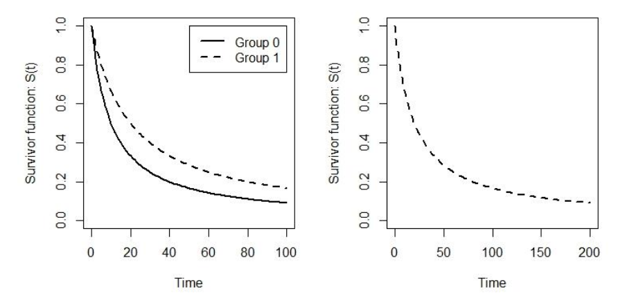

# (PART) 生存分析 Survival Analysis {-}


# 生存分析入門 {#surv-intro}

> The best thing about being a statistician is that you get to play in everyone's backyard.
> ~ John Tukey

```{block2, note-thankRuthAurelien, type='rmdnote'}
The Survival Analysis lectures were orgainised and taught by Professor [Ruth Keogh](https://www.lshtm.ac.uk/aboutus/people/keogh.ruth), and Professor [Aurélien Belot](https://aurelienbelot.netlify.com).
```


## 什麼是生存分析

```{r surv-Session01, child = ('11-Survival/Session01.Rmd')}
```


## Practical Survival 01

```{r surv-Practical01, child = ('11-Survival/Practical01.Rmd')}
```


# 生存數據中的回歸模型 {#surv-reg}

```{r surv-Session02, child = ('11-Survival/Session02.Rmd')}
```


## Practical Survival 03

```{r surv-Practical02, child = ('11-Survival/Practical02.Rmd')}

```


# Cox 比例風險模型  {#cox}

$$
h(t|x) = h_0(t)e^{\beta^Tx}
$$

其中，$h_0(t)$ 是被比較的基線組成員(baseline individual)的風險度 (hazard)，在 Weibull 模型或者指數模型中，這個基線風險 (baseline hazard) 是需要被模型根據數據來進行參數估計的 (parameterized)。但是，1972年，神一樣的人物 Cox [@Cox1972b] 提出，其實我們不需要對這個基線風險進行"無謂"的估計，可以無視它在模型中的存在。正因為如此，這個模型被冠以發明者的名字 Cox proportional hazards model。因為此模型不對基線風險進行任何估計，但是對預測變量對於風險的效果 (effect of the explanatory variable) 用模型中的 $\beta$ 進行參數估計，所以，它又是一種典型的半參數化模型 (semi-parametric model)。

Cox 比例風險模型下的似然：

$$
L= \prod_{i=1}^n\{ h_0(t)e^{\beta^Tx_i}\exp(-\int_0^{t_i} h_0(u)e^{\beta^Tx_i}du) \}^{\delta_i}\{ \exp(-\int_0^{t_i} h_0(u)e^{\beta^Tx_i}du) \}^{1-\delta_i}
$$

是無法估計的，此時要用到偏似然 (partial likelihood)，

思考這樣一個問題，在一組用 $R_j$ 標記的患者集合中，當我們已知它們同時都存活到了時間點 $t_j$，且沒有發生刪失，那麼這組患者中的某個 $i_j$，他/她有一個解釋變量 $x_i$，他在這個時間點恰好發生事件的條件概率該怎麼計算：

$$
\frac{h_0(t_j)\exp(\beta^Tx_{i_j})}{\sum_{k\in R_j}h_0(t_j)\exp(\beta^Tx_k)} = \frac{\exp(\beta^Tx_{i_j})}{\sum_{k\in R_j}\exp(\beta^Tx_k)}
$$

是的，你沒有看錯，基線風險被完美的消除掉了，這就是它不需要被參數估計的原因。此時，我們用偏似然來計算這樣的模型似然：

$$
L_p = \prod_j \frac{\exp(\beta^Tx_{i_j})}{\sum_{k\in R_j}\exp(\beta^Tx_k)}
$$


模型的假設：

$$
h(t|x) = h_0(t)e^{\beta^Tx}
$$

1. Proportional hazards assumption - explanatory variables act **multiplicatively** on the hazard and their effect on the hazard does not change over time;
2. We have correctly specified the form for how continuous explanatory variables act on the hazard;
3. We have included all relevant explanatory variables including possbile interactions;
4. Uninformative censoring;
5. Individuals are independent.

## 該用半參數模型還是用全參數模型

- 如果說指數模型或者 Weibull 模型是合理的，通常此時用 Cox 半參數模型也是合理的；
- 如果指數模型或者 Weibull 模型都是合理的，那麼 Cox 半參數模型給出的估計，其實不會和指數模型或者 Weibull 模型相差甚遠。指數模型或者 Weibull 模型可能給出的估計會相對更精確 (更小的標準誤)，但是實際應用中這種更加精確的程度其實十分有限；
- 另外，使用指數模型或者 Weibull 模型，重要的基線風險是否被模型擬合正確將會是關鍵 (baseline hazard mis-specified?)，但是使用 Cox 模型，就可以避免這個假設，忽略掉基線風險；
- 2002 年，[@Royston2002] 提出第三種生存數據模型，"flexible parametric survival models"，結合了參數和半參數模型的長處，正在變得流行起來。在這個新型靈活參數生存模型中，使用了三次方程平滑曲線 (cubic splines modelled smoothly) 擬合對數基線累積風險 (log cumulative baseline hazard)。


# 分析策略和模型檢查 Model checking-survival analysis {#surv-check}

## 生存分析策略

## 針對臨床實驗

## 針對觀察性研究

## 模型檢查的要點

1. 總體模型對數據的擬合情況是否合理？
2. 是否有極端數據，影響了模型的擬合結果？
3. 解釋變量，特別是連續型變量是否以正確的形式進入了模型？

## 比例風險假設的檢查 check the proportional hazard assumtion


主要有三板斧：

1. 用非參數法繪製簡單的生存曲線圖；
2. 用統計檢驗，判斷一個解釋變量對風險的影響是否和時間產生了交互作用；
3. 殘差繪圖法。

非參數法繪製生存曲線圖詳見第 \@ref(nonparametric) 章節部分。

### 比例風險檢查的統計檢驗法

在滿足比例風險前提下，某個解釋變量估計的風險比 (hazard ratio) 不會隨著時間變化而變化，根據這個特點，我們可以認為，如果某些解釋變量在追踪開始時對風險影響很強，在之後的追踪中，和風險之間的關係變弱的話，(或者反過來)，那麼風險比的這一變化就違背了比例風險這一前提。最簡單的，我們可以在模型中加入該變量和時間的相乘項 (交互作用項)：

$$
h(t|x) = h_0(t)\exp\{ \beta x + \gamma (x\times t)\}
$$

聰明的你一下子就明白了，接下來只要檢驗 $H_0: \gamma = 0$:

$$
\frac{\hat\gamma}{SE(\hat\gamma)} \sim N(0,1)
$$


### 用 Schoenfeld 殘差繪圖

另外一種視覺化檢查比例風險假設的方法是使用 **Schoenfeld 殘差**：

The residual compares the observed values of the explanatory variable for the case at a given envent time with the weighted average of the explanatory variable in the risk set. The residuals should not show any dependence on time -- this would indicate that the proportional hazards assumptions is not met.

It is actually more convenient to use the "scaled Schoenfeld residuals". **The Scaled Schoenfeld residuals have a mean which is the true log hazard ratio** under the proportional hazards assumption, and the average values of the scaled Schoenfeld residuals over time can be interpreted as the time-varying log-hazard ratio. A plot of the scaled Schoenfeld residuals over time is therefore directly informative about how the log hazard ratio changes overtime. It is useful to show a smoothed average curve on these plots.

## 評價模型擬合的其他有趣方法

### Martingale 殘差-assessing the functional form of continuous variables

Martingale (馬丁哥?) 殘差圖可以用來檢驗，比較連續型變量在模型中是否被正確擬合，因為有時候連續型變量需要增加該連續型變量的二次項或者多次項，也可能要用對數項之類的變形之後，才能完全把其與生存數據之間的關係完全解釋清楚。

A Martingale is a residual for an event process -- it is the difference between what happened to a person (whether they had the event or not) and what is predicted to happen to a person under the model that has been fitted. The Martingale residual for individual i is:


$$
r_{M_i} = \delta_i - \hat H_0(t_i)\exp(\hat\beta x_i)
$$

Where, $\delta_i$ is the indicator of whether the individual $i$ had the event (1) or was censored (0), $t_i$ is the event or censoring time, $x_i$ denotes the explanatory variable (or more generally a vector of explanatory variables), and $\hat H_0(t_i)$ is the estimated baseline cumulative hazard at time $t_i$. If the model is correct then the Martingale residuals should sum to 0.


### Deviance 偏差殘差 -- identifying individuals for whom the model does not provide a good fit

偏差殘差是馬丁哥殘差的轉換值，它的定義是:

$$
r_{D_i} = \text{sign}(r_{M_i})[-2\{r_{M_i} + \delta_i\log(\delta_i - r_{M_i})\}]^{\frac{1}{2}}
$$

偏差殘差通過上面的公式，把模型給出的馬丁哥殘差轉換成為一組理論上應該是平均分佈在零兩側的數據。如果某個個體的偏差殘差過大，偏離0太遠的話，提示該模型對該個體數據擬合不佳。具體來說，如果偏差殘差遠大於零，提示的是該個體遠在模型預測他/她/它會發生事件的時間之前就已經發生了事件；相反如果偏差殘差遠小於零，則提示該個體在模型預測發生事件的時間點之後很晚才真的發生事件。

把偏差殘差作 Y 軸，危險度評分 (risk score $=\beta^Tx$)，作 x 軸繪圖可以用於分析模型是否針對某些危險度高的人給出較高的偏差殘差，從而可以判斷模型是否合理。當判斷某些人可能偏差殘差過大，或者過小，之後要做的決定才是殘忍的，你要從數據中刪除這些個體？還是分析這些個體到底有哪些與眾不同的特質？或者是要重新對模型的各項解釋變量的形式進行修正？

**在進行生存分析的時候，請一定要一邊構建模型，一邊用這些殘差來綜合分析模型的合理性。**


# 競爭風險模型 competing risk {#competing-risk}

當我們在做風險模型研究的時候，除了重要的比例風險假設，另外一個 (經常被忘記的) 假設是我們認為**刪失值只是一堆無效信息 (non-informative censoring)**。這個假設通常來說都是合理的，但是如果某些刪失值是由於他們身上發生了別的事件，導致無法追踪或者無法再發生我們關心的事件。這樣的現象被叫做競爭風險 (competing risk)。最明顯的例子是我們關心某些疾病(心血管疾病，癌症)的發生，但是患者可能提前因為別的原因 (事故或者別的原因) 死亡而離開研究。這些離開研究的人，假如沒有死亡，繼續留在研究中，他們還是有可能會發生研究關心的事件的。那麼此時，我們說死亡事件，是一個疾病發生的競爭風險。

## Cause-specific hazard

如果，我們認為研究中存在 $k$ 種"事件(event/failure)"，我們可以定義這樣的因素別風險方程 (cause-specific hazard function):

$$
h_k(t) = \lim_{\delta t \rightarrow 0} \frac{1}{\delta t}\text{Pr}\{ t\leqslant T < t + \delta t, D = k | T\geqslant t  \}
$$

這可以被定義為在時間點 $t$，該對象發生事件 $k$ 的瞬間風險。(This can be interpreted as the instantaneous risk of dying from cause $k$ given the individual is alive at time $t$. i.e. they have not died of any cause before time $t$)

(Cumulative cause-specific hazard)累積因素別風險方程則可以被定義為：

$$
H_k(t) = \int_0^t h_k(s)ds
$$

相應地，生存方程：

$$
S_k(t) = \exp(-H_k(t))
$$

Overall hazard is the sum of all cause-specific hazards:

$$
\begin{aligned}
h(t) & = \sum_{e=1}^K \lim_{\delta t\rightarrow 0} \frac{1}{\delta t}\text{Pr}\{ t\leqslant T < t + \delta t, D = e | T\geqslant t  \} \\
     & = \lim_{\delta t \rightarrow 0} \frac{1}{\delta t}\text{Pr}\{ t\leqslant T < t + \delta t | T \geqslant t  \}
\end{aligned}
$$


It follows that the overall survival can be written as useful application of this cause-specific survivor function:

$$
S(t) = \exp[-\sum_{e=1}^KH_e(t)] = \prod_{e = 1}^K \exp(-H_e(t))
$$

### Cause-specific hazards models

$$
h_k(t|x) = h_{k, 0} (t)e^{\beta_k x}
$$

- People are censored at the time of any event that is not the event of interest
- We fit a separate Cox model for each event type
- $\beta_k$ represents the impact of $x$ on the hazard for event type k,** among those at risk of event type k**

## Cumulative incidence function

Other names: absolute cause-specific risk/Crude Probabilty of event

$$
I_k(t) = \int_0^t h_k(s)S(s)ds
$$

## Subdistribution hazard - Fine and Gray model

The approach uses an alternative definition of the hazard, called the subdistribution hazard, which represents the instantaneous risk of dying from cause k given that an individual has not already died from cause k, that is:

$$
h^s_k(t) = \lim_{\delta t \rightarrow 0} \frac{1}{\delta t} \{ \text{Pr}(t \leqslant T < t + \delta t, K = k | T > t \text{ or } (T \leqslant t, K \neq k)) \}
$$

This differs from the cause-specific hazard in its risk set; here individuals are not removed from the risk set if they die from another competing cause of death than cause k.

### Subdistribution hazard model

$$
h_k^s(t) = -\frac{d}{dt} \log(1 - I_k(t))
$$


$$
h_k^s(t|x)  = h_{0,k}(t)e^{\beta^T_k x}
$$

The relationsship between the CIFs in the two treatment groups is given by:

$$
1 - I_k(t|1) = [1 - I_k(t|0)]^{\exp(\beta_kx)}
$$

## Multi-state models

### The Markov model

A common assumption for multi-state mode is that upon entering a particular state i, individuals are subject to common trasition rate for movement to state j, irrespective of their history. In other words, we assume that the transition rate does not differ according to the previous states an individual has been in. This is called the Markov assumption, and is often quite a strong assumption to make.


### Cox proportional hazards model for transition intensities

The transition intensities for transition i to j is given by:

$$
h_{ij} (t | x) = h_{ij,0} (t)\exp(\beta_{ij}^Tx)　
$$

# 生存分析的其他手段 {#other-surv}


## 分層Cox生存分析 stratified Cox proportional hazards model

Under the Cox proportional hazards model, the effect of each explanatory variable on the hazard is assumed to be such that the ratio of hazards is constant accross the time scale (the proportional hazards assumption). In applications with several explanatory variabls, the effect of some of these variables may not be proportional. When the aim of the analysis is not focussed on these particular variables, for example if they are just being used as adjustment variables and are not the main exposures of interest, then the proportionality assumption can be relaxed just for those variables by fitting a stratified Cox proportional hazards model.

In the stratified Cox proportional hazards model, instead of assuming that the proportional hazards model holds overall, we assume that the proportional hazards assumption holds within groups (or strata) of individuals.


$$
h(t|x,s) = h_{0s} (t)e^{\beta^T x}
$$


Each stratum, s, has a separate baseline hazard $h_{0s}(t)$. However, the other explanatory variables x are assumed to act in the same way on the baseline hazard in each stratum, i.e. the $\beta$ are the same accross strata.

## 加速失效(死亡)模型 Accelerated failure time (AFT) model

加速失效模型，AFT 模型的特點是不管所謂的風險概念，而是對每個患者真正的生存時間進行模型化處理，其實個人更加喜歡這個模型，因為它很直觀地告訴你某類人的生存時間就是比另一類人短，而不是告訴你一個抽象的一組的風險低於或者高於另一組，因為很多人無法理解什麼是風險 (hazard)，正如很多人無法理解什麼是比值 (odds) 一樣。同樣還因為風險比例模型還要考慮是否對基線風險進行參數估計的取捨問題。

所以，我們先來回憶一下風險比例模型的定義。當解釋變量 (explanatory variable) 是一個二分類型變量，例如治療組和對照組。我們用 $h_0(t)$ 表示在時間點 $t$ 時，對照組 (control or baseline group) 的風險度方程 (hazard function)。那麼當比例風險成立時 (proportional hazard)，治療組的風險度方程和對照組的風險度方程成比例，如下面的式子所示：

$$
h_1(t) = \psi_{PH}h_0(t)
$$

在比例風險模型中，我們需要進行估計的(to be estimated)，就是上面式子中的比例係數 $\psi_{PH}$。另外，基線風險度，baseline hazard $h_0(t)$，也是可參數化的 (can be parameterized)。例如我們認爲生存數據服從指數分佈 (exponential distribution, see Chapter \@ref(exponentialdist)) 時，對照組的風險度被認爲不隨着時間而變化，是恆定的 ($h_0(t) = \lambda$)。如果我們認爲對照組風險度其實是會隨着時間而單調遞增或者單調遞減時，那麼它服從 Weibull 分佈 (see Chapter \@ref(weibulldist)) 基線的風險度就是 $h_0(t) = \kappa \lambda t^{\kappa -1}$。在一般常用的 Cox 比例風險模型中，這個基風險度被忽略而不進行參數化。

其實有時候我們可以簡單一點地思考這個生存數據，讓我們換一個角度看待我們的研究問題到底問的是什麼。發自我們內心的，其實，如果你也承認，我們會更加關心的是治療組，相比對照組的患者，**生存時間 (survival time)**上有沒有差異，而不是抽象的（難以理解的）風險度 (hazard) 的差異。


所以，我們這一章節想要討論的加速失效（死亡）模型，簡稱 AFT 模型就是用於比較組與組之間生存時間 $(T)$ 差異的模型。假設 $T_0$ 是對照組（基線組 baseline group）的生存時間，那麼 $T_1$ 表示治療組的生存時間，假如治療本身對生存時間的影響可以使用乘法的方式來表達，那麼治療組和對照組之間生存時間的關係可以描述成：

$$
T_1 = \psi_{AFT}T_0
$$

在 AFT 模型中，$\psi_{AFT}$ 就是加速指數，它的直接涵義就是，治療組患者的死亡時間被“加速”或者“減緩”了。也就是它可以回答，治療組的患者是不是更快的痊癒？或者更快的死亡？這樣明了的問題。假設我們估計說，$\psi_{AFT} = 2$，這就可以被解釋成是，治療組患者的生存時間，是對照組患者生存時間的兩倍，也就是說，治療使得患者發生死亡的時間被推遲了。


```{r figaft2, echo=FALSE, fig.asp=.7, fig.width=7, fig.cap='The survival curve in the treatment and control groups when accelerated factor = 2 (left); and the survivor curve for the treatment group again (right), but with the scale of the time axis changed.', fig.align='center', out.width='80%'}

```


### 詳細推導

繼續一邊和比例風險模型對比一邊推導加速失效模型。在比例風險模型中 $h_1(t) = \psi_{PH}h_0(t)$，我們常常用 $e^{\beta_{PH}}$ 取代 $\psi_{PH}$。這樣一來，就可以避免估計風險比例係數時只能是正數這樣的取值範圍限制，也就是指數函數中的 $\beta_{PH}$ 現在就又可以取所有實數啦，可正，可負。所以我們也可以用類似的思維對加速失效模型的加速度參數進行參數化分析，通常情況下，這個加速度指數用 $e^{-\beta_{AFT}}$ 進行參數化分析，稍後的解釋可以讓我們更加理解這裏爲什麼被加上了一個減號：

$$
T_1 = T_0 e^{-\beta_{AFT}}
$$

在AFT模型中，用生存方程會更加直觀。對照組（基線組）的生存方程用 $S_0(t)$ 表示的話，那麼治療組的生存方程 $S_1(t)$ 可以表示爲：

$$
\begin{aligned}
S_1(t) & = \text{Pr}(T_1 > t) \\
       & = \text{Pr}(e^{-\beta_{AFT}}T_0 > t) \\
       & = \text{Pr}(T_0 > te^{\beta_{AFT}}) \\
       & = S_0(e^{\beta_{AFT}}t)
\end{aligned}
$$

也就是說，治療組的生存方程和對照組是相同的，只是時間 $t$ 被替換成了 $e^{\beta_{AFT}}t$。這樣一來，治療組，對照組患者的生存方程的分佈形狀 (shape of survival distribution)，其實是相同的，但是兩組之間的時間軸在前進的速度上有差異（更快了，或者更慢了）。也就是說，治療組相比較對照組，在走到同一個終點（死亡）之前的時間過程中，被按了快進鍵（或者減速鍵）。所以如果 $e^{\beta_{AFT}} > 1$，那麼治療組的患者發生（死亡）事件之前的時間較短，所以治療加速了死亡進程。如果 $e^{\beta_{AFT}} < 1$，那麼治療組患者發生（死亡）事件之前的時間較長，所以治療延長了死亡進程。所以你會看見，這個 $e^{\beta_{AFT}}$ 沒有類似風險度比 (hazard ratio) 那樣的意義，它是一個加速度指數。**人最終都是會走向死亡的，只是時間長短的問題。**

### 再詳細推導

目前爲止，我們只討論了當解釋變量是一個而分類變量時的情況。更加一般性地，當我們有一串觀察變量組成的向量 (a vector of explanatory variables) $\mathbf{x}$，在AFT模型下它的生存方程可以描述成：

$$
S(t;\mathbf{x}) = S_0(te^{\beta_{AFT}^T\mathbf{x}})
$$

上述模型中，$S_0$ 是基線組個體的生存方程，其中 $\beta_{AFT}$ 則變成了各解釋變量的回歸係數構成的向量 (a vector of parameters)。

那麼，很容易地，我們可以寫下一般情況下，AFT模型中的風險度方程 (hazard function, $h(t;\mathbf{x})$)，和生存概率密度方程 (probability density function, $f(t;\mathbf{x})$)：

$$
\begin{aligned}
h(t;\mathbf{x}) & = h_0(te^{\beta_{AFT}^T\mathbf{x}})e^{\beta_{AFT}^T\mathbf{x}} \\
f(t;\mathbf{x}) & = f_0(te^{\beta_{AFT}^T\mathbf{x}})e^{\beta_{AFT}^T\mathbf{x}}
\end{aligned}
$$

### 風險比例模型(PH)和加速失效（死亡）模型(AFT)的比較

詳細比較兩種模型下，風險度方程和生存方程表達的不同。這裏我們繼續用簡單的二分類變量（治療組，對照組）來簡化數學模型：

| 模型  | 風險度方程 (hazard function)             | 生存方程 (survivor function)  |
|-------|------------------------------------------|-------------------------------|
| PH    | 對照組: $h_0(t)$                         | 對照組: $S_0(t) = \exp\{-\int_0^th_0(u) du\}$ |
|       | 治療組: $h_1(t) = e^{\beta_{PH}}h_0(t)$  | 治療組: $S_1(t) = S_0(t)^{\exp(\beta_{PH})} = \exp\{ -e^{\beta_{PH}}\int_0^th_0(u) du \}$  |
| AFT   | 對照組: $h_0(t)$                         | 對照組: $S_0(t) = \exp\{-\int_0^th_0(u) du\}$ |
|       | 治療組: $h_1(t) = e^{\beta_{AFT}} h_0( e^{\beta_{AFT}} t)$| 治療組: $S_1(t) = S_0(e^{\beta_{AFT}}t) = \exp\{-e^{\beta_{AFT}}\int_0^th_0(e^{\beta_{AFT}}u)du\}$  |


### Weibull 模型也是一種 AFT 模型

上述的討論，是對AFT模型的一般化的討論。但是和風險比例模型相似的，AFT模型其實也是一大類的生存分析模型 (a family of models)。這裏我們討論一下 Weibull 模型的另一種表達方式。

Weibull 模型下，對照組的生存方程 (survival function, $S_0(t)$) 被描述爲：

$$
S_0(t) = \exp\{-\lambda t^{\kappa}\}
$$

那麼，治療組的生存方程 ($S_1(t)$) 可以被描述爲：

$$
S(t;\mathbf{x}) = \exp\{-\lambda(te^{\beta_{AFT}^T\mathbf{x}})^\kappa\}= \exp\{-\lambda e^{\kappa \beta_{AFT}^T\mathbf{x}} t^\kappa\}
$$

你如果仔細觀察，認真思考，就不難發現，其實這個治療組的生存方程，也是服從Weibull分佈的方程，只是和對照組生存方程相比，$\lambda$ 被替換成了 $\lambda e^{\kappa \beta_{AFT}^T\mathbf{x}}$。也就是說，不論是對照組還是治療組，患者的生存時間都服從Weibull分佈，差別只在於某些解釋變量 (explanatory variables) 改變了 Weibull 分佈的某些參數。所以我們說，Weibull分佈，也是一種特殊形態的AFT模型。

但是，我們之前探討 Weibull 模型時，只討論了它在風險比例前提下的形式：

$$
S(t;\mathbf{x}) = \exp\{-\lambda e^{\beta^T_{PH}\mathbf{x}} t^\kappa \}
$$

一個 Weibull 模型在 AFT 模型下的生存方程是：

$$
S(t;\mathbf{x}) = \exp \{ -\lambda e^{\kappa \beta^T_{AFT}\mathbf{x}} t^\kappa \}
$$

所以當你用 Weibull 模型時，其實可以自由在兩種類型 (PH or AFT) 之間自由切換：

$$
\exp(\beta^T_{PH}) = \exp(\kappa\beta^T_{AFT})
$$

Weibull 模型和其特殊形態--指數模型，為唯二的兩個，可以在 PH 模型和 AFT 模型之間自由切換的模型。

# 時間依存變量 Time-dependent variables 和脆弱模型 frailty model {#time-dep}

## 時間依存變量指的是什麼

生存分析的模型中，我們常常會使用一些實際上會經過時間變化而變化的預測變量。這些變量被稱爲時間依存型變量*(time-dependent variables)*。有些教科書會把這種類型的變量命名爲自更新變量(time-updated)或者時變變量(time-varying)。實際的例子有：

- 某觀察型研究使用患者病例數據庫分析患有囊性肺纖維化(cystic fibrosis)的病人的生存情況。在病人數據庫隨訪收集數據的過程中，有些患者接受了肺部臟器的移植，有些患者沒有。那麼有沒有肺部臟器移植手術就是影響患者死亡率，或者說生存概率的重要指標之一。那麼這樣的模型中，是否接受過移植手術這一變量就是一個時間依存型變量。它的特徵除了是一個二分類變量以外，患者只能從 0（未接受移植）變成 1（接受過移植），而不能反過來。

- 某觀察型隊列研究的課題是分析研究對象的血壓水平和心臟疾病之間的關係。在隊列研究的隨訪中，研究對象的血壓可能在每次隨訪時都有相應的測量數據。在這樣的實驗情形下，每次隨訪獲得的血壓數據就是一個時間依存型的連續變量。

時間依存型變量除了有二分類的，連續型的等等不同之外，它還有另外一個更加重要的性質需要考慮並且加以區分。這就是看我們想要討論的時間依存型變量的時間依存性質的來源，是內在性的(internal)還是外源性(external)的。

內在性的時間依存變量是指這個變量的隨時間的變化的特性是只能在觀察對象未發生我們所關心的事件（比如死亡事件）之前測量獲取的。而且這種內在性還體現在如果不與實驗對象取得聯繫的話，更新之後的數據研究者是無法得到的。比方說需要從仍然存活的患者身上提取血液樣本測量一些生物指標，比如是否接受過臟器移植，或者是最近的血壓值是多少等等。

外源性的時間依存變量是指這樣的變量雖然隨着時間變化，但是不需要通過聯繫患者或者實驗對象也能夠獲取想要的數據。年齡是最典型的一個例子，你只要知道患者在起始時的年齡，也就知道了在隨訪過程中患者的年齡。另外的常見外源性時間依存變量的例子還有如一些臨牀試驗中隨着患者病程的變化而按照事先準備或者計劃好的劑量調整治療方案。再比如研究空氣污染水平和患者哮喘之間關係的空氣污染水平數據，可以通過外來的如氣象局提供的歷史數據來查詢獲得。

這兩種類型的時間依存變量在進行數據分析的時候，常常不需要加以刻意的區分，但是在結果的解讀和解釋的時候就需要考慮這兩種不同類型的時間依存性質給分析結果帶來的影響。

在正式進入時間依存變量的數學模型之前，我們需要引入時間依存變量的數學標記方法。一般地，$x$被用於表示預測變量，它可以是一個單一的變量，也可以是一個由許多預測變量組成的向量。在處理時間依存型變量的時候，我們通常使用 $x(t)$ 來表示。其含義就是在時間點 $t$ 時預測變量的值。如果 $x(t)$ 是一個向量，它可以同時表示時間依存型變量和其他的不隨時間變化而變化的變量。如果用 $x(t)$ 表示一個非時間依存型變量的話，它就表示無論時間 $t$ 是多少，$x$ 值的大小都始終保持不變。


## Extended Cox model 把Cox模型擴展開去

Cox比例風險模型是很容易被擴展，用來加入時間依存型預測變量。當Cox比例風險模型中加入了時間依存型變量，它的數學模型被寫作：

$$
h(t|x(t)) = h_0(t) e^{\beta^Tx(t)}
$$

這一數學模型其實是在說我們對該預測變量感興趣的是在時間點 $t$ 時的測量值是否和發生相關事件的風險(hazard)有關係。也就是在這個模型裏，時間依存變量的最新值，是我們關心的最主要預測變量。這裏的基線風險(baseline hazard, $h_0(t)$)應該被解釋爲是一個所有的預測變量從起始直至所有追蹤結束時均爲零的觀察對象。[This formulation is assumed that we are interested in the explanatory variable at the time of the event of interest. In other words, it means that only the current value of the covariates (i.e. at time t) affects the hazard. Here, the baseline hazard function is interpreted as the hazard function for an individual for whom all the variables are zero (from the time origin and during all the follow-up).]

那麼這個模型的對數風險度比(log hazard ratios)又該怎麼理解呢？爲了便於解釋，先考慮只有一個時間依存型變量的模型 $x_1(t)$。那麼對象編號爲 $r$ 和對象編號爲 $s$ 的兩人，他們之間的風險度比 (hazard ratio)：

$$
\begin{aligned}
\frac{h(t|x_{1r}(t))}{h(t|x_{1s}(t))} & = \frac{h_0e^{\beta_1x_{1r}(t)}}{h_0e^{\beta_1x_{1s}(t)}} \\
& = \exp(\beta_1(x_{1r}(t) - x_{1s}(t)))
\end{aligned}
$$

所以，簡單地解釋就是，$\beta_1$ 比較的是$r,s$兩個觀察對象的預測變量 $x_1$ 在任意一個時間點時相差一個單位時的風險度。值得指出的是，這裏回歸係數的解釋暗示了 **時間依存變量$x_1$在任意一個時間點時，改變一個單位的風險度比是固定不變的。**但是，由於 $x_{1r}(t) - x_{1s}(t)$ 是會隨時間 $t$ 變化的（也就是風險度比不再是成固定比例的，而是允許它隨時間變化而發生改變）。這個Cox風險模型就不能再被叫做**“比例”**風險模型，它被叫做**Cox擴展模型(extended Cox Model)**。

### 練習題 exercise 8.1 

假設我們使用下面這樣的Cox擴展模型來研究關於肺部臟器移植與否的時間依存變量和死亡之間的關係：

$$
h(t|x) = h_0(t)\text{exp}(\beta x(t))
$$

如果患者$r$在時間點5時進行了肺部的臟器移植，患者$s$則整個隨訪中都沒有接受臟器移植。請試着計算下列時間點時兩名患者之間的死亡風險度比：

(1) 時間點4；
(2) 時間點6。


（我們假設兩名患者在這兩個時間點時都依然還是存活着的）

### 解答

(1) 在時間點4時，兩名患者都沒有接受臟器移植，此時，他們的死亡風險度都是基線風險：$h(t|x) = h_0(t)$，故在時間點4時，他們的死亡風險度比是 1。
(2) 在時間點6時，患者$r$的風險度是：$h(t|x) = h_0(t)\text{exp}(\beta)$。患者 $s$ 的風險度是：$h(t|x) = h_0(t)$。所以，在時間點6時，患者$r,s$之間的死亡風險度比就是 $\text{exp}(\beta)$。

-------------

在Cox擴展模型下，加入了時間依存變量之後，模型所使用的偏似然(partial likelihood)是：

$$
L_p = \prod_j\frac{\text{exp}\beta^Tx_{i_j}(t_j)}{\sum_{k\in R_j}\text{exp}\beta^Tx_k(t_j)}
$$

在這個偏似然中，我們實際比較了在時間點 $t_j$ 時，實際觀察到的有發生事件的對象的預測變量 $x_{i_j}(t_j)$ 的風險度，和在時間點 $t_j$ 時仍然存在在觀察數據集合(the risk set at time $t_j$)中的個體(假設人數爲 $R_j$)的預測變量 $x_k(t_j)$的風險度。這裏需要特別指出的是，當使用這個偏似然作爲估計的工具時，我們需要知道所有觀察對象，當他/她/它仍然處在觀察數據集合中的時候，每當有新的事件發生被觀察到，那每個新時間發生的時間點，模型中所有預測變量的最新值（包括時間依存變量本身）。這個假設對於二分類（是否接受移植臟器）時間依存變量來說不難，但是當時間依存變量是連續型變量的時候，要知道每一次事件發生時所有存在在觀察數據集合中每一名觀察對象的觀察值（例如血壓），是無法辦到的。這是因爲血壓值其實是時時刻刻都處在變化中的，但是我們實際對患者隨訪測量血壓時，都只能獲得患者在某個時間點上的血壓值。因此，這個Cox擴展模型中如果存在連續性的時間依存變量，那麼模型的另一個隱含的前提條件是，假設患者或者實驗對象的連續性時間依存變量在前後兩次測量值獲得的間隔期內是保持不變的（assuming that it stays constant from the last time it has been observed）。


## 時間依存變量數據的結構

假設有一個隨時間變化而變化的二分類型解釋變量 $x(t)$，假設有三名從時間點 0 開始參與其中的實驗對象：

- 實驗對象1，她/他的 $x(t)$ 隨着時間沒有發生變化，在整個隨訪過程中都是 $x(t) = 0$的狀態，在時間點10時該患者失去聯繫（刪失值，censor）。
- 實驗對象2，她/他的 $x(t)$ 在隨訪時間 5 之前均爲 $x(t) = 0$，在該時間點之後 $x(t) = 1$，在時間點20時該患者失去聯繫（刪失值，censor）。
- 實驗對象3，她/他的 $x(t)$ 在隨訪時間 15 之前均爲 $x(t) = 0$，在該時間點之後 $x(t) = 1$，在時間點25時該患者死亡 (event = 1)。

用表格來說明這三人在追蹤隨訪過程中的狀態如下：

其中的實驗對象：

- 實驗對象1，她/他的 $x(t)$ 隨着時間沒有發生變化，在整個隨訪過程中都是 $x(t) = 0$的狀態，在時間點10時該患者失去聯繫（刪失值，censor）。
- 實驗對象2，她/他的 $x(t)$ 在隨訪時間 5 之前均爲 $x(t) = 0$，在該時間點之後 $x(t) = 1$，在時間點20時該患者失去聯繫（刪失值，censor）。
- 實驗對象3，她/他的 $x(t)$ 在隨訪時間 15 之前均爲 $x(t) = 0$，在該時間點之後 $x(t) = 1$，在時間點25時該患者死亡 (event = 1)。

用表格來說明這三人在追蹤隨訪過程中的狀態如下：

其中的實驗對象：

- 實驗對象1，她/他的 $x(t)$ 隨着時間沒有發生變化，在整個隨訪過程中都是 $x(t) = 0$的狀態，在時間點10時該患者失去聯繫（刪失值，censor）。
- 實驗對象2，她/他的 $x(t)$ 在隨訪時間 5 之前均爲 $x(t) = 0$，在該時間點之後 $x(t) = 1$，在時間點20時該患者失去聯繫（刪失值，censor）。
- 實驗對象3，她/他的 $x(t)$ 在隨訪時間 15 之前均爲 $x(t) = 0$，在該時間點之後 $x(t) = 1$，在時間點25時該患者死亡 (event = 1)。

用表格來說明這三人在追蹤隨訪過程中的狀態如下：

```{r 08-surv8-1,  echo=FALSE, cache=TRUE}
dt <- read.csv("backupfiles/table8_1.csv", header = T)
kable(dt, "html", align = "c",caption = "Example data for individuals with time-dependent explanatory variable x(t). Each individual has a line of data for each time period over which the explanatory variables takes a different value. The status refers to whether the individual has the event (1) or not (0) at the end of the interval.") %>%
  kable_styling(bootstrap_options = c("striped", "bordered")) %>%
    scroll_box(width = "700px", height = "500px", extra_css="margin-left: auto; margin-right: auto;")
```

表格 \@ref(tab:08-surv8-1) 中時間區間其實是左開右閉的。所以2號實驗對象在時間段 $(0, 5]$ 的 $x(t) = 0$，但是在時間段 $(5, 20]$ 時 $x(t) = 1$。


實際研究數據的例子：

```{r  08-surv8-2,  engine='stata', cache=TRUE, echo=FALSE}
use "backupfiles/stanford.dta"
list in 1/10
```

其中

- `datein` 是該名患者加入實驗的日期；
- `datetr` 是該名患者接受心臟移植手術的日期（如果沒有接受手術則爲缺失值）；
- `dateout` 是患者離開實驗追蹤的日期（因爲死亡或者刪失）；
- `dead` 是實驗追蹤截止時患者的生存狀態（死亡１，刪失0）。

爲了讓這個數據能夠進行 Cox 比例風險模型的擬合，在 Stata 中需要使用到 `stsplot` 命令，當患者在隨訪中曾經接受過心臟移植手術，那麼他/她的數據將被分成兩行，前一行是移植手術前，後一行則是移植手術後的數據。患者如果沒有接受心臟移植手術，她/他的數據就只有一行。


```{r  08-surv8-3,  engine='stata', cache=TRUE, echo=FALSE}
use "backupfiles/stanford.dta"
replace datetr = mdy(01, 01, 2001) if datetr == .

stset dateout, id(id) origin(datein) scale(365.25) f(dead)

stsplit post = datetr, at(0)

replace post = post+1

list in 1/20

stcox post
```


請問，經過Stata調整過後的數據中，`_t0, t, post, _d` 分別是什麼意義的數字？

- `_t0` 是追蹤的時間起點，對於有接受心臟移植的患者來說，第二行的 `_t0` 是接受完移植手術後的時間起點；
- `t` 是生存時間，或者刪失值發生之前的時間；
- `_d` 是事件指示變量(event indicator)，對於有接受心臟移植的患者來說，她/他有兩行數據，第一行是手術前，第二行是手術後。當患者死亡(event = 1)，那麼那一行的 `_d = 1`，之前的每一行都是`0`。每名患者最多只有一行發生死亡事件；
- `post` 則是指示該行患者數據是處於心臟移植手術之前(`post = 0`)，還是之後(`post = 1`)。例如，第7名患者進入實驗的起點時間是1968年7月12日，她/他在1968年8月31日 (即0.13698245年之後)這天接受了心臟移植手術。所以在這兩個時間點之內是該患者的第一行數據，被記錄爲手術前 (`post = 0`)，這之後該患者又被持續追蹤到1970年5月17日，在這段時間內的數據是患者的第二行數據，被記錄爲手術後 (`post = 1`)；
- `stcox post` 的結果 `Haz. Ratio = 0.96, 95%CI: 0.528, 1.728`的涵義是，接受心臟手術之後，患者的死亡風險相比不接受心臟移植手術平均要低 4%，但是這個風險比 (HR)的 95%信賴區間是 (0.53, 1.73)，包含了零假設時的 1，所以數據分析的結果是心臟手術降低的死亡風險不能達到顯著性效果，沒有統計學意義。


### 值得注意的點

- 如果說我們感興趣的時間依存變量是外源性的 (external time-dependent variable)，那麼經典的條件風險 (conditional hazard) 和條件生存概率 (conditional survival)的關係仍然是有意義的：

$$
S(t | x(u), u\leqslant t) = \text{exp}(-\int_0^t h_0(u)\text{exp}(\beta^Tx(u))du)
$$

- 如果說時間依存變量本身是內源性的（internal time-dependent variable），那麼上面這個經典的條件風險和條件生存概率之間的關係就是沒有意義的了。因爲內源性的變量必須在患者生存的時候才能測量得到，如果你測量到了患者的時間依存變量就意味着該患者的生存概率是1。

- 另一個需要注意的點是在包括了時間依存變量的Cox比例風險模型中，當你加入了在暴露和結果的因果關係通路上的變量作爲共變量時，模型會變得不可解釋。舉例來說，如果治療心肌梗死的藥物是通過降低血壓來達到降低心肌梗死發生的概率的話，假設模型中調整的是跟隨時間發生變化的血壓作爲共變量，那麼這個模型中上升或者下降的血壓就會把治療效果給抵消掉(cancel out the treatment effect)。在這樣的場景設定中，血壓的變化本身是作爲主要暴露因素（治療與否）和主要結果因素（心肌梗死的發生概率）之間的媒介 (mediator)。

## Frailty Models (脆弱模型?)

脆弱模型是時間事件數據的隨機效應模型。

Frailty models are random effects models for time-to-event data.

### Individual frailty model

$$
h_i(t|x_i) = \alpha_ih(t|x_i) = \alpha_i h_0(t)\exp(\beta^Tx_i)
$$

### Application to a Weibull model

$$
h(t|x_i,\alpha_i) = \alpha_i \kappa \lambda t^{\kappa - 1}e^{\beta^Tx}
$$

### Shared frailty model

$$
h(t|x_{ij}, \alpha_i) = \alpha_j h_0(t)e^{\beta^Tx_{ij}}
$$

# 時間事件數據的高級分析法 {#surv-advance}


# 貝葉斯生存分析 Bayesian Survival Analysis {#bayes-surv}


