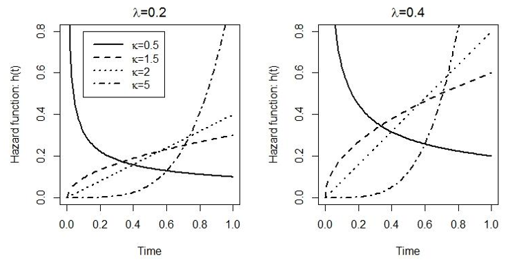

# (PART) 生存分析 survival analysis {-}

# 入門 

## 什麼是生存分析 

生存分析，研究的是隨訪中研究對象發生我們關心的事件與否，以及比較發生該事件之前時間的長短 (生存時間) 的一種分析方法。生存數據的常見例子如下: 

- 死亡 (all cause); 
- 診斷/治療後直至死亡發生的時間; 
- 孕婦的懷孕時間 (孕期長短);
- 對象以健康狀態進入研究時開始，直至其診斷爲患有某種疾病的時間。

生存分析中的常見術語: 

- 生存時間 survival time = 失敗時間 failure time = 事件時間 event time。
- 生存分析本身常被叫做事件史分析 time-to-event analysis。


生存分析的結果，可以用來回答很多我們關心的問題:

1. 研究特定人羣中，在某段時間內人口生存 (或死亡) 的模式 (平均壽命): 在英國，某年 (例如 1970 年) 出生的人，能夠生存到 5 歲，40 歲，100 歲的概率是多大？ (關心的是死亡在某人身上發生的概率)
2. 比較兩組或多組人羣之間，不同的特徵導致的死亡時間的差異大小的估計: 某種新療法對於同時被診斷爲相同程度肺癌的患者，和標準療法相比是否能有效延長其生存時間？
3. 研究多種變量 (例如體重，年齡，性別，吸煙，飲食等) 和事件發生時間長短之間的關系: 例如收集健康對象，研究其體質指數 (BMI) 和最終發生二型糖尿病幾率之間的關系，同時要調整其他已知的混雜因素。
4. 預測特定患者的存活幾率: 肝癌患者診斷後的 5 年生存率，10 年生存率的推算。


## 生存數據在哪裏

生存數據其實很常見，下面是幾個例子: 

1. 特定國家特定時間內對人口出生死亡的登記數據; 
2. 在隨機雙盲對照臨牀試驗中，治療組和安慰劑組相比，治療組的生存時間是否真的較長;
3. 前瞻性隊列研究;
4. 非醫學的例子也有很多，例如分析暴風雪降臨之前的時間，或者推測地震可能發生的幾率。


## 生存數據分析之前要理清楚的問題

1. 對於結果/事件的定義; 
2. 研究的時間起點; 
3. 研究的時間單位是用的月份，周，還是年，是觀察時間，還是患者的實際年齡 (實際年齡就是實際生存時間); 
4. 事件發生時的時間，是否被精確定義了？

## 生存數據的左右截尾

沒有哪個研究能保證觀察隨訪到所有的研究對象最終是否發生了事件 (死亡)，有些對象在研究中途就會退出實驗。所以這些沒有觀察到事件發生，但是在研究的過程中貢獻了生存時間數據的對象，被稱爲刪失數據 (censored)。刪失數據又根據其發生原因的不同被分爲下面幾種: 

1. **行政刪失 (administrative censoring)**: 如果最終事件，被定義爲死亡的話，研究者不大可能等到所有的觀察對象都死亡 (可能耗時幾十年) 之後再分析數據，而是認爲地定義某個時間點作爲研究結束，不再隨訪的時間。
2. **隨訪失敗 (loss to follow-up)**: 無論是幹預型實驗，還是觀察性實驗，有些觀察對象中途無法聯系上，或者改變主義推出實驗的人並不少見。這些對象的出現都意味着研究者無法再對他們進行事件發生與否的觀察了。
3. **死於其他原因 (death from other causes)**: 可能某些研究只關心患者吸煙習慣與死於肺癌的時間長短的關系，當某些觀察對象確實發生了死亡事件，但是死因並不是肺癌時 (肝癌，或者自殺，車禍等)，這些人也被認爲是刪失數據。

上述幾種可能發生的刪失數據，這幾種類型的刪失數據，被叫做**右側刪失數據 (right censoring)，在分析中不能被刪除，因爲他們在未離開研究之前，我們確定他們是沒有發生事件的，他們的觀察時間也應當被放入統計模型中加以考慮。**

### 左側截尾數據 left-truncation

左側截尾現象，又被叫做**延時進入 (delayed entry)**: 由於觀察對象實際進入研究時的年齡各不相同，對所有人的觀察時間，都從出生日開始算起的研究，實施難度極大。此時，應當注意把進入研究之前的生存時間 (進入實驗時的年齡)，考慮進來，因爲這些人至少活到了進入研究的年齡。這也是一種生存偏倚現象，因爲人羣中被觀察到的人，只是一小部分樣本，所以把所有人都當作相同概率進入研究是不恰當的，有許多對象沒有活到進入研究的時間。


## 初步分析生存數據

生存數據，比較的是生存時間。由於時間本身是連續型變量，我們可能會想到利用處理連續型變量時的方法來進行初步的比較: 

1. 每個人生存時間的柱狀圖 (histogram); 
2. 計算生存時間的簡單統計量: 中位數 (median)。

即使是拿穩健統計學方法比較治療組和對照組的中位數是否不同，也無法解決刪失數據的問題。我們需要新的方法來處理生存數據。

## 初步描述生存數據

描述生存數據的統計學正式方案是:

1. 生存方程 the survival function
2. 危險度方程和累積危險度 the hazard function and the cumulative hazard
3. 概率密度方程 the probability density function

### 生存方程

生存方程的定義是，觀測生存時間 $T$，大於某個時間 $t$ 的概率: 

$$
S(t) = \text{Pr}(T > t)
$$

累計概率方程是 

$$
F(t) = \text{Pr}(T \leqslant t) = 1 - S(t)
$$


### 危險度方程 

危險度有時候就只叫做危險 (hazard)，時間 $t$ 時的危險度爲 $h(t)$。危險度方程被定義爲: 

$$
h(t) = \lim_{\delta\rightarrow0}\frac{1}{\delta}\text{Pr}(t\leqslant T < t + \delta | T\geqslant t)
$$


危險度利用的是數學中的極限理論，表示在時間 $t$ 和時間 $t+\delta$ (其中$\delta \rightarrow 0$) 之間，觀察對象沒有發生事件的概率。危險度的概念明白了以後，危險度在時間軸上的積分，就被叫做**累積危險度**: 

$$
H(t) = \int_0^th(u)\text{d}u
$$

### 概率密度方程

和其他的方程類似，常用 $f(t)$ 標記生存時間的概率密度方程: 

$$
f(t) = \frac{\text{d}}{\text{d}t}F(t) = \lim_{\delta\rightarrow0}\frac{1}{\delta}\text{Pr}(t\leqslant T < t + \delta)
$$

### 各方程之間的關系 

$$
\begin{aligned}
f(t) & = \frac{\text{d}}{\text{d}t}F(t)  = \frac{\text{d}}{\text{d}t}\{ 1-S(t) \} = - \frac{\text{d}}{\text{d}t}S(t) \\ 
S(t) & = 1 - F(t)  = 1 - \int_0^t f(u)\text{d}u = \int_t^\infty f(u)\text{d}u \\
h(t) & = \lim_{\delta\rightarrow0}\frac{1}{\delta}\text{Pr}(t \leqslant T < t+ \delta | T > t) \\ 
     & = \lim_{\delta\rightarrow0}\frac{1}{\delta}\frac{\text{Pr}(t \leqslant T < t+ \delta, T > t)}{\text{Pr}(T > t)} (\text{Bayes' Theroem}) \\ 
     & = \lim_{\delta\rightarrow0}\frac{1}{\delta}\frac{\text{Pr}(t \leqslant T < t+ \delta)}{\text{Pr}(T > t)} \\ 
     & = \frac{f(t)}{S(t)} \\
h(t) & = \frac{f(t)}{S(t)} = \frac{\frac{\text{d}}{\text{d}t}F(t)}{S(t)} = \frac{- \frac{\text{d}}{\text{d}t}S(t)}{S(t)} = - \frac{\text{d}}{\text{d}t}\text{log}[S(t)] \\
\end{aligned}
$$

**推導** $S(t), H(t)$ 之間的關系: 

$$
\begin{aligned}
\because h(t) & = - \frac{\text{d}}{\text{d}t}\text{log}[S(t)] \\
\text{intergrate both} & \text{ sides over the range from 0 to }t: \\
\int_0^th(u)\text{d}u & = - \int_0^t\frac{\text{d}}{\text{d}u}\text{log}[S(t)]\text{d}u \\
                      & = -[\text{log } S(u)]_{u = 0}^{u = t} \\ 
                      & = -[\text{log } S(t) - \text{log } S(0)] \\ 
                      & = -\text{log }S(t) \\ 
\Rightarrow S(t)      & = \exp\{ - \int_0^th(u)\text{d}u\} = \exp\{ -H(t) \}
\end{aligned}
$$


## 生存時間的參數分布

### 指數分布 

適用於生存時間最簡單的分布是指數分布 (exponentiential distribution)。指數分布默認危險率 (hazard rate，$\lambda$) 不隨時間變化。在指數分布中，危險度方程，生存方程和概率密度方程分別是:

$$
\begin{aligned}
h(t) & = \lambda, \\ 
S(t) & = e^{-\lambda t} \\
f(t) & = h(t)S(t) \\
     & = \lambda e^{-\lambda t}
\end{aligned}
(\#eq:survival01-11)
$$

```{r Surv-fig1-4, echo=FALSE, fig.asp=.7, fig.width=4, fig.cap='The hazard function, survivor function and probability density function under an exponential distribution for survival times', fig.align='center', out.width='90%', cache=TRUE}
knitr::include_graphics("img/Selection_117.png")
```


### Weibull 分布

指數分布的前提 -- 事件發生率相同的假設過於強硬，許多真實數據，都不能滿足這個前提條件。另一個比指數分布靈活的分布是 Weibull 分布。它包含兩個參數，其危險度方程，生存方程和概率密度方程分別是: 

$$
\begin{aligned}
h(t) & = \kappa\lambda t^{\kappa - 1}  \\ 
S(t) & = \exp(-\lambda t^\kappa) \\
f(t) & = \kappa \lambda t^{\kappa - 1} \exp(-\lambda t^\kappa)
\end{aligned}
(\#eq:survival01-12)
$$


```{r Surv-fig1-6, echo=FALSE, fig.asp=.7, fig.width=4, fig.cap='Illustrations of the hazard function under a Weibull distribution with different shape (kappa) and scale (lambda).', fig.align='center', out.width='90%', cache=TRUE}

```


```{r Surv-fig1-7, echo=FALSE, fig.asp=.7, fig.width=4, fig.cap='Illustrations of the survival function and probability function under a Weibull distribution with different shape (kappa) and scale parameter lambda = 0.2.', fig.align='center', out.width='90%', cache=TRUE}
knitr::include_graphics("img/Selection_119.png")
```


當 $\kappa = 1$ 時，Weibull 分布就降級爲簡單指數分布。從圖中也可以看出，**Weibull 分布只允許危險度隨着時間單調遞增/遞減**。

除了這兩個常見的生存時間分布，另外還有許多不同類型的分布。練習題中也會再探索 log-logistic 分布的應用。


## 極大似然法估計

假設，我們決定使用上面描述的簡單分布 - 指數分布來做爲生存時間的分布。接下來，就可以利用學習過的統計推斷的知識，對其做極大似然估計。

假設 $n$ 名研究對象編號各自爲 $i = 1, \cdots,n$，研究者對他們完成了從起點時間 (time origin) 起的隨訪。有些人發生了相關事件 (Event)，所以，他們的生存時間 $t_{E_i}$。有些人則由於各種原因變成了刪失值，他們的生存時間是 $t_{C_i}$。關於刪失對象我們確切知道在時間 $t_{C_i}$ 之內，他們沒有發生相關事件，且他們退出研究之後是否發生了事件不得而知。我們再根據觀察對象是否發生相關事件，在模型中生成一個啞變量 $\delta_i$，當 $\delta_i = 1$ 時，該對象的觀察生存時間是 $t_{E_i}$，當 $\delta_i = 0$ 時，該對象的觀察生存時間就是 $t_{C_i}$: 

$$
\delta_{i}=\left\{ \begin{array}{ll}  
1 \text{ if } t_{E_i} \text{ observed} \\  
0 \text{ if }  t_{C_i} \text{ observed}\\ \end{array} \right.
t_{i}=\left\{ \begin{array}{ll}  
t_{E_i} \text{ if } \delta_i = 1 \\  
t_{C_i} \text{ if } \delta_i = 0 \\ \end{array} \right.
$$

```{r Surv01tab00, echo=FALSE, cache=TRUE, eval=FALSE}
dt <- read.csv("backupfiles/Survtab0101.csv", header = T)
#names(dt) <- c("Model with", "sigma_u", "sigma_e", "sigma_u", "sigma_e")
kable(dt, "html",  align = "l", caption = "表 71.1: Data on survival and censoring times for n individuals") %>%
  kable_styling(bootstrap_options = c("striped", "bordered"),full_width = F, position = "center") #%>%
  #add_header_above(c("Level" = 2))
```

<table class="table table-striped table-bordered" style="width: auto !important; margin-left: auto; margin-right: auto;">
<caption>表 71.1: Data on survival and censoring times for n individuals</caption>
 <thead>
  <tr>
   <th style="text-align:left;"> Individual </th>
   <th style="text-align:left;"> Survival or censoring time </th>
   <th style="text-align:left;"> Indicator of outcome or censoring </th>
  </tr>
 </thead>
<tbody>
  <tr>
   <td style="text-align:left;"> $1$ </td>
   <td style="text-align:left;"> $t_1$ </td>
   <td style="text-align:left;"> $\delta_1$ </td>
  </tr>
  <tr>
   <td style="text-align:left;"> $2$ </td>
   <td style="text-align:left;"> $t_2$ </td>
   <td style="text-align:left;"> $\delta_2$ </td>
  </tr>
  <tr>
   <td style="text-align:left;"> $3$ </td>
   <td style="text-align:left;"> $t_3$ </td>
   <td style="text-align:left;"> $\delta_3$ </td>
  </tr>
  <tr>
   <td style="text-align:left;"> . </td>
   <td style="text-align:left;"> . </td>
   <td style="text-align:left;"> . </td>
  </tr>
  <tr>
   <td style="text-align:left;"> . </td>
   <td style="text-align:left;"> . </td>
   <td style="text-align:left;"> . </td>
  </tr>
  <tr>
   <td style="text-align:left;"> . </td>
   <td style="text-align:left;"> . </td>
   <td style="text-align:left;"> . </td>
  </tr>
  <tr>
   <td style="text-align:left;"> $n$ </td>
   <td style="text-align:left;"> $t_n$ </td>
   <td style="text-align:left;"> $\delta_n$ </td>
  </tr>
</tbody>
</table>


對於那些觀察到事件的人，他們各自對似然的貢獻是 $f(t_{E_i})$; 對於那些成爲刪失值的人，他們各自對似然的貢獻是 $S(t_{C_i})$，所以該數據的似然就是: 

$$
\begin{aligned}
L & = \prod_{\text{Events}}f(t_{E_i})\prod_{\text{Censorings}}S(t_{C_i}) \\
  & = \prod_i f(t_i)^{\delta_i} S(t_i)^{1-\delta_i} \\
  & = \prod_i \{ h(t_i)S(t_i) \}^{\delta_i}S(t_i)^{1-\delta_i} \text{ because } h(t) = \frac{f(t)}{S(t)} \\
  & = \prod_i h(t_i)^{\delta_i} S(t_i)
\end{aligned} 
$$

極大似然法對各個參數的估計就可以用我們在統計推斷中使用的求對數極大似然的方法:

$$
\begin{aligned}
\ell & = \sum_i[\delta_i\text{log}f(t_i) + (1-\delta_i)\text{log}S(t_i)] \\
     & = \sum_i\{\delta_i\text{log}(\lambda e^{-\lambda t_i}) + (1-\delta_i)\text{log}(e^{-\lambda t_i}) \} \\ 
     & = \sum_i\{ \delta_i\text{log}\lambda - \delta_i\lambda t_i -\lambda t_i + \delta_i\lambda t_i \} \\
     & = \sum_i[\delta_i \text{log}\lambda - \lambda t_i] \\
     & = \sum_i\delta_i\text{log}\lambda - \lambda\sum_it_i \\
\Rightarrow \ell^\prime & = \frac{\sum_i\delta_i}{\lambda} - \sum_i t_i \\
\text{let } \ell^\prime & =0 \Rightarrow \hat\lambda = \frac{\sum_i\delta_i}{\sum_i t_i}\\ 
\text{Because }\ell^{\prime\prime} & = -\frac{\sum_i\delta_i}{\lambda^2} < 0 \\ 
\text{Therefore } \hat\lambda & = \frac{\sum_i\delta_i}{\sum_it_i} \\
\text{ is the MLE for} & \text{  survival time follows exponential distribution.}
\end{aligned}
$$

## Practical Survival 01

### 生存分析的時間尺度

#### 把 PBC 數據讀入 R 中，`d, time, datein, dateout` 是什麼含義？

```{r SurvPrac01-01, cache=TRUE}
pbcbase <- read_dta("backupfiles/pbcbase.dta")
# d 是表示是否發神事件的變量
# d = 0 表示該觀察對象是刪失值
# d = 1 表示該觀察對象在研究隨訪中死亡

# datein 是該觀察對象進入臨牀試驗的日期
# dateout 是該觀察對象發生死亡事件/變成刪失值的日期

# time 是從進入臨牀試驗到發生死亡時間或者變成刪失值這段時間的長度，以年爲單位

head(pbcbase[,1:5])
```

#### 你認爲該研究應該使用哪種時間尺度？

這是一個比較兩種治療方案哪個更能延長患者生命時間的臨牀實驗，正確的時間尺度應該是從進入試驗開始，直至發生事件 (死亡) 或者離開試驗的這段時間 (隨訪時間 follow-up time)。

#### 試驗中，多少患者發生了死亡事件，又有多少患者是刪失值？

```{r SurvPrac01-02, cache=TRUE}
# 患者中 96 人 (50.3%) 發生了死亡事件; 95 人是刪失值。
with(pbcbase, tab1(d, graph = FALSE))

# 第一例死亡發生在隨訪開始的 0.025 年，最後一例死亡發生在隨訪開始的 9.26 年;
# 所有對象中隨訪時間最長達到 11.64 年。
# 死亡事件發生的病例中，隨訪時間的中位數是 2.85 年
# 刪失對象的病例中，隨訪時間的中位數是 4.62 年。
with(pbcbase, summ(time[d==1], graph = FALSE))
with(pbcbase, summ(time[d==0], graph = FALSE))
```


#### 讀入另一個數據 `whitehall.csv`，使用是否發生冠心病 `chd` 變量作爲事件變量。仔細觀察其時間的格式，`timein, timeout, timebth`，各自是什麼含義？1987 年 1 月 30 日發生了什麼事件？

```{r SurvPrac01-03, cache=TRUE, message=FALSE}
whitehall <-  read_dta("backupfiles/whitehall.dta")
# timebth 是每個患者的出生日期
# timein  是每個患者進入試驗的日期，且注意到許多患者的進入試驗日期是相同的
# timeout 是隨訪結束的日期，對於 chd = 1 的人，這個日期是其死於冠心病的日期，
# 其餘的人則是刪失日期，且注意到許多刪失日期都是1987年1月30日，推測這是行政刪失日期。
whitehall[,c(1,3,12:14)]
```


#### 應該使用哪種時間尺度作爲此研究的時間呢？

很顯然，本實驗可以使用隨訪時間，作爲時間尺度。當然，考慮到不同的人進入實驗時的年齡不同，也可以用隨訪年齡作爲時間尺度。需要注意的是，如果使用年齡作爲時間尺度，不能使用 `timeout - timebth` 也就是隨訪結束減去出生日期作爲時間變量。因爲這樣的做法默認了所有人從出生時，就進入了實驗，這是無論如何也無法做到的。所以我們要用下面的第二個計算時間的代碼 `M1`，來考慮進入實驗時的年齡。因爲，進入實驗時，該觀察對象沒有發生事件，這已經是一個生存偏倚，需要告訴軟件加以考慮。注意比較三種方法計算的時間的最小值最大值的差別。

```{r SurvPrac01-04, cache=TRUE}
# 用隨訪時間做時間尺度
M0 <- survfit(Surv(time = (timeout - timein)/365.25, event = chd)~1, data = whitehall)
summ(M0$time, graph = FALSE)
# 考慮了左側截尾的時間尺度
M1 <- survfit(Surv(agein, agein + (timeout - timein)/365.25, event = chd) ~ 1, data = whitehall)
summ(M1$time, graph = FALSE)
# 錯誤地認爲所有人都從出生日期開始進入試驗的時間尺度
M2 <- survfit(Surv((timeout - timebth)/365.25, event = chd) ~ 1, data = whitehall)
summ(M2$time, graph = FALSE)
```

### 擬合最簡單的指數分布生存數據

```{r SurvPrac01-05, cache=TRUE, message=FALSE}
mydata <- read_csv("backupfiles/surv_data_practical1.csv")
mydata
exp.model <- survreg(Surv(surv.times) ~ 1, dist = "exponential", data = mydata)
# 值得注意的是，在 R 裏擬合指數分布的生存數據時，計算獲得的是 -log(lambda)
summary(exp.model)
# 危險度比 HR
exp(-exp.model$coefficients)
# HR 的 95% 信賴區間
exp(-exp.model$coefficients - 1.96*summary(exp.model)$table[2])
exp(-exp.model$coefficients + 1.96*summary(exp.model)$table[2])
```

### 探索服從 Weibull 分布時危險度方程的曲線

```{r SurvPrac01-06, cache=TRUE, echo=TRUE, fig.height=5, fig.width=6, fig.cap='Illustrations of the hazard function under a Weibull distribution with lambda = 0.2, and different shape (kappa)', fig.align='center', out.width='80%', message=FALSE, warning=FALSE}
wei.haz <- function(x, lambda, kappa) {
  kappa*lambda*x^(kappa - 1)
}
curve(wei.haz(x, 0.2, 0.5), ylim = c(0,0.8), xlab = "Time", ylab = "Hazard function")
curve(wei.haz(x, 0.2, 1.5), add = TRUE, col = "blue")
curve(wei.haz(x, 0.2, 1), add = TRUE, lty = 2)
curve(wei.haz(x, 0.2, 2), add = TRUE, col = "red")
curve(wei.haz(x, 0.2, 5), add = TRUE, col = "green")
```

在 Weibull 分布下，參數 $\kappa$ 決定了危險度曲線的形狀。 $\kappa < 1$ 時，危險度隨着時間下降，$\kappa > 1$ 時，危險度隨着時間上升。當 $\kappa = 1$ 時，Weibull 分布降級爲簡單的指數分布 (圖中點狀直線)。當 $\kappa = 2$ 時，危險度和時間成線性關系。


### 探索 對數邏輯 (log-logistic) 分布時，危險度方程曲線會有哪些特性？

$$
h(t) = \frac{e^\theta \kappa t^{\kappa -1}}{1 + e^\theta t^\kappa}
$$

```{r SurvPrac01-07, cache=TRUE, echo=TRUE, fig.height=5, fig.width=6, fig.cap='Illustrations of the hazard function under a log-logistic distribution with different theta, and different shape (kappa)', fig.align='center', out.width='80%', message=FALSE, warning=FALSE}

loglog.haz <- function(x, theta, kappa) {
  exp(theta)*kappa*x^(kappa - 1)/(1 + exp(theta)*x^kappa)
}

curve(loglog.haz(x, 1, 0.2), ylim=c(0,6), xlab = "Time", ylab = "Hazard function", col = "red")
curve(loglog.haz(x, 1, 2), add = T, col = "black")
curve(loglog.haz(x, 3, 2), add = T, col = "blue")
```

在 Weibull 分布下，危險度只能隨着時間單調遞增或者遞減。但是，在對數邏輯分布下，危險度就可以跟隨時間有增有減。

# 非參數法分析生存數據

## 生存分析中的非參數分析法

非參數法分析生存數據其實是所有人在分析生存數據時應該着手做的第一件事。

- 非參數法可以對生存時間不必進行任何參數分布 (parametric assumption) 的假設，初步地估計生存方程和累積危險度方程; 
- 使用非參數法可以用生存曲線圖的方式直觀地展示生存數據，包括刪失值在數據中的存在也可以通過圖表來表現出來; 
- 非參數法可以初步地對不同組/羣之間生存曲線的變化進行比較; 
- 通過非參數法對生存數據進行初步分析之後，可以對接下來的生存數據建模過程提供有參考價值的背景信息。

## Kaplan-Meier 法分析生存方程

### 當數據中沒有刪失值

如果，研究對象裏的每個人都發生了事件，那麼研究對象裏的每個人身上都觀察到了生存時間，自然而然地特定時間 $t$ 時的生存方程是: 

$$
\hat{S}(t) = \frac{\text{number of individuals with survival time} > t}{\text{total number of individuals}}
$$

在每個觀察到事件的時間點 $t_1 < t_2 < t_3 < \cdots < t_K$，我們可以計算該時間點的生存方程，然後假定兩個事件的時間點之間的生存概率保持不變，就可以繪制出一個階梯形狀的生存曲線。

### 當數據中有刪失值 

前一小節提到的非參數法繪制生存時間曲線的方法，其實完全可以拓展到含有刪失值的生存數據中。同樣地，用 $t_1 < t_2 < t_3 < \cdots < t_K$ 表示**發生事件的觀察對象的生存時間**。我們可以用以下的步驟來拓展生存時間曲線的繪制思路: 

1. 首先定義 $h_j$ 作爲時間 $t_j$ 時期的危險率 (hazard rate)，那麼每個發生事件的對象的危險和生存時間就有了各自的關聯 $h_1, h_2, \cdots, h_k$;
2. 在時間點 $t_1$ 時，隊列中的全部對象中，沒有發生事件的概率是 $1-h_1$;
3. 在時間點 $t_2$ 時，隊列中的全部對象中，在時間 $t_1, t_2$ 時都沒有發生事件的概率是 $(1-h_1)(1-h_2)$;
4. 所以，生存方程就是，任何一個人，在任何一個時間點，在隊列中，且不發生事件的概率 $$S(t_j) = \prod_{k=1}^j(1-h_k)$$

此時，每個時間點危險度方程的無偏估計爲，該時間點中在隊列中發生事件的人數 $d_j$ 除以當時在隊列中的人數 $n_j$:

$$
\hat h_j  = \frac{d_j}{n_j}
$$

用上面的這些初步結果，可以推導出在時間點 $t_j$ 時，隊列中的生存方程是: 

$$
\hat S(t_j) = \prod_{k=1}^j (1-\hat h_k) = \prod_{k=1}^j ( 1- \frac{d_k}{n_k})
$$

它的更加一般化形式就是我們常常念叨的那個**生存方程的 Kaplan-Meier 估計量**，它的別名是 "the product limit estimate": 

$$
\begin{equation}
\hat S(t) = \prod_{j|t_j \leqslant t} (1 - \frac{d_j}{n_j})
\end{equation}
(\#eq:surv-2-6)
$$

**例子:** 下表羅列了某個白血病患者治療組生存數據的 Kaplan-Meier 生存方程估計和他們的計算過程，其中值得注意的是，如果生存表格中某時間點 (年或月或日，取決於你的研究使用的時間刻度) 同時有事件 (event) 和刪失 (censoring)，習慣上是默認刪失發生在事件發生之前: 


```{r Surv02tab00, echo=FALSE, cache=TRUE, eval=FALSE}
dt <- read.csv("backupfiles/surv_example2-2.csv", header = T)
names(dt) <- c("Survival time and censoring time", "Number at risk", "Number of events", "Number of censorings", "S(t)")
kable(dt, "html",  align = "l", caption = "表 72.1: Time to remission for leukaemia patients in the treatment group: Kaplan-Meier estimates of the survivor function") %>%
  kable_styling(bootstrap_options = c("striped", "bordered"),full_width = F, position = "center") #%>%
  #add_header_above(c("Level" = 2))
```


<table class="table table-striped table-bordered" style="width: auto !important; margin-left: auto; margin-right: auto;">
<caption>表 72.1: Time to remission for leukaemia patients in the treatment group: Kaplan-Meier estimates of the survivor function</caption>
 <thead>
  <tr>
   <th style="text-align:left;"> Survival time $(t_j)$ and censoring time </th>
   <th style="text-align:left;"> Number at risk </th>
   <th style="text-align:left;"> Number of events </th>
   <th style="text-align:left;"> Number of censorings </th>
   <th style="text-align:left;"> $\hat{S}(t_j)$ </th>
  </tr>
 </thead>
<tbody>
  <tr>
   <td style="text-align:left;"> 6 </td>
   <td style="text-align:left;"> 21 </td>
   <td style="text-align:left;"> 3 </td>
   <td style="text-align:left;"> 1 </td>
   <td style="text-align:left;"> (1-3/21) = 0.857 </td>
  </tr>
  <tr>
   <td style="text-align:left;"> 7 </td>
   <td style="text-align:left;"> 17 </td>
   <td style="text-align:left;"> 1 </td>
   <td style="text-align:left;"> 0 </td>
   <td style="text-align:left;"> (1-3/21)(1-1/17) = 0.807 </td>
  </tr>
  <tr>
   <td style="text-align:left;"> 9 </td>
   <td style="text-align:left;"> 16 </td>
   <td style="text-align:left;"> 0 </td>
   <td style="text-align:left;"> 1 </td>
   <td style="text-align:left;"> -- </td>
  </tr>
  <tr>
   <td style="text-align:left;"> 10 </td>
   <td style="text-align:left;"> 15 </td>
   <td style="text-align:left;"> 1 </td>
   <td style="text-align:left;"> 1 </td>
   <td style="text-align:left;"> (1-3/21)(1-1/17)(1-1/15) = 0.753 </td>
  </tr>
  <tr>
   <td style="text-align:left;"> 11 </td>
   <td style="text-align:left;"> 13 </td>
   <td style="text-align:left;"> 0 </td>
   <td style="text-align:left;"> 1 </td>
   <td style="text-align:left;"> -- </td>
  </tr>
  <tr>
   <td style="text-align:left;"> 13 </td>
   <td style="text-align:left;"> 12 </td>
   <td style="text-align:left;"> 1 </td>
   <td style="text-align:left;"> 0 </td>
   <td style="text-align:left;"> 0.69 </td>
  </tr>
  <tr>
   <td style="text-align:left;"> 16 </td>
   <td style="text-align:left;"> 11 </td>
   <td style="text-align:left;"> 1 </td>
   <td style="text-align:left;"> 0 </td>
   <td style="text-align:left;"> 0.627 </td>
  </tr>
  <tr>
   <td style="text-align:left;"> 17 </td>
   <td style="text-align:left;"> 10 </td>
   <td style="text-align:left;"> 0 </td>
   <td style="text-align:left;"> 1 </td>
   <td style="text-align:left;"> -- </td>
  </tr>
  <tr>
   <td style="text-align:left;"> 19 </td>
   <td style="text-align:left;"> 9 </td>
   <td style="text-align:left;"> 0 </td>
   <td style="text-align:left;"> 1 </td>
   <td style="text-align:left;"> -- </td>
  </tr>
  <tr>
   <td style="text-align:left;"> 20 </td>
   <td style="text-align:left;"> 8 </td>
   <td style="text-align:left;"> 0 </td>
   <td style="text-align:left;"> 1 </td>
   <td style="text-align:left;"> -- </td>
  </tr>
  <tr>
   <td style="text-align:left;"> 22 </td>
   <td style="text-align:left;"> 7 </td>
   <td style="text-align:left;"> 1 </td>
   <td style="text-align:left;"> 0 </td>
   <td style="text-align:left;"> 0.538 </td>
  </tr>
  <tr>
   <td style="text-align:left;"> 23 </td>
   <td style="text-align:left;"> 6 </td>
   <td style="text-align:left;"> 1 </td>
   <td style="text-align:left;"> 0 </td>
   <td style="text-align:left;"> 0.448 </td>
  </tr>
  <tr>
   <td style="text-align:left;"> 25 </td>
   <td style="text-align:left;"> 5 </td>
   <td style="text-align:left;"> 0 </td>
   <td style="text-align:left;"> 1 </td>
   <td style="text-align:left;"> -- </td>
  </tr>
  <tr>
   <td style="text-align:left;"> 32 </td>
   <td style="text-align:left;"> 4 </td>
   <td style="text-align:left;"> 0 </td>
   <td style="text-align:left;"> 2 </td>
   <td style="text-align:left;"> -- </td>
  </tr>
  <tr>
   <td style="text-align:left;"> 34 </td>
   <td style="text-align:left;"> 2 </td>
   <td style="text-align:left;"> 0 </td>
   <td style="text-align:left;"> 1 </td>
   <td style="text-align:left;"> - </td>
  </tr>
  <tr>
   <td style="text-align:left;"> 35 </td>
   <td style="text-align:left;"> 1 </td>
   <td style="text-align:left;"> 0 </td>
   <td style="text-align:left;"> 1 </td>
   <td style="text-align:left;"> - </td>
  </tr>
</tbody>
</table>

## Kaplan-Meier 數據的不確定性

**Greenwood's 公式的推導:**

如何推導獲得生存估計 $\hat{S}(t_j)$ 的方差呢？

利用方程 \@ref(eq:surv-2-6) 的對數: 

$$
\begin{aligned}
\text{Var}\{ \text{log}\hat{S}(t) \} & = \text{Var}\{ \text{log}\prod_{j|t_j \leqslant t} (1 - \hat{h}_j)\} \\
                                     & = \text{Var}\{ \sum_{j|t_j \leqslant t} \text{log}(1-\hat{h}_j)\} \\
                                     & = \sum_{j|t_j \leqslant t}\text{Var}\{ \text{log}(1-\hat{h}_j) \}
\end{aligned}
$$

接下來利用線性近似原則 (linear approximation)，也就是英国数学家**[泰勒的一次近似泰勒展开法 (first order Taylor series approximation)](https://zh.wikipedia.org/wiki/%E6%B3%B0%E5%8B%92%E7%BA%A7%E6%95%B0):**

$$
\begin{equation}
\text{log} (1-\hat{h}_j) \approx \text{log}(1-h_j) + (\hat{h}_j - h_j)/(1-h_j)
\end{equation}
(\#eq:surv2-7)
$$

這個近似公式可以讓我們得到其方差爲:

$$
\text{Var}\{ \text{log}(1-\hat{h}_j) \} \approx \frac{\text{Var}(\hat{h}_j)}{(1-h_j)^2}
$$

这个就是大名鼎鼎的 **[Delta 法](https://cran.r-project.org/web/packages/modmarg/vignettes/delta-method.html)**。

接下來需要推導危險 (hazard) $\hat{h}_j$ 的方差，注意，在時間 $t_j$ 時， 事件發生次數 $d_j$ 其實是服從如下的二項分布: 

$$
d_j \sim \text{Binomial}(n_j, h_j)
$$

所以，

$$
\text{Var}(\hat{h}_j) = \frac{\text{Var}(d_j)}{n_j^2}
$$


根據伯努利分布 \ref{bernoulli} 和二項分布 \ref{binomial} 的性質:

$$
\text{Var}(\hat{h}_j) = \frac{\text{Var}(d_j)}{n_j^2} = \frac{n_jh_j(1-h_j)}{n_j^2} = \frac{h_j(1-h_j)}{n_j}
$$

綜上可得: 

$$
\text{Var}\{ \text{log}(\hat{S}(t)) \} = \sum_{j|t_j \leqslant t}\frac{h_j}{n_j(1-h_j)}
$$

這裏再對 $\log(\hat{S}(t))$ 用一次線性近似: 

$$
\log\hat{S}(t) \approx \log S(t) + \frac{\hat{S}(t) - S(t)}{S(t)}
$$

所以其實 

$$
\text{Var}\{ \log (\hat{S}(t)) \} = \frac{\text{Var}\{ \hat{S}(t) \}}{S(t)^2}
$$

最終我們獲得 Greenwood's 公式: 

$$
\begin{equation}
\text{Var}\{ \hat{S}(t) \} = \hat{S}(t)^2\sum_{j|t_j \leqslant t}\frac{h_j}{n_j(1-h_j)}
\end{equation}
(\#eq:surv2-14)
$$

獲得生存方程的方差以後，接下來就是 95% 信賴區間的推導: 

$$
\hat{S}(t) \pm 1.96 \sqrt{\text{Var}\{ \hat{S}(t) \}}
$$

這裏獲得的 Kaplan-Meier 信賴區間是沒有錯的，但是在某些較爲極端的生存數據中 (時間接近 0, 或者時間接近追蹤結束)，這個公式可能導致計算獲得的信賴區間超過 $(0,1)$。因爲這裏我們假定的是生存概率近似服從正態分布時，才能使用的信賴區間公式。另一個改良版本的區間公式可以避免出現不正常的信賴區間。它需要對生存數據進行數學轉換。常用的生存數據的數學轉換是 $\log\{-\log \hat{S}(t)  \}$。利用上面推導 Greenwood's 公式 \@ref{eq:surv2-14} 時相似的過程，我們可以獲得該轉換過後的方差是: 

$$
\begin{equation}
\text{Var}\{ \log\{-\log \hat{S}(t)\} \} \approx \frac{\text{Var}\{\log\hat{S}(t) \}}{\{ \log S(t) \}^2}
\end{equation}
(\#eq:surv2-16)
$$

如果使用 $v^2(t)$ 來標記上式 \@ref{eq:surv2-16} 時，有


$$
\begin{aligned}
\log\{- \log \hat{S}(t) \} - 1.96v(t) & < \log\{-\log S(t) \} < \log\{- \log \hat{S}(t) \} + 1.96v(t) \\
\text{Taking the exponential:} & \\
\{ -\log \hat{S}(t) \} \exp(-1.96v(t)) & < -\log S(t) < \{ -\log \hat{S}(t) \} \exp(1.96v(t)) \\
\text{Multiply everything by } & -1: \\
\{ \log \hat{S}(t) \} \exp(1.96v(t)) & < \log S(t) < \{ \log \hat{S}(t) \} \exp(-1.96v(t)) \\
\text{Take the exponential again:} & \\ 
\hat{S}(t)^{\exp(1.96v(t))} & < S(t) < \hat{S}(t)^{\exp(-1.96v(t))} 
\end{aligned}
$$

所以，這個校正版本的生存方程信賴區間公式就是: 

$$\hat{S}(t)^{\exp\{ \mp1.96 v(t)\}}$$

## 另一種非參數法分析 -- 生命表格估計

Kaplan-Meier 估計的生存方程過程中，我們假定的是觀察到事件的時間點是間斷的，也就是哪個事件發生在哪個時間點，是可以被精確觀察到的。然而，現實比較骨感的時候，你的數據可能只有生命表格，也就是常見的如一年內本市死亡人口多少多少人這樣，事件發生在某個時間區間內的類型數據。因爲此時無法特定每個死亡人口發生死亡時的確切時間日期。此時可以利用生命表格計算。

我們假定，某個隨訪時間可以被分爲許許多多的時間區間 $I_1, I_2, \cdots, I_K$，且這些時間區間並不一定需要等距。另外，用 $d_j$ 表示在時間區間 $I_j$ 中發生的事件次數，在該時間段的開始時，有 $n_j$ 個觀察對象 (number of individuals at risk at the start of interval $I_j$)，其中在下一段時間開始之前，有 $m_j$ 個刪失值。用這些數學標記來表示時間段 $I_j$ 中發生事件的概率 (前提是這 $n_j$ 個觀察對象在時間段 $I_j$ 開始前還沒有發生事件):

$$p_j = \frac{d_j}{n_j - m_j/2}$$
 
分母中使用了 $m_j/2$ 是由於我們無法確定事件發生和刪失值發生的時間在這個時間段 $I_j$ 中是如何分布的，所以我們只能假定他們平均的分布在時間段 $I_j$ 中點的兩側。如此，生命表法計算的生存方程公式就是: 

$$
\hat{S}(t) = \prod_{k = 1}^j(1-p_k) \text{ for } t_j \leqslant t < t_{j+1}
$$

你可以看出，生命表的推算生存方程，其實和 Kaplan-Meier 法很接近，你同樣可以使用 Greewood's 的公式 (用 $n_j - m_j/2$ 替換掉 $n_j$ 即可) 獲取生命表生存方程的方差用於計算其信賴區間。


```{example}
心絞痛患者死亡追蹤: 生命表格的制作例子 (選自 [@van2004biostatistics])。本例子中，2418 名男性心絞痛患者被收入研究中並追蹤其死亡結果，記錄數據中包括患者死亡的日期和患者離開研究的時間。下面的表格是追蹤前十年的數據: 
```


```{r Surv02tab02, echo=FALSE, cache=TRUE, eval=FALSE}
dt <- read.csv("backupfiles/Surv2-2.csv", header = T)
# names(dt) <- c("Survival time and censoring time", "Number at risk", "Number of events", "Number of censorings", "S(t)")
kable(dt, "html",  align = "c", caption = "表 72.2: Men with angina: Numbers of deaths (dj), cencorings (mj), total numbers at risk (nj), and the life-table estimate of the survivor function by year") %>%
  kable_styling(bootstrap_options = c("striped", "bordered"), full_width = F, position = "center") #%>%
  #add_header_above(c("Level" = 2))
```

<table class="table table-striped table-bordered" style="width: auto !important; margin-left: auto; margin-right: auto;">
<caption>表 72.2: Men with angina: Numbers of deaths $(d_j)$, cencorings $(m_j)$, total numbers at risk $(n_j)$, and the life-table estimate of the survivor function by year.</caption>
 <thead>
  <tr>
   <th style="text-align:center;"> Year </th>
   <th style="text-align:center;"> $n_j$ </th>
   <th style="text-align:center;"> $d_j$ </th>
   <th style="text-align:center;"> $m_j$ </th>
   <th style="text-align:center;"> $p_j$ </th>
   <th style="text-align:center;"> $1-p_j$ </th>
   <th style="text-align:center;"> $\hat S(t)$ </th>
  </tr>
 </thead>
<tbody>
  <tr>
   <td style="text-align:center;"> 0-1 </td>
   <td style="text-align:center;"> 2418 </td>
   <td style="text-align:center;"> 456 </td>
   <td style="text-align:center;"> 0 </td>
   <td style="text-align:center;"> 456/2418 = 0.188 </td>
   <td style="text-align:center;"> 0.812 </td>
   <td style="text-align:center;"> 0.812 </td>
  </tr>
  <tr>
   <td style="text-align:center;"> 1-2 </td>
   <td style="text-align:center;"> 1962 </td>
   <td style="text-align:center;"> 226 </td>
   <td style="text-align:center;"> 39 </td>
   <td style="text-align:center;"> 226/(1962 - 39/2) = 0.116 </d0>
</td>
   <td style="text-align:center;"> 0.884 </td>
   <td style="text-align:center;"> 0.718 </td>
  </tr>
  <tr>
   <td style="text-align:center;"> 2-3 </td>
   <td style="text-align:center;"> 1697 </td>
   <td style="text-align:center;"> 152 </td>
   <td style="text-align:center;"> 22 </td>
   <td style="text-align:center;"> 152/(1697 - 22/2) = 0.090 </d0>
</td>
   <td style="text-align:center;"> 0.910 </td>
   <td style="text-align:center;"> 0.653 </td>
  </tr>
  <tr>
   <td style="text-align:center;"> 3-4 </td>
   <td style="text-align:center;"> 1523 </td>
   <td style="text-align:center;"> 171 </td>
   <td style="text-align:center;"> 23 </td>
   <td style="text-align:center;"> 171/(1523 - 23/2) = 0.113 </d0>
</td>
   <td style="text-align:center;"> 0.887 </td>
   <td style="text-align:center;"> 0.579 </td>
  </tr>
  <tr>
   <td style="text-align:center;"> 4-5 </td>
   <td style="text-align:center;"> 1329 </td>
   <td style="text-align:center;"> 135 </td>
   <td style="text-align:center;"> 24 </td>
   <td style="text-align:center;"> 135/(1329 - 24/2) = 0.103 </d0>
</td>
   <td style="text-align:center;"> 0.897 </td>
   <td style="text-align:center;"> 0.519 </td>
  </tr>
  <tr>
   <td style="text-align:center;"> 5-6 </td>
   <td style="text-align:center;"> 1170 </td>
   <td style="text-align:center;"> 125 </td>
   <td style="text-align:center;"> 107 </td>
   <td style="text-align:center;"> 125/(1170 - 107/2) = 0.112 </d0>
</td>
   <td style="text-align:center;"> 0.888 </td>
   <td style="text-align:center;"> 0.461 </td>
  </tr>
  <tr>
   <td style="text-align:center;"> 6-7 </td>
   <td style="text-align:center;"> 938 </td>
   <td style="text-align:center;"> 83 </td>
   <td style="text-align:center;"> 133 </td>
   <td style="text-align:center;"> 83/(938 - 133/2) = 0.095 </d0>
</td>
   <td style="text-align:center;"> 0.905 </td>
   <td style="text-align:center;"> 0.417 </td>
  </tr>
  <tr>
   <td style="text-align:center;"> 7-8 </td>
   <td style="text-align:center;"> 722 </td>
   <td style="text-align:center;"> 74 </td>
   <td style="text-align:center;"> 102 </td>
   <td style="text-align:center;"> 74/(722 - 102/2) = 0.110 </d0>
</td>
   <td style="text-align:center;"> 0.890 </td>
   <td style="text-align:center;"> 0.371 </td>
  </tr>
  <tr>
   <td style="text-align:center;"> 8-9 </td>
   <td style="text-align:center;"> 546 </td>
   <td style="text-align:center;"> 51 </td>
   <td style="text-align:center;"> 68 </td>
   <td style="text-align:center;"> 51/(546 - 68/2) = 0.100 </d0>
</td>
   <td style="text-align:center;"> 0.900 </td>
   <td style="text-align:center;"> 0.334 </td>
  </tr>
  <tr>
   <td style="text-align:center;"> 9-10 </td>
   <td style="text-align:center;"> 427 </td>
   <td style="text-align:center;"> 42 </td>
   <td style="text-align:center;"> 64 </td>
   <td style="text-align:center;"> 42/(427 - 64/2) = 0.106 </d0>
</td>
   <td style="text-align:center;"> 0.894 </td>
   <td style="text-align:center;"> 0.299 </td>
  </tr>
</tbody>
</table>

```{r SurvExample2-3, echo=FALSE, fig.asp=.7, fig.width=7, fig.cap='Men with angina data: Life table estimate of the survivor function.', fig.align='center', out.width='90%', cache=TRUE}
knitr::include_graphics("img/Selection_131.png")
```

看圖 \@ref(fig:SurvExample2-3) 和上面估計的生存概率估計表格，請回答:

1. 患者的 5 年以上生存概率是多少？ (51.9% 表格第五行)
2. 患者的 2.5 年以上生存概率是多少？ (71.8% 記住在 2-3 年這段時間內生存概率被假定是不變的)

## 兩組之間生存概率的比較

本章目前爲止介紹的非參數法可以用於初步地對生存數據中不同組之間生存概率的比較。我們當然可以給不同組的患者/研究對象估計各自的生存曲線 (和信賴區間) 繪圖比較。

```{example}
**治療組和對照組白血病患者的生存曲線比較**: (本例中，時間是從發病到症狀緩解的時間，所以時間越短，說明療法越好) 下圖繪制的是治療組21名患者和對照組21名患者的生存概率曲線和它們各自的信賴區間。治療組的症狀緩解時間明顯比對照組要長，暗示治療方案可能對患者有不太好的影響。且途中的兩條生存曲線的95%信賴區間也基本沒有重疊。
```

```{r SurvExample2-4, echo=FALSE, fig.asp=.7, fig.width=7, fig.cap='Kaplain-Meier time-to-remission survival curves (solid lines) in leukemia patients in treatment and control groups, with corresponding 95% confidence limits(dotted lines)', fig.align='center', out.width='90%', cache=TRUE}
knitr::include_graphics("img/Selection_132.png")
```

看圖中的生存曲線，目測第十周時，治療組和對照組各自的生存率大概是多少，你的結論是怎樣的？

從圖上看，在對照組，第十周時患者的生存概率在 40% 左右; 在治療組，第十周時患者的生存概率是 75% 左右。所以，治療組中的患者傾向於需要更多的時間才能達到症狀緩解。在第十周時，對照組患者有 60% 已經症狀緩解，然而治療組只有 25% 的患者症狀緩解，所以我們認爲數據提示治療方法可能對患者是有副作用的。

### The log rank test

兩組 (或者更多組) 之間生存概率曲線其實是可以用統計學檢驗方法來檢驗的。用 $S_1(t),S_2(t)$ 分別表示兩組研究對象的生存概率。那麼在時間點 $u$ 時，兩組時間生存概率的比較可以用下面的檢驗統計量: 

$$
\begin{equation}
\frac{\hat S_1(u) - \hat S_2(u)}{\sqrt{var \hat S_1(u) + var \hat S_2(u)}}
\end{equation}
(\#eq:surv2-20)
$$

然後把這個統計量拿去和標準正態分布做比較 (z-test)。

但是其實我們可以做得檢驗可以更多，比如比較兩組患者之間生存概率的分布，而不是只看某個時間點的生存概率之差。這種檢驗方法叫做 log rank test，或者 Mantel-Haenszel 檢驗。該檢驗的零假設是，兩組患者的生存曲線相同，它比較的是兩組患者的總體生存概率 (the whole survivor curves)。

接下來我們來推導這個檢驗方法。首先，先列出兩組患者在特定時間點時的數據: 

```{r Surv02tab04, echo=FALSE, cache=TRUE, eval=FALSE}
dt <- read.csv("backupfiles/Surv2-4.csv", header = T)
# names(dt) <- c("Survival time and censoring time", "Number at risk", "Number of events", "Number of censorings", "S(t)")
kable(dt, "html",  align = "c", caption = "表 72.2: Summary of numbers at risk and number of events at time tj in two groups.") %>%
  kable_styling(bootstrap_options = c("striped", "bordered"), full_width = F, position = "center") #%>%
  #add_header_above(c("Level" = 2))
```


<table class="table table-striped table-bordered" style="width: auto !important; margin-left: auto; margin-right: auto;">
<caption>表 72.2: Summary of numbers at risk and number of events at time $t_j$ in two groups.</caption>
 <thead>
  <tr>
   <th style="text-align:center;"> Group </th>
   <th style="text-align:center;"> Events at $t_j$ </th>
   <th style="text-align:center;"> Number of surviving beyond $t_j$ </th>
   <th style="text-align:center;"> Total number at risk at $t_j$ </th>
  </tr>
 </thead>
<tbody>
  <tr>
   <td style="text-align:center;"> 1 </td>
   <td style="text-align:center;"> $d_{1j}$ </td>
   <td style="text-align:center;"> $n_{1j} - d_{1j}$ </d0>
</td>
   <td style="text-align:center;"> $n_{1j}$ </td>
  </tr>
  <tr>
   <td style="text-align:center;"> 1 </td>
   <td style="text-align:center;"> $d_{2j}$ </td>
   <td style="text-align:center;"> $n_{2j} - d_{2j}$ </d0>
</td>
   <td style="text-align:center;"> $n_{2j}$ </td>
  </tr>
  <tr>
   <td style="text-align:center;"> Total </td>
   <td style="text-align:center;"> $d_j$ </td>
   <td style="text-align:center;"> $n_j$ <d0> dj </d0>
</td>
   <td style="text-align:center;"> $n_j$ </td>
  </tr>
</tbody>
</table>


在零假設 -- 不同的組之間，在該時間點時事件發生次數沒有差別 -- 的條件下，第一組患者中事件發生次數服從超幾何分布 (hypergeometric distribution) (章節: \@ref(hyperdist))。在超幾何分布下，組樣本量 $n_{1j}$ 中發生事件次數 $d_{1j}$ 在全體 (總樣本量 $n_j$，事件次數 $d_j$) 中的概率是: 

$$
\begin{equation}
\frac{\binom{d_{j}}{d_{1j}}\binom{n_j - d_j}{n_{1j} - d_{1j}}}{\binom{n_j}{n_1j}}
\end{equation}
$$

對於第二組的患者，發生 $d_{2j}$ 次事件的概率也可以用相同的公式。那麼在給定的時間點 $t_j$，在零假設 -- 不同的組之間，在該時間點時事件發生次數沒有差別 -- 的條件下， 第一組患者中發生事件次數的期望值 (expectation):

$$
\begin{aligned}
e_{1j} = \frac{n_{1j}d_j}{n_j}
\end{aligned}
(\#eq:surv2-22)
$$


套用這個公式 \@ref(eq:surv2-22)，我們可以計算每個時間點上事件發生次數的期望值和實際觀測值之間的差: $d_{1j}-e_{1j}$ 然後把每個時間點上事件次數的觀測值和期望值之間的差求和: 

$$
\begin{equation}
\sum_j (d_{1j} - e_{1j})
\end{equation}
(\#eq:surv2-23)
$$


如果零假設成立，統計量 \@ref(eq:surv2-23) 應該等於零或者接近等於零。根據超幾何分布的方差，

$$
v_{1j}^2 = \text{var}(d_{1j}) = \frac{n_{1j}n_{2j}d_{j}(n_j - d_j)}{n_j^2 (n_j - 1)}
$$

所以，log-rank test 的檢驗統計量是 

$$
\frac{\{ \sum_j(d_{1j} - e_{1j}) \}^2}{\sum_jv^2_{1j}} \sim \chi_1^2
$$

因此，在零假設條件下，這裏是兩組對象生存曲線的比較，所以它服從的是自由度爲 1 的卡方分布，如果比較的是兩組以上 (n) 的生存概率曲線，那麼這個統計量將會服從自由度爲 (n-1) 的卡方分布 $\chi^2_{n-1}$。

## 計算累積危險度 cumulative hazard

累積危險度的定義爲: 

$$
H(t) = \int_0^t h(t)\text{d}t
$$


它和生存概率方程之間的關系爲: 


$$
H(t) = -\log S(t)
$$


所以，非參數類型的累積危險度可以利用這個公式，套入 Kaplan-Meier 法估計的生存概率: 

$$
\hat H(t) = - \log \hat S(t)
$$

另一個科學家 Nelson-Aalen 發現另一個更簡單的公式: 

$$
\begin{equation}
\tilde{H}(t) = \sum_{j|t_j \leqslant t}\hat h_j =  \sum_{j|t_j \leqslant t} \frac{d_j}{n_j}
\end{equation}
(\#eq:surv2-29)
$$

這個公式 \@ref(eq:surv2-29) 的估算結果和 Kaplan-Meier 估計的累積生存曲線會非常接近，且可以被認爲漸進相同 (symptotically equivalent)。


## Practical 02 - survival analysis


```{r Surv-prac-02-01, cache=TRUE}
# summarize and explore the data
library(haven)
pbcbase <- read_dta("backupfiles/pbcbase.dta")
with(pbcbase, tabpct(treat, d, graph = FALSE))

#### median time 
Median_t <- ddply(pbcbase,c("treat","d"),summarise,Median=median(time))
Median_t
```


```
sts list if treat==2 & cir0==1

         failure _d:  d
   analysis time _t:  (dateout-origin)/365.25
             origin:  time datein

           Beg.          Net            Survivor      Std.
  Time    Total   Fail   Lost           Function     Error     [95% Conf. Int.]
-------------------------------------------------------------------------------
  .104       26      1      0             0.9615    0.0377     0.7569    0.9945
 .2628       25      1      0             0.9231    0.0523     0.7260    0.9802
 .4572       24      1      0             0.8846    0.0627     0.6836    0.9613
 .4846       23      1      0             0.8462    0.0708     0.6404    0.9393
 .9172       22      0      1             0.8462    0.0708     0.6404    0.9393
 1.164       21      1      0             0.8059    0.0780     0.5946    0.9143
 1.369       20      1      0             0.7656    0.0839     0.5505    0.8873
 1.572       19      0      1             0.7656    0.0839     0.5505    0.8873
 1.687       18      1      0             0.7230    0.0894     0.5044    0.8576
 1.725       17      1      0             0.6805    0.0937     0.4603    0.8262
 2.182       16      1      0             0.6380    0.0970     0.4180    0.7933
 2.201       15      1      0             0.5954    0.0994     0.3773    0.7590
 2.634       14      0      1             0.5954    0.0994     0.3773    0.7590
 2.667       13      1      0             0.5496    0.1018     0.3337    0.7215
 3.047       12      0      1             0.5496    0.1018     0.3337    0.7215
  3.45       11      1      0             0.4997    0.1041     0.2866    0.6803
 3.472       10      1      0             0.4497    0.1050     0.2425    0.6371
 3.855        9      1      0             0.3997    0.1045     0.2012    0.5920
 4.249        8      1      0             0.3498    0.1027     0.1625    0.5448
  5.47        7      0      1             0.3498    0.1027     0.1625    0.5448
 5.541        6      0      1             0.3498    0.1027     0.1625    0.5448
 6.762        5      1      0             0.2798    0.1033     0.1056    0.4859
 6.905        4      1      0             0.2099    0.0983     0.0601    0.4202
 8.019        3      1      0             0.1399    0.0869     0.0259    0.3469
  8.89        2      0      1             0.1399    0.0869     0.0259    0.3469
 11.25        1      0      1             0.1399    0.0869     0.0259    0.3469
-------------------------------------------------------------------------------
```


```{r Surv-prac-02-02, cache=TRUE}
pbc.km <- survfit(Surv(time, d) ~ treat, data = pbcbase)
summary(pbc.km)
```


```{r Surv-prac-02-03, cache=TRUE, fig.asp=.8, fig.width=5, fig.cap='Rplots of the Kaplan-Meier survivor functions', fig.align='center', out.width='70%'}
plot(pbc.km, conf.int = F, col = c("red", "black"), mark.time = F, xlab = "Time", ylab = "Survivor function")
```


```{r Surv-prac-02-04, cache=TRUE, fig.asp=.8, fig.width=5, fig.cap='Rplots of the Kaplan-Meier survivor functions with confidence intervals', fig.align='center', out.width='70%'}
plot(pbc.km, conf.int = T, col = c("red", "black"), mark.time = T, xlab = "Time", ylab = "Survivor function")
```

在追蹤前兩年，兩組患者的生存方程沒有太大區別，兩年之後，到大約第五年之間，藥物治療組的生存概率曲線似乎要低於對照組，暗示藥物治療在這段時間內可能導致患者較高的死亡率。患者隨訪達到第五年之後，可以看到藥物治療組患者的生存概率曲線一直都處在對照組的上方，提示我們患者被隨訪達到五年之後，藥物治療組的患者死亡率開始低於對照組死亡率。但是，這兩條生存概率曲線的 95% 信賴區間彼此重疊部分很大，且在臨近隨訪達到12年的時候，信賴區間太寬，因爲此時已經沒有多少死亡病例。這兩組患者都有大約 50% 左右的患者的生存率超過五年。

```{r Surv-prac-02-05, cache=TRUE, fig.asp=.8, fig.width=5, fig.cap='Rplots of the Nelson-Aalen estimates of the cumulative hazard', fig.align='center', out.width='70%'}
pbc.km1 <- survfit(Surv(time, d) ~ 1, data=subset(pbcbase, pbcbase$treat == 1))
pbc.km2 <- survfit(Surv(time, d) ~ 1, data=subset(pbcbase, pbcbase$treat == 2))
cumhaz.1 <- cumsum(pbc.km1$n.event/pbc.km1$n.risk)
cumhaz.2 <- cumsum(pbc.km2$n.event/pbc.km2$n.risk)
plot(pbc.km1$time, cumhaz.1, type = "s", col = "red", xlab = "Time", ylab = "Cumulative hazard")
lines(pbc.km2$time, cumhaz.2, type = "s", col = "black")
```


```{r Surv-prac-02-06, cache=TRUE, fig.asp=.8, fig.width=5, fig.cap='Rplots of the Kaplan-Meier estimates of the cumulative hazard', fig.align='center', out.width='70%'}

plot(pbc.km, conf.int= F, col=c("red", "black"), mark.time =F,xlab = "Time", ylab = "Cumulative hazard", fun = "cumhaz")
```


從兩個生存累積概率曲線來看，治療組的生存累計概率似乎隨着時間更加呈線性變化。在對照組，危險在5年以後的累計速率陡然升高了。

```{r Surv-prac-02-07, cache=TRUE}
# the log rank test

survdiff(Surv(time, d) ~ treat, data = pbcbase)
```

```{r Surv-prac-02-08, cache=TRUE,fig.asp=.8, fig.width=5, fig.cap='Rplots of the Kaplan-Meier estimates of the survivor curve', fig.align='center', out.width='70%'}
whitehall <- read_dta("backupfiles/whitehall.dta")
whl.km <- survfit(Surv(time=(timeout - timein)/365.25, event = chd) ~ 1, data = whitehall)
plot(whl.km, conf.int = T, mark.time = F, xlab = "Time", ylab = "Survivor function", ylim=c(0.8,1))
```


```{r Surv-prac-02-09, cache=TRUE,fig.asp=.8, fig.width=6, fig.cap='Rplots of the Kaplan-Meier estimates of the survivor curve', fig.align='center', out.width='70%'}
whl.km <- survfit(Surv(time = (timeout - timein)/365.25, event = chd) ~ sbpgrp, data = whitehall)
plot(whl.km, conf.int = F, mark.time = F, xlab = "Time", ylab = "Survivor function", ylim = c(0.75, 1), col = c("blue", "red", "green", "orange"))
legend(1, 0.85, c("Group 1", "Group 2", "Group 3", "Group 4"), col = c("blue", "red", "green", "orange"), lty = c(1,1))
```

所以，第四組患者的生存率最差， 第一組，第二組患者幾乎沒有差別。

```{r Surv-prac-02-10, cache=TRUE}
survdiff(Surv(time = (timeout - timein)/365.25, event = chd) ~ sbpgrp, data = whitehall)
```


# 生存數據中的回歸模型


## 生存數據的似然方程 

$$
L = \prod_i f(t_i)^{\delta_i}S(t_i)^{1-\delta_i}
$$

- $i = 1, \cdots, n$ 是患者的編號
- $t_i$ 是 $i$ 號患者的生存/刪失時間
- $\delta_i$ 是表示 $i$ 號患者的生存/刪失狀態的啞變量 (indicator/dummy variable)
- $f(t_i)$ 是生存數據(死亡/事件發生患者的)的概率密度方程 probablity density function
- $S(t_i)$ 是生存數據(生存/刪失患者的)生存概率方程 survivor function

## 如何加入解釋變量

先考慮一個二分類變量 (binary explanatory variable $X = 0 \text{ or } 1$)，可以是治療組對照組等簡單的二分類變量。可以認爲其中一組 $(X=1)$ 患者在時間點 $t$ 時的危險度 (hazard) $h_1(t)$ 和另一個被看作是對照的基準組 (baseline group $X=0$) 的危險度 $h_0(t)$ 之間的關系是相乘的話: 

$$
h_1(t) = \psi h_0 (t)
$$


那麼這裏的 $\psi$ 就是我們關心的參數。注意這裏兩組患者的危險度，等式左右兩邊都必須是大於零的，因此 $psi$ 的取值要被限制在 $>0$ 範圍。所以，我們常常直接寫成: 

$$
h_1(t) = e^\beta h_0(t)
$$

那麼參數 $\beta$ 就沒有了取值的限制。這就是大名鼎鼎的**比例危險度模型 (proportional hazard model)**。$e^\beta$ 就是危險度比 (Hazard ratio): 

$$
\frac{h_1(t)}{h_0(t)} = e^\beta
$$

$\beta$ 是對數危險度比 (log-hazard ratio)，這個危險度比，不隨着時間推進而變化。所以在生存分析的參數模型中，前提條件--比例危險度 (proportional hazard assumption)，是必須被滿足的假設。當你認爲治療組對照組之間的療效差 (treatment effect) 會隨着時間發生變化的話，這個前提條件就被違反了。用於生存分析的這些參數模型，都需要比例危險度這一重要的前提條件被滿足。

## 指數模型 exponential model 

指數模型是最簡單的生存時間分析參數模型。

**危險度方程 hazard function:**

$$
h(t) = \lim_{\delta\rightarrow0}\frac{1}{\delta}\text{Pr}(t\leqslant T <t + \delta | T>t) = \lambda
$$

**生存概率方程 survivor function:**

$$
S(t) = \text{Pr}(T>t) = \exp\{-\lambda t\}
$$

**概率密度方程 probability density function:**

$$
f(t) = \lambda \exp\{ - \lambda t\}
$$

在指數分布時，危險度本身 (而不是比例) 保持不變。這也意味着事件發生的率 (rate of the event) 不隨時間發生變化 (constant over time)。

在指數分布模型下加入解釋變量: 

$$
\left\{
  \begin{array}{ll}
  h(t;0) = \lambda & X=0  \\
  h(t;1) = \lambda e^\beta & X=1
  \end{array}
\right.  
$$

這個聯立方程等價於: 

$$
h(t;x) = \lambda e^{\beta x}
$$


類似地，危險度方程已知了的話，概率密度方程和生存方程可以寫作: 

$$
f(t;x) = \lambda e^{\beta x} \exp({-\lambda t^{\beta x}}); \\
S(t;x) = \exp(-\lambda t^{\beta x})
$$

此時的似然方程就是 

$$
L = \prod_{i = 1}^n\{\lambda e^{\beta x} \exp({-\lambda t^{\beta x}}) \}^{\delta_i}\{ \exp(-\lambda t^{\beta x})\}^{1-\delta_i}
$$


此時，似然方程中兩個參數 $\lambda, \beta$ 可以利用自己似然函數的方法分別對其中一個求導數獲得 MLE，然後用 Fisher information matrix 計算各自的標準誤，從而計算 95% 信賴區間。這裏的 $\beta$ 回歸系數，可以做是否爲零 (等價於比較 $e^\beta = 1$) 的 Wald 檢驗: 

$$
\frac{\hat\beta}{SE(\hat\beta)} \sim N(0,1)
$$


```{example}
**推導$\lambda,\beta$的MLE:**
```

$$
\begin{aligned}
L & = \prod_{i = 1}^n\{\lambda e^{\beta x} \exp({-\lambda t^{\beta x}}) \}^{\delta_i}\{ \exp(-\lambda t^{\beta x})\}^{1-\delta_i} \\
  & = \prod_{i = 1}^n\{\lambda e^{\beta x}\}^{\delta_i}\exp(-\lambda t^{\beta x}) \\
\Rightarrow \ell & = \log(\lambda)\sum_{i=1}^n \delta_i + \beta \sum_{i = 1}^n(x_i\delta_i) - \lambda\sum_{i = 1}^n t_ie^{\beta x_i} \\
\text{Let} & \sum_{i = 1}^n = n_1 \text{(numer of events)}; \\
&\sum_{i=1}^n(x_i\delta_i) = n_{11} \text{(number of events in } x=1); \\
&\sum_{x_i=1}^n t_i = T_1 \text{(sum of survival/censors T in } x=1);\\
&\sum_{x_i=0}^n t_i = T_0 \text{(sum of survival/censors T in } x=0);\\
\Rightarrow \ell & =n_1 \log(\lambda) + n_{11}\beta - \lambda(T_0 + T_1e^\beta)
\end{aligned}
$$

接下來求 MLE 就等同於解下面的聯立方程組: 

$$
\left\{\begin{array}{l}
\frac{\text{d}\ell}{\text{d}\lambda} = \frac{n_1}{\lambda} - (T_0 +T_1e^\beta) =0 \\
\frac{\text{d}\ell}{\text{d}\beta} = n_{11} = T_1\lambda e^\beta = 0
\end{array}
\right. \\
\hat\lambda = \frac{n_1 - n_{11}}{T_0} \\
\hat\beta = \log\frac{T_0n_{11}}{T_1(n_1 - n_{11})}
$$

## Weibull 分布

指數分布的模型只能用於擬合數據滿足事件發生率恆定不變這一十分強的假設的前提下。Weibull 分布放鬆了這個假設前提，不再要求時間發生率恆定不變，但是它的前提條件是時間發生率隨着時間的變化是單調的 (遞增或者遞減，二者只能選一)。且 Weibull 分布是指數分布的一般化形式，或者說指數分布是 Weibull 分布的特殊形式。

**Weibull 分布的危險度方程:** 

$$
h(t) = \kappa \lambda t^{\kappa - 1}
$$

**生存概率方程**

$$
S(t;x) = \exp\{ -\lambda t^\kappa \}
$$

**概率密度方程**

$$
f(t) = \kappa \lambda t^{\kappa - 1}  \exp\{ -\lambda t^\kappa \}
$$

那麼加入了一個二分類解釋變量 $x$ 的 Weibull 比例危險度方程就是: 

$$
h(t;x) =  \kappa \lambda t^{\kappa - 1}e^{\beta x}
$$

其生存概率方程就是: 

$$
S(t;x) = \exp\{ -\lambda t^\kappa e^{\beta x}\}
$$

概率密度方程是二者的乘積，那麼所有的生存數據的似然方程就是: 

$$
L = \prod_{i=1}^n \{\kappa \lambda t^{\kappa - 1}e^{\beta x}\exp\{ -\lambda t^\kappa e^{\beta x}\} \}^{\delta_i}\{ \exp\{ -\lambda t^\kappa e^{\beta x}\}\}^{1-\delta_i}
$$

但是，比較悲劇的是，在 Weibull 分布的生存模型中，沒有辦法簡單的獲得參數 $\kappa, \lambda. \beta$ 的MLE。只能使用迭代法 (iterative numerical methods are required)。

## Weibull 和 指數模型的比較

### 繪圖法 

在指數分布模型中，累積危險度 cumulative hazard 是和時間呈正比的: 
$$
H(t;x) = -\log S(t;x) = \lambda t e^{\beta x}
$$

在 Weibull 分布模型中，累積危險度 cumulative hazard，取了對數以後: 

$$
\log H(t;x) = \log\{ -\log S(t;x) \} = \log \lambda + \kappa \log t + \beta x
$$

所以，累積危險度如果取了對數，那麼這個值和時間的對數 $\log t$ 是呈線性關系的，且當這個直線的坡度爲 1 的話 $\kappa = 1$，就說明數據符合指數模型。如果，$x$ 只是一個二分類解釋變量的話，你會看到對數累積危險度和對數時間呈現爲**兩條平行線**。

### 統計檢驗法

很簡單， Wald test: 

$$
\frac{\log \hat\kappa}{SE(\log \hat\kappa)} \sim N(0,1)
$$


當然你也可以使用似然比檢驗 likelihood ratio test，因爲指數分布模型是 Weibull 分布模型在 $\kappa = 1$ 時的特殊形態，二者擬合的統計模型也會是嵌套式模型: 

$$
-2(\ell_{\text{exponential}} - \ell_{\text{Weibull}}) \sim \chi_1^2
$$

服從的卡方分布的自由度是兩個模型的參數數量的差。


## 多於 1 個解釋變量的參數模型

當然可以在生存分析參數模型中加入多於一個變量，而且可以是分類型，連續型變量: 

$$
h(t;x) = h_0 (t)e^{\beta^Tx}
$$

- $h_0(t)$ 是基線組的危險度 (baseline hazard); 
- $\mathbf{\beta} = (\beta_1, \beta_2, \cdots, \beta_p)^T$ 是一組解釋變量的回歸系數;
- $\beta_k$ 是當保持所有其他變量不變時，解釋變量 $X_k$ 在增加/減少一個單位對應的對數危險度比 (log-hazard ratio)。

## Practical Survival 03

```{r Surv-prac-03-01, cache=TRUE}
whitehall <- read_dta("backupfiles/whitehall.dta")
whitehall <- whitehall %>%
                mutate(timein = as.numeric(timein), 
                       timeout = as.numeric(timeout), 
                       timebth = as.numeric(timebth)) %>%
                mutate(time = (timeout - timein)/365.25) 
  
with(whitehall, tabpct(grade, chd, graph = FALSE))

#### median time 
Median_t <- ddply(whitehall,c("grade","chd"),summarise,Median=median(time))
Median_t
```


```{r Surv-prac-03-02, cache=TRUE, fig.asp=.8, fig.width=5, fig.cap='Rplots of the Kaplan-Meier survivor functions', fig.align='center', out.width='70%'}
whl.km <- survfit(Surv(time = time, event = chd) ~ as.factor(grade), data = whitehall)
plot(whl.km, conf.int = T, col = c("blue", "red"), mark.time = F, xlab = "Time", ylab = "Survivor function", ylim = c(0.8, 1))
legend(1, 0.85, c("Grade 1", "Grade 2"), col = c("blue", "red"), lty = 1)
```

 "Grade 1" 患者的生存概率明顯好於 "Grade 2"。而且，95% 信賴區間沒有重疊，提示這兩組之間的生存概率曲線應該有統計學上的顯著不同。
 
```{r Surv-prac-03-03, cache=TRUE}
# How many individuals survived 5, 10, 15 years of follow-up in each job grade?
summary(whl.km, times = c(5, 10, 15))
# Log rank test to compare the estimated survivor functions in the two job grades
survdiff(Surv(time=time, event = chd) ~ grade, data = whitehall)
# Fit an exponential model 
whl.exp <- survreg(Surv(time, chd) ~ grade, dist = "exponential", data = whitehall)
summary(whl.exp)
```

這裏 R 的輸出結果和 STATA 的結果略有不同: 

```
. streg i.grade, d(exp) nohr

         failure _d:  chd
   analysis time _t:  (timeout-origin)/365.25
             origin:  time timein

Iteration 0:   log likelihood = -627.95275  
Iteration 1:   log likelihood = -620.09818  
Iteration 2:   log likelihood = -619.57374  
Iteration 3:   log likelihood = -619.57209  
Iteration 4:   log likelihood = -619.57209  

Exponential PH regression

No. of subjects =        1,677                  Number of obs    =       1,677
No. of failures =          154
Time at risk    =  27605.37066
                                                LR chi2(1)       =       16.76
Log likelihood  =   -619.57209                  Prob > chi2      =      0.0000

------------------------------------------------------------------------------
          _t |      Coef.   Std. Err.      z    P>|z|     [95% Conf. Interval]
-------------+----------------------------------------------------------------
     2.grade |   .6885037   .1635118     4.21   0.000     .3680264    1.008981
       _cons |  -5.420525   .1054093   -51.42   0.000    -5.627123   -5.213926
------------------------------------------------------------------------------
```


在 R 裏面，指數分布模型的回歸系數中，常數項 `(Intercept)` 等同於 STATA 裏的 `_cons`，但是，它在 R 裏估計的是 $-\log \lambda$。`grade` 的回歸系數 $\beta$ 也一樣，在 R 裏它估計的是 $-\beta$。所以你會發現 R 的輸出結果和 STATA 的結果符號相反，但是殊途同歸。

```{r Surv-prac-03-04, cache=TRUE}
# Change the time scale to age time and fit the models again 

#The survreg function does not allow delayed entry times, so we can't use it with age as the time scale and entry at 'timein'
#But we can fit the same model using an alternative function called 'weibreg' which is in the 'eha' package. You will need to install this package.
# install.packages("eha") # install and loading this package by uncomment these two lines
# library(eha)

whl.exp2<-weibreg(Surv(timein/365.25, timeout/365.25,event=chd,origin=timebth/365.25)~as.factor(grade), data = whitehall,
                  shape = 1)
summary(whl.exp2)

#Another alternative is the flexsurv package
# install.packages("flexsurv") # install and loading this package by uncomment these two lines
# library(flexsurv)
whl.exp3<-flexsurvreg(Surv(timein/365.25, timeout/365.25,event=chd,origin=timebth/365.25)~as.factor(grade), data = whitehall,dist = "exponential",inits = rep(0.1,2))
whl.exp3
```

在指數分布模型下，我們默認事件發生率不會隨着時間變化，所以，改變了時間尺度，對生存分析估計的參數結果沒有影響。

```{r Surv-prac-03-05, cache=TRUE}
whitehall <- whitehall %>%
  mutate(agecat = cut(agein, breaks = c(40, 50, 55, 60, 65, 70),right = F, labels = F))
whl.exp <- survreg(Surv(time, chd) ~ as.factor(grade) + as.factor(agecat), dist = "exponential", data = whitehall)
summary(whl.exp)

# Fit the Weibull model in R, keep job grade and age category

whl.weibull <- survreg(Surv(time, chd) ~ as.factor(grade) + as.factor(agecat), dist = "weibull", data = whitehall)

summary(whl.weibull)
```

這個結果和 STATA 的結果也有些許不同: 

```
streg i.grade i.agecat, d(weib) nohr

         failure _d:  chd
   analysis time _t:  (timeout-origin)/365.25
             origin:  time timein

Fitting constant-only model:

Iteration 0:   log likelihood = -627.95275
Iteration 1:   log likelihood = -621.65709
Iteration 2:   log likelihood = -621.54148
Iteration 3:   log likelihood = -621.54144

Fitting full model:

Iteration 0:   log likelihood = -621.54144  
Iteration 1:   log likelihood = -591.43979  
Iteration 2:   log likelihood = -580.27283  
Iteration 3:   log likelihood =  -579.9356  
Iteration 4:   log likelihood = -579.93477  
Iteration 5:   log likelihood = -579.93477  

Weibull PH regression

No. of subjects =        1,677                  Number of obs    =       1,677
No. of failures =          154
Time at risk    =  27605.37066
                                                LR chi2(5)       =       83.21
Log likelihood  =   -579.93477                  Prob > chi2      =      0.0000

------------------------------------------------------------------------------
          _t |      Coef.   Std. Err.      z    P>|z|     [95% Conf. Interval]
-------------+----------------------------------------------------------------
     2.grade |    .285431   .1753856     1.63   0.104    -.0583184    .6291805
             |
      agecat |
          2  |   .9690825   .2581668     3.75   0.000      .463085     1.47508
          3  |    1.47402   .2416534     6.10   0.000     1.000388    1.947652
          4  |   1.524436   .2707669     5.63   0.000     .9937422    2.055129
          5  |   2.546185   .3759036     6.77   0.000     1.809428    3.282943
             |
       _cons |  -7.406372   .3705694   -19.99   0.000    -8.132675   -6.680069
-------------+----------------------------------------------------------------
       /ln_p |   .3462011   .0767777     4.51   0.000     .1957195    .4966827
-------------+----------------------------------------------------------------
           p |   1.413687   .1085397                      1.216186    1.643261
         1/p |   .7073702   .0543103                      .6085461    .8222428
------------------------------------------------------------------------------
```

- STATA裏的 `ln_p` (就是$\kappa$形狀參數 shape parameter)，在 R 裏的名字是 `-log(scale)`。
- STATA報告對數危險度比 `2.grade |.285431` ，R 裏面的回歸系數 `as.factor(grade)2  -0.2019` 其實是對數危險度比除以形狀參數之後變更符號，所以 $-\frac{0.2854}{\exp(0.346)} = 0.202$
- 所以在 R 中實際上輸出的結果是: $-\log\kappa, -\frac{\beta}{\kappa}$。


```{r Surv-prac-03-06, cache=TRUE, fig.asp=.8, fig.width=5, fig.cap='Non-paramatric plot to investigate whether the Weibull model fit the data appropriate', fig.align='center', out.width='70%'}
whl.km.agecat1 <- survfit(Surv(time=time,event=chd)~grade,data=subset(whitehall,agecat==1))
plot(whl.km.agecat1,conf.int=T,col=c("red","black"),mark.time=F,xlab="log time", ylab="log(-log S(t))",fun="cloglog")
```

# Cox 比例風險模型 

# 模型檢查

# 競爭危險度 competing risk

# 其他手段

# 時間依賴變量 

# 時間事件數據的高級分析法
