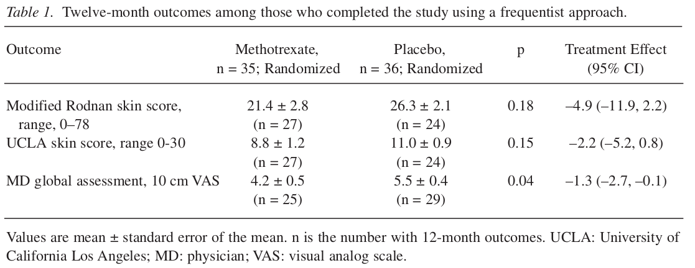
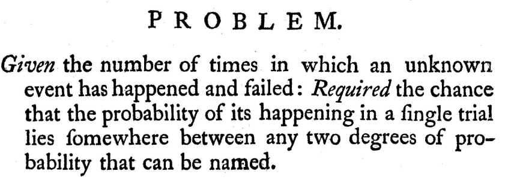
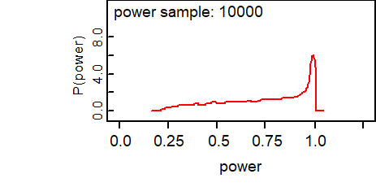

# (PART) 貝葉斯統計學 Bayesian Statistics {-}


# 爲什麼我們要用貝葉斯統計學方法？

> Everybody is a Bayesian. It's just that some know it, and some don't. 
> 
> -- Trivellore Raghunathan

統計學模型 (理論)，結合現實的數據 (實踐)，才能讓我們深刻地理解這個世界，既能檢驗我們的理論，又能從中找出規律性，爲一些現象做出總結和結論。如果說這個理論和實踐相結合的過程有類別之分，那麼最大的兩個類別區分就是: 概率論，和貝葉斯理論。

試從一個醫生的角度來思考他推斷一個患者疾病的過程: 門診中，有個患者因爲身患多種症狀前來就醫，他/她自己可能**認爲自己**患了某種疾病。你作爲接診的醫生，在思考和推斷患者是否患有他/她所認爲的那種疾病時，你的思考會建立在如下的前提 (prior view) 之上: 你觀察到的患者症狀，患者的家族病史，會帶來相同症狀的不同疾病的鑑別診斷。接下來，你可能讓該患者去做一些具體的生理生化，影像或者病理學檢查 (收集相應的數據)。接下來，你收到了該患者的生理生化檢查結果，影像報告和病理學報告，在看了這些報告 (分析獲得的數據) 過後，你重新再對患者到底是否患上該種疾病進行評估，獲得你心中認可的，他/她患有該疾病的概率 (updates their prior in light of the data to get a posterior view on whether the patient has the disease)。當然，更加常見的情況是，你看了這些初步報告之後，可能又讓該患者進一步做一些確診性質的檢查，用於輔助診斷。**可能你還沒意識到，這個思考過程，就是一個十分典型的貝葉斯方式的推理。**

在上面的醫生給患者做診斷的例子中，醫生診斷的過程，其實就是在評估該特定患者患有某種疾病的概率。很顯然不同的醫生可能會給出不同的概率 (=不同的診斷)，這個概率，其實是一個主觀概率 (subjectively)。每個醫生給出的概率大小，其實是他/她自己對於給定了相應的數據 (患者主訴，檢查報告) 之後對於該患者患有該疾病的可能性的度量。(The size of the probability represents the physician's degree of belief about the occurence of an event, i.e. their own personal assessment of how likely an event is, based on the evidence available to them.) 這樣的主觀概率，你是否也認爲它比起概率論者常說的概率更加接近我們平時常說的 "概率" 的概念呢？ (概率論者的"概率": 一個事件發生的概率，等於在無數次相同的實驗中，該事件發生次數所佔的比例)。所以這個貝葉斯方式的主觀概率，其實是因人而異的 (其屬性在於人)，而非所謂的客觀現象 (not the phenomenon of interest)。所以，主觀概率是貝葉斯統計學的最基礎思維方式。

下面我們用兩個例子，來闡述貝葉斯和概率論兩種統計學思維所展示的不同。第一個來自論文 [@johnson2009shifting]，該論文中，作者使用了貝葉斯統計方法重新分析了使用概率論方法分析過的一個臨牀隨機試驗的結果。第二個例子來自於 [@spiegelhalter2004bayesian]，叫做 GREAT 的隨機臨牀試驗。

## 氨甲喋呤 (methotrexate) 在系統性硬皮病 (systematic sclerosis, SSc) 中的療效

### 背景資料-SSc trial

該臨牀試驗 (RCT) 的設定是這樣的，兩組患者，一組是新療法 (氨甲喋呤)，一組是安慰劑 (或者標準療法)。在一個傳統的概率論者的框架底下，分析這樣一個RCT試驗數據的人最有可能進行的分析步驟如下: 

1. 建立一個所謂的零假設 (歸零假設), null hypothesis: 氨甲喋呤對於系統性硬皮病的治療是無效的。
2. 確定一個和零假設互補的替代假設。
3. 設定 0.05 (或者 5%) 作爲假陽性出現概率，也就是 type I error。
4. 通過模型計算，報告 p 值。

那麼，當報告中的 p 值 $> 0.05$ 時，大多數蠢蠢欲動的醫生和研究者可能就會下結論說: "我們沒有找到足夠的證據來拒絕零假設"。事實真的是這樣子嗎？更糟糕的是，許多這樣的臨牀試驗可能會被打上 "negative (消極結果)" 的標籤，然後經過很多年以後大家都認爲這個RCT就被總結成了類似 "氨甲喋呤無效"，或者 "氨甲喋呤不能治療系統性硬皮病"等結論在醫學界被傳播。要知道，類似系統性硬皮病這樣的稀少疾病，其實是很難找到足夠的患者數量進行臨牀試驗的。這些稀少疾病的臨牀試驗中，p 值 $> 0.05$ 很可能只是反映了獲得數據的統計效能不足 (lack of power)，並不一定就說明了藥物或者療法是無效的。

系統性硬皮病是一種患病率極低的罕見疾病。目前沒有特效藥物治療該疾病，從而導致患者長期忍受疾病的折磨，生活品質因爲身體機能的下降而長期處在十分低下的水平。過去有兩個小型試驗報告了氨甲喋呤 (MTX) 可能在系統性硬皮病的治療中起到積極的效果，於是就有研究者組織了一個爲時一年的隨機雙盲臨牀試驗，對象是那些系統性硬皮病的早期患者。35名患者被隨機分配接受 MTX 治療，另外36名患者被分配至了安慰劑對照組。期間有一些患者中途退出了試驗，多數退出的患者的理由是，治療缺乏有效性。

MTX對系統性硬皮病的治療效果評價，使用了三個指標: 

1. modified Rodnan skin score (MRSS) - 得分範圍: 0-78;
2. University of California Los Angeles (UCLA) skin score - 得分範圍 0-30;
3. Physician global assessment of overall disease activity (ODA) - 使用視覺模擬指標，評分範圍從 0 (無疾病) 至 10 (極爲嚴重疾病) 不等。

### 概率論者分析結果

下圖 \@ref(fig:MTX)，是從論文 [@johnson2009shifting] 中節選出來的，該表格展示了典型的概率論者分析該臨牀試驗數據的結果，當時的分析中，只對最終完成試驗的患者的數據進行了分析。


```{r MTX, cache=TRUE, echo=FALSE, fig.height=5, fig.width=7, fig.cap='Methotrexate in Seleroderma: results of a frequentist analysis', fig.align='center', out.width='80%', message=FALSE, warning=FALSE}

```

根據這個分析結果，概率論者報告了下面三個 p 值:

1. MRSS - 效果不顯著 ($p \geqslant 0.05$);
2. UCLA - 效果不顯著 ($p \geqslant 0.05$);
3. ODA - 有統計學意義的顯著效果 ($p = 0.04$)。


要知道，這個臨牀試驗，在設計的時候是計劃能夠通過它尋找 35% 或者以上的療效差異的。所以，任何小於 35% 的療效 (儘管在臨牀上很可能是有意義的) 在概率論的理論框架下都是無法被檢驗，或者沒有足夠的統計效能來檢驗的。於是概率論持有的研究者就此結果下了結論: 我們沒有找到足夠的證據來拒絕 "氨甲喋呤在治療系統性硬皮病上是無效的" 這一零假設。如此，過了一些時日，這個試驗的結論在醫學界漸漸就變成了 "氨甲喋呤不能治療系統性硬皮病"。

其實，概率論持有者下的結論，其真實的含義是: 如果，零假設 ("氨甲喋呤在治療系統性硬皮病上是無效的") 是正確的，假如可以重複無數次相同的臨牀試驗 (每次都找來不同的各自獨立的系統性硬皮病早期患者)，那麼我們能觀察到和該次RCT試驗得到的試驗療效相同，甚至療效更加顯著的試驗出現的概率是大於 0.05 的。你爲這樣的結論，真的正面回答了你想知道的問題了嗎？

我認爲，更加能夠回答大衆或患者們所關心的關於這個試驗的醫學問題應該是，"當我們獲得且分析了試驗數據以後，氨甲喋呤對於系統性硬皮病治療有效的概率是多少 (what is the probability that the intervention is effective given the data?)"。貝葉斯統計學其實可以讓我們正式地，在數學模型上把已知的對於某個事件的知識包括進試驗獲得的數據及其模型當中去，從而計算這個新的治療方法在考慮了已知的醫學背景，及現有的試驗數據之後，它對於疾病的治療是有效的概率到底是多少。這才應是每一個臨牀試驗真正想要回答的最關鍵的問題。

### 貝葉斯統計分析結果

使用貝葉斯統計理論分析相同臨牀試驗數據的結果，我們從論文[@johnson2009shifting]截取來放在圖 \@ref(fig:MTXbayes) 中。在該圖中，可以看見作者除了對完成試驗的患者的數據進行分析，同時使用補全法補過缺失值後的數據分析結果也展示在 "imputing missing data" 這一列中。


```{r MTXbayes, cache=TRUE, echo=FALSE, fig.height=5, fig.width=7, fig.cap='Methotrexate in Seleroderma: results of a Bayesian analysis', fig.align='center', out.width='80%', message=FALSE, warning=FALSE}
knitr::include_graphics("img/Selection_031.png")
```


貝葉斯統計分析的結果，直接且正面的回答了我們想知道的問題，那就是 MTX 到底對於治療系統性硬皮病這一疾病來說是不是有效的。從圖 \@ref(fig:MTXbayes) 中的表格，以及該論文中作者用貝葉斯多元模型分析的結果可以看到，貝葉斯模型推算的是 MTX 在使用三種不同指標進行療效評估時，MTX可以**被認定爲有療效的概率**。[@johnson2009shifting]報告說，有96%的可能性，在使用三種療效評估方法中的兩種或者以上來評估時，我們講看到 MTX 其實是可以改善系統性硬皮病的病情的 (也就是有效的)。


圖 \@ref(fig:MTXbayes) 中表格用的先驗概率是不明確的，沒有太多信息的先驗概率 (vague/flat prior)，其含義是: 

1. 所有可能的治療效果，不論大小，都被認爲有相似的先驗概率 (prior)。(every possible size of treatment effect considered equally likely a priori)
2. 沒有太多信息的先驗概率意味着不提供太多的背景知識給模型。(no external information to current trial incorporated in analysis)


但是，其實我們是有背景知識的，在做這個臨牀試驗之前，已經有兩個小型試驗告訴人們， MTX很有可能可以治療系統性硬皮病，這才導致研究者組織了這一次臨牀試驗。這兩個小型試驗的結果，被 [@johnson2009shifting] 轉換成爲含有信息的先驗概率 (informative prior)。

圖 \@ref(fig:MTXpriors) 展示的是，使用兩種先驗概率所計算的不同的後驗概率的結果之比較。左邊使用的是沒有信息的先驗概率 (flat, wide black prior distribution)，右邊則使用的是有信息的先驗概率。兩個圖中，黑色線均爲先驗概率，綠色線是似然 (來自本次實驗的數據)，紅色線是後驗概率。紅色的面積表示 MTX 在MRSS療效指標中支持其有效的概率，95%CrI是各自的可信區間。可見，當只使用來自本次試驗的數據的時候 (無信息的先驗概率，左邊圖)，療效的點估計，和可信區間，是十分接近概率論者計算的點估計和信賴區間的。與之相對的是，當我們給模型中加入了有信息的先驗概率分佈時，後驗概率分佈給出的點估計和可信區間發生了變化:

- 後驗概率分佈向右邊 (治療無效) 發生了位移 (shift towards no treatment effect)，也就是療效的點估計從 -5.3 下降至 -3.4;
- 95%可信區間的範圍變得比左邊使用無信息先驗概率的結果狹窄了 (估計變得精確了)，從之前的 (-11.8, 1.3) 變窄至 (-7.3, 0.4)。

```{r MTXpriors, cache=TRUE, echo=FALSE, fig.height=5, fig.width=7, fig.cap='Methotrexate in Seleroderma: comparison of priors', fig.align='center', out.width='90%', message=FALSE, warning=FALSE}
knitr::include_graphics("img/Selection_032.png")
```

紅色面積 (也就是支持 MTX 治療有效的概率)，因爲分佈的位移，以及可信區間變窄的原因，從 94% 略增加到了 96%。

在這個實驗中先驗概率分佈和該次試驗計算的似然給模型提供了相似的信息量。在更多的情況下，歷史數據，背景知識只能給出有限的信息量。所以，一個使用貝葉斯方法計算的統計報告，你會看見統計學家使用多個不同的先驗概率分佈，加上該次試驗的似然，來計算多個不同先驗概率下給出的後驗概率分佈結果，從而展示他/她給出的結論對於不同先驗概率的敏感程度。

這個實例給我們展示了貝葉斯統計學能做到，而概率論統計學不能做到的幾個要點: 

1. 貝葉斯分析結果可以告訴我們，藥物有效的概率是多少，簡單直接了當。
2. 背景知識，除了你可以洋洋灑灑地寫在論文中之外，竟然還可以被當做一種先驗概率分佈，有效地和實驗數據獲得的似然相結合，妙哉妙哉。
3. 三種評估手段，可以通過貝葉斯統計學模型整合到一起，同時給出後驗概率的分佈，這在傳統的概率論統計學模型中是很難，甚至是不可能做到的。貝葉斯方法同時還允許我們建立十分複雜的模型，且不必擔心模型擬合計算量對電腦的要求。
4. 中途退出試驗的患者數據可以使用貝葉斯方法簡單地歸納進統計模型中來，概率論統計學所使用的缺失值的補全法其實相比貝葉斯法來說顯得不完整，且可靠程度較低。
5. 醫生從貝葉斯統計方法計算的結果中獲得了更加多的信息，和結論。你可以計算超過某個療效差異的概率大小。在貝葉斯統計學方法中，整個事後概率的密度分佈圖都可以給出，而不僅僅是一個點和信賴區間的估計。


## Example: The GREAT trial 

接下來我們一起一步一步利用GREAT臨牀試驗數據，看看下面不同的分析方法會帶給我們什麼樣子的結果：

1. 經典統計學方法;
2. 貝葉斯統計學方法（通過兩種不同的先驗概率分布）

### Background (GREAT trial)

GREAT 臨牀試驗是一項隨機雙盲對照試驗(RCT)，試驗藥物是阿尼普酶(anistreplase，復合纖維溶解酶)，具有溶解血栓的效果。該試驗比較的是傳統的心肌梗塞(myocardial infarction, MI)被確診之後的治療方法，和家庭醫生對患者確診心肌梗塞之後在家中就立即服用阿尼普酶的療效是否有差異。

- 主要結果：30天死亡率
- 之前有過研究(GISSI trial)，結果表明，當患者在醫院時，阿尼普酶如果在確認患者發生心肌梗塞之後一小時內服用，能夠有效降低患者因心肌梗塞導致的一年死亡率 (從19%降低至12%)。但是當投藥發生在患者心肌梗塞確診６小時以上時，死亡率則沒有變化。
- 本次試驗的方法是：家庭醫生給予患者阿尼普酶 (治療組) 或者安慰劑 (對照組)；當患者被送至醫院後，院內給予安慰劑(治療組)，或者阿尼普酶 (對照組)。[注意二者投藥順序正好相反]。

### 試驗結果

治療組（在家中先服用阿尼普酶後院內服用安慰劑）163例，死亡病例13例；對照組 (家中服用安慰劑後院內服用阿尼普酶) 148例，死亡23例。

### 經典統計學分析方法

觀察數據給出的比值比的點估計可以計算爲: $\text{OR} = \frac{13/(163-13)}{23/(148-23)} = 0.47$; 根據比值比的對數服從正態分布，且標準誤爲: $\text{SE}_{\log(\text{OR})} = \sqrt{\frac{1}{13} + \frac{1}{163-13} + \frac{1}{23} + \frac{1}{148-23}} = -0.7528664$，那麼 $\log{\text{OR}}$ 的95%CI 可以計算爲$\log{0.47} \pm 1.96*(-0.7528664) = (-1.47, -0.03)$，再反過來計算$\text{OR}$的95%CI，可以獲得比值比的信賴區間是：$(0.23, 0.97)$。

至此，傳統的統計學方法的計算過程結束，獲得點估計: $\text{OR} = 0.47; 95\%\text{CI:} (0.23, 0.97), p = 0.04$。

### 貝葉斯統計學分析方法

1. 先驗概率使用專家意見: expert prior

- 專家的意見來自之前已經進行過的三個較小的臨牀試驗：
    - 阿尼普酶可能可以降低一些死亡率，但是不多 (15-25%);
    - 阿尼普酶不太可能降低死亡率達到40%或者以上
- 這個專家意見被貝葉斯統計學家用統計學語言翻譯成: 在比值比尺度上(OR)，治療組(家中立即服用阿尼普酶)相對對照組的比值比的95%信賴區間應該在 $(0.6, 1)$ 範圍內，包括1。
- 我們還需要把這句話再進行對數轉換以便於做邏輯回歸計算 (log-odds ratio)
    - $\log(\text{OR})$ 的95%信賴區間的範圍需要落在$(-0.51, 0)$之內;
    - 這相當於就是一個均值爲 $\log(0.6)/2 = -0.26$, 方差是 $(\frac{0-\log(0.6)}{2} = 0.13)^2$ ，的正態分布:
    
```{r GREAT-expert, cache=TRUE, fig.height=3, fig.width=5, fig.cap='Expert Prior probablity density: small reductions in mortality likely, no or large benefit unlikely.', fig.align='center', out.width='90%', echo=FALSE}
x <- seq(0, 1.5, by = 0.001)
y <- dlnorm(x, meanlog = -0.26, sdlog = 0.13) # use log Normal Distribution generator
plot(x, y, type = "l", frame = F, #ylab = "lognormal(-0.26, 0.13)",
     ylim = c(0, 4.5),  yaxt='n', ylab = "",
     xlab = "Odds ratio", main = " ")
```


- 試驗數據告訴我們，$\text{OR} = 0.47; 95\%\text{CI:} (0.23, 0.97), p = 0.04$，它的分布是數據支持的似然函數分布：


```{r GREAT-expert-likelihood, cache=TRUE, fig.height=3, fig.width=5, fig.cap='Expert Prior probablity density: small reductions in mortality likely, no or large benefit unlikely, adding likelihood (blue) from the GREAT trial.', fig.align='center', out.width='90%', echo=FALSE}
x <- seq(0, 1.5, by = 0.001)
y <- dlnorm(x, meanlog = -0.26, sdlog = 0.13) # use log Normal Distribution generator
z <- dlnorm(x, meanlog = log(0.47), sdlog = (-0.03+1.47)/(2*1.96))
plot(x, y, type = "l", frame = F, #ylab = "lognormal(-0.26, 0.13)",
     ylim = c(0, 4.5),  yaxt='n', ylab = "",
     xlab = "Odds ratio", main = " ")
points (x, z, type="l", col="blue")
# abline(v=0.47, lty = 3)
```

- 當我們使用貝葉斯方法把專家給出的先驗概率，以及本次實驗給出的似然合並之後，獲得的事後概率認爲，心肌梗塞患者在家中立刻服藥沒有幫助或者甚至有害的概率是0.5%：


```{r GREAT-expert-posterior, cache=TRUE, fig.height=3, fig.width=5, fig.cap='Expert Prior probablity density: small reductions in mortality likely, no or large benefit unlikely, adding likelihood (blue) from the GREAT trial, and posterior distribution (red).', fig.align='center', out.width='90%', echo=FALSE}
x <- seq(0, 1.5, by = 0.001)
y <- dlnorm(x, meanlog = -0.26, sdlog = 0.13) # use log Normal Distribution generator
z <- dlnorm(x, meanlog = log(0.47), sdlog = (-0.03+1.47)/(2*1.96))
u <- dlnorm(x, meanlog = -0.3, sdlog = 0.12)
plot(x, y, type = "l", frame = F, #ylab = "lognormal(-0.26, 0.13)",
     ylim = c(0, 4.5),  yaxt='n', ylab = "",
     xlab = "Odds ratio", main = " ")
points (x, z, type="l", col="blue")
points(x, u, type = "l", col = "red")

# abline(v=0.47, lty = 3)
```


2. 先驗概率使用懷疑觀點的概率分布: scetptical prior

- 假定我們不相信專家意見，懷疑地認爲阿尼普酶對降低心肌梗塞患者死亡率本身應該沒有什麼效果的話，可以認爲比值比爲1，也就是 $\log(\text{OR}) = 0$。同時還認爲有顯著療效是小概率事件。此時，先驗概率的分布可以表示爲：


```{r GREAT-sceptical, cache=TRUE, fig.height=3, fig.width=5, fig.cap='Sceptical Prior probablity density, no benifit or large treatment effect unlikely', fig.align='center', out.width='90%', echo=FALSE}
x <- seq(0, 1.5, by = 0.001)
y <- dlnorm(x, meanlog = 0.08, sdlog = 0.25) # use log Normal Distribution generator
plot(x, y, type = "l", frame = F, #ylab = "lognormal(-0.26, 0.13)",
     ylim = c(0, 3),  yaxt='n', ylab = "",
     xlab = "Odds ratio", main = " ")
```

- 即便如此，實驗數據給出的似然函數分布依然把這個持懷疑觀點的先驗概率分布向治療有效的方向拉動了，此時給出的心肌梗塞患者在家中立刻服藥沒有幫助或者甚至有害的概率是8%：

```{r GREAT-sceptical-posterior, cache=TRUE, fig.height=3, fig.width=5, fig.cap='Sceptical Prior probablity density, adding likelihood (blue) from the GREAT trial, and posterior distribution (red).', fig.align='center', out.width='90%', echo=FALSE}
x <- seq(0, 1.5, by = 0.001)
y <- dlnorm(x, meanlog = 0.08, sdlog = 0.25) # use log Normal Distribution generator
z <- dlnorm(x, meanlog = log(0.47), sdlog = (-0.03+1.47)/(2*1.96))
u <- dlnorm(x, meanlog = -0.3, sdlog = 0.2)
plot(x, y, type = "l", frame = F, #ylab = "lognormal(-0.26, 0.13)",
     ylim = c(0, 4.5),  yaxt='n', ylab = "",
     xlab = "Odds ratio", main = " ")
points (x, z, type="l", col="blue")
points(x, u, type = "l", col = "red")

# abline(v=0.47, lty = 3)
```


專家的觀點十分樂觀，但是它仍然起到了把實驗數據給出的似然概率向更現實的方向（不那麼樂觀的方向）拉動了一點點，使用專家意見給出的事後比值比均值是0.73，值得關注的是，採用懷疑論觀點的先驗概率分布，也能給出相似的事後比值比均值 0.70，只是懷疑觀點的先驗概率分布使得事後概率分布中藥物可能無效甚至有害的概率變大了。這個分析展示了，一個對該藥物療效持懷疑觀點的人，和持樂觀觀點的人二者分析相同數據時很可能作出不同的結論，但是有一點是相同的，那就是傳統概率論統計學計算獲得的比值比，$\text{OR} = 0.47; 95\%\text{CI:} (0.23, 0.97), p = 0.04$不論與專家意見相比，還是和懷疑論者相比，都**過於樂觀了** (0.48 is too good to be true)。

# 蒙特卡羅估計和預測 Mente Carlo estimation and prediction

## 起源

```{r Bayes-problem, cache=TRUE, echo=FALSE, fig.asp=.7, fig.width=5, fig.cap='Reproduction of part of the original printed Bayes paper.', fig.align='center', out.width='80%'}

```

一切都開始於1763年，英國東南地區叫做唐橋井 (Tunbridge Wells) 的地方有個叫做託馬斯貝葉斯的牧師死後，他的朋友將他遺留下的手稿發表於世。圖 \@ref(fig:Bayes-problem) 是他遺作論文的節選。這段話使用的當時的英文有點令人摸不着頭腦，但其實翻譯成現代文的意思是（這裏請在大腦中想象我們最長使用的投擲一枚可能有偏的硬幣的場景）：我們一共投擲硬幣 $n$ 次，這其中有 $y$ 次硬幣是正面朝上的（事件發生）。假定 $y$ 服從參數爲 $\theta$ 的二項分布：$y \sim \text{Binomial}(\theta, n)$，那麼$\theta$就是硬幣正面朝上的概率。

貝葉斯牧師感興趣的是，參數$\theta$，落在某個範圍內 $\text{Pr}(\theta_1 < \theta < \theta_2 | y, n)$的**可能性(chance)**。這句話，在當年那個概率論持有者爲主流的社會中是極爲危險而且激進的 (radical) ，因爲貝葉斯牧師使用**可能性 (chance)**來描述一個參數的不確定性(uncertainty)。本質上說，貝葉斯牧師打算對一個無法直接觀測的參數用一個簡單直接的數學表達式來描述它的不確定性。這句話對於概率論觀點持有者佔主流的統計學領域來說，是一種明顯的異端邪說。因爲在概率論觀點持有者的語境下，概率是在無數次可重復實驗中事件發生的平均次數 (probability is interpreted in terms of a long run sequence of events)，這個無法觀測到的參數，是不會改變的 (the key idea is that the unknown parameter is considered to be a random variable under Bayesian theory, rather than fixed but unknown)。

我們在第一章也看到了，貝葉斯牧師提出的理論有助於我們直接，正面地回答研究中我們想知道的問題。圖 \@ref(fig:Bayes-tinmouth) 提供了一個很好的例子，它節選自論文[@tinmouth2004low]中，該文的作者是這樣描述的："There is an 89% probability that the absolute increase in major bleeds is less than 10 percent with low-dose PLT transfusions. (使用低劑量PLT輸血時，患者大出血的出血量增加的絕對值小於10%的可能性是89%。)"


```{r Bayes-tinmouth, cache=TRUE, echo=FALSE, fig.asp=.7, fig.width=6, fig.cap='Example of a direct expression about an unknown parameter.', fig.align='center', out.width='50%'}
knitr::include_graphics("img/tinmouthBayes.png")
```

像圖 \@ref(fig:Bayes-tinmouth) 這樣使用一個概率分布來描述我們想知道的參數有什麼好處呢？

- 最重要的好處是，用概率分布描述這個未知參數可以直觀地告訴我們這個參數它本身可能分布的範圍，和在各自分布點時的可能性。
- 沒有 p 值，因爲我們要計算整個參數可能分布的範圍，這是概率密度分布的面積。
- 沒有(難以令人理解的)信賴區間的概念(confidence interval)，相反地，我們需要盡可能詳細地描述參數可能的分布，它的中位數，它的均值，它可能取值的範圍，它中間包含了95%可信範圍的參數(credible interval)
- 方便地直接應用於預測。
- 自然地適用於決策分析 (decision analysis)，經濟學的成本效益分析 (cost-effective analysis)等。
- 貝葉斯理論讓我們從數學上把經驗（已經發表的實驗結果，以及已有的專家意見）納入到參數的估計上來，這是一個自我學習進化的過程。

## 百分比的統計學推斷 inference on proportions

我們先用一個新藥的臨牀試驗來作爲例子。

### Example: New Drug

有一種新研發的被用於治療慢性疼痛的藥物。爲了對其有效性進行科學客觀的評價，研究者需要組織一項評價其效用的小規模臨牀試驗。在實施這項臨牀試驗之前，我們自己心裏就會提出一個問題，這個新藥物用於治療慢性疼痛時有療效的百分比有可能會是多少（期望值，expectation）？

假如經驗告訴我們，相似成分的藥物可能達到的有療效百分比是在0.2-0.6之間。那麼我們可以把這個經驗翻譯成爲，有效率的期望可能服從某個分布，其均值是0.4，標準差是 0.1，下一步就是用一個能夠具有這樣的均值和標準差特徵的分布來表達這個經驗。我們在數學的寶庫中發現了 Beta 分布這個可以用於描述百分比的分布。

### Beta 分布

Beta 分布的特徵是取值範圍嚴格限定在0, 1之間，這就滿足了百分比數值的取值範圍條件。它由兩個參數來決定分布的特徵。

我們用 $\theta \sim \text{Beta}(a, b)$ 標記 Beta 分布。它的特徵值有：　

$$
\begin{aligned}
p(\theta|a, b) & = \frac{\Gamma(a + b)}{\Gamma(a)\Gamma(b)}\theta^{a-1}(1-\theta)^{b-1}; \theta \in (0,1) \\
\text{E}(\theta|a, b) & = \frac{a}{a+b} \\
\text{V}(\theta|a, b) & = \frac{ab}{(a+b)^2(a + b + 1)}
\end{aligned}
$$

其中 $\Gamma(a) = (a-1)!$ 是一個伽瑪方程。

正如我們在貝葉斯入門的章節\@ref(beta-distribution-intro)也介紹過的那樣，Beta分布的一些形狀特徵總結如下：

```{r beta-distr-bayes, echo=FALSE, fig.height=5, fig.width=7.5, fig.cap='Shape of some Beta distribution functions for various values of a, b', fig.align='center', out.width='90%', cache=TRUE}
par(mfrow=c(2,3))
pi <- Vectorize(function(theta) dbeta(theta, 0.5,0.5))
curve(pi, xlab="Sucess Rate", ylab="Density", main="Beta prior: a=0.5, b=0.5", frame=FALSE, lwd=2)
pi <- Vectorize(function(theta) dbeta(theta, 1,1))
curve(pi, xlab="Success Rate", ylab="Density", main="Beta prior: a=1, b=1",frame=FALSE, lwd=2)
pi <- Vectorize(function(theta) dbeta(theta, 5,1))
curve(pi, xlab="Success Rate", ylab="Density", main="Beta prior: a=5, b=0.3",frame=FALSE, lwd=2)
pi <- Vectorize(function(theta) dbeta(theta, 5,5))
curve(pi, xlab="Success Rate", ylab="Density", main="Beta prior: a=5, b=5",frame=FALSE, lwd=2)
pi <- Vectorize(function(theta) dbeta(theta, 5,20))
curve(pi, xlab="Success Rate", ylab="Density", main="Beta prior: a=5, b=20",frame=FALSE, lwd=2)
pi <- Vectorize(function(theta) dbeta(theta, 50,200))
curve(pi, xlab="Success Rate", ylab="Density", main="Beta prior: a=2, b=8",frame=FALSE, lwd=2)
```

回到新藥試驗的話題上來看，我們的經驗被翻譯成了均值爲0.4, 標準差0.1，那麼把它們帶入Beta分布的均值方差的特徵值公式中去，就可以求得相對應的Beta分布：$\text{Beta}(9.2, 13.8)$

$$
\begin{aligned}
\theta & \sim \text{Beta}(9.2, 13.8) \\ 
\text{E}(\theta) & = \frac{9.2}{9.2 + 13.8} = 0.4 \\
\text{V}(\theta) & = \frac{9.2\times13.8}{(9.2 + 13.8)^2(9.2+13.8+1)} = 0.01 = 0.1^2
\end{aligned}
$$

這個本來只是一句話的經驗，就被我們成功用Beta分布翻譯成了數學模型可以使用的分布方程，它的概率密度曲線如下，使用這個Beta分布的含義就是，經驗告訴我們相似成分的藥物可能達到的有療效百分比是在0.2-0.6之間：

```{r beta-distr-drug, echo=FALSE, fig.height=5, fig.width=7.5, fig.cap='Prior distribution for Drug Example', fig.align='center', out.width='90%', cache=TRUE}
# par(mfrow=c(2,3))
pi <- Vectorize(function(theta) dbeta(theta, 9.2,13.8))
curve(pi, xlab="Probabiltiy of response", ylab="Density", main="Beta(9.2, 13.8)", frame=FALSE, lwd=2)
```

### 作出預測

在臨牀試驗觀測到有療效人數 $y$ 之前，我們可以通過把未知參數積分消除(intergrate out)的方法給出預測分布：

$$
p(y) = \int p(y|\theta)p(\theta)d\theta
$$

預測在很多領域都可以得到廣泛的應用，比如做天氣預報，經濟學上的成本效益分析，進行實驗設計，以及用於檢驗觀測數據是否和期望值相匹配，等等。

### Example: 新藥表現預測

我們再回到新藥治療慢性疼痛的臨牀試驗上來，假設我們設計接納20名患者進入這個臨牀試驗。那麼我們可能想根據已有的經驗，來預測一下這進來的20名患者中藥物有效的人數。

我們已經知道用 Beta 分布來描述經驗（也就是先驗概率 prior distribution），此時，我們再加入用 $y$ 標記20名患者中有效人數的隨機變量。那麼很自然地，我們會使用二項分布作爲 $y$ 的理想模型：

$$
\begin{aligned}
\theta & \sim \text{Beta} (a,b) \\
y & \sim \text{Binomial}(\theta, n)
\end{aligned}
$$

這個模型的預測模型能夠被計算得到（甚至不需要用到計算機），且它有個自己的專有名字 **Beta-Binomial**，它的概率方程是：

$$
\begin{aligned}
p(y) & = \frac{\Gamma(a+b)}{\Gamma(a)\Gamma(b)}\binom{n}{y}\frac{\Gamma(a + y)\Gamma(b + n - y)}{\Gamma(a + b + n)} \\
     & = \binom{n}{y}\frac{B(a + y, b + n -y)}{B(a,b)}
\end{aligned}
$$
其中，$B(a,b) = \frac{\Gamma(a)\Gamma(b)}{\Gamma(a+b)}$；

均值是：

$$
\text{E}(Y) = n\frac{a}{a + b}
$$

那麼我們在進行這項試驗時我們可以預測，20名患者中有療效人數出現的概率，我們將它的預測概率分布圖和先驗概率分布放在一起：

```{r Beta-binomial-def, echo=FALSE, fig.height=3.5, fig.width=8,fig.show='hold', fig.cap='Prior and predictive distribution for the drug example.', fig.align='center', out.width='90%', cache=TRUE}
# # Beta Binomial Predictive distribution function
# BetaBinom <- Vectorize(function(rp){
# log.val <- lchoose(np, rp) + lbeta(rp+a+r,b+n-r+np-rp) - lbeta(a+r,b+n-r)
# return(exp(log.val))
# })
par(mfrow=c(1,2))

pi <- Vectorize(function(theta) dbeta(theta, 9.2,13.8))
curve(pi, xlab="Probabiltiy of response", ylab="Density", main="(a) Prior distribution Beta(9.2, 13.8)", frame=FALSE, lwd=2)

# or we can use the built-in function for beta-binomial distribution in package TailRank:
library(TailRank)
N <- 20; a <- 9.2; b <- 13.8; y <- 0:N
yy <- dbb(y, N, a, b)
barplot(yy, xlab = "Number of successes", names.arg = 0:20, axes = F,
        ylim = c(0, 0.16), main = "(b) predictive distribution")
axis(2,at=seq(0,0.16,0.02))
```


我們根據這個預測概率分布，或者預測概率方程，可以計算"20名患者中有15名或者更多的患者的症狀得到改善"這一事件出現的概率會是：

$$
P(y \geqslant 15) = \sum_{15}^{20}p(y) = 0.015
$$


## 蒙特卡羅估計

但是在一般的情況下，像這個新藥臨牀試驗這樣能夠獲得一個閉環式 (closed-form) 概率預測概率方程的情況少之又少，有時候幾乎是不太可能完成的任務。假設我們本來也無法順利計算出上面的 Beta-Binomial概率公式，我們是否有其他的手段來獲得我們想要的預測概率結果呢？答案是，有的。人類發明的計算機，可以通過模擬試驗的方式(computer simulation)幫我們計算這個結果，它有個很酷的名字，叫做蒙特卡羅積分 (Monte Carlo integration)。

### 用蒙特卡羅法估計概率分佈尾側累積概率(面積)

假設要求一個很簡單的問題，一枚完美的硬幣，投擲10次中8次甚至更多次正面朝上的概率是多少？

在概率數學上，我們會用正式的方法來求:

$$
\begin{aligned}
y & \sim \text{Binomial}(0.5, 10), \text{Pr}(y \geqslant 8)? \\ 
\text{Pr}(y\geqslant 8 \text{ heads}) & = \sum_{y = 8}^{10}p(y | \theta = 0.5, n = 10) \\ 
& = \binom{10}{8}(0.5)^8(0.5)^2 + \binom{10}{9}(0.5)^9(0.5)^1 + \binom{10}{10}(0.5)^{10}(0.5^0) \\
& = 0.0547
\end{aligned}
$$

但是，如果有人很懶，他可以不這樣計算，而是真的拿那個硬幣過來不停的進行很多很多次投擲試驗，然後計算其中8次正面朝上出現的試驗的比例，那麼從長遠來說，就能夠無線接近理論計算的概率數值。

那麼，計算機進行模擬試驗的過程 (simulation)，其實就是讓計算機代替我們進行投擲硬幣試驗的過程。圖 \@ref(fig:coin-tosses) 展示的是計算機模擬投擲硬幣(a) 100次 (b) 10,000 次時正面朝上次數的概率分佈，以及 (c) 真實的概率分佈。

```{r coin-tosses, cache=TRUE, echo=FALSE, fig.width=7, fig.cap='Proportion of simulations with 8 or more "heads" in 10 tosses.', fig.align='center', out.width='80%', message=FALSE, warning=FALSE}
knitr::include_graphics("img/tosses10heads.png")
```

從中可以計算每種情況下硬幣正面朝上10次中出現8次或者更多的事件出現的概率分別是:

- (a) 100次模擬試驗: 0.08
- (b) 10000次模擬試驗: 0.0562 
- (c) 真實的二項分佈累積概率: 0.0547

可見，當模擬試驗的次數增加，計算想要的事件出現的比例，就越來越接近理論計算的真實值。蒙特卡羅積分法，用的也是類似計算機模擬試驗的方法來計算預測概率分佈的。

### 用蒙特卡羅法計算預測概率分佈

如果用蒙特卡羅法，也就是計算機模擬試驗的方法來計算預測概率分佈的話，那麼我們就不需要再通過 Beta-binomial 概率分佈的公式來進行計算了。取而代之的就是，蒙特卡羅積分法: 

1. 從先驗概率分佈中隨機選取一個值 $\theta = \theta_1$
2. 把從先驗概率分佈中隨機選取的 $\theta_1$ 作爲已知量放到二項分佈中再隨機選取一個服從 $n = 20, \theta = \theta_1$ 二項分佈數據中的 $y$。

重複上面步驟1，2成千上萬次之後，獲得的新的概率分佈，就是 $y$ 的預測分佈的一個樣本。這樣獲得的樣本，我們就可以想進各種方法來描述它，可以是取均值，取方差，取四分位，等任何你可以用來描述的特徵值來作爲對預測概率分佈的描述。

## 蒙特卡羅法分析軟件OpenBUGS 

本書中我們用 [OpenBUGS](http://www.openbugs.net/w/FrontPage) 這一軟件進行全部的貝葉斯分析。
### 用 OpenBUGS 分析投擲硬幣數據
, 
回到投擲硬幣的簡單模型上來，我們的隨機變量 $y$ 服從的是二項分佈，$y \sim \text{Binomial}(0.5, 10)$，我們想要計算的是"8次或者更多次正面朝上"事件出現的概率: $P(y\geqslant 8)$。這一模型在 BUGS 語言下被描述爲: 


```
model{
    y ~ dbin(0.5, 10)
    P8 <- step(y - 7.5)
}
```

其中`step`是一個能夠產生邏輯結果(True or False)的指示方程(indicator function)。`P8 <- step(y - 7.5)`這段BUGS語句的含義是，當`y - 7.5`的結果$\geqslant0$，`P8`將會取 1 (True)，反之將返回結果 0 (False)。意思就是使得當隨機選取的二項分布樣本 $y\geqslant8$ 時，`P8`會取值1，否則取0。

將這一段計算機模擬拋擲硬幣的語句重復一萬次以上(iterations)，然後對獲得的所有10000個`P8`取均值，獲得的就會是 $y\geqslant8$ 這一事件將會出現的概率。

### 用OpenBUGS對藥物臨牀試驗的結果做預測

還記得我們在藥物對慢性疼痛治療療效評價的這一臨牀試驗中使用的先驗概率是 $\theta \sim \text{Beta}(9.2, 13.8)$。我們再來思考一次，我們收集到20位志願者參加這個臨牀試驗，那麼"這20位患者中，有15名或者更多的患者症狀得到改善（治療有效）"這件事發生的概率是多少？

這時候，模型的先驗概率和似然，以及我們想要知道的問題，被數學語言寫成了下面的三句話：

$$
\begin{split}
\theta & \sim \text{Beta}(9.2, 13.8) & \text{ Prior distribution} \\
y      & \sim \text{Binomial}(\theta, 20) & \text{ Sampling distribution}  \\
P_{crit} & = P(y \geqslant 15)           & \text{ Probability of exceeding critical threshold}
\end{split}
$$

如果要把這三句話翻譯成爲BUGS語言，可以這樣表達：

```
model{
  theta ~ dbeta(9.2, 13.8) # Prior distribution
  y ~ dbin(theta, 20)      # Sampling distribution
  P.crit <- step(y - 14.5) # = 1 if y >= 15, 0 otherwise
}
```

計算機模擬試驗10000次以後獲得的結果可能是下面這樣子的

```
Node statistics
  		  mean	 sd	       MC_error	 val2.5pc	 median	 val97.5pc	start	sample
P.crit 	0.015	 0.1216	   0.00121	 0.0	     0.0	   0.0	      1  	  10000
theta   0.4008   0.09903	 9.683E-4	 0.2159	   0.3982	 0.5993	    1	    10000
y       8.034    2.919	 0.02578	 3.0	     8.0	   14.0	      1	    10000
```

第一行我們可以看見顯示的是列的名稱，接下來每一行都是OpenBUGS的軟件在進行計算機模擬試驗過程中監測的(monitor)變量的結果，以及它們的數據描述。值得注意的是其中`P.crit`這一行，除了第一列的均值`mean = 0.015`有實際意義意外，其餘的數值是沒有什麼含義的，可以忽略。這個`P.crit`均值的含義即是我們關心的問題【"這20位患者中，有15名或者更多的患者症狀得到改善（治療有效）"這件事發生的概率】的答案，


我們可以把蒙特卡羅算法給出的計算機模擬試驗的結果，和精確統計學計算法獲得的結果相比較：

- $\theta:$ 均值0.4，標準差0.1；
- $y:$ 均值8, 標準差2.93。
- 20人中15人及以上治療有效的概率是0.015。

由於這些樣本是互相獨立的，輸出結果中的 `MC_error` $=\frac{\text{SD}}{\sqrt{\text{n of iterations}}}$。如果你願意，完全可以爲了提高精確度再增加計算機模擬試驗的次數。

OpenBUGS 同時可以輸出計算機模擬計算過後的圖片：

```{r OpenBUGSfigs, cache=TRUE, echo=FALSE, fig.width=4, fig.cap='Example OpenBUGS plots from the drug example', fig.align='center', out.width='80%', message=FALSE, warning=FALSE,  out.width='70%'}
# library(png)
# library(grid)
# library(gridExtra)
# img1 <-  rasterGrob(as.raster(readPNG("img/OpenBUGS01.png")), interpolate = FALSE)
# img2 <-  rasterGrob(as.raster(readPNG("img/OpenBUGS02.png")), interpolate = FALSE)
# grid.arrange(img1, img2, ncol = 2)
knitr::include_graphics("img/OpenBUGS01.png")
knitr::include_graphics("img/OpenBUGS02.png")
```


### 用蒙特卡羅法計算一個臨牀試驗的統計效能 allow uncertainty in power calculation

假設有一個臨牀試驗是這樣設計的，計劃在治療組和對照組各徵集 $n$ 名患者，治療陽性反應率的標準差爲$\sigma = 1$。設計上希望達到一類錯誤 5%，和80%的效能。治療組和對照組的療效差異希望能達到 $\theta = 0.5$。計算樣本量爲$n$，療效差爲$\theta$的試驗的統計效能的數學公式已知爲：

$$
\text{Power} = \Phi(\sqrt{\frac{n\theta^2}{2\sigma^2}} - 1.96)
$$

再假設我們希望對$\theta,\sigma$同時描述其不確定性：

$$
\begin{aligned}
\theta & \sim \text{Uniform}(0.3, 0.7) \\ 
\sigma & \sim \text{Uniform}(0.5, 1.5) \\
\end{aligned}
$$

接下來，我們可以利用這個公式和給出的先驗概率對統計效能的不確定性進行估計。

1. 模擬從$\theta, \sigma$的先驗概率中各自選取相應的值；
2. 把每次模擬試驗獲得的 $\theta, \sigma$ 代入上面計算效能的公式中計算每次可以獲得的統計效能；
3. 重復步驟１，２許多次，獲取這個過程中計算得到的統計效能的預測分布(predictive distribution)。

如果說每組患者人數是63人，那麼這個模型寫成BUGS語言就是：

```
model{
  sigma ~ dunif(0.5, 1.5) 
  theta ~ dunif(0.3, 0.7)
  power <- phi(sqrt(63/2)*theta/sigma - 1.96)
  prob70 <- step(power - 0.7) # is power >= 0.7
}
```

該模型的輸出結果如下，預測的效能分布圖爲圖\@ref(fig:PowerBUGS)：

```
Node statistics
         mean     sd       MC_error   val2.5pc   median   val97.5pc   start   sample
power    0.7508   0.2249   0.00216    0.2846     0.8031   1.0         1       10000
prob70   0.6265   0.4837   0.004626   0.0        1.0      1.0         1       10000
```

當治療組對照組每組各只有６３人時，你會發現統計效能在電腦模擬１００００次試驗過後的中位數才勉強達到了80%，而且這麼寬的效能預測分布也提示我們６３人實在太少了，效能遠遠不能達到設計的要求。

```{r PowerBUGS, cache=TRUE, echo=FALSE, fig.width=4, fig.cap='Predictive Distribution of Power', fig.align='center', out.width='80%', message=FALSE, warning=FALSE,  out.width='70%'}
# library(png)
# library(grid)
# library(gridExtra)
# img1 <-  rasterGrob(as.raster(readPNG("img/OpenBUGS01.png")), interpolate = FALSE)
# img2 <-  rasterGrob(as.raster(readPNG("img/OpenBUGS02.png")), interpolate = FALSE)
# grid.arrange(img1, img2, ncol = 2)

# knitr::include_graphics("img/OpenBUGS02.png")
```

## Practical Bayesian Statistics 02

1. 拋擲硬幣試驗

用BUGS語言描述拋擲硬幣的模型，把寫有下列模型代碼的文件保存爲`coinmodel.txt`: 

```
model{
  y ~ dbin(0.5, 10) 
  P8 <- step(y - 7.5) # = 1 if Y is 8 or more
} 
```

下面的代碼展示了如何在R裏連接OpenBUGS進行蒙特卡羅運算和調出其結果的過程：

```{r　R-OpenBUGS00, cache=TRUE, fig.width=4, fig.cap='History of the iterations.', fig.align='center', out.width='80%', message=TRUE, warning=FALSE}
library(BRugs)
# Step 1 check model
modelCheck("backupfiles/coinmodel.txt") 
# there is no data so just compile the model
modelCompile(numChains = 1) 
# There is no need to provide initial values as this is 
# a Monte Carlo forward sampling from a known distribution
# but the program still requires initial values to begin
# generate a random value.
modelGenInits() #
# Set monitors on nodes of interest
samplesSet(c("P8", "y"))
# Generate 1000 iterations
modelUpdate(1000)

#### SHOW POSTERIOR STATISTICS
sample.statistics <- samplesStats("*")
print(sample.statistics)

#### PUT THE SAMPLED VALUES IN ONE R DATA FRAME:
chain <- data.frame(P8 = samplesSample("P8"),
                    y = samplesSample("y"))
samplesHistory("*", mfrow = c(2,1), ask=FALSE)
```


對模型進行修改，嘗試計算相同設計的試驗，在徵集了30名患者，新藥的有效率爲0.7時，15名或者以內的患者有顯著療效的事件發生的概率是多少？


```
model{
  y ~ dbin(0.7, 30) 
  P15 <- step(15.5 - y) # = 1 if Y is 15 or fewer
} 
```

```{r　R-OpenBUGS01, cache=TRUE, fig.width=4, fig.height=3.5, fig.cap='Predictive distribution of the nodes of interest.', fig.align='center', out.width='80%', message=TRUE, warning=FALSE}

# Step 1 check model
modelCheck("backupfiles/coinmodel30.txt") 
# there is no data so just compile the model
modelCompile(numChains = 1) 
# There is no need to provide initial values as this is 
# a Monte Carlo forward sampling from a known distribution
# but the program still requires initial values to begin
# generate a random value.
modelGenInits() #
# Set monitors on nodes of interest#### SPECIFY, WHICH PARAMETERS TO TRACE:
parameters <- c("P15", "y")
samplesSet(parameters)
# Generate 1000 iterations
modelUpdate(10000)

#### SHOW POSTERIOR STATISTICS
sample.statistics <- samplesStats("*")
print(sample.statistics)

#### PUT THE SAMPLED VALUES IN ONE R DATA FRAME:
chain <- data.frame(P15 = samplesSample("P15"),
                    y = samplesSample("y"))
#### PLOT THE HISTOGRAMS OF THE SAMPLED VALUES
## samplesDensity("*", 1,  mfrow = c(2,2), ask=NULL)

for(p_ in parameters)
  {
    hist(chain[[p_]], main=p_,
         ylab=NA, xlab=NA, #prob = TRUE,
         nclas=50, col="red")
  }
```

所以此時少於或等於１５人得到症狀改善的事件發生的概率被推測爲1.6%。

2. 藥物治療臨牀試驗

藥物臨牀試驗的例子中，我們建立的模型如下：

```
#  Monte Carlo predictions for Drug example

model{
	theta   ~ dbeta(9.2,13.8)          # prior distribution
	y         ~ dbin(theta,20)         # sampling distribution
	P.crit   <- step(y-14.5)           # =1 if y >= 15, 0 otherwise
}
```

把這個模型存儲成`drug-MC.txt`文件之後，可以使用OpenBUGS完成這個模型的蒙特卡羅模擬試驗計算：

```{r　R-OpenBUGS02, cache=TRUE, fig.width=7, fig.height=3.5, fig.cap='Predictive distribution of the nodes of interest.', fig.align='center', out.width='80%', message=TRUE, warning=FALSE}

# Step 1 check model
modelCheck("backupfiles/drug-MC.txt") 
# there is no data so just compile the model
modelCompile(numChains = 1) 
# There is no need to provide initial values as this is 
# a Monte Carlo forward sampling from a known distribution
# but the program still requires initial values to begin
# generate a random value.
modelGenInits() #
# Set monitors on nodes of interest#### SPECIFY, WHICH PARAMETERS TO TRACE:
parameters <- c("theta", "y", "P.crit")
samplesSet(parameters)
# Generate 1000 iterations
modelUpdate(10000)

#### SHOW POSTERIOR STATISTICS
sample.statistics <- samplesStats("*")
print(sample.statistics)

#### PUT THE SAMPLED VALUES IN ONE R DATA FRAME:
chain <- data.frame(theta = samplesSample("theta"),
                    y = samplesSample("y"),
                    P.crit = samplesSample("P.crit"))
#### PLOT THE DENSITY and HISTOGRAMS OF THE SAMPLED VALUES
##1. samplesDensity("*", 1,  mfrow = c(2,2), ask=NULL)
# or 2. by looping 
# for(p_ in parameters)
#   {
#     hist(chain[[p_]], main=p_,
#          ylab=NA, xlab=NA, #prob = TRUE,
#          nclas=50, col="red")
#   }
par(mfrow=c(1,2))

plot(density(chain$theta), main = "theta sample 10000", 
     ylab = "P(theta)", xlab = "theta", col = "red")
hist(chain$y, main = "y sample 10000", ylab = "P(Y)", 
     xlab = "y", col = "red", prob = TRUE)
```

如果把藥物治療的臨牀試驗例子的先驗概率分布修改一下，修改成爲一個沒有信息的均一分布 $\text{Uniform}(0, 1)$，模型的結果會有怎樣的變化呢？嘗試繪制成功次數的預測概率分布，此時"20名患者中大於或者等於15名患者有療效"這一事件發生的概率是多少？

```
#  Monte Carlo predictions for Drug example
#  with a uniform prior

model{
#	theta   ~ dbeta(9.2,13.8)          # prior distribution
  theta   ~ dunif(0,1)               # prior distribution
	y         ~ dbin(theta,20)         # sampling distribution
	P.crit   <- step(y-14.5)           # =1 if y >= 15, 0 otherwise
}
```


```{r　R-OpenBUGS03, cache=TRUE, fig.width=7, fig.height=3.5, fig.cap='Predictive distribution of the nodes of interest.', fig.align='center', out.width='80%', message=TRUE, warning=FALSE}

# Step 1 check model
modelCheck("backupfiles/drug-MCuniform.txt") 
# there is no data so just compile the model
modelCompile(numChains = 1) 
# There is no need to provide initial values as this is 
# a Monte Carlo forward sampling from a known distribution
# but the program still requires initial values to begin
# generate a random value.
modelGenInits() #
# Set monitors on nodes of interest#### SPECIFY, WHICH PARAMETERS TO TRACE:
parameters <- c("theta", "y", "P.crit")
samplesSet(parameters)
# Generate 1000 iterations
modelUpdate(10000)

#### SHOW POSTERIOR STATISTICS
sample.statistics <- samplesStats("*")
print(sample.statistics)

#### PUT THE SAMPLED VALUES IN ONE R DATA FRAME:
chain <- data.frame(theta = samplesSample("theta"),
                    y = samplesSample("y"),
                    P.crit = samplesSample("P.crit"))
#### PLOT THE DENSITY and HISTOGRAMS OF THE SAMPLED VALUES

par(mfrow=c(1,2))

plot(density(chain$theta), main = "theta sample 10000", 
     ylab = "P(theta)", xlab = "theta", col = "red")
hist(chain$y, main = "y sample 10000", ylab = "P(Y)", 
     xlab = "y", col = "red", prob = TRUE)
```

這個條件下，"20名患者中大於或者等於15名患者有療效"這一事件發生的概率爲28.05%。

3. 嘗試自己來寫一個模型。

打開一個空白文檔，試着寫一個模型，它的先驗概率是一個標準正態分布，(OpenBUGS code: `x ~ dnorm(0,1)`)。值得注意的是，在OpenBUGS的環境下，標準正態分布的描述方式和平時概率論統計學有些不一樣：概率論的標準差或者方差，在貝葉斯統計學中被冠以另一種新的概念--精確度(precision, = 1/variance)。試着嘗試用蒙特卡羅模擬試驗的方法計算標準正態分布中取值低於-1.96，和-2.326的事件發生的概率各自是多少。（已知二者的理論值分別是0.025, 0.01）。


```
#  Monte Carlo predictions
#  with a standard normal distribution prior

model{
  x        ~ dnorm(0, 1)             # prior distribution
	p.1     <- step(-1.96 - x)         # = 1 if x <= -1.96, 0 otherwise
	p.2     <- step(-2.32 - x)         # = 1 if x <= -2.32, 0 otherwise
}
```

分別對這個模型嘗試蒙特卡羅模擬試驗100, 1000, 和100000次，比較蒙特卡羅模擬試驗給出的概率估計和理論值的差異。

```{r　R-OpenBUGS04, cache=TRUE, message=TRUE, warning=FALSE}

# Step 1 check model
modelCheck("backupfiles/standardnormalMC.txt") 
# there is no data so just compile the model
modelCompile(numChains = 1) 
# There is no need to provide initial values as this is 
# a Monte Carlo forward sampling from a known distribution
# but the program still requires initial values to begin
# generate a random value.
modelGenInits() #
# Set monitors on nodes of interest#### SPECIFY, WHICH PARAMETERS TO TRACE:
parameters <- c("p.1", "p.2", "x")
samplesSet(parameters)
# Generate 100 iterations
modelUpdate(100)

#### SHOW POSTERIOR STATISTICS
sample.statistics <- samplesStats("*")
print(sample.statistics)

# Generate 900 iterations
modelUpdate(900)

#### SHOW POSTERIOR STATISTICS
sample.statistics <- samplesStats("*")
print(sample.statistics)

# Generate 100000 iterations
modelUpdate(99000)

#### SHOW POSTERIOR STATISTICS
sample.statistics <- samplesStats("*")
print(sample.statistics)
```


我們知道理論上 $x\sim N(0,1^2)$，它的均值爲0，標準差爲1。我們也能看見蒙特卡羅模擬試驗的結果，隨着我們增加其重復取樣次數二越來越接近理論值。當取樣達到十萬次以上之後，可以看到蒙特卡羅的結果已經十分之接近真實值。在一開始剛剛重復100次蒙特卡羅時，我們可以看到`p.1, p.2`的估計還很不準確，但是類似的，當蒙特卡羅採樣次數達到十萬次以上時，這兩個概率估計也已經十分接近真實值。另外值得注意的一點是，隨着蒙特卡羅樣本量增加，`MC_error`也在變得越來越小（越來越精確）。事實上，這個`MC_error`本身約等於$\frac{\text{sd}}{\sqrt{\text{sample size}}}$。所以對$x$來說，經過1000次蒙特卡羅計算，$\text{sd}(x) = 1.009$，那麼此時的`MC_error`$=\frac{1.009}{\sqrt{1000}} \approx 0.0319$，十分接近計算機給出的`MC_error = 0.03677`。`MC_error`本身可以作爲這個$x$均值的估計精確度來理解，我們同時相信，真實的理論值會落在蒙特卡羅樣本均值$\pm 2\times$ `MC_error`範圍內。

下面我們來探索一下 t分布。嘗試寫下一個BUGS模型，它的先驗概率分布是一個自由度爲4的t分布，`y ~ dt(0,1,4)`。然後進行10000次蒙特卡羅採樣計算，並給出概率密度分布圖。

```
#  Monte Carlo predictions
#  with a t distribution prior with degree of freedom = 4

model{
  y ~ dt(0, 1, 4)
}
```

```{r　R-OpenBUGS05, cache=TRUE, fig.width=3.5, fig.height=3, fig.cap='Predictive distribution of the nodes of interest.', fig.align='center', out.width='80%', message=TRUE, warning=FALSE}

# Step 1 check model
modelCheck("backupfiles/MCt.txt") 
# there is no data so just compile the model
modelCompile(numChains = 1) 
# There is no need to provide initial values as this is 
# a Monte Carlo forward sampling from a known distribution
# but the program still requires initial values to begin
# generate a random value.
modelGenInits() #
# Set monitors on nodes of interest#### SPECIFY, WHICH PARAMETERS TO TRACE:
parameters <- c("y")
samplesSet(parameters)
# Generate 10000 iterations
modelUpdate(10000)

#### SHOW POSTERIOR STATISTICS
sample.statistics <- samplesStats("*")
print(sample.statistics)

#### PUT THE SAMPLED VALUES IN ONE R DATA FRAME:
chain <- data.frame(y = samplesSample("y"))
#### PLOT THE DENSITY and HISTOGRAMS OF THE SAMPLED VALUES

plot(density(chain$y), main = "y sample 10000", 
     ylab = "P(y)", xlab = "y", col = "red")


```

下面再嘗試計算一個來自均值爲1，標準差爲2的正態分布的隨機變量，它的三次方的期望值是多少。已知標準差$SD = 2$，那麼方差爲$Var = 4$，那麼翻譯成BUGS語言就是精確度爲 $\frac{1}{4} = 0.25$。

```
#  Monte Carlo predictions

model{
  y ~ dnorm(1, 0.25) 
  ycubed <- pow(y, 3) # note how to write power in BUGS
}
```

```{r　R-OpenBUGS06, cache=TRUE, fig.width=7, fig.height=3, fig.cap='Predictive distribution of the nodes of interest.', fig.align='center', out.width='80%', message=TRUE, warning=FALSE}

# Step 1 check model
modelCheck("backupfiles/MCcube.txt") 
# there is no data so just compile the model
modelCompile(numChains = 1) 
# There is no need to provide initial values as this is 
# a Monte Carlo forward sampling from a known distribution
# but the program still requires initial values to begin
# generate a random value.
modelGenInits() #
# Set monitors on nodes of interest#### SPECIFY, WHICH PARAMETERS TO TRACE:
parameters <- c("y", "ycubed")
samplesSet(parameters)
# Generate 100 iterations
modelUpdate(100000)

#### SHOW POSTERIOR STATISTICS
sample.statistics <- samplesStats("*")
print(sample.statistics)

#### PUT THE SAMPLED VALUES IN ONE R DATA FRAME:
chain <- data.frame(y = samplesSample("y"), 
                    ycubed = samplesSample("ycubed"))
#### PLOT THE DENSITY and HISTOGRAMS OF THE SAMPLED VALUES
par(mfrow=c(1,2))


plot(density(chain$y), main = "y sample 100000", 
     ylab = "P(y)", xlab = "y", col = "red")

plot(density(chain$ycubed), main = "ycubed sample 100000", 
     ylab = "P(ycubed)", xlab = "ycubed", col = "red")
```

所以，一個隨機變量如果它來自一個均值爲1，標準差爲2的正態分布，那麼它的三次方的期望值是13，注意`ycubed`右側的尾巴很長。

#共軛先驗概率 Congugate priors

本章節我們重溫一下最早在貝葉斯統計學入門部分(Chapter \@ref(intro-Bayes))介紹過的一些基本原則。特別是關於共軛先驗概率的概念，並提供一些使用BUGS模型的例子來展示如何運算這些模型。

## 貝葉斯推斷的基礎

在一個臨牀試驗中，作爲一名貝葉斯統計學者，必須清晰明瞭地闡述如下幾個問題:

1. 合理地描述目前爲止，在瞭解本次試驗數據的結果之前，類似研究曾經給出過的療效差異的報告結果，可能的取值範圍 (the **prior distribution**)；
2. 本次試驗數據得到的結果，支持怎樣的療效差異 (the **likelihood**)；<br>
之後需要將上述兩個資源通過合理的數學模型結合在一起，用於產生
3. 最終療效是否存在的意見和建議，證據的總結 (the **posterior distribution**)。

最後第三步將先驗概率和似然相結合的過程，用到的是貝葉斯定理(Bayes Theorem)。通過貝葉斯定理把目前位置的經驗作爲先驗概率統合現階段試驗數據給出的似然的過程，其實是一個自我學習不斷更新知識的過程。經過貝葉斯推斷，給出事後概率分布之時，我們可以拿它來做什麼呢？

- 估計和評價治療效果，治療差異。
- 估計和評價模型中參數的不確定性。
- 計算你感興趣的那個變量（可以是療效差異，可以是模型中的參數）達到或者超過某個特定目標值的概率。
- 預測你感興趣的那個變量可能存在的範圍。
- 作爲未來要進行的試驗設計階段的先驗概率分布。
- 給決策者提供證據。

你是否還記得貝葉斯定理的公式: 
如果$A, B$分別標記兩個事件，那麼有

$$
p(A|B) = \frac{p(B|A)p(A)}{p(B)}
$$

如果$A_i$是一系列互斥不相交事件，也就是$p(\cup_iA_i) = \sum_ip(A_i) = 1$，貝葉斯定理可以被改寫成爲：

$$
p(A_i|B) = \frac{p(B|A_i)p(A_i)}{\sum_jp(B|A_j)p(A_j)}
$$


貝葉斯統計學推斷從根本上的特點在於嚴格區分：

1. 觀測數據 $y$，也就是試驗獲得的數據。
2. 未知參數 $\theta$，這裏，$\theta$可以用統計學工具來描述，它可以是統計學參數，可以是缺失值，可以是測量誤差數據等等。

- 這裏貝葉斯統計學把未知參數當做一個可以變化的隨機變量(parameters are treated as random variables)；
- 在貝葉斯統計學框架下，我們對參數的不確定性進行描述(we make probability statements about model parameters)。
- 在概率論統計學框架下，統計學參數是未知，但是確實不變的。使用概率論統計學進行推斷時，我們只對數據進行不確定性的描述(**parameters are fixed non-random quantities** and the probability statements concern the data.)

貝葉斯統計學推斷中，我們仍然需要建立模型用來描述 $p(y|\theta)$，這個也就是概率論統計學中常見的**似然(likelihood)**。似然是把各個變量關聯起來的完整的**概率模型(full probability model)**。

從貝葉斯統計學推斷的觀點出發，

- 在實施試驗，收集數據之前，參數($\theta$)是未知的，所以它需要由一個**概率分布(probability distribution)**來反應它的不確定性，也就是說，我們需要先對參數可能來自的分布進行描述，指定一個**先驗概率(prior distribution)**$p(\theta)$；
- 試驗進行完了，數據整理分析之時，我們知道了$y$，這就是我們來和先驗概率結合的似然，使用貝葉斯定理，從而獲得給定了觀測數據之後(conditional on)，服從先驗概率的參數現在服從的概率分布，這被叫做**事後概率分布(posterior distribution)**。

$$
p(\theta|y) = \frac{p(\theta)p(y|\theta)}{\int p(\theta)p(y|\theta)d\theta} \propto p(\theta)p(y|\theta)
$$

總結一下就是，

1. 先驗概率(prior distribution)，$p(\theta)$描述的是在**收集數據之前**參數的不確定性。
2. 事後概率(posterior distribution)，$p(\theta | y)$ 描述的是在**收集數據之後**參數的不確定性。

## 二項分布(似然)數據的共軛先驗概率

沿用前一個章節新藥試驗的例子。我們在實施試驗之前對藥物的認知是，我們認爲它的藥效概率可能在 0.2-0.6 之間。我們把這個試驗前對藥物療效的估計認知翻譯成一個服從均值爲0.4，標準差爲0.1的Beta分布。這個Beta分布使用的參數(參數的參數被叫做**超參數, hyperparameter**)，是9.2, 13.8，寫作$\text{Beta}(9.2, 13.8)$。那麼現在我們假設試驗結束，收集的20名患者中15名療效顯著。接下來貝葉斯統計學家要回答的問題是，這個試驗結果對先驗概率分布產生了多大的影響(How should this trial change our opinion about the positive response rate)？

在這個例子中，我們現在來詳細給出先驗概率和似然。

- 似然 likelihood (distribution of the data)：<br>如果患者可以被認爲是相互獨立的，他們來自一個相同的總體，在這個總體中有一個未知的對藥物療效有效反應(positive response)的概率 $\theta$，這樣的數據可以用一個二項分布似然來描述 binomial likelihood:

$$
p(y | n, \theta) = \binom{n}{y}\theta^y(1-\theta)^{n-y} \propto \theta^y(1-\theta)^{n-y}
$$

- 描述試驗前我們對$\theta$的認知的先驗概率 prior distribution，這是一個連續型先驗概率分布。<br>對於百分比，我們用Beta分布來描述：

$$
\begin{aligned}
\theta & \sim   \text{Beta}(a,b) \\ 
p(\theta) & = \frac{\Gamma(a+b)}{\Gamma(a)\Gamma(b)} \theta^{a-1}(1-\theta)^{b-1}\\
\end{aligned}
$$

根據貝葉斯定理，我們來把先驗概率分布和似然相結合（相乘），來獲取事後概率分布：

$$
\begin{aligned}
p(\theta | y, n) & \propto p(y|\theta, n)p(\theta) \\
                 & \propto \theta^y(1-\theta)^{n-y}\theta^{a-1}(1-\theta)^{b-1} \\
                 & = \theta^{y + a -1}(1-\theta)^{n - y + b -1}
\end{aligned}
$$
眼尖的人立刻能看出來，這個事後概率分布本身也是一個Beta分布的概率方程，只是它的超參數和先驗概率相比發生了變化(更新)：

$$
p(\theta | y,n) = \text{Beta}(a + y, b + n -y)
$$

像這樣，先驗概率和事後概率兩個概率分布都來自相同家族的情況，先驗概率又被叫做和似然成共軛關系的先驗概率(共軛先驗概率, conjugate prior)。


```{r R-OpenBUGS07, cache=TRUE, fig.width=3.5, fig.height=6, fig.cap='Prior, likelihood, and posterior for Drug example', fig.align='center', out.width='80%', message=TRUE, warning=FALSE}
par(mfrow=c(3,1))
# Plot exact prior probability density 
# values of the hyperparameters
a <- 9.2 
b <- 13.8

# prior function
prior <- Vectorize(function(theta) dbeta(theta, a, b))
# Plot 
curve(prior, 0, 1, type = "l", main = "Prior for "~theta, ylim = c(0, 4.5), frame = F,
      xlab = "Probability of positive response", ylab = "Density", lwd = 2, cex.axis = 1.5, cex.lab = 1.5)

# binomial likelihood function (likelihood)

Likelihood <- Vectorize(function(theta) dbinom(15, 20, theta))

# Plot
curve(Likelihood, 0, 1, type = "l", main = "Likelihood for the data", 
      frame = FALSE, xlab = "Probability of positive response", ylab = "Density", 
      lwd = 2, cex.axis =  1.5, cex.lab = 1.5)
# n <- 0; r <- 0; a <- 9.2; b <- 13.8; np <- 20
# plot(0:20, BetaBinom(0:20), type = "b", xlab = "r*", ylab = "P(R = r*)", 
#      main = "Prior predictive: a = 9.2, b = 13.8")

# Posterior function 

posterior <- Vectorize(function(theta) dbeta(theta, a+15, b+20-15))

# Plot

curve(posterior, 0, 1, type = "l", main = "Posterior for "~theta, 
      frame = FALSE, xlab = "Probability of positive response", ylab = "Density", 
      lwd = 2, cex.axis = 1.5, cex.lab = 1.5)
```

本次試驗的模型，它的三個部分（先驗概率，似然，事後概率），分別從上到下繪制在圖 \@ref(fig:R-OpenBUGS07) 中。由於我們使用了共軛先驗概率，所以我們也可以通過數學的計算（甚至不需要計算機的輔助）也能算出事後概率分布。可是，並不是所有的模型都有共軛先驗概率分布供我們選擇，這時候，蒙特卡羅模擬試驗的算法就提供了強有力的工具。在BUGS語言中，我們可以用蒙特卡羅算法，忽視掉那些無法在數學上推導出事後概率分布方程的模型。BUGS本身很厲害，它可以自動識別出我們給它的先驗概率分布是否和似然之間是共軛的，如果是，那麼它會計算出共軛的事後概率分布方程，然後從事後概率分布方程中選取蒙特卡羅樣本。這個新藥試驗的BUGS模型可以寫作：


```
#  Monte Carlo model for Drug example

model{
	theta   ~ dbeta(9.2,13.8)          # prior distribution
	y       ~ dbin(theta,20)           # sampling distribution (likelihood)
	y       <- 15                      # data
}
```

你可以看到這個模型和我們在前一章做預測的模型只有第三行指令發生了變化。當時我們是打算要來做試驗結果的預測。此時，我們試驗完畢，觀察到15名患者的疼痛症狀得到了改善，所以試驗數據是15。BUGS本身會自動識別出我們是否給似然增加了觀察數據。當它識別到我們不是用這個模型做結果預測時，它會自動明白我們現在要來做事後概率分布的計算了。這個在似然裏面的數據，是它要拿來放到模型中做條件的(observed values, i.e. data needs to be conditioned on)。

### 事後概率分布預測

假如這個新藥的效果仍然無法讓人覺得信服，我們考慮再做一次試驗徵集更多的患者，如果在這個試驗中，40名患者中有25名或者更多的患者症狀得到緩解，可以考慮把該藥物加入下一次發展計劃當中。這時候，又一次回到了預測概率的問題上來，我們想知道，"再做40人的試驗時，有25名或者更多的患者的症狀可以得到緩解"這件事可能發生的概率。這時候的模型可以被擴展如下：

$$
\begin{split}
\theta & \sim \text{Beta}(a,b) & \text{ Prior distribution} \\
y      & \sim \text{Binomial}(\theta, n) & \text{ Sampling distribution} \\
y_{\text{pred}} & \sim \text{Binomial}(\theta, m) & \text{ Predictive distribution} \\
P_{\text{crit}} & \sim P(y_{\text{pred}} \geqslant m_{\text{crit}}) & \text{ Probability of exceeding critical threshold}
\end{split}
$$

這段模型翻譯成BUGS語言可以描述爲：

```
model{
  theta     ~ dbeta(a, b)                  # prior distribution
  y         ~ dbin(theta, n)               # sampling distribution
  y.pred    ~ dbin(theta, m)               # predictive distribution
  P.crit   <- step(y.pred - mcrit + 0.5)   # = 1 if y.pred >= mcrit, 0 otherwise
}
```

我們可以把數據寫在另一個txt文件裏面：

```
list(a = 9.2,             # parameters of prior distribution 
     b = 13.8, 
     y = 15,              # number of successes in completed trial
     n = 20,              # number of patients in completed trial
     m = 40,              # number of patients in future trial 
     mcrit = 25)          # critical value of future successes
```


當然這是一個很簡單的例子，你完全可以把數據和模型寫在一起：

```
model{
  theta     ~ dbeta(9.2, 13.8)                  # prior distribution
  y         ~ dbin(theta, 20)                   # sampling distribution
  y.pred    ~ dbin(theta, 40)                   # predictive distribution
  P.crit   <- step(y.pred - 24.5)               # = 1 if y.pred >= mcrit, 0 otherwise
  y        <- 15
}
```
```{r　R-OpenBUGS08, cache=TRUE, fig.width=7, fig.height=3, fig.cap='Posterior and predictive distributions for Drug example', fig.align='center', out.width='80%', message=TRUE, warning=FALSE}

# Step 1 check model
modelCheck("backupfiles/MCdrugP29.txt") 
# there is no data so just compile the model
modelCompile(numChains = 1) 
# There is no need to provide initial values as 
# they are aleady provided in the model specification
modelGenInits() #
# Set monitors on nodes of interest#### SPECIFY, WHICH PARAMETERS TO TRACE:
parameters <- c("P.crit", "theta", "y.pred")
samplesSet(parameters)
# Generate 50000 iterations
modelUpdate(50000)

#### SHOW POSTERIOR STATISTICS
sample.statistics <- samplesStats("*")
print(sample.statistics)

#### PUT THE SAMPLED VALUES IN ONE R DATA FRAME:
chain <- data.frame(P.crit = samplesSample("P.crit"), 
                    theta = samplesSample("theta"), 
                    y.pred = samplesSample("y.pred"))
#### PLOT THE DENSITY and HISTOGRAMS OF THE SAMPLED VALUES
par(mfrow=c(1,2))


plot(density(chain$theta), main = "theta sample 50000", xlim = c(0,1),
     ylab = "P(theta)", xlab = "Probability of response", col = "red")

hist(chain$y.pred, main = "y.pred sample 50000", prob = TRUE,xlim = c(0, 40),
     ylab = "P(y.pred)", xlab = "Number of success", col = "red")
```
圖\@ref(fig:R-OpenBUGS08)左邊的圖，是前一次試驗結果的事後概率分布，20名患者中觀察到15名患者症狀改善。右邊的圖則是對下一次40人的試驗的結果做的預測，平均22.5名患者可能會有症狀改善，這個均值的標準差是4.3。


```{r MCMC00, cache=TRUE, fig.width=7, fig.height=3, fig.cap='Plot of the MCMC chain of the parameter, Drug example.', fig.align='center', out.width='80%', message=TRUE, warning=FALSE}
plot(chain$theta, main="", type="l", ylab="theta", 
     xlab="iteration", col="red", ylim = c(0,1.2))
```

爲了比較，我們可以把精確計算獲得的答案和蒙特卡羅算法給出的預測做個比較：

1. $\theta:$均值爲0.563，標準差是0.075；
2. $y_{\text{pred}}:$均值22.51，標準差是4.31；
3. 至少25名患者得到症狀改善的精確概率是 0.329。


## 正態分布(似然)數據的共軛先驗概率

例子：英國各地自來水公司依照法律規定，需要定期監測自己公司生產的自來水中三氯甲烷(trihalomethane, THM)的濃度。一年之中，每個公司都會在各個時期，不同的供水區域進行水樣的採集。假設現在我們需要來估計某個供水區域的自來水中三氯甲烷的濃度。

已知已經進行了兩次取樣，監測到三氯甲烷濃度分別是 $y_1 = 128\mu g/l, y_2 = 132 \mu g/l$。兩次監測的均值爲 $130 \mu g/l$。如果，這一片固定供水區域監測三氯甲烷濃度時檢測值的標準差是已知的 $\sigma = 5\mu g/l$，那麼問題是，在這片固定供水區域的三氯甲烷濃度的估計值$(\theta)$能否計算？

一個只有概率論知識的統計專家是這樣計算的：

1. 樣本均值 $\bar y = 130 \mu g/l$是總體均值 $\theta$ 的一次估計；
2. 它的標準誤是 $\frac{\sigma}{\sqrt{n}} = 5/\sqrt{2} = 3.5 \mu g/l$。
3. 然後這兩次測量的結果告訴我們總體均值的點估計和95%信賴區間是: $\bar y \pm 1.96 \times \sigma/\sqrt{n} = 130 \pm 1.96\times3.5 = (123.1, 136.9) \mu g /l$

但是一個擁有了貝葉斯統計學知識的統計專家則會是這樣思考的：

這個模型中，我們知道**似然(likelihood)**是一個正態分布：$y_i \sim N(\theta, \sigma^2) (i = 1, \dots, n)$，且這裏的標準差是已知的 $\sigma = 5\mu g/l$。那麼我們給均值這個參數 $\theta$ 一個怎樣的先驗概率分布呢？

$$
\theta \sim N(\mu, \omega^2)
$$

- 先驗概率分布的方差 $\omega^2$ 常可以用數據的方差來表達：$\omega^2 = \sigma^2/n_0$。
- 這裏的 $n_0$，可以被解釋爲隱藏的先驗概率樣本量(implicit prior sample size)。

在 BUGS 標記法中，正態分布的代碼是 `y ~ dnorm(theta, tau)`，其中 `tau` 是方差的倒數(又叫做精確度)。

這時候我們需要一些過去同一家供水廠監測三氯甲烷時濃度的數據來給這個先驗概率分布一些提示。例如翻閱記錄我們發現來自**同一家自來水公司，在其他供水區域的**三氯甲烷濃度均值是 $120 \mu g/l$，標準差是 $10 \mu g/l$。這就提供了 $N(120, 10^2)$ 作爲 $\theta$ 的先驗概率分布。這時我們把先驗概率分布的標準差用觀測區域的標準差來表達: $\omega^2 = \sigma^2/n_0$，此時 $n_0 = \sigma^2/\omega^2 = 5^2/10^2 = 0.25$。那麼先驗概率分布可以被表達成 $\theta \sim N(120, \sigma^2/0.25)$。如果 $n_0$ 靠近 $0$，那麼根據這個方程我們知道先驗概率分布的方差就會變大，意味着先驗概率給出的信息越不精確，分布越"平坦(flatter)"。

此時貝葉斯統計專家把似然和先驗概率分布結合起來，計算事後概率分布：

$$
\begin{aligned}
\theta | \mathbf{y}  & \sim  N(\frac{n_0 + n\bar y}{n_0 + n}, \frac{\sigma^2}{n_0 + n})\\  
                     & \sim N(\frac{0.25\times 120 + 2 \times 130}{0.25 + 2}, \frac{5^2}{0.25 + 2}) \\ 
                     & = N(128.9, 3.33^2 )
\end{aligned}
$$

貝葉斯算法給出的事後概率分布的95%可信區間則是 $(122.4, 135.4) \mu g/l$。

- 事後概率分布的均值$\frac{n_0 + n\bar y}{n_0 + n}$其實是先驗概率均值，和觀測數據均值之間加權之後的綜合值，它們加的權重，分別是各自的精確度(相對樣本量 relative sample size)。這其實告訴我們，觀測數據和先驗概率二者結合之時，需要各自妥協。(a compromise between the likelihood and the prior)

- 事後概率分布的方差也是和先前提到的先驗概率樣本量有密切關系。它是觀測數據的方差除以觀測樣本量和先驗概率樣本量之和。

- 當然，當你的觀測數據樣本量趨向於無窮大時 $n \rightarrow \infty$，事後概率分布本身就接近與觀測數據的似然 $p(\theta | \mathbf{y}) \rightarrow N(\bar y, \sigma^2/n)$。也就是說觀測數據的信息量佔絕對主導，先驗概率分布，不再能提供太多有價值的信息，可以忽略不計了。

# MCMC 

# 建模和模型的檢查

# 貝葉斯統計學框架下的實驗設計

# 貝葉斯廣義線性回歸

# 貝葉斯等級回歸模型 

# 再訪 MCMC

# 貝葉斯和概率論的比較 