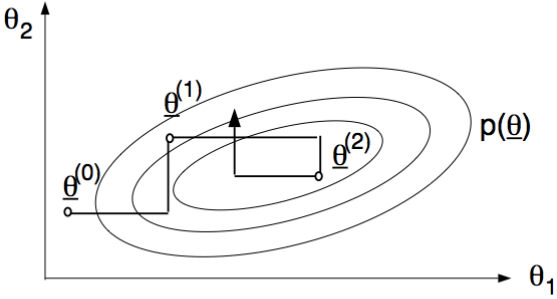
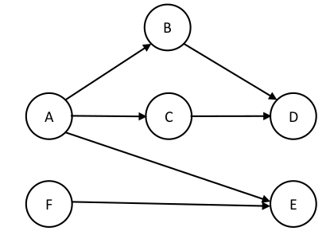
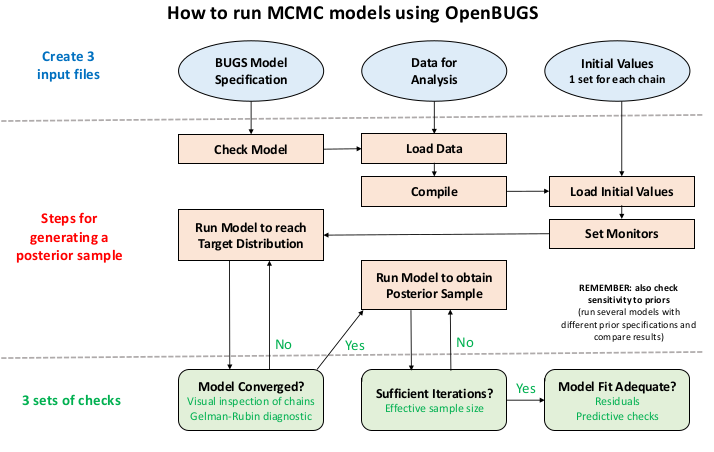
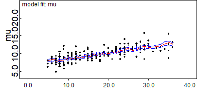
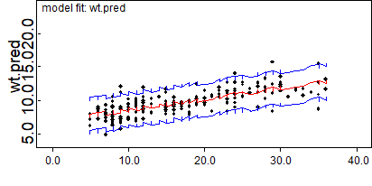
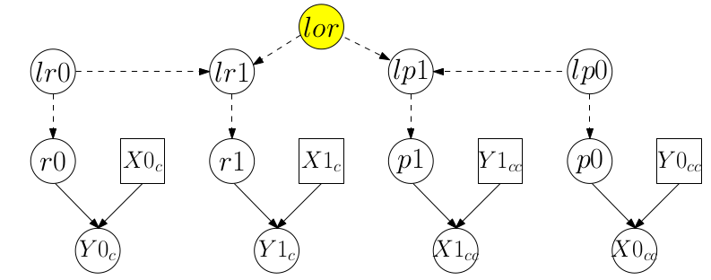
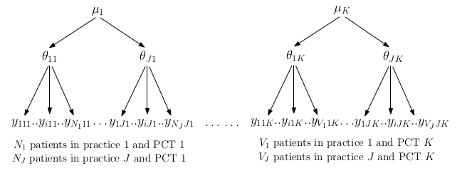

# (PART) 貝葉斯統計學 Bayesian Statistics {-}


# 爲什麼我們要用貝葉斯統計學方法？

> Everybody is a Bayesian. It's just that some know it, and some don't. 
> 
> -- Trivellore Raghunathan

統計學模型 (理論)，結合現實的數據 (實踐)，才能讓我們深刻地理解這個世界，既能檢驗我們的理論，又能從中找出規律性，爲一些現象做出總結和結論。如果說這個理論和實踐相結合的過程有類別之分，那麼最大的兩個類別區分就是: 概率論，和貝葉斯理論。

試從一個醫生的角度來思考他推斷一個患者疾病的過程: 門診中，有個患者因爲身患多種症狀前來就醫，他/她自己可能**認爲自己**患了某種疾病。你作爲接診的醫生，在思考和推斷患者是否患有他/她所認爲的那種疾病時，你的思考會建立在如下的前提 (prior view) 之上: 你觀察到的患者症狀，患者的家族病史，會帶來相同症狀的不同疾病的鑑別診斷。接下來，你可能讓該患者去做一些具體的生理生化，影像或者病理學檢查 (收集相應的數據)。接下來，你收到了該患者的生理生化檢查結果，影像報告和病理學報告，在看了這些報告 (分析獲得的數據) 過後，你重新再對患者到底是否患上該種疾病進行評估，獲得你心中認可的，他/她患有該疾病的概率 (updates their prior in light of the data to get a posterior view on whether the patient has the disease)。當然，更加常見的情況是，你看了這些初步報告之後，可能又讓該患者進一步做一些確診性質的檢查，用於輔助診斷。**可能你還沒意識到，這個思考過程，就是一個十分典型的貝葉斯方式的推理。**

在上面的醫生給患者做診斷的例子中，醫生診斷的過程，其實就是在評估該特定患者患有某種疾病的概率。很顯然不同的醫生可能會給出不同的概率 (=不同的診斷)，這個概率，其實是一個主觀概率 (subjectively)。每個醫生給出的概率大小，其實是他/她自己對於給定了相應的數據 (患者主訴，檢查報告) 之後對於該患者患有該疾病的可能性的度量。(The size of the probability represents the physician's degree of belief about the occurence of an event, i.e. their own personal assessment of how likely an event is, based on the evidence available to them.) 這樣的主觀概率，你是否也認爲它比起概率論者常說的概率更加接近我們平時常說的 "概率" 的概念呢？ (概率論者的"概率": 一個事件發生的概率，等於在無數次相同的實驗中，該事件發生次數所佔的比例)。所以這個貝葉斯方式的主觀概率，其實是因人而異的 (其屬性在於人)，而非所謂的客觀現象 (not the phenomenon of interest)。所以，主觀概率是貝葉斯統計學的最基礎思維方式。

下面我們用兩個例子，來闡述貝葉斯和概率論兩種統計學思維所展示的不同。第一個來自論文 [@johnson2009shifting]，該論文中，作者使用了貝葉斯統計方法重新分析了使用概率論方法分析過的一個臨牀隨機試驗的結果。第二個例子來自於 [@spiegelhalter2004bayesian]，叫做 GREAT 的隨機臨牀試驗。

## 氨甲喋呤 (methotrexate) 在系統性硬皮病 (systematic sclerosis, SSc) 中的療效

### 背景資料-SSc trial

該臨牀試驗 (RCT) 的設定是這樣的，兩組患者，一組是新療法 (氨甲喋呤)，一組是安慰劑 (或者標準療法)。在一個傳統的概率論者的框架底下，分析這樣一個RCT試驗數據的人最有可能進行的分析步驟如下: 

1. 建立一個所謂的零假設 (歸零假設), null hypothesis: 氨甲喋呤對於系統性硬皮病的治療是無效的。
2. 確定一個和零假設互補的替代假設。
3. 設定 0.05 (或者 5%) 作爲假陽性出現概率，也就是 type I error。
4. 通過模型計算，報告 p 值。

那麼，當報告中的 p 值 $> 0.05$ 時，大多數蠢蠢欲動的醫生和研究者可能就會下結論說: "我們沒有找到足夠的證據來拒絕零假設"。事實真的是這樣子嗎？更糟糕的是，許多這樣的臨牀試驗可能會被打上 "negative (消極結果)" 的標籤，然後經過很多年以後大家都認爲這個RCT就被總結成了類似 "氨甲喋呤無效"，或者 "氨甲喋呤不能治療系統性硬皮病"等結論在醫學界被傳播。要知道，類似系統性硬皮病這樣的稀少疾病，其實是很難找到足夠的患者數量進行臨牀試驗的。這些稀少疾病的臨牀試驗中，p 值 $> 0.05$ 很可能只是反映了獲得數據的統計效能不足 (lack of power)，並不一定就說明了藥物或者療法是無效的。

系統性硬皮病是一種患病率極低的罕見疾病。目前沒有特效藥物治療該疾病，從而導致患者長期忍受疾病的折磨，生活品質因爲身體機能的下降而長期處在十分低下的水平。過去有兩個小型試驗報告了氨甲喋呤 (MTX) 可能在系統性硬皮病的治療中起到積極的效果，於是就有研究者組織了一個爲時一年的隨機雙盲臨牀試驗，對象是那些系統性硬皮病的早期患者。35名患者被隨機分配接受 MTX 治療，另外36名患者被分配至了安慰劑對照組。期間有一些患者中途退出了試驗，多數退出的患者的理由是，治療缺乏有效性。

MTX對系統性硬皮病的治療效果評價，使用了三個指標: 

1. modified Rodnan skin score (MRSS) - 得分範圍: 0-78;
2. University of California Los Angeles (UCLA) skin score - 得分範圍 0-30;
3. Physician global assessment of overall disease activity (ODA) - 使用視覺模擬指標，評分範圍從 0 (無疾病) 至 10 (極爲嚴重疾病) 不等。

### 概率論者分析結果

下圖 \@ref(fig:MTX)，是從論文 [@johnson2009shifting] 中節選出來的，該表格展示了典型的概率論者分析該臨牀試驗數據的結果，當時的分析中，只對最終完成試驗的患者的數據進行了分析。


```{r MTX, cache=TRUE, echo=FALSE, fig.height=5, fig.width=7, fig.cap='Methotrexate in Seleroderma: results of a frequentist analysis', fig.align='center', out.width='80%', message=FALSE, warning=FALSE}
knitr::include_graphics("img/Selection_030.png")
```

根據這個分析結果，概率論者報告了下面三個 p 值:

1. MRSS - 效果不顯著 ($p \geqslant 0.05$);
2. UCLA - 效果不顯著 ($p \geqslant 0.05$);
3. ODA - 有統計學意義的顯著效果 ($p = 0.04$)。


要知道，這個臨牀試驗，在設計的時候是計劃能夠通過它尋找 35% 或者以上的療效差異的。所以，任何小於 35% 的療效 (儘管在臨牀上很可能是有意義的) 在概率論的理論框架下都是無法被檢驗，或者沒有足夠的統計效能來檢驗的。於是概率論持有的研究者就此結果下了結論: 我們沒有找到足夠的證據來拒絕 "氨甲喋呤在治療系統性硬皮病上是無效的" 這一零假設。如此，過了一些時日，這個試驗的結論在醫學界漸漸就變成了 "氨甲喋呤不能治療系統性硬皮病"。

其實，概率論持有者下的結論，其真實的含義是: 如果，零假設 ("氨甲喋呤在治療系統性硬皮病上是無效的") 是正確的，假如可以重複無數次相同的臨牀試驗 (每次都找來不同的各自獨立的系統性硬皮病早期患者)，那麼我們能觀察到和該次RCT試驗得到的試驗療效相同，甚至療效更加顯著的試驗出現的概率是大於 0.05 的。你爲這樣的結論，真的正面回答了你想知道的問題了嗎？

我認爲，更加能夠回答大衆或患者們所關心的關於這個試驗的醫學問題應該是，"當我們獲得且分析了試驗數據以後，氨甲喋呤對於系統性硬皮病治療有效的概率是多少 (what is the probability that the intervention is effective given the data?)"。貝葉斯統計學其實可以讓我們正式地，在數學模型上把已知的對於某個事件的知識包括進試驗獲得的數據及其模型當中去，從而計算這個新的治療方法在考慮了已知的醫學背景，及現有的試驗數據之後，它對於疾病的治療是有效的概率到底是多少。這才應是每一個臨牀試驗真正想要回答的最關鍵的問題。

### 貝葉斯統計分析結果

使用貝葉斯統計理論分析相同臨牀試驗數據的結果，我們從論文[@johnson2009shifting]截取來放在圖 \@ref(fig:MTXbayes) 中。在該圖中，可以看見作者除了對完成試驗的患者的數據進行分析，同時使用補全法補過缺失值後的數據分析結果也展示在 "imputing missing data" 這一列中。


```{r MTXbayes, cache=TRUE, echo=FALSE, fig.height=5, fig.width=7, fig.cap='Methotrexate in Seleroderma: results of a Bayesian analysis', fig.align='center', out.width='80%', message=FALSE, warning=FALSE}
knitr::include_graphics("img/Selection_031.png")
```


貝葉斯統計分析的結果，直接且正面的回答了我們想知道的問題，那就是 MTX 到底對於治療系統性硬皮病這一疾病來說是不是有效的。從圖 \@ref(fig:MTXbayes) 中的表格，以及該論文中作者用貝葉斯多元模型分析的結果可以看到，貝葉斯模型推算的是 MTX 在使用三種不同指標進行療效評估時，MTX可以**被認定爲有療效的概率**。[@johnson2009shifting]報告說，有96%的可能性，在使用三種療效評估方法中的兩種或者以上來評估時，我們講看到 MTX 其實是可以改善系統性硬皮病的病情的 (也就是有效的)。


圖 \@ref(fig:MTXbayes) 中表格用的先驗概率是不明確的，沒有太多信息的先驗概率 (vague/flat prior)，其含義是: 

1. 所有可能的治療效果，不論大小，都被認爲有相似的先驗概率 (prior)。(every possible size of treatment effect considered equally likely a priori)
2. 沒有太多信息的先驗概率意味着不提供太多的背景知識給模型。(no external information to current trial incorporated in analysis)


但是，其實我們是有背景知識的，在做這個臨牀試驗之前，已經有兩個小型試驗告訴人們， MTX很有可能可以治療系統性硬皮病，這才導致研究者組織了這一次臨牀試驗。這兩個小型試驗的結果，被 [@johnson2009shifting] 轉換成爲含有信息的先驗概率 (informative prior)。

圖 \@ref(fig:MTXpriors) 展示的是，使用兩種先驗概率所計算的不同的後驗概率的結果之比較。左邊使用的是沒有信息的先驗概率 (flat, wide black prior distribution)，右邊則使用的是有信息的先驗概率。兩個圖中，黑色線均爲先驗概率，綠色線是似然 (來自本次實驗的數據)，紅色線是後驗概率。紅色的面積表示 MTX 在MRSS療效指標中支持其有效的概率，95%CrI是各自的可信區間。可見，當只使用來自本次試驗的數據的時候 (無信息的先驗概率，左邊圖)，療效的點估計，和可信區間，是十分接近概率論者計算的點估計和信賴區間的。與之相對的是，當我們給模型中加入了有信息的先驗概率分佈時，後驗概率分佈給出的點估計和可信區間發生了變化:

- 後驗概率分佈向右邊 (治療無效) 發生了位移 (shift towards no treatment effect)，也就是療效的點估計從 -5.3 下降至 -3.4;
- 95%可信區間的範圍變得比左邊使用無信息先驗概率的結果狹窄了 (估計變得精確了)，從之前的 (-11.8, 1.3) 變窄至 (-7.3, 0.4)。

```{r MTXpriors, cache=TRUE, echo=FALSE, fig.height=5, fig.width=7, fig.cap='Methotrexate in Seleroderma: comparison of priors', fig.align='center', out.width='90%', message=FALSE, warning=FALSE}
knitr::include_graphics("img/Selection_032.png")
```

紅色面積 (也就是支持 MTX 治療有效的概率)，因爲分佈的位移，以及可信區間變窄的原因，從 94% 略增加到了 96%。

在這個實驗中先驗概率分佈和該次試驗計算的似然給模型提供了相似的信息量。在更多的情況下，歷史數據，背景知識只能給出有限的信息量。所以，一個使用貝葉斯方法計算的統計報告，你會看見統計學家使用多個不同的先驗概率分佈，加上該次試驗的似然，來計算多個不同先驗概率下給出的後驗概率分佈結果，從而展示他/她給出的結論對於不同先驗概率的敏感程度。

這個實例給我們展示了貝葉斯統計學能做到，而概率論統計學不能做到的幾個要點: 

1. 貝葉斯分析結果可以告訴我們，藥物有效的概率是多少，簡單直接了當。
2. 背景知識，除了你可以洋洋灑灑地寫在論文中之外，竟然還可以被當做一種先驗概率分佈，有效地和實驗數據獲得的似然相結合，妙哉妙哉。
3. 三種評估手段，可以通過貝葉斯統計學模型整合到一起，同時給出後驗概率的分佈，這在傳統的概率論統計學模型中是很難，甚至是不可能做到的。貝葉斯方法同時還允許我們建立十分複雜的模型，且不必擔心模型擬合計算量對電腦的要求。
4. 中途退出試驗的患者數據可以使用貝葉斯方法簡單地歸納進統計模型中來，概率論統計學所使用的缺失值的補全法其實相比貝葉斯法來說顯得不完整，且可靠程度較低。
5. 醫生從貝葉斯統計方法計算的結果中獲得了更加多的信息，和結論。你可以計算超過某個療效差異的概率大小。在貝葉斯統計學方法中，整個事後概率的密度分佈圖都可以給出，而不僅僅是一個點和信賴區間的估計。


## Example: The GREAT trial 

接下來我們一起一步一步利用GREAT臨牀試驗數據，看看下面不同的分析方法會帶給我們什麼樣子的結果：

1. 經典統計學方法;
2. 貝葉斯統計學方法（通過兩種不同的先驗概率分布）

### Background (GREAT trial)

GREAT 臨牀試驗是一項隨機雙盲對照試驗(RCT)，試驗藥物是阿尼普酶(anistreplase，復合纖維溶解酶)，具有溶解血栓的效果。該試驗比較的是傳統的心肌梗塞(myocardial infarction, MI)被確診之後的治療方法，和家庭醫生對患者確診心肌梗塞之後在家中就立即服用阿尼普酶的療效是否有差異。

- 主要結果：30天死亡率
- 之前有過研究(GISSI trial)，結果表明，當患者在醫院時，阿尼普酶如果在確認患者發生心肌梗塞之後一小時內服用，能夠有效降低患者因心肌梗塞導致的一年死亡率 (從19%降低至12%)。但是當投藥發生在患者心肌梗塞確診６小時以上時，死亡率則沒有變化。
- 本次試驗的方法是：家庭醫生給予患者阿尼普酶 (治療組) 或者安慰劑 (對照組)；當患者被送至醫院後，院內給予安慰劑(治療組)，或者阿尼普酶 (對照組)。[注意二者投藥順序正好相反]。

### 試驗結果

治療組（在家中先服用阿尼普酶後院內服用安慰劑）163例，死亡病例13例；對照組 (家中服用安慰劑後院內服用阿尼普酶) 148例，死亡23例。

### 經典統計學分析方法

觀察數據給出的比值比的點估計可以計算爲: $\text{OR} = \frac{13/(163-13)}{23/(148-23)} = 0.47$; 根據比值比的對數服從正態分布，且標準誤爲: $\text{SE}_{\log(\text{OR})} = \sqrt{\frac{1}{13} + \frac{1}{163-13} + \frac{1}{23} + \frac{1}{148-23}} = -0.7528664$，那麼 $\log{\text{OR}}$ 的95%CI 可以計算爲$\log{0.47} \pm 1.96*(-0.7528664) = (-1.47, -0.03)$，再反過來計算$\text{OR}$的95%CI，可以獲得比值比的信賴區間是：$(0.23, 0.97)$。

至此，傳統的統計學方法的計算過程結束，獲得點估計: $\text{OR} = 0.47; 95\%\text{CI:} (0.23, 0.97), p = 0.04$。

### 貝葉斯統計學分析方法

1. 先驗概率使用專家意見: expert prior

- 專家的意見來自之前已經進行過的三個較小的臨牀試驗：
    - 阿尼普酶可能可以降低一些死亡率，但是不多 (15-25%);
    - 阿尼普酶不太可能降低死亡率達到40%或者以上
- 這個專家意見被貝葉斯統計學家用統計學語言翻譯成: 在比值比尺度上(OR)，治療組(家中立即服用阿尼普酶)相對對照組的比值比的95%信賴區間應該在 $(0.6, 1)$ 範圍內，包括1。
- 我們還需要把這句話再進行對數轉換以便於做邏輯回歸計算 (log-odds ratio)
    - $\log(\text{OR})$ 的95%信賴區間的範圍需要落在$(-0.51, 0)$之內;
    - 這相當於就是一個均值爲 $\log(0.6)/2 = -0.26$, 方差是 $(\frac{0-\log(0.6)}{2} = 0.13)^2$ ，的正態分布:
    
```{r GREAT-expert, cache=TRUE, fig.height=3, fig.width=5, fig.cap='Expert Prior probablity density: small reductions in mortality likely, no or large benefit unlikely.', fig.align='center', out.width='90%', echo=FALSE}
x <- seq(0, 1.5, by = 0.001)
y <- dlnorm(x, meanlog = -0.26, sdlog = 0.13) # use log Normal Distribution generator
plot(x, y, type = "l", frame = F, #ylab = "lognormal(-0.26, 0.13)",
     ylim = c(0, 4.5),  yaxt='n', ylab = "",
     xlab = "Odds ratio", main = " ")
```


- 試驗數據告訴我們，$\text{OR} = 0.47; 95\%\text{CI:} (0.23, 0.97), p = 0.04$，它的分布是數據支持的似然函數分布：


```{r GREAT-expert-likelihood, cache=TRUE, fig.height=3, fig.width=5, fig.cap='Expert Prior probablity density: small reductions in mortality likely, no or large benefit unlikely, adding likelihood (blue) from the GREAT trial.', fig.align='center', out.width='90%', echo=FALSE}
x <- seq(0, 1.5, by = 0.001)
y <- dlnorm(x, meanlog = -0.26, sdlog = 0.13) # use log Normal Distribution generator
z <- dlnorm(x, meanlog = log(0.47), sdlog = (-0.03+1.47)/(2*1.96))
plot(x, y, type = "l", frame = F, #ylab = "lognormal(-0.26, 0.13)",
     ylim = c(0, 4.5),  yaxt='n', ylab = "",
     xlab = "Odds ratio", main = " ")
points (x, z, type="l", col="blue")
# abline(v=0.47, lty = 3)
```

- 當我們使用貝葉斯方法把專家給出的先驗概率，以及本次實驗給出的似然合並之後，獲得的事後概率認爲，心肌梗塞患者在家中立刻服藥沒有幫助或者甚至有害的概率是0.5%：


```{r GREAT-expert-posterior, cache=TRUE, fig.height=3, fig.width=5, fig.cap='Expert Prior probablity density: small reductions in mortality likely, no or large benefit unlikely, adding likelihood (blue) from the GREAT trial, and posterior distribution (red).', fig.align='center', out.width='90%', echo=FALSE}
x <- seq(0, 1.5, by = 0.001)
y <- dlnorm(x, meanlog = -0.26, sdlog = 0.13) # use log Normal Distribution generator
z <- dlnorm(x, meanlog = log(0.47), sdlog = (-0.03+1.47)/(2*1.96))
u <- dlnorm(x, meanlog = -0.3, sdlog = 0.12)
plot(x, y, type = "l", frame = F, #ylab = "lognormal(-0.26, 0.13)",
     ylim = c(0, 4.5),  yaxt='n', ylab = "",
     xlab = "Odds ratio", main = " ")
points (x, z, type="l", col="blue")
points(x, u, type = "l", col = "red")

# abline(v=0.47, lty = 3)
```


2. 先驗概率使用懷疑觀點的概率分布: scetptical prior

- 假定我們不相信專家意見，懷疑地認爲阿尼普酶對降低心肌梗塞患者死亡率本身應該沒有什麼效果的話，可以認爲比值比爲1，也就是 $\log(\text{OR}) = 0$。同時還認爲有顯著療效是小概率事件。此時，先驗概率的分布可以表示爲：


```{r GREAT-sceptical, cache=TRUE, fig.height=3, fig.width=5, fig.cap='Sceptical Prior probablity density, no benifit or large treatment effect unlikely', fig.align='center', out.width='90%', echo=FALSE}
x <- seq(0, 1.5, by = 0.001)
y <- dlnorm(x, meanlog = 0.08, sdlog = 0.25) # use log Normal Distribution generator
plot(x, y, type = "l", frame = F, #ylab = "lognormal(-0.26, 0.13)",
     ylim = c(0, 3),  yaxt='n', ylab = "",
     xlab = "Odds ratio", main = " ")
```

- 即便如此，實驗數據給出的似然函數分布依然把這個持懷疑觀點的先驗概率分布向治療有效的方向拉動了，此時給出的心肌梗塞患者在家中立刻服藥沒有幫助或者甚至有害的概率是8%：

```{r GREAT-sceptical-posterior, cache=TRUE, fig.height=3, fig.width=5, fig.cap='Sceptical Prior probablity density, adding likelihood (blue) from the GREAT trial, and posterior distribution (red).', fig.align='center', out.width='90%', echo=FALSE}
x <- seq(0, 1.5, by = 0.001)
y <- dlnorm(x, meanlog = 0.08, sdlog = 0.25) # use log Normal Distribution generator
z <- dlnorm(x, meanlog = log(0.47), sdlog = (-0.03+1.47)/(2*1.96))
u <- dlnorm(x, meanlog = -0.3, sdlog = 0.2)
plot(x, y, type = "l", frame = F, #ylab = "lognormal(-0.26, 0.13)",
     ylim = c(0, 4.5),  yaxt='n', ylab = "",
     xlab = "Odds ratio", main = " ")
points (x, z, type="l", col="blue")
points(x, u, type = "l", col = "red")

# abline(v=0.47, lty = 3)
```


專家的觀點十分樂觀，但是它仍然起到了把實驗數據給出的似然概率向更現實的方向（不那麼樂觀的方向）拉動了一點點，使用專家意見給出的事後比值比均值是0.73，值得關注的是，採用懷疑論觀點的先驗概率分布，也能給出相似的事後比值比均值 0.70，只是懷疑觀點的先驗概率分布使得事後概率分布中藥物可能無效甚至有害的概率變大了。這個分析展示了，一個對該藥物療效持懷疑觀點的人，和持樂觀觀點的人二者分析相同數據時很可能作出不同的結論，但是有一點是相同的，那就是傳統概率論統計學計算獲得的比值比，$\text{OR} = 0.47; 95\%\text{CI:} (0.23, 0.97), p = 0.04$不論與專家意見相比，還是和懷疑論者相比，都**過於樂觀了** (0.48 is too good to be true)。

# 蒙特卡羅估計和預測 Mente Carlo estimation and prediction {#MC-estimation}

## 起源

```{r Bayes-problem, cache=TRUE, echo=FALSE, fig.asp=.7, fig.width=5, fig.cap='Reproduction of part of the original printed Bayes paper.', fig.align='center', out.width='80%'}
knitr::include_graphics("img/BayesProblem.png")
```

一切都開始於1763年，英國東南地區叫做唐橋井 (Tunbridge Wells) 的地方有個叫做託馬斯貝葉斯的牧師死後，他的朋友將他遺留下的手稿發表於世。圖 \@ref(fig:Bayes-problem) 是他遺作論文的節選。這段話使用的當時的英文有點令人摸不着頭腦，但其實翻譯成現代文的意思是（這裏請在大腦中想象我們最長使用的投擲一枚可能有偏的硬幣的場景）：我們一共投擲硬幣 $n$ 次，這其中有 $y$ 次硬幣是正面朝上的（事件發生）。假定 $y$ 服從參數爲 $\theta$ 的二項分布：$y \sim \text{Binomial}(\theta, n)$，那麼$\theta$就是硬幣正面朝上的概率。

貝葉斯牧師感興趣的是，參數$\theta$，落在某個範圍內 $\text{Pr}(\theta_1 < \theta < \theta_2 | y, n)$的**可能性(chance)**。這句話，在當年那個概率論持有者爲主流的社會中是極爲危險而且激進的 (radical) ，因爲貝葉斯牧師使用**可能性 (chance)**來描述一個參數的不確定性(uncertainty)。本質上說，貝葉斯牧師打算對一個無法直接觀測的參數用一個簡單直接的數學表達式來描述它的不確定性。這句話對於概率論觀點持有者佔主流的統計學領域來說，是一種明顯的異端邪說。因爲在概率論觀點持有者的語境下，概率是在無數次可重復實驗中事件發生的平均次數 (probability is interpreted in terms of a long run sequence of events)，這個無法觀測到的參數，是不會改變的 (the key idea is that the unknown parameter is considered to be a random variable under Bayesian theory, rather than fixed but unknown)。

我們在第一章也看到了，貝葉斯牧師提出的理論有助於我們直接，正面地回答研究中我們想知道的問題。圖 \@ref(fig:Bayes-tinmouth) 提供了一個很好的例子，它節選自論文[@tinmouth2004low]中，該文的作者是這樣描述的："There is an 89% probability that the absolute increase in major bleeds is less than 10 percent with low-dose PLT transfusions. (使用低劑量PLT輸血時，患者大出血的出血量增加的絕對值小於10%的可能性是89%。)"


```{r Bayes-tinmouth, cache=TRUE, echo=FALSE, fig.asp=.7, fig.width=6, fig.cap='Example of a direct expression about an unknown parameter.', fig.align='center', out.width='50%'}
knitr::include_graphics("img/tinmouthBayes.png")
```

像圖 \@ref(fig:Bayes-tinmouth) 這樣使用一個概率分布來描述我們想知道的參數有什麼好處呢？

- 最重要的好處是，用概率分布描述這個未知參數可以直觀地告訴我們這個參數它本身可能分布的範圍，和在各自分布點時的可能性。
- 沒有 p 值，因爲我們要計算整個參數可能分布的範圍，這是概率密度分布的面積。
- 沒有(難以令人理解的)信賴區間的概念(confidence interval)，相反地，我們需要盡可能詳細地描述參數可能的分布，它的中位數，它的均值，它可能取值的範圍，它中間包含了95%可信範圍的參數(credible interval)
- 方便地直接應用於預測。
- 自然地適用於決策分析 (decision analysis)，經濟學的成本效益分析 (cost-effective analysis)等。
- 貝葉斯理論讓我們從數學上把經驗（已經發表的實驗結果，以及已有的專家意見）納入到參數的估計上來，這是一個自我學習進化的過程。

## 百分比的統計學推斷 inference on proportions

我們先用一個新藥的臨牀試驗來作爲例子。

### Example: New Drug

有一種新研發的被用於治療慢性疼痛的藥物。爲了對其有效性進行科學客觀的評價，研究者需要組織一項評價其效用的小規模臨牀試驗。在實施這項臨牀試驗之前，我們自己心裏就會提出一個問題，這個新藥物用於治療慢性疼痛時有療效的百分比有可能會是多少（期望值，expectation）？

假如經驗告訴我們，相似成分的藥物可能達到的有療效百分比是在0.2-0.6之間。那麼我們可以把這個經驗翻譯成爲，有效率的期望可能服從某個分布，其均值是0.4，標準差是 0.1，下一步就是用一個能夠具有這樣的均值和標準差特徵的分布來表達這個經驗。我們在數學的寶庫中發現了 Beta 分布這個可以用於描述百分比的分布。

### Beta 分布

Beta 分布的特徵是取值範圍嚴格限定在0, 1之間，這就滿足了百分比數值的取值範圍條件。它由兩個參數來決定分布的特徵。

我們用 $\theta \sim \text{Beta}(a, b)$ 標記 Beta 分布。它的特徵值有：　

$$
\begin{aligned}
p(\theta|a, b) & = \frac{\Gamma(a + b)}{\Gamma(a)\Gamma(b)}\theta^{a-1}(1-\theta)^{b-1}; \theta \in (0,1) \\
\text{E}(\theta|a, b) & = \frac{a}{a+b} \\
\text{V}(\theta|a, b) & = \frac{ab}{(a+b)^2(a + b + 1)}
\end{aligned}
$$

其中 $\Gamma(a) = (a-1)!$ 是一個伽瑪方程。

正如我們在貝葉斯入門的章節\@ref(beta-distribution-intro)也介紹過的那樣，Beta分布的一些形狀特徵總結如下：

```{r beta-distr-bayes, echo=FALSE, fig.height=5, fig.width=7.5, fig.cap='Shape of some Beta distribution functions for various values of a, b', fig.align='center', out.width='90%', cache=TRUE}
par(mfrow=c(2,3))
pi <- Vectorize(function(theta) dbeta(theta, 0.5,0.5))
curve(pi, xlab="Sucess Rate", ylab="Density", main="Beta prior: a=0.5, b=0.5", frame=FALSE, lwd=2)
pi <- Vectorize(function(theta) dbeta(theta, 1,1))
curve(pi, xlab="Success Rate", ylab="Density", main="Beta prior: a=1, b=1",frame=FALSE, lwd=2)
pi <- Vectorize(function(theta) dbeta(theta, 5,1))
curve(pi, xlab="Success Rate", ylab="Density", main="Beta prior: a=5, b=0.3",frame=FALSE, lwd=2)
pi <- Vectorize(function(theta) dbeta(theta, 5,5))
curve(pi, xlab="Success Rate", ylab="Density", main="Beta prior: a=5, b=5",frame=FALSE, lwd=2)
pi <- Vectorize(function(theta) dbeta(theta, 5,20))
curve(pi, xlab="Success Rate", ylab="Density", main="Beta prior: a=5, b=20",frame=FALSE, lwd=2)
pi <- Vectorize(function(theta) dbeta(theta, 50,200))
curve(pi, xlab="Success Rate", ylab="Density", main="Beta prior: a=2, b=8",frame=FALSE, lwd=2)
```

回到新藥試驗的話題上來看，我們的經驗被翻譯成了均值爲0.4, 標準差0.1，那麼把它們帶入Beta分布的均值方差的特徵值公式中去，就可以求得相對應的Beta分布：$\text{Beta}(9.2, 13.8)$

$$
\begin{aligned}
\theta & \sim \text{Beta}(9.2, 13.8) \\ 
\text{E}(\theta) & = \frac{9.2}{9.2 + 13.8} = 0.4 \\
\text{V}(\theta) & = \frac{9.2\times13.8}{(9.2 + 13.8)^2(9.2+13.8+1)} = 0.01 = 0.1^2
\end{aligned}
$$

這個本來只是一句話的經驗，就被我們成功用Beta分布翻譯成了數學模型可以使用的分布方程，它的概率密度曲線如下，使用這個Beta分布的含義就是，經驗告訴我們相似成分的藥物可能達到的有療效百分比是在0.2-0.6之間：

```{r beta-distr-drug, echo=FALSE, fig.height=5, fig.width=7.5, fig.cap='Prior distribution for Drug Example', fig.align='center', out.width='90%', cache=TRUE}
# par(mfrow=c(2,3))
pi <- Vectorize(function(theta) dbeta(theta, 9.2,13.8))
curve(pi, xlab="Probabiltiy of response", ylab="Density", main="Beta(9.2, 13.8)", frame=FALSE, lwd=2)
```

### 作出預測

在臨牀試驗觀測到有療效人數 $y$ 之前，我們可以通過把未知參數積分消除(intergrate out)的方法給出預測分布：

$$
p(y) = \int p(y|\theta)p(\theta)d\theta
$$

預測在很多領域都可以得到廣泛的應用，比如做天氣預報，經濟學上的成本效益分析，進行實驗設計，以及用於檢驗觀測數據是否和期望值相匹配，等等。

### Example: 新藥表現預測

我們再回到新藥治療慢性疼痛的臨牀試驗上來，假設我們設計接納20名患者進入這個臨牀試驗。那麼我們可能想根據已有的經驗，來預測一下這進來的20名患者中藥物有效的人數。

我們已經知道用 Beta 分布來描述經驗（也就是先驗概率 prior distribution），此時，我們再加入用 $y$ 標記20名患者中有效人數的隨機變量。那麼很自然地，我們會使用二項分布作爲 $y$ 的理想模型：

$$
\begin{aligned}
\theta & \sim \text{Beta} (a,b) \\
y & \sim \text{Binomial}(\theta, n)
\end{aligned}
$$

這個模型的預測模型能夠被計算得到（甚至不需要用到計算機），且它有個自己的專有名字 **Beta-Binomial**，它的概率方程是：

$$
\begin{aligned}
p(y) & = \frac{\Gamma(a+b)}{\Gamma(a)\Gamma(b)}\binom{n}{y}\frac{\Gamma(a + y)\Gamma(b + n - y)}{\Gamma(a + b + n)} \\
     & = \binom{n}{y}\frac{B(a + y, b + n -y)}{B(a,b)}
\end{aligned}
$$
其中，$B(a,b) = \frac{\Gamma(a)\Gamma(b)}{\Gamma(a+b)}$；

均值是：

$$
\text{E}(Y) = n\frac{a}{a + b}
$$

那麼我們在進行這項試驗時我們可以預測，20名患者中有療效人數出現的概率，我們將它的預測概率分布圖和先驗概率分布放在一起：

```{r Beta-binomial-def, echo=FALSE, fig.height=3.5, fig.width=8,fig.show='hold', fig.cap='Prior and predictive distribution for the drug example.', fig.align='center', out.width='90%', cache=TRUE}
# # Beta Binomial Predictive distribution function
# BetaBinom <- Vectorize(function(rp){
# log.val <- lchoose(np, rp) + lbeta(rp+a+r,b+n-r+np-rp) - lbeta(a+r,b+n-r)
# return(exp(log.val))
# })
par(mfrow=c(1,2))

pi <- Vectorize(function(theta) dbeta(theta, 9.2,13.8))
curve(pi, xlab="Probabiltiy of response", ylab="Density", main="(a) Prior distribution Beta(9.2, 13.8)", frame=FALSE, lwd=2)

# or we can use the built-in function for beta-binomial distribution in package TailRank:
library(TailRank)
N <- 20; a <- 9.2; b <- 13.8; y <- 0:N
yy <- dbb(y, N, a, b)
barplot(yy, xlab = "Number of successes", names.arg = 0:20, axes = F,
        ylim = c(0, 0.16), main = "(b) predictive distribution")
axis(2,at=seq(0,0.16,0.02))
```


我們根據這個預測概率分布，或者預測概率方程，可以計算"20名患者中有15名或者更多的患者的症狀得到改善"這一事件出現的概率會是：

$$
P(y \geqslant 15) = \sum_{15}^{20}p(y) = 0.015
$$


## 蒙特卡羅估計

但是在一般的情況下，像這個新藥臨牀試驗這樣能夠獲得一個閉環式 (closed-form) 概率預測概率方程的情況少之又少，有時候幾乎是不太可能完成的任務。假設我們本來也無法順利計算出上面的 Beta-Binomial概率公式，我們是否有其他的手段來獲得我們想要的預測概率結果呢？答案是，有的。人類發明的計算機，可以通過模擬試驗的方式(computer simulation)幫我們計算這個結果，它有個很酷的名字，叫做蒙特卡羅積分 (Monte Carlo integration)。

### 用蒙特卡羅法估計概率分佈尾側累積概率(面積)

假設要求一個很簡單的問題，一枚完美的硬幣，投擲10次中8次甚至更多次正面朝上的概率是多少？

在概率數學上，我們會用正式的方法來求:

$$
\begin{aligned}
y & \sim \text{Binomial}(0.5, 10), \text{Pr}(y \geqslant 8)? \\ 
\text{Pr}(y\geqslant 8 \text{ heads}) & = \sum_{y = 8}^{10}p(y | \theta = 0.5, n = 10) \\ 
& = \binom{10}{8}(0.5)^8(0.5)^2 + \binom{10}{9}(0.5)^9(0.5)^1 + \binom{10}{10}(0.5)^{10}(0.5^0) \\
& = 0.0547
\end{aligned}
$$

但是，如果有人很懶，他可以不這樣計算，而是真的拿那個硬幣過來不停的進行很多很多次投擲試驗，然後計算其中8次正面朝上出現的試驗的比例，那麼從長遠來說，就能夠無線接近理論計算的概率數值。

那麼，計算機進行模擬試驗的過程 (simulation)，其實就是讓計算機代替我們進行投擲硬幣試驗的過程。圖 \@ref(fig:coin-tosses) 展示的是計算機模擬投擲硬幣(a) 100次 (b) 10,000 次時正面朝上次數的概率分佈，以及 (c) 真實的概率分佈。

```{r coin-tosses, cache=TRUE, echo=FALSE, fig.width=7, fig.cap='Proportion of simulations with 8 or more "heads" in 10 tosses.', fig.align='center', out.width='80%', message=FALSE, warning=FALSE}
knitr::include_graphics("img/tosses10heads.png")
```

從中可以計算每種情況下硬幣正面朝上10次中出現8次或者更多的事件出現的概率分別是:

- (a) 100次模擬試驗: 0.08
- (b) 10000次模擬試驗: 0.0562 
- (c) 真實的二項分佈累積概率: 0.0547

可見，當模擬試驗的次數增加，計算想要的事件出現的比例，就越來越接近理論計算的真實值。蒙特卡羅積分法，用的也是類似計算機模擬試驗的方法來計算預測概率分佈的。

### 用蒙特卡羅法計算預測概率分佈

如果用蒙特卡羅法，也就是計算機模擬試驗的方法來計算預測概率分佈的話，那麼我們就不需要再通過 Beta-binomial 概率分佈的公式來進行計算了。取而代之的就是，蒙特卡羅積分法: 

1. 從先驗概率分佈中隨機選取一個值 $\theta = \theta_1$
2. 把從先驗概率分佈中隨機選取的 $\theta_1$ 作爲已知量放到二項分佈中再隨機選取一個服從 $n = 20, \theta = \theta_1$ 二項分佈數據中的 $y$。

重複上面步驟1，2成千上萬次之後，獲得的新的概率分佈，就是 $y$ 的預測分佈的一個樣本。這樣獲得的樣本，我們就可以想進各種方法來描述它，可以是取均值，取方差，取四分位，等任何你可以用來描述的特徵值來作爲對預測概率分佈的描述。

## 蒙特卡羅法分析軟件 OpenBUGS 

本書中我們用 [OpenBUGS](http://www.openbugs.net/w/FrontPage) 這一軟件進行全部的貝葉斯分析。

### 用 OpenBUGS 分析投擲硬幣數據
, 
回到投擲硬幣的簡單模型上來，我們的隨機變量 $y$ 服從的是二項分佈，$y \sim \text{Binomial}(0.5, 10)$，我們想要計算的是"8次或者更多次正面朝上"事件出現的概率: $P(y\geqslant 8)$。這一模型在 BUGS 語言下被描述爲: 


```
model{
    y ~ dbin(0.5, 10)
    P8 <- step(y - 7.5)
}
```

其中`step`是一個能夠產生邏輯結果(True or False)的指示方程(indicator function)。`P8 <- step(y - 7.5)`這段BUGS語句的含義是，當`y - 7.5`的結果$\geqslant0$，`P8`將會取 1 (True)，反之將返回結果 0 (False)。意思就是使得當隨機選取的二項分布樣本 $y\geqslant8$ 時，`P8`會取值1，否則取0。

將這一段計算機模擬拋擲硬幣的語句重復一萬次以上(iterations)，然後對獲得的所有10000個`P8`取均值，獲得的就會是 $y\geqslant8$ 這一事件將會出現的概率。

### 用 OpenBUGS 對藥物臨牀試驗的結果做預測

還記得我們在藥物對慢性疼痛治療療效評價的這一臨牀試驗中使用的先驗概率是 $\theta \sim \text{Beta}(9.2, 13.8)$。我們再來思考一次，我們收集到20位志願者參加這個臨牀試驗，那麼"這20位患者中，有15名或者更多的患者症狀得到改善（治療有效）"這件事發生的概率是多少？

這時候，模型的先驗概率和似然，以及我們想要知道的問題，被數學語言寫成了下面的三句話：

$$
\begin{split}
\theta & \sim \text{Beta}(9.2, 13.8) & \text{ Prior distribution} \\
y      & \sim \text{Binomial}(\theta, 20) & \text{ Sampling distribution}  \\
P_{crit} & = P(y \geqslant 15)           & \text{ Probability of exceeding critical threshold}
\end{split}
$$

如果要把這三句話翻譯成爲BUGS語言，可以這樣表達：

```
model{
  theta ~ dbeta(9.2, 13.8) # Prior distribution
  y ~ dbin(theta, 20)      # Sampling distribution
  P.crit <- step(y - 14.5) # = 1 if y >= 15, 0 otherwise
}
```

計算機模擬試驗10000次以後獲得的結果可能是下面這樣子的

```
Node statistics
  		  mean	 sd	       MC_error	 val2.5pc	 median	 val97.5pc	start	sample
P.crit 	0.015	 0.1216	   0.00121	 0.0	     0.0	   0.0	      1  	  10000
theta   0.4008   0.09903	 9.683E-4	 0.2159	   0.3982	 0.5993	    1	    10000
y       8.034    2.919	 0.02578	 3.0	     8.0	   14.0	      1	    10000
```

第一行我們可以看見顯示的是列的名稱，接下來每一行都是OpenBUGS的軟件在進行計算機模擬試驗過程中監測的(monitor)變量的結果，以及它們的數據描述。值得注意的是其中`P.crit`這一行，除了第一列的均值`mean = 0.015`有實際意義意外，其餘的數值是沒有什麼含義的，可以忽略。這個`P.crit`均值的含義即是我們關心的問題【"這20位患者中，有15名或者更多的患者症狀得到改善（治療有效）"這件事發生的概率】的答案，


我們可以把蒙特卡羅算法給出的計算機模擬試驗的結果，和精確統計學計算法獲得的結果相比較：

- $\theta:$ 均值0.4，標準差0.1；
- $y:$ 均值8, 標準差2.93。
- 20人中15人及以上治療有效的概率是0.015。

由於這些樣本是互相獨立的，輸出結果中的 `MC_error` $=\frac{\text{SD}}{\sqrt{\text{n of iterations}}}$。如果你願意，完全可以爲了提高精確度再增加計算機模擬試驗的次數。

OpenBUGS 同時可以輸出計算機模擬計算過後的圖片：

```{r OpenBUGSfigs, cache=TRUE, echo=FALSE, fig.width=4, fig.cap='Example OpenBUGS plots from the drug example', fig.align='center', out.width='80%', message=FALSE, warning=FALSE,  out.width='70%'}
# library(png)
# library(grid)
# library(gridExtra)
# img1 <-  rasterGrob(as.raster(readPNG("img/OpenBUGS01.png")), interpolate = FALSE)
# img2 <-  rasterGrob(as.raster(readPNG("img/OpenBUGS02.png")), interpolate = FALSE)
# grid.arrange(img1, img2, ncol = 2)
knitr::include_graphics("img/OpenBUGS01.png")
knitr::include_graphics("img/OpenBUGS02.png")
```


### 用蒙特卡羅法計算一個臨牀試驗的統計效能 allow uncertainty in power calculation

假設有一個臨牀試驗是這樣設計的，計劃在治療組和對照組各徵集 $n$ 名患者，治療陽性反應率的標準差爲$\sigma = 1$。設計上希望達到一類錯誤 5%，和80%的效能。治療組和對照組的療效差異希望能達到 $\theta = 0.5$。計算樣本量爲$n$，療效差爲$\theta$的試驗的統計效能的數學公式已知爲：

$$
\text{Power} = \Phi(\sqrt{\frac{n\theta^2}{2\sigma^2}} - 1.96)
$$

再假設我們希望對$\theta,\sigma$同時描述其不確定性：

$$
\begin{aligned}
\theta & \sim \text{Uniform}(0.3, 0.7) \\ 
\sigma & \sim \text{Uniform}(0.5, 1.5) \\
\end{aligned}
$$

接下來，我們可以利用這個公式和給出的先驗概率對統計效能的不確定性進行估計。

1. 模擬從$\theta, \sigma$的先驗概率中各自選取相應的值；
2. 把每次模擬試驗獲得的 $\theta, \sigma$ 代入上面計算效能的公式中計算每次可以獲得的統計效能；
3. 重復步驟１，２許多次，獲取這個過程中計算得到的統計效能的預測分布(predictive distribution)。

如果說每組患者人數是63人，那麼這個模型寫成BUGS語言就是：

```
model{
  sigma ~ dunif(0.5, 1.5) 
  theta ~ dunif(0.3, 0.7)
  power <- phi(sqrt(63/2)*theta/sigma - 1.96)
  prob70 <- step(power - 0.7) # is power >= 0.7
}
```

該模型的輸出結果如下，預測的效能分布圖爲圖\@ref(fig:PowerBUGS)：

```
Node statistics
         mean     sd       MC_error   val2.5pc   median   val97.5pc   start   sample
power    0.7508   0.2249   0.00216    0.2846     0.8031   1.0         1       10000
prob70   0.6265   0.4837   0.004626   0.0        1.0      1.0         1       10000
```

當治療組對照組每組各只有６３人時，你會發現統計效能在電腦模擬１００００次試驗過後的中位數才勉強達到了80%，而且這麼寬的效能預測分布也提示我們６３人實在太少了，效能遠遠不能達到設計的要求。

```{r PowerBUGS, cache=TRUE, echo=FALSE, fig.width=4, fig.cap='Predictive Distribution of Power', fig.align='center', out.width='80%', message=FALSE, warning=FALSE,  out.width='70%'}
# library(png)
# library(grid)
# library(gridExtra)
# img1 <-  rasterGrob(as.raster(readPNG("img/OpenBUGS01.png")), interpolate = FALSE)
# img2 <-  rasterGrob(as.raster(readPNG("img/OpenBUGS02.png")), interpolate = FALSE)
# grid.arrange(img1, img2, ncol = 2)
knitr::include_graphics("img/PowerBUGS.png")
# knitr::include_graphics("img/OpenBUGS02.png")
```

## Practical Bayesian Statistics 02

1. 拋擲硬幣試驗

用BUGS語言描述拋擲硬幣的模型，把寫有下列模型代碼的文件保存爲`coinmodel.txt`: 

```
model{
  y ~ dbin(0.5, 10) 
  P8 <- step(y - 7.5) # = 1 if Y is 8 or more
} 
```

下面的代碼展示了如何在R裏連接OpenBUGS進行蒙特卡羅運算和調出其結果的過程：

```{r R-OpenBUGS00, cache=TRUE, fig.width=9, fig.cap='History of the iterations.', fig.align='center', out.width='80%', message=TRUE, warning=FALSE}
library(BRugs)
# Step 1 check model
modelCheck("backupfiles/coinmodel.txt") 
# there is no data so just compile the model
modelCompile(numChains = 1) 
# There is no need to provide initial values as this is 
# a Monte Carlo forward sampling from a known distribution
# but the program still requires initial values to begin
# generate a random value.
modelGenInits() #
# Set monitors on nodes of interest
samplesSet(c("P8", "y"))
# Generate 1000 iterations
modelUpdate(1000)

#### SHOW POSTERIOR STATISTICS
sample.statistics <- samplesStats("*")
print(sample.statistics)

#### PUT THE SAMPLED VALUES IN ONE R DATA FRAME:
chain <- data.frame(P8 = samplesSample("P8"),
                    y = samplesSample("y"))
samplesHistory("*", mfrow = c(2,1), ask=FALSE)
```


對模型進行修改，嘗試計算相同設計的試驗，在徵集了30名患者，新藥的有效率爲0.7時，15名或者以內的患者有顯著療效的事件發生的概率是多少？


```
model{
  y ~ dbin(0.7, 30) 
  P15 <- step(15.5 - y) # = 1 if Y is 15 or fewer
} 
```

```{r R-OpenBUGS01, cache=TRUE, fig.width=4, fig.height=3.5, fig.cap='Predictive distribution of the nodes of interest.', fig.align='center', out.width='80%', message=TRUE, warning=FALSE}

# Step 1 check model
modelCheck("backupfiles/coinmodel30.txt") 
# there is no data so just compile the model
modelCompile(numChains = 1) 
# There is no need to provide initial values as this is 
# a Monte Carlo forward sampling from a known distribution
# but the program still requires initial values to begin
# generate a random value.
modelGenInits() #
# Set monitors on nodes of interest#### SPECIFY, WHICH PARAMETERS TO TRACE:
parameters <- c("P15", "y")
samplesSet(parameters)
# Generate 1000 iterations
modelUpdate(10000)

#### SHOW POSTERIOR STATISTICS
sample.statistics <- samplesStats("*")
print(sample.statistics)

#### PUT THE SAMPLED VALUES IN ONE R DATA FRAME:
chain <- data.frame(P15 = samplesSample("P15"),
                    y = samplesSample("y"))
#### PLOT THE HISTOGRAMS OF THE SAMPLED VALUES
## samplesDensity("*", 1,  mfrow = c(2,2), ask=NULL)

for(p_ in parameters)
  {
    hist(chain[[p_]], main=p_,
         ylab=NA, xlab=NA, #prob = TRUE,
         nclas=50, col="red")
  }
```

所以此時少於或等於１５人得到症狀改善的事件發生的概率被推測爲1.6%。

2. 藥物治療臨牀試驗

藥物臨牀試驗的例子中，我們建立的模型如下：

```
#  Monte Carlo predictions for Drug example

model{
	theta   ~ dbeta(9.2,13.8)          # prior distribution
	y         ~ dbin(theta,20)         # sampling distribution
	P.crit   <- step(y-14.5)           # =1 if y >= 15, 0 otherwise
}
```

把這個模型存儲成`drug-MC.txt`文件之後，可以使用OpenBUGS完成這個模型的蒙特卡羅模擬試驗計算：

```{r 12-Bayesian-stats-3, cache=TRUE, fig.width=7, fig.height=3.5, fig.cap='Predictive distribution of the nodes of interest.', fig.align='center', out.width='80%', message=TRUE, warning=FALSE}

# Step 1 check model
modelCheck("backupfiles/drug-MC.txt") 
# there is no data so just compile the model
modelCompile(numChains = 1) 
# There is no need to provide initial values as this is 
# a Monte Carlo forward sampling from a known distribution
# but the program still requires initial values to begin
# generate a random value.
modelGenInits() #
# Set monitors on nodes of interest#### SPECIFY, WHICH PARAMETERS TO TRACE:
parameters <- c("theta", "y", "P.crit")
samplesSet(parameters)
# Generate 1000 iterations
modelUpdate(10000)

#### SHOW POSTERIOR STATISTICS
sample.statistics <- samplesStats("*")
print(sample.statistics)

#### PUT THE SAMPLED VALUES IN ONE R DATA FRAME:
chain <- data.frame(theta = samplesSample("theta"),
                    y = samplesSample("y"),
                    P.crit = samplesSample("P.crit"))
#### PLOT THE DENSITY and HISTOGRAMS OF THE SAMPLED VALUES
##1. samplesDensity("*", 1,  mfrow = c(2,2), ask=NULL)
# or 2. by looping 
# for(p_ in parameters)
#   {
#     hist(chain[[p_]], main=p_,
#          ylab=NA, xlab=NA, #prob = TRUE,
#          nclas=50, col="red")
#   }
par(mfrow=c(1,2))

plot(density(chain$theta), main = "theta sample 10000", 
     ylab = "P(theta)", xlab = "theta", col = "red")
hist(chain$y, main = "y sample 10000", ylab = "P(Y)", 
     xlab = "y", col = "red", prob = TRUE)
```

如果把藥物治療的臨牀試驗例子的先驗概率分布修改一下，修改成爲一個沒有信息的均一分布 $\text{Uniform}(0, 1)$，模型的結果會有怎樣的變化呢？嘗試繪制成功次數的預測概率分布，此時"20名患者中大於或者等於15名患者有療效"這一事件發生的概率是多少？

```
#  Monte Carlo predictions for Drug example
#  with a uniform prior

model{
#	theta   ~ dbeta(9.2,13.8)          # prior distribution
  theta   ~ dunif(0,1)               # prior distribution
	y         ~ dbin(theta,20)         # sampling distribution
	P.crit   <- step(y-14.5)           # =1 if y >= 15, 0 otherwise
}
```


```{r 12-Bayesian-stats-4, cache=TRUE, fig.width=7, fig.height=3.5, fig.cap='Predictive distribution of the nodes of interest.', fig.align='center', out.width='80%', message=TRUE, warning=FALSE}

# Step 1 check model
modelCheck("backupfiles/drug-MCuniform.txt") 
# there is no data so just compile the model
modelCompile(numChains = 1) 
# There is no need to provide initial values as this is 
# a Monte Carlo forward sampling from a known distribution
# but the program still requires initial values to begin
# generate a random value.
modelGenInits() #
# Set monitors on nodes of interest#### SPECIFY, WHICH PARAMETERS TO TRACE:
parameters <- c("theta", "y", "P.crit")
samplesSet(parameters)
# Generate 1000 iterations
modelUpdate(10000)

#### SHOW POSTERIOR STATISTICS
sample.statistics <- samplesStats("*")
print(sample.statistics)

#### PUT THE SAMPLED VALUES IN ONE R DATA FRAME:
chain <- data.frame(theta = samplesSample("theta"),
                    y = samplesSample("y"),
                    P.crit = samplesSample("P.crit"))
#### PLOT THE DENSITY and HISTOGRAMS OF THE SAMPLED VALUES

par(mfrow=c(1,2))

plot(density(chain$theta), main = "theta sample 10000", 
     ylab = "P(theta)", xlab = "theta", col = "red")
hist(chain$y, main = "y sample 10000", ylab = "P(Y)", 
     xlab = "y", col = "red", prob = TRUE)
```

這個條件下，"20名患者中大於或者等於15名患者有療效"這一事件發生的概率爲28.05%。

3. 嘗試自己來寫一個模型。

打開一個空白文檔，試着寫一個模型，它的先驗概率是一個標準正態分布，(OpenBUGS code: `x ~ dnorm(0,1)`)。值得注意的是，在OpenBUGS的環境下，標準正態分布的描述方式和平時概率論統計學有些不一樣：概率論的標準差或者方差，在貝葉斯統計學中被冠以另一種新的概念--精確度(precision, = 1/variance)。試着嘗試用蒙特卡羅模擬試驗的方法計算標準正態分布中取值低於-1.96，和-2.326的事件發生的概率各自是多少。（已知二者的理論值分別是0.025, 0.01）。


```
#  Monte Carlo predictions
#  with a standard normal distribution prior

model{
  x        ~ dnorm(0, 1)             # prior distribution
	p.1     <- step(-1.96 - x)         # = 1 if x <= -1.96, 0 otherwise
	p.2     <- step(-2.32 - x)         # = 1 if x <= -2.32, 0 otherwise
}
```

分別對這個模型嘗試蒙特卡羅模擬試驗100, 1000, 和100000次，比較蒙特卡羅模擬試驗給出的概率估計和理論值的差異。

```{r 12-Bayesian-stats-5, cache=TRUE, message=TRUE, warning=FALSE}

# Step 1 check model
modelCheck("backupfiles/standardnormalMC.txt") 
# there is no data so just compile the model
modelCompile(numChains = 1) 
# There is no need to provide initial values as this is 
# a Monte Carlo forward sampling from a known distribution
# but the program still requires initial values to begin
# generate a random value.
modelGenInits() #
# Set monitors on nodes of interest#### SPECIFY, WHICH PARAMETERS TO TRACE:
parameters <- c("p.1", "p.2", "x")
samplesSet(parameters)
# Generate 100 iterations
modelUpdate(100)

#### SHOW POSTERIOR STATISTICS
sample.statistics <- samplesStats("*")
print(sample.statistics)

# Generate 900 iterations
modelUpdate(900)

#### SHOW POSTERIOR STATISTICS
sample.statistics <- samplesStats("*")
print(sample.statistics)

# Generate 100000 iterations
modelUpdate(99000)

#### SHOW POSTERIOR STATISTICS
sample.statistics <- samplesStats("*")
print(sample.statistics)
```


我們知道理論上 $x\sim N(0,1^2)$，它的均值爲0，標準差爲1。我們也能看見蒙特卡羅模擬試驗的結果，隨着我們增加其重復取樣次數二越來越接近理論值。當取樣達到十萬次以上之後，可以看到蒙特卡羅的結果已經十分之接近真實值。在一開始剛剛重復100次蒙特卡羅時，我們可以看到`p.1, p.2`的估計還很不準確，但是類似的，當蒙特卡羅採樣次數達到十萬次以上時，這兩個概率估計也已經十分接近真實值。另外值得注意的一點是，隨着蒙特卡羅樣本量增加，`MC_error`也在變得越來越小（越來越精確）。事實上，這個`MC_error`本身約等於$\frac{\text{sd}}{\sqrt{\text{sample size}}}$。所以對$x$來說，經過1000次蒙特卡羅計算，$\text{sd}(x) = 1.009$，那麼此時的`MC_error`$=\frac{1.009}{\sqrt{1000}} \approx 0.0319$，十分接近計算機給出的`MC_error = 0.03677`。`MC_error`本身可以作爲這個$x$均值的估計精確度來理解，我們同時相信，真實的理論值會落在蒙特卡羅樣本均值$\pm 2\times$ `MC_error`範圍內。

下面我們來探索一下 t分布。嘗試寫下一個BUGS模型，它的先驗概率分布是一個自由度爲4的t分布，`y ~ dt(0,1,4)`。然後進行10000次蒙特卡羅採樣計算，並給出概率密度分布圖。

```
#  Monte Carlo predictions
#  with a t distribution prior with degree of freedom = 4

model{
  y ~ dt(0, 1, 4)
}
```

```{r 12-Bayesian-stats-6, cache=TRUE, fig.width=3.5, fig.height=3, fig.cap='Predictive distribution of the nodes of interest.', fig.align='center', out.width='80%', message=TRUE, warning=FALSE}

# Step 1 check model
modelCheck("backupfiles/MCt.txt") 
# there is no data so just compile the model
modelCompile(numChains = 1) 
# There is no need to provide initial values as this is 
# a Monte Carlo forward sampling from a known distribution
# but the program still requires initial values to begin
# generate a random value.
modelGenInits() #
# Set monitors on nodes of interest#### SPECIFY, WHICH PARAMETERS TO TRACE:
parameters <- c("y")
samplesSet(parameters)
# Generate 10000 iterations
modelUpdate(10000)

#### SHOW POSTERIOR STATISTICS
sample.statistics <- samplesStats("*")
print(sample.statistics)

#### PUT THE SAMPLED VALUES IN ONE R DATA FRAME:
chain <- data.frame(y = samplesSample("y"))
#### PLOT THE DENSITY and HISTOGRAMS OF THE SAMPLED VALUES

plot(density(chain$y), main = "y sample 10000", 
     ylab = "P(y)", xlab = "y", col = "red")


```

下面再嘗試計算一個來自均值爲1，標準差爲2的正態分布的隨機變量，它的三次方的期望值是多少。已知標準差$SD = 2$，那麼方差爲$Var = 4$，那麼翻譯成BUGS語言就是精確度爲 $\frac{1}{4} = 0.25$。

```
#  Monte Carlo predictions

model{
  y ~ dnorm(1, 0.25) 
  ycubed <- pow(y, 3) # note how to write power in BUGS
}
```

```{r 12-Bayesian-stats-7, cache=TRUE, fig.width=7, fig.height=3, fig.cap='Predictive distribution of the nodes of interest.', fig.align='center', out.width='80%', message=TRUE, warning=FALSE}

# Step 1 check model
modelCheck("backupfiles/MCcube.txt") 
# there is no data so just compile the model
modelCompile(numChains = 1) 
# There is no need to provide initial values as this is 
# a Monte Carlo forward sampling from a known distribution
# but the program still requires initial values to begin
# generate a random value.
modelGenInits() #
# Set monitors on nodes of interest#### SPECIFY, WHICH PARAMETERS TO TRACE:
parameters <- c("y", "ycubed")
samplesSet(parameters)
# Generate 100 iterations
modelUpdate(100000)

#### SHOW POSTERIOR STATISTICS
sample.statistics <- samplesStats("*")
print(sample.statistics)

#### PUT THE SAMPLED VALUES IN ONE R DATA FRAME:
chain <- data.frame(y = samplesSample("y"), 
                    ycubed = samplesSample("ycubed"))
#### PLOT THE DENSITY and HISTOGRAMS OF THE SAMPLED VALUES
par(mfrow=c(1,2))


plot(density(chain$y), main = "y sample 100000", 
     ylab = "P(y)", xlab = "y", col = "red")

plot(density(chain$ycubed), main = "ycubed sample 100000", 
     ylab = "P(ycubed)", xlab = "ycubed", col = "red")
```

所以，一個隨機變量如果它來自一個均值爲1，標準差爲2的正態分布，那麼它的三次方的期望值是13，注意`ycubed`右側的尾巴很長。

# 共軛先驗概率 Conjugate priors

本章節我們重溫一下最早在貝葉斯統計學入門部分(Chapter \@ref(intro-Bayes))介紹過的一些基本原則。特別是關於共軛先驗概率的概念，並提供一些使用BUGS模型的例子來展示如何運算這些模型。

## 貝葉斯推斷的基礎

在一個臨牀試驗中，作爲一名貝葉斯統計學者，必須清晰明瞭地闡述如下幾個問題:

1. 合理地描述目前爲止，在瞭解本次試驗數據的結果之前，類似研究曾經給出過的療效差異的報告結果，可能的取值範圍 (the **prior distribution**)；
2. 本次試驗數據得到的結果，支持怎樣的療效差異 (the **likelihood**)；<br>
之後需要將上述兩個資源通過合理的數學模型結合在一起，用於產生
3. 最終療效是否存在的意見和建議，證據的總結 (the **posterior distribution**)。

最後第三步將先驗概率和似然相結合的過程，用到的是貝葉斯定理(Bayes Theorem)。通過貝葉斯定理把目前位置的經驗作爲先驗概率統合現階段試驗數據給出的似然的過程，其實是一個自我學習不斷更新知識的過程。經過貝葉斯推斷，給出事後概率分布之時，我們可以拿它來做什麼呢？

- 估計和評價治療效果，治療差異。
- 估計和評價模型中參數的不確定性。
- 計算你感興趣的那個變量（可以是療效差異，可以是模型中的參數）達到或者超過某個特定目標值的概率。
- 預測你感興趣的那個變量可能存在的範圍。
- 作爲未來要進行的試驗設計階段的先驗概率分布。
- 給決策者提供證據。

你是否還記得貝葉斯定理的公式: 
如果$A, B$分別標記兩個事件，那麼有

$$
p(A|B) = \frac{p(B|A)p(A)}{p(B)}
$$

如果$A_i$是一系列互斥不相交事件，也就是$p(\cup_iA_i) = \sum_ip(A_i) = 1$，貝葉斯定理可以被改寫成爲：

$$
p(A_i|B) = \frac{p(B|A_i)p(A_i)}{\sum_jp(B|A_j)p(A_j)}
$$


貝葉斯統計學推斷從根本上的特點在於嚴格區分：

1. 觀測數據 $y$，也就是試驗獲得的數據。
2. 未知參數 $\theta$，這裏，$\theta$可以用統計學工具來描述，它可以是統計學參數，可以是缺失值，可以是測量誤差數據等等。

- 這裏貝葉斯統計學把未知參數當做一個可以變化的隨機變量(parameters are treated as random variables)；
- 在貝葉斯統計學框架下，我們對參數的不確定性進行描述(we make probability statements about model parameters)。
- 在概率論統計學框架下，統計學參數是未知，但是確實不變的。使用概率論統計學進行推斷時，我們只對數據進行不確定性的描述(**parameters are fixed non-random quantities** and the probability statements concern the data.)

貝葉斯統計學推斷中，我們仍然需要建立模型用來描述 $p(y|\theta)$，這個也就是概率論統計學中常見的**似然(likelihood)**。似然是把各個變量關聯起來的完整的**概率模型(full probability model)**。

從貝葉斯統計學推斷的觀點出發，

- 在實施試驗，收集數據之前，參數($\theta$)是未知的，所以它需要由一個**概率分布(probability distribution)**來反應它的不確定性，也就是說，我們需要先對參數可能來自的分布進行描述，指定一個**先驗概率(prior distribution)**$p(\theta)$；
- 試驗進行完了，數據整理分析之時，我們知道了$y$，這就是我們來和先驗概率結合的似然，使用貝葉斯定理，從而獲得給定了觀測數據之後(conditional on)，服從先驗概率的參數現在服從的概率分布，這被叫做**事後概率分布(posterior distribution)**。

$$
p(\theta|y) = \frac{p(\theta)p(y|\theta)}{\int p(\theta)p(y|\theta)d\theta} \propto p(\theta)p(y|\theta)
$$

總結一下就是，

1. 先驗概率(prior distribution)，$p(\theta)$描述的是在**收集數據之前**參數的不確定性。
2. 事後概率(posterior distribution)，$p(\theta | y)$ 描述的是在**收集數據之後**參數的不確定性。

## 二項分布(似然)數據的共軛先驗概率

沿用前一個章節新藥試驗的例子。我們在實施試驗之前對藥物的認知是，我們認爲它的藥效概率可能在 0.2-0.6 之間。我們把這個試驗前對藥物療效的估計認知翻譯成一個服從均值爲0.4，標準差爲0.1的Beta分布。這個Beta分布使用的參數(參數的參數被叫做**超參數, hyperparameter**)，是9.2, 13.8，寫作$\text{Beta}(9.2, 13.8)$。那麼現在我們假設試驗結束，收集的20名患者中15名療效顯著。接下來貝葉斯統計學家要回答的問題是，這個試驗結果對先驗概率分布產生了多大的影響(How should this trial change our opinion about the positive response rate)？

在這個例子中，我們現在來詳細給出先驗概率和似然。

- 似然 likelihood (distribution of the data)：<br>如果患者可以被認爲是相互獨立的，他們來自一個相同的總體，在這個總體中有一個未知的對藥物療效有效反應(positive response)的概率 $\theta$，這樣的數據可以用一個二項分布似然來描述 binomial likelihood:

$$
p(y | n, \theta) = \binom{n}{y}\theta^y(1-\theta)^{n-y} \propto \theta^y(1-\theta)^{n-y}
$$

- 描述試驗前我們對$\theta$的認知的先驗概率 prior distribution，這是一個連續型先驗概率分布。<br>對於百分比，我們用Beta分布來描述：

$$
\begin{aligned}
\theta & \sim   \text{Beta}(a,b) \\ 
p(\theta) & = \frac{\Gamma(a+b)}{\Gamma(a)\Gamma(b)} \theta^{a-1}(1-\theta)^{b-1}\\
\end{aligned}
$$

根據貝葉斯定理，我們來把先驗概率分布和似然相結合（相乘），來獲取事後概率分布：

$$
\begin{aligned}
p(\theta | y, n) & \propto p(y|\theta, n)p(\theta) \\
                 & \propto \theta^y(1-\theta)^{n-y}\theta^{a-1}(1-\theta)^{b-1} \\
                 & = \theta^{y + a -1}(1-\theta)^{n - y + b -1}
\end{aligned}
$$
眼尖的人立刻能看出來，這個事後概率分布本身也是一個Beta分布的概率方程，只是它的超參數和先驗概率相比發生了變化(更新)：

$$
p(\theta | y,n) = \text{Beta}(a + y, b + n -y)
$$

像這樣，先驗概率和事後概率兩個概率分布都來自相同家族的情況，先驗概率又被叫做和似然成共軛關系的先驗概率(共軛先驗概率, conjugate prior)。


```{r R-OpenBUGS07, cache=TRUE, fig.width=3.5, fig.height=6, fig.cap='Prior, likelihood, and posterior for Drug example', fig.align='center', out.width='80%', message=TRUE, warning=FALSE}
par(mfrow=c(3,1))
# Plot exact prior probability density 
# values of the hyperparameters
a <- 9.2 
b <- 13.8

# prior function
prior <- Vectorize(function(theta) dbeta(theta, a, b))
# Plot 
curve(prior, 0, 1, type = "l", main = "Prior for "~theta, ylim = c(0, 4.5), frame = F,
      xlab = "Probability of positive response", ylab = "Density", lwd = 2, cex.axis = 1.5, cex.lab = 1.5)

# binomial likelihood function (likelihood)

Likelihood <- Vectorize(function(theta) dbinom(15, 20, theta))

# Plot
curve(Likelihood, 0, 1, type = "l", main = "Likelihood for the data", 
      frame = FALSE, xlab = "Probability of positive response", ylab = "Density", 
      lwd = 2, cex.axis =  1.5, cex.lab = 1.5)
# n <- 0; r <- 0; a <- 9.2; b <- 13.8; np <- 20
# plot(0:20, BetaBinom(0:20), type = "b", xlab = "r*", ylab = "P(R = r*)", 
#      main = "Prior predictive: a = 9.2, b = 13.8")

# Posterior function 

posterior <- Vectorize(function(theta) dbeta(theta, a+15, b+20-15))

# Plot

curve(posterior, 0, 1, type = "l", main = "Posterior for "~theta, 
      frame = FALSE, xlab = "Probability of positive response", ylab = "Density", 
      lwd = 2, cex.axis = 1.5, cex.lab = 1.5)
```

本次試驗的模型，它的三個部分（先驗概率，似然，事後概率），分別從上到下繪制在圖 \@ref(fig:R-OpenBUGS07) 中。由於我們使用了共軛先驗概率，所以我們也可以通過數學的計算（甚至不需要計算機的輔助）也能算出事後概率分布。可是，並不是所有的模型都有共軛先驗概率分布供我們選擇，這時候，蒙特卡羅模擬試驗的算法就提供了強有力的工具。在BUGS語言中，我們可以用蒙特卡羅算法，忽視掉那些無法在數學上推導出事後概率分布方程的模型。BUGS本身很厲害，它可以自動識別出我們給它的先驗概率分布是否和似然之間是共軛的，如果是，那麼它會計算出共軛的事後概率分布方程，然後從事後概率分布方程中選取蒙特卡羅樣本。這個新藥試驗的BUGS模型可以寫作：


```
#  Monte Carlo model for Drug example

model{
	theta   ~ dbeta(9.2,13.8)          # prior distribution
	y       ~ dbin(theta,20)           # sampling distribution (likelihood)
	y       <- 15                      # data
}
```

你可以看到這個模型和我們在前一章做預測的模型只有第三行指令發生了變化。當時我們是打算要來做試驗結果的預測。此時，我們試驗完畢，觀察到15名患者的疼痛症狀得到了改善，所以試驗數據是15。BUGS本身會自動識別出我們是否給似然增加了觀察數據。當它識別到我們不是用這個模型做結果預測時，它會自動明白我們現在要來做事後概率分布的計算了。這個在似然裏面的數據，是它要拿來放到模型中做條件的(observed values, i.e. data needs to be conditioned on)。

### 事後概率分布預測

假如這個新藥的效果仍然無法讓人覺得信服，我們考慮再做一次試驗徵集更多的患者，如果在這個試驗中，40名患者中有25名或者更多的患者症狀得到緩解，可以考慮把該藥物加入下一次發展計劃當中。這時候，又一次回到了預測概率的問題上來，我們想知道，"再做40人的試驗時，有25名或者更多的患者的症狀可以得到緩解"這件事可能發生的概率。這時候的模型可以被擴展如下：

$$
\begin{split}
\theta & \sim \text{Beta}(a,b) & \text{ Prior distribution} \\
y      & \sim \text{Binomial}(\theta, n) & \text{ Sampling distribution} \\
y_{\text{pred}} & \sim \text{Binomial}(\theta, m) & \text{ Predictive distribution} \\
P_{\text{crit}} & \sim P(y_{\text{pred}} \geqslant m_{\text{crit}}) & \text{ Probability of exceeding critical threshold}
\end{split}
$$

這段模型翻譯成BUGS語言可以描述爲：

```
model{
  theta     ~ dbeta(a, b)                  # prior distribution
  y         ~ dbin(theta, n)               # sampling distribution
  y.pred    ~ dbin(theta, m)               # predictive distribution
  P.crit   <- step(y.pred - mcrit + 0.5)   # = 1 if y.pred >= mcrit, 0 otherwise
}
```

我們可以把數據寫在另一個txt文件裏面：

```
list(a = 9.2,             # parameters of prior distribution 
     b = 13.8, 
     y = 15,              # number of successes in completed trial
     n = 20,              # number of patients in completed trial
     m = 40,              # number of patients in future trial 
     mcrit = 25)          # critical value of future successes
```


當然這是一個很簡單的例子，你完全可以把數據和模型寫在一起：

```
model{
  theta     ~ dbeta(9.2, 13.8)                  # prior distribution
  y         ~ dbin(theta, 20)                   # sampling distribution
  y.pred    ~ dbin(theta, 40)                   # predictive distribution
  P.crit   <- step(y.pred - 24.5)               # = 1 if y.pred >= mcrit, 0 otherwise
  y        <- 15
}
```
```{r　R-OpenBUGS08 12-Bayesian-stats-8, cache=TRUE, fig.width=7, fig.height=3, fig.cap='Posterior and predictive distributions for Drug example', fig.align='center', out.width='80%', message=TRUE, warning=FALSE}

# Step 1 check model
modelCheck("backupfiles/MCdrugP29.txt") 
# there is no data so just compile the model
modelCompile(numChains = 1) 
# There is no need to provide initial values as 
# they are aleady provided in the model specification
modelGenInits() #
# Set monitors on nodes of interest#### SPECIFY, WHICH PARAMETERS TO TRACE:
parameters <- c("P.crit", "theta", "y.pred")
samplesSet(parameters)
# Generate 50000 iterations
modelUpdate(50000)

#### SHOW POSTERIOR STATISTICS
sample.statistics <- samplesStats("*")
print(sample.statistics)

#### PUT THE SAMPLED VALUES IN ONE R DATA FRAME:
chain <- data.frame(P.crit = samplesSample("P.crit"), 
                    theta = samplesSample("theta"), 
                    y.pred = samplesSample("y.pred"))
#### PLOT THE DENSITY and HISTOGRAMS OF THE SAMPLED VALUES
par(mfrow=c(1,2))


plot(density(chain$theta), main = "theta sample 50000", xlim = c(0,1),
     ylab = "P(theta)", xlab = "Probability of response", col = "red")

hist(chain$y.pred, main = "y.pred sample 50000", prob = TRUE,xlim = c(0, 40),
     ylab = "P(y.pred)", xlab = "Number of success", col = "red")
```
圖\@ref(fig:R-OpenBUGS08)左邊的圖，是前一次試驗結果的事後概率分布，20名患者中觀察到15名患者症狀改善。右邊的圖則是對下一次40人的試驗的結果做的預測，平均22.5名患者可能會有症狀改善，這個均值的標準差是4.3。


```{r MCMC00, cache=TRUE, fig.width=7, fig.height=3, fig.cap='Plot of the MCMC chain of the parameter, Drug example.', fig.align='center', out.width='80%', message=TRUE, warning=FALSE}
plot(chain$theta, main="", type="l", ylab="theta", 
     xlab="iteration", col="red", ylim = c(0,1.2))
```

爲了比較，我們可以把精確計算獲得的答案和蒙特卡羅算法給出的預測做個比較：

1. $\theta:$均值爲0.563，標準差是0.075；
2. $y_{\text{pred}}:$均值22.51，標準差是4.31；
3. 至少25名患者得到症狀改善的精確概率是 0.329。


## 正態分布(似然)數據的共軛先驗概率

例子：英國各地自來水公司依照法律規定，需要定期監測自己公司生產的自來水中三氯甲烷(trihalomethane, THM)的濃度。一年之中，每個公司都會在各個時期，不同的供水區域進行水樣的採集。假設現在我們需要來估計某個供水區域的自來水中三氯甲烷的濃度。

已知已經進行了兩次取樣，監測到三氯甲烷濃度分別是 $y_1 = 128\mu g/l, y_2 = 132 \mu g/l$。兩次監測的均值爲 $130 \mu g/l$。如果，這一片固定供水區域監測三氯甲烷濃度時檢測值的標準差是已知的 $\sigma = 5\mu g/l$，那麼問題是，在這片固定供水區域的三氯甲烷濃度的估計值$(\theta)$能否計算？

一個只有概率論知識的統計專家是這樣計算的：

1. 樣本均值 $\bar y = 130 \mu g/l$是總體均值 $\theta$ 的一次估計；
2. 它的標準誤是 $\frac{\sigma}{\sqrt{n}} = 5/\sqrt{2} = 3.5 \mu g/l$。
3. 然後這兩次測量的結果告訴我們總體均值的點估計和95%信賴區間是: $\bar y \pm 1.96 \times \sigma/\sqrt{n} = 130 \pm 1.96\times3.5 = (123.1, 136.9) \mu g /l$

但是一個擁有了貝葉斯統計學知識的統計專家則會是這樣思考的：

這個模型中，我們知道**似然(likelihood)**是一個正態分布：$y_i \sim N(\theta, \sigma^2) (i = 1, \dots, n)$，且這裏的標準差是已知的 $\sigma = 5\mu g/l$。那麼我們給均值這個參數 $\theta$ 一個怎樣的先驗概率分布呢？

$$
\theta \sim N(\mu, \omega^2)
$$

- 先驗概率分布的方差 $\omega^2$ 常可以用數據的方差來表達：$\omega^2 = \sigma^2/n_0$。
- 這裏的 $n_0$，可以被解釋爲隱藏的先驗概率樣本量(implicit prior sample size)。

在 BUGS 標記法中，正態分布的代碼是 `y ~ dnorm(theta, tau)`，其中 `tau` 是方差的倒數(又叫做精確度)。

這時候我們需要一些過去同一家供水廠監測三氯甲烷時濃度的數據來給這個先驗概率分布一些提示。例如翻閱記錄我們發現來自**同一家自來水公司，在其他供水區域的**三氯甲烷濃度均值是 $120 \mu g/l$，標準差是 $10 \mu g/l$。這就提供了 $N(120, 10^2)$ 作爲 $\theta$ 的先驗概率分布。這時我們把先驗概率分布的標準差用觀測區域的標準差來表達: $\omega^2 = \sigma^2/n_0$，此時 $n_0 = \sigma^2/\omega^2 = 5^2/10^2 = 0.25$。那麼先驗概率分布可以被表達成 $\theta \sim N(120, \sigma^2/0.25)$。如果 $n_0$ 靠近 $0$，那麼根據這個方程我們知道先驗概率分布的方差就會變大，意味着先驗概率給出的信息越不精確，分布越"平坦(flatter)"。

此時貝葉斯統計專家把似然和先驗概率分布結合起來，計算事後概率分布：

$$
\begin{aligned}
\theta | \mathbf{y}  & \sim  N(\frac{n_0 + n\bar y}{n_0 + n}, \frac{\sigma^2}{n_0 + n})\\  
                     & \sim N(\frac{0.25\times 120 + 2 \times 130}{0.25 + 2}, \frac{5^2}{0.25 + 2}) \\ 
                     & = N(128.9, 3.33^2 )
\end{aligned}
$$

貝葉斯算法給出的事後概率分布的95%可信區間則是 $(122.4, 135.4) \mu g/l$。

- 事後概率分布的均值$\frac{n_0 + n\bar y}{n_0 + n}$其實是先驗概率均值，和觀測數據均值之間加權之後的綜合值，它們加的權重，分別是各自的精確度(相對樣本量 relative sample size)。這其實告訴我們，觀測數據和先驗概率二者結合之時，需要各自妥協。(a compromise between the likelihood and the prior)

- 事後概率分布的方差也是和先前提到的先驗概率樣本量有密切關系。它是觀測數據的方差除以觀測樣本量和先驗概率樣本量之和。

- 當然，當你的觀測數據樣本量趨向於無窮大時 $n \rightarrow \infty$，事後概率分布本身就接近與觀測數據的似然 $p(\theta | \mathbf{y}) \rightarrow N(\bar y, \sigma^2/n)$。也就是說觀測數據的信息量佔絕對主導，先驗概率分布，不再能提供太多有價值的信息，可以忽略不計了。


```{r normalconjugate, cache=TRUE, fig.width=4.5, fig.height=4.5, fig.cap='PDF of Prior, likelihood and posterior for THM example.', fig.align='center', out.width='80%', message=TRUE, warning=FALSE}

# prior function
xseq<-seq(80,180,.01)
densities<-dnorm(xseq, 120,10)

# Plot 
plot(xseq, densities, col="darkgreen",xlab="mean THM concentration, ug/l (theta)", 
     ylab="Density", type="l",lwd=2, cex=2, 
     # main="PDF of Prior, likelihood, and posterior for THM example.", 
     cex.axis=0.9, cex.lab = 1, ylim = c(0,0.12))

# normal likelihood function (likelihood)

Likelihood <- dnorm(xseq, 130, 5)

# Plot
points(xseq, Likelihood, col="darkred", type="l",lwd=2, cex=2)


# Posterior function 

posterior <-  dnorm(xseq, 128.9, 3.33)

# Plot

points(xseq, posterior, col="black", type="l",lwd=2, cex=2)

legend("topright", c("Prior", "Likelihood", "Posterior"), bty = "n", lwd = 2,
       lty = c(1,1,1), col = c("darkgreen", "darkred", "black"))
```

## 泊淞分布(似然)數據的共軛先驗概率

接下來，我們把注意力轉到計數型數據的模型，泊淞分布上來。如果一組數據是計數型數據，$y_1, y_2, \dots. , y_n$，它們可以被認爲是服從泊淞分布的話，它們的總體均值是$\mu$，其似然(likelihood)方程可以寫作：

$$
p(\mathbf{y} | \mu) = \prod_i\frac{\mu^{y_i}e^{-\mu}}{y_i!}
$$

那麼，經過前輩探索，我們知道，泊淞分布的似然它也有一個共軛先驗概率分布，是伽馬分布(Gamma distribution)：

$$
p(\mu) = \text{Gamma}(a,b) = \frac{b^a}{\Gamma(a)}\mu^{a-1}e^{-b\mu}
$$

伽馬分布是一個十分靈活的分布，適用於要求數據嚴格爲正的模型(positive quantities)。如果 $\mu \sim \text{Gamma}(a,b)$：

$$
\begin{aligned}
p(\mu | a,b) & = \frac{b^a}{\Gamma(a)}\mu^{a-1}e^{-b\mu}, \mu \in (0,\infty) \\ 
\text{E}(\mu |a,b) & = \frac{a}{b} \\ 
\text{V}(\mu |a,b) & = \frac{a}{b^2}
\end{aligned}
$$

它的模型在BUGS語言可以用 `mu ~ dgamma(a,b)` 來表述。伽馬分布還有如下的一些有趣的特徵：

- $\text{Gamma}(1,b)$ 是均值爲 $\frac{1}{b}$ 的指數分布。
- $\text{Gamma}(\frac{v}{2},\frac{1}{2})$，其實是自由度爲 $v$ 的卡方分布 $\chi_v^2$。
- $\mu \sim \text{Gamma}(0,0)$ 其實等價於 $p(\mu) \propto \frac{1}{\mu}$，或者 $\log \mu \sim \text{Uniform}$。
- 伽馬分布同時也是正態分布數據（似然）的精確度（方差的倒數，inverse variance or precision）共軛先驗概率。
- 伽馬分布也可以用於正向非對稱性分布(skewed positive valued quantities)的樣本分布。

下圖展示了一些常見伽馬分布的形狀：

```{r gammadistri, echo=FALSE, fig.height=5, fig.width=7.5, fig.cap='Shape of some Gamma distribution functions for various values of a, b', fig.align='center', out.width='90%', cache=TRUE}
par(mfrow=c(2,3))
pi <- Vectorize(function(theta) dgamma(theta, 0.1,0.1))
curve(pi, xlab="", ylab="Density", main="Gamma(0.1, 0.1)", xlim = c(0,5),
      frame=FALSE, lwd=2)
pi <- Vectorize(function(theta) dgamma(theta, 1,1))
curve(pi, xlab="　", ylab="Density", main="Gamma(1,1)",xlim = c(0,5),
      frame=FALSE, lwd=2)
pi <- Vectorize(function(theta) dgamma(theta, 3,3))
curve(pi, xlab="　", ylab="Density", main="Gamma(3,3)",xlim = c(0,5),
      frame=FALSE, lwd=2)
pi <- Vectorize(function(theta) dgamma(theta, 3,0.5))
curve(pi, xlab="　", ylab="Density", main="Gamma(3,0.5)",xlim = c(0,15),
      ylim = c(0, 0.4),frame=FALSE, lwd=2)
pi <- Vectorize(function(theta) dgamma(theta, 30,5))
curve(pi, xlab="　", ylab="Density", main="Gamma(30,5)",xlim = c(0,15),
      ylim = c(0, 0.4),frame=FALSE, lwd=2)
pi <- Vectorize(function(theta) dgamma(theta, 10,0.5))
curve(pi, xlab="　", ylab="Density", main="Gamma(10, 0.5)",xlim = c(0,40),
      ylim = c(0, 0.4),frame=FALSE, lwd=2)
```

將伽馬分布的概率方程和泊淞分布似然方程相結合，貝葉斯定理告訴我們，它會變成另外一個更新過後的伽馬分布：

$$
\begin{aligned}
p(\mu | \mathbf{y}) & \propto p(\mu) p(\mathbf{y} | \mu) \\ 
                    & = \frac{b^a}{\Gamma(a)}\mu^{a-1}e^{-b\mu} \prod_{i=1}^ne^{-\mu}\frac{\mu^{y_i}}{y_i!} \\
                    & \propto \mu^{a + n\bar y -1} e^{-(b+n)\mu} \\ 
                    & = \text{Gamma}(a + n\bar y, b+n)
\end{aligned}
$$

這個新的伽馬分布的期望值是：

$$
E(\mu | \mathbf{y}) = \frac{a + n\bar y}{b + n} = \bar y (\frac{n}{n + b}) + \frac{a}{b}(1 - \frac{n}{n + b})
$$

也就是說事後概率分布的伽馬分布，它的均值（期望）是先驗概率分布的均值 $\frac{a}{b}$ 和數據樣本均值 $\bar y$ 相互妥協的結果。泊淞－伽馬分布的模型常常可以用於估計發病率(rate)，或者相對危險度(relative risk)，反而較少用於估計率數據的均值(mean of possion data)。

## 共軛先驗概率分布的總結

從這些共軛概率分布的結果和他們的特徵值的推導來看，我們發現：

1. 事後概率分布的均值，總是將先驗概率分布均值和觀察數據的樣本均值相結合並且互相妥協之後的結果。
2. 事後概率分布的標準差（方差），總是小於先驗概率分布的方差和觀察數據的樣本標準差的任何一個。

而且，當樣本數據的樣本量很大， $n \rightarrow \infty$：

1. 事後概率分布的均值都會無限接近觀察數據的樣本均值。$\text{The posterior mean } \rightarrow \text{ the sample mean}$；
2. 事後概率分布的標準差會無限接近觀察數據的樣本標準誤。$\text{The posterior standard deviation } \rightarrow \text{ the standard error}$；
3. 事後概率分布就不再依賴先驗概率分布了。

當事後概率分布，和先驗概率分布恰好都來自相同分布家族時，我們稱這樣的分布具有**共軛性質(conjugacy)**。此時，先驗概率分布的參數常常可以被解讀成爲**先驗概率樣本(prior sample)**。

這樣的分布我們總結一下常見的例子：


```{r Conjugate, cache=TRUE, echo=FALSE}
Examples <- tibble::tribble(
  ~Likelihood,      ~Parameter,   ~Prior, ~Posterior,
     "Normal",          "mean", "Normal",   "Normal",
     "Normal",     "precision",  "Gamma",    "Gamma",
   "Binomial", "success prob.",   "Beta",     "Beta",
    "Poisson",  "rate or mean",  "Gamma",    "Gamma"
  )
# 
# require(knitr)
# require(kableExtra)
kable_styling(
              kable(Examples, digits = 3, row.names = FALSE, align = "c",
              caption = "Examples of conjugate distributions and likelihood.", format = "html"),
        bootstrap_options = c("striped", "hover", "condensed"),
        position = "center", full_width = FALSE) 

```


共軛先驗概率分布在數學上是十分便利的，但是並不是所有的似然都能找到它的共軛概率分布做先驗概率。這時候我們就需要求助於計算機模擬試驗的威力，下一章我們會接觸到怎樣使用 Markov Chain Monte Carlo (MCMC)來克服我們找不到共軛先驗概率的似然時，後驗概率分布的計算。它的中文名被翻譯成馬爾可夫鏈蒙特卡羅。

## Practical Bayesian Statistics 03 {#BayesPrac03}

A. 新藥試驗模型

新藥臨牀試驗的BUGS模型可以寫作:

```
# Drug example - model code

model{
   theta    ~ dbeta(a,b)               # prior distribution
   y        ~ dbin(theta,n)            # sampling distribution
   y.pred   ~ dbin(theta,m)            # predictive distribution
   P.crit   <- step(y.pred-ncrit+0.5)  # =1 if y.pred >= ncrit, 0 otherwise
}
```

這個模型中 `theta` 是藥物的陽性反應率(有效率, response rate)；`y.pred`是40名未來患者中可能出現陽性反應的人數(number of positive response in 40 future patients)。`P.crit` 是用來表示患者中有25名或者更多的人有陽性反應時的指示變量(indicator variable)。

新藥試驗的數據則可以寫爲:

```
# Drug example - data
# values for a, b, m, n, ncrit could alternatively have been given in model description

list(
a = 9.2,    # parameters of prior distribution
b = 13.8,
y = 15,     # number of successes
n = 20,     # number of trials
m = 40,     # future number of trials
ncrit = 25) # critical value of future successes
```

把這裏的模型保存稱爲 `drug-model.txt`文件，把數據保存成 `drug-data.txt`文件，我們來試着用OpenBUGS跑這個模型:

```{r　R-OpenBUGS09 12-Bayesian-stats-9, cache=TRUE, message=TRUE, warning=FALSE}


# Step 1 check model
modelCheck("backupfiles/drug-model.txt") 
# Load the data 
modelData("backupfiles/drug-data.txt")     
# compile the model
modelCompile(numChains = 1) 
# There is no need to provide initial values as 
# they are aleady provided in the model specification
modelGenInits() #
# Set monitors on nodes of interest#### SPECIFY, WHICH PARAMETERS TO TRACE:
parameters <- c("P.crit", "theta", "y.pred")
samplesSet(parameters)

# Generate 10000 iterations
modelUpdate(10000)
#### SHOW POSTERIOR STATISTICS
sample.statistics <- samplesStats("*")
print(sample.statistics)
```

此時我們獲得我們關心的各個事後概率分佈描述，其中陽性反應率的點估計是0.5626，其95%可信區間是(0.414, 0.706)。40名患者中25人或者以上出現有療效反應的概率是32.96%。

請繪製`theta`的事後概率分佈的密度曲線，以及`y.pred`的預測概率分佈:


```{r 　R-OpenBUGS10, cache=TRUE, fig.width=7, fig.height=3, fig.cap='Posterior and predictive distributions for Drug example', fig.align='center', out.width='80%', message=TRUE, warning=FALSE}
#### PUT THE SAMPLED VALUES IN ONE R DATA FRAME:
chain <- data.frame(P.crit = samplesSample("P.crit"), 
                    theta = samplesSample("theta"), 
                    y.pred = samplesSample("y.pred"))
#### PLOT THE DENSITY and HISTOGRAMS OF THE SAMPLED VALUES
par(mfrow=c(1,2))


plot(density(chain$theta), main = "theta sample 10000", xlim = c(0,1),
     ylab = "P(theta)", xlab = "Probability of response", col = "red")

hist(chain$y.pred, main = "y.pred sample 10000", prob = TRUE,xlim = c(0, 40),
     ylab = "P(y.pred)", xlab = "Number of success", col = "red")
```


比較一下這裏的模型和我們前一章的練習中的模型，

- Model from Practical 2

```
#  Monte Carlo predictions for Drug example

model{
	theta   ~ dbeta(9.2,13.8)          # prior distribution
	y         ~ dbin(theta,20)         # sampling distribution
	P.crit   <- step(y-14.5)           # =1 if y >= 15, 0 otherwise
}
```

- Model from Practical 3


```
# Drug example - model code

model{
   theta    ~ dbeta(a,b)               # prior distribution
   y        ~ dbin(theta,n)            # sampling distribution
   y.pred   ~ dbin(theta,m)            # predictive distribution
   P.crit   <- step(y.pred-ncrit+0.5)  # =1 if y.pred >= ncrit, 0 otherwise
# data
y <- 15
}
```

這兩個模型的構成基本上是相同的，最重要的不同點在於，Practical 2中的 MC分析中沒有關於該次試驗的觀測數據 `y`，也就是20名患者中陽性反應，療效顯著的患者人數。所以，該模型不能從試驗數據中"學習"，導致 OpenBUGS其實在進行 MC 模擬試驗時僅僅是從先驗概率分佈 $\text{Beta}(9.2, 13.8)$ 中隨機採樣對結果做出預測。在 Practical 3的模型裏，我們把試驗數據加入到了模型裏面 `y <- 15`，所以OpenBUGS此時識別了本次試驗數據是20人中15人有效，接下來它就知道需要做事後概率分佈的計算而不是一個結果的預測。獲得事後概率分佈之後，OpenBUGS也就開始從事後概率分佈當中獲取隨機樣本。然後我們需要在模型中加入新的變量來預測下一次如果做40人的研究時，可能出現的事後概率分佈。


如果把模型中陽性反應率`theta`的先驗概率分佈改成一個沒有太多信息的，連續型均勻分佈(uniform distribution)，例如 $\text{Uniform}(0,1)$，或者是 $\text{Beta}(1,1)$。MC結果會變成怎樣呢？

先驗概率爲連續型均勻分佈的BUGS模型和數據可以寫成是:

```
# Drug example - model code

model{
   theta    ~ dunif(0,1)               # prior distribution uniform distribution
   y        ~ dbin(theta,n)            # sampling distribution for n observed patients
   y.pred   ~ dbin(theta,m)            # predictive distribution for m new patients
   P.crit   <- step(y.pred-ncrit+0.5)  # =1 if y.pred >= ncrit, 0 otherwise
}
```


```
list(
y = 15,                                # number of successes
n = 20,                                # number of trials 
m = 40,                                # future number of trials 
ncrit = 25                             # critical value of future successes
)
```

```{r　R-OpenBUGS11 12-Bayesian-stats-10, cache=TRUE, message=TRUE, warning=FALSE}


# Step 1 check model
modelCheck("backupfiles/drug-modeluniform.txt") 
# Load the data 
modelData("backupfiles/drug-datauniform.txt")     
# compile the model
modelCompile(numChains = 1) 
# There is no need to provide initial values as 
# they are aleady provided in the model specification
modelGenInits() #
# Set monitors on nodes of interest#### SPECIFY, WHICH PARAMETERS TO TRACE:
parameters <- c("P.crit", "theta", "y.pred")
samplesSet(parameters)

# Generate 10000 iterations
modelUpdate(10000)
#### SHOW POSTERIOR STATISTICS
sample.statistics <- samplesStats("*")
print(sample.statistics)
```

這個結果則提示，如果使用連續型均勻分佈的先驗概率，新藥試驗的陽性反應率是0.73，95%可信區間是(0.53, 0.89)。根據這個試驗結果對下次40人的試驗做預測時，認爲40人中大於或者等於25人有顯著療效(陽性反應)的概率會有0.84。

B. THM 三氯甲烷濃度實例

在飲用水檢測三氯甲烷濃度這個試驗中，我們已知濃度的方差，希望通過貝葉斯方法推斷其均值。

以下是我們需要思考的問題:
1. 在這個供水區域內，三氯甲烷的濃度均值是多少？
2. 兩次測量濃度的數據，它的似然是怎樣的？ 如果可以假定三氯甲烷濃度服從正態分佈，那麼似然就是正態分佈似然: `y[i] ~ N(theta, sigma^2)`。
3. 在上面提到的正態分佈似然中，有哪些參數，哪個是已知的哪個是未知的？ `theta` 區域濃度的均值未知，`sigma`區域濃度的方差是給定的(已知的)。
4. 哪個參數需要在模型中給出先驗概率分佈？該怎樣指定這個先驗概率分佈才合理？`theta`，區域濃度均值需要給它指定一個先驗概率分佈，正態分佈數據均值的先驗概率分佈可以使用正態分佈。


```
# THM model:
model {
   # data 
   y[1] <- 128
   y[2] <- 132
   tau <- 1/pow(5, 2)

   for(i in 1:2) {
      y[i] ~ dnorm(theta, tau)
   }

   # informative prior
   theta ~ dnorm(120, prec)
   prec <- 1/100

   # vague prior 
   # theta ~ dnorm(0, 0.000001)
   # OR
   # theta ~ dunif(-10000, 10000) 
}
```

在BUGS語言中，正態分佈用 `dnorm(theta, tau)`，其中 `theta` 爲均值，`tau` 是精確度(precision = 1/variance)，它是方差的倒數。

```{r　R-OpenBUGS12 12-Bayesian-stats-11, cache=TRUE, message=TRUE, warning=FALSE}


# Step 1 check model
modelCheck("backupfiles/thm-model.txt") 
  
# compile the model
modelCompile(numChains = 1) 
# There is no need to provide initial values as 
# they are aleady provided in the model specification
modelGenInits() #
# Set monitors on nodes of interest#### SPECIFY, WHICH PARAMETERS TO TRACE:
parameters <- c("theta")
samplesSet(parameters)

# Generate 10000 iterations
modelUpdate(10000)
#### SHOW POSTERIOR STATISTICS
sample.statistics <- samplesStats("*")
print(sample.statistics)
```

所以這個區域三氯甲烷的事後均值和95%可信區間分別是 128.9 (122.4, 135.5)。和我們之前用精確計算法給出的結果相同。

如果在這個模型中，我們嘗試沒有信息的先驗概率分佈，結果會怎樣呢？


```{r　R-OpenBUGS13 12-Bayesian-stats-12, cache=TRUE, message=TRUE, warning=FALSE}


# Step 1 check model
modelCheck("backupfiles/THM-vaguemodel.txt") 

# compile the model
modelCompile(numChains = 1) 
# There is no need to provide initial values as 
# they are aleady provided in the model specification
modelGenInits() #
# Set monitors on nodes of interest#### SPECIFY, WHICH PARAMETERS TO TRACE:
parameters <- c("theta")
samplesSet(parameters)

# Generate 10000 iterations
modelUpdate(10000)
#### SHOW POSTERIOR STATISTICS
sample.statistics <- samplesStats("*")
print(sample.statistics)
```

MC試驗10000次給出的事後均值是130.0，它和樣本均值相同，因爲此時我們給模型一個幾乎不含有效信息的先驗概率分佈時，意味着我們讓試驗獲得的數據做完全主導作用，"data speak for themselves"。

C. Disease risk in a small area

下面的BUGS模型代碼可以用來進行泊淞－伽馬分布似然的MC計算。在這個例子中，在某個區域我們觀察到５例白血病新病例，已知該區域的年齡性別標準化發病期望病例數是$E = 2.8$。注意看我們在代碼中加入了兩種不同類型的先驗概率分布，一個是沒有太多信息的(vague prior distribution)`dgamma(0.1, 0.1)`，一個則是有一定信息的(informative prior, stribution) `dgamma(48, 40)`。我們把兩個先驗概率分布同時加在一個模型裏，這是十分便於進行兩種先驗概率對結果的影響的比較的手段。你當然可以把它寫成兩個不同的模型。注意模型代碼是如何表示事後概率分布和計算相對危險度比(relative risk)大於1的概率的。

```
model {

	lambda[1]  ~ dgamma(0.1, 0.1)   # vague prior distribution
	lambda[2]  ~ dgamma(48, 40)     # informative prior distribution

	y[1]  ~ dpois(mu[1])             # sampling distribution
	mu[1] <- lambda[1] * 2.8

	# repeat for second model
	y[2] ~ dpois(mu[2])             # sampling distribution
	mu[2] <- lambda[2] * 2.8
  
  # Is relative risk > 1
  P.excess[1] <- step(lambda[1] - 1) 
  P.excess[2] <- step(lambda[2] - 1)
 
	# data
	y[1] <- 5
	y[2] <- 5             # replicate data to fit both models together

}
```

```{r　R-OpenBUGS14 12-Bayesian-stats-13, cache=TRUE, message=TRUE, warning=FALSE}


# Step 1 check model
modelCheck("backupfiles/disease-model.txt") 

# compile the model
modelCompile(numChains = 1) 
# There is no need to provide initial values as 
# they are aleady provided in the model specification
modelGenInits() #
# Set monitors on nodes of interest#### SPECIFY, WHICH PARAMETERS TO TRACE:
parameters <- c("P.excess[1]", "P.excess[2]", "lambda[1]", "lambda[2]")
samplesSet(parameters)

# Generate 10000 iterations
modelUpdate(10000)
#### SHOW POSTERIOR STATISTICS
sample.statistics <- samplesStats("*")
print(sample.statistics)
```

在沒有信息的先驗概率(`dgamma(0.1, 0.1)`)分布條件下，該地區可能有較高白血病發病率的概率是85%，但是在有參考價值信息的先驗概率分布(`dgamma(48, 40)`)條件下，該地區可能有較高白血病發病率的概率是93%。所以，盡管相對危險度(relative risk)的事後均值在沒有信息的先驗概率分布條件下比較高(`lambda[1] = 1.766 > lambda[2] = 1.239`)，但是沒有信息的先驗概率分布條件下，這個相對危險度大於1的概率(85%)要比有信息的先驗概率分布條件下相對危險度大於1的概率要低(93%)。這是因爲在沒有信息的先驗概率分布條件下，相對危險度估計本身有太多的不確定性(uncertainty，圖\@ref(fig:R-OpenBUGS15))。


```{r R-OpenBUGS15, cache=TRUE, fig.width=4, fig.height=4, fig.cap='Box plots of relative risk (lambda) of leukaemia under different priors (vague = 1, informative = 2).', fig.align='center', out.width='80%', message=TRUE, warning=FALSE}
#### PUT THE SAMPLED VALUES IN ONE R DATA FRAME:
chain <- data.frame(P.excess1 = samplesSample("P.excess[1]"), 
                    P.excess2 = samplesSample("P.excess[2]"), 
                    lambda1 = samplesSample("lambda[1]"), 
                    lambda2 = samplesSample("lambda[2]"))

boxplot(chain$lambda1,chain$lambda2, col = "green", ylab = "lambda", 
        outline=FALSE, main = "boxplot: lambda", ylim = c(0,4), 
        names = c("1", "2")) 
abline(h = 1.5)
```

圖 \@ref(fig:R-OpenBUGS15)的箱式圖也告訴我們，相對危險度的事後概率分布在有信息的先驗概率分布條件下要精確得多，其標準差`sd[2] = 0.17`也要小得多 `sd[1] = 0.78`。所以，此時，先驗概率分布對我們的事後概率分布推斷產生了較大的影響，有信息的先驗概率分布把相對危險度的估計值更加拉近了1的同時(more realistic)，也使得相對危險度的事後概率估計變得更加精確。


接下來，假設我們在該區域進行了更長時間的觀察，收集到100個新的白血病病例，同時在這段時間內病例的期望值只有56例。據此，重新改寫這個模型，在兩種先驗概率分布條件下，此時由於觀察數據信息量的增加，相對危險度的事後估計有怎樣的變化？


```
model {

	lambda[1]  ~ dgamma(0.1, 0.1)   # vague prior distribution
	lambda[2]  ~ dgamma(48, 40)     # informative prior distribution

	y[1]  ~ dpois(mu[1])             # sampling distribution
	mu[1] <- lambda[1] * 56          # the expectation changed from 2.8 to 56

	# repeat for second model
	y[2] ~ dpois(mu[2])             # sampling distribution
	mu[2] <- lambda[2] * 56         # the expectation changed from 2.8 to 56
  
  # Is relative risk > 1
  P.excess[1] <- step(lambda[1] - 1) 
  P.excess[2] <- step(lambda[2] - 1)
 
	# data
	y[1] <- 100             # the observed new cases changed from 5 to 100
	y[2] <- 100             # replicate data to fit both models together

}
```


```{r　R-OpenBUGS16 12-Bayesian-stats-14, cache=TRUE, message=TRUE, warning=FALSE}


# Step 1 check model
modelCheck("backupfiles/disease-modelupdated.txt") 

# compile the model
modelCompile(numChains = 1) 
# There is no need to provide initial values as 
# they are aleady provided in the model specification
modelGenInits() #
# Set monitors on nodes of interest#### SPECIFY, WHICH PARAMETERS TO TRACE:
parameters <- c("P.excess[1]", "P.excess[2]", "lambda[1]", "lambda[2]")
samplesSet(parameters)

# Generate 10000 iterations
modelUpdate(10000)
#### SHOW POSTERIOR STATISTICS
sample.statistics <- samplesStats("*")
print(sample.statistics)
```

有了更多的觀察數據的模型，我們看到，相對危險度的事後估計`lambda[1], lambda[2]`都變得更加精確了，有了更小的標準差。這和我們的預期相同，因爲觀察數據增加自然會提高相對危險度估計的精確度。可是，我們發現在沒有信息的先驗概率分布條件下，相對危險度的事後估計幾乎沒有太大的變化(1.786 v.s. 1.766)。相反地，有信息的先驗概率分布條件下，相對危險度的事後估計比之前增加了不少(1.541 v.s. 1.239)。這主要是因爲，現在我們得到更多的觀察數據，這些數據得到的信息被給予了更多的權重，且觀察數據提示相對危險度應該要比較大(100/56 = 1.786)。

盡管觀察數據確實給模型提供了較多的有價值的信息，你會發現，我們使用的第二個先驗概率分布（也就是有信息的先驗概率分布）仍然對相對危險度的事後估計起到了相當的影響(the prior variance is 0.03, giving prior sd of 0.17)。這也是因爲這個先驗概率分布給出的信息量，幾乎相當於觀察數據給出的信息量（二者的標準差很接近）。另外一種理解此現象的方法是看事後概率分布推導出的新的伽馬分布的計算式：

$$
\begin{aligned}
p(\lambda | y, E) & \propto p(\lambda) p (y | \lambda, E) \\ 
                  & \propto \frac{b^a}{\Gamma(a)}\lambda^{a-1}e^{-b\lambda} \frac{(\lambda E)^ye^{-\lambda E}}{y!} \\ 
                  & \propto \lambda^{a + y -1}e^{-(b+E)\lambda} \\ 
                  & = \text{Gamma}(a + y, b + E)
\end{aligned}
$$

由於事後伽馬分布的方差（標準差）主要由第二個參數$(b + E)$決定，從上面的公式推導我們可以看見，事後伽馬分布的第二個參數$(b + E)$，分別是先驗概率分布的第二個參數$(b = 40)$，和觀察數據的期望值$(E = 56)$。由於這兩個數值大小接近，所以我們也可以理解此時先驗概率提供的信息和我們觀察數據提供的信息旗鼓相當。另外，在這個新的觀察數據條件下，我們無論使用哪個先驗概率分布做條件，都獲得了100%的結果也就是這個特定區域的白血病發病率大於期望值的概率是100%。也就是我們此時有100%的把握認爲這個特定區域的白血病發病率較高。


```{r R-OpenBUGS17, cache=TRUE, fig.width=4, fig.height=4, fig.cap='Box plots of relative risk (lambda) of leukaemia under different priors (vague = 1, informative = 2) with more observations.', fig.align='center', out.width='80%', message=TRUE, warning=FALSE}
#### PUT THE SAMPLED VALUES IN ONE R DATA FRAME:
chain <- data.frame(P.excess1 = samplesSample("P.excess[1]"), 
                    P.excess2 = samplesSample("P.excess[2]"), 
                    lambda1 = samplesSample("lambda[1]"), 
                    lambda2 = samplesSample("lambda[2]"))

boxplot(chain$lambda1,chain$lambda2, col = "green", ylab = "lambda", 
        outline=FALSE, main = "boxplot: lambda", ylim = c(0,4), 
        names = c("1", "2")) 
abline(h = 1.66)
```

D. James Bond Example.

007邦德喝了16杯馬丁尼酒，每飲一杯，都被問道那杯馬丁尼酒是被調酒師用搖的(shaken)還是用攪拌的(stired)調制的。結果在這邦德喝過的16杯馬丁尼酒中，他居然答對了13杯。（007就是流弊）

1. 嘗試修改新藥試驗的模型代碼，用均一分布作爲參數$\theta$的先驗概率分布，你是否能進行一個貝葉斯分析來回答這個問題：“邦德能夠正確區分一杯馬丁尼酒的調制方法的概率是多少？”

2. 那如果把這個問題稍微改變一下，“邦德能夠區分馬丁尼酒的調制方法的概率是多少？(what is the probability that James Bond has at least some ability to tell the difference between shaken and stirred martinis?i.e. better than guessing)”你能回答嗎？

3. 假定這樣一個場景，你和另外三個朋友在酒吧遇見了邦德，你們每個人都說要和邦德玩品酒的遊戲，如果邦德能準確分辨出馬丁尼酒的調制方法，你們就付那一杯酒錢，如果邦德答錯了，那他要把酒錢付給你們。在這樣的場景下，已知邦德能分辨16杯馬丁尼酒中的13杯，你們４人有多大的概率能把酒錢都賺回來？


```
# Bond example - model code

model{
   theta    ~ dunif(0, 1)               # prior distribution
   y        ~ dbin(theta,16)            # sampling distribution
   
   P.ability <- step(theta - 0.5)       # = 1 if theta > 0.5 (i.e. if better than guessing)
   
   y.pred   ~ dbin(theta,4)             # predictive distribution for 4 new taste tests
   
   P.Moneyback   <- step(0.5 - y.pred)  # =1 if y.pred <= 0.5, 0 otherwise
  #P.Moneyback   <- equals(y.pred, 0)   # alternative way of calculating predictive prob of 0 correct taste tests
# data 
  y <- 13                               # observed number of correct taste tests in original experiment
  
}
```


```{r　R-OpenBUGS18 12-Bayesian-stats-15, cache=TRUE, message=TRUE, warning=FALSE}


# Step 1 check model
modelCheck("backupfiles/bondmodel.txt") 

# compile the model
modelCompile(numChains = 1) 
# There is no need to provide initial values as 
# they are aleady provided in the model specification
modelGenInits() #
# Set monitors on nodes of interest#### SPECIFY, WHICH PARAMETERS TO TRACE:
parameters <- c("P.ability", "P.Moneyback", "theta", "y.pred")
samplesSet(parameters)

# Generate 100000 iterations
modelUpdate(100000)
#### SHOW POSTERIOR STATISTICS
sample.statistics <- samplesStats("*")
print(sample.statistics)
```

1. 第一個問題，可以用 `theta` 的事後概率分布來回答，十萬次MC計算的結果顯示，邦德能夠準確分辨馬丁尼酒的調制方法的概率是0.78，且這個事後概率分布的95%可信區間是(0.5653, 0.9317)。

2. 第二個問題，邦德擁有能準確分辨馬丁尼酒調制方法的能力(不是猜的)的概率是 `P.ability = 0.9935`。如果邦德只是瞎猜，那麼 `theta` 就只能等於或者十分接近0.5。所以我們相信邦德有這樣一種分辨能力的概率是99.4%。

3. 你和４名好友在酒吧能從邦德身上把4被馬丁尼酒錢賺回來的概率，也就等價於邦德在這四次猜酒的結果上都給出了錯誤的答案，四次全錯的概率，就是 `P.Moneyback = 0.0057`。模型代碼中 `y.pred` 用來預測邦德在接下來４次猜酒遊戲中給出的答案是 0還是 1(四次都對的話和爲4)。結果顯示 `y.pred` 的均值達到了3.116，４次全錯的概率是驚人的0.006。

# 馬爾可夫鏈蒙特卡羅MCMC，圖形模型，BUGS語言

## Markov Chain Monte Carlo 馬爾可夫鏈蒙特卡羅算法

### 爲什麼我們需要用計算機模擬算法(simulation methods)來進行貝葉斯統計推斷？

貝葉斯統計推斷是圍繞着事後概率分佈進行的: 

$$
p(\mathbf{\theta}|x) \propto p(x|\mathbf{\theta})\times p(\mathbf{\theta})
$$

其中，$\mathbf{\theta}$ 常常是一個很長的參數向量(vector of parameters) $\mathbf{\theta} = \{ \theta_1, \theta_2, \dots, \theta_k \}$，其中似然$p(x|\mathbf{\theta})$和先驗概率分佈$p(\mathbf{\theta})$一般都能找到相應的計算式，或者叫做**閉合解形式(closed form)**。可惜事後概率分佈 $p(\mathbf{\theta}|x)$就沒有這麼幸運，你會常常碰見**無法在數學上獲得解析解的情況(analytically untractable)**。

此時，我們又希望能夠獲得

- 某個或者某些參數的事後概率分布 $p(\theta_i | x) = \int\int\dots\int p(\mathbf{\theta}|x)d\mathbf{\theta_{(-i)}}$ (where $\mathbf{\theta_{(-i)}}$ denotes the vector of $\theta$s excluding $\theta_i$)。
- 計算某個或者某些參數的事後概率分布的數學性質，特徵值如均值 $= \int\theta_i p(\theta_i | x)d\theta_i$，或者尾部的概率面積(tail areas) $=\int_T^\infty p(\theta_i |x)d\theta_i$等等。

我們無法獲得解析解 (analytical solution/closed solution) 的情況下，可以求助於數學上的數值解 (numerical solution/intergration)。

第二章 (\@ref(MC-estimation)) 我們已經見識過了蒙特卡羅模擬法可以用來從先驗概率分布，或者從**閉合解形式(closed form)**的事後概率分布中採樣計算的過程。如果我們可以把人類不可能完成的任務，也交給計算機來對無法獲取閉合解的事後概率分布做蒙特卡羅樣本採集的話，那麼貝葉斯統計學推斷就可以被推廣到幾乎任何一種模型，任何一種試驗設計中。

所以，我們的目的是希望從無法獲得閉合解形式的多維(多變量)事後概率分布$p(\mathbf{\theta}|x)$中採集樣本做計算機模擬實驗(simulation)。但是，現實中從這樣的事後概率分布中採集**相互獨立(independent)**的樣本，是不容易的一件事。反其道行之，科學家發現，從事後概率分布**有依賴性的馬爾可夫鏈式樣本採集(dependent sampling from a Markov chain)**，作爲一種穩態分布(stationary/equilibrium distribution)卻相對容易。

一連串的隨機變量 $\theta^{(0)},\theta^{(1)},\theta^{(2)},\cdots$ 形成的[馬爾可夫鏈](https://en.wikipedia.org/wiki/Markov_chain)，其重點在於 $\theta^{(i + 1)} \sim p(\theta|\theta^{(i)}$，也就是在 $\theta^{(i)}$ 的條件下 $\theta^{(i+1)}$ 和它之前的樣本 $\theta^{(i - 1)},\cdots,\theta^{(0)}$是獨立的。這樣的馬爾科夫鏈式採樣，需要特殊的方法來進行。[美特羅波利斯-海斯廷斯(Metroplis-Hastings)算法(algorithm)](https://en.wikipedia.org/wiki/Metropolis%E2%80%93Hastings_algorithm)是其中的一種。而[吉布斯(Gibbs)採樣法](https://en.wikipedia.org/wiki/Gibbs_sampling)是 Metropolis-Hastings 算法的一種特殊形態。吉布斯採樣法是從**全條件分布(full conditional distributions)**中產生一串馬爾科夫鏈的算法。我們下面來看看吉布斯採樣法的特徵和使用方法，其詳細的算法我們過後再來討論。

### 吉布斯採樣

假設，現在我們在給定了數據 $x$ 之後，我們需要在關於它的一個未知參數的向量中$\mathbf{\theta} = (\theta_1, \theta_2, \dots,\theta_k)$採集事後概率分布樣本。那麼吉布斯採樣法的具體過程描述如下：

1. 把未知參數向量分成不同的成分，最簡單的就是每個元素爲一個部分 $\mathbf{\theta} = (\theta_1, \theta_2, \dots,\theta_k)$；
2. 給每個部分/參數選取一個起始值(starting/initial values) $\theta_1^{(0)},\theta_2^{(0)},\dots,\theta_k^{(0)}$；
3. 然後:<br>從$p(\theta_1|\theta_2^{(0)},\theta_3^{(0)},\dots,\theta_k^{(0)},x)$中採集 $\theta_1^{(1)}$<br>從$p(\theta_2|\theta_1^{(1)},\theta_3^{(0)},\dots,\theta_k^{(0)},x)$中採集$\theta_2^{(1)}$<br>$\vdots$<br>從$p(\theta_k|\theta_1^{(1)},\theta_2^{(1)},\dots,\theta_{k-1}^{(0)},x)$中採集$\theta_k^{(1)}$
4. 重復第3步 $N$ 次，我們就可以獲得一串參數的事後分布樣本 $\mathbf{\theta}^{(0)},\mathbf{\theta}^{(1)},\dots,\mathbf{\theta}^{(N)}$。當 $N\rightarrow\infty$ 我們就獲得了多維事後概率分布的一個樣本 $p(\mathbf{\theta}|x)$。

用只有兩個位置參數的向量來解釋就是：$k = 2, \text{ i.e. } \mathbf{\theta} = (\theta_1, \theta_2)$。下圖 \@ref(fig:gibbssampling) 展示了對兩個未知參數進行吉布斯採樣的一個過程：當我們先設定一組起始值 $\mathbf{\theta}^{(0)}$，之後從$p(\theta_1|\theta_2^{(0)}, x)$中採集$\theta_1^{(1)}$，然後再從 $p(\theta_2|\theta_1^{(1)}, x)$中採集$\theta_2^{(1)}$，這樣就獲得了樣本 $\mathbf{\theta}^{(1)}$。然後再重復相同搞得過程採集接下來的參數樣本。

```{r gibbssampling, cache=TRUE, echo=FALSE, fig.height=4, fig.width=5, fig.cap='Gibbs sampling with k = 2.', fig.align='center', out.width='80%', message=FALSE, warning=FALSE}

```

利用馬爾科夫鏈的性質，可以被證明的是當採樣達到無窮大 $N\rightarrow\infty$，無論起始樣本 $(\theta_1^{(0)},\theta_2^{(0)},\dots,\theta_k^{(0)})$ 如何採樣，最終產生的事後概率樣本 $\mathbf{\theta}^{(0)},\mathbf{\theta}^{(1)},\dots,\mathbf{\theta}^{(N)}$ 將會收斂成爲真實的事後概率分布 $p(\mathbf{\theta}|y)$，所以確保了重復這個過程的次數是無窮大時，起初的一部分采样，$N_0$可作爲初始樣本，並且因爲通常一開始的採樣過程是不穩定的，而把他們從總體事後概率分布樣本中刨除，這個過程被叫做 burn in。最終可獲得樣本量爲 $N-N_0$ 的事後概率分布樣本。

我们需要指出的是，這一採集事後概率分布樣本的方法之所以有用，是因爲條件事後概率分布(conditional posterior sampling)的採集，要比全事後概率分布(full posterior sampling)的採集要容易得多。否則，我們爲啥不直接從全事後概率分布中採樣呢。

簡單地說，比如我們需要同時對正態分布數據似然的均值，和方差兩個未知參數進行事後概率分布樣本的採集，兩個未知參數的事後概率分布需要用到復雜的微積分推導過程，但是我們知道已知均值時方差的事後概率分布，或者是已知方差時均值的事後概率分布，它們都比兩個未知參數時的計算和推導要簡單明了得多。

接下來我們來討論一下使用MCMC在貝葉斯統計學推斷中的實際應用和一些技巧。

### 初始值 initial values

MCMC過程需要對所有的未知參數先給出起始值(initial/starting values)。我們在使用BUGS進行貝葉斯統計學推斷時，可以利用先驗概率分布對各個未知參數隨機產生各自的起始值，但是這要建立在先驗概率分布是含有有價值的信息的前提下(informative priors)，如果我們只有一些聊勝於無的先驗概率分布(vague priors)，隨機從這樣的分布中產生起始值的話，很可能導致計算機選取很不恰當的起始值使得模型需要花很長的時間才能收斂，有些時候甚至導致計算機崩潰。這時候，統計學家的經驗是我們最好人爲地給模型中的未知參數設定幾個"合理"的起始值(separate reasonable initial values lists)，以防止不收斂或者計算機崩潰的情況出現。同時，我們也發現用戶如果給模型提供合理的起始值，也有助於鑑別模型收斂(convergence checking)。

在 BUGS 語言中，起始值可以直接寫在模型中，也可以寫在另外一個獨立的文件裏。需要明確指出的是，這些起始值是用來輔助 MCMC 採樣的，**起始值並不是先验概率(initial values are not priors)**。

## 使用 MCMC 時需要考慮的一些問題

在使用 MCMC 時有兩個主要的問題需要我們思考：

1. 收斂時間：MCMC採集的樣本 $\{\mathbf{\theta}^{(t)}\}$，需要多久時間能夠到達或者接近事後概率分布 $p(\mathbf{\theta}|x)$。
2. 效率：從採集的樣本 $\mathbf{\theta}^{(t)}$ 中估計的參數是否在事後概率分布 $p(\mathbf{\theta}|x)$ 中真的有效 (how well are functionals of $p(\mathbf{\theta}|x)$ estimated from $\{\mathbf{\theta}^{(t)}\}$)。

### 收斂時間

收斂時間，是我們關心的最主要的問題之一，我們在進行 MCMC 時要花多長時間才能使採集的樣本達到或者接近(數學上叫做收斂)真是的事後概率分布呢？換句話說，我們需要從採集的樣本中刨除掉多少一開始採集的不穩定的樣本呢(how do we know the number of "burn-in" iterations)？可以說沒有人能準確地給出一個答案。所以在檢查MCMC採樣是否收斂時，我們需要格外的小心。很多時候，沒有人能夠給出100%確定的答案說一條MCMC鏈達到了收斂，但是幸運地是，我們能準確地判斷沒有成功收斂的 MCMC 鏈。

檢查MCMC是否收斂，最常用的方法是視覺檢查，作出MCMC鏈式圖來輔助我們診斷。我們建議，使用多個不同的起始值，產生多個不同的 MCMC 樣本鏈來輔助診斷。當然，除了視覺診斷，另外還存在一些比較鏈內(within)和鏈間(between)方差的方法來進行收斂診斷的手段。但是，沒有哪種方法是萬無一失的。在 R 裏面，有一個很強大的包 [`coda`](https://cran.r-project.org/doc/Rnews/Rnews_2006-1.pdf#page=7)，它被設計來把OpenBUGS的輸出結果 (output) 轉變成爲輸入對象 (input object)，利用R來便利地進行模型分析和診斷。許多對模型收斂程度的診斷，都會認爲未知參數的起始值是相對事後概率分布來說過度離散的。所以，建議在提供起始值的時候，每一個未知參數的起始值，都盡量爲每一個MCMC鏈給出幾個**"合理"但差異較大(plausible but widely differing initial values)**的起始值。


評估MCMC的收斂與否，一個比較實用的手段是雙保險的方法: 就是既從圖形視覺上來診斷產生的MCMC樣本鏈的收斂程度，也通過統計檢驗方法對收斂作收斂與否的統計學分析。當某些模型含有衆多的未知的參數的時候，你想對每一個未知參數的事後概率分佈的MCMC採樣是否收斂進行分析和檢驗可能是不太實際的，此時的常見手段是隨機選取衆多未知參數中幾個來分析其MCMC採樣結果的收斂與否。

我們的選擇包括：

- 把MCMC事後概率分布採樣過程的整個歷史(history)痕跡(trace)全部繪制出來-不同起始值的同一個未知參數的MCMC鏈是否都給出了相對穩定的歷史痕跡？他們是否有合理的相互重疊(overlapping)？
- 檢查自我相關程度(autocorrelation)-過高的自相關暗示收斂過程較慢。(high autocorrelation is a symtom of slow convergence)。
- 看Gelman-Rubin收斂統計量-它通過比較MCMC鏈內方差(within variability)和鏈間方差(between variability)來評估MCMC鏈是否達到收斂。

#### 視覺檢驗方法

視覺檢驗方法是一種十分有效的輔助鑑別MCMC樣本鏈是否收斂的手段。常用的方法是使用幾個不同，且合理的起始值進行MCMC採樣運算，看他們是否最終都收斂到相同的位置。通常我們會把採集的 $\theta^{(i)}$ 樣本和 $i$ (也就是採樣次數) 做圖，如果順利達到收斂，圖形應該顯示爲隨機出現在一條直線上下附近的散點圖。

在BUGS軟件裏，通常有兩種方法可以供用戶查看未知參數的MCMC樣本鏈的歷史痕跡(history trace)：


1. 實時觀察MCMC樣本採集的歷史痕跡。 (只能在windows下進行，需要用到OpenBUGS的窗口)
2. MCMC樣本採集結束以後把採集的未知參數事後樣本的歷史痕跡一次性全部繪制出來。

繪制歷史痕跡時用不同顏色來表示不同起始值的MCMC鏈會更加有助於我們在圖形上識別出MCMC鏈是否分別都達到了令人滿意的模型收斂，互相的重疊程度也能一目了然。

至於(Brooks-)Gelman-Rubin (BGR)診斷收斂統計量，它的使用前提是必須使用合理且差異較大的不同起始值（至少兩個）。

### 模型效率 efficiency of MCMC

一旦你認爲MCMC採集的樣本鏈已經達到收斂於事後概率分布。接下來要做的是繼續MCMC樣本採集，採集的事後概率分布樣本越多，事後概率推斷就越精確。通常一個表現良好的事後概率分布，我們的經驗是4000個左右的獨立樣本產生的95%可信區間能夠給出94%-96%實際的事後概率分布(actual posterior probability) [@Raftery92howmany]。但是實際上MCMC採集的樣本鏈是高度自相關的(autocorrelated)，因此實際有效的樣本量會少於真實的樣本量。(effective sample size < actual sample size)

計算事後概率分布對未知參數的估計的精確度的方法之一，是給每一個未知參數計算蒙特卡羅標準誤(Monte Carlo standard error)。它是對MCMC樣本參數均值和真實事後均值之間差的估計(estimate of the difference between the mean of the sampled values, which we are using as our estimate of the posterior mean for each parameter, and the true posterior mean.)。

MCSE (Monte Carlo Standard Error) 等於未知參數的事後樣本均值的標準誤。此時，事後樣本均值被當做是事後期望值的理論取值的一個估計 (an estimate of the theoretical posterior expectation) $E(\theta|y)$。

如果採集的樣本是相互獨立的，那麼$\text{MCSE}^{ind} = \frac{s}{\sqrt{N}}$ 其中，$s = \text{posterior SD}$ 參數$\theta$的事後樣本標準差，$N$ 是採集的事後樣本的樣本量。但是我們真正能採集到的樣本是自相關樣本(autocorrelated samples)，自相關樣本的$\text{MCSE}^{ac} > \text{MCSE}^{ind}$。

一個有自相關的MCMC鏈的**有效樣本量 (effective sample size)**$N^*$可以這樣估計：

$$
N^* = (\frac{s}{\text{MCSE}^{ac}})^2
$$

所以，如果：

- $\text{MCSE}^{ac} \approx 0.05s \Rightarrow N^* \approx 1/0.05^2 = 400$;
- $\text{MCSE}^{ac} \approx 0.015s \Rightarrow N^* \approx 1/0.015^2 = 4444$;
- $\text{MCSE}^{ac} \approx 0.01s \Rightarrow N^* \approx 1/0.01^2 = 10000$;

由事後樣本的標準差和蒙特卡羅標準誤之間的關系可見，基本上MCMC鏈達到收斂以後，你需要重復MCMC採樣的次數，也就是採集的事後分布樣本量的大小要使得蒙特卡羅標準誤小於事後樣本標準差的1/100才能基本滿足要求。未知參數的事後估計和總結也就是要建立在有效樣本量至少爲10000或更多的基礎之上。


## BUGS 軟件

你完全可以另闢蹊徑在STATA或者R裏面寫下吉布斯採樣的算法，但是這並不簡單。幸好，許多軟件已經能夠幫助我們規避掉寫吉布斯採樣算法這一複雜的過程。

BUGS全稱是 **B**ayesian inference **U**sing **G**ibbs **S**ampling。它是用來描述貝葉斯統計學模型的計算機語言。有三種流行的統計學軟件都使用BUGS語言來描述貝葉斯統計學模型，他們分別是 WinBUGS，OpenBUGS，和 JAGS。他們的語法十分接近R的語法，甚至可以直接在R的環境下運行(正如我這本書中在R裏連接OpenBUGS運算貝葉斯統計推斷一樣)。

WinBUGS 1.4.3是一個穩定的貝葉斯統計學軟件，但是它已經不再更新，也沒有再跟進開發。也正如其名字暗示的那樣，它能且只能運行在瘟倒死(windows)機器上。你可以從它的網站上下載並免費使用之: [https://www.mrc-bsu.cam.ac.uk/software/bugs/the-bugs-project-winbugs/](https://www.mrc-bsu.cam.ac.uk/software/bugs/the-bugs-project-winbugs/)。

OpenBUGS是開源的，且能夠在Linux機器上無縫運行。它也有自己的GUI(只有在瘟倒死上才有的功能)，讓你實現用鼠標點擊也能完成貝葉斯統計學分析。它的主要網站是[http://www.openbugs.net/w/Downloads](http://www.openbugs.net/w/Downloads)。

JAGS的全稱是 **J**ust **A**nother **G**ibbs **S**ampler，開發者是 [Martyn Plummer](https://martynplummer.wordpress.com/jags/)。它沒有任何GUI，只能通過命令行來執行運算。

其他著名的軟件還有 [Stan](http://mc-stan.org/)。它也是開源的自由軟件。


## 圖形模型 statistical graphical models - Directed Acyclic Graphs (DAGs)

在統計學模型中我們常常默認指定一些隨機變量之間的邏輯關系，這樣的邏輯關系可以用圖形來表示：

- **節點 nodes**：用來表示變量(variables)；
- **連接線 links**：用來表示變量之間的邏輯依賴關系(dependence association)。

**帶方向的連接線 (directed links)**被用來表示邏輯依賴關系的方向(natural ordering of the dependence association)。
其實這連接線所帶的方向本身就是回歸模型中表示預測變量和結果變量之間的依賴關系。貝葉斯統計學中常用的有向無環圖 (directed acyclic graphs, DAGs)，是我們常用的輔助建立貝葉斯模型的示意圖。

例如一個描述吸煙，肥胖和心髒病發病可能的關系的的有向無環圖如下圖 \@ref(fig:DAGS-bayesian)。途中帶方向的連線（箭頭）表示預測變量和結果變量之間的依賴關系。


```{r DAGS-bayesian, cache=TRUE, echo=FALSE, fig.width=5, fig.cap='DAG for heart disease example', fig.align='center', out.width='60%', message=FALSE, warning=FALSE}
knitr::include_graphics("img/heartDAG.png")
```

### 條件獨立的概念 conditional independence concept

在概率論入門(Chapter \@ref(intro))中學習過獨立的概念：

$$
p(Y,X) = p(Y)p(X)
$$

我們說 $X,Y$ 以條件 $Z$ 獨立如果他們滿足：

$$
p(X,Y|Z) = p(Y|Z)p(X|Z)
$$

條件獨立的關系可以用下面的有向無環圖 \@ref(fig:DAGS-condind) 來表示：


```{r DAGS-condind, cache=TRUE, echo=FALSE, fig.width=5, fig.cap='DAG for conditional independence', fig.align='center', out.width='60%', message=FALSE, warning=FALSE}
knitr::include_graphics("img/conditionalindependence.png")
```


**基因型例子 genotype example:**如果 $X,Y$ 分別是同一個家庭中的兩個孩子的基因型，$Z$是其父母的基因型。那麼兩個孩子之間的基因型就是以父母的基因型爲條件獨立的關系: $p(X,Y|Z) = p(Y|Z)p(X|Z)$。如果沒有父母親基因型的條件，兩個孩子的基因型就不互相獨立，而是相關的（很顯然因爲他們是親兄弟/妹）。

在有向無環圖的術語中，一個變量的Parent(父/母)指的是有向連線指向該變量的最近的那個變量，反過來這個被指向的變量就被叫做Child(子)。所以如果從變量 $\alpha$ 存在指向 $\beta$ 的箭頭連線，那麼 $\alpha$ 被叫做 $\beta$ 的父/母(parent)，$\beta$ 被叫做 $\alpha$ 的子(child)。

**硬幣例子 coin example:**如果一枚硬幣正面朝上或者反面朝上的概率分別是 $p(H), p(T)$，那麼令 $p(H) = \theta = 1 - p(T)$，如果兩次投擲硬幣試驗的結果分別是 $X, Y$，那麼 $X,Y$ 就是以 $\theta$ 爲條件的獨立事件: $p(X,Y|\theta) = p(Y|\theta)p(X|\theta)$。這裏的 $\theta$ 在貝葉斯統計學的環境下不是固定不變的，而是一個隨機的未知參數。


條件獨立是一個十分重要的概念，因爲它爲$X,Y,Z$三個未知參數的聯合分布(joint distribution)提供了十分有用的因式分解理論依據：

$$
p(X,Y,Z)  = p(Y|Z)p(X|Z)p(Z)
$$


因爲，即使使用計算機進行模擬實驗 (simulation)，從條件分布$p(Y|Z), p(X|Z)$中採集事後概率分布樣本，也比從 $p(X,Y,Z)$ 中直接採集樣本要容易進行得多。

一般地，一個含有許多個變量節點(nodes)的向量的聯合分布可以寫作：

$$
p(V) = \prod_{v\in V} p(v|\text{parents}[v])
$$

下圖\@ref(fig:DAGS-complex)給出的一個較爲復雜的 DAG 模型，其實它沒有看起來那麼復雜，有了條件獨立的概念，我們可以方便地把它的聯合分布進行因式分解：

$$
p(V) = p(A)p(F)p(B|A)p(C|A)p(E|A,F)p(D|B,C)
$$

```{r DAGS-complex, cache=TRUE, echo=FALSE, fig.width=5, fig.cap='More complex DAG for conditional independence', fig.align='center', out.width='80%', message=FALSE, warning=FALSE}

```

BUGS軟件也是利用這一概念來進行復雜的事後概率分布模型的計算，例如上述的模型中，

$$
p(E|A,B,C,D,F) = p(E|A,F)
$$


## BUGS language 

在 BUGS 軟件提供的手冊裏有對 BUGS 語言更加詳盡的介紹，這裏我們只是對其精要部分做簡單概括的介紹。

### 節點的種類 types of nodes

在 BUGS 環境下，每個變量或者參數都被叫做一個節點。它主要被分爲兩類：

- **隨機節點 (stochastic nodes)：**需要我們給出它們分布的描述。一個波浪線 `~` 被用來幫助我們描述這些隨機節點的分布，例如 ` r ~ dunif(a, b)` 的含義就是，在區間 $[a,b]$ 內，$r$服從均一分布。
- **邏輯節點 (logical nodes)：**則表示的是對節點和節點之間關系的定義，它常常是一個方程，用 `<-` 來輔助定義。例如，`m <- alpha + beta*x` 定義的是 $m$ 和 $alpha, beta, x$ 節點之間的數學關系。

### 分布的標記法

BUGS語言中常用的分布和其對應的標記法歸納如下:

| Expression 	| Distribution 	|        Usage       	|
|:----------:	|:------------:	|:------------------:	|
|    `dbin`    	|   binomial   	|    ` r ~ dbin(p,n)`   	|
|    `dnorm`   	|    normal    	| `x ~ dnorm(mu, tau)` 	|
|    `dpois`   	|    Poisson   	|   ` r ~ dpois(lambda)` 	|
|    `dunif`   	|    uniform   	|   `x ~ dunif(a, b)`  	|
|   `dgamma`   	|     gamma    	|  `x ~ dgamma(a, b)`  	|

要注意的是，這裏的正態分布的參數是均值 `mu`，和精確度 precision `tau`: 

$$
\text{precision} = \frac{1}{\text{variance}} = \frac{1}{sd^2}
$$

另外，在 BUGS 語言中，我們無法在指定分布時給參數使用方程，這種時候必須做的是分步驟來寫模型：

```
y ~ dnorm(mu, tau); mu <- a + b*x
```

不能被寫作：

```
y ~ dnorm(a+b*x, tau)
```

### Arrays and loops 

當有些模型需要有重復執行的步驟的時候，可以使用排列 (arrays) 或者循環 (loops) 的方式來寫你的BUGS模型。例如下面的代碼用來表示在長度或者人數爲 $m$ 的數據中循環相同的步驟，其中`n, p, r`都是具有相同長度的向量：

```
for (i in 1:m){ # loop over m individuals
  r[i] ~ dbin(p[i], n[i]) 
  p[i] ~ dunif(0, 1)
}
```

所有被包括在大括號 `{}` 裏面的命令都跟着變量 `i` 被從 `1` 開始重復相同的步驟直至第 `m` 個對象。

### 常用的方程

BUGS 建立貝葉斯模型你會常用到的方程有：

1. `p <- step(x - 0.7)`: 當 $x\geqslant0.7$時$=1$，反之 $=0$；類似這樣的方程可以拿來監測 `p` 這個節點，如果取它的均值，我們就得到 $x\geqslant0.7$ 的概率。
2. `p <- equals(x, 0.7)`: 當 $x = 0.7$時$=1$，反之 $=0$。
3. `tau <- 1/pow(s, 2)`: 這是用來給變量節點 `s` 加指數方程的命令等價於 $\tau = \frac{1}{s^2}$。
4. `s <- 1/sqrt(tau)`: 等價於 $s = \frac{1}{\sqrt{\tau}}$。

在BUGS手冊的 "Model Specification/Logical nodes" 章節有更多對不同方程命令的描述。

一般地，方程的定義要出現在 `<-` 的右邊，例如 `totalx <- sum(x[])`，但是並不是全部都必須如此的，例如在廣義線性回歸模型(GLM)中，鏈接方程 (link function) 是允許出現在箭頭的左邊的：

```
logit(p[i]) <- a +b*x[i]
log(m[i]) <- c + d*y[i]
```

`mean(p[])`的含義是對 `p` 的所有成分取均值，如果是 `mean(p[m:n])`，則是對數列 `p` 中成分排序在 `m,n` 之間取均值，忽略掉其前後的元素。相似的概念也適用於 `sum(p[])` 命令。

## 爲BUGS model模型準備格式正確的數據

OpenBUGS 只能接受格式爲 R/S-plus 的，或者是整理成形狀爲長方形的文字格式數據。例如，名叫GREAT的臨牀試驗數據中，

- 在家中接受治療的患者人數是163，其中13例死亡；
- 在醫院內接受治療的患者人數是148，其中23例死亡。

這個模型可以用循環寫作：

```
for(i in 1:2){ # loop through the arms
    deaths[i] ~ dbin(p[i], n[i]) # likelihood for each arm
    p[i]  ~ dbeta(alpha, beta)  # same prior for each arm
}
```

這個模型的標記中， `deaths[i]` 表示第 $i$ 組對象中死亡人數，`n[i]` 則表示第 $i$ 組實驗對象中的總人數。而 `p[i]` 則代表了第 $i$ 組對象中實驗對象死亡的概率。

那麼這個數據應該用怎樣的語言來描述才合理呢？

如果用長方形格式數據，要寫作：

```
n[] deaths[]
163 13
148 23
END

```

這種格式中，第一行需要給出變量名稱，每一列是變量相對應的數據，變量名稱也必須和模型中的變量名稱相匹配。在數據最後一行則需要用`END`來結束，並且接着要有一個空行。（所以在這樣的數據格式中最後一行必須是空行）


R/S-plus格式的數據，我們已經很熟悉了，可以寫作：

```
list(n = c(163, 148), 
     deaths = c(13, 23))
```

OpenBUGS同時還允許你給模型加載多個數據文件，你如果願意的話，可以把不同格式的數據混合使用，一起加載在模型裏運算。

## Practical Bayesian Statistics 04

這一次練習題的主要目的是，通過使用OpenBUGS來思考，它是如何從非共軛模型的事後概率分布中採集MCMC樣本的。這個過程和從共軛模型的事後概率分布中採樣有哪些不同。

思考前一次，第三章的課後練習題裏的(Chapter \@ref(BayesPrac03))新藥試驗的例子。還是用這個場景，但是我們這次實施8個不同的試驗，$i = 1,\dots,8$，其中第$i$次試驗有 $n_i$ 名患者，其中 $y_i$ 名患者的治療被認爲有顯著療效。每次試驗中的 $n_i$ 名患者都給予相同劑量$x_i$，但是不同於其他次試驗時的使用劑量的藥物。此時我們把注意力轉到，評估治療有效百分比 $\theta_i$，和劑量$x_i$之間的關系上來。

一種方法是，我們可以對這個數據擬合一個邏輯回歸模型，在貝葉斯統計學中，邏輯回歸模型的擬合方式如下：

$$
\begin{aligned}
y_i & \sim \text{Binomial}(\theta_i, n_i) \\ 
\text{logit}(\theta_i) & = \beta_0 +  \beta_1 x_i
\end{aligned}
$$

其中 $\text{logit}$ 轉換是方便地把 $0\sim1$ 之間的百分比變量轉化成爲 $-\infty, +\infty$ 變量的鏈接方程。另外，貝葉斯統計學模型中，我們需要給所有模型中出現的未知參數，提供一個先驗概率分布。在上面這個模型中，我們給有效百分比 $\theta_i$ 定義了一個回歸方程式，因此，我們需要給這個回歸方程式的回歸系數(regression coefficients)指定先驗概率分布。我們先使用模糊的，沒有太多信息的先驗概率分布，例如均一分布：

$$
\begin{aligned}
\beta_0 & \sim \text{Uniform}(-100, 100)\\
\beta_1 & \sim \text{Uniform}(-100, 100)
\end{aligned}
$$


1.首先，用第三章練習題中的新藥試驗模型，使用 $\text{beta}(1, 1)$ 作爲 $\theta$的先驗概率分布（已知$\text{beta}(1, 1)$其實等價於一個均一分布）。設定監測未知參數 `theta`，執行1000次MCMC運算之後，繪制 `theta` 的歷史痕跡。


```
# original conjugate drug model with uniform beta(0,1) prior on theta

model{
    theta ~ dbeta(1,1)     # prior distribution
    y     ~ dbin(theta, 20)# sampling distribution for 20 observed patients
    y    <- 15
}
```

```{r　OpenBUGSPractical0400 12-Bayesian-stats-16, cache=TRUE, fig.width=7, fig.height=3, fig.cap='History plot showing 1000 samples of theta', fig.align='center', out.width='80%', message=TRUE, warning=FALSE}


# Step 1 check model
modelCheck("backupfiles/MCdrugPractical04.txt") 

# compile the model
modelCompile(numChains = 1) 
# There is no need to provide initial values as 
# they are aleady provided in the model specification
modelGenInits() #
# Set monitors on nodes of interest#### SPECIFY, WHICH PARAMETERS TO TRACE:
parameters <- c("theta")
samplesSet(parameters)

# Generate 1000 iterations
modelUpdate(1000)
#### PUT THE SAMPLED VALUES IN ONE R DATA FRAME:
chain <- data.frame(theta = samplesSample("theta"))

#### PLOT THE MCMC CHAINS:
plot(chain$theta, main=~theta, type="l", ylim = c(0.2, 1.2),
         ylab="theta", xlab="iteration", col="red")
```

2. 下面我們來看題幹中的邏輯回歸模型的BUGS版本：

```
model {
	   for( i in 1 : N ) { # loop thorugh experiments
		    y[i] ~ dbin(theta[i],n[i])
 	       logit(theta[i]) <- beta0 + beta1 * x[i]    
	   }
	   # priors
	   beta0 ~ dunif(-100, 100)
	   beta1 ~ dunif(-100, 100)
}
```

試驗獲得觀察數據如下：

```
list(y = c(1, 3, 6, 8, 11, 15, 17, 19), 
     n = c(20, 20, 20, 20, 20, 20, 20, 20), 
     x = c(30, 32, 34, 36, 38, 40, 42, 44), 
     N = 8 )
```

3. 嘗試使用OpenBUGS來跑這個模型。記得你需要把數據加載到軟件裏面去。

```{r OpenBUGSPractical0401, cache=TRUE, message=TRUE, warning=FALSE}

# Step 1 check model
modelCheck("backupfiles/logistic-reg-model.txt") 
# Load the data 
modelData("backupfiles/logistic-reg-data.txt")     
# compile the model
modelCompile(numChains = 1) 
# generate initial values 
modelGenInits() 
```

4. 對未知參數，也就是邏輯回歸的回歸系數 `beta0, beta1`，和第六次試驗的治療成功百分比 `theta[6]` 設定監測追蹤其採樣軌跡。試着執行1000次MCMC採樣，把這三個跟蹤的未知參數的採樣歷史軌跡繪制下來。


```{r OpenBUGSPractical0402, cache=TRUE, fig.width=7, fig.height=3, fig.cap='History plot showing 1000 samples of beta0', fig.align='center', out.width='80%', message=TRUE, warning=FALSE}
# Set monitors on nodes of interest#### SPECIFY, WHICH PARAMETERS TO TRACE:
parameters <- c("beta0", "beta1", "theta[6]")
samplesSet(parameters)

# Generate 1000 iterations
modelUpdate(1000)
#### PUT THE SAMPLED VALUES IN ONE R DATA FRAME:
chain <- data.frame(beta0  = samplesSample("beta0"),
                    beta1  = samplesSample("beta1"),
                    theta6 = samplesSample("theta[6]"))

#### PLOT THE MCMC CHAINS:
plot(chain$beta0[1:1000], main="beta0", type="l", ylim = c(-100, 180),
         ylab="beta0", xlab="iteration", col="red")
```


```{r OpenBUGSPractical0403, cache=TRUE, fig.width=7, fig.height=3, fig.cap='History plot showing 1000 samples of beta1', fig.align='center', out.width='80%', message=FALSE, warning=FALSE, echo=FALSE}
plot(chain$beta1[1:1000], main="beta1", type="l", ylim = c(-100, 180),
         ylab="beta1", xlab="iteration", col="red")
```

```{r OpenBUGSPractical0404, cache=TRUE, fig.width=7, fig.height=3, fig.cap='History plot showing 1000 samples of theta[6]', fig.align='center', out.width='80%', message=FALSE, warning=FALSE, echo=FALSE}
plot(chain$theta6[1:1000], main="theta[6]", type="l", ylim = c(-0, 1.2),
         ylab="theta[6]", xlab="iteration", col="red")
```

對這三個位置變量的採樣歷史繪制痕跡圖之後，你發現每個參數期初的一些採樣是十分不穩定的，有很大的變動(variability)。

5. 接下來，我們給上面同一個邏輯回歸模型增加另一條MCMC採樣鏈，重復跑相同的模型1000次，繪制同樣是這三個未知參數的事後分布MCMC採樣歷史痕跡圖。


```{r OpenBUGSPractical0405, cache=TRUE, fig.width=7, fig.height=7, fig.cap='History plot showing 1000 samples of beta0, beta1, and theta[6]', fig.align='center', out.width='80%', message=FALSE, warning=FALSE, echo=TRUE}

# Step 1 check model
modelCheck("backupfiles/logistic-reg-model.txt") 
# Load the data 
modelData("backupfiles/logistic-reg-data.txt")     
# compile the model with two separate chains
modelCompile(numChains = 2) 
# generate initial values 
modelGenInits() 
# Set monitors on nodes of interest#### SPECIFY, WHICH PARAMETERS TO TRACE:
parameters <- c("beta0", "beta1", "theta[6]")
samplesSet(parameters)

# Generate 1000 iterations
modelUpdate(1000)
#### PUT THE SAMPLED VALUES IN ONE R DATA FRAME:
chain <- data.frame(beta0  = samplesSample("beta0"),
                    beta1  = samplesSample("beta1"),
                    theta6 = samplesSample("theta[6]"))
samplesHistory("*", mfrow = c(3,1), ask = FALSE)
```


使用兩個不同的起始值作爲MCMC的採樣起點時，每個未知參數分別獲得兩條不同顏色的歷史痕跡圖。和之前只有一條MCMC採樣鏈時一樣，採樣的起始部分(大約100次左右)都有一些不穩定的值。等到100次採樣過後，我們發現每個參數的採樣結果都趨向於比較穩定，也就是方差，變化小了很多。但是藍色鏈，紅色鏈一直到200-300次採樣之後才逐漸互相交叉重疊。下面的圖把起初的500次採樣刨除了之後重新對每個未知參數的MCMC採樣繪制歷史痕跡。

```{r OpenBUGSPractical0407, cache=TRUE, fig.width=7, fig.height=7, fig.cap='History plot showing 1000 samples of beta0, beta1, and theta[6], iteration between 501-1000', fig.align='center', out.width='80%', message=FALSE, warning=FALSE, echo=TRUE}
samplesHistory("*", mfrow = c(3,1), beg = 501, ask = FALSE)
```

500-1000次之間的隨機採樣被放大了觀察之後，我們發現 `beta0, beta1` 的兩條MCMC鏈條的重疊程度並不理想，不像`theta[6]`那樣呈現令人滿意地重疊，兩條採樣鏈上下扭動，且在一些地方差異較大。

繪制每個參數的MCMC鏈的自相關圖 (autocorrelation)，下面的圖中只繪制了500-1000次範圍內採樣的自相關圖。


```{r OpenBUGSPractical040808, cache=TRUE, fig.width=7, fig.height=3, fig.cap='Autocorrelation plot for beta0', fig.align='center', out.width='80%', message=FALSE, warning=FALSE, echo=TRUE}
samplesAutoC("beta0", mfrow = c(1, 1), 1, beg = 501,
             ask = FALSE, main = "", lag.max = 100)
samplesAutoC("beta0", mfrow = c(1, 1), 2, beg = 501, 
             ask = FALSE, main = "", lag.max = 100)
# acf(chain$beta0, main="beta0",lwd=4,col="red", lag.max = 50)
```

```{r OpenBUGSPractical0409, cache=TRUE, fig.width=7, fig.height=3, fig.cap='Autocorrelation plot for beta1', fig.align='center', out.width='80%', message=FALSE, warning=FALSE, echo=FALSE}
samplesAutoC("beta1", mfrow = c(1, 1), 1, beg = 501,
             ask = FALSE, main = "", lag.max = 100)
samplesAutoC("beta1", mfrow = c(1, 1), 2, beg = 501,
             ask = FALSE, main = "", lag.max = 100)
```

```{r OpenBUGSPractical0410, cache=TRUE, fig.width=7, fig.height=3, fig.cap='Autocorrelation plot for theta[6]', fig.align='center', out.width='80%', message=FALSE, warning=FALSE, echo=FALSE}
samplesAutoC("theta[6]", mfrow = c(1, 1), 1, beg = 501,
             ask = FALSE, main = "", lag.max = 100)
samplesAutoC("theta[6]", mfrow = c(1, 1), 2, beg = 501,
             ask = FALSE, main = "", lag.max = 100)
```

其中 `theta[6]` 可以在視覺上認爲這些樣本基本沒有自相關。但是 `beta0, beta1` 的自相關圖提示相隔50次以上的採樣之間仍然有較強的，不能被忽視的自相關。這一點在 `beta0, beta1`各自的歷史痕跡圖中也能看出來因爲他們各自的痕跡圖提示採樣時的跳躍並不顯著，相對照的， `theta[6]`的採樣的跳躍就比較顯著，反映了這個未知參數事後概率分布採樣時的連續互相獨立性較好(near-independence of the values being sampled at consecutive iterations.)。

```{r OpenBUGSPractical0408, eval=FALSE, cache=TRUE, fig.width=7, fig.height=7, fig.cap='Autocorrelation plots for beta0, beta1, and theta[6], iteration between 501-1000', fig.align='center', out.width='80%', message=FALSE, warning=FALSE, echo=FALSE}
# output.dir <- "backupfiles/bugsoutput/"
# 
# bugs.data <- list("y", "n", "x")
# 
# # set up list of parameters to be monitored
# pars <- c("beta0", "beta1", "theta[6]")
# 
# # specify directory for BUGS output
# 
# drug.odir <- paste(output.dir, "drug-logistic-model/", sep = "")
# 
# # Call OpenBUGS to run model 
# drug.log.sim <- bugs(data = "/home/takeshi/ドキュメント/githubprojects/LSHTMlearningnote/backupfiles/logistic-reg-data.txt", parameters.to.save = pars, 
#                      model.file = "/home/takeshi/ドキュメント/githubprojects/LSHTMlearningnote/backupfiles/logistic-reg-model.txt", inits = NULL,
#                      n.chains = 2, n.iter = 1000, 
#                      n.burnin = 0, DIC = T, working.directory = drug.odir,
#                      codaPkg = TRUE)

```

6. 重新在OpenBUGS裏跑這個邏輯回歸模型，這一次，嘗試自己給 `beta0, beta1` 設置起始值。然後更新模型，採集MCMC鏈樣本10000次。這次嘗試同時使用繪制歷史痕跡圖（視覺檢查），和計算Brooks-Gelman-Rubin診斷參數及其圖示來判斷事後概率分布採樣是否達到收斂。你能判斷這個模型需要拋出掉多少一開始採集的樣本嗎(burn-in)？

```{r OpenBUGSPractical0411, cache=TRUE, fig.width=7, fig.height=3.5, fig.cap='History plots based on first 10000 iterations.', fig.align='center', out.width='80%', message=TRUE, warning=FALSE, echo=TRUE}

# Step 1 check model
modelCheck("backupfiles/logistic-reg-model.txt") 
# Load the data 
modelData("backupfiles/logistic-reg-data.txt")     
# compile the model with two separate chains
modelCompile(numChains = 2) 
# generate initial values 
# the choice is arbitrary
initlist <- list(beta0=-45, beta1=38)
modelInits(bugsData(initlist))
initlist1 <- list(beta0=60, beta1=-40)
modelInits(bugsData(initlist1))

# Set monitors on nodes of interest#### SPECIFY, WHICH PARAMETERS TO TRACE:
parameters <- c("beta0", "beta1", "theta[6]")
samplesSet(parameters)

# Generate 10000 iterations
modelUpdate(10000)
#### PUT THE SAMPLED VALUES IN ONE R DATA FRAME:
chain <- data.frame(beta0  = samplesSample("beta0"),
                    beta1  = samplesSample("beta1"),
                    theta6 = samplesSample("theta[6]"))

#### PLOT the chain history of beta0, beta1
samplesHistory("beta0", mfrow = c(1,1), ask = FALSE)
samplesHistory("beta1", mfrow = c(1,1), ask = FALSE)
```


```{r OpenBUGSPractical0412, cache=TRUE, fig.width=8, fig.cap='Brooks-Gelman-Rubin diagnostic graph', fig.align='center', out.width='80%', message=TRUE, warning=FALSE, echo=TRUE}
# Let's use R2OpenBUGS to run the model again
# Call OpenBUGS to run model
#/home/takeshi/ドキュメント/githubprojects/LSHTMlearningnote/
# output.dir <- "backupfiles/bugsoutput/"
# drug.odir <- paste(output.dir, "drug-logistic-model/", sep = "")
#  pars <- c("beta0", "beta1")
# drug.data <- list(y = c(1, 3, 6, 8, 11, 15, 17, 19), 
#      n = c(20, 20, 20, 20, 20, 20, 20, 20), 
#      x = c(30, 32, 34, 36, 38, 40, 42, 44), 
#      N = 8 )
# 
# 
# drug.log.sim <- bugs(data = drug.data, parameters.to.save = pars,
#                      model.file = "/backupfiles/logistic-reg-model.txt", inits = list(initlist, initlist1),
#                      n.chains = 2, n.iter = 10000,
#                      n.burnin = 0, DIC = T, working.directory = drug.odir,
#                      codaPkg = TRUE)
# drug.log.sim
# 
# postsamples <- read.bugs(drug.log.sim)
postsamples <- buildMCMC("*")
gelman.diag(postsamples)
gelman.plot(postsamples)
```

從Gelman.plot的圖形可以看出，在2000次及以上的採集樣本過後，基本上可以認爲採集的樣本收斂於事後概率分布。

7. 確認了你想要刨除的初始樣本量(burn-in)，繼續再進行MCMC採樣直到獲得100,000個事後概率分布樣本。此時你對獲得的事後概率分布樣本量提供的參數估計精確度滿意否？(MC_error is about 1% of the posterior SD?)嘗試報告此時獲得的參數們的事後均值，及其95%可信區間。


```{r OpenBUGSPractical04110000, cache=TRUE, message=FALSE, warning=FALSE, echo=FALSE}

# Step 1 check model
modelCheck("backupfiles/logistic-reg-model.txt") 
# Load the data 
modelData("backupfiles/logistic-reg-data.txt")     
# compile the model with two separate chains
modelCompile(numChains = 2) 
# generate initial values 
# the choice is arbitrary
initlist <- list(beta0=-45, beta1=38)
modelInits(bugsData(initlist))
initlist1 <- list(beta0=60, beta1=-40)
modelInits(bugsData(initlist1))

# Set monitors on nodes of interest#### SPECIFY, WHICH PARAMETERS TO TRACE:
parameters <- c("beta0", "beta1", "theta[6]")
samplesSet(parameters)

# Generate 10000 iterations
modelUpdate(10000)
#### PUT THE SAMPLED VALUES IN ONE R DATA FRAME:
chain <- data.frame(beta0  = samplesSample("beta0"),
                    beta1  = samplesSample("beta1"),
                    theta6 = samplesSample("theta[6]"))

# #### PLOT the chain history of beta0, beta1
# samplesHistory("beta0", mfrow = c(1,1), ask = FALSE)
# samplesHistory("beta1", mfrow = c(1,1), ask = FALSE)
```


```{r OpenBUGSPractical0413, cache=TRUE, message=TRUE, warning=FALSE, echo=TRUE}


# Generate another 1000000 iterations
modelUpdate(42000) 
sample.statistics <- samplesStats("*", beg = 2001)
print(sample.statistics)
```


由於 `beta0, beta1` 事後MCMC採樣的高度自相關性，我們不得不採取獲得十萬以上的事後樣本量的手段來獲取較爲精確的事後參數的均值估計。此時，`beta0`的`MC_error` 仍然也只達到事後樣本標準差的3.6% (0.077560/2.17800)。其對應的有效樣本量(effective sample size)大約是 1/(0.036^2) = 772。即使我們再繼續進行MCMC採樣達到一百萬的事後樣本量，我們也只能勉強讓MC_error達到事後標準差的1.4%(=0.02742/2.09200)，對應的有效樣本量是 1/(0.014^2) = 5102。

```{r OpenBUGSPractical0414, cache=TRUE, message=TRUE, warning=FALSE, echo=TRUE}


# Generate another 900000 iterations
modelUpdate(480000) 
sample.statistics <- samplesStats("*", beg = 2001)
print(sample.statistics)
```

8. 繪制此時`beta0,beta1`的自相關圖。

```{r OpenBUGSPractical0415, cache=TRUE, fig.width=7, fig.height=3, fig.cap='Autocorrelation plot for beta0', fig.align='center', out.width='80%', message=FALSE, warning=FALSE, echo=FALSE}
samplesAutoC("beta0", mfrow = c(1, 1), 1, beg = 2001,
             ask = FALSE, main = "", lag.max = 100)
samplesAutoC("beta0", mfrow = c(1, 1), 2, beg = 2001,
             ask = FALSE, main = "", lag.max = 100)
```

```{r OpenBUGSPractical0416, cache=TRUE, fig.width=7, fig.height=3, fig.cap='Autocorrelation plot for beta1', fig.align='center', out.width='80%', message=FALSE, warning=FALSE, echo=FALSE}
samplesAutoC("beta1", mfrow = c(1, 1), 1, beg = 2001,
             ask = FALSE, main = "", lag.max = 100)
samplesAutoC("beta1", mfrow = c(1, 1), 2, beg = 2001,
             ask = FALSE, main = "", lag.max = 100)
```

```{r OpenBUGSPractical0417, cache=TRUE, fig.width=5, fig.height=5, fig.cap='The joint posterior distribution, scatter plot of beta0 and beta1.', fig.align='center', out.width='80%', message=FALSE, warning=FALSE, echo=FALSE}
#### PUT THE SAMPLED VALUES IN ONE R DATA FRAME:
chain <- data.frame(beta0  = samplesSample("beta0"),
                    beta1  = samplesSample("beta1"),
                    theta6 = samplesSample("theta[6]"))
plot(chain$beta0[2001:100000], chain$beta1[2001:100000], main="Scatterplot", 
  	xlab="beta0", ylab="beta1", pch=19, col=c(1,2))
```

此圖\@ref(fig:OpenBUGSPractical0417)提示我們該邏輯回歸模型的截距(intercept)`beta0`，和斜率(slope)`beta1`其實是高度相關的。這導致了未知參數(兩個回歸系數)的事後概率分布樣本高度內部相關(high autocorrealtion within the samples of each individual parameter)。這是他們效率低下，需要大量的採集樣本仍然無法滿足或者達到理想的收斂的主要原因。

9. 給邏輯回歸的回歸系數中心化之後的模型：我們來把兩個回歸系數的樣本中心化(centre the covariate $x$)。在BUGS語言中可以使用`x[i] - mean(x[])`的命令來把未知參數的事後概率分布MCMC採樣過程中心化。然後我們重復一下上面的計算過程，看結果有怎樣的變化。與前者的分析比較一下收斂所需要的時間和未知參數事後估計的效率差別。


```
# logistic regression model with centred covariate
model{
  for(i in 1:N){# loop through experiments
              y[i] ~ dbin(theta[i], n[i])
   logit(theta[i]) <- beta0 + beta1 * (x[i] - mean(x[]))
  }
  # priors 
  beta0 ~ dunif(-100, 100)
  beta1 ~ dunif(-100, 100)
}
```


```{r OpenBUGSPractical0418, cache=TRUE, fig.width=7, fig.height=3.5, fig.cap='History plots based on first 10000 iterations with centred covariates.', fig.align='center', out.width='80%', message=TRUE, warning=FALSE, echo=TRUE}

# Step 1 check model
modelCheck("backupfiles/logistic-reg-model-centred.txt") 
# Load the data 
modelData("backupfiles/logistic-reg-data.txt")     
# compile the model with two separate chains
modelCompile(numChains = 2) 
# generate initial values 
# the choice is arbitrary
initlist <- list(beta0=-45, beta1=38)
modelInits(bugsData(initlist))
initlist1 <- list(beta0=60, beta1=-40)
modelInits(bugsData(initlist1))

# Set monitors on nodes of interest#### SPECIFY, WHICH PARAMETERS TO TRACE:
parameters <- c("beta0", "beta1", "theta[6]")
samplesSet(parameters)

# Generate 10000 iterations
modelUpdate(10000)
#### PUT THE SAMPLED VALUES IN ONE R DATA FRAME:
chain <- data.frame(beta0  = samplesSample("beta0"),
                    beta1  = samplesSample("beta1"),
                    theta6 = samplesSample("theta[6]"))

#### PLOT the chain history of beta0, beta1
samplesHistory("beta0", mfrow = c(1,1), ask = FALSE)
samplesHistory("beta1", mfrow = c(1,1), ask = FALSE)
```


用中心化之後的模型我們發現需要更多的起始樣本來達到事後概率分布的收斂(7500左右)。BGR診斷圖 \@ref(fig:OpenBUGSPractical0419) 也提示我們大概在7500次之後的重復採樣才能達到收斂。所以我們決定要刨除起始7500次採集的樣本。(burn-in = 7500)


```{r OpenBUGSPractical0419, cache=TRUE, fig.width=8, fig.cap='Brooks-Gelman-Rubin diagnostic graph', fig.align='center', out.width='80%', message=TRUE, warning=FALSE, echo=TRUE}
# Let's use R2OpenBUGS to run the model again
# Call OpenBUGS to run model
# output.dir <- "backupfiles/bugsoutput/"
# drug.odir <- paste(output.dir, "drug-logistic-model/", sep = "")
#  pars <- c("beta0", "beta1")
# drug.log.sim <- bugs(data = "/home/takeshi/ドキュメント/githubprojects/LSHTMlearningnote/backupfiles/logistic-reg-data.txt", parameters.to.save = pars,
#                      model.file = "/home/takeshi/ドキュメント/githubprojects/LSHTMlearningnote/backupfiles/logistic-reg-model-centred.txt", inits = list(initlist, initlist1),
#                      n.chains = 2, n.iter = 20000,
#                      n.burnin = 0, DIC = T, working.directory = drug.odir,
#                      codaPkg = TRUE)
# drug.log.sim
# 
# postsamples <- read.bugs(drug.log.sim)
modelUpdate(20000)

postsamples <- buildMCMC("*")

gelman.diag(postsamples)
gelman.plot(postsamples)
```

刨除了起始7500次採集的樣本之後，剩餘的25000個MCMC樣本的自相關也基本都降至0，說明這時候採集的事後概率分布樣本基本上都可以認爲是相互獨立的樣本，散點圖 (Fig. \@ref(fig:OpenBUGSPractical0423))同樣支持了這一觀點。此時有效樣本量基本上約等於採集到的樣本量。

```{r OpenBUGSPractical0420, cache=TRUE, message=FALSE, warning=FALSE, echo=FALSE}

# Step 1 check model
modelCheck("backupfiles/logistic-reg-model-centred.txt") 
# Load the data 
modelData("backupfiles/logistic-reg-data.txt")     
# compile the model with two separate chains
modelCompile(numChains = 2) 
# generate initial values 
# the choice is arbitrary
initlist <- list(beta0=-45, beta1=38)
modelInits(bugsData(initlist))
initlist1 <- list(beta0=60, beta1=-40)
modelInits(bugsData(initlist1))

# Set monitors on nodes of interest#### SPECIFY, WHICH PARAMETERS TO TRACE:
parameters <- c("beta0", "beta1", "theta[6]")
samplesSet(parameters)

# Generate 10000 iterations
modelUpdate(20000)
#### PUT THE SAMPLED VALUES IN ONE R DATA FRAME:
chain <- data.frame(beta0  = samplesSample("beta0"),
                    beta1  = samplesSample("beta1"),
                    theta6 = samplesSample("theta[6]"))
sample.statistics <- samplesStats("*", beg = 7501)
print(sample.statistics)
```


```{r OpenBUGSPractical0421, cache=TRUE, fig.width=7, fig.height=3, fig.cap='Autocorrelation plot for beta0', fig.align='center', out.width='80%', message=FALSE, warning=FALSE, echo=FALSE}
samplesAutoC("beta0", mfrow = c(1, 1), 1, beg = 7501,
             ask = FALSE, main = "", lag.max = 100)
samplesAutoC("beta0", mfrow = c(1, 1), 2, beg = 7501,
             ask = FALSE, main = "", lag.max = 100)
```
```{r OpenBUGSPractical0422, cache=TRUE, fig.width=7, fig.height=3, fig.cap='Autocorrelation plot for beta1', fig.align='center', out.width='80%', message=FALSE, warning=FALSE, echo=FALSE}
samplesAutoC("beta1", mfrow = c(1, 1), 1, beg = 7501,
             ask = FALSE, main = "", lag.max = 100)
samplesAutoC("beta1", mfrow = c(1, 1), 2, beg = 7501,
             ask = FALSE, main = "", lag.max = 100)
```
```{r OpenBUGSPractical0423, cache=TRUE, fig.width=5, fig.height=5, fig.cap='The joint posterior distribution, scatter plot of beta0 and beta1 with centred covariates.', fig.align='center', out.width='80%', message=FALSE, warning=FALSE, echo=FALSE}
plot(chain$beta0[7501:20000], chain$beta1[7501:20000], main="Scatterplot", 
  	xlab="beta0", ylab="beta1", pch=19, col=c(1,2))
```

10. 這時候我們獲得的回歸系數的事後估計的均值 `beta1 = 0.3746`，和它的95%可信區間，`0.2706, 0.4887`。它其實是藥物劑量每增加1mg，隨之增加的藥物有效百分比的對數比值比 (log-odds-ratio of a positive response per 1 mg increase in dose.)，你有沒有發現其實我們很難解釋這個變量的實際含義呢？有沒有什麼辦法可以來改善這個結果，讓它更加容易讓人明白呢？

11. 想辦法在未知參數被中心的話邏輯回歸模型中增加新的語句，生成一些新的容易讓人解釋的變量，改善模型的易解釋程度。也許你可以把對數比值比轉換成比值比，你也許可以自己算一下在哪種劑量條件下可以讓95%的患者都有治療療效(ED95)：

$$
\begin{aligned}
\text{logit}0.95 & = \beta_0 + \beta_1(ED95 - \bar x) \\ 
\Rightarrow ED95 & = (\text{logit}0.95 - \beta_0)/\beta_1 + \bar x
\end{aligned}
$$

```
# logistic regression model with centred covariate 
# and added statements
model{
  for(i in 1:N){# loop through experiments
              y[i] ~ dbin(theta[i], n[i])
   logit(theta[i]) <- beta0 + beta1 * (x[i] - mean(x[]))
  }
  # priors 
  beta0 ~ dunif(-100, 100)
  beta1 ~ dunif(-100, 100)
  OR <- exp(beta1) # odds ratio of positive response per 1 mg increase in dose
  ED95 <- (logit(0.95) - beta0)/beta1 + mean(x[]) # dose that gives 95% of maximal response
  logit(P35) <- beta0 + beta1 * (35 - mean(x[]))
}
```


```{r OpenBUGSPractical0424, message=TRUE, warning=FALSE, echo=TRUE}

# Step 1 check model
modelCheck("backupfiles/logistic-reg-model-centred-stat.txt") 
# Load the data 
modelData("backupfiles/logistic-reg-data.txt")     
# compile the model with two separate chains
modelCompile(numChains = 2) 
# generate initial values 
# the choice is arbitrary
initlist <- list(beta0=-45, beta1=38)
modelInits(bugsData(initlist))
initlist1 <- list(beta0=60, beta1=-40)
modelInits(bugsData(initlist1))

# Set monitors on nodes of interest#### SPECIFY, WHICH PARAMETERS TO TRACE:
parameters <- c("ED95", "OR", "P35", "beta0", "beta1")
samplesSet(parameters)

# Generate 10000 iterations
modelUpdate(20000)
#### PUT THE SAMPLED VALUES IN ONE R DATA FRAME:
chain <- data.frame(ED95   = samplesSample("ED95"),
                    OR     = samplesSample("OR"),
                    P35    = samplesSample("P35"),
                    beta0  = samplesSample("beta0"),
                    beta1  = samplesSample("beta1"))
sample.statistics <- samplesStats("*", beg = 7501)
print(sample.statistics)
```

所以，藥物每增加劑量1mg，有療效的比值比是OR = 1.46 (95%CrI: 1.31, 1.63)。能夠達到95%患者都有療效的劑量是 45.05 mg (95% CrI: 42.8, 48.1 mg)。如果給予患者藥物劑量爲 35 mg，患者的疼痛能夠得到緩解(有療效)的概率是 32.3% (95% CrI: 22.8%, 42.2%)。跟着看到這裏的你是不是也覺得貝葉斯的結果和過程能夠更加豐富地回答我們想知道的問題呢？ 

```{r R-OpenBUGSPractical0425, cache=TRUE, fig.width=3.5, fig.height=3, fig.cap='Posterior density plots of ED95, OR, and P35.', fig.align='center', out.width='80%', message=TRUE, warning=FALSE}
#### PLOT THE DENSITY and HISTOGRAMS OF THE SAMPLED VALUES

plot(density(chain$ED95[7501:20000]), main = "ED95 sample 25000", 
     ylab = "P(ED95)", xlab = "y", col = "red")
plot(density(chain$OR[7501:20000]), main = "OR sample 25000", 
     ylab = "P(OR)", xlab = "y", col = "red")
plot(density(chain$P35[7501:20000]), main = "OR sample 25000", 
     ylab = "P(OR)", xlab = "y", col = "red")
```


# 建模和模型的檢查

對所有想要嘗試貝葉斯統計學的人來說，這個過程需要你有能力建立一個可以被用於MCMC採樣的貝葉斯模型，並且懂得怎樣獲取收斂合理，樣本量大小合適的事後概率分布樣本。下圖 \@ref(fig:BayesianChapter0501) 中總結了建立貝葉斯統計模型並運行MCMC計算的大致過程：

```{r BayesianChapter0501, cache=TRUE, echo=FALSE, fig.width=6, fig.cap='Input files, steps for generating a posterior sample and checks required for successfully running a Bayesian analysis using BUGS.', fig.align='center', out.width='80%', message=FALSE, warning=FALSE}

```


虛線最上端，意爲我們需要準備三種最重要的文件：

1. BUGS語言描述下的貝葉斯統計學模型；
2. 包含模型中使用到的觀察變量的數據文件（可以是一個，也可是多個組合）；
3. 每個未知參數的MCMC採樣鏈的起始值 (initial values, 1 set for each chain)。

兩條虛線的中間部分是產生事後概率分布的重要步驟及其先後順序。虛線最下面則是三個重要的模型檢查，你需要在運行貝葉斯模型MCMC採集樣本的過程中反復使用這三個檢查模型的方案以確保過程的準確，以獲得合理的結果。

下面我們通過使用貝葉斯統計學框架來進行一個簡單線性回歸模型的計算和MCMC採集樣本的過程，詳細地解釋圖\@ref(fig:BayesianChapter0501)中的每一個步驟及其含義。

先思考，一個只有概率論知識的統計學者，他/她是如何進行簡單線性回歸模型的擬合過程的？

1. 確認觀察數據的概率分布(似然/likelihood)；
2. 確認結果變量和預測變量之間的合適表達式(線性回歸方程)。


這兩個步驟在貝葉斯統計學中也是不可缺少的，此外，貝葉斯統計學模型的建立和MCMC採樣還需要統計師給出回歸系數的先驗概率分布(prior distributions for the regression coefficients)，以及其他未知（可能是令人感到麻煩的 nuisance）參數的先驗概率分布。

## 簡單線性回歸模型 {#BayesianLM}

如果簡單線性回歸模型的結果變量是一個服從正態分布的單一變量 $y_i$，我們想要拿來預測這個結果變量的預測變量是從每個試驗個體 $i, i = 1, \dots, n$ 上收集到的一系列共變量 (covariates) 的向量 $x_{1i}, \dots, x_{pi}$。概率論統計學者會把這樣的模型用數學表達式寫成：

$$
\begin{aligned}
y_i & = \beta_0 + \sum_{k = 1}^p\beta_k x_{ki} + \epsilon_i \\ 
\epsilon_i & \sim \text{Normal}(0, \sigma^2)
\end{aligned}
$$

或者也有人習慣於把誤差項拿掉，用結果變量的期望值（也就是均值） $E(y_i) = \mu_i$ 來寫這個模型：

$$
\begin{aligned}
y_i    & \sim \text{Normal}(\mu_i, \sigma^2) \\ 
\mu_i  & = \beta_0 +  \sum_{k = 1}^p\beta_k x_{ki}
\end{aligned}
$$

在貝葉斯框架下，這個模型的參數$(\beta_0, \beta_1, \dots, \beta_p, \sigma^2)$，還需要給出它們各自的先驗概率分布。所以貝葉斯框架下的簡單線性回歸模型的標記法是：

$$
\begin{aligned}
y_i   & \sim \text{Normal}(\mu_i, \sigma^2) \\ 
\mu_i & = \beta_0+  \sum_{k = 1}^p\beta_k x_{ki} \\
(\beta_0, \beta_1, \dots, \beta_p, \sigma^2) & \sim \text{ Prior Distributions}
\end{aligned}
$$

如果想要獲得和概率論的簡單線性回歸模型的算法(OLS, ordinary least squares / MLE, maximum likelihood estimates)獲得的結果接近的參數估計，那麼先驗概率分布可以指定爲：

$$
\begin{aligned}
\beta_k & \sim \text{Uniform}(-\infty, +\infty), k = 0, \dots, p \\
\log\sigma^2 & \sim \text{Uniform}(-\infty, +\infty)
\end{aligned}
$$

我們以後還會仔細再討論先驗概率分布的選擇問題。

## Children in the Gambia

這個數據實例我們在簡單線性回歸的課程中(Chapter \@ref(growgam))也用過，它收集的是岡比亞農村兒童的身高體重年齡等信息。你可以有空和當時的模型擬合過程進行一個對比。這裏用到的變量是190名兒童的體重，年齡，和性別。圖 \@ref(fig:BayesianChapter0502)示意的是這些兒童的體重和年齡及性別的關系。

```{r BayesianChapter0502, cache=TRUE, echo=FALSE, fig.height=3.5, fig.width=7, fig.cap='Children in the Gambian cross-sectional survey', fig.align='center', out.width='90%', message=FALSE, warning=FALSE}
growgam1 <- read_dta("backupfiles/growgam1.dta")
head(growgam1)

par(mfrow=c(1,2))
plot(growgam1$age,growgam1$wt, 
     xlab = "age (months)", ylab = "weight (kg)",
     main = "weight and age",
     ylim = c(0, 18), pch=c(4))
boxplot(growgam1$wt ~ growgam1$sex, ylim = c(0, 18),
        main = "weight and gender",
        col = "green", names = c("Male", "Female"))
```


在這項橫斷面研究中，我們關心的主要是：

1. 年齡每增加一個月，體重的變化是多少 kg？
2. 男孩女孩之間的體重差別是多少 kg？

### 岡比亞兒童數據模型

我們給出的模型是：

- 結果變量 (outcome/response)：體重(kg), weight in kg；
- 預測變量 (predictors)：年齡(age in months)，性別(1=男孩，2=女孩)。

一開始，我們的假設是，體重和年齡之間有線性關系(linear relationship)，且誤差項服從正態分布。這一句話用貝葉斯統計學標記來表達就是：


$$
\begin{aligned}
\text{wt}_i & \sim \text{Normal}(\mu_i, \sigma^2) \;\; i = 1, \dots, 190 \\
\mu_i       & = \alpha + \beta \times \text{age}_i + \gamma \times \text{sex}_i \\
\log\sigma^2 & \sim \text{Uniform}(-100, 100) \\ 
\alpha       & \sim \text{Uniform}(-1000, 1000) \\
\beta        & \sim \text{Uniform}(-1000, 1000) \\ 
\gamma       & \sim \text{Uniform}(-1000, 1000) \\ 
\end{aligned}
(\#eq:gambiamodel)
$$

如果想用有向無環圖(DAG)來表示這個模型的話，可以用圖 \@ref(fig:BayesianChapter0503) 來表示這個線性回歸模型。圖中每一個元素都用圓形或者方形來表示，各個成分之間的關系則用帶方向箭頭的直線或虛線來連接。大的方形標注着 Child $i$ 的部分把該模型中被循環重復的部分。這個方形又被叫做盤(plates)，盤內標記的名稱和下標表示每一個被循環重復的最小個體單位。在這個岡比亞兒童數據中，兩個共變量/預測變量($age_i, sex_i$)，和一個結果變量($wt_i$)是從每一名兒童身上測量獲得的，所以每一名兒童是模型循環重復的最小單位。未知參數 $\alpha, \beta, \gamma, \sigma^2$ 都放在了盤以外的位置表示這些變量並不會隨着循環重復而改變。

值得注意的是，這個DAG圖 \@ref(fig:BayesianChapter0503) 中有兩種不同類型的直線。如果在你寫下的模型\@ref(eq:gambiamodel)中兩個變量之間使用的是 $\sim$ 連接的，那麼它們之間的連線就是實線，如果變量之間的關系使用的是等號 $=$ 建立的關系，那麼它們之間的連線是虛線。因爲 $\sim$ 表示的是隨機的不確定的關系(如服從某個先驗概率分布, stochastic links to a probability relationship)，而等號 $=$ 代表的關系是確定的 (deteministic relationships)。習慣上，圓形變量表示未知參數/隨機變量(random variables)，方形變量表示觀測到的值(fully observed covariates)。盡管結果變量 $(wt_i)$ 是我們觀測收集的數據之一，但是在模型中它是隨機變量，因此在DAG繪圖法中也用圓形來標記。

```{r BayesianChapter0503, cache=TRUE, echo=FALSE, fig.width=5, fig.cap='DAG for Gambia Regression Model', fig.align='center', out.width='45%', message=FALSE, warning=FALSE}
knitr::include_graphics("img/DAGgambia.png")
```


### BUGS model for Gambia example

模型的數學標記(表達式 \@ref(eq:gambiamodel))確定了以後，把它翻譯成BUGS語言就是下一步的工作了。本例中，我們並不想給模型加入任何有意義的先驗概率分布信息，所以給每個未知參數的先驗概率分布都是沒有信息的扁平的分布 (flat priors)。翻譯成BUGS語言以後的模型寫作：

```
model{
    for(i in 1:190){ # loop through the 190 children
    wt[i] ~ dnorm(mu[i], tau)
    mu[i] <- alpha + beta*age[i] + gamma*sex[i]
    }
  # priors
  alpha ~ dunif(-1000, 1000)
  beta  ~ dunif(-1000, 1000)
  gamma ~ dunif(-1000, 1000)
  logsigma2 ~ dunif(-100, 100)
  sigma2 <- exp(logsigma2)
  tau    <- 1/sigma2
}
```

### Data file for the Gambia example 

準備數據時，有兩種格式是適用的：

#### 方形數據格式 rectangular format

```
sex[] age[] wt[]
2    23  8.40  
2    22 10.9   
2     6  7.20  
1    24 10.3   
1    14 10.5   
2    18  9.60  
...
1    30 12.1 
END

```

#### R/S-plus 格式數據

這種格式的數據較爲靈活，你可以在其中放入長度不一樣的向量，假如我們在模型的第一行不給出兒童的人數 $190$ 而是寫作：

```
    for(i in 1:N){ # loop through the 190 children
```

的話，那麼在數據文件中我們需要給出這個 `N` 的大小：　

```
list(
  N = 190, 
 wt = c(8.4, 10.9, , 7.2, 10.3, 10.5, ..., 12.1), 
age = c(23, 22, 6, 24, 14, 18, ... , 30), 
sex = c(2, 2, 2, 1, 1, 2, 2, ..., 1)
)
```

### 初始值文件 initial value files 

前一章節我們探討過如何確認事後概率分布的MCMC採樣達到收斂，其中一個要點是使用兩個或更多的起始值，前提是你給模型的未知參數起始值需要是在合理範圍內，且差異較大的起始值。同樣使用 `list` 命令。

MCMC採樣鏈1的起始值：

```
list(alpha = 0, beta = 1, gamma = 5, logsigma2 = 1)
```

MCMC採樣鏈2的起始值：

```
list(alpha = 10, beta = 0, gamma = -5, logsigma2 = 5)
```


### 給岡比亞兒童體重數據的貝葉斯模型檢查收斂 (MCMC check 1)

一開始我們先採集1000個事後概率分布樣本。模型中的四個未知參數$\alpha, \beta, \gamma, \sigma^2$的1000次事後MCMC採樣的歷史痕跡圖繪制如圖 \@ref(fig:BayesianChapter0505)。我們可以看到模型收斂的速度很快。刨除前50次採樣的圖 (Fig. \@ref(fig:BayesianChapter0506))，可以對採樣過程看得更加清楚。像圖 \@ref(fig:BayesianChapter0506) 這樣粗粗的有點像毛毛蟲一樣的歷史痕跡圖通常象徵已經達到理想的收斂。


```{r BayesianChapter0504, cache=TRUE, message=TRUE, warning=FALSE, echo=TRUE}

# Step 1 check model
modelCheck("backupfiles/gambia-model.txt") 
# Load the data 
modelData("backupfiles/gambia-data.txt")     
# compile the model with two separate chains
modelCompile(numChains = 2) 
# generate initial values 
# the choice is arbitrary
initlist <- list(alpha = 0, beta = 1, gamma = 5, logsigma2 = 1)
modelInits(bugsData(initlist))
initlist1 <- list(alpha = 10, beta = 0, gamma = -5, logsigma2 = 5)
modelInits(bugsData(initlist1))

# Set monitors on nodes of interest#### SPECIFY, WHICH PARAMETERS TO TRACE:
parameters <- c("alpha", "beta", "gamma", "sigma2")
samplesSet(parameters)

# Generate 1000 iterations
modelUpdate(1000)
```


```{r BayesianChapter0505, cache=TRUE, fig.width=7, fig.height=8, fig.cap='History plots for iterations 1-1000 for the Gambia example.', fig.align='center', out.width='80%', message=FALSE, warning=FALSE, echo=FALSE}
#### PUT THE SAMPLED VALUES IN ONE R DATA FRAME:
chain <- data.frame(alpha  = samplesSample("alpha"),
                    beta  = samplesSample("beta"),
                    gamma = samplesSample("gamma"),
                    sigma2 = samplesSample("sigma2"))

samplesHistory("*", mfrow = c(4,1), ask = FALSE)
```


```{r BayesianChapter0506, cache=TRUE, fig.width=7, fig.height=8, fig.cap='History plots for iterations 51-1000 for the Gambia example.', fig.align='center', out.width='80%', message=FALSE, warning=FALSE, echo=FALSE}
samplesHistory("*", mfrow = c(4,1), ask = FALSE, beg = 51)
```

再看這1000次MCMC抽樣獲得的 Gelman-Rubin 統計量，差不多鏈內鏈間差異的比值在1000次左右可以認爲等於1，所以我們把這前1000次MCMC採樣作爲 burn-in 從事後樣本中刨除。確定了 burn-in 之後我們再對每一條MCMC鏈重復採樣25000次。


```{r BayesianChapter0507, cache=TRUE, fig.width=5, fig.height=5, fig.cap='Gelman-Rubin convergence statistic for the Gambia example.', fig.align='center', out.width='80%', message=FALSE, warning=FALSE, echo=FALSE}
postsamples <- buildMCMC("*")
gelman.diag(postsamples)
gelman.plot(postsamples)
```


### 岡比亞兒童體重數據的貝葉斯統計學推斷結果


```{r BayesianChapter0508, message=TRUE, warning=FALSE, echo=TRUE}

# Step 1 check model
modelCheck("backupfiles/gambia-model.txt") 
# Load the data 
modelData("backupfiles/gambia-data.txt")     
# compile the model with two separate chains
modelCompile(numChains = 2) 
# generate initial values 
# the choice is arbitrary
initlist <- list(alpha = 0, beta = 1, gamma = 5, logsigma2 = 1)
modelInits(bugsData(initlist))
initlist1 <- list(alpha = 10, beta = 0, gamma = -5, logsigma2 = 5)
modelInits(bugsData(initlist1))

# Set monitors on nodes of interest#### SPECIFY, WHICH PARAMETERS TO TRACE:
parameters <- c("alpha", "beta", "gamma", "sigma2")
samplesSet(parameters)

# Generate 52000 iterations
modelUpdate(26000)
sample.statistics <- samplesStats("*", beg = 1001)
print(sample.statistics)
```

由於我們給每個未知參數的先驗概率分布都是沒有實際信息的，因此，預期貝葉斯模型給出的結果將會十分接近概率論模型給出的分析結果，事實也證明的確是如此：

```{r BayesianChapter0509, message=TRUE, warning=FALSE, echo=TRUE}
Gambia.lm <- lm(wt ~ age + factor(sex), data = growgam1)
summary(Gambia.lm)
regress.display(Gambia.lm)
```


即使用 Stata 獲得的也是一樣的結果，差異十分微小。

```{r  Gambia-stata-example, engine='stata', echo=FALSE}
use "backupfiles/growgam1.dta"
regress wt age i.sex
```

### 檢查岡比亞兒童體重數據貝葉斯模型的有效樣本量 effective sample size (MCMC check 2)

盡管我們獲取了50000個事後MCMC樣本，但是關於 $\text{MC_error} \approx 2 \text{ orders of magnitude smaller than the posterior SD}$ 的經驗法則 (rule of thumb)，其實並沒有得到滿足。實際用於估計事後 $\alpha, \beta$ 的有效樣本量是小於 10000的。繪制每個參數的自回歸 (autocorrelation) 圖也證實了這些事後樣本有許多有強的自相關：


```{r BayesianChapter0510, cache=TRUE, fig.width=7, fig.height=5, fig.cap='Autocorrelation plot for the Gambia example (uncentered model, chain 1)', fig.align='center', out.width='80%', message=FALSE, warning=FALSE, echo=FALSE}
# Step 1 check model
modelCheck("backupfiles/gambia-model.txt") 
# Load the data 
modelData("backupfiles/gambia-data.txt")     
# compile the model with two separate chains
modelCompile(numChains = 2) 
# generate initial values 
# the choice is arbitrary
initlist <- list(alpha = 0, beta = 1, gamma = 5, logsigma2 = 1)
modelInits(bugsData(initlist))
initlist1 <- list(alpha = 10, beta = 0, gamma = -5, logsigma2 = 5)
modelInits(bugsData(initlist1))

# Set monitors on nodes of interest#### SPECIFY, WHICH PARAMETERS TO TRACE:
parameters <- c("alpha", "beta", "gamma", "sigma2")
samplesSet(parameters)

# Generate 1000 iterations
modelUpdate(26000)
par(mar = c(3,2,3,1))
samplesAutoC("*", mfrow = c(2, 2), chain = 1, beg = 1001,
             ask = FALSE, lag.max = 50)
```


```{r BayesianChapter0511, cache=TRUE, fig.width=7, fig.height=5, fig.cap='Autocorrelation plot for the Gambia example (uncentered model, chain 2)', fig.align='center', out.width='80%', message=FALSE, warning=FALSE, echo=FALSE}
# Step 1 check model
modelCheck("backupfiles/gambia-model.txt") 
# Load the data 
modelData("backupfiles/gambia-data.txt")     
# compile the model with two separate chains
modelCompile(numChains = 2) 
# generate initial values 
# the choice is arbitrary
initlist <- list(alpha = 0, beta = 1, gamma = 5, logsigma2 = 1)
modelInits(bugsData(initlist))
initlist1 <- list(alpha = 10, beta = 0, gamma = -5, logsigma2 = 5)
modelInits(bugsData(initlist1))

# Set monitors on nodes of interest#### SPECIFY, WHICH PARAMETERS TO TRACE:
parameters <- c("alpha", "beta", "gamma", "sigma2")
samplesSet(parameters)

# Generate 1000 iterations
modelUpdate(26000)
par(mar = c(3,2,3,1))
samplesAutoC("*", mfrow = c(2, 2), chain = 2, beg = 1001,
             ask = FALSE, lag.max = 50)
```

這些 MCMC 樣本的自相關程度之所以如此之高，其最主要的原因是我們沒有把連續變量年齡給中心化。解決這個問題的辦法是把原先模型中的線性回歸模型的年齡中心化：

```
mu[i] <- alpha + beta*(age[i] - mean(age[])) + gamma*sex[i]
```

這一次我們獲得的50000個MCMC事後樣本的參數估計結果如下：


```{r BayesianChapter0512, cache=TRUE, message=TRUE, warning=FALSE, echo=TRUE}
# Step 1 check model
modelCheck("backupfiles/gambia-model-agecen.txt") 
# Load the data 
modelData("backupfiles/gambia-data.txt")     
# compile the model with two separate chains
modelCompile(numChains = 2) 
# generate initial values 
# the choice is arbitrary
initlist <- list(alpha = 0, beta = 1, gamma = 5, logsigma2 = 1)
modelInits(bugsData(initlist))
initlist1 <- list(alpha = 10, beta = 0, gamma = -5, logsigma2 = 5)
modelInits(bugsData(initlist1))

# Set monitors on nodes of interest#### SPECIFY, WHICH PARAMETERS TO TRACE:
parameters <- c("alpha", "beta", "gamma", "sigma2")
samplesSet(parameters)

# Generate 51000 iterations
modelUpdate(26000)

sample.statistics <- samplesStats("*", beg = 1001)
print(sample.statistics)
```
注意到這時候事後參數估計給出的 `alpha` 結果發生了微妙的變化，然而其他的幾個變量的事後估計結果幾乎沒有改變。且此時 `MC_error` 也變得小了很多，達到了我們的經驗法則所要求的。這時候的事後MCMC採樣鏈的自相關圖也提供較爲了理想的結果：


```{r BayesianChapter0513, cache=TRUE, fig.width=7, fig.height=5, fig.cap='Autocorrelation plot for the Gambia example (centered model, chain 1)', fig.align='center', out.width='80%', message=FALSE, warning=FALSE, echo=TRUE}
par(mar = c(3,2,3,1))
samplesAutoC("*", mfrow = c(2, 2), chain = 1, beg = 1001,
             ask = FALSE, lag.max = 50)
```

```{r BayesianChapter0514, cache=TRUE, fig.width=7, fig.height=5, fig.cap='Autocorrelation plot for the Gambia example (centered model, chain 2)', fig.align='center', out.width='80%', message=FALSE, warning=FALSE, echo=TRUE}
par(mar = c(3,2,3,1))
samplesAutoC("*", mfrow = c(2, 2), chain = 2, beg = 1001,
             ask = FALSE, lag.max = 50)
```


共變量年齡，和性別的回歸系數的事後概率分布圖繪制如下：


```{r BayesianChapter0515, cache=TRUE, fig.width=7, fig.height=5, fig.cap='Change in weight per month increase in age (posterior mean: 0.164 kg, 95% credible interval (0.142, 0.185)', fig.align='center', out.width='80%', message=FALSE, warning=FALSE, echo=FALSE}

#### PUT THE SAMPLED VALUES IN ONE R DATA FRAME:
chain <- data.frame(alpha  = samplesSample("alpha"),
                    beta  = samplesSample("beta"),
                    gamma = samplesSample("gamma"),
                    sigma2 = samplesSample("sigma2"))

#### PLOT THE DENSITY OF THE SAMPLED VALUES

plot(density(chain$beta[1001:52000]), main = "beta chains 1:2 sample: 50000", 
     ylab = "", xlab = "", col = "red", ylim = c(0, 45), xlim = c(0.1, 0.23))
```


```{r BayesianChapter0516, cache=TRUE, fig.width=7, fig.height=5, fig.cap='Change in weight for girls compared to boys (posterior mean: -0.516 kg, 95% credible interval (-0.877, -0.156)', fig.align='center', out.width='80%', message=FALSE, warning=FALSE, echo=FALSE}
#### PLOT THE DENSITY OF THE SAMPLED VALUES
plot(density(chain$gamma[1001:52000]), main = "gamma chains 1:2 sample: 50000", 
     ylab = "", xlab = "", col = "red", ylim = c(0, 3), xlim = c(-1.5, 0.5))
```


```{r BayesianChapter0517, cache=TRUE, echo=FALSE, fig.height=5, fig.width=7, fig.cap='Fitted regression line versus covariate (age)', fig.align='center', out.width='80%', message=FALSE, warning=FALSE}

```

BUGS軟件也能提供類似圖 \@ref(fig:BayesianChapter0517) 這樣的擬合值和共變量年齡之間的關系的圖。其中紅色線代表體重的擬合值，藍色線代表95%可信區間的範圍。

經過這些步驟的分析，相信你也意識到，給貝葉斯模型中的共變量中心化(centering covariates)，是提高模型分析採樣效率的好方法。它把事後未知參數的位置中心化，同時減少事後MCMC採樣的自相關。之前沒有把年齡中心化的模型結果也提示我們如果共變量未被中心化，其事後概率分布的MCMC樣本的有效樣本量是會被打了折扣的，採樣的收斂速度也較長。


### 檢查模型擬合程度 checking model fit for the Gambia example

目前爲止我們完成了貝葉斯簡單線性回歸模型的建立，及其事後概率樣本的 MCMC 採集。下一步應該做的是對模型的擬合度進行檢查。模型檢查包括我們在簡單先行回顧章節學習過的一些標準(standard)檢查要點：

- **殘差 residuals：**把殘差和各個共變量做散點圖，檢查每個未知參數的自相關；
- **預測 prediction：**把創建的模型拿到其他的新數據中驗證其外部有效程度 (external validation/cross validation)。

除此之外，我們仍然要補充做的包括：

- 檢查先驗概率分布和實際觀察數據之間是否有衝突 check for conflict between prior and data；
- 檢查貝葉斯模型是否會對不同的先驗概率分布較爲敏感 check for unintended sensitivity to the prior。

標準化殘差 (standardised residuals) 的計算公式是 $r = \frac{y - \mu}{\sigma}$，其中 $\mu = E[y], \sigma^2 = V[y]$。在貝葉斯模型中獲得的殘差也是隨機變量 (random quantities)，有自己的分布。如果你願意，你可以把殘差的事後概率分布密度圖給繪制出來，或者選擇檢驗分布的形狀參數 (testing distributional shape)等等方法來檢驗殘差，但是如果你只要給每個對象提取一個模型殘差值，你的選擇可以有：

- 標準化殘差的事後概率分布均值 posterior mean of the standardised residuals $E(r)$；
- (plug-in posterior mean) 或者把參數的事後均值$\mu$及其標準差$\sigma$的均值放到計算式裏面: $r = \frac{y - E(\mu)}{E(\sigma)}$。


使用MCMC計算機模擬試驗的算法優勢，我們擁有了重復計算大量參數的能力。所以對於每一個觀察對象(岡比亞兒童)，我們可以用這個線性回歸模型計算他/她的體重的事後預測分布(predictive distribution) $y_i^{pred}$，然後把他/她的體重觀察值$(y_i^{obs})$和他/她的體重事後概率分布做比較。利用 `step` 命令來計算每個孩子身上用模型計算的預測體重分布中，小於觀察的體重數據的面積 $p(y_i^{pred} < y_i^{obs})$。如果有許多觀測值，位於它各自事後概率分布的兩極（即預測體重遠小於，或者遠大於觀測體重），那麼可以認爲該模型擬合度較差。

```{r BayesianChapter0518, cache=TRUE, echo=FALSE, fig.height=5, fig.width=7, fig.cap='Predictive check', fig.align='center', out.width='70%', message=FALSE, warning=FALSE}
knitr::include_graphics("img/predictive-check.png")
```

用岡比亞兒童體重的貝葉斯模型來說，我們利用MCMC強大的事後樣本採集能力，在模型中增加並監測三個新的變量 `res, wt.pred, p.pred`：


```
model{
    for(i in 1:190){ # loop through the 190 children
    wt[i] ~ dnorm(mu[i], tau)
    mu[i] <- alpha + beta*(age[i] - mean(age[])) + gamma*sex[i]
    
    # standardised residuals 
    res[i] <- (wt[i] - mu[i]) / sqrt(sigma2)
    
    # predictions 
    wt.pred[i] ~ dnorm(mu[i], tau) # repredict for each child
    p.pred[i] <- step(wt[i] - wt.pred[i])
    }
  # priors
  alpha ~ dunif(-1000, 1000)
  beta  ~ dunif(-1000, 1000)
  gamma ~ dunif(-1000, 1000)
  logsigma2 ~ dunif(-100, 100)
  sigma2 <- exp(logsigma2)
  tau    <- 1/sigma2
}
```

所以我們只要增加對新增的三個變量 `res, wt.pred, p.pred` 的事後樣本採集的監控就可以了。圖 \@ref(fig:BayesianChapter0519) 展示了BUGS軟件提供的殘差分析圖(caterpillar/毛蟲 plot)。它其實十分接近箱式圖 (box-plot)，唯一的區別是不顯示四分位數間距 (inter-quartile range)。毛蟲圖的最大優點在於，便於比較有很多事後概率分布的情況，像本例中190名兒童的體重都有各自的事後概率分布，他們每人的殘差也有各自的分布。圖 \@ref(fig:BayesianChapter0520) 則是BUGS軟件繪制的岡比亞兒童體重的95%預測區間，後面的黑色散點圖是觀察值。


```{r BayesianChapter0519, cache=TRUE, echo=FALSE, fig.height=5, fig.width=7, fig.cap='Caterpillar plot of the posterior distribution of standardised residuals vs. child ID', fig.align='center', out.width='70%', message=FALSE, warning=FALSE}
knitr::include_graphics("img/caterpillarplot.png")
```


```{r BayesianChapter0520, cache=TRUE, echo=FALSE, fig.height=5, fig.width=7, fig.cap='Prediction bands for replicate data.', fig.align='center', out.width='70%', message=FALSE, warning=FALSE}

```


### 其他的替代模型 alternative model with t-errors {#tdreplacegaussian}

檢查一個模型意爲着我們可能需要替代模型。例如，我們可以使模型中的體重不是服從正態分布，而是服從 t 分布，因爲 t 分布將會給模型提供更高的穩健性。（t分布的兩端面積比起正態分布要大一些，也就是允許模型考慮更多的離羣值outliers）：


```
model{
    for(i in 1:190){ # loop through the 190 children
    wt[i] ~ dt(mu[i], tau, 4) # robust likelihood t distribution on 4 df
    mu[i] <- alpha + beta*(age[i] - mean(age[])) + gamma*sex[i]
}
  # priors
  alpha ~ dunif(-1000, 1000)
  beta  ~ dunif(-1000, 1000)
  gamma ~ dunif(-1000, 1000)
  logsigma2 ~ dunif(-100, 100)
  sigma2 <- exp(logsigma2)
  tau    <- 1/sigma2
}
```

## 貝葉斯統計模型的比較 Bayesian model comparison


在使用統計學模型時，我們自然而然地想用模型對數據的擬合度來輔助進行模型的篩選及比較。常用的指標有 Akaike Information Criterion (AIC)：

$$
\text{AIC} = -2\log p(y | \hat \theta) + 2k
$$
其中， $p(y|\hat\theta)$ 就是模型的似然(likelihood)用來代表模型對數據的擬合度，$k$ 是模型中的未知參數個數，用來表示模型的復雜程度。

### Deviance Information Criterion (DIC)

[@Spiegelhalter2002]提出用 DIC 來比較貝葉斯模型。它也是利用和 AIC 類似的思想，使用DIC來綜合表示模型的擬合度，及模型的復雜程度：

$$
\text{DIC} = \text{goodness of fit} + \text{complexity}
$$

其中模型的擬合程度部分用的是模型偏差值：$D(\theta) = -2\log L(data | \theta)$；

模型復雜程度使用的則是，模型中有效的未知參數的個數：

$$
\begin{aligned}
p_D & = E_{\theta | y}[D] - D(E_{\theta | y}[\theta]) \\ 
    & = \bar D - D(\bar\theta)
\end{aligned}
$$

i.e. the posterior mean deviance minus the deviance evaluated at the posterior mean of the parameters. 

然後 DIC 的定義也模仿 AIC：

$$
\begin{aligned}
\text{DIC} & = D(\bar\theta) + 2 p_D \\ 
           & = \bar D + p_D
\end{aligned}
$$

比較的方法是DIC越小的模型，越優，數據越支持。

- 如果兩個模型的 DIC 相差大於 10，說明DIC較小的模型更好；
- 如果兩個模型的 DIC 相差小於 5，說明兩個模型無太大差別。

在BUGS軟件中你需要像追蹤監測其他隨機變量一樣監測模型的DIC，特別是要在確定模型已經達到收斂之後，採集收斂之後的 DIC 數值用於比較。

### 岡比亞兒童體重數據模型比較

當設定體重服從正態分布時，我們獲得模型的 DIC 是

```
       Dbar  Dhat   DIC    pD
wt    625.1 621.1 629.1 3.983
total 625.1 621.1 629.1 3.983
```

當設定體重服從自由度爲4的t分布時，我們獲得模型的 DIC 是

```
       Dbar Dhat   DIC    pD
wt    622.1  618 626.2 4.114
total 622.1  618 626.2 4.114
```

兩個模型的DIC差別在3左右，也就是說用正態分布，或者t分布，對結果影響不大。

這兩個模型給出的我們的問題的答案也不會有本質上的差別：

- 年齡每增加1個月，體重的變化：
    - 正態分布：$\beta$ 的事後均值爲 0.164 kg，95% 可信區間 (0.142, 0.185)；
    - t 分布：$\beta$ 的事後均值爲 0.167 kg, 95% 可信區間 (0.146, 0.187)。
- 男孩和女孩的體重差別：
    - 正態分布：$\gamma$ 的事後均值爲 -0.519 kg，95% 可信區間 (-0.877, -0.156)；
    - t 分布：$\gamma$ 的事後均值爲 -0.574 kg，95% 可信區間 (-0.915, -0.232)。

## Practical Bayesian Statistics 05

本次練習我們來比較多個貝葉斯線性回歸模型。看看在模型中增加其他的變量是否能改善模型的擬合度，最終你會選哪個線性回歸模型來回答一開始我們提出的問題。

除了本章實例中使用的線性回歸模型，另外可以拿來比較的模型分別是：

1. 增加年齡的二次方項 $age^2$；
2. 增加年齡和性別的交互作用項 $age \times sex$。

在思考貝葉斯模型怎樣增加上面兩個變量的語法的同時，請思考這樣幾個問題：

1. 要怎樣修改模型的BUGS代碼才能正確表達想要增加的模型變量？特別是模型應該怎麼寫才能把年齡的平方中心化？
2. 如何寫MCMC鏈的起始值？
3. 跑完模型以後，給模型的擬合實施常規的檢查。
4. 簡單線性迴歸模型中增加了這些部分後的結果，要如何回答我們一開始提出的問題？（年齡每增加一個月，體重的變化是多少kg？男孩和女孩之間的體重差別是多少kg？）

### 增加年齡二次方項 adding age squared 

```
model{
    for(i in 1:190){ # loop through the 190 children
    wt[i] ~ dnorm(mu[i], tau)
    mu[i] <- alpha + beta*cage[i] + gamma*sex[i] + delta*cagesq[i]
    cage[i] <- age[i] - mean(age[]) # centered age
    agesq[i] <- pow(age[i], 2)
    cagesq[i] <- agesq[i] - mean(agesq[]) # centered age squared
    
    # standardised residuals 
    res[i] <- (wt[i] - mu[i]) / sqrt(sigma2)
    
    # predictions 
    wt.pred[i] ~ dnorm(mu[i], tau) # repredict for each child
    p.pred[i] <- step(wt[i] - wt.pred[i])
    }
  # priors
  alpha ~ dunif(-1000, 1000)
  beta  ~ dunif(-1000, 1000)
  gamma ~ dunif(-1000, 1000)
  delta ~ dunif(-1000, 1000)
  logsigma2 ~ dunif(-100, 100)
  sigma2 <- exp(logsigma2)
  tau    <- 1/sigma2
}
```

使用的兩個MCMC鏈的起始值分別是：

```
initlist <- list(alpha = 0, beta = 1, gamma = 5, delta = -1, logsigma2 = 1)
initlist1 <- list(alpha = 10, beta = 0, gamma = -5, delta = 1, logsigma2 = 5)
```

獲得的50000個事後概率分佈樣本的統計描述是：

```
            mean       sd  MC_error  val2.5pc    median  val97.5pc start sample
alpha   9.945000 0.136100 1.166e-03  9.677000  9.945000 10.2100000  1001  50000
beta    0.256600 0.053360 1.452e-03  0.151600  0.256500  0.3621000  1001  50000
delta  -0.002429 0.001372 3.731e-05 -0.005133 -0.002422  0.0002715  1001  50000
gamma  -0.535000 0.181100 1.526e-03 -0.887300 -0.534900 -0.1815000  1001  50000
sigma2  1.563000 0.164300 8.325e-04  1.275000  1.551000  1.9190000  1001  50000
```

模型的 DIC 是：

```
      Dbar Dhat DIC    pD
wt     623  618 628 5.008
total  623  618 628 5.008
```

和之前沒有增加年齡平方的模型相比較DIC減少了大概只有1。因此，基本沒有差別的情況下，我們選擇沒有年齡平方的一開始的模型。從 `delta` 的事後概率分佈結果也知道它的95%可信區間是包括0的。也說明了增加年齡平方項的部分無太多意義。

### 增加年齡和性別的交互作用項 adding an interaction term

```
model{
    for(i in 1:190){ # loop through the 190 children
    wt[i] ~ dnorm(mu[i], tau)
    mu[i] <- alpha + beta*cage[i] + gamma*sex[i] + delta*cage[i]*sex[i]
    cage[i] <- age[i] - mean(age[]) # centered age

    # standardised residuals 
    res[i] <- (wt[i] - mu[i]) / sqrt(sigma2)
    
    # predictions 
    wt.pred[i] ~ dnorm(mu[i], tau) # repredict for each child
    p.pred[i] <- step(wt[i] - wt.pred[i])
    }
  # priors
  alpha ~ dunif(-1000, 1000)
  beta  ~ dunif(-1000, 1000)
  gamma ~ dunif(-1000, 1000)
  delta ~ dunif(-1000, 1000)
  logsigma2 ~ dunif(-100, 100)
  sigma2 <- exp(logsigma2)
  tau    <- 1/sigma2
}
```

使用的起始值分別是：

```
initlist <- list(alpha = 0, beta = 1, gamma = 5, delta = -5, logsigma2 = 1)
initlist1 <- list(alpha = 10, beta = 0, gamma = -5, delta = 5, logsigma2 = 5)
```

事後概率分佈樣本的統計學描述是：

```
            mean      sd  MC_error val2.5pc    median val97.5pc start sample
alpha   9.937000 0.13730 0.0011460  9.66900  9.936000  10.21000  1001  50000
beta    0.165500 0.01609 0.0001244  0.13380  0.165500   0.19710  1001  50000
delta  -0.002979 0.02223 0.0001703 -0.04668 -0.003053   0.04065  1001  50000
gamma  -0.519900 0.18380 0.0015730 -0.88040 -0.518800  -0.16250  1001  50000
sigma2  1.590000 0.16700 0.0007803  1.29800  1.578000   1.94800  1001  50000
```

DIC是：

```
       Dbar  Dhat   DIC    pD
wt    626.1 621.1 631.1 5.003
total 626.1 621.1 631.1 5.003
```

增加了性別年齡交互項的模型給出的DIC比原先的模型大了2個單位左右，所以，我們還是會選擇沒有交互作用項的一開始的簡單線性迴歸模型。


# 不同實驗/研究設計時適用的貝葉斯模型

本章節我們將要學習和探索如何給不同的實驗設計方法寫相對應的 BUGS 貝葉斯模型，用於比較不同組之間的差異。根據不同的試驗設計，模型也會跟着發生變化。例如病例對照研究的數據和模型結構，一定和隊列研究，或者是簡單的橫斷面研究的模型和數據結構差別甚遠。

爲不同的實驗設計寫下正確的貝葉斯模型的關鍵是，要深刻理解不同實驗設計時的樣本採集過程：實驗對象的哪些特徵，哪些變量是確定的，哪些被認爲是隨機變量。我們要爲那些被認爲是隨機變量的部分採集事後概率分佈樣本。

貫穿本章節，我們默認：

1. $Y$ 是要研究的疾病，$X$ 是要研究的暴露因素；
2. 給概率 (probabilities)，和患病率 (prevalences)提供均一先驗概率分佈 (uniform priors)。給作用效果的評價指標例如危險度比 (risk ratios, RR)，危險度差 (risk difference, RD)，或者是比值比 (odds ratios, OR)提供中性的，圍繞着無效爲中心的先驗概率分佈 ("neutral" priors centred on no effect)。


## 隊列研究設計時的貝葉斯模型

假如我們徵集兩組觀察對象，一組爲2000名非吸菸者，另一組爲1000名吸菸者。他們年齡均爲30歲，之後我們隨訪這兩組研究對象20年，觀察到非吸菸者癌症發病人數爲100人，吸菸者癌症發病人數爲150人。這個實驗設計的目的是比較兩組觀察對象的20年癌症發病危險度。在這個實驗設計條件下，癌症發病是隨機變量，但是暴露組（吸菸）和非暴露組（非吸菸）的人數，是一開始已經定下來不會改變的數值。

需要強調的是，BUGS語言十分靈活，同一個模型，不同的人寫可能會給出完全不同，結果卻十分相近的代碼。給模型中的未知參數指定先驗概率分布時的方法也不盡相同。本隊列研究的實例中，比較癌症發病危險度 (risk) 的模型之一，可以寫作：

```
model{
    Y0 ~ dbin(r0, X0) # Data model for unexposed
    Y1 ~ dbin(r1, X1) # Data model for exposed
    
    # Priors for risks of exposed and unexposed
    r0 ~ dbeta(a.unexp, b.unexp)
    r1 ~ dbeta(a.exp, b.exp)
    
    # Computation of comparison statistics
    rd <-  r1 - r0   # for Risk Difference 
    rr <- r1 / r0    # for Risk Ratio
}
```

數據文件可以寫作：

```{r 12-Bayesian-stats-17, eval=FALSE}
list(X0 = 2000, 
     X1 = 1000, 
     Y0 = 100, 
     Y1 = 150, 
     a.unexp = 1, b.unexp = 1, 
     a.exp   = 1, b.exp   = 1)
```

在上面的BUGS模型代碼中，我們需要給暴露組和非暴露組的發病危險度 (risks) 指定先驗概率分布。但是更常見的是直接給出危險度差，或者危險度比本身的先驗概率分布。這時候你可以把上面的 BUGS 模型加以修改：

```
model{
    Y0 ~ dbin(r0, X0) # Data model for unexposed
    Y1 ~ dbin(r1, X1) # Data model for exposed
    
    # define r1 as the unexposed risk plus an effect "rd"
    r1 <- r0 + rd
    
    # Priors for risks of exposed and unexposed
    r0 ~ dbeta(a.unexp, b.unexp)
    rd ~ dunif(min.rd, max.rd)
    
    # Computation of comparison statistics
    rr <- r1 / r0    # for Risk Ratio
}
```

對於這個模型代碼來說，你需要給出的數據文件中，對於 `r1` 的部分可以省去，但是需要給出 `rd` 的先驗概率分布中均一分布的兩個超參數 (hyper parameters)：

```{r 12-Bayesian-stats-18, eval=FALSE}
list(X0 = 2000, 
     X1 = 1000, 
     Y0 = 100, 
     Y1 = 150, 
     a.unexp = 1, b.unexp = 1, 
     min.rd = -30, max.rd = 30)
```


如果你又改變主意，對相對危險度比 (risk ratio, RR) 的模型更加感興趣，建議你使用 `logit` 來把百分比放入模型中，因爲 $\log \text{OR}$ 通常更加符合正態分布，便於給出先驗概率分布。這時候模型又可以變形成爲：　

```
model{
    Y0 ~ dbin(r0, X0)   # Data model for unexposed
    logit(r0) <- lr0    # define the logit of r0
    Y1 ~ dbin(r1, X1)   # Data model for exposed
    logit(r1) <- lr1    # define the logit of r1
    
    # define lr1 as the unexposed logit(risk) plus log(OR):
    lr1 <- lr0 + lor
    
    # priors for the logit of risk of unexposed and of log(OR): 
    lr0 ~ dnorm(mean.lr0, pr.lr0) 
    lor ~ dnorm(mean.lor, pr.lor)
    
    # computations of comparison statistics: 
    rd <- r1 - r0      # For risk difference
    rr <- r1 / r0      # For risk ratio
}
```

這個模型中要給 `r0` 一個均一分布的先驗概率，又希望給 `or` 指定一個95%可信區間在 (1/30, 30) 範圍內的先驗概率。那麼合適的數據文件可以寫作：


```{r 12-Bayesian-stats-19, eval=FALSE}
list(X0 = 2000, 
     X1 = 1000, 
     Y0 = 100, 
     Y1 = 150, 
     mean.lr0 = 0, pr.lr0 = 0.3, 
     mean.lor = 0, pr.lor = 0.33)
```


## 病例對照研究設計時的貝葉斯模型

假設試驗設計改成了病例對照研究，我們找到了1000名癌症患者，2000名無癌症的研究對象作爲對照。之後我們讓這兩羣研究對象回憶自己過去20年的吸煙史。假設數據收集到的是，在癌症患者組，有100名是吸煙者，在無癌症的對照組中吸煙人數有800人。在這個實驗設計的條件下，隨機會發生變化的就再也不是癌症的發病概率，或者危險度，而是吸煙於非吸煙的暴露，非暴露的變量 (smokers, non-smokers)。這時候我們來把模型中的變量用 `logit` 刻度(scale)來表示就是：

```
model{
    X0 ~ dbin(p0, Y0) # data model for CONTROLS 
    logit(p0) <- lp0  # define the logit of p0
    X1 ~ dbin(p1, Y1) # data model for CASES
    logit(p1) <- lp1  # define the logit of p1
    
    # define lp1 as the unexposed logit(exposure) plus log(OR)
    lp1 <- lp0 + lor
    
    # Priors for logit of exposure and of log(OR)
    lp0 ~ dnorm(mean.lp0, pr.lp0)
    lor ~ dnorm(mean.lor, pr.lor)
    
    # Computation of comparison statistics
    or <- exp(lor)    # For Odds Ratio
}
```


這時候合適的數據文件，及先驗概率分布的超參數的指定可以寫作：


```{r 12-Bayesian-stats-20, eval=FALSE}
list(Y0 = 2000, 
     Y1 = 1000, 
     X0 = 800, 
     X1 = 600, 
     mean.lp0 = 0, pr.lp0 = 0.3, 
     mean.lor = 0, pr.lor = 0.33)
```

從這裏的代碼也可以看出，此時我們能獲得的評價指標只能是比值比 OR，它直接從對數比值比$\log \text{OR}$獲得。在病例對照研究的實驗設計下，我們無法計算危險度差(risk difference)，或者危險度比(risk ratio)，因爲我們獲得的只有在病例組，和對照組中暴露和非暴露的百分比 (we only have probabilities of exposure in disease categories)。

## 橫斷面研究設計時的貝葉斯模型

思考橫斷面研究時，我們的數據是怎樣構成的？

此時我們採集400名實驗對象作爲橫斷面研究的樣本，然後在這個樣本中我們觀察他們的癌症患病與否，及吸煙習慣。假設數據是這樣的：

- 25名吸煙者患有癌症；
- 15名非吸煙者患有癌症；
- 150名吸煙者無癌症；
- 剩餘210名非吸煙者無癌症。


此時，這四個數據全部都是隨機變量。唯一一個固定不變的數字是總的樣本量 400 名研究對象。我們用 $N_{ij}$ 來標記疾病狀態爲 $i$，吸煙習慣爲 $j$ 的實驗對象人數。其中 $i, j = 0 \text{(absent) or } 1\text{(present)}$，那麼此時我們的數據就是 $N=[N_{11}, N_{10}, N_{01}, N_{00}] = [25, 15, 150, 210]$。

這四個數字是隨機，但不獨立的，因爲它們的總和400是已知的。這時可以想象這四個數字是按照一定的比例，從總體爲 1 的樣本中抽取，其參數分別是 $\theta_{ij}, i, j = 0, 1$，且滿足 $\sum_{ij}\theta_{ij} = 1$。滿足這樣實驗設計的數學模型叫做多項式分布 (multinomial distribution)：

$$
N \sim \text{Multinomial}([\theta_{11}, \theta_{10}, \theta_{01}, \theta_{00}], 400)
$$

這樣的多項式分布中，我們感興趣的是其多個參數組成的一個互相有關系的向量 $\mathbf{\theta}$。由於這個向量中的參數之間並非相互獨立，所以我們無法分別一一給予先驗概率分布。（這很容易理解，因爲當某些參數很高時，其餘參數取值就必須是低的）這時候我們需要給整個向量 $\mathbf{\theta}$ 提供一個綜合的先驗概率分布。

能給一個元素都是百分比的向量提供合適先驗概率的合理分布叫做[**狄利克雷 (Dirichlet) 分布**](https://en.wikipedia.org/wiki/Dirichlet_distribution)。狄利克雷分布可以被認爲是 Beta 分布的多維擴展分布(multi-dimensional generalization of the beta distribution)。它是易於參數化(parameterize)的一個很靈活的分布，其組成元素就是一個由正數組成的向量 (a positive numbers)：

$$
\mathbf{\theta} \sim \text{Dirichlet}(\alpha_1, \alpha_2, \dots. \alpha_k) \text{ where } \alpha_i >0, \text{ and we denote } \sum_{i = 1}^k \alpha_i = \alpha
$$

一個滿足狄利克雷分布的向量，它有如下的特徵：

1. 狄利克雷分布中的任意一個分類的(category)邊際先驗概率分布(marginal prior distribution)是一個Beta分布：$\theta_i \sim \text{Beta}(\alpha_i, \alpha - \alpha_i)$；
2. 狄利克雷分布中的任意一個分類的參數 $\theta_i$ 的均值（期望）是：$E(\theta_i) = \frac{\alpha_i}{\alpha}$；
3. 狄利克雷分布中的任意一個分類的參數 $\theta_i$ 的方差是：$V(\theta_i) = \frac{E(\theta_i)(1-E(\theta_i))}{\alpha + 1}$

另外有意思的一個特點是，當一個狄利克雷分布的所有元素 $\alpha_i$ 同時乘以一個正數 $w$ (positive number)，產生的新的狄利克雷分布中的每個元素的參數均值（期望）與之前的狄利克雷分布均值相同，但是方差約等於之前狄利克雷分布元素的參數方差除以 $w$。利用這個性質，我們可以認爲 $\alpha$ 相當於樣本量大小：

- 狄利克雷分布$\text{Dirichlet}(1,2,1)$，其實是樣本量爲$\alpha = 4$，均值是 $\text{Means}[0.25, 0.5, 0.25]$的分布；
- 狄利克雷分布$\text{Dirichlet}(1,2,1)$，其實是樣本量爲$\alpha = 40$，均值也是$\text{Means}[0.25, 0.5, 0.25]$的分布。


利用狄利克雷分布作爲橫斷面研究設計的先驗概率分布，我們把本節的實驗設計用BUGS語言總結出它的合適的模型：

```
model{
    N[1:4] ~ dmulti(p[], S)  # data model for sample
    p[1:4] ~ ddirch(alpha[]) # Dirichlet prior for vector of probabilities
    
    # Computation of comparison statistics: 
    px0 <- p[2] + p[4]       # proportion of non-exposed
    px1 <- 1 - px0           # proportion of exposed 
    r0 <- p[2] / px0         # risk in the non-exposed
    r1 <- p[1] / px1         # risk in the exposed
    rr <- r1 / r0            # risk ratio, RR
    rd <- r1 - r0            # risk difference, RD
    or <- (p[1]*p[4]) / (p[2]*p[3])   # odds ratio, OR
    p.crit <- step(or - 1)   # =1 if or >= 1, 0 otherwise
    
    # calculate the total sample size
    S <- sum(N[])
}
```


這個模型的數據文件則應該寫作：


```{r 12-Bayesian-stats-21, eval=FALSE}
list(N = c(25, 15, 150, 210), 
     alpha = c(1, 1, 1, 1)) # uniform prior for p_ij
```

模型的最後一行我們定義了總樣本量，且我們在橫斷面研究的實驗設計下，可以同時計算危險度差，危險度比，以及比值比等指標。另外我們還利用方便的`step`命令計算比值比大於1的概率。和其他任何一個貝葉斯模型一樣，我們需要給模型中的未知參數 `p[1:4]` 合理且分散的起始值 (initial values)。

這個模型的結果展示如下：

```
Iterations = 1001:26000
Thinning interval = 1 
Number of chains = 2 
Sample size per chain = 25000 

1. Empirical mean and standard deviation for each variable,
   plus standard error of the mean:

             Mean       SD  Naive SE Time-series SE
deviance 18.81623 2.453005 1.097e-02      1.105e-02
or        2.43862 0.861082 3.851e-03      3.886e-03
p[1]      0.06436 0.012207 5.459e-05      5.459e-05
p[2]      0.03959 0.009694 4.335e-05      4.335e-05
p[3]      0.37378 0.024005 1.074e-04      1.078e-04
p[4]      0.52227 0.024829 1.110e-04      1.110e-04
p.crit    0.99372 0.078998 3.533e-04      3.630e-04
r0        0.07046 0.016980 7.594e-05      7.593e-05
r1        0.14689 0.026570 1.188e-04      1.188e-04
rd        0.07643 0.031454 1.407e-04      1.407e-04
rr        2.21362 0.703480 3.146e-03      3.172e-03

2. Quantiles for each variable:

             2.5%      25%      50%      75%    97.5%
deviance 16.04000 17.02000 18.19000 19.92000 25.11000
or        1.18700  1.83300  2.29700  2.88600  4.52103
p[1]      0.04272  0.05571  0.06368  0.07215  0.09039
p[2]      0.02285  0.03268  0.03880  0.04563  0.06050
p[3]      0.32720  0.35750  0.37360  0.38980  0.42150
p[4]      0.47350  0.50560  0.52240  0.53890  0.57060
p.crit    1.00000  1.00000  1.00000  1.00000  1.00000
r0        0.04094  0.05839  0.06914  0.08114  0.10730
r1        0.09882  0.12820  0.14570  0.16410  0.20270
rd        0.01569  0.05514  0.07586  0.09718  0.13970
rr        1.16700  1.71900  2.10500  2.58700  3.90200
```

可以看到，所有的監測指標的95%可信區間的下限都超過了零假設值 (null value)。且 OR 大於1的概率超過99%，由於我們使用的是無實際信息的先驗概率分布，所以這個分析結果是十分接近概率論模型的結果的。

假如我們現在有充分的理由相信，在本次研究對象中無癌症的對象中的吸煙者的百分比是被嚴重低估的，且我們有充足的理由認爲，這些人中有大約60%其實是吸煙者，但是對於癌症患者中吸煙者的百分比我們沒有太多的概念。那麼這樣的知識可以被翻譯到先驗概率分布的超參數裏面去：`alpha = c(1,1,600,400)`

這時候結果變成了下面這樣：

```
Iterations = 1001:26000
Thinning interval = 1 
Number of chains = 2 
Sample size per chain = 25000 

1. Empirical mean and standard deviation for each variable,
   plus standard error of the mean:

             Mean       SD Naive SE Time-series SE
deviance 86.75869 10.43878 4.67e-02       4.67e-02
or        1.41233  0.48014 2.15e-03       2.15e-03
p[1]      0.01854  0.00361 1.61e-05       1.61e-05
p[2]      0.01141  0.00283 1.27e-05       1.28e-05
p[3]      0.53491  0.01330 5.95e-05       5.92e-05
p[4]      0.43514  0.01325 5.93e-05       5.96e-05
p.crit    0.81588  0.38759 1.73e-03       1.74e-03
r0        0.02554  0.00630 2.82e-05       2.86e-05
r1        0.03350  0.00646 2.89e-05       2.89e-05
rd        0.00796  0.00901 4.03e-05       4.03e-05
rr        1.39672  0.46134 2.06e-03       2.06e-03

2. Quantiles for each variable:

             2.5%      25%      50%     75%    97.5%
deviance 67.64000 79.50000 86.26000 93.5700 108.5000
or        0.70919  1.07600  1.33600  1.6600   2.5680
p[1]      0.01216  0.01598  0.01833  0.0208   0.0262
p[2]      0.00654  0.00940  0.01118  0.0132   0.0176
p[3]      0.50880  0.52600  0.53480  0.5439   0.5611
p[4]      0.40930  0.42620  0.43510  0.4440   0.4613
p.crit    0.00000  1.00000  1.00000  1.0000   1.0000
r0        0.01473  0.02106  0.02504  0.0294   0.0393
r1        0.02205  0.02894  0.03313  0.0376   0.0472
rd       -0.01009  0.00205  0.00804  0.0140   0.0255
rr        0.71649  1.07400  1.32400  1.6360   2.5040
```

這時候我們通過先驗概率分布給模型中加入和較大的信息量，事實上，我們加入的先驗概率代表的"樣本量"：`alpha = c(1,1,600,400)`，甚至比本次試驗本身的數據樣本量還要大。這時候各項指標 OR, RD, RR 的95%可信區間下限都包含了零假設值 (Null value)。甚至於此時OR大於1的概率已經降到了只有82%左右。

## 把不同實驗設計的數據用貝葉斯模型連接起來

通過使用不同的先驗概率分布，我們可以有效地利用實驗數據收集之前已經有的關於相似，或者相同實驗的重要結果（而不是僅僅做相互比較和討論）。比方說，我們計算獲得的某個模型某次實驗數據之後獲得的參數的事後概率分佈可以用作下一次類似研究時需要使用的先驗概率分佈信息。另外一種提高數據利用率的方法是，我們通過兩個試驗(可以是設計相同也可以是設計不同，但是討論相同研究問題的試驗)的共同參數把兩次甚至多次試驗的模型連接起來，如此既能提高事後概率分佈估計的精確度，也提高了數據的合理利用率。

### Linking sub-models throug common parameters

在本章節的語境下，我們假設對一個相同的疾病結果$(Y)$，和相同的暴露因素$(X)$之間的關係做了兩次不同的研究。數據分別收集自一個隊列研究，和一個病例對照研究。

對於隊列研究來說，我們用 $X0c, X1c$ 分別標記非暴露組，及暴露組的總觀察人數；用 $Y0c, Y1c$ 分別標記非暴露組和暴露組的新發病例人數。那麼和這個隊列研究數據分析相匹配的貝葉斯模型的 BUGS 代碼是：

```
model{
    # Data model for unexposed group 
    Y0c ~ dbin(r0, X0c) 
    logit(r0) <- lr0 
    
    # Data model for exposed group 
    Y1c ~ dbin(r1, X1c)
    logit(r1) <- lr1 
    
    # lor is log(OR)
    lr1 <- lr0 + lor
    
    # Prior for logit of unexposed risk 
    lr0 ~ dnorm(0, 0.3) 
    # Prior for log(OR) 
    lor ~ dnorm(0, 0.33)
}
```

該模型也可以用 DAG 有向無環圖 (\@ref(fig:DAG0601)) 來表示：


```{r DAG0601, cache=TRUE, echo=FALSE, fig.height=5, fig.width=6, fig.cap='DAG for model for data from the cohort study', fig.align='center', out.width='80%', message=FALSE, warning=FALSE}
knitr::include_graphics("img/DAG6-1.png")
```


至於病例對照設計的研究數據，用 $Y0cc$ 來標記收集到的病例組人數，$Y1cc$ 來標記收集到的對照組人數。用 $X0cc, X1cc$ 分別標記對照組和病例組中有暴露的人數。那麼此時，該病例對照研究的實驗設計對應的BUGS語言描述的貝葉斯統計學模型可以寫作：

```
model{
    # Data model for controls 
    X0cc ~ dbin(p0, Y0cc)
    logit(p0) <- lp0 
    
    # Data model for cases 
    X1cc ~ dbin(p1, Y1cc)
    logit(p1) <- lp1 
    
    # lor is log(OR)
    lp1 <- lp0 + lor
    
    # Prior for logit of probability of exposure for controls 
    lp0 ~ dnorm(0, 0.3)
    # Prior for log(OR)
    lor ~ dnorm(0, 0.33)
}
```

這個病例對照模型的 DAG 圖可以表示爲：

```{r DAG0602, cache=TRUE, echo=FALSE, fig.height=5, fig.width=6, fig.cap='DAG for model for data from the case-control study', fig.align='center', out.width='80%', message=FALSE, warning=FALSE}
knitr::include_graphics("img/DAG0602.png")
```

從這兩個DAG圖我們也能一眼看出，這兩個模型裏面有一個共同的未知參數 `lor`。就是這個共同的參數可以讓我們把兩個模型連在一起，提高數據的利用效率。現在，我們把這兩個模型通過共同參數連起來的模型的DAG圖繪製出來：

```{r DAG0603, cache=TRUE, echo=FALSE, fig.width=7, fig.cap='DAG for JOINT model for data from the cohort study and the case-control study combined through log(OR)', fig.align='center', out.width='80%', message=FALSE, warning=FALSE}

```

此時，對應 DAG 圖 \@ref(fig:DAG0603) 的合併模型的聯合模型，其BUGS語言描述的貝葉斯模型如下：


```
model{
# Cohort sub-model
   # Data model for unexposed group 
    Y0c ~ dbin(r0, X0c) 
    logit(r0) <- lr0 
    
    # Data model for exposed group 
    Y1c ~ dbin(r1, X1c)
    logit(r1) <- lr1 
    
    # lor is log(OR)
    lr1 <- lr0 + lor
    
    # Prior for logit of unexposed risk 
    lr0 ~ dnorm(0, 0.3) 
# Case-control sub-model     
   # Data model for controls 
    X0cc ~ dbin(p0, Y0cc)
    logit(p0) <- lp0 
    
    # Data model for cases 
    X1cc ~ dbin(p1, Y1cc)
    logit(p1) <- lp1 
    
    # lor is log(OR)
    lp1 <- lp0 + lor
    
    # Prior for logit of probability of exposure for controls 
    lp0 ~ dnorm(0, 0.3)
    
# Prior for common log(OR)
    lor ~ dnorm(0, 0.33)
}
```

其實，通過類似的辦法，你可以把無數多個研究，無論它們是相似的或者不同的實驗設計，只要你能找到它們有共同的未知參數，就可以通過貝葉斯模型連接起來，成爲一個首尾相接，數據聯通的大模型。這真是一件在概率論模型下永遠也無法做到的神奇的事情！

## Practical Bayesian Statistics 06

### The GREAT Trial

在第一個章節，貝葉斯入門和回顧基礎知識的時候，我們介紹過GREAT臨牀試驗，這是一個雙盲對照試驗。比較阿尼普酶，一種血栓溶解藥物的兩種治療方案：

- 治療組：當患者被家庭醫生 (General Practitioners) 發現心肌梗塞時(myocardial infarctin, MI)，在家中立刻給予阿尼普酶藥物，等到患者被救護車帶到醫院以後給患者服用安慰劑。
- 對照組：同樣情況下，家庭醫生在家中發現患者有心肌梗塞時先不給予藥物治療，而是先讓患者服用安慰劑，等救護車帶患者抵達醫院之後再讓患者服用真正的阿尼普酶藥物。

這項試驗的主要觀察結果 (primary outcome) 是30天死亡率。

該項試驗獲得的觀察數據如下：

- 治療組163人，13例死亡；
- 對照組148人，23例死亡。

利用這個簡單的臨牀試驗設定，我們來實際的體驗一下，不同的先驗概率分佈對貝葉斯分析結果的影響。


我們用BUGS語言先描述一下這個模型的設定：

```
model {
	for (i in 1:2) {
		deaths[i] ~ dbin(p[i],n[i])
		logit(p[i]) <- alpha + beta*treat[i]
	}
	alpha ~ dunif(-100,100)
	beta ~ dunif(-100,100)
	OR <- exp(beta)
}
```

其中，

```
treat[i] 是一個指示变量 (indicator variable)，i = 1 時表示對照組，i = 0 時表示治療組；
death[i] 是第 i 組對象的死亡病例數；
n[i]     是第 i 組對象的總人數；
p[i]     是第 i 組試驗組患者死亡的概率。
```

- 解釋上面模型語句中 `alpha, beta` 的含義是什麼。

 `alpha` 是治療組的對數比值 (log odds for the treatment arm) <br>
 `beta`  是對照組和治療組相比較的死亡比值比 (log odds ratio of death in the control arm compared to the treatment arm)，當 `beta` 大於1時，說明對照組死亡比值高，結果對治療組有利。

- 用兩組起始值文件來跑這個貝葉斯模型。


```{r BayesianPractical0601, cache=TRUE, fig.width=7, fig.height=10, fig.cap='History plots for iterations 1-1000 for the GREAT trial.', fig.align='center', out.width='80%', message=FALSE, warning=FALSE, echo=TRUE}
# Step 1 check model
modelCheck("backupfiles/great-model1.txt") 
# Load the data 
modelData("backupfiles/great-data.txt")     
# compile the model with two separate chains
modelCompile(numChains = 2) 
# generate initial values 
# the choice is arbitrary
initlist <- list(alpha = 1, beta = -1)
modelInits(bugsData(initlist))
initlist1 <- list(alpha = -1, beta = 1)
modelInits(bugsData(initlist1))

# Set monitors on nodes of interest#### SPECIFY, WHICH PARAMETERS TO TRACE:
parameters <- c("OR", "alpha", "beta", "p")
samplesSet(parameters)


# Generate 1000 iterations
modelUpdate(1000)

# Check trace history for the first 1000 run 
samplesHistory("*", mfrow = c(5,1), ask = FALSE)
```

```{r BayesianPractical0602, cache=TRUE, fig.width=7, fig.height=10, fig.cap='History plots for iterations 1-1000 for the GREAT trial.', fig.align='center', out.width='80%', message=FALSE, warning=FALSE, echo=FALSE, eval=FALSE}

# Check trace history for the first 1000 run 
samplesHistory("*", mfrow = c(5,1), ask = FALSE)
```


```{r BayesianPractical0603, cache=TRUE, fig.width=7, fig.height=9, fig.cap='Gelman-Rubin convergence statistic for the GREAT trial.', fig.align='center', out.width='80%', message=FALSE, warning=FALSE, echo=TRUE}
postsamples <- buildMCMC("*")
gelman.diag(postsamples)
gelman.plot(postsamples)
```


你會發現這個模型很快就能達到收斂，所以，我們選擇刨除前1000次採樣能夠滿足要求，我們另外再進行每條 MCMC 鏈各 25000 次樣本採集：

- 記錄這時候我們獲得的比值比 OR，迴歸係數，及兩組實驗組的事後死亡概率。


```{r BayesianPractical0604, cache=TRUE, message=TRUE, echo=TRUE}

# Generate 50000 iterations
modelUpdate(25000)

# Summary Statistics
sample.statistics <- samplesStats("*", beg = 1001)
print(sample.statistics)
```


- 現在我們把先驗概率分佈修改成：

$$
\begin{aligned}
\alpha & \sim \text{Logistic}(0,1) \\
\beta  & \sim \text{Normal}(0, 0.33)\; 0.33 \text{ is the precision}\\ 
\end{aligned}
$$

其中，邏輯分佈方程的BUGS語言是 `dlogis`；這個先驗概率給予 `beta` 的指定信息是基於想要給它一個沒有太多信息量的先驗概率分佈，其中對數比值比(log odds ratio)服從均值爲 0, 精確度(precision)爲 0.33 的正態分佈時，其對應的比值比 (odds ratio) 的95%則分佈在 1/30 至 30 之間。$(\text{sd} = \frac{\log30 - \log(1/30)}{2*1.96}) = 1.735 \rightarrow \tau^2 = (1/1.735)^2 \approx 0.33$。

用相似的過程試着跑完這個貝葉斯模型：


```{r BayesianPractical0605, cache=TRUE, message=TRUE}
# Step 1 check model
modelCheck("backupfiles/great-model1_alt.txt") 
# Load the data 
modelData("backupfiles/great-data.txt")     
# compile the model with two separate chains
modelCompile(numChains = 2) 
# generate initial values 
# the choice is arbitrary
initlist <- list(alpha = 1, beta = -1)
modelInits(bugsData(initlist))
initlist1 <- list(alpha = -1, beta = 1)
modelInits(bugsData(initlist1))

# Set monitors on nodes of interest#### SPECIFY, WHICH PARAMETERS TO TRACE:
parameters <- c("OR", "alpha", "beta", "p")
samplesSet(parameters)


# Generate 1000 iterations
modelUpdate(1000)
```


```{r BayesianPractical0606, cache=TRUE, fig.width=7, fig.height=9, fig.cap='History plots for iterations 1-1000 for the GREAT trial with alternative priors for alpha and beta.', fig.align='center', out.width='80%', message=FALSE, warning=FALSE, echo=FALSE}

# Check trace history for the first 1000 run 
samplesHistory("*", mfrow = c(5,1), ask = FALSE)

```


```{r BayesianPractical0607, cache=TRUE, fig.width=7, fig.height=9, fig.cap='Gelman-Rubin convergence statistic for the GREAT trial with alternative priors for alpha and beta.', fig.align='center', out.width='80%', message=FALSE, warning=FALSE, echo=FALSE}
postsamples <- buildMCMC("*")
gelman.diag(postsamples)
gelman.plot(postsamples)
```


```{r BayesianPractical0608, cache=TRUE, message=TRUE, echo=TRUE}

# Generate 50000 iterations
modelUpdate(25000)

# Summary Statistics
sample.statistics <- samplesStats("*", beg = 1001)
print(sample.statistics)
```

- 對改變了先驗概率前後的貝葉斯分析結果，你有什麼看法？

我們發現改變先驗概率前的模型得到的事後比值比的結果有更大的均值，及更不穩定的估計(較高的事後樣本標準差，及較寬的事後樣本95%可信區間)。

- 爲了分析改變先驗概率分佈前後到底哪種給予了模型更多的信息，我們可以把兩個模型改寫成不含數據，只有預測模型的語句，從而可以看到只有先驗概率分佈時的結果是怎樣的。這時候我們把數據加載這一步省略掉，然後對 `alpha, beta, p` 進行軌跡檢測，繪製他們的預測分佈密度曲線。


```{r BayesianPractical0609, cache=TRUE, fig.width=7, fig.height=6, fig.cap='Density plots for parameters prediction in GREAT trial first prior.', fig.align='center', out.width='80%', message=FALSE, warning=FALSE, echo=TRUE}
# Step 1 check model
modelCheck("backupfiles/great-model1_forward.txt") 
# Load the data 
modelData("backupfiles/great-forward.txt")     
# compile the model with two separate chains
modelCompile(numChains = 2) 
# generate initial values 
# the choice is arbitrary
initlist <- list(alpha = 1, beta = -1)
modelInits(bugsData(initlist))
initlist1 <- list(alpha = -1, beta = 1)
modelInits(bugsData(initlist1))

# Set monitors on nodes of interest#### SPECIFY, WHICH PARAMETERS TO TRACE:
parameters <- c("alpha", "beta", "p")
samplesSet(parameters)


# Generate 10000 iterations
modelUpdate(26000)


# Density plot 
samplesDensity("*", mfrow = c(2,2), ask = FALSE)
```

對於這個模型來說，儘管我們給兩個邏輯迴歸的參數 `alpha, beta` 兩個"沒有信息"的均一分佈 (uniform distribution) 作爲先驗概率分佈，但是事實上，從 `p[1], p[2]` 的預測概率密度分佈圖來看，其實我們不經意竟然告訴模型另外的信息：就是我們認爲這兩組患者中死亡率要麼很高，接近1，要麼很低很低，接近於0。所以，我們自認爲給了模型無信息的先驗概率分佈，但是事實上卻給了模型大量的信息。


```{r BayesianPractical0610, cache=TRUE, fig.width=7, fig.height=6, fig.cap='Density plots for parameters prediction in GREAT trial second prior.', fig.align='center', out.width='80%', message=FALSE, warning=FALSE, echo=TRUE}
# Step 1 check model
modelCheck("backupfiles/great-model1_altforward.txt") 
# Load the data 
modelData("backupfiles/great-forward.txt")     
# compile the model with two separate chains
modelCompile(numChains = 2) 
# generate initial values 
# the choice is arbitrary
initlist <- list(alpha = 1, beta = -1)
modelInits(bugsData(initlist))
initlist1 <- list(alpha = -1, beta = 1)
modelInits(bugsData(initlist1))

# Set monitors on nodes of interest#### SPECIFY, WHICH PARAMETERS TO TRACE:
parameters <- c("alpha", "beta", "p")
samplesSet(parameters)


# Generate 10000 iterations
modelUpdate(26000)


# Density plot 
samplesDensity("*", mfrow = c(2,2), ask = FALSE)
```

第二次修改過後的先驗概率明顯就安全得多了。因爲我們看到兩組的死亡概率基本可以認爲不再像前一個模型那樣含有太多不實際的信息。

2. 作爲替代方案，我們可以把上述模型重新用對數比值比(Log odds ratio, LOR)作爲未知參數來重新建模：

$$
LOR = \log(\frac{p[1]/(1 - p[1])}{p[2]/(1 - p[2])}) = \text{logit}(p[1]) - \text{logit}(p[2]) 
$$

這時候我們需要給 `p[2], LOR` 賦予先驗概率分布：

```
model {
	for (i in 1:2) {
		deaths[i] ~ dbin(p[i],n[i])		
	}
	logit(p[1]) <- logit(p[2]) + LOR
	p[2] ~ dbeta(1,1) 
	LOR ~ dnorm(0,0.33) 
	OR <- exp(LOR)
}
```


- 再看一遍上面寫好的模型，確定你能夠理解其含義，請確認先驗概率分布的實際意義。

注意我們用beta 分布來描述 `p[2]` 的先驗概率分布。


```{r BayesianPractical0611, cache=TRUE, fig.width=7, fig.height=6, fig.cap='Density plots for parameters prediction in GREAT trial second prior.', fig.align='center', out.width='80%', message=TRUE, warning=FALSE, echo=TRUE}
# Step 1 check model
modelCheck("backupfiles/great-model2.txt") 
# Load the data 
modelData("backupfiles/great-data-alt.txt")     
# compile the model with two separate chains
modelCompile(numChains = 2) 
# generate initial values 
# the choice is arbitrary
initlist <- list(LOR = 0.5, p = c(NA, 0.2))
modelInits(bugsData(initlist))
initlist1 <- list(LOR = 5, p = c(NA, 0.8))
modelInits(bugsData(initlist1))

# Set monitors on nodes of interest#### SPECIFY, WHICH PARAMETERS TO TRACE:
parameters <- c("OR", "p")
samplesSet(parameters)


# Generate 10000 iterations
modelUpdate(26000)

# Summary Statistics
sample.statistics <- samplesStats("*", beg = 1001)
print(sample.statistics)
```

- 修改模型的代碼使之用於向前採集樣本用於預測：

```
model {
#	for (i in 1:2) {
#		deaths[i] ~ dbin(p[i],n[i])		
#	}
	logit(p[1]) <- logit(p[2]) + LOR
	p[2] ~ dbeta(1,1) 
	LOR ~ dnorm(0,0.33) 
	OR <- exp(LOR)
}
```

```{r BayesianPractical0612, cache=TRUE, fig.width=7, fig.height=3.5, fig.cap='Density plots for parameters prediction in GREAT trial second prior.', fig.align='center', out.width='80%', message=TRUE, warning=FALSE, echo=TRUE}
# Step 1 check model
modelCheck("backupfiles/great-model2_forward.txt") 
# Load the data 
# modelData("backupfiles/great-forward.txt")     
# compile the model with two separate chains
modelCompile(numChains = 2) 
# generate initial values 
# the choice is arbitrary
initlist <- list(LOR = 0.5, p = c(NA, 0.2))
modelInits(bugsData(initlist))
initlist1 <- list(LOR = 5, p = c(NA, 0.8))
modelInits(bugsData(initlist1))

# Set monitors on nodes of interest#### SPECIFY, WHICH PARAMETERS TO TRACE:
parameters <- c("OR", "p")
samplesSet(parameters)


# Generate 10000 iterations
modelUpdate(26000)


# Density plot the first 1000 run 
samplesDensity("p", mfrow = c(1,2), ask = FALSE)
```
這時候先驗概率分布給出的兩組死亡率的密度分布和之前提出的第二個模型沒有什麼兩樣。

### 吸煙與癌症

在這道題中，你將練習自己使用和描述一個隊列研究設計，及一個病例對照研究設計的貝葉斯模型，同時學習如何把兩個試驗的數據和模型通過共同的未知參數連接起來。在整道題目中，癌症作爲發病結果 (disease of interest)，吸煙作爲暴露因素 (exposure of interest)。

#### 隊列研究設計

在一個隊列研究中，2000名非吸煙者，和1000名吸煙者被跟蹤隨訪20年。在非吸煙者中和非吸煙者中分別觀察到100例，及150例新發生的癌症患者。我們關心的是和非吸煙者相比，吸煙者患癌症的比值比是多少。這個實驗的貝葉斯模型可以寫作：

```
model{ 
	# Data model for non-smokers   
	Y0c ~ dbin(r0, X0c) 
	logit(r0) <- lr0
			
	 # Data model for smokers
	 Y1c ~ dbin(r1, X1c) 
	 logit(r1) <- lr1  
			
	lr1 <- lr0 + lor   # lor is log(OR)
	OR <- exp(lor)  # comparison statistic
			
	# Priors
	lr0 ~ dnorm(0, 0.3)  # priors for logit of non-smokers	
	lor ~ dnorm(0, 0.33)  # prior for log(OR)
}


# Y0c number of non-smokers developed cancer  
# X0c number of nonpsmokers 
# Y1c number of smokers developed cancer 
# X1c number of smokers 
```

數據文件可以寫作：

```
list(X0c = 2000, 
     Y0c = 100,
     X1c = 1000, 
     Y1c = 150) 
```

未知參數 `lor, lr0` 的起始值可以選定爲：

```
list(lr0 = -1, lor = 0)
list(lr0 = -5, lor = 5)
```

對這麼模型進行50000次事後樣本採集，獲取比值比 OR 的事後概率分布描述：


```{r BayesianPractical0613, cache=TRUE, fig.width=7, fig.height=6, fig.cap='Density plots for parameters prediction in smoking and cancer cohort study.', fig.align='center', out.width='80%', message=FALSE, warning=FALSE, echo=TRUE}
# Step 1 check model
modelCheck("backupfiles/cohort-model.txt") 
# Load the data 
modelData("backupfiles/dataforcohort.txt")     
# compile the model with two separate chains
modelCompile(numChains = 2) 
# generate initial values 
# the choice is arbitrary
initlist <- list(lr0 = -1, lor = 0)
modelInits(bugsData(initlist))
initlist1 <- list(lr0 = -5, lor = 5)
modelInits(bugsData(initlist1))

# Set monitors on nodes of interest#### SPECIFY, WHICH PARAMETERS TO TRACE:
parameters <- c("OR", "lor")
samplesSet(parameters)


# Generate 1000 iterations
modelUpdate(1000)


# Check trace history for the first 1000 run 
samplesHistory("*", mfrow = c(2,1), ask = FALSE)
```


```{r BayesianPractical0614, cache=TRUE, fig.width=7, fig.height=3.5, fig.cap='Gelman-Rubin convergence statistic for smoking and cancer cohort study.', fig.align='center', out.width='80%', message=FALSE, warning=FALSE, echo=FALSE}
postsamples <- buildMCMC("*")
gelman.diag(postsamples)
gelman.plot(postsamples)
```


```{r BayesianPractical0615, cache=TRUE, message=TRUE, echo=TRUE}

# Generate 50000 iterations
modelUpdate(25000)

# Summary Statistics
sample.statistics <- samplesStats("*", beg = 1001)
print(sample.statistics)
```


#### 病例對照研究設計下的模型

在病例對照研究設計下，研究者收集了1000名癌症患者(病例組)，和2000名對照組志願者。研究者對這兩組研究對象分別調查了他們各自過去20年的吸煙史，發現：

- 病例組中600人過去20年中有過吸煙史；
- 對照組中800人過去20年中有過吸煙史。

同樣地，我們關心的是兩組之間吸煙習慣的比值比 (Odds ratio)。這個實驗設計的模型可以用BUGS語言寫作(保存爲`case-control-model.txt`)：

```
model{ 
	# Data model for non-cancer controls   
	X0cc ~ dbin(p0, Y0cc) 
	logit(p0) <- lp0
			
	# Data model for cancer cases   
	 X1cc ~ dbin(p1, Y1cc) 
	logit(p1) <- lp1  
	
	lp1 <- lp0 + lor # lor is log(OR)
	OR <- exp(lor)  # comparison statistic
			
	 # Priors
	 lp0 ~ dnorm(0, 0.3)  # prior for logit of probability of exposure for controls 	 			
	 lor ~ dnorm(0, 0.33) # prior for log(OR)
	}
	
	
	# X0cc indicates number of smokers among controls (without cancer)
	# Y0cc indicates number of controls 
	# X1cc is the number of smokers among cancer cases 
	# Y1cc is the number of cancer cases 
```

其中，

- `X0cc` 表示對照組中有吸煙史的人數；
- `Y0cc` 表示對照組的總人數；
- `X1cc` 表示癌症患者組中有吸煙史的人數；
- `Y1cc` 表示癌症患者組的總人數。


數據文件可以描述爲（保存爲`dataforcasecontrol.txt`）：

```
list(X0cc = 800, 
     Y0cc = 2000, 
     X1cc = 600, 
     Y1cc = 1000)
```

模型擬合過程和結果分別羅列如下：


```{r BayesianPractical0616, cache=TRUE, fig.width=7, fig.height=6, fig.cap='Density plots for parameters prediction in smoking and cancer case-control study.', fig.align='center', out.width='80%', message=FALSE, warning=FALSE, echo=TRUE}
# Step 1 check model
modelCheck("backupfiles/case-control-model.txt") 
# Load the data 
modelData("backupfiles/dataforcasecontrol.txt")     
# compile the model with two separate chains
modelCompile(numChains = 2) 
# generate initial values 
# the choice is arbitrary
initlist <- list(lp0 = -2, lor = 0)
modelInits(bugsData(initlist))
initlist1 <- list(lp0 = 2, lor = 5)
modelInits(bugsData(initlist1))

# Set monitors on nodes of interest#### SPECIFY, WHICH PARAMETERS TO TRACE:
parameters <- c("OR", "lor")
samplesSet(parameters)


# Generate 1000 iterations
modelUpdate(1000)


# Check trace history for the first 1000 run 
samplesHistory("*", mfrow = c(2,1), ask = FALSE)
```


```{r BayesianPractical0617, cache=TRUE, fig.width=7, fig.height=3.5, fig.cap='Gelman-Rubin convergence statistic for smoking and cancer cohort study.', fig.align='center', out.width='80%', message=FALSE, warning=FALSE, echo=FALSE}
postsamples <- buildMCMC("*")
gelman.diag(postsamples)
gelman.plot(postsamples)
```


```{r BayesianPractical0618, cache=TRUE, message=TRUE, echo=TRUE}

# Generate 50000 iterations
modelUpdate(25000)

# Summary Statistics
sample.statistics <- samplesStats("*", beg = 1001)
print(sample.statistics)
```

#### 聯合模型 joint model

把兩個甚至多個不同的研究獲得的數據聯合起來的方法主要有兩種，一是使用其中一個或者多個的研究結果作爲有信息的先驗概率分布，放到之後的研究模型中去，二是把多個不同的研究用共同的位置變量聯通起來 (link sub-models for different data sources through common parameter(s))。在這個吸煙和癌症的研究話題中，我們發現隊列研究，和病例對照研究兩者之間有共同的未知變量-比值比 (OR)，如果這個比值比有這相同的含義，那麼我們可以通過它把兩個獨立的研究連接起來。

我們提供一個聯合模型的例子如下（保存爲`jointmodel.txt`）：

```
# Joint model

model{
		# cohort sub-model
		Y0c ~ dbin(r0, X0c) # data model for non-smokers
		logit(r0) <- lr0 
		Y1c ~ dbin(r1, X1c) # data model for smokers 
		logit(r1) <- lr1 
		lr1 <- lr0 + lor # lor is log(OR)
		# prior for cohort sub-model
		lr0 ~ dnorm(0, 0.3) # prior for logOdds of nonsmokers 
		
		# case-control sub-model 
		X0cc ~ dbin(p0, Y0cc) # data model for non-cancer controls
		logit(p0) <- lp0
		X1cc ~ dbin(p1, Y1cc) # data model for cancer cases 
		logit(p1) <- lp1
		lp1 <- lp0 + lor # lor is log(OR)
		# prior for case-control sub-model 
		lp0 ~ dnorm(0, 0.3) # prior for logOdds of exposure for controls 
		
		# Common code 
		lor ~ dnorm(0, 0.33) # prior for common log(OR)
		OR <- exp(lor) # comparison statistic
}
```

把兩個獨立研究的數據合並成爲一個（保存成爲`dataforjoint.txt`）：


```
list(X0c  = 2000, 
		 Y0c  = 100, 
		 X1c  = 1000, 
		 Y1c  = 150,
		 X0cc = 800, 
		 Y0cc = 2000, 
		 X1cc = 600,
		 Y1cc = 1000
)
```

接下來是對聯合模型的擬合及對OR值事後樣本的採集過程：


```{r BayesianPractical0619, cache=TRUE, fig.width=7, fig.height=6, fig.cap='Density plots for parameters prediction in smoking and cancer joint model.', fig.align='center', out.width='80%', message=FALSE, warning=FALSE, echo=TRUE}
# Step 1 check model
modelCheck("backupfiles/jointmodel.txt") 
# Load the data 
modelData("backupfiles/dataforjoint.txt")     
# compile the model with two separate chains
modelCompile(numChains = 2) 
# generate initial values 
# the choice is arbitrary
initlist <- list(lr0 = -1, lp0 = -2, lor = 0)
modelInits(bugsData(initlist))
initlist1 <- list(lr0 = -5, lp0 = 2, lor = 5)
modelInits(bugsData(initlist1))

# Set monitors on nodes of interest#### SPECIFY, WHICH PARAMETERS TO TRACE:
parameters <- c("OR", "lor")
samplesSet(parameters)


# Generate 1000 iterations
modelUpdate(1000)


# Check trace history for the first 1000 run 
samplesHistory("*", mfrow = c(2,1), ask = FALSE)
```


```{r BayesianPractical0620, cache=TRUE, fig.width=7, fig.height=3.5, fig.cap='Gelman-Rubin convergence statistic for smoking and cancer cohort study.', fig.align='center', out.width='80%', message=FALSE, warning=FALSE, echo=FALSE}
postsamples <- buildMCMC("*")
gelman.diag(postsamples)
gelman.plot(postsamples)
```


```{r BayesianPractical0621, cache=TRUE, message=TRUE, echo=TRUE}

# Generate 50000 iterations
modelUpdate(25000)

# Summary Statistics
sample.statistics <- samplesStats("*", beg = 1001)
print(sample.statistics)
```

可以看到，聯合模型給出的事後OR均值(2.493)是位於兩個獨立研究給出的OR均值(3.335, 2.253)的中間。但是它明顯更加靠近病例對照研究的結果，暗示我們兩個研究中病例對照研究給出的信息量相對權重較大。另外，事後OR分布的標準差本身比兩個獨立研究估計的事後OR分布標準差都要小，說明充分利用兩個研究的數據時，事後估計的精確度得到了提升。精確度提升的原因很容易理解，因爲聯合模型把二者獲得的數據都包含了進來，信息量比兩個獨立研究都要大。

#### 你是否能證明兩個研究的比值比是相同的？


對於隊列研究來說，我們估計其比值比所用的表格可以寫作：

|         	|   	| Cancer 	|    	|    	|
|---------	|---	|--------	|----	|----	|
|         	|   	| Y      	| N  	|    	|
| Smoking 	| Y 	|        	|    	| S  	|
|         	| N 	|        	|    	| NS 	|
|         	|   	| C      	| NC 	|    	|

那麼這個研究中的比值比計算式就是：

$$
\text{OR}_{\text{cohort}} = \frac{\text{Pr}(C|S)\times\text{Pr}(NC|NS)}{\text{Pr}(C|NS)\times\text{Pr}(NC|S)}
$$

對於病例對照研究來說，其比值比估計時使用的表格是：

|        	|   	| Smoking 	|    	|    	|
|--------	|---	|---------	|----	|----	|
|        	|   	| Y       	| N  	|    	|
| Cancer 	| Y 	|         	|    	| C  	|
|        	| N 	|         	|    	| NC 	|
|        	|   	| S       	| NS 	|    	|


其比值比的計算式可以寫作：


$$
\text{OR}_{\text{case-control}} = \frac{\text{Pr}(S|C)\times\text{Pr}(NS|NC)}{\text{Pr}(S|NC)\times\text{Pr}(NS|C)}
$$

可以證明兩者相同（反復使用貝葉斯定理）：

$$
\begin{aligned}
\text{OR}_{\text{cohort}} & = \frac{\text{Pr}(C|S)\times\text{Pr}(NC|NS)}{\text{Pr}(C|NS)\times\text{Pr}(NC|S)} \\ 
                          & = \frac{\frac{\text{Pr}(S|C)\text{Pr}(C)}{\text{Pr}(S)}\times\frac{\text{Pr}(NS|NC)\text{Pr}(NC)}{\text{Pr}(NS)}}{\frac{\text{Pr}(NS|C)\text{Pr}(C)}{\text{Pr}(NS)}\times\frac{\text{Pr}(S|NC)\text{Pr}(NC)}{\text{Pr}(S)}} \\
                          & = \frac{\text{Pr}(S|C)\times\text{Pr}(NS|NC)}{\text{Pr}(S|NC)\times\text{Pr}(NS|C)} \\
                          & = \text{OR}_{\text{case-control}} 
\end{aligned}
$$


# 貝葉斯廣義線性回歸

第五章(Chapter \@ref(BayesianLM))中我們已經展示過如何在貝葉斯統計學語境下如何描述和運算簡單線性回歸模型的過程：

- 描述預測變量和結果變量之間應有的關係；
- 描述結果變量的概率分佈假設 (probability assumptions)：也就是在前一步指定的方程式描述的預測變量和相應的參數的條件下，結果變量的分佈。
- 給每個回歸係數，以及其他未知的參數提供先驗概率分佈的信息。

對於一個結果變量 $y_i$ 來說，如果有一個預測變量的向量 $x_1, \dots, x_p$，來描述它 $i = 1,\dots, n$ 個個體的話，標準的貝葉斯版本的線性回歸模型要寫作：

$$
\begin{aligned}
y_i & \sim N(\mu_i, \sigma^2) \\ 
\mu_i & = \beta_0 +  \sum_{i = 1}^p\beta_jx_{ji} \\ 
(\beta_0, \beta_1, \dots, \beta_p) & \sim \text{ Prior distributions } \\
\end{aligned}
(\#eq:Bayesianchapter7eq01)
$$

用貝葉斯方法建立回歸模型的優點有很多。首先，你可以方便地對未知的回歸係數等參數加入相關的先驗概率分佈用來表達已有的知識，或者對回歸係數加以合理的限制。其次，你可以從容地對回歸模型的擬合效果，預測能力做出統計學推斷。再加上，使用貝葉斯方法也很容易讓我們把模型擴展到非線性回歸模型，處理並分析缺失值，以及分析共變量的測量誤差等等。

更重要的是，MCMC方法讓我們人類也可以很容易地進行穩健的統計推斷 (robust inference)。例如上面的線性回歸模型中，如果有理由認為誤差服從的是自由度為4的 t 分佈，那就可以把第一行模型似然改寫成為：

$$
y_i \sim t_4(\mu_i, \sigma^2)
$$

使用t分佈作為模型似然的話，相比高斯模型(正態分佈)可以調低(downweight)離群值(outliers)的權重。(詳見 Chapter \@ref(tdreplacegaussian))

實際上，貝葉斯廣義線性回歸模型(Bayesian GLM)直觀地可以被認為是貝葉斯線性回歸模型的擴展模型。記得在基礎的廣義線性回歸模型章節，我們學習過如何用一個**鏈接方程(link function)**把結果變量(outcome)，和解釋變量用數學表達式連接起來。廣義線性回歸模型中最常見的莫過於邏輯回歸模型，接下來我們就來看看如何在貝葉斯統計學框架下擬合我們想要的邏輯回歸模型。在這之前，我們先要學習如何在BUGS語言下描述一個分類型變量(categorical variable)。


## 如何在BUGS語言中描述分類型變量

雖然 BUGS 語言風格和 R 語言十分接近，但是二者並不完全通用。BUGS並無像R語言一樣有Factor因子型變量的概念來表述分類型數據。相似的概念在BUGS語言中可以有兩種方法來表達：

- 人工把分類型變量編輯成為啞變量的方式，然後把啞變量輸入數據框中；
- 利用BUGS語言方便的索引功能 (indexing facilities)。

下面我們用簡單線性回歸模型來解釋這兩種方法的異同，其中一個分類型解釋變量 $x_i$，它有 $A,B,C$ 三種分型(例如ABO血型只有三種分類時的情況)，其中 A 是三個分類中的參照組(reference group)。

### 啞變量的數據矩陣

用啞變量矩陣的方式表達分類型變量是常用的手段，為一個有三個分類的變量生成啞變量我們需要給出兩個指示變量(indicator variable)，其中 $x2=1$ 時表示 $x_i = B$，$x2=0$時表示 $x_i\neq B$，$x3=1$ 時表示$x_i = C$，$x3=0$ 時表示 $x_i\neq C$：


```
y[]    x2[]    x3[]
32     0       0        # x_i=A
21     0       0
...
6      0       0
15     1       0        # x_i=B
24     1       0     
...
12     1       0
7      0       1        # x_i=C
26     0       1
...
19     0       1
END

```

此時，這個模型的BUGS表達式可以寫作：


```
for (i in 1:n) {
      y[i]  ~ dnorm(mu[i], tau) 
      mu[i] <- alpha + beta2*x2[i] + beta3*x3[i]
}

alpha ~ dunif(-1000, 1000)
beta2 ~ dunif(-1000, 1000)
beta3 ~ dunif(-1000, 1000)
tau   ~ dgamma(0.001, 0.001)
```

其中，

- `alpha` 是參照組 $x_i = A$ 的結果變量的均值；
- `beta2` 是和參照組相比，$x_i = B$ 的結果變量的均值和參照組之間結果變量均值的差；
- `beta3` 是和參照組相比，$x_i = C$ 的結果變量的均值和參照組之間結果變量均值的差。

### 雙重索引BUGS語言標記法

與前面的啞變量矩陣描述相異的，我們可以利用BUGS語言中便捷的索引方法來描述一個分類型變量，例如用 $x = 1$ 表示 $x_i = A$，用 $x = 2$ 表示 $x_i = B$，用 $x = 3$ 表示 $x_i = C$：


```
y[]      x[]
32       1               # x = A
21       1 
... 
6        1
15       2               # x = B
24       2 
...
12       2
7        3               # x = C
26       3
...
19       3
END

```

此時，相同的模型則需要被表達成爲：

```
for(i in 1:n) {
    y[i] ~ dnorm(m[i], tau)
    mu[i] <- alpha + beta[x[i]]
}
alpha ~ dunif(-1000, 1000)
beta[1] <- 0   # fixed as baseline class
beta[2] ~ dunif(-1000, 1000)
beta[3] ~ dunif(-1000, 1000)
tau ~ dgamma(0.001, 0.001)
```

可以注意到我們在這個模型中把參考組的回歸系數篤定在了 0。這時候，我們給起始值數據時，就不需要給 `beta[1]` 指定起始值了：

```
list(alpha = 10, beta = c(NA, -2, 4), tau = 1)
```

## 邏輯回歸 Bayesian Logistic Regression

對於一個二分類的結果變量 (binary outcome variable) 來說，最自然的模型是使用邏輯回歸模型。

假如每個個體都有一個二分類結果變量 $y_i = 0 \text{ or } 1$。那麼每個個體 $i$ 的結果 $y_i$ 可以用伯努利分布 (Chapter \@ref(bernoulli)) 來描述它：

$$
y_i \sim Bern(p_i)
$$

其中，$p_i$是第$i$個個體的結果變量取1時$(y_i = 1)$的概率。此時 $P(p_i = 1)$ 是我們想要知道的需要用貝葉斯模型來擬合的未知參數。邏輯回歸模型中我們使用的鏈接方程是 $\mathbf{logit}$：

$$
\theta_i = \text{logit}(p_i) = \log(\frac{p_i}{1-p_i})
$$


$\mathbf{logit}$鏈接方程允許我們把一個只能在 $(0,1)$ 之間取值的概率數據，映射到可以在 $(-\infty, +\infty)$ 之間取值的變量，之後我們再把這個變量和預測變量使用線性方程連接起來：

$$
\text{logit}(p_i)  = \alpha + \sum_k\beta_kx_{ki}
(\#eq:GLMbayesian01)
$$

這個模型的似然方程，它的事後概率分布是無法獲得閉合解的 (closed form)，但是但是，MCMC強大的計算機模擬過程幫我們解決了這個棘手的問題。


###　邏輯回歸模型中回歸系數的含義

在表達式 \@ref(eq:GLMbayesian01) 中我們可以對每個回歸系數做出如下的定義：

- $\alpha$ 是當所有的預測變量取值同時爲零時的結果變量的對數比值 (log odds)：

$$
\Rightarrow \text{logit}^{-1}(\alpha) = \frac{e^\alpha}{(1+e^\alpha)} = \text{ probability of the outcome when all covariates are set to zero}
$$

- $\beta_k$ 則是預測變量 $x_k$ 發生一個單位變化時，引起的結果變量的變化的對數比值比 (log odds ratio)：

$$
\Rightarrow e^{\beta_k} = \text{ odds ratio of outcome per unit change in } x_k
$$

### 低出生體重數據

本例子中，我們關心的研究問題是，三氯甲烷 (trihalomethane, THM)濃度和生下的新生兒爲低出生體重之間是否相關。THM已知是使用氟化氫(chlorine)對飲用水消毒時可能產生副產品，被認爲可能對人類生殖系統造成一定的傷害。數據收集到931名新生兒體重數據，該數據包含的變量有：

- `lbw` 是該新生兒出生時體重是否爲低體重的二分類變量。
- `thm` 是一個指示變量，當它爲0時表示暴露的THM爲低水平，當它爲1時表示暴露的THM爲高水平。
- `age` 是一個關於母親們年齡的分類型變量 (1 = $\leqslant$25歲，2 = 25-29歲，3 = 30-34 歲，4 = $\geqslant$ 35歲)。
- `male` 表示新生兒的性別 (0 是女孩，1 是男孩)。
- `car` 是一個表示貧困程度的指數。
- `smoke` 是表示母親在懷孕期間是否有吸煙習慣的變量 (0 = 無吸煙習慣，1 = 有吸煙習慣)。

要回答我們關心的研究問題，那麼這個數據中，

- `lbw` 是結果變量；
- `thm` 是暴露變量；
- `age, male, car, smoke` 是可能影響暴露變量和結果之間關係的混雜因子 (confounders)。

這時候，本例中的貝葉斯模型的數學表達式可以寫作：

$$
\begin{aligned}
lbw_i & \sim Bernoulli(p_i) \;\; [\text{equivalent to } Binomial(p_i, 1)] \\ 
\text{logit}(p_i) &  = \alpha + \beta_{thm}thm_i + \beta^T_C\mathbf{C}_i \\
\alpha, \beta_{thm}, \dots & \sim \text{Normal}(0, 10000^2) \\
e^{\beta_{thm}}& = \text{odds ratio of low birth weight for high v low thm exposure}
\end{aligned}
$$

其中 $\mathbf{C}$ 是混雜因子組成的向量。也就是母親的年齡，新生兒的性別，貧困指數，以及母親孕期吸煙史。

利用OpenBUGS的雙重索引功能來標記分類型變量的話，這個低體重數據可以被整理為：

```
lbw[] thm[] age[] male[] car[] smoke[]
0     0     1     1      0.156   1
0     0     3     0     -2.165   1
0     1     1     0     -1.391   1
1     1     4     0      0.156   1
......
0     1     3     1      0.930   0
END

```
其對應的BUGS模型代碼為：

```
model{
    ### MODEL ###
    for (i in 1:931) { # loop through 931 individuals
       y[i] ~ dbern(p[i])
       logit(p[i]) <-  alpha+beta.thm*thm[i]+beta.age[age[i]]+beta.male*male[i]+
       beta.car*car[i]+beta.smoke*smoke[i]
    }
    ### PRIORS ###
    alpha ~ dnorm(0,0.00000001)
    beta.thm ~ dnorm(0,0.00000001)
    beta.age[1] ~ dnorm(0,0.00000001)
    beta.age[2] <- 0 # alias second level of maternal age beta
    beta.age[3] ~ dnorm(0,0.00000001)
    beta.age[4] ~ dnorm(0,0.00000001)
    beta.male ~ dnorm(0,0.00000001)
    beta.car ~ dnorm(0,0.00000001)
    beta.smoke ~ dnorm(0,0.00000001)
    ### CALCULATE THE ODDS RATIOS ###
    OR.thm <- exp(beta.thm)
    OR.age1 <- exp(beta.age[1])
}
```

OpenBUGS中刨除前5000次樣本採集之後，獲取30000個位置參數的事後樣本，我們獲得了如下的結果：

```
         mean   sd     MC_error val2.5pc median val97.5pc
beta.thm 0.7587 0.4181 0.008799 -0.02731 0.7453 1.631
OR.thm   2.337  1.074  0.02403  0.9731   2.107  5.107
```

所以，我們獲得事後比值比2.337的含義就是，孕期暴露高劑量THM和低劑量的THM相比，新生兒出生體重為低出生體重的比值是2.3 (95% 可信區間 credible intervals: 0.97, 5.11)。

值得注意的是，我們上面獲得的事後`beta.thm`均值，並不等於`OR.thm`均值取對數：$0.7587 \neq log(2.337)$。


## 貝葉斯泊鬆回歸 Bayesian Poisson Regression

泊鬆回歸用於對計數型數據做回歸模型，例如死亡人數，住院人數，發病人數等。對計數型結果變量使用泊鬆模型時，我們對發生事件的次數的均值的對數加以數學模型：$\mu_i = E(y_i)$

$$
\begin{aligned}
y_i & \sim Poi(\mu_i) \\
\log (\mu_i) & = \alpha + \sum_k\beta_kx_{ki}
\end{aligned}
$$

泊鬆模型的數學公式同時也暗示我們默認結果事件發生次數的均值，取對數以後和解釋變量之間呈線性關系。同樣地，高斯先驗概率分布(正態分布)長用於這樣廣義線性回歸模型中的未知參數。

## GLM in a Bayesian way

- 各種你學過的廣義線性回歸模型均可以使用貝葉斯統計學的方法來描述並分析，通過MCMC獲得模型中每個未知參數的事後概率分布描述。
- 各種你學過的廣義線性回歸模型使用的標準鏈接方程，都可以照搬過來用在貝葉斯廣義線性會回歸模型中。
- 因爲我們用 MCMC 方法對各個未知參數的事後概率分布進行樣本採集，我們有極其靈活的先驗概率分布描述手段。回歸系數的先驗概率分布通常可以使用高斯分布(正態分布)，一般來說會設定均值爲0，方差合適的正態分布作爲先驗概率分布。
- 使用貝葉斯統計學框架，廣義線性回歸模型的右邊，可以被擴展至任何非線性回歸模型。強大的計算機模擬過程幫我們解決了無法獲得閉合解這一大難題。

## Practical Bayesian Statistics 07

要點：

- 學會用OpenBUGS跑貝葉斯邏輯回歸模型；
- 懂得如何解讀，解釋貝葉斯廣義線性回歸模型結果中的參數估計；
- 使用DIC比較不同的貝葉斯模型。

數據來自研究 [@diggle2002childhood]，該研究設計是爲了評價 National Impregnated Bednet Programme 是否能減少岡比亞兒童瘧疾發病率，及由於瘧疾導致的死亡。當時研究者從2035名岡比亞兒童身上採集了血樣，用於化驗是否有瘧原蟲感染。同時收集的變量包括，兒童的年齡，兒童是否有規律地使用蚊帳，以及使用的蚊帳是否是經過 (permethrin insecticide) 殺蟲。另外還收集的兩個村莊水平 (village level) 的變量分別是，兒童生活的村莊是否受 Primary Health Care System 管轄，以及村莊環境中的植被情況 (greenness of the village environment)。

該試驗數據除了對使用蚊帳和罹患瘧疾之間的關係進行評估之外，還希望能通過收集到的數據分析是否存在超二項變異 (extra-binomial variation)的證據。這裏，超二項變異的含義是，在調整了已測量的全部觀察變量以後，仍然存在其他未知或者是未測量的潛在因子，導致殘留的差異(residual differences)無法被解釋。

原始數據是個人級別的 (1 record per child)。這裏爲了練習的需要，我們對數據進行了整理彙總，這樣的數據其實使用 MCMC 採集事後樣本效率也比較高。且我們的練習題用的數據只是研究地區西部25個村莊構成的局部數據。這樣，經過處理後的數據庫保存有805名兒童的數據，他們的彙總後的數據有149個二項變量 (binomial categories)。

數據保存在 `malaria-data.txt` 文件中，使用的是方形格式 (rectangular format)，它有如下的幾個變量:


```
POP[] MALARIA[] AGE[] BEDNET[] GREEN[] PHC[] VILLAGE[] 
3     2         2     1        40.85   1      1
1     1         3     1        40.85   1      1
2     2         4     1        40.85   1      1
7     3         1     2        40.85   1      1
5     1         2     2        40.85   1      1
6     3         3     2        40.85   1      1
... 
END

```

- `POP` 是所有變量組合下兒童的人數；
- `MALARIA` 是所有變量組合下兒童感染虐原蟲兒童的人數；
- `AGE` 表示年齡分組 (1 = 0-2 歲，2 = 2-3 歲，3 = 3-4 歲，4 = 4-5 歲)；
- `BEDNET` 表示使用蚊帳的情況分類 (1 = 不使用蚊帳，2 = 使用未經殺蟲劑處理過的蚊帳，3 = 使用經過殺蟲劑處理過的蚊帳)；
- `GREEN` 是表示村莊植被環境的一個連續型指標；
- `PHC` 是一個二分類數據，1/0 = 該村莊是/不是受到 Primary Health Care System 管轄。
- `VILLAGE` 是村莊的代碼。

1. 使用貝葉斯邏輯迴歸模型估計使用蚊帳與否和虐原蟲感染之間的關係。嘗試寫下這個貝葉斯模型的BUGS表達文件，並且注意計算:

- 參照組(也就是未使用蚊帳組)兒童的瘧疾感染率 (百分比)
- 每一個可能的共變量的比值比
- 使用蚊帳和不使用蚊帳相比，能夠降低兒童患瘧疾的比值(odds)的概率；<br> 使用殺蟲劑處理過的蚊帳和使用未處理過的蚊帳相比，能夠降低兒童患瘧疾的比值的概率； <br>

模型可以寫作:

```
# Logistic regression model for malaria data
	
model {
   for(i in 1:149) {
      MALARIA[i] ~ dbin(p[i], POP[i])
      logit(p[i]) <- alpha + beta.age[AGE[i]] + beta.bednet[BEDNET[i]] +
                                   beta.green*(GREEN[i] - mean(GREEN[])) + beta.phc*PHC[i]  
   }
  
   # vague priors on regression coefficients
   alpha ~ dnorm(0, 0.00001)
   beta.age[1] <- 0          # set coefficient for baseline age group to zero (corner point constraint)
   beta.age[2] ~ dnorm(0, 0.00001)     
   beta.age[3] ~ dnorm(0, 0.00001)     
   beta.age[4] ~ dnorm(0, 0.00001)     
   beta.bednet[1] <- 0     # set coefficient for baseline bednet group to zero (corner point constraint)
   beta.bednet[2] ~ dnorm(0, 0.00001)     
   beta.bednet[3] ~ dnorm(0, 0.00001)     
   beta.green ~ dnorm(0, 0.00001)     
   beta.phc ~ dnorm(0, 0.00001)     
 
   # calculate odds ratios of interest
   OR.age[2] <- exp(beta.age[2]) # OR of malaria for age group 2 vs. age group 1
   OR.age[3] <- exp(beta.age[3]) # OR of malaria for age group 3 vs. age group 1
   OR.age[4] <- exp(beta.age[4]) # OR of malaria for age group 4 vs. age group 1
   
   OR.bednet[2] <- exp(beta.bednet[2]) # OR of malaria for children using untreated bednets vs. not using bednets
   OR.bednet[3] <- exp(beta.bednet[3]) # OR of malaria for children using treated bednets vs. not using bednets
   OR.bednet[4] <- exp(beta.bednet[3] - beta.bednet[2]) # OR of malaria for children using treated bednets vs. using untreated bednets 
   OR.green <- exp(beta.green)  # OR of malaria per unit increase in greenness index of village
   OR.phc <- exp(beta.phc)      # OR of malaria sfor children living in villages belonging to the primary health care system versus children living in villages not in the health care system 
   logit(baseline.prev) <- alpha # baseline prevalence of malaria in baseline group (i.e. child in age group 1, sleeps without bednet, and lives in a village with average greenness index and not in the health care system) 
   
   PP.untreated <- step(1 - OR.bednet[2]) # probability that using untreated bed net vs. no bed net reduces odds of malaria
   PP.treated <- step(1- OR.bednet[4]) # probability that using treated vs. untreated bednet reduces odds of malaria
}
```


```{r BayesianPractical0701, cache=TRUE, fig.width=7, fig.height=20, fig.cap='Density plots for parameters for GLM about the odds of malaria regarding netbeds use in Gambia children.', fig.align='center', out.width='80%', message=TRUE, warning=FALSE, echo=TRUE}
# Step 1 check model
modelCheck("backupfiles/malaria-model-editted.txt") 
# Load the data 
modelData("backupfiles/malaria-data.txt")     
# compile the model with two separate chains
modelCompile(numChains = 2) 
# generate initial values 
# the choice is arbitrary
initlist <- list(alpha = -0.51, 
                 beta.age = c(NA, 0.83,  0.28, -1.68), 
                 beta.bednet = c(NA, -2.41,  0.68), 
                 beta.green = -0.23, 
                 beta.phc = 1.82)
modelInits(bugsData(initlist))

initlist1 <- list(alpha = 1.29, 
                  beta.age = c(NA, 0.49, -0.38, -0.04),  
                  beta.bednet = c(NA, 6.85,  0.09), 
                  beta.green = 2.66, 
                  beta.phc = -0.31)

modelInits(bugsData(initlist1))

# Set monitors on nodes of interest#### SPECIFY, WHICH PARAMETERS TO TRACE:
parameters <- c("OR.age", "OR.bednet", "OR.green", "OR.phc", "PP.treated", "PP.untreated", "baseline.prev")
samplesSet(parameters)

# monitor the DIC as well
dicSet()


# Generate 1000 iterations
modelUpdate(1000)


# Check trace history for the first 1000 run 
samplesHistory("*", mfrow = c(11,1), ask = FALSE)
```

```{r BayesianPractical0702, cache=TRUE, fig.width=10, fig.height=8, fig.cap='Gelman-Rubin convergence statistic of parameters for GLM about the odds of malaria regarding netbeds use in Gambia children.', fig.align='center', out.width='80%', message=FALSE, warning=FALSE, echo=FALSE}
postsamples <- buildMCMC("*")
gelman.diag(postsamples)
gelman.plot(postsamples)
```


基本可以認爲刨除前1000次取樣 (burn-in) 可以達到收斂。


```{r BayesianPractical0703, cache=TRUE, message=TRUE, echo=TRUE}

# Generate 50000 iterations
modelUpdate(25000)

# Summary Statistics
sample.statistics <- samplesStats("*", beg = 1001)
print(sample.statistics)

dicStats()
```


參照組 (年齡小於2歲，不使用蚊帳，生活的村莊植被水平爲全部的平均值，且不在 PHC 管轄範圍內) 患瘧疾的百分比估計在 28.8% 左右 (`baseline.prev`)。極強的證據表明隨着年齡的增加，患瘧疾的危險度（比值）也升高。使用蚊帳可能可以降低一些些換瘧疾的危險度（比值），(`OR.bednet[2] = 0.88`) 但是其95%可信區間範圍是包括了1的 (0.604, 1.241)。使用未經殺蟲劑處理的蚊帳，也有79%的概率能夠降低兒童患瘧疾。和使用未經殺蟲劑處理的蚊帳相比，經過殺蟲劑處理的蚊帳也可能(有87.4%的概率)可以進一步降低兒童患瘧疾的危險 (`OR.bednet[4]` = 0.8003, 95% 可信區間 0.51, 1.19)。和不在PHC管轄內的村莊相比，在PHC管轄的村莊可能可以降低兒童患瘧疾的危險 (`OR.phc` = 0.7112，95% 可信區間 0.49, 0.99)。

把模型中發現和兒童發生瘧疾無太大關係的變量從貝葉斯邏輯迴歸模型中拿掉以後重新跑新的模型，和之前包含了全部變量的而模型相比較，你覺得哪個模型更合適？

由於植被指標變量和是否使用蚊帳的變量和是否發生瘧疾似乎關係不太大，我們把這兩個變量從模型中拿掉，再跑這個貝葉斯模型:

```
# Logistic regression model for malaria data
	
model {
   for(i in 1:149) {
      MALARIA[i] ~ dbin(p[i], POP[i])
      logit(p[i]) <- alpha + beta.age[AGE[i]] + beta.phc*PHC[i]  
   }
  
   # vague priors on regression coefficients
   alpha ~ dnorm(0, 0.00001)
   beta.age[1] <- 0          # set coefficient for baseline age group to zero (corner point constraint)
   beta.age[2] ~ dnorm(0, 0.00001)     
   beta.age[3] ~ dnorm(0, 0.00001)     
   beta.age[4] ~ dnorm(0, 0.00001)     
   beta.phc ~ dnorm(0, 0.00001)     
 
   # calculate odds ratios of interest
   OR.age[2] <- exp(beta.age[2]) # OR of malaria for age group 2 vs. age group 1
   OR.age[3] <- exp(beta.age[3]) # OR of malaria for age group 3 vs. age group 1
   OR.age[4] <- exp(beta.age[4]) # OR of malaria for age group 4 vs. age group 1
   
   OR.phc <- exp(beta.phc)      # OR of malaria sfor children living in villages belonging to the primary health care system versus children living in villages not in the health care system 
   logit(baseline.prev) <- alpha # baseline prevalence of malaria in baseline group (i.e. child in age group 1, sleeps without bednet, and lives in a village with average greenness index and not in the health care system) 
}
```


```{r BayesianPractical0704, cache=TRUE, fig.width=7, fig.height=10, fig.cap='Density plots for parameters for GLM about the odds of malaria regarding netbeds use in Gambia children.', fig.align='center', out.width='80%', message=TRUE, warning=FALSE, echo=TRUE}
# Step 1 check model
modelCheck("backupfiles/malaria-model-dropped.txt") 
# Load the data 
modelData("backupfiles/malaria-data.txt")     
# compile the model with two separate chains
modelCompile(numChains = 2) 
# generate initial values 
# the choice is arbitrary
initlist <- list(alpha = -0.51, 
                 beta.age = c(NA, 0.83,  0.28, -1.68), 
               #  beta.bednet = c(NA, -2.41,  0.68), 
              #   beta.green = -0.23, 
                 beta.phc = 1.82)
modelInits(bugsData(initlist))

initlist1 <- list(alpha = 1.29, 
                  beta.age = c(NA, 0.49, -0.38, -0.04),  
               #   beta.bednet = c(NA, 6.85,  0.09), 
              #    beta.green = 2.66, 
                  beta.phc = -0.31)

modelInits(bugsData(initlist1))

# Set monitors on nodes of interest#### SPECIFY, WHICH PARAMETERS TO TRACE:
parameters <- c("OR.age", "OR.phc", "baseline.prev")
samplesSet(parameters)

# monitor the DIC as well
dicSet()


# Generate 1000 iterations
modelUpdate(1000)


# Check trace history for the first 1000 run 
samplesHistory("*", mfrow = c(5,1), ask = FALSE)
```


```{r BayesianPractical0705, cache=TRUE, fig.width=6, fig.height=7, fig.cap='Gelman-Rubin convergence statistic of parameters for GLM about the odds of malaria regarding netbeds use in Gambia children.', fig.align='center', out.width='80%', message=FALSE, warning=FALSE, echo=FALSE}
postsamples <- buildMCMC("*")
gelman.diag(postsamples)
gelman.plot(postsamples)
```


```{r BayesianPractical0706, cache=TRUE, message=TRUE, echo=TRUE}

# Generate 50000 iterations
modelUpdate(25000)

# Summary Statistics
sample.statistics <- samplesStats("*", beg = 1001)
print(sample.statistics)

dicStats()
```


這個新模型的DIC和之間包含全部變量的模型相比降低了大概3左右，也就是去掉三個共變量對模型的影響。DIC的變化爲3時可認爲幾乎模型的擬合效果沒有太大的變化。處於簡約的考慮，我們選擇這個新的變量較少的模型。


# 貝葉斯等級回歸模型 


## 關於等級迴歸模型

等級迴歸模型，指的是是一大類模型的設定，它也有很多不同的名字，例如多層模型(multilevel models)，隨機效應模型(random effect models)，隨機係數模型(random coefficient models)，方差成分模型(variance-component models)，混合效應模型(mixed effect models)。等級迴歸模型的最主要特點在於，這一類模型爲我們提供了一種正式的統計學框架，允許我們對複雜結構的數據進行恰當的統計分析，做出合理推斷。

等級迴歸模型最常見的情形可以是:

1. 社會屬性上的：屬於相同家庭環境下的個人，成長於相似年代背景的一代人等各種社會網絡屬性；
2. 地理屬性上的：在同一社區生活的人，同一城市，甚至是同一個國家生活的個體；
3. 組織結構上的：如在同一個學校上學的學生，屬於同一個教育機構的工作人員等；
4. 實驗設計上的：多中心，多地區合作的聯合臨牀實驗設計(mult-centre clinical trial)；
5. 時間序列上的：相同個體在不同時間點接受相同指標的測量獲得的一系列隨着時間變化而變化的數據。

另外，等級迴歸模型有幾個重要的概念需要澄清：

1. 等級迴歸模型有助於考慮數據中的複雜結構 (modelling data with a complex structure) <br> 數據的各種各樣的嵌套式結構可以通過等級迴歸模型體現出來，例如從屬於不同學校的學生，或者是在不同街道的家庭。

2. 等級迴歸模型有助於考慮數據的異質性 (heterogeneity) <br> 等級迴歸模型不僅可以告訴我們常見的一般均值信息 (averages, i.e. provides the general relationships)，等級迴歸模型還可以告訴我們不同等級之間的方差的異同 (variances)，例如有些街道和另一些街道相比房價的差異變化更大，或者更小。

3. 等級迴歸模型又有助於考慮數據之間可能存在的非獨立性（依賴性，dependency）<br> 許多數據它們本質上都不是相互獨立的，這種內在的依存性(也許是時間上，空間上，或者是周圍的環境相關的)可以通過等級迴歸模型來克服。例如，相同街區內的房屋價格，有理由認爲應該是有內在相關性的，它們更傾向於接近彼此的報價。

4. 等級迴歸模型可以幫助我們更加深刻的理解數據的內在的，微觀上的(micro)關係和外在結構上的，或者說宏觀層面上的關係。<br> 例如，每個房屋的價格它的決定因素既有內在的影響因子，如房屋本身的性質，特徵，年份，主人等等；另外，決定它價格的可能還有它所在的街區，街道，小區，甚至是城市的特徵決定了它的價格。

正因爲我們所認知的數據本身，幾乎都可以有其內在的結構屬性，因此我們有理由使用理論和分析方法上更家貼近這種多層結構的統計學模型來瞭解這個世界。例如從國家層面上來說，可能有些國家的平均脂肪消費水平很高，有研究者發現這些國家比起另外脂肪消費量較低的國家來說，女性的乳腺癌發病率較高。但是，另外有些研究者可能發現，在一個國家內部，從個體與個體之間的脂肪攝入量上來觀察的話，又無法認可脂肪攝入量和乳腺癌發病呈現任何有意義的關係。

許多標準的統計學模型，都需要默認數據與數據之間，觀察對象與**觀察對象之間有獨立性 (independent observation)**。然而現實之中這一點經常是無法做到的。許多實際數據中你會發現默認對象之間的獨立性本身，是不合理的。因爲觀察對象之間可能存在的內在相關性，決定了一些觀察對象可能比起另外一些觀察對象更加傾向於有同質性。

那麼多層迴歸模型就是這樣一類能夠幫助我們理解數據結構的模型。它的靈活性體現在，

1) 多層迴歸模型提供我們把相關性或者異質性部分的數據結構用模塊化的方法 (modular) 放入統計學模型中；
2) 多層迴歸模型也會允許我們把數據中的缺失值，甚至是測量誤差給考慮進來，提供更加強有力（但是複雜的）統計學模型。

## 多層數據在模型中可能要用到的前提條件

在多層模型擬合多層數據時，有一個基本的問題就是如何正確地理解模型中各種各樣的回歸系數（參數, parameters）：例如 $J$ 個單位（可能是：個人，個體，子集 subset，區域，時間點，實驗組，等）的回歸參數 $\theta_1, \dots, \theta_J$。對這些回歸系數的正確理解，是要建立在對我們研究的問題，研究的數據的結構的理解之上的。

舉幾個簡單的例子來說，$\theta_j$ 有可能有這樣的意義：

1. 不同類型的患者（可以是不同的年齡組，疾病的分級，或者治療條件等）的治療效果；
2. 在meta分析中則可以體現不同研究的研究效應(study effect)；
3. 某疾病在不同地區，年齡組，時間段的相對危險度；
3. 在某些生長曲線模型 (growth curves models) 中的個體效應 (subject effect)。

綜上所述，我們可以發現，雖然多層回歸模型可能可以克服個體之間存在依賴性的問題，但是模型中的參數符合的前提條件可以有三種類別之分：

- 參數是相同的 (identical parameters)；
- 參數是獨立的 (independent parameters)；
- 參數是可交換的 (exchangeable parameters)。

下圖 \@ref(fig:Bayesian0801) 展示了個體從屬於家庭醫生，家庭醫生又接着從屬於 Primary Care Trusts (PCTs) 的數據結構示意圖。

```{r Bayesian0801, cache=TRUE, echo=FALSE, fig.width=5, fig.cap='GP example of multi-level structure: individuals within GPs within PCTs', fig.align='center', out.width='80%', message=FALSE, warning=FALSE}
knitr::include_graphics("img/Fig8_1P78Bayesian.png")
```

### 參數是相同的 (identical parameters)

如果說參數相同的前提被認爲可以接受，那麼什麼 GP 什麼 PCT 的數據結構都可以被忽略，也就是每個個體都可以被視爲相互獨立的：


```{r Bayesian0802, cache=TRUE, echo=FALSE, fig.width=5, fig.cap='GP example assuming identical parameters', fig.align='center', out.width='80%', message=FALSE, warning=FALSE}
knitr::include_graphics("img/Fig8_2P78Bayesian.png")
```

但是，這意味着

- 一個參數可以產生全部的觀察對象 (one parameter generates all the observations)；
- 參數$\theta$的估計會很容易，因爲全部觀察對象都被用來估計一個未知參數；
- 不能體現實際數據的層級結構情況 (it does not take into account differences in the PCT, GPs, etc.)

### 參數是獨立的 (independent parameters)

每一個參數如果要被認爲是全部沒有關聯（獨立）的話，如示意圖 \@ref(fig:Bayesian0803) 所展現的那樣，每個GP都被單獨對待，即使同處在一個 PCT 的 GP 之間也被認爲是沒有任何相關聯信息的。


```{r Bayesian0803, cache=TRUE, echo=FALSE, fig.width=5, fig.cap='GP example assuming independent parameters', fig.align='center', out.width='80%', message=FALSE, warning=FALSE}
knitr::include_graphics("img/Fig8_3P79Bayesian.png")
```


### 參數是可交換的 (exchangeable parameters)

如果認爲參數是可置換的，那麼如圖 \@ref(fig:Bayesian0804) 所示，這樣需要我們

- 對不同層級進行相應的分析；
- 認爲從屬於一個 PCT 的 GP 們更加彼此相似/接近，且他們的參數 $\theta$ 通過共同的 $\mu$ 來產生；
- 允許不同層級之間的參數信息可以相互交換，因爲他們通過數據結構互相鏈接。

```{r Bayesian0804, cache=TRUE, echo=FALSE, fig.width=5, fig.cap='GP example assuming exchangeable parameters', fig.align='center', out.width='80%', message=FALSE, warning=FALSE}

```

在較爲廣義的條件下(broad conditions)，參數的可交換定義在數學上等價於認爲 $\theta_1, \dots, \theta_J$ 來自於一個共同的先驗概率分佈 (common prior distribution)，只是它的參數是**未知的** (with **unkown** parameters)。

多層迴歸模型允許未知參數之間相互借鑑，取長補短 (borrowing of strength across units)。$\theta_i$的事後概率分佈事實上從全部的未知參數構成的似然中借取能量 (borrows stength from the likelihood function contributions for all the units, via their joint influence on the posterior estimates of the unknown hyper-parameters)。通過 MCMC 計算機模擬試驗的方法，加上多層迴歸模型對真實世界的模擬，統計估計的效率被大大提升了。別忘了, MCMC的靈活性同時讓我們可以放鬆對隨機效應要服從正態分佈這一前提條件。

可見，這第三種情形，參數的可交換性是進行多層模型分析的基石，而不是認爲未知參數是相互獨立或者完全相同。

構建多層迴歸模型本身提供了廣闊的視野，讓我們通過統計學工具一窺真實世界數據的複雜結構：

- 我們可以在模型中加入2層甚至更多層的數據結構；
- 允許加入非嵌套變量，交叉變量 (non-nested/cross-classified)，例如不同GP的病人，他們參加治療的醫院或許各不相同。
- 同一對象的重複觀察值 (repeated observations)，可以出現在一部分未知參數，或者全部未知參數中，然後我們通過線性或者非線性（廣義線性）隨機效應模型來表達其關係。
- 數據中的時間前後關係，甚至於是空間上的關係也可以通過多層迴歸模型來表達。
- 當然，你也可以在不同層級水平上增加需要考慮的共變量。

當我們在學習和建立複雜數據結構的模型時，貝葉斯統計學提供的強有力工具再一次印證了其高效且強大的分析效能。這裏我們僅有機會使用一個簡單的例子來展示如何在貝葉斯框架下構建擬合縱向研究數據的多層迴歸模型。

## 抗抑鬱臨牀試驗實例

### 縱向數據

縱向數據常見於對同一(單元的)樣本個體經過不同的時間點重複多次收集獲得的數據。一般來說，從同一個體收集的觀察數據相互之間存在依存關係。分析縱向數據可以有很多方法，但是不論哪種方法，都必須考慮到這個存在依存關係的數據結構。其中兩種最常見的手段分別是隨機效應線性迴歸模型 (random effects/hierarchical linear model) 和自迴歸模型 (autoregressive model)。這裏的實例我們使用隨機效應模型。

### HAMD example

抗抑鬱臨牀試驗是一個有6個不同試驗中心，367名患者被隨機分配到3種治療方案。每名參加試驗的患者每週都會被使用 Hamilton depression score (HAMD) 評估打分，持續5周時間。其中 HAMD 分數範圍是 0-50 之間，分數越高，抑鬱症狀越嚴重。5周連續的HAMD打分過程是這樣的，第一次評分 (Week 0) 是在治療前，之後的4次打分是在治療開始之後 (Week 1-4)。這個數據之前曾經發表於文獻 [@diggle1994informative] 中。

實際上該試驗中從第二週開始就有患者退出治療 (dropout)。我們在這裏暫且忽略掉有患者中途退出這件事，先分析246名從頭至尾都完成了試驗的患者的數據。圖 \@ref(fig:Bayesian0805) 展示的是完成全部試驗評分的患者中隨機選取50人的5次評分結果，按照時間的先後順序繪製的不同治療方案下每個人的分數變化軌跡，和每組治療方案的患者平均治療成績的軌跡。

```{r Bayesian0805, cache=TRUE, echo=FALSE, fig.width=5, fig.cap='HAMD data for complete cases', fig.align='center', out.width='80%', message=FALSE, warning=FALSE}
knitr::include_graphics("img/HAMD.png")
```


這個實驗中，我們關心的問題是**三種治療方案對抑鬱症患者 HAMD 分數的變化的影像是否存在不同？**

此時數據中的變量有：

- $y$ HAMD 分數
- $t$ 治療組
- $w$ 治療周

這裏我們先暫且忽略掉試驗中心可能造成的不同療效，且假設HAMD評分隨着時間呈線性變化。那麼我們來思考或許可行的三個模型：

- 標準的簡單線性迴歸，非多層迴歸模型 (standard linear regression)；
- 多層線性迴歸模型，且允許有隨機截距 (hierarchical model with random intercepts)；
- 多層線性迴歸模型，且允許同時有隨機截距和隨機斜率兩種模型 (hierarchical mdoel with random intercepts and random slopes)。

### 貝葉斯簡單線性迴歸模型

爲此 HAMD 數據設定簡單線性迴歸模型如下：

- 患者的評分服從的概率分佈: $y_{iw} \sim \text{Normal}(\mu_{iw}, \sigma^2)$，其中，$y_{iw}$ 是第 $i$ 名患者
在第 $w, w \in \{0, 1, 2, 3, 4\}$ 周時的 HAMD 評分。
- 線性預測變量: $\mu_{iw} = \alpha + \beta_{\text{treat}(i)}w$，其中，$\text{treat}(i)$ 是第 $i$ 名患者的治療組編號，可以取值 $1,2,3$，$w$則是周數，治療前爲第 $w = 0$ 周，治療開始之後取 $w = 1,2,3,4$ 周。

在簡單線性迴歸模型中，重複測量數據嵌套於 (nested) 每個患者個體這一事實被忽略了，我們爲每個未知參數加以無信息的先驗概率分佈：

$$
\begin{aligned}
\alpha, \beta_1, \beta_2, \beta_2 & \sim \text{Normal}(0, 10000)  \\
\frac{1}{\sigma^2} & \sim \text{Gamma}(0.001, 0.001)
\end{aligned}
$$

這個簡單線性迴歸模型對應的 BUGS 模型可以寫作：

```
for (i in 1:N){ # N individuals 
    for (w in 1:W) { # W weeks
        hamd[i, w] ~ dnorm(mu[i, w], tau)
        mu[i, w] <- alpha + beta[treat[i]]*(w-1)
    }
# specification of priors
  alpha ~ dnorm(0, 0.00001) 
  for (i in 1:T){ # T treatments
    beta[t]~dnorm(0, 0.00001)
  }
  tau ~ dgamma(0.001, 0.001)
  sigma.sq<-1/tau # normal errors
}
```

# 再訪 MCMC

# 貝葉斯和概率論的比較 
