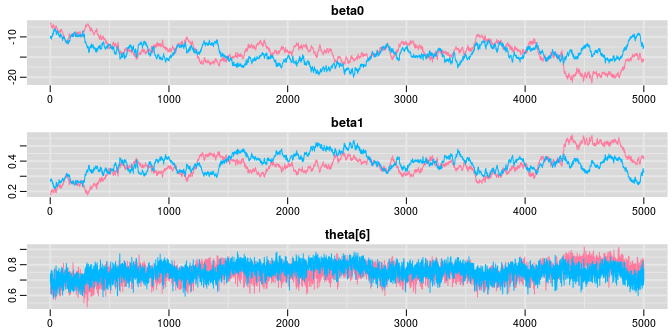

這一次練習題的主要目的是，通過使用OpenBUGS/JAGS來思考，它是如何從非共軛模型的事後概率分布中採集MCMC樣本的。這個過程和從共軛模型的事後概率分布中採樣有哪些不同。

思考前一次，第三章的課後練習題裏的(Chapter \@ref(BayesPrac03))新藥試驗的例子。還是用這個場景，但是我們這次實施8個不同的試驗，$i = 1,\dots,8$，其中第$i$次試驗有 $n_i$ 名患者，其中 $y_i$ 名患者的治療被認爲有顯著療效。每次試驗中的 $n_i$ 名患者都給予相同劑量$x_i$，但是不同於其他次試驗時的使用劑量的藥物。此時我們把注意力轉到，評估治療有效百分比 $\theta_i$，和劑量$x_i$之間的關系上來。

一種方法是，我們可以對這個數據擬合一個邏輯回歸模型，在貝葉斯統計學中，邏輯回歸模型的擬合方式如下：

$$
\begin{aligned}
y_i & \sim \text{Binomial}(\theta_i, n_i) \\ 
\text{logit}(\theta_i) & = \beta_0 +  \beta_1 x_i
\end{aligned}
$$

其中 $\text{logit}$ 轉換是方便地把 $0\sim1$ 之間的百分比變量轉化成爲 $-\infty, +\infty$ 變量的鏈接方程。另外，貝葉斯統計學模型中，我們需要給所有模型中出現的未知參數，提供一個先驗概率分布。在上面這個模型中，我們給有效百分比 $\theta_i$ 定義了一個回歸方程式，因此，我們需要給這個回歸方程式的回歸系數(regression coefficients)指定先驗概率分布。我們先使用模糊的，沒有太多信息的先驗概率分布，例如均一分布：

$$
\begin{aligned}
\beta_0 & \sim \text{Uniform}(-100, 100)\\
\beta_1 & \sim \text{Uniform}(-100, 100)
\end{aligned}
$$


1.首先，用第三章練習題中的新藥試驗模型，使用 $\text{beta}(1, 1)$ 作爲 $\theta$的先驗概率分布（已知$\text{beta}(1, 1)$其實等價於一個均一分布）。設定監測未知參數 `theta`，執行1000次MCMC運算之後，繪制 `theta` 的歷史痕跡。下列模型代碼保存爲 `MCdrugPractical04.txt` 文檔。


```
# original conjugate drug model with uniform beta(0,1) prior on theta

model{
    theta ~ dbeta(1,1)     # prior distribution
    y     ~ dbin(theta, 20)# sampling distribution for 20 observed patients
    #y    <- 15
}
```

```{r OpenBUGSPractical0400, cache=FALSE, fig.width=7, fig.height=3, fig.cap='History plot showing 1000 samples of theta', fig.align='center', out.width='80%', message=TRUE, warning=FALSE}


# Codes for R2JAGS

Dat <- list(
y = c(15)                    
)

# fit use R2jags package

post.jags <- jags(
  data = Dat,
  parameters.to.save = c("theta"),
  n.iter = 1100,
  model.file = paste(bugpath, 
                     "/backupfiles/MCdrugPractical04.txt", 
                     sep = ""),
  n.chains = 1,
  n.thin = 1,
  n.burnin = 100,
  progress.bar = "none")

print(post.jags)

```

2. 下面我們來看題幹中的邏輯回歸模型的BUGS版本：

```
model {
	   for( i in 1 : N ) { # loop thorugh experiments
		    y[i] ~ dbin(theta[i],n[i])
 	       logit(theta[i]) <- beta0 + beta1 * x[i]    
	   }
	   # priors
	   beta0 ~ dunif(-100, 100)
	   beta1 ~ dunif(-100, 100)
}
```

試驗獲得觀察數據如下：

```
list(y = c(1, 3, 6, 8, 11, 15, 17, 19), 
     n = c(20, 20, 20, 20, 20, 20, 20, 20), 
     x = c(30, 32, 34, 36, 38, 40, 42, 44), 
     N = 8 )
```

3. 嘗試使用JAGS/OpenBUGS來跑這個模型。記得你需要把數據加載到軟件裏面去。

```{r OpenBUGSPractical0401, cache=FALSE, message=TRUE, warning=FALSE}

# Codes for R2JAGS


Dat <- list(
     y = c(1, 3, 6, 8, 11, 15, 17, 19), 
     n = c(20, 20, 20, 20, 20, 20, 20, 20), 
     x = c(30, 32, 34, 36, 38, 40, 42, 44), 
     N = 8 
)

# fit use R2jags package

post.jags <- jags(
  data = Dat,
  parameters.to.save = c("beta0", "beta1", "theta[6]"),
  n.iter = 1100,
  model.file = paste(bugpath, 
                     "/backupfiles/logistic-reg-model.txt", 
                     sep = ""),
  n.chains = 1,
  n.thin = 1,
  n.burnin = 100,
  progress.bar = "none")

print(post.jags)

```

4. 對未知參數，也就是邏輯回歸的回歸系數 `beta0, beta1`，和第六次試驗的治療成功百分比 `theta[6]` 設定監測追蹤其採樣軌跡。試着執行1000次MCMC採樣，把這三個跟蹤的未知參數的採樣歷史軌跡繪制下來。


```{r OpenBUGSPractical0402, cache=FALSE, fig.width=7, fig.height=3, fig.cap='History plot showing 1000 samples of beta0', fig.align='center', out.width='80%', message=TRUE, warning=FALSE}

#### PLOT THE MCMC CHAINS:
mcmcplots::traplot(post.jags, c("beta0", "beta1", "theta[6]"))

```


對這三個位置變量的採樣歷史繪制痕跡圖之後，你發現每個參數期初的一些採樣是十分不穩定的，有很大的變動(variability)。

5. 接下來，我們給上面同一個邏輯回歸模型增加另一條MCMC採樣鏈，重復跑相同的模型1000次，繪制同樣是這三個未知參數的事後分布MCMC採樣歷史痕跡圖。


```{r OpenBUGSPractical0405, cache=FALSE, fig.width=7, fig.height=7, fig.cap='History plot showing 1000 samples of beta0, beta1, and theta[6]', fig.align='center', out.width='80%', message=FALSE, warning=FALSE, echo=TRUE}

# fit use R2jags package

post.jags <- jags(
  data = Dat,
  parameters.to.save = c("beta0", "beta1", "theta[6]"),
  n.iter = 1000,
  model.file = paste(bugpath, 
                     "/backupfiles/logistic-reg-model.txt", 
                     sep = ""),
  n.chains = 2,
  n.thin = 1,
  n.burnin = 0,
  progress.bar = "none")

mcmcplots::traplot(post.jags, c("beta0", "beta1", "theta[6]"))
```


使用兩個不同的起始值作爲MCMC的採樣起點時，每個未知參數分別獲得兩條不同顏色的歷史痕跡圖。和之前只有一條MCMC採樣鏈時一樣，採樣的起始部分(大約100次左右)都有一些不穩定的值。等到100次採樣過後，我們發現每個參數的採樣結果都趨向於比較穩定，也就是方差，變化小了很多。但是藍色鏈，紅色鏈一直到200-300次採樣之後才逐漸互相交叉重疊。下面的圖把起初的500次採樣刨除了之後重新對每個未知參數的MCMC採樣繪制歷史痕跡。

```{r OpenBUGSPractical0407, cache=FALSE, fig.width=4, fig.height=4, fig.cap='History plot showing 1000 samples of beta0, beta1, and theta[6], iteration between 501-1000', fig.align='center', out.width='80%', message=FALSE, warning=FALSE, echo=TRUE}
# samplesHistory("*", mfrow = c(3,1), beg = 501, ask = FALSE)
Simulated <- coda::as.mcmc(post.jags)
ggSample <- ggs(Simulated)

ggSample %>% 
  filter(Iteration >= 500 & Parameter %in% c("beta0", "beta1", "theta[6]")) %>% 
  ggs_traceplot()
```

500-1000次之間的隨機採樣被放大了觀察之後，我們發現 `beta0, beta1` 的兩條MCMC鏈條的重疊程度並不理想，不像`theta[6]`那樣呈現令人滿意地重疊，兩條採樣鏈上下扭動，且在一些地方差異較大。

繪制每個參數的MCMC鏈的自相關圖 (autocorrelation)，下面的圖中只繪制了500-1000次範圍內採樣的自相關圖。


```{r OpenBUGSPractical040808, cache=FALSE, fig.width=5, fig.height=3, fig.cap='Autocorrelation plot for beta0', fig.align='center', out.width='80%', message=FALSE, warning=FALSE, echo=TRUE}

ggSample %>% 
  filter(Iteration >= 500 & Parameter %in% c("beta0", "beta1", "theta[6]")) %>% 
  ggs_autocorrelation()

```


其中 `theta[6]` 可以在視覺上認爲這些樣本大致上沒有自相關。但是 `beta0, beta1` 的自相關圖提示相隔50次以上的採樣之間仍然有較強的，不能被忽視的自相關。這一點在 `beta0, beta1`各自的歷史痕跡圖中也能看出來因爲他們各自的痕跡圖提示採樣時的跳躍並不顯著，相對照的， `theta[6]`的採樣的跳躍就比較顯著，反映了這個未知參數事後概率分布採樣時的連續互相獨立性較好(near-independence of the values being sampled at consecutive iterations.)。


6. 重新在OpenBUGS裏跑這個邏輯回歸模型，這一次，嘗試自己給 `beta0, beta1` 設置起始值。然後更新模型，採集MCMC鏈樣本10000次。這次嘗試同時使用繪制歷史痕跡圖（視覺檢查），和計算Brooks-Gelman-Rubin診斷參數及其圖示來判斷事後概率分布採樣是否達到收斂。你能判斷這個模型需要拋出掉多少一開始採集的樣本嗎(burn-in)？

```{r OpenBUGSPractical0411, cache=FALSE, eval=FALSE, fig.width=7, fig.height=3.5, fig.cap='History plots based on first 10000 iterations.', fig.align='center', out.width='80%', message=TRUE, warning=FALSE, echo=TRUE}

Dat <- list(
     y = c(1, 3, 6, 8, 11, 15, 17, 19), 
     n = c(20, 20, 20, 20, 20, 20, 20, 20), 
     x = c(30, 32, 34, 36, 38, 40, 42, 44), 
     N = 8 
)

# fit use rjags package

# inits <- function (){
#   list (beta0=rnorm(1), beta1=runif(1) )
# }

post.jags <- jags(
  data = Dat,
  # inits = inits,
  parameters.to.save = c("beta0", "beta1", "theta[6]"),
  n.iter = 5000,
  model.file = paste(bugpath,
                     "/backupfiles/logistic-reg-model.txt",
                     sep = ""),
  n.chains = 2,
  n.thin = 1,
  n.burnin = 0,
  progress.bar = "none")

mcmcplots::traplot(post.jags, c("beta0", "beta1", "theta[6]"))
```

```{r OpenBUGSPractical0411101, cache=FALSE, echo=FALSE, fig.width=5, fig.cap='History plots based on first 10000 iterations.', fig.align='center', out.width='80%', message=FALSE, warning=FALSE}

```

```{r OpenBUGSPractical0412, cache=FALSE, fig.width=8, fig.cap='Brooks-Gelman-Rubin diagnostic graph', fig.align='center', out.width='80%', message=TRUE, warning=FALSE, echo=TRUE}
Simulated <- coda::as.mcmc(post.jags)
# postsamples <- buildMCMC("*")
gelman.diag(Simulated)
gelman.plot(Simulated)
```

從Gelman.plot的圖形可以看出，在2000次及以上的採集樣本過後，基本上應該可以認爲採集的樣本收斂於事後概率分布。

7. 確認了你想要刨除的初始樣本量(burn-in)，繼續再進行MCMC採樣直到獲得1,000,000個事後概率分布樣本。此時你對獲得的事後概率分布樣本量提供的參數估計精確度滿意否？嘗試報告此時獲得的參數們的事後均值，及其95%可信區間。


```{r OpenBUGSPractical04110000, cache=FALSE, message=FALSE, warning=FALSE, echo=TRUE, eval=TRUE}

Dat <- list(
     y = c(1,   3,  6,  8, 11, 15, 17, 19), 
     n = c(20, 20, 20, 20, 20, 20, 20, 20), 
     x = c(30, 32, 34, 36, 38, 40, 42, 44), 
     N = 8 
)

# inits <- function (){
#   list (beta0=rnorm(1), beta1=runif(1) )
# }

post.jags <- jags(
  data = Dat,
  # inits = inits,
  parameters.to.save = c("beta0", "beta1", "theta[6]"),
  n.iter = 502000,
  model.file = paste(bugpath,
                     "/backupfiles/logistic-reg-model.txt",
                     sep = ""),
  n.chains = 2,
  n.thin = 1,
  n.burnin = 2000,
  progress.bar = "none")

```

```
Compiling model graph
   Resolving undeclared variables
   Allocating nodes
Graph information:
   Observed stochastic nodes: 8
   Unobserved stochastic nodes: 2
   Total graph size: 53

Initializing model

Inference for Bugs model at "/home/ccwang/Documents/LSHTMlearningnote/backupfiles/logistic-reg-model.txt", fit using jags,
 2 chains, each with 502000 iterations (first 2000 discarded)
 n.sims = 1000000 iterations saved
         mu.vect sd.vect    2.5%     25%     50%     75%   97.5%  Rhat n.eff
beta0    -13.892   2.090 -18.257 -15.237 -13.788 -12.449 -10.042 1.001  3900
beta1      0.375   0.056   0.272   0.337   0.373   0.412   0.493 1.001  3100
theta[6]   0.752   0.048   0.652   0.720   0.754   0.786   0.841 1.001 10000
deviance  25.722   2.020  23.760  24.283  25.095  26.499  31.199 1.001  9600

For each parameter, n.eff is a crude measure of effective sample size,
and Rhat is the potential scale reduction factor (at convergence, Rhat=1).

DIC info (using the rule, pD = var(deviance)/2)
pD = 2.0 and DIC = 27.8
DIC is an estimate of expected predictive error (lower deviance is better).
```


8. 繪制此時`beta0,beta1`的自相關圖。

```{r OpenBUGSPractical0415, cache=FALSE, fig.width=7, fig.height=3, fig.cap='Autocorrelation plot for beta0', fig.align='center', out.width='80%', message=FALSE, warning=FALSE, echo=FALSE}
Simulated <- coda::as.mcmc(post.jags)
ggSample <- ggs(Simulated)

ggSample %>% 
  filter(Iteration >= 2001 & Parameter %in% c("beta0", "beta1")) %>% 
  ggs_autocorrelation()
```


```{r OpenBUGSPractical0417, cache=FALSE, fig.width=5, fig.height=5, fig.cap='The joint posterior distribution, scatter plot of beta0 and beta1.', fig.align='center', out.width='80%', message=FALSE, warning=FALSE, echo=FALSE}

Beta0 <- ggSample %>% 
  filter(Iteration >= 2001 & Parameter == "beta0")
Beta1 <- ggSample %>% 
  filter(Iteration >= 2001 & Parameter == "beta1")

plot(Beta0$value, Beta1$value, main="Scatterplot", 
  	xlab="beta0", ylab="beta1", pch=19, col=c(1,2))
```

此圖\@ref(fig:OpenBUGSPractical0417)提示我們該邏輯回歸模型的截距(intercept)`beta0`，和斜率(slope)`beta1`其實是高度相關的。這導致了未知參數(兩個回歸系數)的事後概率分布樣本高度內部相關(high autocorrealtion within the samples of each individual parameter)。這是他們效率低下，需要大量的採集樣本仍然無法滿足或者達到理想的收斂的主要原因。

9. 給邏輯回歸的回歸系數中心化之後的模型：我們來把兩個回歸系數的樣本中心化(centre the covariate $x$)。在BUGS語言中可以使用`x[i] - mean(x[])`的命令來把未知參數的事後概率分布MCMC採樣過程中心化。然後我們重復一下上面的計算過程，看結果有怎樣的變化。與前者的分析比較一下收斂所需要的時間和未知參數事後估計的效率差別。


```
# logistic regression model with centred covariate
model{
  for(i in 1:N){# loop through experiments
              y[i] ~ dbin(theta[i], n[i])
   logit(theta[i]) <- beta0 + beta1 * (x[i] - mean(x[]))
  }
  # priors 
  beta0 ~ dunif(-100, 100)
  beta1 ~ dunif(-100, 100)
}
```


```{r OpenBUGSPractical0418, cache=FALSE, fig.width=7, fig.height=3.5, fig.cap='History plots based on first 10000 iterations with centred covariates.', fig.align='center', out.width='80%', message=TRUE, warning=FALSE, echo=TRUE}
# JAGS codes:
# 
Dat <- list(
     y = c(1, 3, 6, 8, 11, 15, 17, 19), 
     n = c(20, 20, 20, 20, 20, 20, 20, 20), 
     x = c(30, 32, 34, 36, 38, 40, 42, 44), 
     N = 8 
)

# step 1 check model
jagsModel <- jags.model(
                     file = paste(bugpath, 
                                  "/backupfiles/logistic-reg-model-centred.txt",
                                  sep = ""),
                     data = Dat,
                     n.chains = 2, 
                     # inits = inits,
                     quiet = TRUE)
# Step 2 update 10000 iterations

update(jagsModel, n.iter = 1, progress.bar = "none")

# Step 3 set monitor variables

codaSamples <- coda.samples(
  jagsModel, variable.names = c("beta0", "beta1", "theta[6]"),
  n.iter = 10000, progress.bar = "none"
)

mcmcplots::traplot(codaSamples, c("beta0", "beta1", "theta[6]"))
```


用中心化之後的模型我們發現需要10000或更多的起始樣本來達到事後概率分布的收斂。BGR診斷圖 \@ref(fig:OpenBUGSPractical0419) 也提示我們大概在10000次之後的重復採樣才能達到收斂。所以我們決定要刨除起始10000次採集的樣本。(burn-in = 10000)


```{r OpenBUGSPractical0419, cache=FALSE, fig.width=8, fig.cap='Brooks-Gelman-Rubin diagnostic graph', fig.align='center', out.width='80%', message=TRUE, warning=FALSE, echo=TRUE}
gelman.diag(codaSamples)
gelman.plot(codaSamples)
```

刨除了起始10000次採集的樣本之後，剩餘的MCMC樣本的自相關也基本都降至0，說明這時候採集的事後概率分布樣本基本上都可以認爲是相互獨立的樣本。此時有效樣本量基本上約等於採集到的樣本量。

```{r OpenBUGSPractical0420, cache=FALSE, message=FALSE, warning=FALSE, echo=TRUE}
# R2JAGS codes
Dat <- list(
     y = c(1, 3, 6, 8, 11, 15, 17, 19), 
     n = c(20, 20, 20, 20, 20, 20, 20, 20), 
     x = c(30, 32, 34, 36, 38, 40, 42, 44), 
     N = 8 
)
post.jags <- jags(
  data = Dat,
  # inits = inits,
  parameters.to.save = c("beta0", "beta1", "theta[6]"),
  n.iter = 20000,
  model.file = paste(bugpath,
                     "/backupfiles/logistic-reg-model-centred.txt",
                     sep = ""),
  n.chains = 2,
  n.thin = 1,
  n.burnin = 10000,
  progress.bar = "none")


mcmcplots::traplot(post.jags, c("beta0", "beta1", "theta[6]"))
print(post.jags)

Simulated <- coda::as.mcmc(post.jags)
ggSample <- ggs(Simulated)

ggSample %>% 
  filter(Iteration >= 2001 & Parameter %in% c("beta0", "beta1")) %>% 
  ggs_autocorrelation()
```


10. 這時候我們獲得的回歸系數的事後估計的均值 `beta1 = 0.377`，和它的95%可信區間，`0.271, 0.492`。它其實是藥物劑量每增加1mg，隨之增加的藥物有效百分比的對數比值比 (log-odds-ratio of a positive response per 1 mg increase in dose.)，你有沒有發現其實我們很難解釋這個變量的實際含義呢？有沒有什麼辦法可以來改善這個結果，讓它更加容易讓人明白呢？

11. 想辦法在未知參數被中心的話邏輯回歸模型中增加新的語句，生成一些新的容易讓人解釋的變量，改善模型的易解釋程度。也許你可以把對數比值比轉換成比值比，你也許可以自己算一下在哪種劑量條件下可以讓95%的患者都有治療療效(ED95)：

$$
\begin{aligned}
\text{logit}0.95 & = \beta_0 + \beta_1(ED95 - \bar x) \\ 
\Rightarrow ED95 & = (\text{logit}0.95 - \beta_0)/\beta_1 + \bar x
\end{aligned}
$$

```
# logistic regression model with centred covariate 
# and added statements
model{
  for(i in 1:N){# loop through experiments
              y[i] ~ dbin(theta[i], n[i])
   logit(theta[i]) <- beta0 + beta1 * (x[i] - mean(x[]))
  }
  # priors 
  beta0 ~ dunif(-100, 100)
  beta1 ~ dunif(-100, 100)
  
  # generated values
  OR <- exp(beta1) # odds ratio of positive response per 1 mg increase in dose
  ED95 <- (logit(0.95) - beta0)/beta1 + mean(x[]) # dose that gives 95% of maximal response
  logit(P35) <- beta0 + beta1 * (35 - mean(x[])) # probability of positive reaction if given 35mg drugs
}
```


```{r OpenBUGSPractical0424, message=TRUE, warning=FALSE, echo=TRUE, eval=TRUE, cache=TRUE}

# R2JAGS codes:
Dat <- list(
     y = c(1, 3, 6, 8, 11, 15, 17, 19), 
     n = c(20, 20, 20, 20, 20, 20, 20, 20), 
     x = c(30, 32, 34, 36, 38, 40, 42, 44), 
     N = 8 
)

post.jags <- jags(
  data = Dat,
  # inits = inits,
  parameters.to.save = c("ED95", "OR", "P35", "beta0", "beta1"),
  n.iter = 20000,
  model.file = paste(bugpath,
                     "/backupfiles/logistic-reg-model-centred-stat.txt",
                     sep = ""),
  n.chains = 2,
  n.thin = 1,
  n.burnin = 10000,
  progress.bar = "none")


# mcmcplots::traplot(post.jags, c("beta0", "beta1", "theta[6]"))
print(post.jags)
```


所以，藥物每增加劑量1mg，有療效的比值比是OR = 1.46 (95%CrI: 1.31, 1.63)。能夠達到95%患者都有療效的劑量是 45.02 mg (95% CrI: 42.7, 48.2 mg)。如果給予患者藥物劑量爲 35 mg，患者的疼痛能夠得到緩解(有療效)的概率是 32.3% (95% CrI: 22.7%, 42.3%)。跟着看到這裏的你是不是也覺得貝葉斯的結果和過程能夠更加豐富地回答我們想知道的問題呢？ 

```{r R-OpenBUGSPractical0425, cache=FALSE, fig.width=3.5, fig.height=5, fig.cap='Posterior density plots of ED95, OR, and P35.', fig.align='center', out.width='80%', message=TRUE, warning=FALSE}
#### PLOT THE DENSITY and HISTOGRAMS OF THE SAMPLED VALUES
par(mfrow=c(3,1))
Simulated <- coda::as.mcmc(post.jags)
ggSample <- ggs(Simulated)

ED95 <- ggSample %>% 
  filter(Parameter == "ED95")
OR <- ggSample %>% 
  filter(Parameter == "OR")
P35 <- ggSample %>% 
  filter(Parameter == "P35")

plot(density(ED95$value), main = "ED95 sample", 
     ylab = "P(ED95)", xlab = "Distribution of ED95", col = "red")
plot(density(OR$value), main = "OR sample", 
     ylab = "P(OR)", xlab = "Distribution of OR", col = "red")
plot(density(P35$value), main = "P35 sample", 
     ylab = "P(P35)", xlab = "Distribution of P35", col = "red")

```