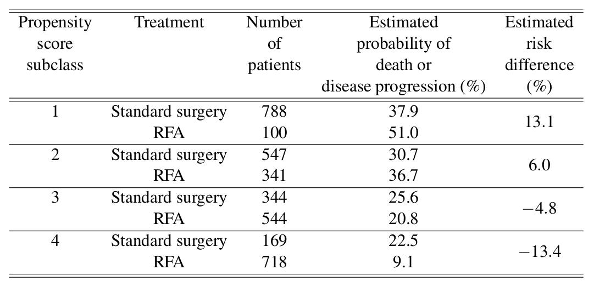

# (PART) 因果推斷 Causal Inference {-}

> All models are wrong, but some are useful. 
> 
> --- George E. P. Box

# Causal Languages 因果推斷的語法

## 當我們在談論因果推斷的時候，我們在談論什麼？

衆多的醫學研究，科研工作者們苦苦收集數據，都是爲了能夠給觀察到的現象作出**因果關系的結論**。研究者帶着的研究問題通常是: 

- 這個治療方案有沒有效果？
- 暴露在某種可能有害的因素中到底有沒有危險？
- 提出的新的衛生政策到底能不能解決實際的醫療問題？

這些都是內在爲因果關系的設問。隨機對照實驗，之所以要隨機設計，且對其**隨機性**要求精準且苛刻，就是爲了一個能夠清晰可靠地作出因果關系的結論。在很多流行病學研究中，隨機設計可能因爲倫理因素不能使用。但每一個精心設計的實驗或者觀察性研究，其終極目的都是爲了解答暴露和結果之間到底有沒有因果關系這一設問。

這裏我們用 “因果推斷” 來命名一類 “專門以探尋因果關系爲目的的” 統計學方法。其與傳統的統計學方法最大的不同點在於因果推斷用一套**正式的科學語言**，來解釋現象中到底有沒有因果關系。

之所以發明這一套因果推斷專用的科學語言，有這樣幾個目的: 

1. 更清晰地描述，我們到底要估計的 (estimate) 是什麼。
2. 更徹底地強調，因果推斷結論背後的統計學前提和假設。
3. 建立在前兩條前提的基礎上，我們可以使用專門爲統計推斷設計的新的統計學技巧，達到爲因果推斷提供證據的目的。


因果推斷包括三個部分: 

1. 清晰描述因果關系概念的正式科學語言 (causal language)。
2. 因果關系示意圖 (causal diagram) -- 清晰地展示研究者對變量之間存在的所有可能因果關系的假設，在實驗設計，和數據分析兩個階段都需要用到。
3. 因果關系統計學方法 (causal inference methods) -- 從獲得的數據中，用和傳統方法不同的假設，作出因果關系的推斷。


## 傳統的統計學方法

用一個簡單實例來理解傳統統計學方法實際上做的是什麼: 


```{example}
臨牀上認爲，給有貧血的患者靜脈內補充鐵劑是進行髖關節置換手術 (hip replacement operation) 之前建議的手段。研究者收集了某個醫院 2009 年至 2014 年間接受髖關節置換手術且有貧血的患者數據。在這個研究中，暴露變量 (exposure) 是患者是否在術前接受了靜脈內鐵劑補充，結果變量是髖關節置換手術之後，患者是否存活時間達到 90 天及以上。其他同時收集的數據有: 年齡，性別，伴隨疾病 (心血管疾病，糖尿病，腎病)，手術過程中是否接受了外來血源的輸血，以及住院時間。
```


### 初步分析 

很多人第一步想到的，一定是先制作 2×2 的暴露 (FeIV) 和結果 (Death90) 的表格: 

```{r CI-tab1-1, echo=FALSE, eval = TRUE, cache=TRUE}
dt <- read.csv("backupfiles/ci-tab1-1.csv", header = T)
names(dt) <- c(" ", " ", "0", "1")
kable(dt, digits = 3, row.names = FALSE, align = "c",
              caption = NULL, format = "html") %>%
kable_styling(bootstrap_options = c("striped", "condensed"),
        position = "center", full_width = FALSE) %>%
add_header_above(c(" " = 2, "Death90" = 2)) %>%
  column_spec(c(1,2), bold = T) %>%
  collapse_rows(columns = 1:2)
```


從這個四格表我們計算的初步對數比值比是: 0.04 (95% CI: -0.12, 0.19)。

請問在這個對數比值比的計算過程中，我們估計的到底是什麼？ 這裏的被估計量 (estimand) 是: 

$$
\log \text{OR}_{Y|X} = \log\{\frac{\text{Pr}(Y=1 | X = 1)}{1- \text{Pr}(Y = 1|X = 1)}\} - \log\{\frac{\text{Pr}(Y=1 | X = 0)}{1- \text{Pr}(Y = 1|X = 0)}\}
$$

```{definition, label="estimand"}
<br>
1. Estimand (被估計量): 我們想要知道的到底是什麼，例如，英國人口中收縮期血壓的平均值，這是一個無法知道，但是肯定存在確定量的量 (unknown fixed quantity)。<br>
2. Estimator (估計量): 數據用來計算被估計量的某種**方程**，例如，隨機從街上找來100個人，測量他們的血壓，求出來的平均值，這是一個隨機變量 (random variable)，會隨着隨機挑選的樣本而變化。<br>
3. Estimate (估計): 給定數據下，計算獲得的具體的量，例如，我做了隨機抽取100名英國人血壓測量的實驗，獲得 130.4 mmHg 這個平均收縮期血壓的測量值，這是一個可以計算成爲已知的確定量 (known fixed quantity)。
```


### 混雜

我們知道，單純這樣簡單初步計算獲得的對數比值比，我們是無法對其作出因果關系的解釋的，因爲通常這樣的分析都忽略掉了潛在的混雜。在目前爲止我們學習過的傳統統計學方法中，混雜被我們粗略地定義成: "和暴露，結果兩個變量同時且獨立地相關，但是確定不存在在暴露和結果的因果通路上的變量 (associated with the exposure and independently associated with the outcome, without being on the causal pathway from exposure to outcome)"，下一章我們會看到，這其實是一個不能令人滿意的定義。

例如，可能之所以有些病人在髖關節置換術之前會被提供靜脈鐵劑支持，其原因不僅是貧血，還可能他們本身體質虛弱，年紀較大，或者是貧血得太嚴重，或者還有許多其他的並發症，那麼表面看起來靜脈鐵劑支持，和術後90天生存率沒有關系的對數比值比就成了一個表面現象。這些因素會混淆，甚至是掩蓋靜脈鐵劑可能對貧血患者的潛在保護作用。此時我們說初步分析的對數比值比被混雜偏倚所影響 (suffer from confounding bias)。(關於偏倚在統計推斷中的概念，滾回章節 \@ref(bias)。)

當我們說，初步分析的對數比值比被混雜偏倚影響，那麼其實是在說，我們心裏想要的那個被估計量 (estimand)，和實際計算中使用的被估計量是兩個不同的概念。我們心裏想要的那個--沒有被偏倚影響的--被估計量，是可以有因果關系的推論的。所以偏倚，就是一種漸進偏倚 (an asymptotic bias)，它是我們心裏想要的那個被估計量，和實際被用到的被估計量之間的差。

### 以共變量爲條件 conditioning on covariates 

對於混雜偏倚，常見的做法是要麼進行分層分析，或者直接丟到回歸模型中去做調整，這樣的做法，其實是把我們使用的被估計量從一個初步對數比值比，改成了一個條件對數比值比: 

$$
\log\text{OR}_{Y|X\cdot C} = \log\{\frac{\text{Pr}(Y=1 | X = 1, \mathbf{C})}{1- \text{Pr}(Y = 1|X = 1, \mathbf{C})}\} - \log\{\frac{\text{Pr}(Y=1 | X = 0, \mathbf{C})}{1- \text{Pr}(Y = 1|X = 0, \mathbf{C})}\}
$$

其中，$\mathbf{C}$ 就是被調整的變量組成的向量。

**應該調整哪些變量？**

從簡單的理解來看，輸血與否，和住院時間長短，應該是處在暴露和結果兩個變量的因果通路之上的，所以不應該調整這兩個變量。所以，隨着這個思路，我們雖然不能調整輸血與否，和住院時間長短兩個變量，但是可以調整諸如年齡，性別，心血管疾病，糖尿病，腎病，貧血嚴重程度，和手術的種類等。

調整了上述變量之後，我們獲得的條件對數比值比 (conditional log-odds ratio) 是 -0.24 (95%CI -0.41, -0.07)。

**可以給予這個條件對數比值比以因果關系的解釋嗎？**

顯然，由於還有其他我們不知道的因素，可能混淆這裏的暴露和結果變量 (我們沒有收集)，所以此時漸進偏倚定義是上面的這個條件對數比值比和我們心裏那個真實想要測量的因果被估計量 (causal estimand) 之間的差: 

$$
\log\text{OR}_{Y|X\cdot C} - \{ \text{True value of some causally -interpretable estimand} \}
$$

在哪些前提條件下，這個漸進偏倚可以被認爲等於零？此時我們需要因果推斷的科學定義和語言來幫助我們理解。

## 更加正規的方法
### 因果推斷使用的語言

**概率與統計學**

概率論和統計學中使用的詞匯和語言，允許我們估計，描述很多觀察變量之間的聯合分布 (joint distribution)，例如均值，方差，協方差，四分位，回歸系數，相關系數等。

但是這一標準的統計學語言，卻無法描述這些聯合分布在受到外在影響或者幹預 (external intervention) 之後，會發生怎樣的變化。用這裏使用的例子來說就是，當所有患者都被提供了靜脈內鐵劑支持，(注意到這是和現實情況不一樣的)
 患者的生存概率會是多少？
 

因果關系的思考，其實是在追問這樣一個問題: 當暴露變量 $X$，可以改變，並且**以與我們觀察到的相反的形式出現**，那麼結果變量 $Y$ 會發生怎樣的變化？本書，我們使用 [@Neyman1923] 當年創立，後來被 [@Rubin1974] 發展的概念: 潛在結果框架 (potential outcome framework)。

```{definition}
**潛在結果 Potential outcome**: 定義 $Y(x)$ 爲當暴露變量 $X$ 取假設的值 (x) 時，結果變量的取值。
```

對於一個而二分類暴露變量 $X$，每個個體/研究對象，我們賦予它一個潛在的可能取值結果的概念: $Y(0)$ 和 $Y(1)$。$Y(0)$ 的意思是當暴露變量是 $0$ 的時候該對象可能的取值，$Y(1)$ 的意思是當暴露變量是 $1$ 的時候，該對象可能的取值。但是，在現實情況下，我們只能觀察到二者中的一種結果。在我們的例題中，當一個患者真的接受了靜脈鐵劑補充，那麼他/她的觀察結果 $Y = Y(1)$，也就是此時觀察結果等於暴露爲 $(1)$ 時的潛在結果 $Y(1)$。對與這個患者來說，他/她在沒有接受經脈鐵劑補充的情況下的另一種潛在結果 $Y(0)$ 是沒有被觀測到的。但是，這個患者的潛在結果 $Y(0)$，表示的是他/她如果接受沒有接受靜脈鐵劑補充的話，他/她在90天時死亡/存活的**潛在結果**。

```{definition}
**用潛在結果表示邊緣和條件因果對比 marginal and conditional causal contrast:** <br>
邊緣對比: $$E\{Y(1)\} - E\{ Y(0) \}$$ 
條件對比: $$E\{ Y(1) | \mathbf{V=v} \} - E\{ Y(0) | \mathbf{V=v} \}$$
```

這種潛在結果的統計框架，曾經被 [@Dawid2000] 批判爲一種不恰當的方法。以爲潛在結果框架建議說存在另一個完全不存在的平行宇宙，使得觀察對象在一個空間裏做一件事，在另一個空間裏做一件相反的事情，看會發生怎樣的結果，這實際是在說存在這種潛在的完美聯合分布。另外，我們會在第四章中看見的，在潛在結果的框架下，我們可能問的問題是，當所有人都接受了暴露變量時，暴露和結果之間的因果效應的平均值: 

$$
E\{ Y(1) - Y(0) | X = 1 \}
$$


潛在結果框架不是完美的。但是它非常實用: 

1. 使不確定性變得明確而清晰;
2. 把研究的問題變得更加容易理解; 
3. 能夠保證研究者明確做因果推斷時的前提條件; 
4. 改善實驗設計; 
5. 有助於設計更能回答研究問題的統計分析方案;
6. 可以給結果恰當的因果關系解釋。

但是我們需要注意的是: 

1. 不要過度相信你做的因果推斷的前提假設是正確的 (over confidence in assumptions); 
2. 不要錯誤的解讀你的分析結果。

### 因果推斷的被估計量 causal estimands

於是，現在用這些重新定義過的名詞和語言，我們來描述 (二分類結果變量在) 因果推斷中的被估計量: 


邊緣被估計量 (marginal estimands): 

$$
\begin{aligned}
\text{Potential risk difference: } & \text{Pr}\{Y(1) = 1| \mathbf{V=v}\} - \text{Pr}\{Y(0) = 1| \mathbf{V=v}\} \\
\text{Potential risk ratio: } & \frac{\text{Pr}\{ Y(1) = 1 | \mathbf{V=v}\}}{\text{Pr}\{Y(0) = 1 | \mathbf{V=v}\} } \\
\text{Potential log odds ratio: } & \\
                \log[\frac{ \text{Pr}\{Y(1) = 1| \mathbf{V=v}\}}{1- \text{Pr}\{Y(1) = 1| \mathbf{V=v}\}}] & - \log[\frac{\text{Pr}\{Y(0) = 1| \mathbf{V=v} \}}{1-\text{Pr}\{Y(0) = 1| \mathbf{V=v} \}}]
\end{aligned}
$$

條件被估計量: 

$$
\begin{aligned}
\text{Potential risk difference: } & \text{Pr}\{Y(1) = 1\} - \text{Pr}\{Y(0) = 1\} \\
\text{Potential risk ratio: } & \frac{\text{Pr}\{ Y(1) = 1 \}}{\text{Pr\{Y(0) = 1 \}}} \\
\text{Potential log odds ratio: } & \\
                \log[\frac{ \text{Pr}\{Y(1) = 1\}}{1- \text{Pr}\{Y(1) = 1\}}] & - \log[\frac{\text{Pr\{Y(0) = 1 \}}}{1-\text{Pr\{Y(0) = 1 \}}}]
\end{aligned}
$$


### 鑑定因果推斷時的前提假設 assumptions for identification

- **無相互幹擾 no interference**

$Y_i(x)$ 表示的是，如果第 $i$ 個個體的暴露變量被設定爲 $x$ 時，結果變量的值。所以是 $X_i$ 被設定成爲 $x (i = 1, \cdots, n)$ 時， $Y_i$ 的潛在結果。此時，我們已經有了一個前提假設，那就是，潛在結果 $Y_i$，和另一個個體的潛在暴露 $X_j (j\neq i)$ 是相互獨立的。這個前提被稱爲無相互幹擾前提。這個前提，在暴露變量是某些特殊情況 (如注射疫苗) 的情況下，是無法成立的。因爲人羣中如果有些人注射了疫苗，同樣也能保護那些沒有注射疫苗的人。

- **一致性 consistency**

$$
X_i = x \Rightarrow Y_i = Y_i(x)
$$

一致性的含義是，對於某個觀察對象來說，他/她的暴露變量是 $x$ 時，觀測到的結果變量的觀測值 $Y_i$，和在**虛擬世界中**，該觀察對象接受潛在 $(x)$ 暴露變量時獲得的潛在結果 $Y_i(x)$，是一樣的。更具體地說: 

1. 暴露變量的定義，要清晰明確。
2. 爲了保持一致性，也就是在實際實驗中，如果暴露變量是 $x$，那麼你觀察到的結果 $Y$，必須和理論討論的虛擬世界中我們預想的那樣潛在變量 $(x)$ 導致的潛在結果 $Y(x)$ 是相同的。

在臨牀試驗的設定下，用本文一開始的靜脈鐵劑補充例子來說明就是，我們構築的潛在世界框架下的幹預手段 (靜脈鐵劑補充)，對患者起到的不論是積極的還是負面的作用，它的理論效果，和我們在實際現實世界中觀察到的對患者進行靜脈鐵劑補充起到的效果，是相同的。

在非臨牀試驗的設定下，一致性有許多值得探討的地方。假如，潛在暴露變量是體質指數 (BMI)，這時候的一致性前提就十分微妙。因爲能夠改變 BMI (運動，飲食，服藥，接受抽脂手術，吸煙，吸毒，甚至是截肢)，以及BMI變化導致的結果 (如心血管疾病) 途徑非常多。所以，當我們在這種觀察實驗的設定下，寫下某個潛在暴露量 X (BMI = 20) 時的潛在結果 Y 時，就必須把暴露變量達到 20 的特定條件指明才可以 (need to be clear under what sort of intervention we imagine that BMI is set to 20)。所以，在非臨牀試驗的觀察性研究中，如果探討的是類似 BMI 這樣的暴露變量，那麼在我們想象的平行世界中對BMI造成影響的因素將會和現實世界一樣是非常復雜的，單一的想象幹預，如抽脂手術，不可能滿足**一致性**的前提假設。所以，觀察對象的 BMI 達到 20 的條件，更加合理的是多種方法的組合 (it is more likely that the individuals in our observational study achieved their different BMI level through a combination of different ways.)，那麼在一致性的前提下，在那個我們想象出來的平行世界裏，潛在暴露 BMI 獲得的幹預，就是各種和 BMI 有關的所有變量。

- **條件可置換性 conditional exchangeability**

第三個前提假設是條件可置換性:

$$
Y(x) \perp\perp X |\mathbf{C}, \forall x
$$


$\perp\perp$ 表示條件獨立 (conditional independence)，所以 $A\perp\perp B|C$ 的正確讀法是: "在C的條件下，A條件獨立於B"。$A\perp\perp B$ 的意思就是， A 和 B 之間互爲 (邊際 marginally) 獨立。

在條件向量 $\mathbf{C}$ 的條件下，觀測對象的實際暴露狀況 $X$ 和他/她/它的所有潛在結果之間相互獨立。


我們可以把第三個前提條件設想爲: 潛在結果 $Y(x)$ 已經能夠把對象身上所有的和結果 $Y$ 相關的特點都包含進來，唯一不包含的是他/她/它在現實世界中的觀測暴露變量。也就是，如果我們知道潛在結果 $Y(0), Y(1)$，且我們知道 $X$，那麼我們就可以知道 Y，因爲 $Y = XY(1) + (1-X) Y(0)$。


```{example}
還是靜脈鐵劑補充的例子，如果我們手裏拿到的數據如下表。一共只有24名患者，假定只有一個條件變量 C (貧血嚴重與否)，表格中羅列的是觀察變量 $X,Y,C$，同時還羅列了兩個平行世界的潛在結果變量 $Y(1), Y(0)$。這裏我們爲了解釋條件可置換性，我們先假裝真的可以獲得所有的潛在結果，實際情況下是不可能的。
```


```{r CI-tab1-2, echo=FALSE, eval = TRUE, cache=TRUE}
dt <- read.csv("backupfiles/ci-tab1-2.csv", header = T)
names(dt) <- c("Patient ID", "X", "Y", "C", "Y(0)", "Y(1)")
kable(dt, digits = 3, row.names = FALSE, align = "c",
              caption = NULL, format = "html") %>%
kable_styling(bootstrap_options = c("striped", "condensed"),
        position = "center", full_width = FALSE)  %>%
    scroll_box(width = "400px", height = "500px", extra_css="margin-left: auto; margin-right: auto;")
```

在這個表格的數據中，我們注意到一致性的前提得到滿足，因爲對於每個 $X=1$ 的研究對象 $Y = Y(1)$，對於每個 $X=0$ 的研究對象 $Y=Y(0)$。

- 邊際概率 marginal probability: 

接下來，第一步，假設我們的數據中沒有條件變量 C，我們來看看數據是否能滿足可置換性 ($Y(0), Y(1)$ 和 $X$ 互相獨立)。

$$
\begin{aligned}
\text{Pr}\{ Y(0)=1|X=1 \} &= \frac{2}{3}, \;\; \text{Pr}\{ Y(0)=1|X=0 \} = \frac{7}{12} \\
\text{Pr}\{ Y(1)=1|X=1 \} &= \frac{5}{12}, \;\; \text{Pr}\{ Y(1)=1|X=0 \} = \frac{1}{3}
\end{aligned}
$$

這裏條件概率計算的結果告訴我們，邊際概率此時不具有可置換性，因爲潛在結果變量 $Y(0) = 1$ 的概率取決與 觀測暴露變量 $X$。

- 條件概率 conditional probability: 

$$
\begin{aligned}
\text{Pr}\{ Y(0) = 1 | X=1, C=0\} & = \frac{1}{2} \;\; \text{Pr}\{Y(0) = 1 | X=0, C=0 \} = \frac{1}{2}\\ 
\text{Pr}\{ Y(1) = 1 | X=1, C=0\} & = \frac{1}{4} \;\; \text{Pr}\{ Y(1) = 1 | X=0, C=0\}  = \frac{1}{4} \\
\text{Pr}\{ Y(0) = 1 | X=1, C=1\} & = \frac{3}{4} \;\; \text{Pr}\{ Y(0) = 1 | X=0, C=1\}  = \frac{3}{4} \\
\text{Pr}\{ Y(1) = 1 | X=1, C=1\} & = \frac{1}{2} \;\; \text{Pr}\{ Y(1) = 1 | X=0, C=1\}  = \frac{1}{2} 
\end{aligned}
$$

在 C 條件下，我們發現這個時候 $Y(0) = 1$ 和 $X$ 之間相互獨立，$Y(1) = 1$ 也和 $X$ 之間相互獨立了。這就是條件可置換性的最直觀展示。

### 鑑定 identification

假設 $X,Y$ 兩個變量都是二分類變量。我們關心他們二者之間的邊際因果危險度差: 

$$
\text{Pr}\{ Y(1) = 1 \} - \text{Pr}\{ Y(0) = 1 \}
$$

假定，**互相無幹擾前提成立**，用 $\mathbf{C}$ 標記要被控制的混雜變量向量。用概率論的全概率法則，

$$
\text{Pr}\{ Y(x) = 1 \} = \sum_c \text{Pr}\{ Y(x) = 1|C=c \} \text{Pr}(C=c)
$$


假定，**條件可置換的前提成立**，那麼上面的式子可以變成

$$
\sum_c\text{Pr}\{ Y(x) =1 | X=x, C=c \}\text{Pr}(C = c)
$$

這是因爲條件可置換性告訴我們，在 C 的條件下，潛在結果 $Y(x)$ 和實際觀測的暴露變量值之間相互獨立，所以可以在上面條件概率公式的右半邊可以加入 $X=x$。

假定，**一致性的前提成立**，那麼上面的式子有可以繼續變成

$$
\sum_c \text{Pr}\{ Y = 1 | X = x, C=c \}\text{Pr}(C=c)
$$

這是因爲一致性告訴我們，現實條件下 $X=x$ 時導致的結果變量 $Y$， 和平行世界中的潛在暴露變量 $(x)$ 導致導致的潛在結果 $Y(x)$ 相同。那麼，接下來就可以把編輯因果危險度差的式子推導成爲: 

$$
\begin{aligned}
\text{Pr}\{ & Y(1) = 1 \}  - \text{Pr}\{ Y(0) = 1 \} \\ 
                         & = \sum_c\text{Pr}(Y=1 | X=1,C = c)\text{Pr}(C=c)  \\
                         & \;\;\;\; -\sum_c\text{Pr}(Y=0 | X=1,C = c)\text{Pr}(C=c)
\end{aligned}
(\#eq:Causal-infe-1-1)
$$

```{definition}
**標準化和 g computation 公式**: 
$$\text{Pr}\{ Y(x) = 1 \} = \sum_c\text{Pr}(Y=1|X=x,C=c)\text{Pr}(C=c)$$
是我們在因果推斷中說的 g computation 公式的簡單例子。這個過程在流行病學中，被命名爲標準化 standardisation。所以，條件因果效應 (conditional causal effect): 
  
$$\text{Pr}(Y=1 | X=1, C=c) - \text{Pr}(Y=1 | X=1, C=c)$$ 
  
在這個 g computation 的過程中，被根據條件變量 C 在人羣衆的分布給標準化了。就是在這個根據條件變量的分布標準化 (或者叫邊際化 marginalisation) 的過程中，條件效應的含義華麗轉身變成了邊際因果效應 (marginal causal risk difference)。
```

```{definition}
**鑑定和估計 identification vs. estimation:** 在因果推斷的語境中，鑑定過程和估計過程被嚴格區分。

鑑定 identification 指的是，因果被估計量利用因果推斷的假設把無法觀察的概率分布用可以觀察的數據的分布推導計算的過程。

估計 estimation 指的是，當我們對因果關系鑑定完畢之後，接下來進行的用實際觀察數據來估計被估計量的過程。這個過程通常不需要再進行公式推導，會使用統計模型，這些統計模型自己又自帶另外的一些前提假設。

所以，鑑定過程的前提假設是因果推斷的命根，最最底層的前提。接下來的數據計算或者模型擬合帶來的別的假設和鑑定過程的假設有本質的區別。區分這兩個過程的另一目的還包括鑑定過程的前提假設基本上是無法找到統計學方法進行檢驗的 (untestable structual assumptions) 結構性假設。

**對機器學習的一點點暗示:**
在因果推斷中新興的一個重要話題 -- 機器學習 (machine learning，或者叫做 data-adaptive estimation techniques 數據適應性估計技巧) 在當今大數據時代顯得特別突出。常有人認爲，數據適應性估計技巧可以用於預測，但是不能用於因果推斷。這其實只能是說對了一部分。機器學習本身，其實是在給定了 (一大堆) 變量之後，尋找某個變量的最佳預測量。但是從我們目前爲止在因果推斷中的推導來看，相信你也能看出來，因果推斷本身也包括了預測的過程。因果推斷的第一個部分 -- 鑑定過程是處理的是因果之間的前提假設，以及判斷因果推斷中用到的參數怎樣和已觀察到的數據在這裏因果條件下連接起來 -- 這個部分是不能放到機器中去的。但是因果推斷的第二部分 -- 估計 -- 就是純粹的預測過程啦。這裏想強調的是機器學習的方法，可以被用在因果推斷的第二部分，而不是第一部分。第一部分還是要由人來完成。[@Laan2017]
```

```{example}
用前面的靜脈內鐵劑補充的24名患者數據來看，由於我們不切實際地假定了我們可以知道每個對象的所有潛在結果。所以，我們可以直接先用這個結果計算因果危險度差 (causal risk difference): 
  
$$\text{Pr}\{Y(1) = 1\} - \text{Pr}\{ Y(0) =1 \} = \frac{9}{24} - \frac{15}{24} = -\frac{1}{4}$$  
  
如果我們忽略掉患者貧血嚴重程度 C 的混雜效果，從觀察數據 X, Y, 計算獲得的粗危險度差 (crude risk difference) 就是 

$$\text{Pr}(Y=1 | X=1) - \text{Pr}(Y=1|X=0) = \frac{5}{12} - \frac{7}{12} = -\frac{1}{6}$$
  
可見在這個例子中，忽略了貧血嚴重程度時，粗危險度差是往無效的方向偏倚的。但是其實那些被給予了靜脈內鐵劑補充支持的患者本身體質就弱，貧血就嚴重，粗危險度差的結果掩蓋掉了補充鐵劑對患者實際存在的保護作用。

當考慮了貧血嚴重程度時，我們知道，在前提條件條件可置換性和一致性成立時，我們可以用\@ref(eq:Causal-infe-1-1) 來進行因果危險度差的計算: 
  
$$
\begin{aligned}
\text{Pr}\{ Y(1) = 1 \} & - \text{Pr}\{ Y(0) = 1 \} \\
& = \sum_{c=0}^1\text{Pr}(Y=1|X=1,C=c)\text{Pr}(C=c) \\ 
& \;\;\; - \sum_{c=0}^1\text{Pr}(Y=1|X=0,C=c)\text{Pr}(C=c) \\
& = \text{Pr}(Y=1|X=1,C=0)\text{Pr}(C=0) \\
& \;\;\; + \text{Pr}(Y=1|X=1,C=1)\text{Pr}(C=1) \\ 
& \;\;\; -  \text{Pr}(Y=1|X=0,C=0)\text{Pr}(C=0) \\
& \;\;\; - \text{Pr}(Y=1|X=0,C=1)\text{Pr}(C=1) \\
& = \frac{1}{4}\times\frac{1}{2} + \frac{1}{2}\times\frac{1}{2} - \frac{1}{2}\times\frac{1}{2} - \frac{3}{4}\times\frac{1}{2} \\
& = -\frac{1}{4} \\
\end{aligned}
$$
  
和前面計算的相吻合。
```

當 C 是連續型變量時，$\text{Pr}(C=c)$ 變成關於 $c$ 的概率密度方程，加號就變成了積分符號:


$$
\text{Pr}\{ Y(x) = 1 \} = \int_c \text{Pr}\{ Y(x) = 1 | \mathbf{C=c} \}p_\mathbf{C}(\mathbf{c})d\mu_\mathbf{C}(\mathbf{c}) 
$$

Where $p_\mathbf{C}(\cdot)$ is the joint probability density/mass function for $\mathbf{C}$, $\mu_\mathbf{C}(\mathbf{c})$ is a dominating measure (Lebesque for continuous components of $\mathbf{C}$ and counting measure otherwise).

By conditional exchangeability, this can be rewritten as:

$$
\int_c \text{Pr}\{ Y(x) = 1 | X=x, \mathbf{C=c} \}p_\mathbf{C}(\mathbf{c})d\mu_\mathbf{C}(\mathbf{c}) 
$$

By consistency, this is 

$$
\int_c \text{Pr}\{ Y = 1 | X=x, \mathbf{C=c} \}p_\mathbf{C}(\mathbf{c})d\mu_\mathbf{C}(\mathbf{c}) 
$$

Thus we have 

$$
\text{Pr}\{ Y(x) = 1 \} - \text{Pr}\{ Y(0) = 1 \} \\
= \int_c \text{Pr}\{ Y = 1 | X=1, \mathbf{C=c} \}p_\mathbf{C}(\mathbf{c})d\mu_\mathbf{C}(\mathbf{c}) - \\
 \int_c \text{Pr}\{ Y = 1 | X=0, \mathbf{C=c} \}p_\mathbf{C}(\mathbf{c})d\mu_\mathbf{C}(\mathbf{c}) 
$$


# Graphical Models 因果推斷的圖形模型

條件可置換性 (conditional exchangeability) 是因果推斷中最重要的前提假設。

$$
Y(x) \perp\perp X|\mathbf{C}, \forall x 
$$


當你的變量太多的時候，用圖形來表示變量之間的條件關系顯得十分直觀。有向無環圖 (Directed acyclic graphs, DAG) 就是能夠幫助我們理解變量之間條件獨立性關系的好工具。


## 統計學中的有向無環圖

```{definition}
**DAG**, 是一種包括了多個節點 (nodes)，並且用箭頭直線連接這些節點的一種示意圖，值得注意的是，我們用的 DAG 示意圖中，沒有閉環 (也就是沒有哪個節點會隨着箭頭回到該節點本身成爲一個閉環，所以叫做有向無環圖)。且，DAG示意圖中也沒有雙向箭頭鏈接任何兩個節點。
```


統計學中，DAG 用來表示一系列變量的聯合分布 (joint distribution)，它的箭頭指向表示了不同變量之間的向量關系。(DAGs are used to represent the factorisation of a joint distribution.) 如果一組變量組成向量 $\mathbf{V}=(V_1, V_2, V_3, V_4, V_5, V_6)$，且這些變量之間的聯合分布關系是這樣子: 

$$
\begin{aligned}
&p_\mathbf{V}(\mathbf{v}) = \\
&\;p_{V_1}(v_1)p_{V_2}(v_2)p_{V_3|V_1,V_2}(v_3|v_1,v_2)p_{V_4|V_1,V_3}(v_4|v_1,v_3)p_{V_5|V_1,V_2}(v_5|v_1, v_2)p_{V_6|V_5}(v_6|v_5)
\end{aligned}
$$

那麼這些變量之間關系對應的 DAG 圖就是這樣子: 

```{r DAG01, fig.asp=.7, fig.width=3.5, fig.cap="Example of a DAG", fig.align='center', out.width='50%', cache=TRUE}
g <- dagitty('dag {
    V6 [pos="2,0"]
    V4 [pos="1,-1"]
    V5 [pos="1,1"]
    V2 [pos="-1,-1"]
    V3 [pos="-1,1"]   
    V1 [pos="-2,0"]   

   V1 -> V4
   V1 -> V5 -> V6 
   V1 -> V3 -> V4 
   V2 -> V3 -> V4 
   V2 -> V5 -> V6
}')
plot(g)
```

上面長長的因子化 (factorisation) 公式可以簡略爲: 

$$
p_{\mathbf{V}}(\mathbf{v}) = \prod_jp_{V_j|S_j}(v_j|s_j)
$$

其中 $S_j$ 是 $V_j$ 的子集，在DAG圖中，我們可以添加從 $V_k$ 到 $V_j$ 箭頭的充分且必要條件是 $V_k \in \mathbf{S}_j$。

### DAG 和條件獨立性 conditional independence

DAG 圖包含了變量之間的條件獨立性關系。如果 $V_k$ 到 $V_j$ 沒有箭頭，意味着這兩個變量在所有其他有指向 $V_j$ 箭頭的變量的條件下，互相獨立: 


$$
V_4 \perp\perp V_2 | V_1, V_3
$$


### DAG 圖的術語 

```{definition}
**父與子 parent and child**: $V_i\rightarrow V_j$，那麼 $V_i$ 是 $V_j$ 的父，$V_j$ 是 $V_i$ 的子。圖\@ref(fig:DAG01)中 $V_2$ 是 $V_5$ 的父，$V_5$ 是 $V_2$ 的子。
```

```{definition}
**通路 path**: 從節點 $V_i$ 到另一個節點 $V_j$ 如果可以用 DAG 箭頭 (方向可左可右) 從頭到尾連接起來，成爲一個通路。$V_i, V_{k_1}, \cdots ,V_{k_n}, V_j$ 之間如果有通路，那麼這個通路上的每兩個變量之間都有一個箭頭連接 (無論哪個方向)。圖 \@ref(fig:DAG01) 中 $V_1\rightarrow V_3 \leftarrow V_2 \rightarrow V_5$ 是一條從 $V_1$ 到 $V_5$ 的通路。
```

```{definition}
**有向通路 directed path**: 從節點 $V_i$ 到節點 $V_j$ 之間如果有通路，且箭頭的方向只有從左往右，那麼這個通路被叫做有向通路。圖 \@ref(fig:DAG01) 中 $V_1\rightarrow V_5 \rightarrow V_6$ 是一條從 $V_1$ 到 $V_6$ 的有向通路。
```


```{definition}
**祖先與後代 ancestor and descendant**: 如果 $V_i$ 和 $V_j$ 之間有一條有向通路，那麼我們說 $V_i$ 是 $V_j$ 的祖先，$V_j$ 是 $V_i$ 的後代。圖 \@ref(fig:DAG01) 中 $V_2$ 是 $V_6/V_5$ 的祖先，$V_6/V_5$ 是 $V_2$ 的後代。
```


```{definition}
**對撞因子 collider**: 如果一條通路上的某個變量 $V_{K_i}$ 有左右兩個箭頭同時指向它本身，那麼$V_{K_i}$ 被叫做對撞因子。圖 \@ref(fig:DAG01) 中 $V_1\rightarrow V_3 \leftarrow V_2$，的通路上 $V_3$ 是一個對撞因子。
```

### 阻斷通路 blocking paths

```{definition}
當 $\mathbf{Z}\in\mathbf{V}$ 時，如果一條通路 $p$ 上存在一個節點 $W$ 滿足這兩個條件中的一個: (1) $W$ 是通路 $p$ 上的一個對撞因子，且 $W$ 和它的任何後代都 $\notin \mathbf{Z}$。(2) $W$ 不是通路 $p$ 上的對撞因子，且 $W\in\mathbf{Z}$。我們說 $\mathbf{Z}$ 阻斷了通路 $p$。
```

### 以對撞因子爲條件 conditioning on a collider

如下圖 \@ref(fig:DAG02) 所示，$V_3$ 取決於 $V_1, V_2$，且 $V_1, V_2$ 互相獨立。那麼給定了 $V_3$ 之後 $V_1, V_2$ 其實就變成了條件依賴的關系 (conditionally dependent)。盡管 $V_1, V_2$ 這兩個變量之間是邊際獨立 (marginally independent) 的關系。

```{r DAG02, fig.asp=.7, fig.width=3.5, fig.cap="Conditioning on a collider", fig.align='center', out.width='50%', cache=TRUE, echo=FALSE}
g <- dagitty('dag {
    V1 -> V3 ;
    V2 -> V3 ; 
}')
plot(graphLayout(g))
```


## 以非對撞銀子爲條件 conditioning on a non-collider

如果 $V_1,V_2$ 同時取決於 $V_3$: 

```{r DAG03, fig.asp=.7, fig.width=3.5, fig.cap="Conditioning on a non-collider (1)", fig.align='center', out.width='50%', cache=TRUE, echo=FALSE}
g <- dagitty('dag {
    V1 <- V3 -> V2
}')
plot(graphLayout(g))
```


那麼此時 $V_1,V_2$ 的關系是邊際依賴 (marginally dependent)，但是以 $V_3$ 爲條件獨立 (conditionally independent)。

假設三個變量之間的關系又變成: $V_3$ 取決於 $V_1$，$V_2$ 取決於 $V_3$: 


```{r DAG04, fig.asp=.7, fig.width=3.5, fig.cap="Conditioning on a non-collider (2)", fig.align='center', out.width='50%', cache=TRUE, echo=FALSE}
g <- dagitty('dag {
    V1 -> V3 -> V2
}')
plot(graphLayout(g))
```

類似地，此種情形底下， $V_1,V_2$ 的關系也是邊際依賴 (conditionally dependent)，但是以 $V_3$ 爲條件獨立 (conditionally independent)。

### 條件的總結

- 以 $V_3$ 爲條件會殺死 圖 \@ref(fig:DAG03) 和 \@ref(fig:DAG04) 中 $V_1, V_2$ 之間的關系;
- 以 $V_3$ 爲條件會創建 圖 \@ref(fig:DAG02) 中 $V_1, V_2$ 之間的關系; 
- 以 $V_3$ 爲條件會阻斷 圖 \@ref(fig:DAG03) 和 \@ref(fig:DAG04) 中 $V_1, V_2$ 之間的關系;
- 以 $V_3$ 爲條件會解鎖 圖 \@ref(fig:DAG02) 中 $V_1, V_2$ 之間的關系。

### D 分離 d-separation 


```{definition}
一組變量組成的向量 $\mathbf{V}$，如果它的三個沒有交集的子集向量 $\mathbf{X,Y,Z}$ 之間中的一個 $\mathbf{Z}$ 把 $\mathbf{X}$ 到 $\mathbf{Y}$ 的通路**全部阻斷** (block)，我們說 $\mathbf{Z}$ 把 $\mathbf{X}$ 中的任何一個節點到 $\mathbf{Y}$ 中任何一個節點 d 分離了 (d-seperate)。
```

```{example}
圖 \@ref(fig:DAG04) 中，$V_2$ 是否阻斷了 $V_3$ 到 $V_6$ 的通路呢？

從 $V_3$ 到 $V_6$ 的通路一共有如下幾條:

$$
\begin{aligned}
1.& V_3 \leftarrow V_1 \rightarrow V_5 \rightarrow V_6 \\
2.& V_3 \leftarrow V_2 \rightarrow V_5 \rightarrow V_6 \\
3.& V_3 \rightarrow V_4 \leftarrow V_1 \rightarrow V_5 \rightarrow V_6
\end{aligned}
$$

其中，第 2,3 條通路，是被 $V_2$ 阻斷了的，但是第 1 條沒有被 $V_2$ 阻斷。
因此，我不能說 $V_2$ 把 $V_3$ 到 $V_6$ 之間的全部通路阻斷 (d-分離，d-separation)。
```


```{r DAG05, fig.asp=.7, fig.width=3.5, fig.cap="Example of a DAG", fig.align='center', out.width='50%', cache=TRUE, echo=FALSE}
g <- dagitty('dag {
    V6 [pos="2,0"]
    V4 [pos="1,-1"]
    V5 [pos="1,1"]
    V2 [pos="-1,-1"]
    V3 [pos="-1,1"]   
    V1 [pos="-2,0"]   

   V1 -> V4
   V1 -> V5 -> V6 
   V1 -> V3 -> V4 
   V2 -> V3 -> V4 
   V2 -> V5 -> V6
}')
plot(g)
```


```{theorem}
**D分離和條件獨立性**: 如果 $\mathbf{X, Y, Z}$ 之間互無交集，且 $\mathbf{Z}$ d 分離了從 $\mathbf{X}$ 到 $\mathbf{Y}$ 之間的所有通路那麼有: 
  
  $$\mathbf{X}\perp\perp\mathbf{Y|Z}$$
```


根據 D 分離的定義來看，通過 DAG 圖，可以直觀地分析一組變量和另一組變量在已第三組變量爲條件的基礎上通路的變化和變量之間的獨立性。以某組變量爲條件之後，很可能阻斷了某些通路的同時，又解鎖了某些通路，當殺死一些通路的同時，可能建立起其他變量之間的聯系。這是一個有內在邏輯聯系的關系網絡。

變量之間通路的打開，阻斷，d 分離過程，用手繪制當然可行，但是變量如果很多，這個過程就顯得太過於繁瑣，幸好我們已經有了完美的解決方案，可以使用[在線DAG工具: www.dagitty.net](www.dagitty.net)。


# Regression Methods with continuous outcomes 結果變量爲連續型變量

## 用於對連續型結果變量做因果推斷的被估計量 

邊際潛在結果的差 marginal potential outcomes:

$$
E\{ Y(1) - Y(0) \}
$$

或者是條件下潛在結果的差 conditional potential outcomes:

$$
E\{ Y(1) - Y(2) | \mathbf{V = v} \}
$$

邊際潛在結果的差，有專門的名字: the *Average Causal Effect (ACE) 平均因果效應* 或者叫 *Average Treatment Effect 平均治療效應*。這裏的 "treatment" 其實不是特指治療，而是泛指所有我們想要比較的暴露。

## 鑑定 identification - revision

### 條件因果均差 conditional causal mean difference

$$
\begin{aligned}
E\{ Y(1) - Y(0) | \mathbf{C = c} \} & =  E\{ Y(1) | \mathbf{C=c} \} - E\{ Y(0) | \mathbf{C=c} \} \\
 \text{(By} & \text{ conditional exchangeability given } \mathbf{C}:) \\
&= E\{  Y(1) | X = 1, \mathbf{C=c} \} - E\{  Y(0) | X = 0, \mathbf{C=c} \}  \\
 \text{(By} & \text{ consistency:)} \\ 
& =   E\{  Y | X = 1, \mathbf{C=c} \} - E\{  Y | X = 0, \mathbf{C=c} \}  \\
\end{aligned}
$$


### 簡單分類型條件變量 $C$ 的 ACE

$$
\begin{aligned}
E\{ Y(1) - Y(0)\}  & = \sum_cE\{ Y(1) | C=c \}\text{Pr}(C = c) - \sum_c E\{ Y(0) | C=c \}\text{Pr}(C=c) \\
 \text{(By} & \text{ the law of total probability }\uparrow) \\ 
& =  \sum_cE\{  Y(1) | X = 1, \mathbf{C=c} \}\text{Pr}(C=c) \\
& \;\;\;\;\;\;\;\;\;- \sum_cE\{  Y(0) | X = 0, \mathbf{C=c} \} \text{Pr}(C = c) \\
 \text{(By} & \text{ conditional exchangeability }\uparrow) \\
& = \sum_cE\{  Y | X = 1, \mathbf{C=c} \}\text{Pr}(C=c) \\ 
& \;\;\;\;\;\;\;\;\;- \sum_cE\{  Y | X = 0, \mathbf{C=c} \} \text{Pr}(C = c) \\
 \text{(By} & \text{ consistency }\uparrow) \\ 
& = \sum_c\{ E(Y|X = 1, C=c) -E(Y|X=0, C=c) \}\text{Pr}(C=c)
\end{aligned}
(\#eq:causalinfer3-2)
$$

### 簡單連續型條件變量 $C$ 的ACE


$$
\begin{aligned}
E\{ Y(1) - Y(0)\}  & = \int_cE\{ Y(1) | C=c \}f_C(c)\text{d}c - \int_c E\{ Y(0) | C=c \}f_C(c)\text{d}c \\
& =  \int_cE\{  Y(1) | X = 1, \mathbf{C=c} \}f_C(c)\text{d}c \\ 
 & \;\;\;\;\;\;\;\;\;- \int_cE\{  Y(0) | X = 0, \mathbf{C=c} \} f_C(c)\text{d}c \\
& = \int_cE\{  Y | X = 1, \mathbf{C=c} \}f_C(c)\text{d}c \\
& \;\;\;\;\;\;\;\;\;- \int_cE\{  Y | X = 0, \mathbf{C=c} \} f_C(c)\text{d}c \\
& = \int_c\{ E(Y|X = 1, C=c) -E(Y|X=0, C=c) \}f_C(c)\text{d}c
\end{aligned}
(\#eq:causalinfer3-3)
$$


## 通過線性回歸模型來估計 ACE

### 條件因果均值差

假設$Y,X$分別表示結果變量和暴露變量，有三個變量需要調整 (做爲條件變量): $C_1$ 連續型，$C_2$ 二分類型(0/1)，$C_3$ 分類型(0/1/2/3)，然後我們擬合的線性回歸模型如下: 

$$
\begin{aligned}
E(Y|X = x, C_1 = c_1, C_2 = c_2, C_3 = c_3) & = \alpha + \beta_Xx + \gamma_{C_1}c_1 + \gamma_{C_2}c_2 \\
 \;\;\; +\gamma_{C_{31}}I(c_3 =1)+&\gamma_{C_{32}}I(c_3 =2)+\gamma_{C_{33}}I(c_3 =3)
\end{aligned}
(\#eq:causalinfer3-4)
$$


如果，**無相互幹擾 no interference，一致性 consistency，條件可置換性 conditional exchangeability**三個最主要的前提條件得到滿足，加上，公式 \@ref(eq:causalinfer3-4) 中三個條件變量得到了正確的模型敘述 (specification of the model is correct)。那麼，這個模型估計的回歸系數 $\beta_Xx$ 就可以被賦予因果關系的解讀: 

$$
E\{ Y(1) -Y(0) |\mathbf{C=c}\}
$$


```{example}
**孕期吸煙和嬰兒出生體重的關系**: 數據來自[@Cattaneo2010d]
  結果變量是出生體重 `bweight`，暴露變量是孕期母親是否吸煙 `mbsmoke`。這裏先只考慮3個條件變量: 懷孕時的年齡 `mage`，嬰兒是否是該母親的第一個孩子 `fbaby`，三個懷孕階段中，該母親第一次訪問婦產科醫生的時間段 `prenatal`，那麼我們可以擬合的最簡單模型其實是這樣的: 
```

```{r CI-3-1, echo=TRUE, eval = TRUE, cache=TRUE}
cattaneo2 <- read_dta("backupfiles/cattaneo2.dta")
Cat_mod <- lm(bweight ~ as.factor(mbsmoke) + mage + as.factor(fbaby) + as.factor(prenatal), data = cattaneo2)
summary(Cat_mod)
```

在**無相互幹擾 no interference，一致性 consistency，條件可置換性 conditional exchangeability，和該模型是正確模型**的前提下，線性回歸的結果 `-252.26` 可以被賦予因果推斷的解釋: **在懷孕年齡，嬰兒是否是第一胎，第一次訪問婦產科醫生的孕期時期都相同的條件下，如果比較一個懷孕母親全部都在吸煙，和另一個懷孕母親全部都沒有在吸煙的兩個潛在世界，孕期吸煙的世界的母親生的嬰兒平均出生體重比另一個全部都不吸煙的母親生的嬰兒的出生體重輕 252.3 克。且在我們擬合的模型中，認爲這個新生兒體重的差在其他條件變量取任何值時都保持不變。**

**模型是正確的**這個前提其實是可以放寬的，因爲你可能會擬合這樣一個線性回歸模型: 


```{r CI-3-2, echo=TRUE, eval = TRUE, cache=TRUE}
Cat_mod2 <- lm(bweight ~ as.factor(mbsmoke) + mage + I(mage^2) + as.factor(fbaby)*as.factor(prenatal), data = cattaneo2)
summary(Cat_mod2)
```


這個模型裏，我們給懷孕時年齡擬合了二次項，又允許 `fbaby` 和 `prenatal` 之間有交互作用，但是，這並不妨礙我們對我們最關心的因果關系 `mbsmke` 的回歸系數的解讀，因爲這兩個模型的結果基本沒有差別。

還有別人可能給出的模型是這樣的: 

```{r CI-3-3, echo=TRUE, eval = TRUE, cache=TRUE}
Cat_mod3 <- lm(bweight ~ as.factor(mbsmoke)*as.factor(fbaby) + mage + I(mage^2) + as.factor(prenatal), data = cattaneo2)
summary(Cat_mod3)
```


模型 `Cat_mod3` 中，`mbsmoke` 和新生兒體重之間的因果關系的解釋發生了變化，因爲我們對 `mbsmoke` 和 `fbaby` 之間的交互作用進行了檢驗，是有意義的 `p = 0.0024*`。這時候，在**無相互幹擾 no interference，一致性 consistency，條件可置換性 conditional exchangeability，和該模型是正確模型**的前提下，且模型 `Cat_mod3` 是正確的話，數據中的因果關系解釋及就不止一個了: `-304.71` 的條件因果關系均差 (conditional causal mean difference) 是針對那些已經有過孩子媽媽來說的; `-304.71 + 132.784 = -171.9` 這一條件因果關系均差 (conditional causal mean difference) 是對那些第一次懷孕當媽媽的人來說的。吸煙這個本來應該十分有害的行爲，對新生兒體重的影響因果關系似乎在第一次當媽媽的人當中影響較小 (這個因果關系陳述以相同懷孕年齡，和有相同的第一次訪問產科醫生時期爲前提)。


### 效應修正 effect modification 和 交互作用 interaction


在上文中模型 `Cat_mod3` 中，如果模型是正確的，且無互相幹擾，一致性，條件可置換性前提都得到滿足時，嬰兒是否是第一胎 `fbaby` 這一變量，對於我們研究的暴露變量 `mbsmoke` (孕期吸煙) 和結果變量 `bweight` (新生兒體重) 之間的關系起到了效應修正作用 (effect modification)。因爲我們看到該模型的結果是孕期吸煙對新生兒體重的影響因爲嬰兒是否是第一胎而發生了很大的變化。流行病學中把這個稱爲交互作用 (interaction)。但是，在因果推斷的研究領域中，傾向於把效應修正和交互作用加以區分。效應修正指對我們關心的關系造成效應修正的變量本身，並沒有因果關系的解釋 (effect modification is not causal with respect to the second variable)，**對因果關系造成了效應修正的變量本身，沒有"無互相幹擾，一致性，條件可置換性"前提的要求**。它只是衆多的條件變量之一。

**相反，因果推斷的研究中，把交互作用的專有名詞保留給兩個暴露變量之間，也就是發生了交互作用的兩個變量，都是要研究的暴露變量，都有和結果變量之間因果關系的討論，所以兩個發生了交互作用的暴露變量，都需要滿足"無互相幹擾，一致性，條件可置換性"前提。**


假如不光研究孕期吸煙，研究者還想一起研究孕期飲酒習慣 $(X_2)$，和吸煙習慣 $(X_1)$ 共同對新生兒體重的因果關系影響:

$$
\{ X_1, X_2 \} \perp\perp Y(x_1, x_2) | \mathbf{C}, \forall x_1,x_2
$$


所以，只有當暴露變量有兩個時 (因爲要同時對飲酒習慣和吸煙習慣兩個暴露變量做潛在結果分析 potential outcome)，才會用到交互作用 (interaction)。

### 分類型條件變量的平均因果效應 (ACE) 

Average Causal Effect (ACE) 平均因果效應: 

$$
E\{ Y(1) - Y(0) \}
$$

在只有一個分類型條件變量的情況下，我們推導過其 ACE (See equations: \@ref(eq:causalinfer3-2)):

$$
\sum_c\{ E(Y|X=1, C=c) - E(Y|X=0, C=c) \}\text{Pr}(C=c)
$$

假設分類條件變量 $C$ 有四個水平 $0/1/2/3$，那麼我們可以針對 $C$ 的每一層水平擬合線性回歸模型:

$$
\begin{aligned}
E(Y|X=x, C=c) & = \alpha + \beta_0 x + \gamma_1 I(c=1) + \gamma_2 I(c=2) + \gamma_3 I(c=3) \\
& \;\;\; + \beta_1 xI(c = 1) + \beta_2 x I(c=2)  + \beta_3 x I (c=3)
\end{aligned}
(\#eq:CI-3-5)
$$


模型 \@ref(eq:CI-3-5) 是一個飽和模型，因爲 X 和 C 之間一共只有四種分組組合，我們又擬合了一個含有 8 個參數的模型。也就是說，這個模型允許這 8 種 X 和 C 之間的分組，每組都有不同的結果。

$$
\begin{aligned}
          \beta_0 & = E(Y|X=1,C=0) - E(Y|X=0, C=0) \\
\beta_0 + \beta_1 & = E(Y|X=1,C=1) - E(Y|X=0, C=1) \\
\beta_0 + \beta_2 & = E(Y|X=1,C=2) - E(Y|X=0, C=2) \\
\beta_0 + \beta_3 & = E(Y|X=1,C=3) - E(Y|X=0, C=3) \\
\end{aligned}
$$


爲了簡便起見，給他們分別命名: 

$$
\begin{aligned}
\beta_0 & = \eta_0 \\
\beta_0 + \beta_1 & = \eta_1 \\
\beta_0 + \beta_2 & = \eta_2 \\
\beta_0 + \beta_3 & = \eta_3
\end{aligned}
$$


在只有一個分類型條件變量時，當無相互幹擾，一致性，和條件可置換性的前提被滿足，我們可以把公式 \@ref(eq:causalinfer3-2) 中的 $E(Y|X=1, C=c) - E(Y|X=0, c=c)$ 全部替換成爲 $\eta_c$: 

$$
\begin{aligned}
E\{ Y(1) - Y(0) \} & = \sum_c\{ E(Y|X=1, C=c) - E(Y|X=0, c=c)\}\text{Pr}(C = c) \\
& = \sum_c \eta_c \text{Pr}(C=c)
\end{aligned}
$$


```{r CI-3-4, echo=TRUE, eval = TRUE, cache=TRUE}
Cat_mod4 <- lm(bweight ~ as.factor(mbsmoke)*as.factor(prenatal), data = cattaneo2)
summary(Cat_mod4)
```

$$
\begin{aligned}
\widehat{\eta_0} & = -317.2 \\
\widehat{\eta_1} & = -317.2 + 35.9 = -281.2 \\
\widehat{\eta_2} & = -317.2 + 163.5 = -153.7\\
\widehat{\eta_3} & = -317.2 + 87.2 = -230.0 \\
\end{aligned}
$$


爲了估計平均因果效應，我們還需要 `prenatal` 的分布概率: 

```{r CI-3-5, echo=TRUE, eval = TRUE, cache=TRUE} 
with(cattaneo2, tab1(prenatal, graph = F))
```

所以: 

$$
\begin{aligned}
\widehat{ACE} & = \sum_c \widehat{\eta_c}\widehat{\text{Pr}}(C=c) \\
& = -317.2 \times \frac{70}{4642} -281.2\times\frac{3720}{4642} -153.7\times\frac{697}{4642}-230.0\times\frac{155}{4642} \\
& = -260.9
\end{aligned}
$$


### Positivity 非零性
 
當我們用下面的飽和模型的時候，八個可能的分組中，每個格子裏都不能是零，這一前提條件被成爲非零性 (positivity)。

```{r CI-3-6, echo=TRUE, eval = FALSE, cache=TRUE}
Cat_mod4 <- lm(bweight ~ as.factor(mbsmoke)*as.factor(prenatal), data = cattaneo2)
```

用概率來表達，就是，在所有可能的 $c$ 層中的對象，其中暴露變量爲 1 的概率必須在 0, 1 之間: 

$$
\textbf{Positivity: } \text{if Pr}(C=c) > 0 \text{ then: } 0<\text{Pr}(X=1|C=c) <1  
$$

### 連續型變量的平均因果效應


```{r CI-3-7, echo=TRUE, eval = TRUE, cache=TRUE}
Cat_mod5 <- lm(bweight ~ factor(mbsmoke) + mage*factor(mbsmoke) + I(mage^2)*factor(mbsmoke), data = cattaneo2)

summary(Cat_mod5)

with(cattaneo2, summ(mage, graph = F))
with(cattaneo2, summ(mage^2, graph = F))


Y <- cattaneo2$bweight
# X <- with(cattaneo2, cbind(fbaby, mmarried, alcohol, fedu, mage))
X <- with(cattaneo2, cbind(mage, mage^2))
treat <- cattaneo2$mbsmoke
fit1<-ATE(Y,treat,X)

summary(fit1)

```

$$
\begin{aligned}
\widehat{\beta_0} & = 1121.035 \\
\widehat{\beta_1} & = -92.690 \\ 
\widehat{\beta_2} & = 1.444 \\
\Rightarrow \widehat{ACE} & = 1121.035 - 92.690\times26.505 + 1.444\times734.056 \\ 
& = -275.7
\end{aligned}
$$


和 STATA 的 `teffects ra` 結果做個對比: 

```
. teffects ra (bweight mage mage2) (mbsmoke)

Iteration 0:   EE criterion =  9.667e-23  
Iteration 1:   EE criterion =  7.554e-27  

Treatment-effects estimation                    Number of obs     =      4,642
Estimator      : regression adjustment
Outcome model  : linear
Treatment model: none
----------------------------------------------------------------------------------------
                       |               Robust
               bweight |      Coef.   Std. Err.      z    P>|z|     [95% Conf. Interval]
-----------------------+----------------------------------------------------------------
ATE                    |
               mbsmoke |
(smoker vs nonsmoker)  |  -275.9901   22.74918   -12.13   0.000    -320.5777   -231.4025
-----------------------+----------------------------------------------------------------
POmean                 |
               mbsmoke |
            nonsmoker  |   3409.482   9.284654   367.22   0.000     3391.284    3427.679
----------------------------------------------------------------------------------------
```

小數點以後的略差異應該是四舍五入的差異。別的估計包括 Robust Std. Err. 都是十分接近的。

## Practical03 - causal inference


注意: 這裏的練習使用的是STATA 因爲，我在 R 裏找不到像 STATA 的 `teffects` 這樣靈活且方便的命令，如果你知道，歡迎告訴我: abelardccwang@gmail.com。


<!-- # ```{r switch_engine, echo=TRUE, message=FALSE} -->
<!-- # require(knitr) -->
<!-- # statapath <- "/usr/local/stata/stata" # <- 設定你的 STATA 路徑 -->
<!-- # opts_chunk$set(engine="stata", engine.path=statapath, comment="") -->
<!-- # ``` -->


數據還是吸煙和新生兒體重的關系的數據: 

```{r description, engine='stata', echo=FALSE}
use "backupfiles/cattaneo2.dta"
describe
tab mbsmoke

summ bweight, detail

*1. 用簡單線性回顧分析一下 `mbsmoke` 和 `bweight` 之間的關系: 
*a) 
regress bweight i.mbsmoke


*b) 

regress bweight i.mbsmoke i.fbaby

*2. 調整了 `fbaby` 之後，暴露和結果之間的關系發生了怎樣的變化？
//說明 `fbaby` 是什麼類型的混雜因子？

*看兩個結果的報告，吸煙的線性回歸系數從調整 `fbaby` 前的 `-275.25`，
// 絕對值變大爲 `-281.06`，這是一種負方向混雜 (negative confounding)。
// 這種混雜可以分析 `fbaby` 和 `mbsmoke` 以及 `bweight`
// 各自的關系看出，懷第一胎的母親比較少吸煙，且第一胎嬰兒的出生體重
// 均值比不是第一胎嬰兒的出生體重要低: 

tab fbaby mbsmoke, row

tabstat bweight, by(fbaby)

tabstat bweight, by(mbsmoke)

// 這裏需要重新強調的是，通過比較調整新變量前後的回歸系數的變化，
// 能且僅僅只能在線性回歸模型 (可壓縮模型) 時使用，邏輯回歸中不適用。


*3 在怎樣的假設條件下，這裏的線性回歸模型的回歸系數 `mbsmoke` 
// 可以被賦予因果關系？

// 1. 無相互幹擾 no interference: 一個懷孕母親吸煙與否，和另一個母親
//    生下的嬰兒的出生體重之間沒有關系。
// 2. 一致性 consistency: 實際觀察到的孕期吸煙母親的嬰兒出生體重，和
//    潛在條件下 (當一個懷孕母親被強制吸煙時) 的嬰兒出生體重 (潛在結果)
//    是相同的。同樣地，在另一種潛在條件下 (懷孕母親被禁止吸煙時) 的
//    嬰兒出生體重 (潛在結果)，和實際觀察到的不吸煙的母親生下的嬰兒體重
//    是相同的。
// 3. 條件可置換性 conditional exchangeability: 在 `fbaby` 的各個組別中，
//    兩種潛在暴露造成的潛在結果，調整了其它共變量之後，和她們真實的暴露情況
//    (母親是否吸煙)之間是相互獨立的。在這個模型裏，我們只調整了 `fbaby` 
//    一個共變量，所以如果要給它的回歸系數加上因果關系結論，還必須假設 (雖然
//    很可能不合理) 控制 `fbaby` 這個單一的變量，就完全調整了了母親孕期吸煙和
//    新生兒體重之間關系的全部混雜因素。
// 4. 模型被正確擬合 correct specification of the regression model: 這是指，
//    模型中加入的變量與變量之間的關系，被正確地擬合了，因爲目前只有兩個
//    分類型變量在模型中，且該模型沒有加入交互作用項，那麼這條前提假設的含義
//    就是，我們認爲 `fbaby` 對孕期吸煙和新生兒體重之間的關系沒有交互作用。

*4 在前面解釋過的因果關系的前提條件下，要給 `mbsmoke` 一個因果關系的解釋
// 的話，(b) 模型的回歸系數該怎麼解釋呢？用潛在結果的概念解釋。

//    在 3. 的前提條件下， `mbsmoke` 的回歸系數的因果關系解讀可以是: 
//    當條件變量 `fbaby` 嬰兒是否是第一胎的變量保持不變時，281.0638 是暴露
//    (孕期吸煙) 導致的新生兒體重下降的量，其95%信賴區間是 (238.9961, 323.1314)。
//    這是一個潛在結果的差，所以假如所有的媽媽孕期都吸煙，和所有的媽媽孕期都
//    不吸煙相比(潛在暴露)，嬰兒的出生平均體重要輕 281.0638 克: 
//     E{Y(1) | C = c} - E{Y(0) | C = c} = 281.0638

*5 用 STATA 的 `teffects ra` 命令擬合相同的模型: 
  
teffects ra (bweight fbaby) (mbsmoke)

// 因果均差 (ACE) 的估計在 STATA 被叫做 `ATE`，但是估計的結果略低於
// 模型 (b) 的結果: -273.1552 vs. -281.0638。

*6 在線性回歸模型中加入 `i.mbsmoke##i.fbaby` 的交互作用項，試着計算
// `fbaby` 爲 0/1 時各自的 `mbsmoke` 回歸系數: 
  
regress bweight i.mbsmoke##i.fbaby
est store a

*to get the stratum specific effects: 

lincom 1.mbsmoke  // when baby is not first born 

lincom 1.mbsmoke + 1.mbsmoke#1.fbaby // when baby is first born

*7 計算 `fbaby` 各組所佔的百分比: (爲了計算孕期吸煙導致的新生兒體重下降
// 的邊際效應 marginal effect)

tab fbaby

*8 用 6, 7 的結果，手動計算一下 ACE 的估計量: 
  

*now restore model estimates
est restore a 

lincom 0.562*1.mbsmoke  + 0.438*(1.mbsmoke + 1.mbsmoke#1.fbaby)

margins, dydx(mbsmoke) // 你也可以用這個 margins 的命令，很方便，但是它估計的標準誤不使用穩健統計學方法，所以略有不同。

*9 爲什麼沒有加交互作用項的模型 (b) 給出的回歸系數估計和 `teffects ra`
// 的結果相差很大？

//   這是因爲如果給模型 (b) 的回歸系數賦予因果關系的解釋的話，第四個前提假設
//   -- 模型選擇正確且變量在模型中的形式也是正確 -- 太過樂觀了。這個前提假設
//   認爲沒有交互作用，但是，如果你看加交互作用項的第三個模型中，交互作用項
//   的回顧系數其實是有意義的 (有證據顯示交互作用存在): 
  
// mbsmoke#|
//       fbaby |
// smoker#Yes  |   152.2046   44.02482     3.46   0.001     65.89506    238.5142  

*10 現在給模型中加入更多的共變量，用兩種命令分別擬合，比較其結果:
  
regress bweight mbsmoke fbaby mmarried alcohol fedu mage


teffects ra (bweight fbaby mmarried alcohol fedu mage) (mbsmoke)


//   此時我們發現，簡單現行回歸估計的因果均值差(ATE)總是和考慮了更復雜關系的模型相比
//   相差較多。

*11 你可以用下面的非 teffects 代碼還原上面的計算: 
  
 qui regress bweight mbsmoke fbaby mmarried alcohol fedu mage if mbsmoke==0
 predict Y0
 
 qui regress bweight mbsmoke fbaby mmarried alcohol fedu mage if mbsmoke==1
 predict Y1
 
 sum Y0
 gen E0=r(mean) 
 
 sum Y1
 gen E1=r(mean)
 
 gen ACE = E1-E0 
 sum ACE 
 
 // 或者使用方便的 margins
 
qui regress bweight i.mbsmoke fbaby mmarried alcohol fedu mage ///
		i.mbsmoke#i.fbaby i.mbsmoke#i.mmarried i.mbsmoke#i.alcohol i.mbsmoke#c.fedu ///
		i.mbsmoke#c.mage
		
margins, dydx(mbsmoke)

// 值得注意的是，即使是使用 `teffects ra` 我們可能對模型形式的指定還是過於簡
// 單，例如上面的模型中加入了許多變量，但是 STATA 其實並沒有考慮有三個或者三
// 個以上變量之間發生交互作用的情況，而且， `fedu, mage` 被認爲和結果變量 
// `bweight` 呈簡單一次的線性關系。
```


<!-- # ```{r switch_engine01, echo=TRUE, message=FALSE} -->
<!-- # require(knitr) -->
<!-- # # statapath <- "/usr/local/stata/stata" # <- 設定你的 STATA 路徑 -->
<!-- # opts_chunk$set(engine="R") -->
<!-- # ``` -->
<!-- #  -->


# Regression Methods with binary outcomes 結果變量爲二分類變量 

## 二分類結果變量的因果被估計量 (causal estimand): 

Average causal effect (因果邊際危險度差，marginal causal risk difference), ACE : 

$$
\text{Pr}\{Y(1) = 1\} - \text{Pr}\{Y(0) = 1\}
$$

因果邊際危險度比 (marginal causal risk ratio):

$$
\frac{\text{Pr}\{Y(1) = 1\}}{\text{Pr}\{Y(0) = 1\}}
$$


或，因果邊際比值比 (marginal causal odds ratio):

$$
\frac{[\frac{\text{Pr}\{Y(1) = 1\}}{1-\text{Pr}\{Y(1) = 1\}}]}{[\frac{\text{Pr}\{Y(0) = 1\}}{1-\text{Pr}\{Y(0) = 1\}}]}
$$

或，因果邊際對數危險度比/比值比: 


$$
\log\{\text{Pr}\{Y(1) = 1\}\} - \log\{\text{Pr}\{Y(0) = 1\} \}
$$


$$
\log[\frac{\text{Pr}\{Y(1) = 1\}}{1-\text{Pr}\{Y(1) = 1\}}] - \log[\frac{\text{Pr}\{Y(0) = 1\}}{1-\text{Pr}\{Y(0) = 1\}}]
$$

和上一章節一樣，我們可能實際上還會關心這些被估計量的調整後的條件平均因果效應 (conditinal ACE): 

$$
\text{Pr}\{Y(1) = 1 | \mathbf{V=v} \} - \text{Pr}\{Y(0) = 1 | \mathbf{V=v}\}\\ 
\log\{\text{Pr}\{Y(1) = 1| \mathbf{V=v}\}\} - \log\{\text{Pr}\{Y(0) = 1| \mathbf{V=v}\} \}\\
\log[\frac{\text{Pr}\{Y(1) = 1 | \mathbf{V=v}\}}{1-\text{Pr}\{Y(1) = 1 | \mathbf{V=v}\}}] - \log[\frac{\text{Pr}\{Y(0) = 1 | \mathbf{V=v}\}}{1-\text{Pr}\{Y(0) = 1 | \mathbf{V=v}\}}]
$$

### 比值比的不可壓縮性 non-collapsibility of the odds ratio

即便是沒有效應修飾，在 GLM 章節我們也學到過，由於邏輯回歸模型的不可壓縮性質，一般地，選擇的條件變量不同的話，(對數)比值比的大小都會發生變化。所以沒辦法用回歸系數的變化來推斷是否有明顯的混雜效應。

## 鑑定 identification - conditional effects

如果我們對暴露 $X$ 和結果 $Y$ 之間的條件因果危險度差 (conditional causal risk difference):

$$
\begin{aligned}
\text{Pr}\{ Y(1) = 1 & | \mathbf{C=c}\}  - \text{Pr}\{ Y(0) = 1 | \mathbf{C=c}\} \\ 
 & = \text{Pr}\{ Y(1) = 1 | X=1, \mathbf{C=c}\} - \text{Pr}\{ Y(0) = 1 | X=1, \mathbf{C=c}\} \\
 & \text{By conditional exchangeability given }\mathbf{C} \uparrow \\
 & = \text{Pr}\{ Y = 1 | X=1, \mathbf{C=c}\} - \text{Pr}\{ Y = 1 | X=1, \mathbf{C=c}\} \\
 & \text{By consistency } \uparrow \\
\end{aligned}
$$


相似地，條件因果對數危險度比 (conditional causal log risk ratio): 

$$
\begin{aligned}
\log[\text{Pr}\{ Y(1) = 1 &| \mathbf{C=c} \}] - \log[\text{Pr}\{ Y(0) = 1 | \mathbf{C=c} \}] \\ 
 & = \log\{\text{Pr}( Y = 1 | X=1, \mathbf{C=c})\} - \log\{\text{Pr}( Y = 1 | X=1, \mathbf{C=c})\} \\
\end{aligned}
$$


條件因果對數比值比 (conditioanl causal log odds ratio):

$$
\begin{aligned}
& \log[\frac{\text{Pr}\{Y(1) = 1 | \mathbf{C=c}\}}{1-\text{Pr}\{Y(1) = 1 | \mathbf{C=c}\}}] - \log[\frac{\text{Pr}\{Y(0) = 1 | \mathbf{C=c}\}}{1-\text{Pr}\{Y(0) = 1 | \mathbf{C=c}\}}] \\
& =\log[\frac{\text{Pr}\{Y = 1 | X = 1, \mathbf{C=c}\}}{1-\text{Pr}\{Y = 1 |X = 1, \mathbf{C=c}\}}] - \log[\frac{\text{Pr}\{Y = 1 |X = 0,\mathbf{C=c}\}}{1-\text{Pr}\{Y = 1 |X = 0, \mathbf{C=c}\}}] \\
\end{aligned}
$$

## 鑑定 identification - marginal effects

### Marginal causal risk difference (ACE)

$$
\begin{aligned}
\text{Pr}\{ Y(1) =1 \} &  - \text{Pr}\{ Y(0) =1 \}   \\
=  & \sum_c\text{Pr}\{ Y(1)=1 |C = c \}\text{Pr}(C=c) \\
& - \sum_c\text{Pr}\{ Y(0)=1 | C=c\}\text{Pr}(C=c) \\
& (\text{by the law of total probability } \uparrow) \\
= &\sum_c\text{Pr}\{ Y(1)=1|X=1, C=c \} \text{Pr}(C=c) \\ 
& - \sum_c\text{Pr}\{ Y(0)=1|X=1, C=c \} \text{Pr}(C=c) \\ 
& (\text{by conditional exchangeability } \uparrow) \\
= &\sum_c\text{Pr}( Y=1|X=1, C=c ) \text{Pr}(C=c) \\ 
& - \sum_c\text{Pr} (Y=1|X=1, C=c) \text{Pr}(C=c) \\ 
& (\text{by consistency } \uparrow) \\
= &  \sum_c\{ \text{Pr}( Y=1|X=1, C=c) - \\ 
& \;\;\;\;\; \text{Pr}( Y=1|X=1, C=c) \}\text{Pr}(C=c)
\end{aligned}
$$

### Marginal causal log risk ratio

$$
\begin{aligned}
& \log[\text{Pr}\{ Y(1) = 1 \}] - \log[\text{Pr}\{ Y(0) =1 \}] \\
& = \log[\sum_c\text{Pr}(Y = 1|X=1, C=c)\text{Pr}(C=c)] \\
& \;\;\;\; - \log[\sum_c\text{Pr}(Y = 1|X=0, C=c)\text{Pr}(C=c)] \\
\end{aligned}
$$
### Marginal causal log odds ratio (cannot be calculated)


$$
\begin{aligned}
& \log[\frac{\text{Pr}\{Y(1) = 1\}}{1-\text{Pr}\{Y(1) = 1\}}] - \log[\frac{\text{Pr}\{Y(0) = 1\}}{1-\text{Pr}\{Y(0) = 1\}}] \\
& = \log\{ \frac{\sum_c\text{Pr}(Y = 1|X=1, C=c)\text{Pr}(C=c)}{1-\sum_c\text{Pr}(Y = 1|X=1, C=c)\text{Pr}(C=c)} \} \\
& \;\;\;\; - \log\{ \frac{\sum_c\text{Pr}(Y = 1|X=0, C=c)\text{Pr}(C=c)}{1-\sum_c\text{Pr}(Y = 1|X=0, C=c)\text{Pr}(C=c)} \}
\end{aligned}
$$


## 通過邏輯回歸估計這些被估計量


```{r CI-2-1, echo=TRUE, eval = TRUE, cache=TRUE}
Log_lbw <- glm(lbweight ~ as.factor(mbsmoke) + mage + as.factor(fbaby) + as.factor(prenatal), family = binomial(link = "logit"), data = cattaneo2)
summary(Log_lbw)
```

但是，在邏輯回歸的模型下，即使是滿足**無互相幹擾，一致性和條件可置換性**的前提，並且你就算是 100% 自信地認爲你的模型絕對正確，計算獲得的條件比值比 (conditional odds ratio) 總也無法被賦予因果關系的含義。這是由於邏輯回歸的不可壓縮性 (non-collapsiblity)，這也是越來越多的人傾向與不使用比值比作爲評價治療效果 (treatment effect) 的指標的原因之一。

也因此，STATA 裏的 `teffects ra` 中即使你用的結果模型中加入 `logit` 的選項，它計算的是因果平均危險度差 (Marginal causal **risk difference** (ACE))。


```{r CI-2-2, engine='stata', cache=TRUE, echo=FALSE}
use "backupfiles/cattaneo2.dta"
teffects ra (lbweight mage i.fbaby i.prenatal, logit) (mbsmoke)
```


## Average causal/treatment effect in the exposed/treated (ATET)

這是爲了回答公共衛生學上一個抽象的政策性問題: 對那些真的接受了治療/暴露/衛生政策幹預的人來說，他們身上發生的治療效果是怎樣的？因爲有些情況下你無法讓"所有人"都接受治療或幹預。

It is often of public health interest to ask "what is the effect of this exposure on those who choose to take it?" rather than "what would be its effect on everyone?" 

$$
E\{ Y(1) - Y(0) | X=1 \}
$$

此時，條件可置換性的前提發生了微妙變化: 

$$
Y(0) \perp\perp X|\mathbf{C}
$$

對於一個簡單的分類型條件變量 $C$ 來說，它的 ATET 的鑑定過程如下: 

$$
\begin{aligned}
E\{ Y(1)  -Y(0) |X =1  \}  = & \sum_cE\{ Y(1) |X=1, C=c \}\text{Pr}(C=c|X=1) \\ 
& -  \sum_cE\{ Y(0) |X=1, C=c \}\text{Pr}(C=c|X=1) \\ 
& \text{(by the law of total probability  } \uparrow) \\
= & \sum_cE\{ Y(1) |X=1, C=c \}\text{Pr}(C=c|X=1) \\ 
& -  \sum_cE\{ Y(0) |X=0, C=c \}\text{Pr}(C=c|X=1) \\ 
& \text{(by conditional exchangeability  } \uparrow) \\
= &\sum_cE (Y |X=1, C=c)\text{Pr}(C=c|X=1) \\ 
& -  \sum_cE(Y |X=0, C=c)\text{Pr}(C=c|X=1) \\ 
& \text{(by consistency } \uparrow) \\
= &  \sum_c\{ E (Y |X=1, C=c) \\
& \;\;\;- E(Y |X=0, C=c) \}\text{Pr}(C=c|X=1)
\end{aligned}
$$

這時，我們只關心那些真正暴露的人 (predicted potential outcomes are predicted only for the exposed)。

在 STATA 的 `teffects ra` 後面加上 `atet` 的選項即可: 

```{r CI-2-3, engine='stata', cache=TRUE, echo=2}
use "backupfiles/cattaneo2.dta"
teffects ra (lbweight mage i.fbaby i.prenatal, logit) (mbsmoke), atet
```

這裏你看到的是 ATET 和 ACE 很接近的數字，還有別的情況下，你會發現，某種治療方案對於接受治療的人來說是有好處的，但是對其他人是有害/沒有用的。


## Practical04 - causal inference


注意: 這裏的練習使用的是 STATA 因爲，我在 R 裏找不到像 STATA 的 `teffects` 這樣靈活且方便的命令，如果你知道，歡迎告訴我: abelardccwang@gmail.com。


數據來自一個觀察性研究，樣本量是 3551 的一個肺癌患者數據庫，四家醫院的肺癌患者正準備選用 1) 常規手術 或者 2) 射頻消蝕 (radiofrequency ablation, RFA) 兩種方法取出肺部的轉移腫塊。該數據的變量如下: 


```{r CI-exe-00,  engine='stata', cache=TRUE, echo=FALSE}
use "backupfiles/RFA.dta" 
describe
```

其中，主要的混雜因子是: 

1. `hospital`: 有些醫院可能本身更傾向於/不傾向於使用 RFA，或者有些醫院的患者整體症狀較輕/較重;
2. `maxdia`: 如果腫塊太大，那就不適合使用 RFA，而且腫塊較大的患者，生存的概率一般來說比較低;
3. `position`: 腫塊位置，相比較傳統常規手術摘除的方法，RFA 能夠治療那些手術難以摘除的腫塊的部位。

這三個主要的變量被認爲非常重要，需要在分析中被調整。

其他的變量被認爲不太會是混雜因子，但是醫生認爲對患者的預後有很強的預測效果: `age, gender, smoke, nodules, mets, duration, primary`。

最後一點，對於有凝血障礙的患者 `coag` 來說，RFA 是不安全的。


### 在STATA裡打開數據，初步分析和熟悉數據
```{r CI-exe-01,  engine='stata', cache=TRUE, echo=FALSE}
use "backupfiles/RFA.dta" 

summarize age

tab gender

tab hospital

summarize maxdia

tab position

tab dodp
```


### 用標準邏輯回歸模型分析 `rfa` (暴露) 和 `dodp` (結果) 之間的關係

```{r CI-exe-02,  engine='stata', cache=TRUE, echo=FALSE}
use "backupfiles/RFA.dta" 

*(a)
logit dodp rfa 

*(b)
logit dodp rfa i.hospital maxdia i.position
```

### 比較上面(a)和(b)兩個邏輯回歸模型的結果，你認為混雜因素對暴露和結果的關係的影響是怎樣的？

總體來說，混雜的模式 (pattern) 應該是正混雜 (positive confounding)。模型 (a)，不經過任何調整，RFA 似乎比標準手術療法好很多 (幾乎減少一半三年內死亡的對數比值 log-odds)。但是調整了其他混雜因素的模型 (b)，結果暗示兩者之間對於患者預後沒有太大的影響 (treatment effect reduced to suggest very little evidence to departure from no effect)。所以調整的這些變量對暴露和結果之間的關係的混雜是正向的(傾向於把關係改變成為接近另假設 tend to change the association to null)。

### 在怎樣的前提假設條件下，上面模型 (b) 可以被賦予因果關係的解釋？

這些假設包括：

1. 無相互幹擾 no interference：某個病人接受的療法，不影響另一個病人療法的結果。
2. 一致性 consistency：對於真的接受了 RFA 療法的病人來說，他/她的療效，和潛在暴露 (potential exposure) 為接受 RFA 療法時的潛在療效 (potential outcome) 是一致的。接受標準手術療法的患者中也是需要一樣的假設。
3. 條件可置換性 conditional exchangeability：對於同一所醫院，腫塊大小相同，腫塊位置相同的患者來說，他/她的兩種潛在治療結果 (potential outcome)，和該病人最終到底是接受了常規手術治療，還是接受 RFA 之間是相互獨立的。用更通俗的話說是，暴露變量 `rfa` 和結果變量 `dodp` 之間的所有可能的混雜，都被模型中加入的 `hospital, maxdia, position` 囊括進去了。
4. 正確的模型結構 correct specification of the model：因為模型 (b) 中不包括任何交互作用的相乘項，要給這個模型擬合的回歸係數以因果關係的解釋，我們需要認為模型中的變量之間沒有任何較互作用，也就是說`rfa`的療效，不因為醫院，腫塊位置，和腫塊大小不同而不同。

### 在前面提出的所有前提假設都滿足的情況下，請給模型 (b) 的回歸係數賦予一個因果效應的解釋。

當四個前提假設都可以滿足，模型 (b) 的`rfa`的回歸係數 `-0.022` 是一個條件對數比值比 (conditional log-odds ratio)。該條件對數比值比調整了醫院，腫瘤大小，和腫瘤位置。患者在三年內死亡或者疾病加重的對數比值 (log odds) 被估計為 0.022 (95% CI: -0.17, 0.21)。這個對數比值比較的是，情形 A.所有患者都被實施 RFA 手術，和情形 B. 所有患者都被實施常規手術摘除腫塊，兩種潛在情形的潛在結果。用潛在結果的數學語言來解釋就是：

$$
\log\{ \frac{\text{Pr}[Y(1) = 1|\mathbf{C = c}]}{1-\text{Pr}[Y(1) = 1|\mathbf{C = c}]} \} - \log\{ \frac{\text{Pr}[Y(0) = 1|\mathbf{C = c}]}{1-\text{Pr}[Y(0) = 1|\mathbf{C = c}]} \}
$$

其中，$\mathbf{C}=$ {`hospital, maxdia, position`}


### 用 STATA 的 `teffects ra` 擬合上面兩個模型

```{r  CI-exe-03,  engine='stata', cache=TRUE, echo=FALSE}
use "backupfiles/RFA.dta" 

*(a)
teffects ra (dodp, logit) (rfa)

*(b)
teffects ra (dodp i.hospital maxdia i.position, logit) (rfa)
```


### 在怎樣的假設前提條件下，前一步擬合的模型 (b) 結果中的 ATE 可以被賦予因果關係的解釋？


這些假設包括：

1. 無相互幹擾 no interference，解釋同前。
2. 一致性 consistency，解釋同前。
3. 條件可置換性 conditional exchangeability，解釋同前。
4. 正確的模型結構 correct specification of the mode：調整了醫院，腫塊大小，和腫塊位置以後，患者的死亡或者疾病加重的對數比值 (log odds of death or diseae progression) 和腫塊大小，醫院，腫塊位置不再有任何依賴性(independent)，但是接受 RFA 療法和常規手術療法之間的**療效差**，被允許在不同的醫院，腫塊大小，以及腫塊位置的不同而有所不同。

### 前一問和你擬合完簡單的邏輯回歸之後做的模型假設的回答，有什麼不同？

用 STATA 的 `teffects ra` 命令的時候，我們允許了療效差在不同的醫院，不同腫塊的大小，和不同腫塊的位置之間有所不同。The effect of treatment is allowed to differ nby hospital, position of the nodule and its diameter. 這種不同在擬合簡單邏輯回歸模型時是被忽略掉的。

### 用因果關係語言解釋 `teffects ra` 擬合的模型 (b) 的結果

模型 (b) 擬合的結果是邊際因果危險度差 (marginal causal risk difference)。情形 A. 所有患者都被實施 RFA 療法，和情形 B. 所有患者都被實施常規手術療法相比，患者中三年內死亡或者病情加重的比例 (proportion) 被估計要高出 0.026 (95%CI: -0.01, 0.06):

$$
E\{ Y(1) \} - E\{ Y(0) \}
$$

### 如果模型中加入 `age, gender, smoke, nodules, mets, duration, primary` 等和預後相關但是和決定療法並不太有關係的變量，結果會有什麼不同呢？

```{r  CI-exe-04,  engine='stata', cache=TRUE, echo=FALSE}
use "backupfiles/RFA.dta" 

teffects ra (dodp age gender i.smoke i.hospital nodules mets duration ///
    maxdia i.primary i.position, logit) (rfa)

```

ACE 的估計結果沒有發生非常劇烈的變化，但是，它的標準誤被大大降低了，有效地提高了療效估計的精確度。而且此時的結果已經提示平均因果危險度差是有統計學意義的 (p = 0.006)。這時候，對於整體患者來說，如果全部實施了 RFA，那麼和全部實施標準手術療法相比較會有略差的結果，這個相差是有統計學意義的。

### 如果再向模型中加入和暴露變量相關，和預後沒什麼關係的變量 `coag`，結果該怎麼解讀？

```{r  CI-exe-05,  engine='stata', cache=TRUE, echo=FALSE}
use "backupfiles/RFA.dta" 
teffects ra (dodp age gender i.smoke i.hospital nodules mets duration ///
    maxdia i.primary i.position coag, logit) (rfa)
```

ACE 的估計量的標準誤因為調整了只和暴露變量相關的變量 `coag` 變得比之前大了一些。但是此時的結果依然提示全部實施 RFA 療法的話結果會比全部實施常規手術治療要差。這裡應該考慮的是，因為 `coag` 本身不是暴露和結果變量之間的混雜因子，我們本不該調整這個變量，一旦調整了只和暴露變量相關的變量，我們**反而會降低療效估計的精確度**，所以不是說模型中想加多少變量就加多少變量的。(Violation of positivity)

**另外，已經有證據證明模型中調整了和暴露相關，但是並不是混雜因子的變量會嚴重增加估計量的偏倚** [@Pearl2011]。


### 使用 `atet` 的選項重新擬合上面的因果效應模型，解釋結果發生的變化，並作出相應的結論。

```{r  CI-exe-06,  engine='stata', cache=TRUE, echo=FALSE}
use "backupfiles/RFA.dta" 


teffects ra (dodp, logit) (rfa), atet

teffects ra (dodp i.hospital maxdia i.position, logit) (rfa), atet

teffects ra (dodp age gender i.smoke i.hospital nodules mets duration ///
    maxdia i.primary i.position, logit) (rfa), atet


teffects ra (dodp age gender i.smoke i.hospital nodules mets duration ///
    maxdia i.primary i.position coag, logit) (rfa), atet
```

模型的最後加了 `atet` 之後最大的不同是導致結果分析的**結論完全改變了**。這時候 RFA 的療效反而變得有利起來。每個模型都給出了小於零的**治療組因果危險度差 (causal risk difference in the treated)**。這主要是因為接受 RFA療法和常規手術治療的兩類患者本身有太大的不同 (strong effect heterogeneity)。因為患者如果腫塊尺寸小， RFA 可以給出很好的預後，如果腫塊的位置太難找無法使用標準療法的時候又只能選用RFA。這些都是決定醫生最終給患者使用哪種療法的重要參考因素。所以如果 ATT 是小於零的，意味著，在那些(被)選擇了 RFA療法的患者中，療效是良好的，可以有效的減少三年內死亡和病情加重的概率。

另外值得一提的是，這裡調整了 `coag` 對ATT 估計的影響較小。這主要是因為，如果一個患者有凝血功能障礙，他/她就不可能接受 RFA 療法: 

```{r  CI-exe-07,  engine='stata', cache=TRUE, echo=FALSE}
use "backupfiles/RFA.dta" 
tab coag rfa, col chi
```

但是一個患者如果沒有凝血功能障礙，那麼他/她接受哪種療法就變得不受 `coag` 的影響。而此時我們使用 `etat` 估算的是所有接受 RFA 療法的患者中的療效。這裡受到模型變量共線性影響就較小。

# Prospensity Score 傾向性評分  

```{definition}
**傾向性評分 propensity score:** 如果研究中結果變量為 $Y$，二分類的暴露變量 $X$，以及條件變量 $\mathbf{C}$，那麼每個觀察對象的傾向性評分 $p\mathbf{C}$ 可以被定義為，一個觀察對象真實被觀察到暴露變量 $X=1$ 的條件概率($p\mathbf{C}$ is defined as the conditional probability of being exposed given covariates)：

$$
p(\mathbf{C}) = \text{Pr}(X=1 | \mathbf{C})
$$
```


注意，傾向性評分 propensity score，本質上僅僅只是一個標量 scalar，而不是條件變量那樣的多維變量。

而且，條件可置換性這一重要的前提假設，被 [@Rosenbaum1983] 證明是可以拓展到這個標量的: 

```{theorem}
**傾向性評分的最重要性質:**

$$
Y(x) \perp\perp X|\mathbf{C}, x=0,1 \Rightarrow Y(x) \perp\perp X|p(\mathbf{C}, x=0, 1)
$$
  
[@Rosenbaum1983]  
```

這一重要的性質告訴我們，其實在考慮調整混雜因素的時候，我們可以專注考慮這一個標量作爲混雜因素。實際操作中，這個標量通常需要通過一個邏輯回歸模型來擬合計算。這個計算傾向性評分的邏輯回歸模型，用的是對象是否被暴露作爲結果變量，用其他的和這個暴露相關的混雜因素作爲預測變量 $X|\mathbf{C}$。


### 關於條件可置換性


如果兩個觀察對象，經過計算，他們二人的傾向性評分相同，那麼從這些條件變量來看，這兩個對象是否被暴露，就是**完全隨機的**，他們有相同的概率屬於被暴露或非暴露人羣。這一點和RCT有些相似，如果，一個完美的隨機化試驗，那麼一個患者被分進治療組或者對照組的概率是完全相同的，他們是完全可以置換的 (exchangeable)。所以，在一個觀察性研究中，如果傾向性評分相同，在給定的觀察到的所有混雜因素的條件下，這兩個對象是否暴露的概率是相同的 (可以條件置換的 conditional exchangeability given the propensity score)。

當然和RCT相比，這兩個概念的本質區別在於，隨機化臨牀實驗是通過實驗設計手段，保證了研究對象的完全可置換。觀察性研究，則沒有這個優點，因爲他們的可置換性質是由觀察到的混雜因子決定的，許多觀察性研究的混雜因子都無法保證全部觀察得到。條件可置換性是**一個非常強的假設**，因爲它假定我們真的把所有的混雜都觀察到了。


```{example}
前一章的練習題中的例子是，3351 名肺癌患者，其中 1848 名患者接受了標準手術摘除腫塊療法，另外 1703 名患者接受了高頻消蝕法 (RFA) 治療。表面上看，這兩個療法的3年存活率是 RFA 較高 (79.2% vs. 67.9%)，但是潛在的混雜因素很明顯: 因爲 RFA 無法治療尺寸較大的腫塊，所以腫塊大的病人醫生就傾向於給予標準手術摘除法，所以，腫塊大小本身造成了療效差異的混雜。因爲那些接受 RFA 治療的癌症患者腫塊多較小，那麼他們的預後本身也就會比較好。
```

這個例子中的混雜因子包括: 年齡，性別，醫院 (1/2/3/4)，吸煙 (non, ex, current)，腫塊數量，其他腫瘤轉移部位，患者已患癌症的時間，腫塊的大小，主要癌症的部位 (膀胱，乳腺，大腸，食道，腎，皮膚，胃，睾丸等)，還有一個腫塊是否容易被摘除的難易程度 (容易，中等，困難)。那麼，我們可以給患者擬合下面的模型做傾向性評分: 

$$
\begin{aligned}
\text{logit}\{ \text{Pr(RFA}|\mathbf{C} \}  = & \beta_0 + \beta_1\text{age} + \beta_2 \text{gender}+ \beta_3I(\text{hospital = 2}) \\
& +\beta_4I(\text{hospital =3}) + \beta_5I(\text{hospital = 4}) + \beta_6I(\text{smoke = 2} )\\
& + \beta_7I(\text{smoke = 3}) + \beta_8\text{nodules} + \beta_9\text{mets} + \beta_{10}\text{duration} \\
& + \cdots + \beta_{20}I(\text{primary = 9}) + \beta_{21}I(\text{position = 2}) + \beta_{22}I(\text{position = 3})
\end{aligned}
$$


擬合了這個模型，計算每個參數 $\beta_0 sim \beta_22$ 的極大似然估計之後，就可以計算每個患者的傾向性評分: 

$$
\begin{aligned}
\hat{p}(\mathbf{C}_i) = & \text{expit}\{ \hat\beta_0 + \hat\beta_1\text{age} + \hat\beta_2 \text{gender}+ \hat\beta_3I(\text{hospital = 2}) \\
& +\hat\beta_4I(\text{hospital =3}) + \hat\beta_5I(\text{hospital = 4}) + \hat\beta_6I(\text{smoke = 2} )\\
& + \hat\beta_7I(\text{smoke = 3}) + \hat\beta_8\text{nodules} + \hat\beta_9\text{mets} + \hat\beta_{10}\text{duration} \\
& + \cdots + \hat\beta_{20}I(\text{primary = 9}) + \hat\beta_{21}I(\text{position = 2}) + \hat\beta_{22}I(\text{position = 3}) \}
\end{aligned}
$$

其中 

$$
\text{expit}(a) = \frac{\exp(a)}{1+\exp(a)}
$$

下面就是傾向性評分模型的輸出結果: 

```{r  CI-05-01, cache=TRUE, echo=FALSE}
RFAcat <- read_dta("backupfiles/RFAcat.dta")
RFAcat <- RFAcat %>%
  mutate(gender = as.factor(gender), 
         smoke = as.factor(smoke),
         hospital = as.factor(hospital),
         primary = as.factor(primary),
         position = as.factor(position))
Pros_Score <- glm(rfa ~ age + gender + smoke + hospital + nodules + mets + 
                    duration + maxdia + primary + position, family = binomial(link = logit), 
                  data = RFAcat)
summary(Pros_Score)
```


正如我們預料的那樣，醫院，腫塊尺寸，和腫塊的位置是患者接受 RFA 治療與否的重要預測指標。

```{r propscore00, echo=FALSE, fig.height=6, fig.width=8, fig.cap='Density and histogram of the estimated propensity score in the two exposure groups.', fig.align='center', out.width='80%', message=FALSE, warning=FALSE}
RFAcat$Score <- Pros_Score$fitted.values
ggthemr('fresh', layout = 'scientific')
RFAcat %>%
  ggplot(aes(x = Score, y= ..density.., fill = as.factor(rfa))) + 
  geom_histogram(position = "identity", color = "black", alpha = 0.5) +
  geom_density(alpha = 0.2) +
  theme(axis.title = element_text(size = 17), axis.text = element_text(size = 14),
        axis.line = element_line(colour = "black"),
    panel.border = element_blank(),
    panel.background = element_blank()) +
 theme(legend.text = element_text(size = 19), 
  legend.title = element_text(size = 19),
  legend.position = "bottom", legend.direction = "horizontal") +
  labs(fill = "Treatment Methods") + 
  scale_fill_discrete(labels = c("Standard surgery", "RFA"))
ggthemr_reset()
```


從圖 \@ref(fig:propscore00) 可以看出評分在兩個暴露組中的分布交叉十分令人滿意。

## 怎樣使用傾向性評分

傾向性評分在實際操作中的運用: 

1. **分層 stratification**:  把觀察對象按照傾向性評分的高低分層成爲幾個組，進行組內的療效比較;
2. **配對 matching**: 在真實的暴露組中的對象，爲他們每個人找一個非暴露的人，一兩個對象的傾向性評分盡可能接近爲配對的方法;
3. **在模型中調整 adjustment**: 在回歸模型中調整這個傾向性評分，而不是調整那些計算評分時的那些條件變量; 
4. 給每個研究對象按照其評分得分，使用**逆向加權法 (inverse weighting)**。

### 分層法 stratification


```{r stratification, echo=FALSE, fig.asp=.7, fig.width=7, fig.cap='', fig.align='center', out.width='90%', cache=TRUE}


```


$$
\widehat{\text{ACE}}  = \frac{13.1 + 6.0 - 4.8 - 13.4}{4} = 0.2%
$$


$$
\begin{aligned}
\widehat{\text{ATT}} & = \frac{13.1\times100 + 6.0\times341 - 4.8\times544 - 13.4\times718}{100 + 341 + 544 + 718} \\
& = -5.2%\\
\end{aligned}
$$

再次印證了之前一章練習中的計算結果，也就是 RFA 如果施加給整體患者，那麼甚至可能還稍微提高三年內死亡/病情加重的概率。但是如果只給適合 RFA 療法的人，那麼 RFA 能明顯地降低死亡/病情加重的概率。

### 配對法 matching

用肺癌數據的例子來解釋，就是

從選擇了 RFA 療法的患者出發，在標準療法的患者中尋找一名或者多名和 RFA 療法患者的評分接近的患者作對照，這樣計算的是 ATT (average treatment effect in the treated)。

從選擇了標準手術療法的患者出發，在 RFA 療法的患者中尋找一名或者多名和 RFA 療法患者的評分接近的患者作對照，這樣計算的是 非暴露組中的平均療效 (average treatment effect in the untreated/unexposed)。

此時，配對患者選用是可以重復出現的 (replacement is allowed)，所以，有的對照可能同時給好幾個病例做對照也有可能。所以當你的樣本可能不平衡，那麼從樣本量大的那一部分出發的時候，就會出現這種情況。

選擇配對的方法也有很多: 

- nearest neighbour matching (wthin calipers defined by the PS)
- Kernel matching (nearest neighbour matching chooses one match)
- etc.


如果數據不適合使用傾向性評分法，那麼只要一做配對，就能立刻發現數據的問題，因爲如果違反了 positivity，那麼樣本中的某一組患者可能就大量地找不到相同相似PS評分的配對。另外配對法，可以配合調整變量共同使用，以增加估計的效能和穩健性。從經驗上來看 1:1 配對常常造成的效果是統計效能較低，而且即使使用配對法，觀察性研究還是觀察性研究，殘差混雜 (residual confounding) 依然存在。而且配對法導致估計量的標準誤難以估計，即使用自助重抽 (bootstrapping) 也常常是沒有效果。還好牛人 [@Abadie2016] 發現並發表了配對評分時的有效方差估計法，這個方法也已經加入了 STATA。

在 STATA 裏使用 `teffects psmatch` 命令執行傾向性評分的配對法

```{r  CI-05-02,  engine='stata', cache=TRUE, echo=FALSE}
use "backupfiles/RFA.dta" 
teffects psmatch (dodp) (rfa age gender i.smoke i.hospital nodules mets duration maxdia i.primary i.position, logit)

teffects psmatch (dodp) (rfa age gender i.smoke i.hospital nodules mets duration maxdia i.primary i.position, logit), atet
```

可見，結果和目前爲止計算的結果是吻合的。值得注意的是，配對法在文獻中被發現是最常(濫)用的方法，這裏提評分的配對法，不是因爲我贊成使用這種方法，而是因爲它常見，所以你需要知道這種配對的背後到底在幹啥。顯而易見的是，傾向性評分有它更好的使用方法 (逆向權重)。

### 回歸模型校正法 adjustment

$$
E\{Y|X,p(\mathbf{C}) \} = \alpha + \beta X + \gamma p(\mathbf{C})
$$

校正傾向性評分，可以一定程度上克服**有限樣本造成的偏倚 (finite sample bias)**。

## Practical05 - causal inference

數據還是和前一章節一樣的數據。傾向性評分的 R 包有很多，下面用 R 來進行大多數的計算。

### 初步熟悉數據內容

```{r CI-05-03,  engine='stata', cache=TRUE, echo=FALSE}
use "backupfiles/RFAcat.dta" 
describe

**********************
*  Explore the data  *
**********************

/*  Question 1  */
* Exposure and outcome
tab rfa
tab dodp rfa, col

* New (categorised) variables: 
tab1 agecat nodcat durcat diacat, m

```


### 把連續型變量以分類型數據的形式放入模型中:  

```
***************************
*  Regression adjustment  *
***************************

/*  Question 2  */
// teffects ra (dodp   i.agecat gender i.smoke i.hospital i.nodcat ///
// i.mets i.durcat i.diacat i.primary i.position, 	///
// logit) (rfa)
```

你會發現 STATA 停不下來，計算永遠都不會收斂。這是因爲我們在這個模型中結果部分加入了太多的分類型變量，但數據又沒辦法進行足夠的計算。

### 用相同的模型結構估計每個人的傾向性評分


```{r  CI-05-exe00, cache=TRUE, echo=TRUE}
RFAcat <- read_dta("backupfiles/RFAcat.dta")
RFAcat <- RFAcat %>%
  mutate(gender = factor(gender, labels = c("men", "women")), 
         smoke = factor(smoke, labels = c("never", "ex", "current")),
         hospital = as.factor(hospital),
         primary = factor(primary, labels =  c("bladder", 
                                     "breast", 
                                     "colorectal",
                                     "gullet", 
                                     "kidney",
                                     "prostate",
                                     "skin",
                                     "stomach", 
                                     "testicular")),
         position = factor(position, labels = c("easy", "moderate", "difficult")),
         nodcat = factor(nodcat, labels = c("1","2","3","4","5-9","10+")),
         mets = as.factor(mets), 
         agecat = factor(agecat, labels = c("< 45", "45-49", "50-54", "55-59", "60-64","65+")), 
         durcat = factor(durcat, labels = c("< 10m", "10-19m", "20-29m", "30-39m", "40+m")), 
         diacat = factor(diacat, labels = c("<1.5cm", "1.5-1.9cm", "2-2.4cm", "2.5-2.9cm", 
                                            "3cm+")))
Pros_Score <- glm(rfa ~ agecat + gender + smoke + hospital + nodcat + mets + 
                    durcat + diacat + primary + position, family = binomial(link = logit), 
                  data = RFAcat)
summary(Pros_Score)
```

```{r CI-05-exe01, cache=TRUE, echo=TRUE, fig.height=6, fig.width=8, fig.cap='Density and histogram of the estimated propensity score in the two exposure groups, **with confounders and predictors of outcome included in the PS model.**', fig.align='center', out.width='80%', message=FALSE, warning=FALSE}
RFAcat$Score <- Pros_Score$fitted.values # extract the fitted scores
ggthemr('fresh', layout = 'scientific')
RFAcat %>%
  ggplot(aes(x = Score, y= ..density.., fill = as.factor(rfa))) + 
  geom_histogram(position = "identity", color = "black", alpha = 0.5) +
  geom_density(alpha = 0.2) +
  theme(axis.title = element_text(size = 17), axis.text = element_text(size = 14),
        axis.line = element_line(colour = "black"),
    panel.border = element_blank(),
    panel.background = element_blank()) +
 theme(legend.text = element_text(size = 19), 
  legend.title = element_text(size = 19),
  legend.position = "bottom", legend.direction = "horizontal") +
  labs(fill = "Treatment Methods") + 
  scale_fill_discrete(labels = c("Standard surgery", "RFA")); ggthemr_reset()
```

概率密度分布圖和直方圖的內容告訴我們兩個暴露組患者的評分分布的交叉部分十分令人滿意，positivity 的前提假設可認爲得到滿足 (每個患者都有非零的概率接受 RFA 或者標準手術療法)。


一種比較組與組之間不同量的指標: standardized (mean) difference [@Austin2011]，可以用下面的方法來計算，使用 `tableone` 這個方便的 R 包: 

```{r CI-05-exe02, cache=TRUE, echo=TRUE}
# covariates
Cov <- c("agecat", "gender", "smoke", "hospital", "nodcat", "mets", "durcat", "diacat", 
         "primary", "position")
## Construct a table
tabUnmatched <- CreateTableOne(vars = Cov, strata = "rfa", data = RFAcat, test = FALSE)
## Show table with SMD
print(tabUnmatched, smd = TRUE)
## Count covariates with important imbalance
addmargins(table(ExtractSmd(tabUnmatched) > 0.08))
```

嚴重不平衡的變量有 5 個: `hospital, nodcat, diaact, primary, position`。

### 用 PS 評分來把對象分層 stratification

```{r CI-05-exe03, cache=TRUE, echo=TRUE}
RFAcat <- RFAcat %>%
  mutate(psblock = ntile(Score, 4))

RFAcat %>%
  group_by(psblock) %>%
    summarise(n(), min(Score), max(Score))
```

但是你看每層的傾向性評分其實範圍有點寬，提示使用分層的方法可能殘餘的混雜有點多。

看每層內數據的平衡: 

```{r CI-05-exe04, cache=TRUE, echo=TRUE}
# Cov <- c("diacat", "position")
#---------------------------------------------#
#  in strata == 1                             #
#                                             #
#---------------------------------------------#
## Construct a table
tabUnmatched <- CreateTableOne(vars = Cov, strata = "rfa", data = RFAcat[RFAcat$psblock == 1,], test = FALSE)
## Show table with SMD
print(tabUnmatched, smd = TRUE)
## Count covariates with important imbalance
addmargins(table(ExtractSmd(tabUnmatched) > 0.08))
#---------------------------------------------#
#  in strata == 2                             #
#                                             #
#---------------------------------------------#
## Construct a table
tabUnmatched <- CreateTableOne(vars = Cov, strata = "rfa", data = RFAcat[RFAcat$psblock == 2,], test = FALSE)
## Show table with SMD
print(tabUnmatched, smd = TRUE)
## Count covariates with important imbalance
addmargins(table(ExtractSmd(tabUnmatched) > 0.08))
#---------------------------------------------#
#  in strata == 3                             #
#                                             #
#---------------------------------------------#
## Construct a table
tabUnmatched <- CreateTableOne(vars = Cov, strata = "rfa", data = RFAcat[RFAcat$psblock == 3,], test = FALSE)
## Show table with SMD
print(tabUnmatched, smd = TRUE)
## Count covariates with important imbalance
addmargins(table(ExtractSmd(tabUnmatched) > 0.08))
#---------------------------------------------#
#  in strata == 4                             #
#                                             #
#---------------------------------------------#
## Construct a table
tabUnmatched <- CreateTableOne(vars = Cov, strata = "rfa", data = RFAcat[RFAcat$psblock == 4,], test = FALSE)
## Show table with SMD
print(tabUnmatched, smd = TRUE)
## Count covariates with important imbalance
addmargins(table(ExtractSmd(tabUnmatched) > 0.08))
```

可以看出其實分層法中每層的數據依然還有很多的不平衡。分層法不是合理的利用傾向性評分的理想辦法。

#### 計算每層評分組內，暴露和結果之間的關系

```{r  CI-05-exe05, cache=TRUE, echo=TRUE}
(lm(dodp ~ rfa, data = RFAcat[RFAcat$psblock == 1, ]))
(lm(dodp ~ rfa, data = RFAcat[RFAcat$psblock == 2, ]))
(lm(dodp ~ rfa, data = RFAcat[RFAcat$psblock == 3, ]))
(lm(dodp ~ rfa, data = RFAcat[RFAcat$psblock == 4, ]))
```


#### 計算 ACE

```{r  CI-05-exe06, cache=TRUE, echo=TRUE}
(888*0.1132561 + 888*0.0991608 + 888*(-0.0417308) + 887*(-0.1680047))/3551
```

<!-- #### 用bootstrapping計算ACE的信賴區間 -->

### 用配對法計算 ACE

<!-- ```{r CI-05-exe07, cache=TRUE, echo=TRUE, warning=FALSE} -->
<!-- library(MatchIt) -->
<!-- library(Zelig) -->
<!-- m.out1 <- matchit(rfa ~  agecat + gender + smoke + hospital + nodcat + mets +  -->
<!--                     durcat + diacat + primary + position , data = RFAcat, method = "near", distance = "logit", replace = TRUE) -->

<!-- summary(m.out1)$sum.matched -->

<!-- m.data <- match.data(m.out1) -->

<!-- summary(lm(dodp ~ rfa, data = m.data)) -->
<!-- ``` -->


```{r CI-05-exe07,  engine='stata', cache=TRUE, echo=FALSE}
use "backupfiles/RFAcat.dta" 
/*  Question 10  */
teffects psmatch (dodp) (rfa i.agecat gender i.smoke i.hospital ///
			i.nodcat i.mets i.durcat i.diacat i.primary i.position, logit)
```

 
### 模型校正 PS

```{r  CI-05-exe08, cache=TRUE, echo=TRUE}
RFAcat$rfanew <- RFAcat$rfa
Log_ps <- glm(dodp ~ as.factor(rfanew)*Score, data = RFAcat, family = binomial(link = "logit"))
summary(Log_ps)

RFAcat <- RFAcat %>%
  mutate(rfanew = 1)
newdata <- subset(RFAcat, select = c(rfanew, Score))

RFAcat$Po1<- predict(Log_ps, newdata, type = "response")


RFAcat <- RFAcat %>%
  mutate(rfanew = 0)
newdata1 <- subset(RFAcat, select = c(rfanew, Score))

RFAcat$Po0 <- predict(Log_ps, newdata1, type = "response")


with(RFAcat, summ(Po1, graph = F))
with(RFAcat, summ(Po0, graph = F))

with(RFAcat, summ(Po1 - Po0, graph = F))
```


# Inverse probability weighted estimation and doubly robust methods 


# Causal mediation analysis 


