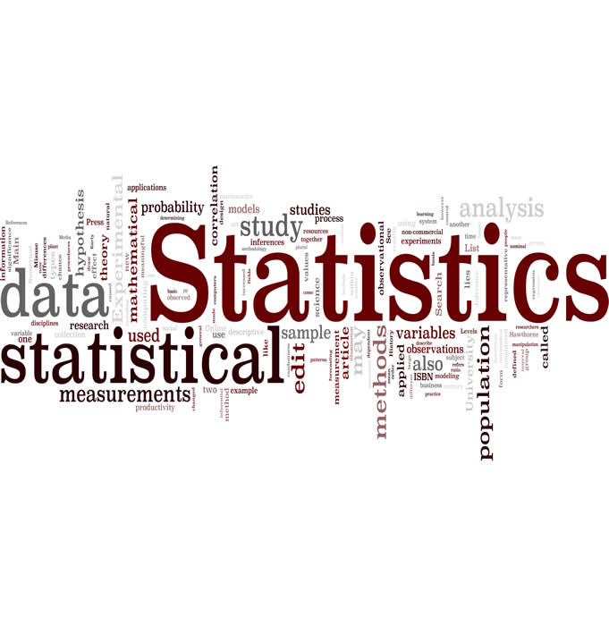

```{r pressure, echo=FALSE, out.width = '100%', fig.pos='centered'}

```


```{r setup, include=FALSE}
options(
  htmltools.dir.version = FALSE, formatR.indent = 2, width = 100, digits = 4
)


# 填上你需要用到的包，如 c('ggplot2', 'dplyr')
pkg <- c("knitr", "kfigr",  "plyr","tidyverse", "survival", "ggfortify", "survminer", "haven", "plotly","gridExtra", "Epi", "KMsurv", "gnm", "cmprsk", "mstate", "flexsurv", "splines", "epitools", "shiny", "epiR", "rgl", "ggplot2", "epiDisplay","margins" , "MASS", "psych", "lme4", "nlme", "grid", "sandwich", "kableExtra", "mvtnorm", "scatterplot3d", "car", "ggthemes", "ggsci", "DescTools", "limma", "binomTools", "ggthemr", "BSDA", "lmtest", "FSA", "exact2x2", "dagitty", "ATE", "lmerTest", "tableone", "stargazer","eha", "Hmisc", "ROCR", "PBSmodelling", "LogisticDx", "HLMdiag", "clubSandwich", "codetools", "TailRank", "runjags", "rjags", "R2jags","coda", "ggmcmc", "R2OpenBUGS", "FactoMineR", "factoextra", "jtools", "uwIntroStats")
lapply(pkg, function(pkg) {
  if (system.file(package = pkg) == '') install.packages(pkg)
})

sapply(pkg, require, character.only = TRUE)

knit_hooks$set(webgl = hook_webgl)
# ggthemr('greyscale')
# statapath <- "/usr/local/stata15/stata" # <- Ubuntu 設定你的 STATA 路徑
statapath <- "/Applications/Stata/StataSE.app/Contents/MacOS/stata-se" # <- MacOS 設定你的 STATA 路徑
# statapath <- "C:/Program Files (x86)/Stata15/Stata-64.exe" # <- Windows 設定你的 STATA 路徑
knitr::opts_chunk$set(engine.path = list(
  stata = statapath
))

bugpath <- getwd()
```

# 前言 {-}

> We are drowning in information and starving for knowledge.
>
> --- Rutherford D. Roger


~~尚未想好寫什麼作前言。~~我只是默默地想留下一些筆記和思考。本書用了兩個 R 包編譯，分別是 **knitr**\index{knitr} [@xie2015] 和 **bookdown**\index{bookdown} [@R-bookdown]。

在開始倒計時離開倫敦的時刻，我再次翻閱這些思考過的，痛苦過的，糾結過的，忐忑過的，這一年的學習筆記，感慨良多。[倫敦衛生與熱帶醫學院](https://lshtm.ac.uk/) 曾經是，現在依然還是我魂牽夢繞的學院，它的歷史積澱，它的小巧精緻，在它的樓道里度過的每一天都是那麼的充實而值得感動。這本書不僅僅是我的統計學學習的心路歷程，還傾注了這裡每一位老師，每一個一起奮鬥過的同學，我們的歡聲笑語，我們的喜怒哀樂。如果你的電腦/手機/iPad屏幕上打開了這本書，說明你將要或者已經是我的同仁，如果此生有幸相聚，我一定會敬你一杯。祝你學業有成，和我一起用數據科學解開這個世界的奧秘。為更平等的醫療，為了更自由的人類社會，奮鬥永不停止。


```{block2 index-1, type='flushright', html.tag='p'}
王超辰<br>
2017年9月於倫敦<br>
2018年7月於倫敦衛生與熱帶醫學院
```


<a rel="license" href="http://creativecommons.org/licenses/by-nc-sa/4.0/"></a><br />本著作係採用<a rel="license" href="http://creativecommons.org/licenses/by-nc-sa/4.0/">創用 CC 姓名標示-非商業性-相同方式分享 4.0 國際 授權條款</a>授權.

