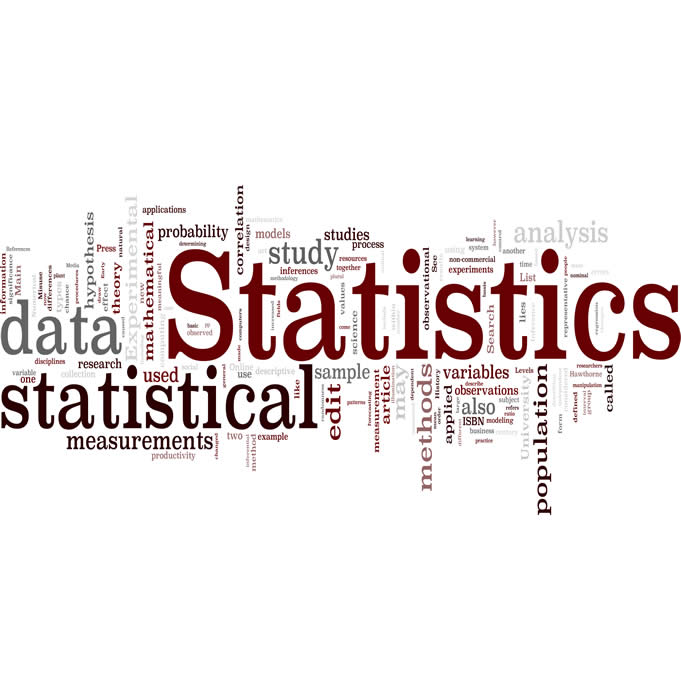

```{r pressure, echo=FALSE, out.width = '100%', fig.pos='centered'}

```


```{r setup, include=FALSE}
# Centralized setup (packages, options, bugpath, stata engine)
# Note: do NOT use local=TRUE — shim functions must be in .GlobalEnv for knitr chunks
source("R/global_setup.R")
```

# 前言 {-}

> We are drowning in information and starving for knowledge.
>
> --- Rutherford D. Roger


~~尚未想好寫什麼作前言。~~我只是默默地想留下一些筆記和思考。本書用了兩個 R 包編譯，分別是 **knitr**\index{knitr} [@xie2015] 和 **bookdown**\index{bookdown} [@R-bookdown]。

在開始倒計時離開倫敦的時刻，我再次翻閱這些思考過的，痛苦過的，糾結過的，忐忑過的，這一年的學習筆記，感慨良多。[倫敦衛生與熱帶醫學院](https://lshtm.ac.uk/) 曾經是，現在依然還是我魂牽夢繞的學院，它的歷史積澱，它的小巧精緻，在它的樓道里度過的每一天都是那麼的充實而值得感動。這本書不僅僅是我的統計學學習的心路歷程，還傾注了這裡每一位老師，每一個一起奮鬥過的同學，我們的歡聲笑語，我們的喜怒哀樂。如果你的電腦/手機/iPad屏幕上打開了這本書，說明你將要或者已經是我的同仁，如果此生有幸相聚，我一定會敬你一杯。祝你學業有成，和我一起用數據科學解開這個世界的奧秘。為更平等的醫療，為了更自由的人類社會，奮鬥永不停止。

2026年4月，距離離開倫敦已經過了將近八年。這些年來這本書一直靜靜地躺在 GitHub Pages 上，偶爾翻閱的時候總會發現有些代碼已經跑不動了，有些 R 包早就停止了更新維護。尤其是 Richard McElreath 的 `rethinking` 套件，在 macOS 上的安裝越來越令人頭疼，連帶著整本書的貝葉斯統計章節幾乎無法重新編譯。事實上這個問題我擱置了很久，一直想動手修但又怕牽一發而動全身。最終在 [GitHub Copilot](https://github.com/features/copilot) 的全力協助下，我們花了整整一個星期，把第八章（貝葉斯入門）的全部12個 Session 從 `rethinking` 遷移到了 `brms`，順帶把全書的基礎設施也做了一次大翻修——統一了套件管理、修復了 JAGS 相容性問題、建立了集中式的 shim 函數庫、解決了 bookdown 單一 R session 下跨章節變數名衝突等等。不難注意到這次翻修的規模相當大，改動涉及了數十個文件和數百個代碼塊，但最終整本書的405個代碼塊全部通過了編譯，148個 HTML 頁面完整生成。這大概是 AI 輔助寫作和代碼遷移的一個很好的實踐案例。在此要特別感謝 GitHub Copilot，沒有它的耐心和能力，這次翻修根本不可能在這麼短的時間內完成。


```{block2 index-1, type='flushright', html.tag='p'}
王超辰<br>
2017年9月於倫敦<br>
2018年7月於倫敦衛生與熱帶醫學院<br>
2026年4月於長久手
```


## 授權 {-}

<a rel="license" href="http://creativecommons.org/licenses/by-nc-sa/4.0/"></a><br />本書以<a rel="license" href="http://creativecommons.org/licenses/by-nc-sa/4.0/">CC BY-NC-SA 4.0 國際授權條款</a>釋出。課程原始教材的版權歸倫敦衛生與熱帶醫學院 (LSHTM) 及各講師所有。第八章 Sessions 06–16 的學習筆記基於 Richard McElreath 的 *Statistical Rethinking* 教科書，程式碼已從 `rethinking` 遷移至 `brms`，並非原始程式碼的直接複製。本授權僅適用於作者的原創評論、翻譯、程式碼改編和補充內容。

